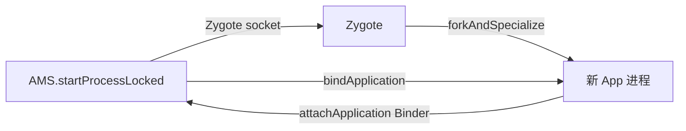

# AMS 进程调度与 LMK 深度解析

> 基于 AOSP `frameworks/base/services/core/java/com/android/server/am`（ActivityManagerService / ProcessList / OomAdjuster）
> 与内核 `drivers/staging/android/lowmemorykiller.c`（旧）/ `drivers/android/lmkd` 相关。
> 本文聚焦「AMS 怎么给进程定优先级、内核 LowMemoryKiller 怎么据此杀进程」。

---

## 目录

1. AMS 在进程调度里的角色
2. 进程优先级：oom_adj 与 oom_score_adj
3. 优先级级别（adj 含义）
4. updateOomAdjLocked / applyOomAdjLocked
5. LowMemoryKiller：内核的杀手
6. 进程生命周期：从生到死
7. 与 Zygote 的关系
8. 关键类与文件索引

---

## 1. AMS 在进程调度里的角色

AMS 是「四大组件生命周期 + 进程 + 内存」的总闸。它**不直接调度 CPU**（那是内核调度器的事），而是管理**进程的重要性（importance）**，并把这个重要性换算成 `oom_score_adj` 写给内核——内核的 **LowMemoryKiller（LMK）** 据此在内存紧张时挑进程杀。

```mermaid
graph TD
    AMS[ActivityManagerService] -->|算 adj| OOM[OomAdjuster<br/>updateOomAdjLocked]
    OOM -->|write oom_score_adj| Proc[/proc/pid/oom_score_adj]
    Kernel[内核 LowMemoryKiller] -->|读阈值| Proc
    Kernel -->|内存不足| Kill[杀进程]
    AMS -->|startProcessLocked| Zygote[Zygote fork]
```

---

## 2. 进程优先级：oom_adj 与 oom_score_adj

Linux 本身有 OOM killer，凭每个进程的 `oom_score`（由内存占用算）挑受害者。Android 在这个机制上加了一层 **oom_score_adj**（范围 `-1000` ~ `1000`）：

- 值越小 → 越重要 → 越晚被杀（foreground app 约 `-900` ~ `0`）
- 值越大 → 越不重要 → 越早被杀（cached/empty 进程约 `900` ~ `1000`）
- `-1000` 表示**永不杀**（如 system_server、内核线程）

最终内核算出的 `oom_score = oom_score_adj + 内存占比`，LMK 用这个分数和阈值比较。

AMS 把这个值通过 `Process.setOomScoreAdj()` 写进 `/proc/<pid>/oom_score_adj`。

---

## 3. 优先级级别（adj 含义）

`frameworks/base/services/core/java/com/android/server/am/ProcessList.java` 定义了一组常量：

| adj 常量 | 值 | 含义 |
|----------|-----|------|
| `NATIVE_ADJ` | -1000 | native 系统进程（绝不杀） |
| `SYSTEM_ADJ` | -900 | system_server |
| `PERSISTENT_PROC_ADJ` | -800 | 持久进程（phone 等） |
| `FOREGROUND_APP_ADJ` | 0 | 前台 App（用户正在用） |
| `VISIBLE_APP_ADJ` | 100 | 可见但非前台（如半透明覆盖） |
| `PERCEPTIBLE_APP_ADJ` | 200 | 可感知（如后台播放音乐） |
| `BACKUP_APP_ADJ` | 300 | 正在备份 |
| `HEAVY_WEIGHT_APP_ADJ` | 400 | 重进程 |
| `SERVICE_ADJ` | 500 | 后台服务 |
| `HOME_APP_ADJ` | 600 | Launcher |
| `PREVIOUS_APP_ADJ` | 700 | 上一个 App |
| `CACHED_APP_MIN_ADJ` | 900 | 缓存进程（最低优先） |
| `CACHED_APP_MAX_ADJ` | 999 | 缓存空进程 |

规律：**数字越小越重要，前台是 0，越往后台数字越大，缓存进程接近 1000**。

---

## 4. updateOomAdjLocked / applyOomAdjLocked

AMS 在进程状态变化时重算 adj（如 Activity resume/pause、Service 启停）：

```java
// frameworks/base/services/core/java/com/android/server/am/OomAdjuster.java
void updateOomAdjLocked(ProcessRecord app, ...) {
    // 1) 根据 app 当前持有的组件（前/后台 Activity、Service、Provider、Connection）
    //    决定 computeOomAdjLocked 里的最终 adj / scheduleTrimMemory 级别
    computeOomAdjLocked(app, ...);
    // 2) 把算出的 adj / procState 真正应用下去
    applyOomAdjLocked(app, ...);
}

boolean applyOomAdjLocked(ProcessRecord app, ...) {
    // 写 /proc/<pid>/oom_score_adj
    Process.setOomScoreAdj(app.pid, app.curAdj);
    // 通知 LMKD（userspace lmk 守护进程）该进程的级别
    mProcessList.applyOomAdjLmw(app);
    // 设置调度 group（前台走 cpuctl 高优先级 group，后台走 bg 组限流）
    ...
}
```

`computeOomAdjLocked` 的核心逻辑（简化）：
- 有**前台 Activity** → `FOREGROUND_APP_ADJ`(0)
- 有**可见 Activity**（非焦点）→ `VISIBLE_APP_ADJ`
- 有**前台 Service / 绑定到前台的 Service** → 提升到 `SERVICE_ADJ` 之上
- 仅**缓存** → `CACHED_APP_MIN_ADJ` 起

> 注：新版本 Android 用 **lmkd（userspace Low Memory Killer Daemon）** 取代部分内核 LMK 逻辑，AMS 通过 `lmkd` socket 把 adj/内存阈值告诉 lmkd，由它在用户态决策杀进程，更灵活。

---

## 5. LowMemoryKiller：内核的杀手

传统内核 LMK 通过 `/sys/module/lowmemorykiller/parameters/` 暴露阈值：

```text
# 六个级别，对应不同 adj 的内存阈值（单位为 page 或 KB，按版本不同）
minfree: 18432,23040,27648,32256,55296,80640
adj:     0,100,200,300,900,906
```

含义：当系统空闲内存低于某级 `minfree` 时，杀掉所有 `oom_score_adj >= 对应 adj` 的进程。例如空闲内存低于 18432 页时，杀掉 adj ≥ 0（前台及以下，实际从前台之外开始）的进程——越紧张杀得越狠。

```c
// drivers/staging/android/lowmemorykiller.c（旧版示意）
static int lowmem_shrink(...) {
    // 遍历所有进程，找 oom_score_adj >= 选定阈值的、oom_score 最大的
    // 调 kill_pid 杀掉，直到回收足够内存
    for_each_process(p) {
        if (p->oom_score_adj >= selected_adj) {
            if (p->oom_score > selected_oom_score) {
                selected = p;  // 记最该杀的
            }
        }
    }
    kill_process(selected, ...);
}
```

AMS 启动时也会通过 `ProcessList` 把 `minfree/adj` 写入这些 sysfs 节点（按设备内存档位调整）。

---

## 6. 进程生命周期：从生到死

**生**（前面进程孵化文章详述）：

```java
// frameworks/base/services/core/java/com/android/server/am/ProcessList.java
ProcessRecord startProcessLocked(...) {
    // 经 Zygote socket 请求 fork
    final Process.ProcessStartResult startResult =
        Process.start(entryPoint,  // "android.app.ActivityThread"
            app.processName, uid, gid, gids, ...);
    // 记录 ProcessRecord，等 App 反连 attachApplication
}
```

App 起来后反连 AMS：

```java
// frameworks/base/core/java/android/app/ActivityThread.java
public void attach(boolean system, long startSeq) {
    final IActivityManager mgr = ActivityManager.getService();
    mgr.attachApplication(mAppThread, startSeq);  // Binder 回 system_server
}
```

```java
// ActivityManagerService.attachApplication()
thread.bindApplication(...);   // → Application.onCreate
mAtmInternal.attachApplication(app);  // → 启动 pending 的 Activity
```

**死**：进程被 LMK 杀、或 crash、或被 `kill` 后，内核通知 AMS（通过 Binder 死亡回调 `linkToDeath`）：

```java
// ActivityManagerService 收到进程死亡
void handleAppDiedLocked(ProcessRecord app, ...) {
    // 清理该进程持有的 Activity/Service/Provider
    // 重建必要组件（如前台 Activity 重新拉起）
    mProcessList.removeProcessLocked(app, ...);
}
```

---

## 7. 与 Zygote 的关系

AMS 不自己 `fork`，它把「生进程」委托给 Zygote（详见《init→Zygote→App 进程孵化体系》）：



AMS 只负责**调度与记账**（adj、组件归属），真正的进程创建由 Zygote 完成——这把「创建开销」和「调度策略」解耦。

---

## 8. 关键类与文件索引

| 类 / 函数 | 文件 | 职责 |
|-----------|------|------|
| `ActivityManagerService` | `am/ActivityManagerService.java` | 进程/组件总闸、进程死亡处理 |
| `ProcessList` | `am/ProcessList.java` | adj 常量、startProcessLocked、阈值写入 |
| `OomAdjuster` | `am/OomAdjuster.java` | updateOomAdjLocked / applyOomAdjLocked |
| `ProcessRecord` | `am/ProcessRecord.java` | 单个进程的全部状态 |
| `Process` (java) | `frameworks/base/core/java/android/os/Process.java` | setOomScoreAdj / start |
| LowMemoryKiller | `drivers/staging/android/lowmemorykiller.c` | 内核杀手（旧） |
| lmkd | `system/core/lmkd/` | 用户态 LMK 守护进程（新） |

---

## 一句话总结

> AMS 不直接杀进程，它只**计算每个进程的重要性并换算成 `oom_score_adj` 写给内核**；内核（或新版 lmkd）在内存紧张时按 `minfree/adj` 阈值挑 `oom_score` 最大的进程杀掉。前台 App 是 0、越往后台数字越大、缓存进程接近 1000——这套 adj 体系就是 Android 在「流畅」和「内存」之间走钢丝的平衡杆，而进程的真正诞生始终由 Zygote 完成。
