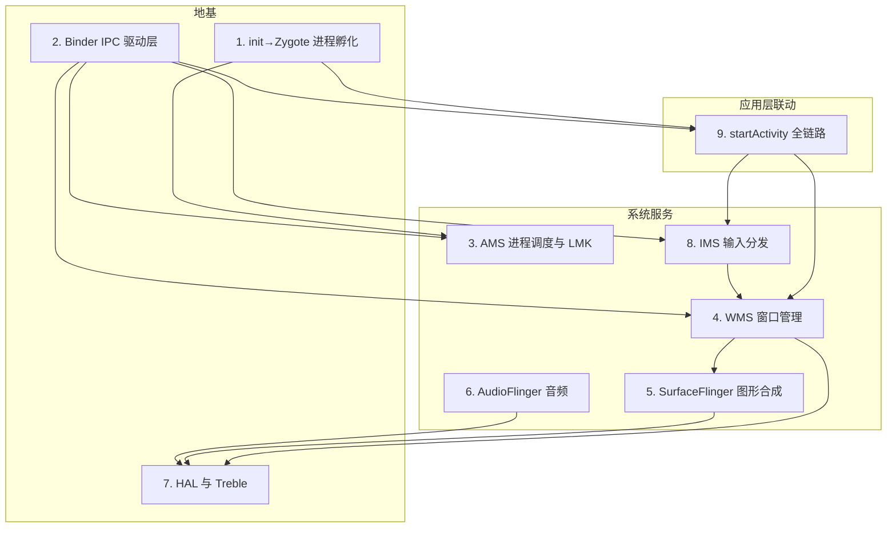

# Android Framework 深度解析体系 · 索引与学习路线图

> 本目录收录一套基于 **AOSP（`frameworks/base` + `frameworks/native` + `system/core` + `kernel`）代码层面** 的 Android Framework 深度解析文章。
> 每篇都配真实文件路径 + 方法名 + mermaid 流程图/时序图，互相呼应，可按依赖关系串联成完整主线。

---

## 一、完整 11 篇清单

| # | 文章 | 覆盖主线 | 文件 |
|---|------|----------|------|
| 1 | init→Zygote→App 进程孵化体系 | **进程怎么生**（fork+execve / Zygote fork / socket 协议 / forkAndSpecialize） | `20260714_init_Zygote_App_进程孵化体系.md` |
| 2 | Binder IPC 与驱动层深度解析 | **IPC 基石**（mmap 一次拷贝 / AIDL Proxy-Stub / UID 校验 / ServiceManager） | `20260714_Binder_IPC_与_驱动层深度解析.md` |
| 3 | AMS 进程调度与 LMK 深度解析 | **进程调度**（oom_score_adj / OOM 级别 / LowMemoryKiller / 进程生灭） | `20260714_AMS_进程调度与_LMK_深度解析.md` |
| 4 | WindowManagerService 窗口管理机制 | **窗口**（容器树 / addWindow / Z-order / 焦点 / SurfaceControl） | `20260714_WindowManagerService_窗口管理机制深度剖析.md` |
| 5 | SurfaceFlinger 图形合成流程 | **图形**（handleMessageRefresh 四步 / OVERLAY vs GLES） | `20260714_SurfaceFlinger_图形合成流程全解析.md` |
| 6 | AudioFlinger 与 AudioPolicyService | **音频**（APS 决策 / AF 混音 / AudioTrack 共享内存） | `20260714_AudioFlinger_与_AudioPolicyService_音频框架解读.md` |
| 7 | HAL 与 Treble 硬件抽象层 | **硬件边界**（HIDL / stable AIDL / hwbinder / hwservicemanager） | `20260714_HAL_与_Treble_硬件抽象层.md` |
| 8 | IMS 输入事件分发链路深度解析 | **输入**（evdev→InputReader→InputDispatcher→WMS 焦点→InputChannel→onTouchEvent） | `20260714_IMS_输入事件分发链路深度解析.md` |
| 9 | startActivity 全链路深度解析 | **组件启动**（Instrumentation→ATMS→ActivityStarter flag→Zygote fork→ActivityThread） | `20260714_startActivity_全链路深度解析.md` |
| 10 | Framework 调试实战 | **观测与排障**（dumpsys activity/wm/sf、logcat TAG、systrace 掉帧） | `20260714_Framework_调试实战.md` |
| 11 | Framework 开发实战 | **动手改造**（envsetup/lunch/make、m/adb sync、新增系统服务、新增 HAL、Native 验证、atest） | `20260715_Framework_开发实战.md` |

---

## 二、依赖关系图（建议阅读顺序）



**主线串联**：

```
init 生出 Zygote
  → Zygote fork 出 system_server 和 App
  → App 通过 Binder 调 AMS/WMS/IMS
  → AMS 按 oom_adj 管进程生死、WMS 管窗口
  → SurfaceFlinger 合成上屏、AudioFlinger 混音出声
  → IMS 走 InputChannel 把触摸事件送回 App
  → 最底层全靠 HAL/Treble 对接内核驱动碰硬件
```

---

## 三、按主题快速索引

### A. 进程与 IPC（地基）
- 进程怎么生：`1. init→Zygote` → `9. startActivity 里的 Zygote fork`
- 跨进程通信：`2. Binder` → `9. startActivity 的三次 Binder 跨进程`
- 进程生死：`3. AMS 与 LMK`

### B. 图形与窗口
- 窗口建立：`4. WMS` → `9. startActivity 的 addWindow`
- 合成上屏：`5. SurfaceFlinger`
- 输入打通：`8. IMS` 的 InputChannel（由 WMS 在 addWindow 时开通）

### C. 音频（独立 HAL 链路）
- `6. AudioFlinger` → `7. HAL`

### D. 硬件边界
- `7. HAL 与 Treble`：所有系统服务最终都经它碰硬件

---

## 四、阅读建议

1. **新手入门**：按编号 1 → 2 → 9 → 4 → 5 → 8，先建立「进程-IPC-启动-窗口-图形-输入」的闭环认知。
2. **图形专项**：4 → 5 → 8（WMS 建窗 → SurfaceFlinger 合成 → IMS 把事件送回窗口）。
3. **音频专项**：7 → 6（先懂 HAL 抽象，再看 AF 怎么用 HAL）。
4. **进程专项**：1 → 2 → 3（进程怎么生、怎么通信、怎么死）。
5. **排障专项**：10（把上面各篇的原理变成可观察、可定位的命令与 trace）。
6. **开发专项**：11（把原理落成 AOSP 改造能力：改 Java/Native/HAL、上新服务、增量编译验证）。

---

## 五、配套图示（之前对话生成的 SVG）

- `touch_event_sequence.svg` — 触摸事件到 onTouchEvent 时序图
- `surfaceflinger_composition_compare.svg` — SurfaceFlinger OVERLAY vs GLES 合成分工对比图

（注：mermaid 图在 GitHub / Obsidian / Typora / VS Code（装 mermaid 插件）可直接渲染；阅读器不支持时显示为代码块，不影响正文。）
