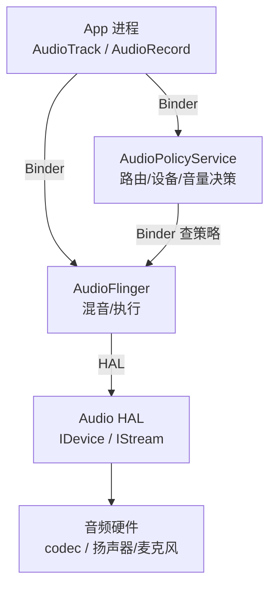
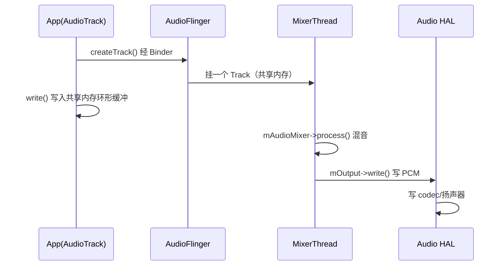

# AudioFlinger 与 AudioPolicyService 音频框架解读

> 基于 AOSP `frameworks/av/services/audioflinger` 与 `frameworks/av/services/audiopolicy`。
> 本文聚焦「一段声音从 App 到扬声器，中间经过哪些服务、谁做决策、谁做混音」。

---

## 目录

1. 音频框架总览
2. AudioPolicyService：策略大脑
3. AudioFlinger：混音与执行
4. 播放链路：AudioTrack → MixerThread → HAL
5. 录制链路：AudioRecord → RecordThread
6. APS 与 AF 的协作：openOutput / getOutputForAttr
7. HAL 接口：IDevice / IStream
8. 关键类与文件索引

---

## 1. 音频框架总览

Android 音频栈分两层 native 系统服务 + 一层 HAL：



- **AudioPolicyService（APS）**：只做「决策」——选哪个输出设备（扬声器/耳机/BT）、选哪条输出流、音量多少、是否要把某路静音。它**不碰音频数据**。
- **AudioFlinger（AF）**：做「执行」——把多个 App 的音频流**混音**成一路，管理播放/录制线程，把数据写进 HAL。它**处理真实的 PCM 数据**。
- **Audio HAL**：厂商实现的硬件抽象层，`IDevice` 打开 `IStream`（playback/capture），真正读写硬件。

---

## 2. AudioPolicyService：策略大脑

APS 在 `system_server` 启动时由 `SystemServer` 拉起（类似其他系统服务），但实际代码在 `frameworks/av/services/audiopolicy`。

核心职责（决策）：
1. **设备选择**：根据耳机插入、蓝牙连接、路由请求，决定当前 active 输出设备
2. **流/策略路由**：`getOutputForAttr()` 决定一段播放应该用哪条 `audio_io_handle_t`（输出流）
3. **音量**：`setStreamVolume()` 计算并下发音量（带 `AudioPolicyManager` 的曲线/策略）
4. **焦点**：音频焦点（AudioFocus）的仲裁也在这一层（与 AF 协作）

```cpp
// frameworks/av/services/audiopolicy/service/AudioPolicyService.cpp
void AudioPolicyService::onFirstRef() {
    // 构造 AudioPolicyManager，加载 audio_policy 配置（/vendor/etc/audio_policy*.xml）
    mAudioPolicyManager = createAudioPolicyManager(this);
    // 监听设备插拔、路由变化
    mAudioPolicyManager->setObserver(this);
}
```

实际的策略全在 `AudioPolicyManager`：

```cpp
// frameworks/av/services/audiopolicy/managerdefault/AudioPolicyManager.cpp
audio_io_handle_t AudioPolicyManager::getOutputForAttr(...) {
    // 1) 按 usage/flags 选 strategy
    // 2) 按 strategy + 当前设备选 output desc
    // 3) 不存在则让 AF 打开一条新输出
    return mOutputMap.indexOfKey(output);
}
```

APS 自己不直接开硬件——它**通过 Binder 调 AudioFlinger 的 `openOutput()`** 让 AF 真正建一条输出流，它只拿到句柄并记录策略。

---

## 3. AudioFlinger：混音与执行

```cpp
// frameworks/av/services/audioflinger/AudioFlinger.cpp
void AudioFlinger::onFirstRef() {
    // 创建 PatchPanel、DevicesFactoryHal（HAL 入口）
    mDevicesFactoryHal = DevicesFactoryHalInterface::create();
    mEffectsFactoryHal = EffectsFactoryHalInterface::create();
}
```

AF 内部以 **Thread 模型** 管理每条输出/输入流：

```mermaid
graph TD
    T1[PlaybackThread::MixerThread<br/>混音线程] -->|混多路| Out1[HAL OutputStream 1]
    T2[PlaybackThread::DirectThread<br/>直通(不混音)] --> Out2[HAL OutputStream 2]
    T3[RecordThread<br/>录制线程] -->|采集| Cap[HAL InputStream]
    AT1[AudioTrack 1] --> T1
    AT2[AudioTrack 2] --> T1
    AR[AudioRecord] --> T3
```

每条 `PlaybackThread` 持有一个自己的 **混音缓冲区（mMixerBuffer）**：
- `MixerThread`：把挂在该线程上的所有 `Track` 的 PCM 按比例混音
- `DirectThread`：不混音，直接透传给 HAL（用于高质量/压缩音频，如 HDMI 透传）
- `RecordThread`：从输入流采集，分发给各 `RecordTrack`

线程主循环（简化）：

```cpp
// frameworks/av/services/audioflinger/Threads.cpp
bool AudioFlinger::PlaybackThread::threadLoop() {
    while (!exitPending()) {
        // 1) 等时序/数据就绪
        mMixerStatus = prepareTracks_l(&framesToWrite);  // 准备各 Track 混音参数
        // 2) 混音
        if (mMixerStatus == MIXER_READY) {
            mAudioMixer->process();   // 真正的混音运算（NEON/SSE 优化）
        }
        // 3) 写入 HAL
        int bytesWritten = mOutput->write(mMixerBuffer, framesToWrite * mFrameSize);
        // 4) 等下一周期（与硬件时钟对齐）
        ...
    }
}
```

---

## 4. 播放链路：AudioTrack → MixerThread → HAL

App 侧：

```java
// frameworks/base/media/java/android/media/AudioTrack.java
AudioTrack track = new AudioTrack.Builder()
    .setAudioAttributes(new AudioAttributes.Builder()
        .setUsage(AudioAttributes.USAGE_MEDIA).build())
    .setAudioFormat(new AudioFormat.Builder()
        .setSampleRate(44100).setChannelMask(AudioFormat.CHANNEL_OUT_STEREO)
        .setEncoding(AudioFormat.ENCODING_PCM_16BIT).build())
    .build();
track.play();
track.write(pcmBuffer, 0, pcmBuffer.length);   // ← 写音频数据
```

native 侧跨进程流转：



关键细节：
- `AudioTrack` 与 AF 之间用 **共享内存（MemoryDealer / FIFO）** 传 PCM，write 不每次跨 Binder（只有控制命令跨 Binder）
- `createTrack()` 时 AF 让 APS 先 `getOutputForAttr()` 决定走哪条输出，再在该线程上建 Track
- `mAudioMixer->process()` 把所有 Track 按音量/格式混成一路（C 实现 + SIMD 优化）

---

## 5. 录制链路：AudioRecord → RecordThread

```java
// frameworks/base/media/java/android/media/AudioRecord.java
AudioRecord record = new AudioRecord.Builder()
    .setAudioSource(MediaRecorder.AudioSource.MIC)
    .setAudioFormat(new AudioFormat.Builder()
        .setSampleRate(16000).setChannelMask(AudioFormat.CHANNEL_IN_MONO)
        .setEncoding(AudioFormat.ENCODING_PCM_16BIT).build())
    .build();
record.startRecording();
record.read(pcmBuffer, 0, pcmBuffer.length);
```

录制方向相反：HAL → RecordThread 采集 → 写入共享内存 → App `read()` 取出。APS 侧对应 `getInputForAttr()` 决策输入设备（主麦/通话麦/蓝牙麦）。

---

## 6. APS 与 AF 的协作：openOutput / getOutputForAttr

典型协作顺序（以一段媒体播放为例）：

1. App 调 `AudioTrack` → `AudioSystem::getOutputForAttr()`
2. `AudioSystem` 转 Binder 到 **APS**，`AudioPolicyManager::getOutputForAttr()` 选设备与输出
3. 若该输出流还没开，APS 调 **AF `openOutput()`** 让 AF 建一条 `PlaybackThread` + 打开 HAL `IStream`
4. AF 返回 `audio_io_handle_t`，APS 把它回给 App
5. App `createTrack()` 在该线程上挂 Track，开始写数据

```cpp
// frameworks/av/services/audioflinger/AudioFlinger.cpp
status_t AudioFlinger::openOutput(audio_module_handle_t module,
                                  audio_io_handle_t* output,
                                  audio_config_t* config,
                                  audio_devices_t device,
                                  const char* address,
                                  uint32_t* latencyMs,
                                  audio_output_flags_t flags) {
    // 1) 经 DevicesFactoryHal 打开 HAL 的 IDevice
    // 2) IDevice::openOutputStream() 拿到 IStream
    // 3) 按 flags 创建对应 PlaybackThread（Mixer/Direct/Offload）
    sp<PlaybackThread> thread = new MixerThread(this, outputStream, ...);
    mPlaybackThreads.add(*output, thread);
    thread->start();   // 启动混音线程
    return NO_ERROR;
}
```

---

## 7. HAL 接口：IDevice / IStream

`hardware/interfaces/audio`（HIDL，正逐步迁移到 AIDL）：

```cpp
// 打开设备
Return<void> IDevice::openOutputStream(int32_t ioHandle,
        const DeviceAddress& device, const AudioConfig& config,
        AudioOutputFlags flags, openOutputStream_cb _hidl_cb);
// 播放（写 PCM）
Return<uint64_t> IStreamOut::write(const hidl_vec<uint8_t>& audioData);

// 打开输入
Return<void> IDevice::openInputStream(... openInputStream_cb);
// 录制（读 PCM）
Return<void> IStreamIn::read(read_cb _hidl_cb);
```

- `IDevice`：代表一个音频硬件（如主 codec、BT 芯片）
- `IStreamOut` / `IStreamIn`：代表一条具体的播放/录制流
- 厂商实现在 `vendor/` 下，AF 通过 `DevicesFactoryHalInterface::create()` 加载

---

## 8. 关键类与文件索引

| 类 / 函数 | 文件 | 职责 |
|-----------|------|------|
| `AudioPolicyService` | `frameworks/av/services/audiopolicy/service/AudioPolicyService.cpp` | 策略服务入口 |
| `AudioPolicyManager` | `frameworks/av/services/audiopolicy/managerdefault/AudioPolicyManager.cpp` | 路由/设备/音量决策 |
| `AudioFlinger` | `frameworks/av/services/audioflinger/AudioFlinger.cpp` | 混音/执行服务 |
| `PlaybackThread` | `frameworks/av/services/audioflinger/Threads.cpp` | 播放线程（Mixer/Direct） |
| `RecordThread` | 同上 | 录制线程 |
| `AudioMixer` | `frameworks/av/services/audioflinger/AudioMixer.cpp` | 混音运算 |
| `AudioTrack` (java) | `frameworks/base/media/java/android/media/AudioTrack.java` | App 播放 API |
| `AudioRecord` (java) | `frameworks/base/media/java/android/media/AudioRecord.java` | App 录制 API |
| `AudioSystem` | `frameworks/base/media/java/android/media/AudioSystem.java` | App 与音频服务的桥 |
| Audio HAL | `hardware/interfaces/audio` | IDevice / IStream 接口 |

---

## 一句话总结

> AudioPolicyService 是「大脑」：决定声音走哪条路、用哪个设备、多大音量；AudioFlinger 是「双手」：把多个 App 的 PCM 在 `MixerThread` 里混成一路，写进 Audio HAL。App 的 `AudioTrack.write()` 通过共享内存把 PCM 喂给混音线程，几乎不跨 Binder——跨 Binder 的只有 `createTrack`/`getOutputForAttr` 这类控制命令。
