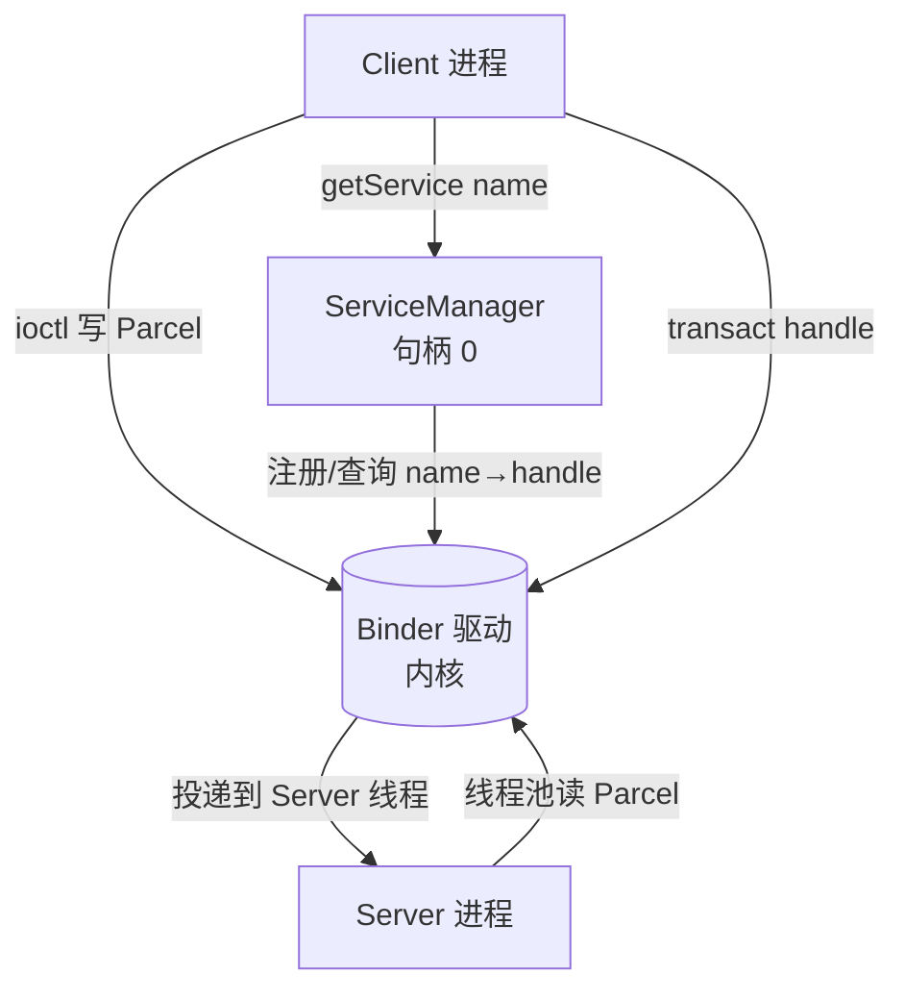
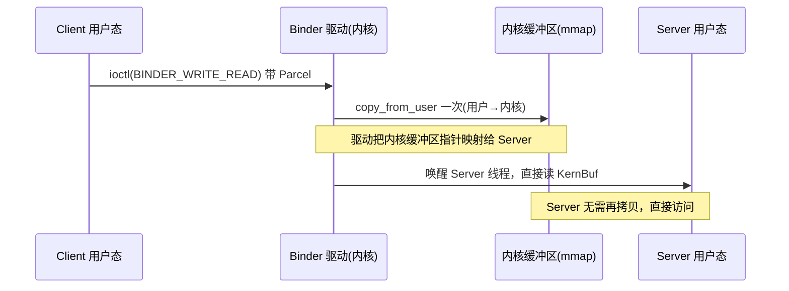

# Binder IPC 与驱动层深度解析

> 基于 AOSP `frameworks/native/libs/binder` + 内核 `drivers/android/binder.c`（旧版 `drivers/staging/android/binder.c`）。
> 本文聚焦「为什么是 Binder、一次拷贝怎么做到的、AIDL 的 Proxy/Stub 到底生成了什么」。

---

## 目录

1. 为什么 Android 需要 Binder
2. 四角色架构：Client / Server / ServiceManager / 驱动
3. 一次拷贝原理：mmap 内存映射
4. AIDL 的 Proxy / Stub：transact 与 onTransact
5. Binder 线程池与同步调用
6. 身份校验：UID / PID 从哪来
7. ServiceManager：句柄 0 的注册中心
8. 关键类与文件索引

---

## 1. 为什么 Android 需要 Binder

传统 Linux IPC（管道、socket、共享内存、消息队列）在移动场景各有短板：

| IPC | 缺点 |
|-----|------|
| 管道 / socket | 数据要**两次拷贝**（用户态→内核→用户态），且每次通信都有上下文切换开销 |
| 共享内存 | 零拷贝，但**无内置同步/身份校验**，需要自己解决并发与权限 |
| 消息队列 | 有大小/数量限制，拷贝次数多 |

Binder 为移动设备做了三点专门优化：
- **一次拷贝**（不是零拷贝，但远优于两次）：内核 Binder 驱动一次性把数据从发送方映射到接收方地址空间
- **基于句柄（handle）的引用**：Client 拿到的是 `IBinder` 句柄，驱动负责翻译成真实目标
- **内置身份校验**：驱动在跨进程时附带调用方 `UID/PID`，Server 可直接 `getCallingUid()` 做权限判断

---

## 2. 四角色架构



- **Client / Server**：通信两端（如 App 是 Client，system_server 里的 AMS 是 Server）
- **ServiceManager**：DNS 角色，把「服务名」映射到「Binder 句柄」，自身句柄固定为 **0**
- **Binder 驱动**：内核中的 `binder.c`，负责数据搬运、句柄翻译、线程调度、身份记录

---

## 3. 一次拷贝原理：mmap 内存映射

Binder 的「一次拷贝」靠**内核缓冲区 + mmap 共享**实现：



驱动侧关键：

```cpp
// drivers/android/binder.c
static int binder_open(struct inode *nodp, struct file *filp) {
    struct binder_proc *proc = kzalloc(sizeof(*proc), GFP_KERNEL);
    // 每个进程打开 /dev/binder 时建立一个 binder_proc
    filp->private_data = proc;
    ...
}

static int binder_mmap(struct file *filp, struct vm_area_struct *vma) {
    // 把一块内核虚拟地址(vm_struct)映射到进程用户空间 vma
    // 这块区域就是「内核缓冲区」，Client 写的数据落在驱动内核态，
    // Server 进程通过 mmap 同一块物理页直接看到 —— 这就是一次拷贝的根
    binder_alloc_mmap_locked(proc, vma);
}
```

交易写入（简化）：

```cpp
static void binder_transaction(struct binder_proc *proc, struct binder_thread *thread,
                               struct binder_transaction_data *tr) {
    // 1) 找到目标 proc（根据 handle 翻译）
    // 2) 分配/复用内核缓冲区
    // 3) copy_from_user() —— 唯一一次数据拷贝（Client 用户态 → 驱动内核态）
    binder_alloc_copy_user_to_buffer(...);
    // 4) 把缓冲区指针挂到目标线程的 todo 队列，唤醒它
    //    Server 进程之前已 mmap 同一块内存，醒来直接读，无需再拷贝
    wake_up_interruptible(target_thread->wait);
}
```

对比 socket 的「Client 用户态 → 内核 socket 缓冲 → Server 内核态 → Server 用户态」两次拷贝，Binder 省掉第二次。

---

## 4. AIDL 的 Proxy / Stub：transact 与 onTransact

AIDL（Android Interface Definition Language）编译后生成 Java/C++ 的 **Proxy（客户端桩）** 和 **Stub（服务端桩）**，替你写好了打包/解包样板。

定义一个接口：

```aidl
// IMyService.aidl
interface IMyService {
    int add(int a, int b);
    void greet(String name);
}
```

编译后生成（简化）：

```java
// 自动生成：IMyService.java
public interface IMyService extends IInterface {
    // ---- Stub：运行在 Server 端 ----
    public static abstract class Stub extends Binder implements IMyService {
        @Override
        public boolean onTransact(int code, Parcel data, Parcel reply, int flags) {
            switch (code) {
                case TRANSACTION_add:
                    int a = data.readInt();
                    int b = data.readInt();
                    int result = this.add(a, b);     // 调用真正实现
                    reply.writeInt(result);
                    return true;
            }
            return super.onTransact(code, data, reply, flags);
        }
    }
    // ---- Proxy：运行在 Client 端 ----
    public static class Proxy implements IMyService {
        private IBinder mRemote;
        public int add(int a, int b) {
            Parcel data = Parcel.obtain();
            Parcel reply = Parcel.obtain();
            data.writeInt(a); data.writeInt(b);
            mRemote.transact(Stub.TRANSACTION_add, data, reply, 0); // 跨进程！
            int result = reply.readInt();
            return result;
        }
    }
}
```

关键点：
- `Proxy.add()` 把参数写进 `Parcel` → `mRemote.transact()` → 经 Binder 驱动跨进程
- 驱动把请求投到 Server 的 Binder 线程，`Stub.onTransact()` 解出参数 → 调真正实现 → 结果写回 `reply`
- 对 App 开发者，调 `add()` 看起来就是一次普通的本地方法调用——**样板全在 AIDL 生成的 Proxy/Stub 里**

`IBinder.transact()` 落地到 native（`frameworks/native/libs/binder/Binder.cpp`）→ `ioctl(BINDER_WRITE_READ)` 进入驱动。

---

## 5. Binder 线程池与同步调用

- **Client 端**：`transact()` 是**同步阻塞**的（除非 flag=`FLAG_ONEWAY`），线程一直等到 `reply` 回来
- **Server 端**：每个 Binder 服务有一个**线程池**（`IPCThreadState::self()->joinThreadPool()` 起多个 `Binder` 线程），并发处理多个 Client 请求

```cpp
// frameworks/native/libs/binder/ProcessState.cpp
// 默认 Binder 线程池上限
static const int DEFAULT_MAX_BINDER_THREADS = 15;
```

`FLAG_ONEWAY` 的请求（如某些通知类调用）是异步的：Client 发了就返回，Server 收到后处理，无 reply。

---

## 6. 身份校验：UID / PID 从哪来

Binder 驱动在跨进程时**自动附加**调用方的 `UID/PID`，Server 端无需信任 Client 自报：

```java
// frameworks/base/core/java/android/os/Binder.java
public final int getCallingUid() { return nativeGetCallingUid(); }
public final int getCallingPid() { return nativeGetCallingPid(); }
```

```cpp
// drivers/android/binder.c —— 驱动在 transaction 里填入发送方进程信息
t->sender_euid = proc->tsk->cred->euid;
t->sender_pid  = proc->tsk->pid;
```

所以 AMS 等服务能安全做权限判断：`if (getCallingUid() != targetUid) throw SecurityException();`。**这就是为什么 Binder 比「自己带 UID」的 IPC 更安全**——UID 由内核背书，Client 无法伪造。

---

## 7. ServiceManager：句柄 0 的注册中心

服务启动后向 ServiceManager 注册名字：

```cpp
// frameworks/native/cmds/servicemanager/ - 本身也是一个 Binder 服务，句柄固定 0
// Server 侧注册
defaultServiceManager()->addService(String16("activity"), binder);
// Client 侧查询（handle 0 是 ServiceManager 自己）
sp<IBinder> b = defaultServiceManager()->getService(String16("activity"));
```

`defaultServiceManager()` 内部用句柄 **0** 直接连 ServiceManager，再由它把 `"activity"` 翻译成 AMS 的真实 handle——这正是「DNS 解析」。

---

## 8. 关键类与文件索引

| 类 / 函数 | 文件 | 职责 |
|-----------|------|------|
| `binder_open` / `binder_mmap` / `binder_transaction` | `drivers/android/binder.c` | 驱动：开设备、映射、交易 |
| `ProcessState` | `frameworks/native/libs/binder/ProcessState.cpp` | 进程级 Binder 单例、线程池 |
| `IPCThreadState` | `frameworks/native/libs/binder/IPCThreadState.cpp` | 单线程 Binder 命令收发 |
| `Binder` (java) | `frameworks/base/core/java/android/os/Binder.java` | Stub 基类、`getCallingUid` |
| `IBinder` / `Parcel` | `frameworks/base/core/java/android/os/` | 接口与数据容器 |
| `ServiceManager` (native) | `frameworks/native/cmds/servicemanager/` | 注册中心（句柄 0） |
| AIDL 编译器 | `frameworks/base/tools/aidl/` | 生成 Proxy/Stub |

---

## 一句话总结

> Binder 用「内核缓冲区 + mmap 共享」做到了**一次拷贝**，用 AIDL 生成的 **Proxy/Stub** 把跨进程调用伪装成本地方法调用，驱动在搬运数据时**附带内核背书的 UID/PID** 做身份校验，再用 **ServiceManager（句柄 0）** 做名字→句柄的 DNS。它把「高效 + 安全 + 易用」三者凑齐，成为 Android 跨进程通信的唯一基石——WMS/AMS/IMS 等所有系统服务都靠它和 App 说话。
