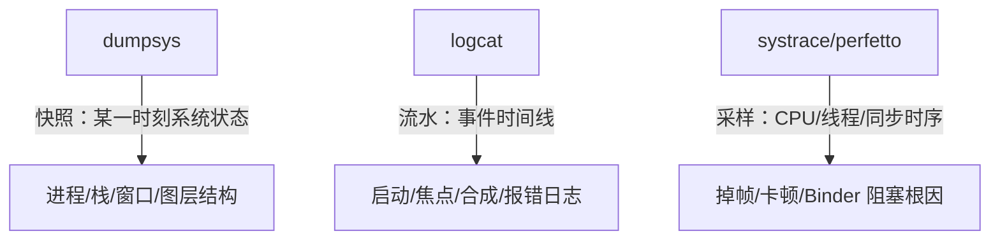
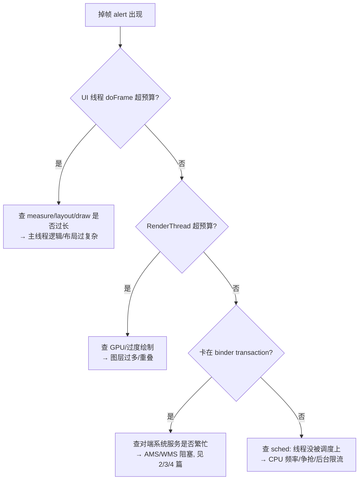

# Framework 调试实战：dumpsys / logcat / systrace 全解

> 本篇是「Android Framework 深度解析体系」的**收口实战篇**。
> 前面 9 篇讲了各模块的**原理与代码流程**，本篇讲怎么用系统自带工具**观察真实运行状态、定位问题**——把理论落到你可以在手机/模拟器上敲出来的命令。
> 所有命令基于 `adb`，建议用 `adb shell` 或 `adb shell <cmd>` 执行。

---

## 目录

1. 三件套总览：dumpsys / logcat / systrace 各自看什么
2. `dumpsys activity`：Activity/Task/进程在不在、在哪个栈
3. `dumpsys wm`：窗口焦点、层级、Surface
4. `dumpsys surfaceflinger`：图层合成与掉帧
5. logcat 关键 TAG：每个子系统看哪个标签
6. systrace / perfetto：抓帧、看掉帧与卡顿
7. 一个综合排障流程示例
8. 常用命令速查表

---

## 1. 三件套总览



- **`dumpsys`**：向某个系统服务要一份「当前状态快照」，适合看**结构**（谁在前台、窗口树、图层列表）。
- **`logcat`**：看**时间线上的事件流**（谁启动了谁、哪些报错、输入事件轨迹）。
- **`systrace`**：按时间轴采样**每个线程在干什么**，适合定位「掉帧/卡顿」到底是 UI 线程慢、RenderThread 慢、还是被 Binder 卡住。

三者配合：先用 `dumpsys` 看结构对不对，再用 `logcat` 看时序，最后用 `systrace` 看性能根因。

---

## 2. `dumpsys activity`：Activity/Task/进程在不在

`ActivityManagerService` 提供的 dump 是最大的几块之一，直接 `dumpsys activity` 会输出非常长。建议用子命令缩小范围：

```bash
adb shell dumpsys activity activities      # 只看 Activity/Task/Stack 结构
adb shell dumpsys activity services        # 运行中的 Service
adb shell dumpsys activity broadcasts      # 已注册的广播接收者
adb shell dumpsys activity processes       # 进程列表与 oom_adj
adb shell dumpsys activity top             # 最顶层的 Activity 及其窗口
adb shell dumpsys activity 包名            # 只看某个 App 的相关记录
```

### 2.1 看前台 Activity（最常用）

```bash
adb shell dumpsys activity activities | grep -E "mResumedActivity|mFocusedActivity|realActivity"
```

输出示例：

```
mResumedActivity: ActivityRecord{... u0 com.example.app/.MainActivity t12}
mFocusedActivity: ActivityRecord{... u0 com.example.app/.MainActivity t12}
    realActivity=com.example.app/.MainActivity
```

- **`mResumedActivity`**：当前处于 `RESUMED` 状态、可见可交互的 Activity——前台那个。
- **`mFocusedActivity`**：获得焦点的 Activity（通常和 resumed 一致，分屏时区别明显）。
- **`t12`**：Task id 12，对应一个回退栈。

> 对应关系：这里的 `ActivityRecord` 就是在 `9. startActivity 全链路` 里 `performLaunchActivity` 创建、由 `ActivityStack` 管理的对象。

### 2.2 看 Task / Stack 结构

`dumpsys activity activities` 里有 `RootWindowContainer` 的层级，结构长这样（节选）：

```
RootWindowContainer
  displayId=0 stacks=2
  Stack #1 type=home
    Task{... #1 A=com.android.launcher3 U=0}
      ActivityRecord{... com.android.launcher3/.Launcher}
  Stack #2 type=standard
    Task{... #12 A=com.example.app U=0}
      ActivityRecord{... com.example.app/.MainActivity}
      ActivityRecord{... com.example.app/.DetailActivity}
```

这正好对应 `9. startActivity` 里 `ActivityStarter.getReusableTask()` 的「affinity 复用」逻辑——同 `A=`（taskAffinity）的 Activity 进同一个 Task。

### 2.3 看进程与 oom_adj

```bash
adb shell dumpsys activity processes | grep -A6 "Proc #"
```

输出里每个进程有 `oom:` 字段，比如 `oom=200`（可见进程）、`oom=900`（缓存进程）。这直接对上 `3. AMS 进程调度与 LMK` 讲的 OOM 级别——`oom` 值越小优先级越高，越不容易被 LowMemoryKiller 杀。

---

## 3. `dumpsys wm`：窗口焦点、层级、Surface

WMS 的 dump 看窗口树和焦点。常用：

```bash
adb shell dumpsys window windows        # 所有 WindowState（Z 序排列）
adb shell dumpsys window displays        # DisplayContent 信息
adb shell dumpsys window policy          # 策略状态（锁屏、导航栏）
adb shell dumpsys window animator        # 动画状态
adb shell dumpsys window                                 # 全部
```

### 3.1 看焦点窗口（和输入强相关）

```bash
adb shell dumpsys window windows | grep -E "mCurrentFocus|mFocusedApp|mInputMethodWindow"
```

输出示例：

```
mCurrentFocus=Window{... u0 com.example.app/com.example.app.MainActivity}
mFocusedApp=AppWindowToken{... com.example.app/.MainActivity}
mInputMethodWindow=Window{... u0 InputMethod}
```

- **`mCurrentFocus`**：当前拿到输入焦点的窗口。**这就是 `8. IMS 输入分发` 里 InputDispatcher 每次派发前向 WMS 查询的「焦点窗口」**——如果这里不是你期望的窗口，触摸事件就会送错地方。
- **`mInputMethodWindow`**：软键盘窗口，看看它是否遮挡了你的窗口。

### 3.2 看某个窗口的层级与 Surface

`dumpsys window windows` 会列出每个 `WindowState`（按 Z 序从底到顶），关键字段：

```
Window #N Window{...}:
  mOwnerUid=10087 mShowToOwnerOnly=true package=com.example.app
  mAttrs={(0,0)(fillxfill) sim=#20 ty=BASE_APPLICATION}
  mViewVisibility=0x8 mDrawState=HAS_DRAWN
  mLayer=21000 mAnimLayer=21000
  Surface: shown=true layer=21000 alpha=1.0 ...
```

- **`mLayer` / `mAnimLayer`**：窗口的 Z 序值，越大越靠上。对应 `4. WMS` 讲的 `assignLayers()` 计算。
- **`mDrawState`**：`HAS_DRAWN` 表示已绘制；若是 `NO_SURFACE` 说明 Surface 还没建好（可能 `addWindow` 失败）。
- **`Surface: shown=`**：是否真的上屏。

### 3.3 看动画是否卡住

```bash
adb shell dumpsys window animator | grep -i "anim"
```

如果一个窗口长期 `animating=true` 且 `mAnimatingExit`，可能是退出动画卡住导致界面不响应——这时 `mCurrentFocus` 可能还指向正在退出的窗口，触摸会失效。

---

## 4. `dumpsys surfaceflinger`：图层合成与掉帧

SurfaceFlinger 的 dump 看「屏幕上到底有哪些图层、各走 OVERLAY 还是 GLES、有没有掉帧」。

```bash
adb shell dumpsys SurfaceFlinger          # 完整
adb shell dumpsys SurfaceFlinger --layers # 只看图层
adb shell dumpsys SurfaceFlinger --latency # 帧延迟直方图（需 root/eng）
```

### 4.1 看可见图层

```
Visible layers (count = 4)
+ Layer 0x7 (app com.example.app)  id=12 z=21000
  Region (e0,0,1080,2340) activeBuffer=[1080x2340:1080,1]  crop=[0,0,1080,2340]
  isOpaque=1 alpha=1.0 flags=0x0
  Composition type=Device            # ← OVERLAY
+ Layer 0x8 (StatusBar)  id=10 z=24000
  activeBuffer=[1080x72:1080,1]
  Composition type=Device
+ Layer 0x9 (NavigationBar) id=11 z=25000
  Composition type=Device
+ Layer 0x5 (Dim)  id=8 z=20000
  Composition type=Client             # ← GLES 客户端合成
```

- **`Composition type=Device`**：HWC 硬件叠加，SurfaceFlinger 不碰像素（省电）。对应 `5. SurfaceFlinger` 的 OVERLAY 路径。
- **`Composition type=Client`**：GLES 客户端合成，`doComposeSurfaces()` 会把它画进 framebuffer。如果大量图层都是 Client，说明 HWC 叠加能力不足或图层属性（圆角/模糊/旋转）触发了降级——这正是 `5. SurfaceFlinger` 讲的「掉出 overlay」条件。
- **`activeBuffer=[0x0]` 或缺失**：该图层没在绘制（空白/黑屏常见原因）。
- **`z=`**：Z 序，和 WMS 的 `mLayer` 对应。

### 4.2 看掉帧统计

```
Frame timeline:
  totalFrames=1280  missedFrames=37
  glCpu=2.1ms  gpuCpu=1.4ms  presentFence=4.2ms
  refreshRate=60.0 fps
```

- **`missedFrames`**：错过 VSYNC 的帧数，掉帧率 ≈ `missedFrames / totalFrames`。
- **`presentFence`**：present 到屏幕的延迟；过大说明 HWC/显示链路慢。
- 想看逐帧延迟，用 `dumpsys SurfaceFlinger --latency <window>` 取直方图（eng/build 可用）。

---

## 5. logcat 关键 TAG：每个子系统看哪个标签

抓 log 前先决定看哪个子系统。常用过滤：

```bash
adb logcat -c                                  # 清屏
adb logcat ActivityManager:* *:S               # 只看 AMS 相关
adb logcat -b all ActivityTaskManager:* WindowManager:* *:S
adb logcat --pid=$(adb shell pidof com.example.app)   # 只看某 App 进程
```

### 5.1 各子系统 TAG 速查

| 子系统 | 关键 TAG | 看什么 |
|--------|----------|--------|
| 组件启动/生命周期 | `ActivityManager`、`ActivityTaskManager`、`ActivityStart`、`TaskPersister` | start 谁、resume 谁、ANR、kill |
| WMS | `WindowManager`、`WindowManagerPolicy`、`RootWindowContainer`、`WindowState` | addWindow、焦点变化、配置变更 |
| 图形/SurfaceFlinger | `SurfaceFlinger`、`BufferQueue`、`HWComposer`、`Surface`、`BufferHub` | 图层、Buffer 流转、HWC 类型 |
| 输入/IMS | `InputManager`、`InputReader`、`InputDispatcher`、`EventHub`、`InputTransport`、`MotionEvent` | 触摸轨迹、焦点窗口、丢弃的事件 |
| Binder/IPC | `Binder`、`BinderTracker`、`IPCThreadState` | oneway、阻塞、大对象 |
| 进程/Zygote | `Zygote`、`ActivityThread`、`LoadedApk`、`SystemServer` | fork、bindApplication、attach |
| 渲染 | `OpenGLRenderer`、`RenderThread`、`hwuiTask`、`Choreographer` | 绘制耗时、丢帧告警 |
| 电源/显示 | `PowerManagerService`、`DisplayManager`、`DisplayPowerController` | 亮灭屏、刷新率切换 |
| 音频 | `AudioFlinger`、`AudioPolicyService`、`AudioTrack`、`AudioManager` | 混音线程、路由、焦点 |
| 通用错误 | `AndroidRuntime`、`System.err` | 崩溃栈、异常 |

### 5.2 经典排查日志

启动链（对上 `9. startActivity`）：

```
ActivityTaskManager: START u0 {act=android.intent.action.MAIN cat=[...] flg=0x10000000 cmp=com.example.app/.MainActivity} from uid 10087
ActivityTaskManager: Move task 12 to front
ActivityManager: Start proc 12345:com.example.app/u0a87 for activity com.example.app/.MainActivity
ActivityThread: handleBindApplication(...)            # Zygote fork 后
ActivityTaskManager: Resume activity {... .MainActivity} 
```

输入（对上 `8. IMS`）：

```
InputDispatcher: dispatchMotion - action=DOWN, ...
InputDispatcher: FocusedWindow changed from null to Window{... com.example.app/.MainActivity}
InputReader: Device reconfigured: id=5, ...
```

合成（对上 `5. SurfaceFlinger`）：

```
SurfaceFlinger: composer requested layers=4, device=3 client=1
```

---

## 6. systrace / perfetto：抓帧、看掉帧与卡顿

`dumpsys` 看结构、`logcat` 看事件，**掉帧根因**要靠 systrace 的时序采样。

### 6.1 抓 trace

旧版 `systrace`（仍普遍可用）：

```bash
# 系统里 systrace.py 通常在 platform-tools/systrace
python systrace.py -t 10 -o trace.html \
  gfx input view wm am power sched freq binder disfreq hal res
```

新版用 `perfetto`（Android 10+ 推荐）：

```bash
adb shell perfetto \
  -c /data/misc/perfetto-traces/config.pbtxt -o /data/misc/perfetto-traces/trace
# 或用快捷：adb shell perfetto --txt -c - -o /tmp/trace <<EOF ... EOF
```

类别含义：
- `gfx`：图形/渲染（Choreographer、RenderThread、SurfaceFlinger）
- `input`：输入事件（InputReader/Dispatcher）
- `view`：View 树 measure/layout/draw
- `wm` / `am`：窗口/Activity 管理事件
- `sched` / `freq` / `disfreq`：CPU 调度与频率（看线程有没有被调度上）
- `binder`：Binder 调用（看跨进程是否卡）
- `hal`：HAL 调用耗时

### 6.2 在浏览器里看

把 `trace.html` 用 Chrome 打开（`chrome://tracing` 也可 `Load`），时间轴上能看到：

- **`Choreographer`** 的 `doFrame`：每一帧的回调。正常应每 16.6ms（60Hz）一个，**间隔突然变大 = 掉帧**。
- **`UI Thread` / `main`**：你的 `onCreate`/`onMeasure`/`onLayout`/`onDraw` 耗时。超过帧预算就在红色区间。
- **`RenderThread`**：把绘制命令提交 GPU。若它和 GPU 完成（`GPU completion`）间隔大，是 GPU 瓶颈。
- **`SurfaceFlinger`**：合成时机，是否跟着 VSYNC。
- **`binder` 事务**：若 UI 线程卡在 `binder transaction` 上（如等 AMS 返回），说明跨进程阻塞——对应 `2. Binder` 的同步 `transact()`。

### 6.3 读掉帧的判别法



经验值：
- 60Hz 设备：单帧预算 **16.6ms**；90Hz 为 **11.1ms**；120Hz 为 **8.3ms**。
- systrace 里帧标记出现 **红色 "F"（Frame missed）** 即掉帧。
- 长期掉帧先看 `dumpsys SurfaceFlinger` 的 `missedFrames` 比例，再用 systrace 定位是哪一段超预算。

---

## 7. 一个综合排障流程示例

**现象**：点图标启动 App 后，界面出来但触摸没反应。

按本体系的顺序排查：

1. `adb shell dumpsys activity top` → 确认 `mResumedActivity` 是目标 Activity（启动链路 OK，对上 `9. startActivity`）。
2. `adb shell dumpsys window windows | grep mCurrentFocus` → 焦点窗口是否是目标？若指向正在退出的窗口，是 `3.3` 的动画卡住。
3. `adb shell dumpsys window windows | grep -A3 "包名"` → 看 `Surface: shown=` 是否为 true、`mDrawState` 是否 `HAS_DRAWN`（窗口/Surface 正常，对上 `4. WMS`）。
4. `adb logcat InputDispatcher:* *:S` → 看派发时 `FocusedWindow changed` 有没有正确切到目标；事件是否被丢弃（对上 `8. IMS`）。
5. 若结构都对但偶发卡顿：`systrace` 抓 `input gfx view wm binder`，看 InputDispatcher 是否等 VSYNC、UI 线程是否阻塞在 binder。

这套「结构→事件→性能」的递进，正好把 9 篇原理串成可操作的排障路径。

---

## 8. 常用命令速查表

| 目的 | 命令 |
|------|------|
| 前台 Activity | `dumpsys activity activities \| grep mResumedActivity` |
| 某 App 进程 oom_adj | `dumpsys activity processes \| grep -A4 包名` |
| 焦点窗口 | `dumpsys window windows \| grep mCurrentFocus` |
| 窗口层级 | `dumpsys window windows` |
| 图层与合成类型 | `dumpsys SurfaceFlinger` |
| 掉帧统计 | `dumpsys SurfaceFlinger` 看 `missedFrames` |
| 输入事件轨迹 | `logcat InputDispatcher:* InputReader:* *:S` |
| 启动日志 | `logcat ActivityTaskManager:* ActivityManager:* *:S` |
| 某进程全部日志 | `logcat --pid=$(pidof 包名)` |
| 抓 systrace | `systrace.py -t 10 -o t.html gfx input view wm am sched binder` |
| 查 Service 卡顿 | `dumpsys activity services \| grep 包名` |
| 查 ANR | `logcat ActivityManager:* *:S` 看 `ANR in` |

---

## 与体系其他篇的关系

- **`9. startActivity`**：`dumpsys activity` 的 `ActivityRecord`/`Task` 就是它的产物。
- **`4. WMS`**：`dumpsys window` 的 `WindowState`/`mLayer`/`mCurrentFocus` 是它的运行时状态。
- **`5. SurfaceFlinger`**：`dumpsys SurfaceFlinger` 的 `Composition type` 直接反映 OVERLAY vs GLES 判决。
- **`8. IMS`**：`mCurrentFocus` 是 InputDispatcher 派发前查的焦点；logcat `InputDispatcher` 标签看事件轨迹。
- **`2. Binder` / `3. AMS`**：systrace 的 `binder` 段和 `dumpsys activity processes` 的 oom_adj 是它们的可观测面。

> 至此，体系从「原理（1–9 篇）」补上了「观测与排障（本篇）」，形成「懂原理 → 能观察 → 会定位」的闭环。
