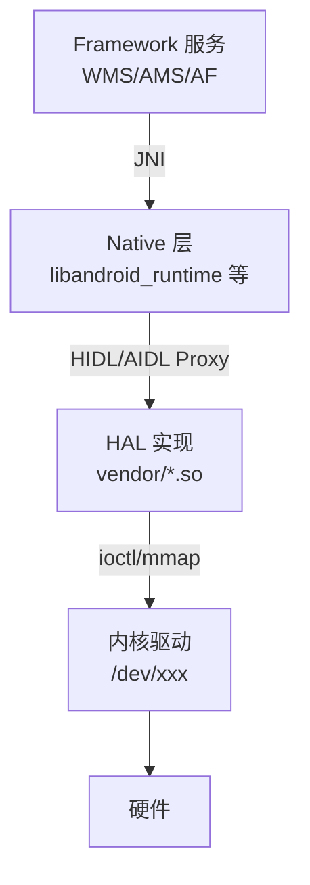
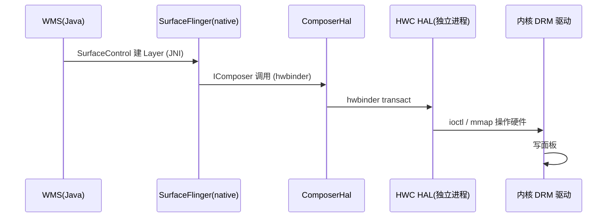

# HAL 与 Treble 硬件抽象层

> 基于 AOSP `hardware/interfaces`、`system/libhidl`、`hardware/libhardware`。
> 本文聚焦「Framework 怎么和厂商硬件打交道、Treble 项目如何解耦框架与厂商实现」。

---

## 目录

1. 为什么需要 HAL
2. 传统 HAL vs HIDL（Treble 项目）
3. HIDL：hwbinder 上的接口定义
4. 代码生成与 hwservicemanager
5. Framework 怎么调 HAL（完整链路）
6. stable AIDL：新一代 HAL 接口
7. 实例：camera / audio / composer HAL
8. 关键类与文件索引

---

## 1. 为什么需要 HAL

Android 要跑在成千上万种硬件上。HAL（Hardware Abstraction Layer）把「内核/厂商驱动」和「上层框架」解耦：定义一套标准 C/C++/接口，厂商提供具体实现（so 库）。框架层不关心硬件是谁家的——换芯片不用改上层代码。



---

## 2. 传统 HAL vs HIDL（Treble 项目）

| 维度 | 传统 HAL（Legacy） | HIDL / AIDL（Treble 后） |
|------|--------------------|----------------------------|
| 绑定方式 | 直接 `dlopen` 厂商 so，函数指针表 | 跨进程 Binder（hwbinder / binder） |
| 解耦 | 框架与厂商同进程，升级要一起升 | 框架与厂商**独立升级**，版本化接口 |
| 位置 | `hardware/libhardware` | `hardware/interfaces`（HIDL）/ `aidl` |
| 进程边界 | 无（崩溃拖垮框架） | 有（HAL 进程挂了不影响 system_server） |

**Treble 项目**（Android 8 引入）的核心目标：**让 Framework 和 Vendor 实现能各自独立 OTA**。做法是把 HAL 改成「版本化的 IPC 接口」，框架走 hwbinder 调独立的 HAL 进程。

---

## 3. HIDL：hwbinder 上的接口定义

HIDL（HAL Interface Definition Language）用 `.hal` 描述接口：

```hal
// hardware/interfaces/graphics/composer/2.1/IComposer.hal
package android.hardware.graphics.composer@2.1;

interface IComposer {
    getCapabilities() generates (vec<Capability> capabilities);
    createLayer(Display display, ...)
        generates (Error error, Layer layer);
    // ... SurfaceFlinger 就是调这些
};
```

编译（`<hal-file>.hal` → C++/Java 代码）：
```bash
hidl-gen -L c++-impl -r android.hardware:hardware/interfaces \
    android.hardware.graphics.composer@2.1
```
生成 **接口基类 + 默认实现桩**，厂商 fill 具体逻辑。

---

## 4. 代码生成与 hwservicemanager

生成的代码包含 **Client（Proxy）** 和 **Server（Stub）**，和 AIDL 同理（见《Binder IPC 与驱动层》）：

```cpp
// 自动生成（示意）：IComposer 的 Bn/Gn（HIDL 命名 HwBinder 版）
// Client 端通过 hwservicemanager 拿到服务代理
// system/libhidl/transport/ 提供传输层
```

HAL 服务启动时向 **hwservicemanager**（`hwbinder` 上的「ServiceManager」）注册：

```cpp
// vendor 实现进程里
sp<IComposer> composer = new Composer();
// 注册到 hwservicemanager，名字形如 "android.hardware.graphics.composer@2.1::IComposer/default"
defaultPassthroughServiceImplementation<IComposer>(4);
```

框架侧获取代理：

```cpp
// frameworks/native/services/surfaceflinger/DisplayHardware/ComposerHal.cpp
// 通过 IComposer::getService() 经 hwservicemanager 拿到 default 实例
sp<IComposer> composer = IComposer::getService("default");
```

> 注意区分三条 Binder 通道：
> - **binder**：Framework 内部（App ↔ system_server，如 AMS/WMS）
> - **hwbinder**：Framework ↔ Vendor HAL（HIDL）
> - **vndbinder**：Vendor 进程之间互相调

---

## 5. Framework 怎么调 HAL（完整链路）

以「WMS 让 SurfaceFlinger 上屏」为例，完整下沉路径：



代码落点（回顾 SurfaceFlinger 文章）：

```cpp
// frameworks/native/services/surfaceflinger/DisplayHardware/ComposerHal.cpp
Error ComposerHal::present(Display display, int32_t* outPresentFence) {
    // 经 HIDL 代理调 HWC HAL
    return mComposer->presentDisplay(mHwcDevice, display, ...);
}
// HWC HAL 实现（vendor）→ 内核 DRM/KMS 驱动 → 面板
```

---

## 6. stable AIDL：新一代 HAL 接口

Android 11+ 推 **stable AIDL** 逐步取代 HIDL 作为 HAL 接口语言（统一到一条技术栈）：

```aidl
// hardware/interfaces/audio/aidl/android/hardware/audio/core/IStreamOut.aidl
package android.hardware.audio.core;
interface IStreamOut {
    int write(in byte[] audioData);   // 与前面 AudioFlinger 文章里的 IStream 对应
    void pause();
}
```

stable AIDL 跑在**普通 binder** 上（不再需要 hwbinder 单独通道），接口向后兼容、可版本化，简化厂商适配。Audio HAL 已大量迁移到 AIDL（见《AudioFlinger 与 AudioPolicyService》里的 `IDevice/IStream`）。

---

## 7. 实例：camera / audio / composer HAL

| HAL | 接口包 | 被谁使用 |
|-----|--------|----------|
| 图形合成 | `android.hardware.graphics.composer` | SurfaceFlinger（HWC） |
| 音频 | `android.hardware.audio` (AIDL) / `audio` (HIDL) | AudioFlinger |
| 相机 | `android.hardware.camera` / `camera.provider` | CameraService |
| 传感器 | `android.hardware.sensors` | SensorService |
| 灯光/振动 | `android.hardware.light` / `vibrator` | LightsService / VibratorService |

每个都是「Framework 服务 → 走 hwbinder/stable-binder → 独立 HAL 进程 → 内核驱动 → 硬件」的同一种模式。

---

## 8. 关键类与文件索引

| 类 / 函数 | 文件 | 职责 |
|-----------|------|------|
| HIDL 接口定义 | `hardware/interfaces/**/*.hal` | HAL 接口声明 |
| `hidl-gen` | `system/tools/hidl/` | 生成 Proxy/Stub 代码 |
| HIDL 传输层 | `system/libhidl/transport/` | hwbinder 封装 |
| `hwservicemanager` | `system/hwservicemanager/` | HAL 注册中心 |
| legacy HAL | `hardware/libhardware/` | 旧式 dlopen HAL |
| stable AIDL | `aidl/` + `hardware/interfaces/**/aidl/` | 新一代 HAL 接口 |
| ComposerHal | `frameworks/native/.../DisplayHardware/ComposerHal.cpp` | SurfaceFlinger 调 HWC HAL |

---

## 一句话总结

> HAL 是「框架碰硬件」的唯一正规入口。Treble 之前框架靠 `dlopen` 直接调厂商 so（同进程、强耦合）；Treble 之后改成**版本化的 HIDL / stable AIDL 接口，跑在独立的 hwbinder / binder 通道上，由 hwservicemanager 注册**——框架和厂商实现从此能各自独立 OTA，HAL 进程挂了也不拖垮 system_server。无论图形、音频还是相机，最终都是「Framework 服务 → HAL 进程 → 内核驱动 → 硬件」这一条下沉路径。
