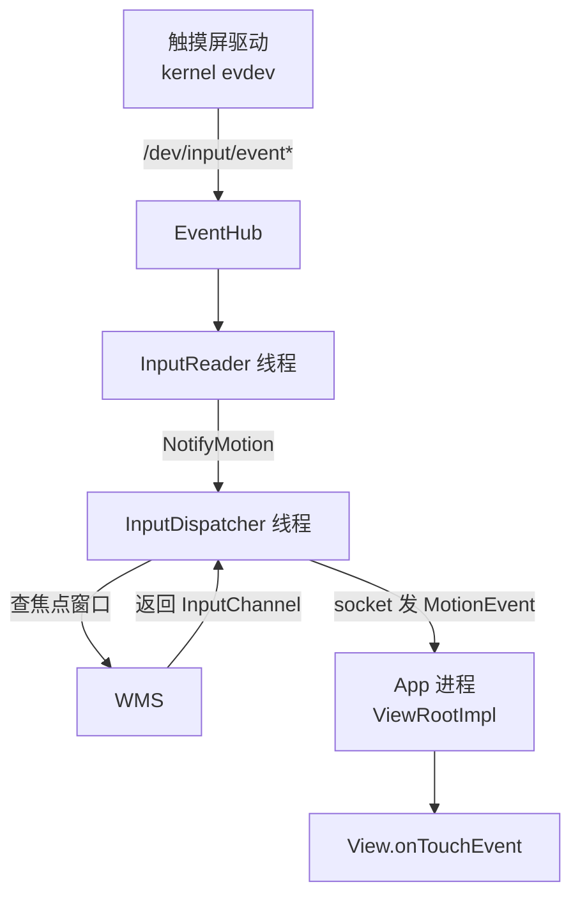
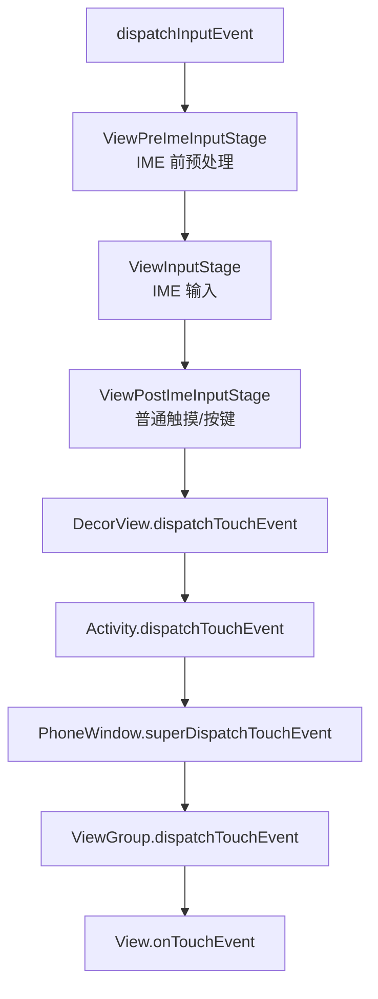

# IMS 输入事件分发链路深度解析

> 基于 AOSP `frameworks/native/services/inputflinger` 与 `frameworks/base/services/core/java/com/android/server/input`，以 Android 12+ 代码为准。
> 本文聚焦「用户按一下屏幕，事件是怎么一路从触摸屏驱动到达 App 的 `onTouchEvent`」这条主线。

---

## 目录

1. IMS 是什么，在架构里的位置
2. 整体架构：kernel → native InputFlinger → Java InputManagerService → App
3. 内核侧：evdev 与 `/dev/input/event*`
4. EventHub：native 层的事件入口
5. InputReader：读事件、翻译成 MotionEvent
6. InputDispatcher：派发前的焦点裁决（与 WMS 协作）
7. InputChannel：跨进程送事件的 unix socket 通道
8. App 侧：从 `InputEventReceiver` 到 `onTouchEvent`
9. InputStage 责任链与事件拦截
10. 关键类与文件索引

---

## 1. IMS 是什么，在架构里的位置

**IMS 在 Framework 里有两个常被混淆的指代**：

- **InputManagerService**（Java，`com.android.server.input`）：系统服务，跑在 `system_server` 里，对上提供 `InputManager` 给 WMS/App，对下通过 JNI 管理 native 的 `InputManager`。
- **InputManagerService** 管理的 native 引擎（C++，`inputflinger`）：起 `InputReader` 和 `InputDispatcher` 两个线程，真正干读事件、派发事件的活。

本文的「IMS」泛指这一整套。它处在 **WMS 的上游**——事件先经过 IMS，再由 IMS 按 WMS 给的窗口焦点，把事件路由给正确的 App 窗口。



关键点：**InputDispatcher 与 App 之间走的是 `InputChannel`（一对 unix socket），不经过 Binder**。Binder 只用在「InputDispatcher 问 WMS 要焦点窗口」这一步。

---

## 2. 整体架构：三层拆分

| 层 | 组件 | 进程 | 职责 |
|----|------|------|------|
| 内核 | evdev 驱动 | kernel | 把硬件中断转成 `/dev/input/event*` 的原始事件 |
| native | `InputManager`（`inputflinger`） | `system_server`（native 线程） | EventHub 读、InputReader 翻译、InputDispatcher 派发 |
| Java | `InputManagerService` | `system_server`（Java 线程） | 通过 JNI 起 native 引擎，对 WMS 提供接口 |
| 应用 | `InputEventReceiver` | App 进程 | 接收 socket 事件，投递到 View 树 |

---

## 3. 内核侧：evdev 与 `/dev/input/event*`

触摸屏/按键是字符设备，驱动在 `drivers/input/touchscreen/` 下。硬件中断触发后，驱动构造一个 `input_event`（含 `type`/`code`/`value`，如 `EV_ABS`+`ABS_MT_POSITION_X`）写入对应 `/dev/input/eventX` 节点。

```c
// drivers/input/evdev.c（内核）
// 驱动调用 input_event() → input_handle_event() → evdev_events()
// 最终写入 client 的环形缓冲区，唤醒在 read() 上阻塞的读端
```

对上层来说，它只看到一组可读的字符设备节点（`/dev/input/event0`、`event1`…），每个节点是一个输入设备。

---

## 4. EventHub：native 层的事件入口

`frameworks/native/services/inputflinger/EventHub.cpp`

`EventHub` 是 native 层第一个读到原始事件的组件。它：
- 监听 `/dev/input` 目录（inotify），发现新设备就 `open()` 对应的 `event*` 节点；
- 用 `epoll` 同时监听所有节点，谁有数据就 `read()` 谁；
- 把原始 `input_event` 封装成 `RawEvent`。

```cpp
// EventHub::getEvents()
// 阻塞在 epoll_wait，返回一批 RawEvent 给 InputReader
status_t EventHub::getEvents(int timeoutMillis, RawEvent* outRawEvents, size_t maxBytes) {
    // epoll_wait(mEpollFd, ...) 等待设备可读
    // 读到 input_event → 翻译成 RawEvent
}
```

---

## 5. InputReader：读事件、翻译成 MotionEvent

`frameworks/native/services/inputflinger/InputReader.cpp`

`InputReader` 跑在独立线程，循环调用 `EventHub::getEvents()`，然后按设备类型把 `RawEvent` 翻译成语义事件：

- 触摸屏 → `MultiTouchInputMapper` → 构造 `MotionEvent`（含坐标、pointer 数、pressure）
- 按键 → `KeyboardInputMapper` → 构造 `KeyEvent`

翻译完通过 `QueuedInputListener` 把事件 `notify` 给 `InputDispatcher`。

```cpp
// InputReader::loopOnce()
void InputReader::loopOnce() {
    size_t count = mEventHub->getEvents(timeoutMillis, mEventBuffer, EVENT_BUFFER_SIZE);
    // 遍历 mEventBuffer，按 deviceId 找到对应 InputDevice / InputMapper
    // mapper->process() → 累积成 MotionEvent
    // 通过 mQueuedListener.flush() 调 dispatcher->notifyMotion()
}

// InputDispatcher::notifyMotion() 入队（加锁），唤醒派发线程
```

---

## 6. InputDispatcher：派发前的焦点裁决

`frameworks/native/services/inputflinger/InputDispatcher.cpp`

`InputDispatcher` 是派发的核心。它跑在另一个线程，从队列取事件，**但派发前必须先确定「事件发给哪个窗口」**。这一步要问 WMS。

### 6.1 找焦点窗口

```cpp
// InputDispatcher::findFocusedWindowTargetsLocked()
// 通过 command 队列（跨线程）调 Java 侧：
//   InputManagerService.notifyFocusChanged / getFocusedWindowToken
// 实际是 JNI 回调 frameworks/base 的 InputManagerService
// → WindowManagerService 维护的 mCurrentFocus（当前焦点 WindowState）
```

`InputDispatcher` 持有每对「连接（Connection）」对应的 `InputChannel`，连接由 WMS 在 `addWindow` 时注册（见第 7 节）。它拿到焦点窗口后，找到该窗口对应的 Connection。

### 6.2 派发

```cpp
// InputDispatcher::dispatchEventLocked()
// 找到目标 connection → 把 MotionEvent 序列化进 InputPublisher
// publisher.publishMotionEvent() → 写入该 connection 的 InputChannel socket 发送端
```

如果焦点窗口不存在或连接断了，事件被丢弃（或转给别的窗口，如 Splitscreen）。

---

## 7. InputChannel：跨进程送事件的 unix socket 通道

`frameworks/native/libs/input/InputTransport.cpp`

`InputChannel` 本质是一对 **匿名 unix socket（`AF_UNIX`，`SOCK_SEQPACKET`）**，一端在 `system_server`（派发端，用 `InputPublisher`），一端在 App 进程（接收端，用 `InputConsumer`）。

这条通道是 **WMS 在 `addWindow` 时建立的**：

```java
// frameworks/base/services/core/java/com/android/server/wm/WindowState.java
void openInputChannel(InputChannel outInputChannel) {
    // 调 native 创建一对 socket， nativeOpenInputChannelPair(name)
    // 一端（server 端）注册进 InputDispatcher（mInputWindowHandle.inputChannel）
    // 另一端（client 端）通过 outInputChannel 写回 App
}
```

```java
// frameworks/base/services/core/java/com/android/server/wm/Session.java
public int addToDisplay(...) {
    return mService.addWindow(this, window, attrs, ..., outInputChannel, ...);
}
// WindowManagerService.addWindow() → win.openInputChannel(outInputChannel)
// outInputChannel 作为出参带回 App 的 ViewRootImpl
```

为什么用 socket 而不是 Binder？因为 Binder 是「请求-响应」同步模型，不适合高频、低延迟、需要丢弃陈旧帧（如 120Hz 触摸）的输入事件。socket 可以一边发一边丢，不会阻塞派发线程。

---

## 8. App 侧：从 `InputEventReceiver` 到 `onTouchEvent`

`frameworks/base/core/java/android/view/ViewRootImpl.java`

App 用 `InputChannel` 的 client 端构造一个 `InputEventReceiver`，它内部起一个 native 读循环（`NativeInputEventReceiver`，跑在 App 的 UI 线程 Looper）：

```java
// ViewRootImpl.setView() 里：
mInputChannel = new InputChannel();
mWindowSession.addToDisplay(mWindow, ..., mInputChannel, ...);  // 拿回 client 端
mInputEventReceiver = new WindowInputEventReceiver(mInputChannel, Looper.myLooper());
```

事件到达：

```java
// WindowInputEventReceiver.onInputEvent() → ViewRootImpl.dispatchInputEvent()
void dispatchInputEvent(InputEvent event, InputHandler handler) {
    ...
    // 经过 InputStage 责任链（见第 9 节）
}
```

`InputStage` 一路向下，最终落到 View 树：

```java
// ViewPostImeInputStage.onProcess() →
DecorView.dispatchTouchEvent(event)        // 先给 Activity 机会拦截
  → Activity.dispatchTouchEvent()          // Activity 可选择拦截
  → PhoneWindow.superDispatchTouchEvent()  // 转回 DecorView
  → ViewGroup.dispatchTouchEvent()         // 按 Z-order 自顶向下分发
  → View.onTouchEvent()                    // 落到具体控件
```

---

## 9. InputStage 责任链与事件拦截

`dispatchInputEvent` 不是一条直线，而是一条 **InputStage 责任链**，每个 stage 处理一类事件：



三个关键拦截点：

1. **`ViewGroup.onInterceptTouchEvent()`**：父容器可在 `ACTION_DOWN`/MOVE 时拦截，子 View 就此收不到后续事件。
2. **`Activity.dispatchTouchEvent()`**：Activity 是事件的第一道门，可整体拦截（罕见，通常透传给 Window）。
3. **返回值终止传播**：`onTouchEvent` 返回 `true` 表示「消费」，事件不再向上回传；返回 `false` 则冒泡给父容器。

这条责任链保证了「触摸先给窗口/Activity，再下沉到具体 View」的秩序，也实现了事件拦截机制。

---

## 10. 关键类与文件索引

| 组件 | 文件 | 进程 |
|------|------|------|
| evdev 驱动 | `drivers/input/evdev.c` | kernel |
| EventHub | `frameworks/native/services/inputflinger/EventHub.cpp` | system_server(native) |
| InputReader | `frameworks/native/services/inputflinger/InputReader.cpp` | system_server(native) |
| InputDispatcher | `frameworks/native/services/inputflinger/InputDispatcher.cpp` | system_server(native) |
| InputTransport / InputChannel | `frameworks/native/libs/input/InputTransport.cpp` | 两端 |
| InputManagerService | `frameworks/base/services/core/java/com/android/server/input/InputManagerService.java` | system_server(Java) |
| JNI | `frameworks/base/services/core/jni/com_android_server_input_InputManagerService.cpp` | - |
| ViewRootImpl | `frameworks/base/core/java/android/view/ViewRootImpl.java` | App |
| WindowInputEventReceiver | `frameworks/base/core/java/android/view/ViewRootImpl.java` | App |
| WMS.addWindow / openInputChannel | `frameworks/base/services/core/java/com/android/server/wm/WindowManagerService.java`、`WindowState.java` | system_server(Java) |

---

## 与体系其他篇的关系

- **WMS**（窗口管理机制）：焦点窗口是 WMS 维护的，`InputDispatcher` 每次派发前都要问它。
- **SurfaceFlinger**（图形合成）：事件派发的目标窗口，正是 SurfaceFlinger 合成的那个 Layer 对应的窗口。
- **Binder IPC**：`InputDispatcher → WMS` 查焦点走 Binder；事件本体走 `InputChannel`（socket）。
- **startActivity 全链路**：App 启动后 `makeVisible()` 经 `IWindowSession.addToDisplay` 建窗口，WMS 在此时为该窗口开通 `InputChannel`——输入链路才真正打通。
