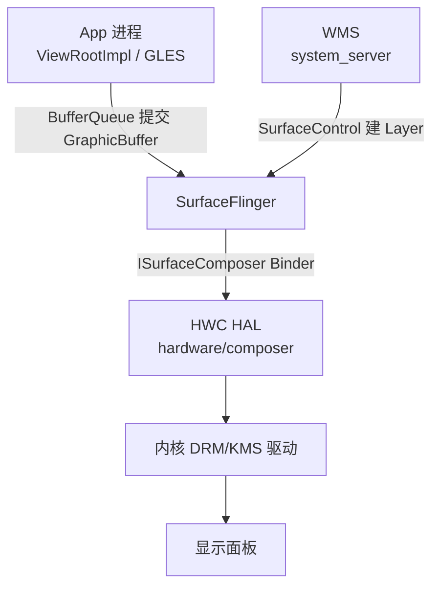
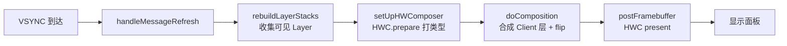
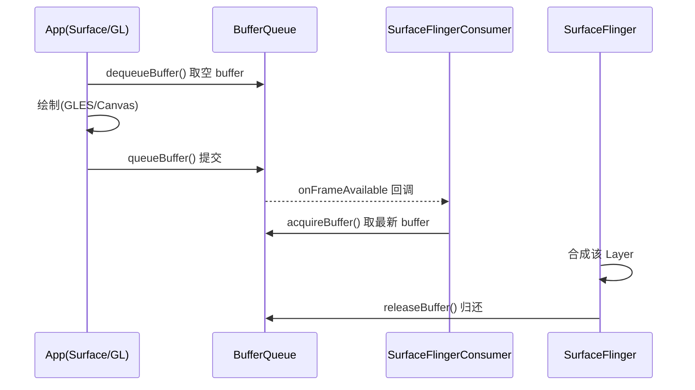
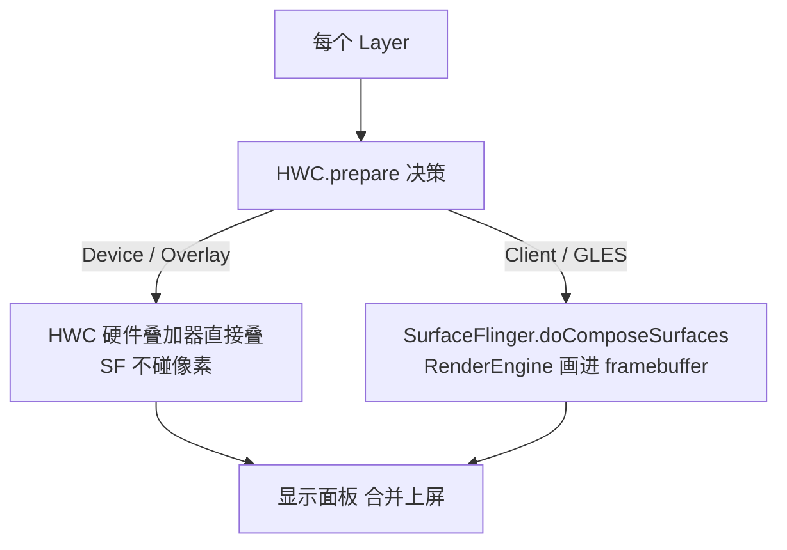

# SurfaceFlinger 图形合成流程全解析

> 基于 AOSP `frameworks/native/services/surfaceflinger`，以 Android 12+ 代码为准。
> 本文聚焦「一次屏幕刷新里，所有窗口的图层是怎么被叠到屏幕上的」这条主线。

---

## 目录

1. SurfaceFlinger 是什么，在架构里的位置
2. 核心概念：Layer / BufferQueue / HWC / Gralloc
3. 启动与初始化：`main` → `init()`
4. 刷新主循环：`handleMessageRefresh`
5. BufferQueue：App 如何把像素交给 SurfaceFlinger
6. `setUpHWComposer`：OVERLAY vs GLES 的生死判决
7. `doComposition` 与 `doComposeSurfaces`：客户端合成细节
8. `postFramebuffer`：上屏到面板
9. 关键类与文件索引

---

## 1. SurfaceFlinger 是什么，在架构里的位置

SurfaceFlinger 是一个 **native 系统服务**（C++，跑在独立进程），职责只有一个：**把系统中所有「图层（Layer）」在每一帧合成到显示面板上**。

它处在图形栈的中枢位置：



- App 不直接碰屏幕，它把绘制结果写进一块 **GraphicBuffer**，通过 **BufferQueue** 交给 SurfaceFlinger。
- WMS 通过 `SurfaceControl` 在 SurfaceFlinger 里创建/管理 **Layer**（每个窗口对应一个 Layer）。
- SurfaceFlinger 决定「谁盖谁、怎么合成」，最后通过 **HWC HAL** 上屏。

注意一个关键事实：**SurfaceFlinger 不是每次都自己画所有东西**。能交给硬件叠加器（Overlay）的层，它直接跳过——这是后面「OVERLAY vs GLES」的核心。

---

## 2. 核心概念

### 2.1 Layer
`frameworks/native/services/surfaceflinger/Layer.cpp`
每个可见窗口/表面在 SurfaceFlinger 里都是一个 `Layer` 对象，持有：
- 一组 `BufferStateLayer` / `BufferQueueLayer`（前者由 WMS 通过事务直接设几何，后者走 BufferQueue 生产者-消费者）
- Z 轴顺序、位置、透明度、裁剪、变换矩阵
- 与 HWC 对应的 `HWC2::Layer`（每一帧 HWC 会给它打类型）

### 2.2 BufferQueue
`frameworks/native/libs/gui/BufferQueue.cpp`
典型的「生产者-消费者」双端队列（实际上是环形）：
- **生产者**（App 侧 `Surface`/`GLSurface`）：`dequeueBuffer` 拿一块空 buffer → 绘制 → `queueBuffer` 交还
- **消费者**（SurfaceFlinger 侧 `SurfaceFlingerConsumer`）：`acquireBuffer` 取出最新 buffer 合成 → `releaseBuffer` 归还

Buffer 的实际内存在 **Gralloc / IAllocator HAL** 分配，跨进程共享（通过 `GraphicBuffer` 的 handle + `mmap`）。

### 2.3 HWC（Hardware Composer）
`hardware/interfaces/graphics/composer`
HWC 是厂商实现的硬件合成器，负责：
- `prepare()`：SurfaceFlinger 把每帧的所有 Layer 描述发给 HWC，HWC 给每个 Layer 打上 **Composition 类型**
- `presentDisplay()`：把决策结果真正叠到屏幕

### 2.4 Gralloc / 显示驱动
- `Gralloc`（分配图形内存，HAL `allocator`）
- 内核 `DRM/KMS` 驱动：最终把 framebuffer 送进面板

---

## 3. 启动与初始化

```cpp
// frameworks/native/services/surfaceflinger/main_surfaceflinger.cpp
int main(int argc, char** argv) {
    ...
    // 1) 启动 binder 线程池（SurfaceFlinger 作为 native 服务，靠 Binder 接 WMS 调用）
    ProcessState::self()->setThreadPoolMaxThreadCount(4);
    sp<SurfaceFlinger> flinger = new SurfaceFlinger();
    // 2) 注册到 ServiceManager，名字 "SurfaceFlinger"
    flinger->init();
    // 3) 进入 binder 主循环
    IPCThreadState::self()->joinThreadPool();
}
```

```cpp
// frameworks/native/services/surfaceflinger/SurfaceFlinger.cpp
void SurfaceFlinger::init() {
    Mutex::Autolock _l(mStateLock);
    // 创建 HWComposer 实例（加载 HWC HAL，建立与硬件的通道）
    mHwc = std::make_unique<HWComposer>(...);
    mHwc->registerCallback(this, ...);  // HWC 的 VSYNC 回调注册到这里
    // 创建 RenderEngine（GLES 渲染引擎，客户端合成用它画）
    mRenderEngine = renderengine::RenderEngine::create(...);
    // 初始化 EGL 显示
    ...
    // 启动开机首发帧
    initializeDisplays();
    // 创建 VSYNC 信号处理：EventThread / DispSync
    mScheduler = getFactory().createScheduler(...);
}
```

关键点：**VSYNC 是 SurfaceFlinger 的节拍器**。`HWComposer` 注册回调后，每次硬件 VSYNC 到达，SurfaceFlinger 的 `MessageQueue` 会收到消息，驱动一帧的合成。

---

## 4. 刷新主循环：handleMessageRefresh

每一帧的入口是一个消息 `REFRESH`，最终走到：

```cpp
// frameworks/native/services/surfaceflinger/SurfaceFlinger.cpp
void SurfaceFlinger::handleMessageRefresh() {
    nsecs_t refreshStartTime = systemTime(SYSTEM_TIME_MONOTONIC);
    // 整体四步
    rebuildLayerStacks();      // ① 收集每个 display 上可见的 Layer
    setUpHWComposer();         // ② 调 HWC.prepare()，逐 Layer 打类型
    doComposition();           // ③ 只合成「Client 类」Layer + 翻页
    postFramebuffer();         // ④ 把结果交给 HWC present 上屏
    ...
}
```



**四步的职责边界**是整个合成理解的钥匙：
- `rebuildLayerStacks`：只决定「哪些 Layer 要画、各自在哪个 display」
- `setUpHWComposer`：决定「每个 Layer 是用硬件 overlay 还是 GLES 软件合成」
- `doComposition`：只干「GLES 软件合成」那部分活 + 翻页，**overlay 的层它碰都不碰**
- `postFramebuffer`：把合成结果提交给 HWC 上屏

---

## 5. BufferQueue：App 如何把像素交给 SurfaceFlinger

App 侧（以 GLES 渲染为例）：

```java
// Activity 的 Surface 在 native 侧对应一个 BufferQueue 的生产者端
// frameworks/base/core/java/android/view/ViewRootImpl.java
void draw(boolean fullRedrawNeeded) {
    ...
    // mSurface 是 Surface，底层持有 BufferQueue 生产者
    canvas = mSurface.lockCanvas(dirty);   // → dequeueBuffer
    ...绘制...
    mSurface.unlockCanvasAndPost(canvas);  // → queueBuffer，通知 SF
}
```

native 侧 BufferQueue 流转：



SurfaceFlinger 在 `rebuildLayerStacks` / 合成时通过 `SurfaceFlingerConsumer::acquireBuffer()` 拿到当前最新的 GraphicBuffer，作为该 Layer 的源数据。

---

## 6. setUpHWComposer：OVERLAY vs GLES 的生死判决

这是合成逻辑的核心。SurfaceFlinger 把每个 Layer 的几何/属性发给 HWC，HWC 返回一个 **Composition 类型**：

- `HWC2::Composition::Device` → **硬件 overlay**，SurfaceFlinger 不画它，HWC 自己叠
- `HWC2::Composition::Client` → **GLES 客户端合成**，SurfaceFlinger 用 RenderEngine 把它画进一个 framebuffer
- 其他：`SolidColor`、`Cursor`、`Sideband` 等特殊类型

```cpp
// frameworks/native/services/surfaceflinger/SurfaceFlinger.cpp
void SurfaceFlinger::setUpHWComposer() {
    for (const auto& display : mDisplays) {
        auto& displayData = mDisplayData[display.first];
        // 1) 把每个 Layer 的当前状态更新给 HWC（setLayer*** 一系列调用）
        for (auto& layer : displayData.visibleLayersSortedByZ) {
            layer->setGeometry(...);
            layer->setPerFrameMetadata(...);
            ...
        }
        // 2) 让 HWC 做决策
        status_t err = mHwc->prepare(*display.second);
        // 3) 读回每个 Layer 的类型
        for (auto& layer : displayData.visibleLayersSortedByZ) {
            auto compositionType = layer->getCompositionType();
            if (compositionType == HWC2::Composition::Client) {
                displayData.hasClientComposition = true;  // 需要 GLES 画
            } else {
                // Device / Sideband 等：交给 HWC
            }
        }
    }
}
```

**哪些 Layer 会被「降级」到 GLES（即拿不到 overlay）？** HWC 的判定受硬件能力限制，常见的「掉出 overlay」情形：

| 条件 | 原因 |
|------|------|
| Layer 带 alpha 半透明混合 | overlay 硬件通常不支持任意混合 |
| 非矩形/带圆角、模糊（blur） | 需要逐像素处理 |
| 旋转/非标准变换 | overlay 叠加器只支持有限变换 |
| 层数量超过硬件 overlay 通道数 | 硬件 overlay 通道有限（如 4 个） |
| 颜色空间/数据格式不被 HWC 支持 | 格式不匹配 |
| 层之间需要精确 Z 交叠且硬件无法表达 | 层级关系过复杂 |

所以：**能 overlay 的层越多，SurfaceFlinger 的 GLES 工作量越小，越省电**。这也是为什么现代 HWC 都尽量多开 overlay 通道。



---

## 7. doComposition 与 doComposeSurfaces：客户端合成细节

```cpp
// frameworks/native/services/surfaceflinger/SurfaceFlinger.cpp
void SurfaceFlinger::doComposition() {
    const bool repaintEverything = android_atomic_and(0, &mRepaintEverything);
    for (const auto& [token, display] : mDisplays) {
        auto& displayData = mDisplayData[token];
        // 仅当该 display 存在需要 GLES 合成的 Layer 时才画
        if (displayData.hasClientComposition) {
            doDisplayComposition(displayData,
                repaintEverything ? Region::INVALID_REGION : displayData.dirtyRegion);
        }
        displayData.flip();   // back buffer 翻成 front
    }
    postFramebuffer();
}
```

```cpp
void SurfaceFlinger::doDisplayComposition(const DisplayData& displayData,
                                          const Region& dirtyRegion) {
    DisplaySurface* displaySurface = displayData.surface;
    doComposeSurfaces(displayData, dirtyRegion);   // 逐个 Layer 用 GLES 画
    displaySurface->prepareFrame(displayData.clientCompositionDisplayItems);
    displaySurface->advanceFrame();                // 翻页
}
```

`doComposeSurfaces` 遍历所有 Client 类 Layer，对每个调 `layer->draw()`：

```cpp
// Layer::draw → onDraw
// 用 SurfaceFlingerConsumer 拿到的 GraphicBuffer 作为纹理，交给 RenderEngine 合成
void Layer::onDraw(const RenderArea& renderArea,
                   const Region& clip, bool useIdentityTransform,
                   SurfaceFlinger::ClientCacheT&& caches,
                   renderengine::Image& ...) const {
    ...
    // RenderEngine::drawLayers() 用 GLES 把该 Layer 绘制到目标 framebuffer
    renderengine::LayerSettings layerSettings = getLayerSettings();
    mFlinger->getRenderEngine().drawLayers(...);
}
```

最终所有 Client 类 Layer 被 RenderEngine（EGL/GLES）渲染进一张离屏 framebuffer，等 `postFramebuffer` 时和 overlay 层一起交 HWC。

---

## 8. postFramebuffer：上屏到面板

```cpp
// frameworks/native/services/surfaceflinger/SurfaceFlinger.cpp
void SurfaceFlinger::postFramebuffer() {
    for (const auto& [token, display] : mDisplays) {
        auto& displayData = mDisplayData[token];
        // 把合成结果（含 overlay 层 + GLES framebuffer）提交给 HWC
        mHwc->present(token, displayData.lastPresentFence);
    }
}
```

```cpp
// frameworks/native/services/surfaceflinger/DisplayHardware/ComposerHal.cpp
Error ComposerHal::present(Display display, int32_t* outPresentFence) {
    // 调 HWC HAL 的 presentDisplay
    return mComposer->presentDisplay(mHwcDevice, display,
            frameContent, outPresentFence, ...);
}
// HWC HAL → 内核 DRM/KMS 驱动 → 面板点亮
```

`present` 之后 HWC 返回一个 **present fence**（同步栅栏），SurfaceFlinger 用它判断这一帧真正上屏的时刻，从而和 App 的渲染节奏对齐（避免 buffer 被提前复用）。

---

## 9. 关键类与文件索引

| 类 / 函数 | 文件 | 职责 |
|-----------|------|------|
| `SurfaceFlinger` | `frameworks/native/services/surfaceflinger/SurfaceFlinger.cpp` | 合成主服务、刷新主循环 |
| `handleMessageRefresh` | 同上 | 四步合成入口 |
| `setUpHWComposer` | 同上 | HWC prepare、Layer 类型判决 |
| `doComposition` / `doComposeSurfaces` | 同上 | GLES 客户端合成 |
| `postFramebuffer` | 同上 | 上屏 |
| `HWComposer` | `frameworks/native/services/surfaceflinger/DisplayHardware/ComposerHal.cpp` | HWC HAL 封装 |
| `Layer` | `frameworks/native/services/surfaceflinger/Layer.cpp` | 单个图层 |
| `BufferQueue` | `frameworks/native/libs/gui/BufferQueue.cpp` | 生产者-消费者缓冲队列 |
| `SurfaceFlingerConsumer` | `frameworks/native/services/surfaceflinger/` | Layer 侧的 buffer 消费者 |
| `RenderEngine` | `frameworks/native/libs/renderengine/` | GLES 渲染引擎 |
| HWC HAL | `hardware/interfaces/graphics/composer` | 硬件合成器接口（HIDL/AIDL） |

---

## 一句话总结

> SurfaceFlinger 每收到一次 VSYNC，就走「收集可见 Layer → HWC 给每层打 Device/Client 类型 → 只把 Client 类层用 GLES 画进 framebuffer → 连同 Device 类 overlay 层一起 present 给 HWC → 上屏」。**它自己只干软件合成那部分活，能硬件 overlay 的它一概不碰——这是省电的根本。**
