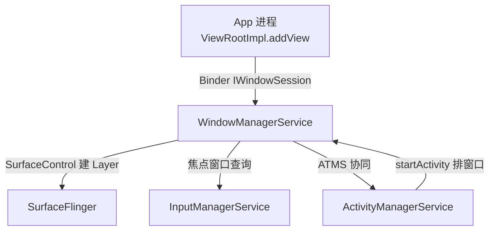
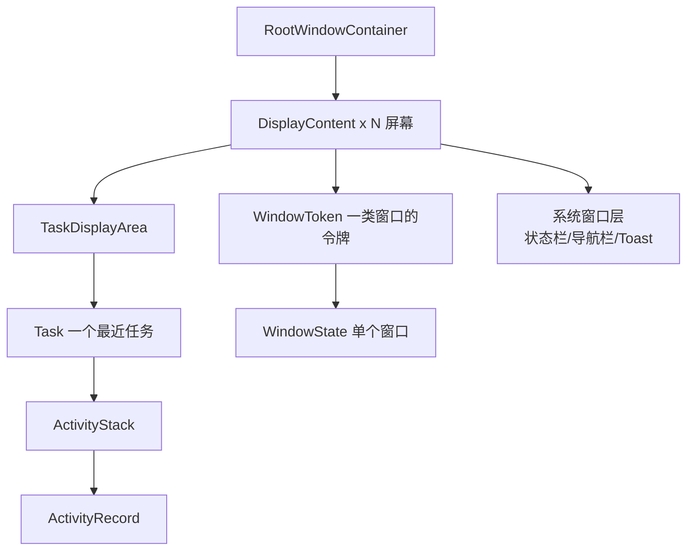

# WindowManagerService 窗口管理机制深度剖析

> 基于 AOSP `frameworks/base/services/core/java/com/android/server/wm`。
> 本文聚焦「一个窗口从 addView 到上屏、从层级到焦点，WMS 到底管了什么」。

---

## 目录

1. WMS 的角色与位置
2. 窗口层级模型：DisplayContent → RootWindowContainer → DisplayContent → Task → WindowState
3. 添加窗口：addWindow 全流程
4. Z-order 计算：assignLayers
5. 焦点与输入：与 IMS / InputDispatcher 协作
6. 动画与转场：AppTransition
7. 与 SurfaceFlinger 对接
8. 关键类与文件索引

---

## 1. WMS 的角色与位置

WMS 跑在 `system_server`（与 AMS、IMS 同进程），是窗口系统的「总管」：



它管的事：
- 窗口的**层级（Z-order）**：谁盖在谁上面
- 窗口的**尺寸/位置/裁剪**
- **焦点窗口**：当前哪个窗口接收按键/触摸
- **动画与转场**：Activity 开关、窗口进出
- 把窗口描述**下沉给 SurfaceFlinger**（通过 `SurfaceControl` 建 Layer）

注意一个易混点：App 侧 `WindowManager.addView()` 走的是 `IWindowSession`（每个 App 进程在 WMS 里有个 `Session`），但最终窗口的「真相」都存在 WMS 的 `WindowState` 里。

---

## 2. 窗口层级模型

WMS 内部用一棵「容器树」组织所有窗口：



关键类：

| 类 | 文件 | 含义 |
|----|------|------|
| `RootWindowContainer` | `wm/RootWindowContainer.java` | 所有屏幕的根 |
| `DisplayContent` | `wm/DisplayContent.java` | 一块物理/虚拟屏 |
| `TaskDisplayArea` | `wm/TaskDisplayArea.java` | 任务所在区域 |
| `Task` | `wm/Task.java` | 最近任务（recents 中的一项） |
| `ActivityStack` | `wm/ActivityStack.java` | 一组 Activity 的栈 |
| `WindowToken` | `wm/WindowToken.java` | 同类型窗口的令牌（如某 App 的所有窗口） |
| `WindowState` | `wm/WindowState.java` | **单个窗口的全部状态** |
| `Session` | `wm/Session.java` | 一个 App 进程在 WMS 里的代理 |

窗口类型（Z 大类）由 `LayoutParams.type` 决定，从低到高大致：
- `TYPE_APPLICATION`（普通应用窗口，基值 ~1）
- `TYPE_APPLICATION_PANEL`（Dialog/Popup，~1000）
- `TYPE_SYSTEM_DIALOG` / `TYPE_STATUS_BAR` / `TYPE_NAVIGATION_BAR`（系统窗口，~2000+）
- `TYPE_SYSTEM_OVERLAY` / `TYPE_TOAST`（~2000+，更高）

---

## 3. 添加窗口：addWindow 全流程

上一轮我们聊过 App 侧 `ViewRootImpl.setView()` → `IWindowSession.addToDisplay()`。WMS 侧落地：

```java
// frameworks/base/services/core/java/com/android/server/wm/Session.java
public int addToDisplay(IWindow window, int seq, WindowManager.LayoutParams attrs,
        int viewVisibility, int displayId, Rect outContentInsets,
        InputChannel outInputChannel, ...) {
    return mService.addWindow(this, window, seq, attrs, viewVisibility,
            displayId, outContentInsets, outInputChannel, ...);
}
```

```java
// frameworks/base/services/core/java/com/android/server/wm/WindowManagerService.java
public int addWindow(Session session, IWindow client, ...) {
    // 1) 权限与类型校验（系统窗口需要特定权限）
    int res = mPolicy.checkAddPermission(attrs, ...);
    // 2) 找到/创建 DisplayContent、WindowToken
    final DisplayContent displayContent = getDisplayContentOrCreate(displayId);
    WindowToken token = displayContent.getWindowToken(attrs.token);
    if (token == null) { token = new WindowToken(...); }
    // 3) 创建 WindowState —— 这是窗口的「真相」对象
    final WindowState win = new WindowState(this, session, client, token, parentWindow, attrs, ...);
    // 4) 创建 InputChannel，注册到 IMS（后面输入事件就走这里）
    win.openInputChannel(outInputChannel);
    // 5) 调整层级、焦点、执行布局
    displayContent.addWindow(win, ...);
    assignLayersLocked(displayContent.getWindowList());
    win.attach();   // 通过 SurfaceControl 在 SurfaceFlinger 建 Layer
    return res;
}
```

`win.openInputChannel()` 非常关键：它创建一对 `InputChannel`（unix socket 对），一端留在 WMS/IMS，另一端通过 `outInputChannel` 回传给 App——这就是上一轮触摸事件时序图里「InputDispatcher 通过 socket 把 MotionEvent 发到 App」的通道。

---

## 4. Z-order 计算：assignLayers

每个 `WindowState` 有一个 `mBaseLayer`（由 `type` 决定）和一个运行时 `mLayer`（含子层排序）。每次窗口变化都重算：

```java
// frameworks/base/services/core/java/com/android/server/wm/WindowContainer.java
void assignLayer() {
    // 在父容器内按 Z 顺序赋 layer 值
    int layer = 0;
    for (WindowContainer child : mChildren) {
        child.assignLayer(layer);
        layer += 1;  // 同容器内顺序递增
    }
}
```

`WindowState` 的 `mLayer` 影响它对应 `SurfaceControl` 的 Z 值，最终 SurfaceFlinger 按这个值决定合成顺序（谁盖谁）。系统窗口（状态栏/导航栏）因为 `type` 基数高，天然压在应用窗口之上——除非遇到 `TYPE_SYSTEM_OVERLAY` 这类更高层的特殊窗口。

---

## 5. 焦点与输入：与 IMS / InputDispatcher 协作

焦点窗口决定「触摸/按键落到哪」。WMS 维护 `mCurrentFocus`，并在变化时通知 IMS：

```java
// frameworks/base/services/core/java/com/android/server/wm/WindowManagerService.java
void updateFocusedWindowLocked(int mode, boolean updateInputWindows) {
    // 1) 从容器树里挑出「最该拿焦点」的 WindowState
    WindowState newFocus = mRoot.computeFocusedWindow();
    if (newFocus != mCurrentFocus) {
        mCurrentFocus = newFocus;
        // 2) 把最新窗口列表（含焦点标记）同步给 IMS
        if (updateInputWindows) {
            mInputManager.setInputWindows(mWindowPlacerLocked.getInputWindowList(),
                    newFocus != null ? newFocus.mInputChannelToken : null);
        }
    }
}
```

这正好对接上一轮的触摸时序图：**InputDispatcher 每次派发前问 WMS 谁有焦点，拿到对应 `InputChannel` 才发事件**。WMS 提供「焦点窗口 + 它的 InputChannel」，IMS 负责把事件精准投递。

---

## 6. 动画与转场：AppTransition

Activity 开关、窗口进出都有转场动画，由 WMS 的 `AppTransition` 管理：

```java
// frameworks/base/services/core/java/com/android/server/wm/AppTransition.java
// ATMS 在 resumeTopActivity 时设置转场类型
mAppTransition.prepareAppTransition(TRANSIT_ACTIVITY_OPEN, ...);
// 真正执行：把动画参数下发给 WindowState 的 SurfaceControl，
// 由 SurfaceFlinger/WindowAnimator 驱动逐帧
```

`WindowAnimator` 每帧遍历所有 `WindowState`，应用动画变换到它的 `SurfaceControl`：

```java
// frameworks/base/services/core/java/com/android/server/wm/WindowAnimator.java
void animateLocked(long frameTimeNs) {
    for (WindowStateAnimator winAnimator : mWinAnimators) {
        winAnimator.stepAnimationLocked(frameTimeNs);  // 推进动画
    }
    // 提交变换到 SurfaceFlinger
    surfaceController.setLayer/setMatrix/setAlpha(...)
}
```

---

## 7. 与 SurfaceFlinger 对接

WMS 不直接画像素，它只通过 `SurfaceControl` 描述「窗口的图层属性」，由 SurfaceFlinger 合成（对接上一轮 SurfaceFlinger 文章）：

```java
// WindowState 持有 SurfaceControl（经 WindowStateAnimator）
// frameworks/base/services/core/java/com/android/server/wm/WindowStateAnimator.java
SurfaceControl createSurfaceLocked() {
    mSurfaceControl = new SurfaceControl.Builder(mSession.mSurfaceSession)
        .setName(attrs.getTitle().toString())
        .setBufferSize(w, h)
        .setFormat(format)
        .build();   // JNI → SurfaceFlinger 建 Layer
}
// 属性变化时同步给 SurfaceFlinger
mSurfaceControl.setLayer(mAnimLayer);     // Z 序
mSurfaceControl.setPosition(x, y);        // 位置
mSurfaceControl.setAlpha(alpha);          // 透明度
mSurfaceControl.setMatrix(...);           // 变换
```

整套链路闭环：
**App addView → WMS.addWindow 建 WindowState + InputChannel → 同步焦点给 IMS → 动画/布局变化通过 SurfaceControl 改 Layer 属性 → SurfaceFlinger 按 Z 合成上屏 → 触摸事件经 IMS/InputChannel 回到 App。**

---

## 8. 关键类与文件索引

| 类 / 函数 | 文件 | 职责 |
|-----------|------|------|
| `WindowManagerService` | `wm/WindowManagerService.java` | 窗口总服务、addWindow、焦点 |
| `Session` | `wm/Session.java` | 单 App 进程代理 |
| `WindowState` | `wm/WindowState.java` | 单窗口状态（真相） |
| `WindowStateAnimator` | `wm/WindowStateAnimator.java` | 窗口 SurfaceControl 管理 |
| `WindowToken` | `wm/WindowToken.java` | 同类窗口令牌 |
| `DisplayContent` | `wm/DisplayContent.java` | 一块屏幕 |
| `Task` / `ActivityStack` | `wm/Task.java` / `wm/ActivityStack.java` | 任务/栈 |
| `RootWindowContainer` | `wm/RootWindowContainer.java` | 所有屏幕根 |
| `AppTransition` | `wm/AppTransition.java` | 转场动画 |
| `WindowAnimator` | `wm/WindowAnimator.java` | 逐帧动画驱动 |
| `PhoneWindowManager` | `wm/PhoneWindowManager.java` | 策略（锁屏/系统手势/权限） |

---

## 一句话总结

> WMS 是窗口系统的「总管」：addWindow 建出 `WindowState`、算出 Z-order、维护焦点并同步给 IMS、用 `AppTransition`/`WindowAnimator` 驱动动画，最后通过 `SurfaceControl` 把每个窗口的图层属性交给 SurfaceFlinger 合成上屏。它本身不碰像素，只描述「谁在哪、谁在上、谁拿焦点」，真正的合成与输入投递分别由 SurfaceFlinger 和 IMS 完成。
