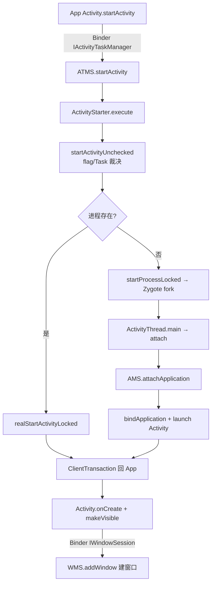

# startActivity 全链路深度解析

> 基于 AOSP `frameworks/base`，以 Android 12+ 代码为准（Activity 相关逻辑已拆分到 `ActivityTaskManagerService` / `ActivityStarter`）。
> 本文聚焦「App 调一次 `startActivity`，是怎么穿过 Binder、经过 AMS/ATMS 裁决、必要时孵化新进程、最终落到目标 Activity 的 `onCreate`」这条主线。

---

## 目录

1. 一句话主线与架构位置
2. 跨进程边界总览
3. App 侧：从 `startActivity()` 到 Binder 调用
4. system_server 侧：ATMS 接手
5. ActivityStarter：flag 解析与 Task 复用
6. ActivityStack：进程存在与否的分叉
7. 新进程：经 Zygote fork（回连进程孵化体系）
8. 回到 App：创建 Activity 并挂窗口
9. 建窗与输入打通：WMS.addWindow
10. 关键类与文件索引

---

## 1. 一句话主线与架构位置

```
App.startActivity()
  → Binder → ATMS.startActivity()                 [system_server]
      → ActivityStarter（flag/Task 裁决）
      → ActivityStack（进程在否分叉）
          ├─ 进程已存在 → realStartActivityLocked → 回 App Binder
          └─ 进程不存在 → startProcessLocked → Zygote fork 新进程
  → 新进程 ActivityThread.main → attach → AMS.attachApplication
      → bindApplication（Application.onCreate）
      → realStartActivityLocked（真正 launch 目标 Activity）
  → Activity.onCreate → makeVisible → WMS.addWindow（建窗口 + 开 InputChannel）
```

`startActivity` 是「App 进程」与「system_server 里的 AMS/ATMS」第一次大规模跨进程协作，也是整个 Framework 组件启动模型的缩影。



---

## 2. 跨进程边界总览

| 边界 | 代理接口（Proxy） | Stub 实体 | 方向 |
|------|-------------------|-----------|------|
| App → system_server（启动） | `IActivityTaskManager` | `ActivityTaskManagerService` | App 调系统 |
| system_server → App（启动 Activity） | `IApplicationThread` | `ActivityThread.ApplicationThread` | 系统回调 App |
| App → system_server（建窗） | `IWindowSession`（Session） | `WindowManagerService` | App 调系统 |

> 历史注记：Android 10 之前启动逻辑在 `ActivityManagerService` 本体；10 之后 Activity/Task/Stack 拆到独立的 **ATMS**，AMS 仍管进程、内存、权限总闸。

---

## 3. App 侧：从 `startActivity()` 到 Binder 调用

```java
// frameworks/base/core/java/android/app/Activity.java
public void startActivity(Intent intent) {
    startActivityForResult(intent, -1);          // requestCode = -1 表示不关心结果
}
public void startActivityForResult(Intent intent, int requestCode, Bundle options) {
    Instrumentation.ActivityResult ar = mInstrumentation.execStartActivity(
        this, mMainThread.getApplicationThread(), mToken, this,
        intent, requestCode, options);
}
```

关键点：`mMainThread.getApplicationThread()` 返回 `ApplicationThread`——一个 **Binder 实体（`IApplicationThread.Stub`）**，AMS 以后靠它反向调回 App。

```java
// frameworks/base/core/java/android/app/Instrumentation.java
public ActivityResult execStartActivity(...) {
    int result = ActivityTaskManager.getService().startActivity(
        whoThread, who.getBasePackageName(), who.getAttributionTag(),
        intent, intent.resolveTypeIfNeeded(who.getContentResolver()),
        token, target != null ? target.mEmbeddedID : null,
        requestCode, 0, null, options);
}
```

`ActivityTaskManager.getService()` 拿到 **Binder 代理**，其 `startActivity()` 通过 Binder 驱动真正跨进程：

```java
// frameworks/base/core/java/android/app/ActivityTaskManager.java
public static IActivityTaskManager getService() {
    return IActivityTaskManagerSingleton.get();
}
private static final Singleton<IActivityTaskManager> IActivityTaskManagerSingleton =
    new Singleton<IActivityTaskManager>() {
        protected IActivityTaskManager create() {
            final IBinder b = ServiceManager.getService(Context.ACTIVITY_TASK_SERVICE);
            return IActivityTaskManager.Stub.asInterface(b);   // ATMS 代理
        }
    };
```

---

## 4. system_server 侧：ATMS 接手

```java
// frameworks/base/services/core/java/com/android/server/wm/ActivityTaskManagerService.java
@Override
public int startActivity(...) {
    return startActivityAsUser(...);                 // 带 callingUid 走权限判定
}
int startActivityAsUser(...) {
    return getActivityStartController().obtainStarter(intent, "startActivityAsUser")
        .setCaller(caller).setCallingPid(pid).setCallingUid(uid)
        ... .execute();                              // 交给 ActivityStarter
}
```

---

## 5. ActivityStarter：flag 解析与 Task 复用

```java
// frameworks/base/services/core/java/com/android/server/wm/ActivityStarter.java
int execute() {
    if (mRequest.intent != null && mRequest.intent.hasFileDescriptors())
        throw new IllegalArgumentException("File descriptors passed in Intent");
    if (mRequest.activityInfo == null)
        mRequest.resolveActivity(mSupervisor);       // 解析 Intent → ActivityInfo
    int res = startActivityUnchecked(...);           // flag/复用/栈 全在这里
    return res;
}
```

`startActivityUnchecked()` 核心顺序：**先算 flag → 再决定复用已有 Task → 否则新建/入栈**。

```java
private int startActivityUnchecked(...) {
    computeLaunchingTaskFlags();                     // ① 修正 mLaunchFlags

    if (mLaunchFlags == 0)                           // ② 沿用 source task 的 flag
        mLaunchFlags = mSourceRecord != null
            ? mSourceRecord.getTask().getIntent().getFlags()
            : (mInTask != null ? mInTask.getBaseIntent().getFlags() : 0);

    mReusedTask = getReusableTask(...);              // ③ 按 affinity 找可复用 Task
    if (mReusedTask != null) {
        if ((mLaunchFlags & FLAG_ACTIVITY_CLEAR_TOP) != 0
                || isDocumentLaunchesIntoExisting(mLaunchFlags)) {
            ... deliverNewIntent + 清栈              // 复用：清顶/送新 Intent
        } else if ((mLaunchFlags & FLAG_ACTIVITY_SINGLE_TOP) != 0
                && mReusedTask.isSameIntentFilter(mRequest.intent)) {
            ... onNewIntent，不新建
        } else {
            ... resumeTopActivity
        }
        return START_DELIVERED_TO_TOP;               // 复用命中，不再新建
    }

    // ④ 不复用：确定目标 Stack/Task，真正启动
    result = startActivityInner(...);
    return result;
}
```

`computeLaunchingTaskFlags()` 是 flag 修正的关键：

```java
private void computeLaunchingTaskFlags() {
    // 无 source、无 NEW_TASK、无 inTask → 默认补 NEW_TASK
    if (mSourceRecord == null && (mLaunchFlags & FLAG_ACTIVITY_NEW_TASK) == 0
            && mInTask == null) {
        mLaunchFlags |= FLAG_ACTIVITY_NEW_TASK;
    }
    // 有 NEW_TASK 但无 MULTIPLE_TASK，且来自已有 task → 视情况转 single-instance 语义
    if ((mLaunchFlags & FLAG_ACTIVITY_NEW_TASK) != 0
            && (mLaunchFlags & FLAG_ACTIVITY_MULTIPLE_TASK) == 0
            && mSourceRecord != null && mSourceRecord.getTask() != null) {
        ...
    }
}
```

**flag 优先级**：`computeLaunchingTaskFlags`（修正）→ `getReusableTask`（affinity 复用）→ `CLEAR_TOP`/`SINGLE_TOP`（复用后收尾）→ `startActivityInner`（新建/入栈）。

---

## 6. ActivityStack：进程存在与否的分叉

```java
// frameworks/base/services/core/java/com/android/server/wm/ActivityStack.java
void startSpecificActivityLocked(ActivityRecord r, boolean andResume, boolean checkConfig) {
    final WindowProcessController wpc =
        mService.getProcessController(r.processName, r.info.applicationInfo.uid);
    if (wpc != null && wpc.hasThread()) {
        realStartActivityLocked(r, wpc, andResume, checkConfig);   // 进程已存在
    } else {
        mService.startProcessLocked(...);           // 进程不存在 → 经 Zygote fork
    }
}
```

- **进程已存在**：`realStartActivityLocked` 直接构造 `ClientTransaction` 回 App。
- **进程不存在**：`startProcessLocked` 最终走到 `Process.start()` → 通过 **Zygote socket** fork 新进程（见第 7 节，对接「init→Zygote 进程孵化体系」）。

---

## 7. 新进程：经 Zygote fork

`frameworks/base/core/java/android/os/Process.java` → `ZygoteProcess.java`

```java
// ZygoteProcess.startViaZygote()
Process.ProcessStartResult startViaZygote(...) {
    openZygoteSocketIfNeeded(abi);                  // 连 /dev/socket/zygote
    return zygoteSendArgsAndGetResult(...);         // 写参数，读回 pid
}
```

Zygote 的 `runSelectLoop` 收到后 `forkAndSpecialize()` 出新进程，新进程回到 `ActivityThread.main()`：

```java
// frameworks/base/core/java/android/app/ActivityThread.java
public static void main(String[] args) {
    Looper.prepareMainLooper();
    ActivityThread thread = new ActivityThread();
    thread.attach(false, startSeq);     // false = 非系统进程
    Looper.loop();
}
// attach(false)：反连 AMS 注册自己
final IActivityManager mgr = ActivityManager.getService();
mgr.attachApplication(mAppThread, startSeq);        // Binder 回 system_server
```

AMS `attachApplication()` 做两件事：① 让 App 创建 `Application`；② 把「等待启动」的 Activity 真正 launch：

```java
// ActivityManagerService.attachApplication()
thread.bindApplication(...);            // → App: handleBindApplication → Application.onCreate
mAtmInternal.attachApplication(app);    // → ATMS: 启动 pending 的 Activity
    //   → realStartActivityLocked → scheduleTransaction → handleLaunchActivity
```

---

## 8. 回到 App：创建 Activity 并挂窗口

无论进程是已有还是新 fork，`realStartActivityLocked` 最终都通过 `IApplicationThread` 代理回 App：

```java
// ActivityStack.realStartActivityLocked()
final ClientTransaction clientTransaction =
    ClientTransaction.obtain(proc.getThread(), r.appToken);
clientTransaction.addCallback(LaunchActivityItem.obtain(...));   // 携带 Intent/Info
mService.getLifecycleManager().scheduleTransaction(clientTransaction);

// → App: ActivityThread.scheduleTransaction() → TransactionExecutor.execute()
//   → LaunchActivityItem.execute() → handleLaunchActivity() → performLaunchActivity()
```

```java
// frameworks/base/core/java/android/app/ActivityThread.java
private Activity performLaunchActivity(...) {
    Activity activity = mInstrumentation.newActivity(cl, component, intent);
    ...
    activity.attach(appContext, this, ...);        // 绑定 PhoneWindow
    mInstrumentation.callActivityOnCreate(activity, r.state);   // → Activity.onCreate()
}
```

`onResume` 之后，Activity 把自己变可见：

```java
// frameworks/base/core/java/android/app/Activity.java
void makeVisible() {
    if (!mWindowAdded) {
        ViewManager wm = getWindowManager();
        wm.addView(mDecor, getWindow().getAttributes());   // 关键：DecorView 加进窗口系统
        mWindowAdded = true;
    }
}
```

---

## 9. 建窗与输入打通：WMS.addWindow

`addView` 一路到 `ViewRootImpl`，发生 **第二次**跨进程 Binder（这次是 WMS）：

```java
// frameworks/base/core/java/android/view/WindowManagerGlobal.java
public void addView(View view, ViewGroup.LayoutParams params, Display display, Window parentWindow) {
    ViewRootImpl root = new ViewRootImpl(view.getContext(), display);
    root.setView(view, wparams, panelParentWindow);
}
// frameworks/base/core/java/android/view/ViewRootImpl.java
public void setView(View view, WindowManager.LayoutParams attrs, View panelParentWindow) {
    requestLayout();
    res = mWindowSession.addToDisplay(mWindow, mSeq, mWindowAttributes,
            getHostVisibility(), mDisplay.getDisplayId(),
            mAttachInfo.mContentInsets, mInputChannel);   // ← Binder 调 WMS
}
```

`mWindowSession` 是 `IWindowSession`（WMS 的 Session 代理）。注意 `mInputChannel` 是出参——WMS 在这里把 InputChannel 的一端回传给 App，**这条通道正是 IMS 输入分发的落点**（对接「IMS 输入事件分发链路」）。

```java
// frameworks/base/services/core/java/com/android/server/wm/Session.java
public int addToDisplay(IWindow window, ..., InputChannel outInputChannel, ...) {
    return mService.addWindow(this, window, attrs, viewVisibility,
            displayId, outInputChannel, ...);
}
// WindowManagerService.addWindow()
//   → new WindowState(...) → win.openInputChannel(outInputChannel)
//   → 计算层级/Z-order、焦点、动画
//   → SurfaceControl 建 Layer（对接 SurfaceFlinger）
```

至此：Activity 已创建、窗口已建、Layer 已交给 SurfaceFlinger、InputChannel 已接好——**一次 `startActivity` 全链路闭合**。

---

## 10. 关键类与文件索引

| 组件 | 文件 | 进程 |
|------|------|------|
| Activity.startActivity | `frameworks/base/core/java/android/app/Activity.java` | App |
| Instrumentation | `frameworks/base/core/java/android/app/Instrumentation.java` | App |
| ActivityTaskManager（代理） | `frameworks/base/core/java/android/app/ActivityTaskManager.java` | App |
| ATMS | `frameworks/base/services/core/java/com/android/server/wm/ActivityTaskManagerService.java` | system_server |
| ActivityStarter | `frameworks/base/services/core/java/com/android/server/wm/ActivityStarter.java` | system_server |
| ActivityStack | `frameworks/base/services/core/java/com/android/server/wm/ActivityStack.java` | system_server |
| ZygoteProcess | `frameworks/base/core/java/android/os/ZygoteProcess.java` | App |
| ActivityThread | `frameworks/base/core/java/android/app/ActivityThread.java` | App |
| TransactionExecutor / LaunchActivityItem | `frameworks/base/core/java/android/app/servertransaction/` | App |
| ViewRootImpl | `frameworks/base/core/java/android/view/ViewRootImpl.java` | App |
| Session / WMS.addWindow | `frameworks/base/services/core/java/com/android/server/wm/Session.java` / `WindowManagerService.java` | system_server |

---

## 与体系其他篇的关系

- **init→Zygote 进程孵化体系**：第 6、7 节 `startProcessLocked → Zygote fork` 的底层机制在这里。
- **Binder IPC 与驱动层**：三次跨进程（App→ATMS、ATMS→App、App→WMS）全走 Binder 驱动。
- **AMS 进程调度与 LMK**：新 fork 的进程要 `attachApplication`，AMS 据此更新 oom_adj；进程被回收时这条启动链路也会受影响。
- **WMS 窗口管理机制**：第 9 节 `addWindow` 的完整细节在这里。
- **SurfaceFlinger 图形合成**：`addWindow` 时 `SurfaceControl` 建的 Layer 最终由它合成上屏。
- **IMS 输入事件分发**：`addToDisplay` 回传的 `InputChannel` 正是输入链路的接收端。

> 这 6 篇 + 本文 + IMS 篇，构成完整 9 篇 Android Framework 体系。
