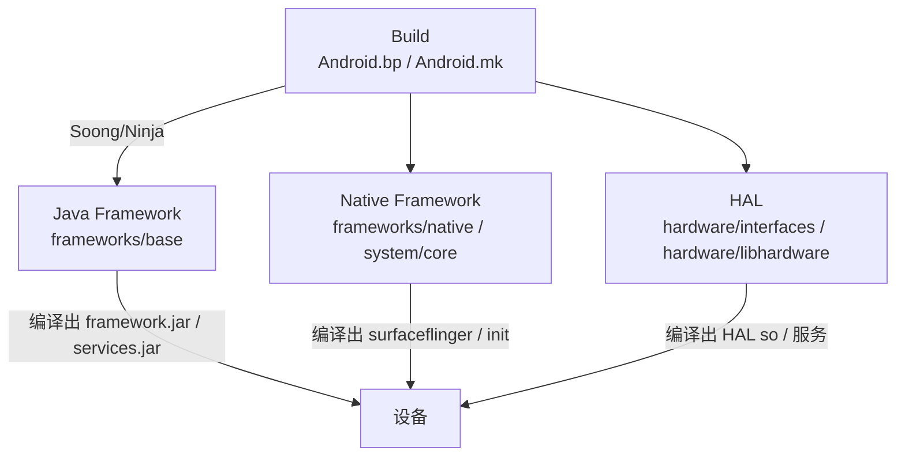

# Framework 开发实战：从改 AOSP 到上新服务

> 本篇是「Android Framework 深度解析体系」的**第二篇实战**（前一篇是 `Framework 调试实战`）。
> 调试实战讲「怎么看」，本篇讲「怎么改」——把前面 1–10 篇的原理落成可执行的开发动作：环境、增量编译、改 Java 层、新增系统服务、新增 HAL 服务、Native 验证、测试闭环。
> 命令以 AOSP `master`/Android 12+ 为准，构建系统为 **Soong（Android.bp）**，兼容传统 `mmm`。

---

## 目录

1. 开发全景：Framework 开发都在改哪里
2. 环境准备：repo / lunch / make / emulator
3. 增量编译与生效：m / adb sync / 重启策略
4. 实战一：改 Java Framework 并见效
5. 实战二：新增一个系统服务（AIDL 全链路 + SELinux + 权限）
6. 实战三：新增一个 HAL 服务（AIDL HAL 示例）
7. Native 改动与验证（SurfaceFlinger / init 注意点）
8. 测试：atest 与单测
9. 开发-验证循环工作流
10. 常见坑与排雷
11. 与体系其他篇的关系

---

## 1. 开发全景：Framework 开发都在改哪里



| 你想做的事 | 主要目录 | 产出物 |
|------------|----------|--------|
| 改四大组件/Context/Manager API | `frameworks/base/core/java` | `framework.jar` + `framework-res.apk` |
| 改系统服务(AMS/WMS/IMS…) | `frameworks/base/services` | `services.jar` |
| 改 SystemUI/设置/桌面 | `frameworks/base/packages` | 对应 apk |
| 改图形合成 | `frameworks/native/services/surfaceflinger` | `surfaceflinger` |
| 改输入 | `frameworks/native/services/inputflinger` | `libinputflinger.so` |
| 改 init / 基础命令 | `system/core` | `init` / `adb` 等 |
| 加/改硬件抽象 | `hardware/interfaces`（`hardware/libhardware` 旧式） | HAL so / HAL 服务 |
| 改 SELinux 策略 | `system/sepolicy` | `sepolicy` / `*_contexts` |

构建系统：**Soong（`Android.bp`）+ Ninja**，传统 `Android.mk` 仍能工作但新代码一律用 `Android.bp`。

---

## 2. 环境准备

### 2.1 拿到代码

```bash
mkdir aosp && cd aosp
repo init -u https://android.googlesource.com/platform/manifest -b android-12.1.0_r27
repo sync -j$(nproc)            # 全量同步，耗时较长
```

### 2.2 初始化构建环境

```bash
source build/envsetup.sh        # 加载 m/mm/mmm/lunch 等命令
lunch aosp_arm64-eng            # 真机/模拟器 arm64，eng 版本（可 root/remount）
# 或模拟器常用：lunch aosp_x86_64-eng
```

- `eng`：工程师版，root 可达、`adb remount` 可读写 `system`，适合开发。
- `userdebug`：接近 user 但可 root，适合验证。
- `user`：发布版，不能 remount，不能 adb sync。

### 2.3 全编与启动模拟器（可选）

```bash
m -j$(nproc)                    # 首次全编，1~数小时
emulator                        # 启动模拟器（lunch x86_64 时）
```

---

## 3. 增量编译与生效

**核心命令**：

| 命令 | 作用 |
|------|------|
| `m <module>` | 构建指定模块（Soong 推荐） |
| `m` | 同 `make`，构建默认目标（全编） |
| `mmm path/to/dir` | 构建某目录下的模块（兼容写法） |
| `m snod` | 重新打包 `system.img`（免重刷） |
| `adb sync` | 把 `out/target/product/...` 里的改动推到设备 |
| `adb shell stop && adb shell start` | 重启 zygote/system_server（runtime 重启） |

常用模块名：

```bash
m framework            # frameworks/base/core → framework.jar (+ boot image 部分)
m services             # frameworks/base/services → services.jar
m SystemUI             # frameworks/base/packages/SystemUI
m framework-res        # frameworks/base/core/res → framework-res.apk
m surfaceflinger       # frameworks/native/services/surfaceflinger
```

### 3.1 把改动推到设备

```bash
adb root
adb remount                       # 重新挂载 system 为可读写（eng/userdebug）
m services                        # 只编 services
adb sync                          # 把编出的 services.jar 等推到设备
adb shell stop && adb shell start   # 重启 framework 让改动生效
```

> `adb sync` 会按 `out` 目录结构同步 `system`/`vendor`/`data`。改了 `frameworks/base/core` 的 boot classpath 类时，光 push `framework.jar` 可能不生效——因为 boot image（`/system/framework/arm/boot-framework.*`）里 baked 了预编译 oat。此时要么 `m bootimage` + 重刷，要么用 `WITH_DEXPREOPT=false` 关掉 dexpreopt 重新编（见第 10 节）。

### 3.2 重启某个进程而非整机

| 进程 | 重启方式 |
|------|----------|
| system_server（AMS/WMS…） | `adb shell kill <pid>`，init 会自动重启；或 `stop && start` |
| surfaceflinger | `adb shell killall surfaceflinger`，init 重启 |
| SystemUI | `adb shell killall com.android.systemui` |
| zygote | `stop && start`（会重启所有 App + system_server） |

---

## 4. 实战一：改 Java Framework 并见效

**目标**：在 `dumpsys activity` 里给每个进程多打一行自制信息（呼应 `调试实战` 的 dumpsys）。

1. 找到 `ActivityManagerService.dump()`（`frameworks/base/services/core/java/com/android/server/am/ActivityManagerService.java`）。
2. 在打印进程处加一行：

```java
// 在 dumpProcesses 相关逻辑里
pw.println("    myTag: pid=" + proc.pid + " customNote=" + myNote);
```

3. 编译并生效：

```bash
m services
adb sync
adb shell stop && adb shell start
adb shell dumpsys activity processes | grep myTag
```

如果看到 `myTag: pid=12345 customNote=...` 即生效。这类「加日志/加 dumpsys 字段」是最常用的 Framework 调参入口，也是验证你对 `AMS 进程调度`（`3. AMS`）理解的最快方式。

---

## 5. 实战二：新增一个系统服务（AIDL 全链路）

这是最能体现 `2. Binder IPC` 与 `3. AMS` 的实战。我们做一个 `DemoService`，提供 `getValue/setValue`，App 通过 `DemoManager` 调用。

### 5.1 定义 AIDL（Binder 接口）

```aidl
// frameworks/base/core/java/android/os/IDemoService.aidl
package android.os;

interface IDemoService {
    void setValue(int value);
    int getValue();
    oneway void asyncPing();          // oneway：调用方不阻塞等待返回
}
```

> 这正是 `2. Binder` 篇讲的「AIDL 生成 Proxy/Stub」：编译后 `IDemoService.Stub` 在 system_server 端实现，`IDemoService.Stub.asInterface(...)` 在 App 端得到 Proxy。

### 5.2 实现 Stub（system_server 进程内）

```java
// frameworks/base/services/core/java/com/android/server/DemoService.java
package com.android.server;
import android.os.IDemoService;
import android.util.Slog;

public class DemoService extends IDemoService.Stub {
    private int mValue = 0;
    @Override public void setValue(int value) { mValue = value; Slog.i("Demo", "set " + value); }
    @Override public int getValue() { return mValue; }
    @Override public void asyncPing() { Slog.i("Demo", "ping (oneway)"); }
}
```

### 5.3 在 SystemServer 注册

```java
// frameworks/base/services/java/com/android/server/SystemServer.java
// 在 startOtherServices() 末尾 try 块里：
try {
    DemoService demo = new DemoService();
    ServiceManager.addService(Context.DEMO_SERVICE, demo);
} catch (Throwable e) {
    Slog.e("SystemServer", "Failed to start DemoService", e);
}
```

`ServiceManager.addService(...)` 把服务注册进 **ServiceManager**（句柄 0），这正是 `2. Binder` 讲的「服务注册中心」。

### 5.4 暴露给 App（Context 常量 + Manager 封装）

```java
// frameworks/base/core/java/android/content/Context.java
public static final String DEMO_SERVICE = "demo";
```

```java
// frameworks/base/core/java/android/app/DemoManager.java
package android.app;
import android.annotation.SystemService;
import android.content.Context;
import android.os.IDemoService;
import android.os.RemoteException;

@SystemService(Context.DEMO_SERVICE)
public class DemoManager {
    private final IDemoService mService;
    public DemoManager(IDemoService service) { mService = service; }
    public void setValue(int v) {
        try { mService.setValue(v); } catch (RemoteException e) { throw e.rethrowFromSystemServer(); }
    }
    public int getValue() {
        try { return mService.getValue(); } catch (RemoteException e) { return -1; }
    }
}
```

```java
// frameworks/base/core/java/android/app/SystemServiceRegistry.java
registerService(Context.DEMO_SERVICE, DemoManager.class,
    new CachedServiceFetcher<DemoManager>() {
        @Override public DemoManager createService(ContextImpl ctx) {
            IBinder b = ServiceManager.getService(Context.DEMO_SERVICE);
            return new DemoManager(IDemoService.Stub.asInterface(b));
        }
    });
```

### 5.5 SELinux（否则 addService 会被拒）

```text
# system/sepolicy/private/service.te
type demo_service, system_api_service, service_manager_type;

# system/sepolicy/private/service_contexts
demo u:object_r:demo_service:s0
```

若 App 要跨进程 `find` 到它，还需在 `system/sepolicy/private/untrusted_app.te` 或相关域加：
```text
allow untrusted_app demo_service:service_manager find;
```
（系统签名 App 走 `system_app` 域，按需在 `system_app.te` 加。）

### 5.6 权限（可选，保护敏感调用）

```xml
<!-- frameworks/base/core/res/AndroidManifest.xml -->
<permission android:name="android.permission.MANAGE_DEMO"
    android:protectionLevel="signature|system" />
```
在服务方法里 `enforceCallingOrSelfPermission("android.permission.MANAGE_DEMO", ...)`。

### 5.7 编译生效

```bash
m framework services
adb sync
adb shell stop && adb shell start
# App 端：
DemoManager dm = getSystemService(DemoManager.class);
dm.setValue(42); int v = dm.getValue();   // 走 Binder 跨进程
```

---

## 6. 实战三：新增一个 HAL 服务（AIDL HAL）

对应 `7. HAL 与 Treble`。Android 12+ 推荐 **AIDL HAL**（替代旧 HIDL）。

### 6.1 定义 AIDL 接口

```aidl
// hardware/interfaces/demo/aidl/android/hardware/demo/IDemo.aidl
package android.hardware.demo;

interface IDemo {
    int getVersion();
    void doSomething(in int param);
}
```

```bp
// hardware/interfaces/demo/aidl/Android.bp
aidl_interface {
    name: "android.hardware.demo",
    srcs: ["android/hardware/demo/*.aidl"],
    stability: "vintf",          // 声明为稳定 HAL 接口
    backend: { cpp: { enabled: true }, java: { enabled: true }, ndk: { enabled: true } },
}
```

### 6.2 实现（native 服务，注册到 servicemanager）

```cpp
// hardware/interfaces/demo/aidl/default/Demo.cpp
#define LOG_TAG "DemoHal"
#include <android/binder_process.h>
#include <android/binder_manager.h>
#include "Demo.h"

namespace aidl::android::hardware::demo {

ndk::ScopedAStatus Demo::getVersion(int* _aidl_return) {
    *_aidl_return = 1;
    return ndk::ScopedAStatus::ok();
}
ndk::ScopedAStatus Demo::doSomething(int /*param*/) {
    return ndk::ScopedAStatus::ok();
}

} // namespace

int main() {
    ABinderProcess_setThreadPoolMaxThreadCount(1);
    auto demo = ndk::SharedRefBase::make<aidl::android::hardware::demo::Demo>();
    const auto binder = demo->asBinder();
    AServiceManager_addService(binder.get(), "android.hardware.demo.IDemo/default");
    ABinderProcess_joinThreadPool();
    return 0;
}
```

### 6.3 Framework 侧调用

```cpp
// frameworks/native 或你的 native 服务里
#include <android/binder_manager.h>
#include <android/binder_ibinder.h>
#include "android/hardware/demo/BnDemo.h"

auto binder = AServiceManager_getService("android.hardware.demo.IDemo/default");
std::shared_ptr<IDemo> demo = IDemo::fromBinder(binder);
int ver = 0; demo->getVersion(&ver);
```

> 关键区别（详细见 `7. HAL`）：旧式 **HIDL** 走 `hwservicemanager` + `android.hidl` 命名空间；新式 **AIDL HAL** 走普通 `servicemanager`（`/dev/binder`），稳定性靠 `stability: "vintf"`。需要被 framework 依赖的真实 HAL 还要在 **VINTF manifest**（`device/<vendor>/manifest.xml`）里声明接口名。

### 6.4 编译与部署

```bash
m android.hardware.demo
m <your_native_consumer>
adb sync
adb shell start <demo hal 服务>
```

---

## 7. Native 改动与验证

### 7.1 SurfaceFlinger（图形）

```bash
m surfaceflinger
adb sync
adb shell killall surfaceflinger       # init 自动重启
adb shell dumpsys SurfaceFlinger | grep -i demo   # 验证改动
```

适合在 `handleMessageRefresh` / `doComposition` 里加合成统计——呼应 `5. SurfaceFlinger`。

### 7.2 init（危险，改 ramdisk）

`init` 在 `boot.img` 的 ramdisk 里，光 `adb sync` 不生效，必须重刷 `boot.img`：

```bash
m init
# 重打包 boot.img（mkbootimg 或 m bootimage）
fastboot flash boot out/target/product/.../boot.img
fastboot reboot
```

⚠️ init 出问题会导致设备起不来，开发机/模拟器做前务必确认可回退。

---

## 8. 测试：atest 与单测

```bash
# 跑某个模块的 atest
atest FrameworksServicesTests
atest CtsWindowManagerDeviceTestCases

# 跑自己加的测试类
atest DemoServiceTest
```

加单测示例：

```java
// frameworks/base/services/tests/servicestests/src/com/android/server/DemoServiceTest.java
@SmallTest
public class DemoServiceTest {
    @Test public void testSetGet() {
        DemoService s = new DemoService();
        s.setValue(7);
        assertEquals(7, s.getValue());
    }
}
```
对应 `Android.bp` 里加 `android_test` 目标，随 `atest` 发现。

---

## 9. 开发-验证循环工作流

```mermaid
graph TD
    A[改代码<br/>frameworks/base 或 native 或 HAL] --> B[m &lt;module&gt; 增量编译]
    B --> C{改的是哪层?}
    C -->|Java core/services| D[adb sync + stop/start]
    C -->|native(sf/input)| E[adb sync + kill 进程]
    C -->|init/boot| F[重刷 boot.img]
    D --> G[验证: dumpsys/logcat/systrace]
    E --> G
    F --> G
    G --> H{符合预期?}
    H -->|否| A
    H -->|是| I[写 atest 单测 + 提交]
```

典型一天就是这条循环转 N 圈。

---

## 10. 常见坑与排雷

| 现象 | 原因 | 解法 |
|------|------|------|
| 改了 `frameworks/base/core` 但 `adb sync` 后不生效 | boot image 里 baked 了 oat（`dexpreopt`） | `export WITH_DEXPREOPT=false` 后重编；或 `m bootimage`+重刷 |
| App 调 `@hide` API 编译报错 | 非 SDK 接口被隐藏 | Framework 内部用 `hide` 是对的；App 要调用须走 Manager + 系统签名 |
| `addService` 报 SELinux denial | 没在 `service_contexts`/`service.te` 声明 | 补 SELinux 类型与 `allow` 规则 |
| `neverallow` 检查失败 | sepolicy 违反全局 neverallow | 用正确域（如 `system_api_service`）而非自建宽泛域 |
| HAL 客户端 `fromBinder` 拿到 null | 服务没起来 / manifest 没声明 | 确认 HAL 进程已 `addService`；VINTF manifest 加接口 |
| `mmm` 找不到模块 | 目录无 `Android.bp`/已迁移 Soong | 改用 `m <module名>` |
| 模拟器黑屏/起不来 | 编的是 arm 却 lunch x86 | `lunch` 架构与镜像一致 |
| `adb remount` 失败 | `user` 版本或 verity 开 | 用 `eng`/`userdebug`；`adb disable-verity` 后重启 |

---

## 11. 与体系其他篇的关系

- **`2. Binder IPC`**：实战二/三的 AIDL 接口、Proxy/Stub、`ServiceManager.addService`、UID 校验都出自这里。
- **`3. AMS 进程调度`**：实战二把服务注册进 `system_server`，AMS 管辖其进程生命周期。
- **`4. WMS` / `5. SurfaceFlinger`**：实战一在 AMS 加 dumpsys 字段、实战七改 SurfaceFlinger，直接对应运行时验证。
- **`7. HAL 与 Treble`**：实战三的 AIDL HAL、`stability: vintf`、VINTF manifest 全部来自这里。
- **`10. Framework 调试实战`**：本篇的「验证」步骤（`dumpsys`/`logcat`/`systrace`）正是前一篇教的工具——**改完用调试篇的方法看效果**，两篇一体。

> 至此体系从「原理（1–9）→ 观测（10）→ 动手（11）」形成完整闭环：懂原理、会看、能改。
