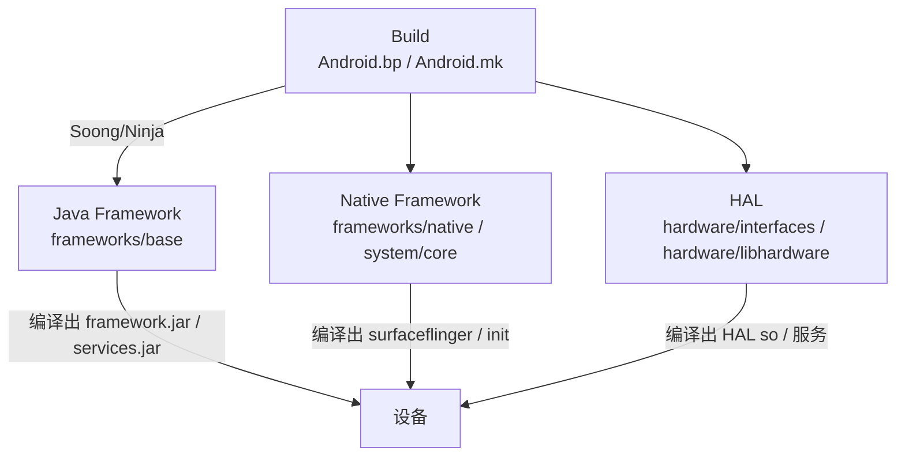
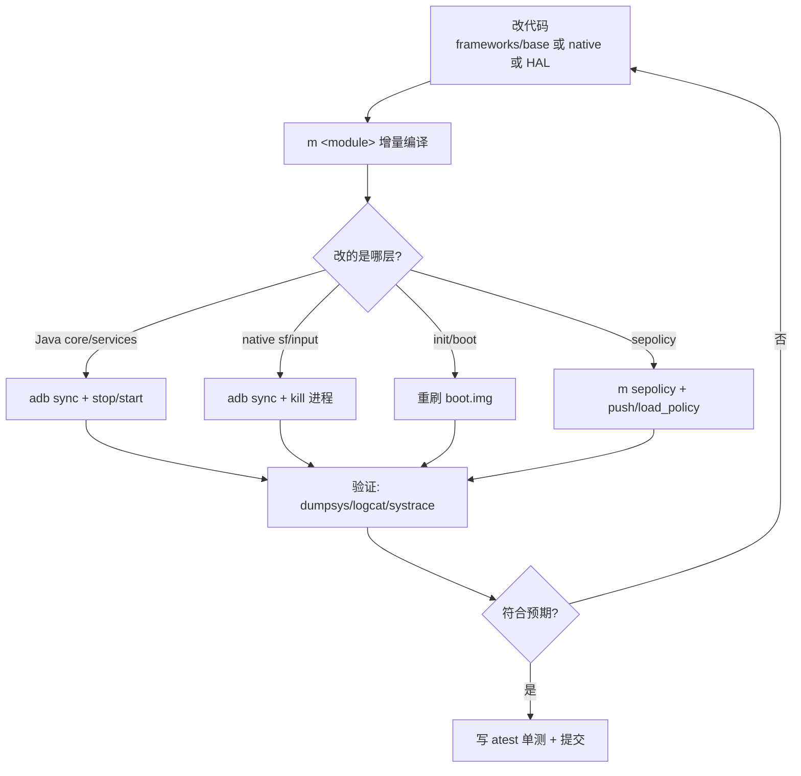

# Framework 开发实战：从改 AOSP 到上新服务

> 本篇是「Android Framework 深度解析体系」的**第二篇实战**（前一篇是 `Framework 调试实战`）。
> 调试实战讲「怎么看」，本篇讲「怎么改」——把前面 1–10 篇的原理落成可执行的开发动作：环境、增量编译、改 Java 层、新增系统服务、新增 HAL 服务、Native 验证、测试闭环。
> 命令以 **AOSP Android 12+（含 Android 14 / UpsideDownCake）** 为准，构建系统为 **Soong（`Android.bp`）+ Ninja**，兼容传统 `mmm`。
> 本版在每段代码后补充了**逐行注解**与**详解**，并把第 5 节的 SELinux 扩成**系统服务侧 + HAL 侧双套完整策略**，新增 `avc denied` 日志解读与 `audit2allow` 工作流。

---

## 目录

1. 开发全景：Framework 开发都在改哪里
2. 环境准备：repo / lunch / make / emulator
3. 增量编译与生效：m / adb sync / 重启策略
4. 实战一：改 Java Framework 并见效
5. 实战二：新增一个系统服务（AIDL 全链路 + SELinux + 权限）
   - 5.5 SELinux 系统服务侧完整策略（详解）
   - 5.8 读 avc denied 日志 + audit2allow 工作流（详解）
6. 实战三：新增一个 HAL 服务（AIDL HAL 示例）
   - 6.5 SELinux HAL 服务侧完整策略（详解）
7. Native 改动与验证（SurfaceFlinger / init 注意点）
8. 测试：atest 与单测
9. 开发-验证循环工作流
10. 常见坑与排雷（含 SELinux 专项）
11. 与体系其他篇的关系

---

## 1. 开发全景：Framework 开发都在改哪里



| 你想做的事 | 主要目录 | 产出物 |
|------------|----------|--------|
| 改四大组件/Context/Manager API | `frameworks/base/core/java` | `framework.jar` + `framework-res.apk` |
| 改系统服务(AMS/WMS/IMS…) | `frameworks/base/services` | `services.jar` |
| 改 SystemUI/设置/桌面 | `frameworks/base/packages` | 对应 apk |
| 改图形合成 | `frameworks/native/services/surfaceflinger` | `surfaceflinger` |
| 改输入 | `frameworks/native/services/inputflinger` | `libinputflinger.so` |
| 改 init / 基础命令 | `system/core` | `init` / `adb` 等 |
| 加/改硬件抽象 | `hardware/interfaces`（`hardware/libhardware` 旧式） | HAL so / HAL 服务 |
| 改 SELinux 策略 | `system/sepolicy` | `sepolicy` / `*_contexts` |

**详解**：Android 的代码分层与进程边界严格对应「谁改什么、编出什么、推到哪」。Framework 开发本质就是在 `frameworks/base`（Java 世界，跑在 `system_server` 或 App 进程）、`frameworks/native`（C++ 世界，跑在 `surfaceflinger`/`init` 等 native 进程）和 `hardware/interfaces`（HAL 世界，跑在 vendor 进程）三块之间游离。**改动落在哪一层，决定了你用什么模块名编译、用什么方式让设备生效**——这一点贯穿本篇第 3、7 节。

构建系统：**Soong（`Android.bp`）+ Ninja**，传统 `Android.mk` 仍能工作但新代码一律用 `Android.bp`。

---

## 2. 环境准备

### 2.1 拿到代码

```bash
mkdir aosp && cd aosp
repo init -u https://android.googlesource.com/platform/manifest -b android-14.0.0_rXX
#                  ↑ manifest 仓库地址          ↑ 指定分支（Android 14 用 android-14.0.0_rXX）
repo sync -j$(nproc)            # 全量同步，耗时较长（国内可加 --mirror 或换清华/中科大镜像）
```

**注解 / 详解**：`repo` 是 Google 为多仓库管理的封装，AOSP 由上百个 git 仓库组成（platform/frameworks/base、platform/system/sepolicy 等）。`manifest` 仓库描述「哪些仓库、在哪个分支、放在哪个目录」。`-b` 指定分支；做 Framework 开发务必锁死一个具体 tag/分支（如 `android-14.0.0_r1`），否则 `repo sync` 漂到别的提交会带来不必要的 diff。`nproc` 是并行任务数，越大越快（但吃内存）。

### 2.2 初始化构建环境

```bash
source build/envsetup.sh        # 加载 m/mm/mmm/lunch/croot 等命令到当前 shell
lunch aosp_arm64-eng            # 选目标：aosp_arm64 是 arm64 模拟器/真机；eng 工程师版
# 或模拟器常用：lunch aosp_x86_64-eng   （需要宿主机开启 KVM）
```

- `eng`：工程师版，root 可达、`adb remount` 可读写 `system`，适合开发。
- `userdebug`：接近 user 但可 root，适合验证。
- `user`：发布版，不能 remount，不能 adb sync。

**注解 / 详解**：`envsetup.sh` 注册的是一组 shell 函数（不是二进制）。`lunch` 做两件事：① 写环境变量（`TARGET_PRODUCT`、`TARGET_BUILD_VARIANT` 等）；② 决定 `out/target/product/<product>/` 产物目录。**只有 eng/userdebug 才能 `adb remount`**——第 3 节所有的 `adb sync` 都依赖这一点。选错 variant 后面会处处碰壁。

### 2.3 全编与启动模拟器（可选）

```bash
m -j$(nproc)                    # 首次全编，1~数小时（取决于机器）
emulator                        # 启动模拟器（lunch x86_64 时）
```

**详解**：首次必须全编一次，生成 boot image、system image、vendor image 和符号。后续都用增量编译（第 3 节），不必全编。

---

## 3. 增量编译与生效

**核心命令**：

| 命令 | 作用 |
|------|------|
| `m <module>` | 构建指定模块（Soong 推荐） |
| `m` | 同 `make`，构建默认目标（全编） |
| `mmm path/to/dir` | 构建某目录下的模块（兼容写法，新代码建议用 `m <module>`） |
| `m snod` | 重新打包 `system.img`（免重刷） |
| `adb sync` | 把 `out/target/product/...` 里的改动推到设备 |
| `adb shell stop && adb shell start` | 重启 zygote/system_server（runtime 重启，不重启整机） |

常用模块名：

```bash
m framework        # frameworks/base/core → framework.jar (+ boot image 部分)
m services         # frameworks/base/services → services.jar
m SystemUI         # frameworks/base/packages/SystemUI
m framework-res    # frameworks/base/core/res → framework-res.apk
m surfaceflinger   # frameworks/native/services/surfaceflinger
```

### 3.1 把改动推到设备

```bash
adb root                                  # 以 root 身份重连 adb（eng/userdebug）
adb remount                               # 重新挂载 system 为可读写（关键：否则 push 失败）
m services                                # 只编 services
adb sync                                  # 把编出的 services.jar 等推到设备对应分区
adb shell stop && adb shell start         # 重启 framework 让改动生效
```

**注解 / 详解**：`adb sync` 会按 `out` 目录结构同步 `system`/`vendor`/`data` 三个分区。它的前提是 `system` 可写——所以 `adb remount` 必须在前。改了 `frameworks/base/core` 的 boot classpath 类时，光 push `framework.jar` 可能不生效——因为 **boot image（`/system/framework/arm/boot-framework.*`）里 baked 了预编译 oat（dexpreopt）**。此时要么 `m bootimage` + 重刷，要么用 `WITH_DEXPREOPT=false` 关掉 dexpreopt 重新编（见第 10 节）。`stop && start` 重启的是 zygote，会连带杀掉 system_server 与所有 App，再被 init 重新拉起，相当于「软重启 framework」。

### 3.2 重启某个进程而非整机

| 进程 | 重启方式 |
|------|----------|
| system_server（AMS/WMS…） | `adb shell kill <pid>`，init 会自动重启；或 `stop && start` |
| surfaceflinger | `adb shell killall surfaceflinger`，init 重启 |
| SystemUI | `adb shell killall com.android.systemui` |
| zygote | `stop && start`（会重启所有 App + system_server） |

**详解**：Android 的关键 native 进程（surfaceflinger、system_server 经由 zygote）在 `init.rc` 里声明了 `onrestart` 行为，被杀后 init 会按 `class` 自动拉起。所以「kill 单个进程」是比整机重启快得多的验证手段。这也是把第 9 节工作流跑快的核心技巧。

---

## 4. 实战一：改 Java Framework 并见效

**目标**：在 `dumpsys activity` 里给每个进程多打一行自制信息（呼应 `调试实战` 的 dumpsys）。

1. 找到 `ActivityManagerService.dump()`（`frameworks/base/services/core/java/com/android/server/am/ActivityManagerService.java`）。
2. 在打印进程处加一行：

```java
// 在 dumpProcesses 相关逻辑里（遍历 ProcessRecord 的地方）
pw.println("    myTag: pid=" + proc.pid + " customNote=" + myNote);
//            ↑ 用 PrintWriter 输出一行；proc 是 ProcessRecord，pid 即进程号
//              myNote 是你自定义的字符串，可来自 mPidsSelfLocked 上的附加信息
```

3. 编译并生效：

```bash
m services                              # 只编 services.jar
adb sync                                # 推送
adb shell stop && adb shell start      # 重启 framework
adb shell dumpsys activity processes | grep myTag   # 看是否出现自制行
```

**详解**：这类「加日志/加 dumpsys 字段」是最常用的 Framework 调参入口，也是验证你对 `AMS 进程调度`（`3. AMS`）理解的最快方式。注意 `dumpsys activity` 的 `processes` 子命令遍历的是 AMS 维护的 `mProcesses`（`ProcessList.mProcessNames`）。如果你加的字段没出现，先确认 `services.jar` 真的被 `adb sync` 推进去了（`adb shell ls -l /system/framework/services.jar` 看修改时间）。

---

## 5. 实战二：新增一个系统服务（AIDL 全链路）

这是最能体现 `2. Binder IPC` 与 `3. AMS` 的实战。我们做一个 `DemoService`，提供 `getValue/setValue`，App 通过 `DemoManager` 调用。

### 5.1 定义 AIDL（Binder 接口）

```aidl
// frameworks/base/core/java/android/os/IDemoService.aidl
package android.os;

interface IDemoService {
    void setValue(int value);      // 普通方法：调用方阻塞等待返回
    int getValue();                // 普通方法：返回值
    oneway void asyncPing();       // oneway：调用方不阻塞、不等返回，仅 fire-and-forget
}
```

**注解 / 详解**：这正是 `2. Binder` 篇讲的「AIDL 生成 Proxy/Stub」。编译 `framework` 模块时，`aidl` 工具会为 `IDemoService` 生成 `IDemoService.Stub`（服务端骨架）和 `IDemoService.Stub.Proxy`（客户端代理）。`Stub` 在 system_server 进程里被实现、`asInterface(...)` 在 App 端得到 `Proxy`。`oneway` 关键字让这次 transaction 走 Binder 的「异步单向」通道——客户端 `transact()` 立即返回，不入等待队列，适合日志/心跳等不关心结果的调用（对应 Binder 驱动里的 `TF_ONE_WAY` 标志）。

### 5.2 实现 Stub（system_server 进程内）

```java
// frameworks/base/services/core/java/com/android/server/DemoService.java
package com.android.server;
import android.os.IDemoService;
import android.util.Slog;

public class DemoService extends IDemoService.Stub {   // 继承 AIDL 生成的 Stub：这是 Binder 实体
    private int mValue = 0;                            // 状态存在 system_server 进程内存里
    @Override public void setValue(int value) {
        mValue = value;
        Slog.i("Demo", "set " + value);                // 落 log，便于 logcat -s Demo 验证
    }
    @Override public int getValue() { return mValue; }
    @Override public void asyncPing() { Slog.i("Demo", "ping (oneway)"); }
}
```

**详解**：`extends IDemoService.Stub` 意味着 `DemoService` 是一个 **Binder 实体（BBinder 侧）**，跑在 `system_server` 的 Binder 线程池里。每次 App 跨进程调用，驱动把请求投递到 system_server 的某个 Binder 线程执行这里的方法——所以这个对象的方法可能被多线程并发调用，有共享状态（`mValue`）时要考虑同步（本例简单故省略）。

### 5.3 在 SystemServer 注册

```java
// frameworks/base/services/java/com/android/server/SystemServer.java
// 在 startOtherServices() 末尾 try 块里：
try {
    DemoService demo = new DemoService();                 // 创建服务对象
    ServiceManager.addService(Context.DEMO_SERVICE, demo);// 注册进 ServiceManager（句柄 0）
} catch (Throwable e) {
    Slog.e("SystemServer", "Failed to start DemoService", e);
}
```

**详解**：`ServiceManager.addService(...)` 把服务注册进 **ServiceManager**（Binder 句柄 0 的特殊服务，专门管「名字→IBinder」映射）。这正是 `2. Binder` 讲的「服务注册中心」。当 App 调用 `ServiceManager.getService("demo")` 时，驱动从 SM 拿到 `DemoService` 的 IBinder 引用。这里放在 `startOtherServices()` 是因为 DemoService 不依赖更早的 bootstrap 服务；若你的服务依赖 WMS/AMS 等，要注意注册时机，否则可能拿到 null。

### 5.4 暴露给 App（Context 常量 + Manager 封装）

```java
// frameworks/base/core/java/android/content/Context.java
public static final String DEMO_SERVICE = "demo";   // 服务名，须与 addService 第一个参数一致
```

```java
// frameworks/base/core/java/android/app/DemoManager.java
package android.app;
import android.annotation.SystemService;     // 标记这是一个系统服务 Manager
import android.content.Context;
import android.os.IDemoService;
import android.os.RemoteException;

@SystemService(Context.DEMO_SERVICE)          // 注解：声明该 Manager 对应的系统服务名
public class DemoManager {
    private final IDemoService mService;       // 持有的是 Binder 代理，不是实体
    public DemoManager(IDemoService service) { mService = service; }
    public void setValue(int v) {
        try { mService.setValue(v); }          // 调用会跨进程 transact 到 system_server
        catch (RemoteException e) { throw e.rethrowFromSystemServer(); } // 远端死亡时转成系统异常
    }
    public int getValue() {
        try { return mService.getValue(); }
        catch (RemoteException e) { return -1; }
    }
}
```

```java
// frameworks/base/core/java/android/app/SystemServiceRegistry.java
registerService(Context.DEMO_SERVICE, DemoManager.class,
    new CachedServiceFetcher<DemoManager>() {            // 缓存：每个 Context 只建一次
        @Override public DemoManager createService(ContextImpl ctx) {
            IBinder b = ServiceManager.getService(Context.DEMO_SERVICE); // 取 Binder 代理
            return new DemoManager(IDemoService.Stub.asInterface(b));    // 转成强类型 Proxy
        }
    });
```

**详解**：这是 App 侧的标准「系统服务门面」模式。`@SystemService` 注解让 `getSystemService(DemoManager.class)` 这种强类型 API 可用（Android 9+ 推的 typed system service）。`SystemServiceRegistry` 是全局注册表，`getSystemService()` 最终走到这里。`IDemoService.Stub.asInterface(b)` 是 Binder 的关键判据：若 `b` 来自本进程（同进程）则直接返回实体，跨进程则返回 `Proxy`——App 端永远是 `Proxy`。

### 5.5 SELinux：系统服务侧完整策略（详解）⭐

> 加了上面的 Java 代码若直接 `addService`，`logcat` 会刷 `avc: denied`——**SELinux 拦了**。SELinux 是 Linux 的 **MAC（强制访问控制）**，叠加在传统的 DAC（UID/GID/permission）之上。即便你的 UID 是 root，只要 SELinux 策略不允许，内核照样拒绝。Framework 开发里 90% 的「莫名其妙不生效」其实是它在拦。

**SELinux 四元模型**：一条 allow 规则形如
```
allow 主体域 客体类型:客体类 { 权限 };
```
- **主体（subject）**：进程的域（domain），如 `system_server`、`untrusted_app`
- **客体（object）**：被访问对象的类型（type），如 `demo_service`、`system_data_file`
- **客体类（class）**：对象种类，如 `service_manager`、`file`、`binder`
- **权限（perm）**：具体操作，如 `add`、`find`、`read`

**策略仓库 `system/sepolicy` 目录**：
- `public/`：对外稳定 API（属性、类、部分类型），vendor 镜像可见
- `private/`：平台私有规则，仅 system 用（多数新增规则放这里）
- `vendor/`：vendor 镜像附加规则（Treble 隔离下的厂商策略）
- `prebuilts/`：预编译的 neverallow 等基线

**新增 DemoService 的 SELinux 落地（4 步）**：

**① 定义类型 `system/sepolicy/private/service.te`**
```
type demo_service, system_api_service, system_server_service, service_manager_type;
```
注解：
- `demo_service`：新类型名（客体类型）
- `system_server_service` 属性 → system_server 自动获得 `add` 权限（规则在 `system_server.te`：`allow system_server system_server_service:service_manager add;`）
- `system_api_service` 属性 → 标记为平台公开 API 服务，便于受控的客户端 `find`
- `service_manager_type` → 声明它是「servicemanager 里的服务」这一客体类

**② 映射服务名 `system/sepolicy/private/service_contexts`**
```
demo u:object_r:demo_service:s0
```
注解：binder 服务名 `demo`（必须和 `ServiceManager.addService("demo", ...)` 的 `"demo"` 完全对齐）映射到 `demo_service` 类型。`u:object_r:...:s0` 是 SELinux 安全上下文（user:role:type:level），这里的 `type` 字段是关键。

**③ 给 App 域加 find 权限（按需）**
```
# system/sepolicy/private/system_app.te         （系统签名 App 域）
allow system_app demo_service:service_manager find;
```
注解：只有 `find`（查到 IBinder）权限还不够——App 调 `transact` 还要服务方法本身允许。若服务方法涉及敏感资源（如读文件、改属性），还需在对应客体类（`file`/`property` 等）上给该 App 域加 allow。普通第三方 App 走 `untrusted_app` 域，按同样句式加即可（但要注意 neverallow 边界，见第 10 节）。

**④ 调试：用 permissive 排除 SELinux 嫌疑（开发期技巧）**
```
adb shell getenforce        # 看当前 Enforcing / Permissive
adb shell setenforce 0      # 切到 Permissive（仅 eng/userdebug，临时关闭强制）
```
注解：切 Permissive 后若服务能调通，说明就是 SELinux 拦的，再回去看 `avc` 日志补规则（见 5.8）。**注意 `setenforce 0` 只关强制、不关审计**，拒绝仍会记日志——正好用来生成规则。

### 5.6 权限（可选，保护敏感调用）

```xml
<!-- frameworks/base/core/res/AndroidManifest.xml -->
<permission android:name="android.permission.MANAGE_DEMO"
    android:protectionLevel="signature|system" />   <!-- 仅系统签名/特权 App 可声明 -->
```
在服务方法里 `enforceCallingOrSelfPermission("android.permission.MANAGE_DEMO", ...)`。

**详解**：SELinux 管「进程能不能跨边界调」，Android 权限管「App 有没有资格调」。两者是正交的两层。`signature|system` 表示只有和 framework 同签名、或被标记为 system/privileged 的 App 才能 `uses-permission` 拿到它。这层保护在前，SELinux 保护在后——双重保险。

### 5.7 编译生效

```bash
m framework services            # 编 framework.jar（含 AIDL 生成代码 + Manager）+ services.jar
m sepolicy                      # 编 SELinux 策略（改了 sepolicy 必须编这个）
adb sync                        # 推送
adb shell stop && adb shell start
# App 端：
DemoManager dm = getSystemService(DemoManager.class);
dm.setValue(42); int v = dm.getValue();   // 走 Binder 跨进程
```

**详解**：改了 `system/sepolicy` 后**必须 `m sepolicy`**——否则 SELinux 规则没进 `sepolicy` 二进制，设备上的策略还是旧的，`addService` 照样被拒。`m framework services` 若涉及 `frameworks/base/core` 的 boot classpath 类，留意第 10 节的 dexpreopt 陷阱。

### 5.8 读 avc denied 日志 + audit2allow 工作流（详解）⭐

当 SELinux 拒绝，内核会在 `dmesg`/`logcat` 打印：

```
avc: denied { add } for service=demo pid=1234 \
    scontext=u:r:system_server:s0 \
    tcontext=u:object_r:demo_service:s0 \
    tclass=service_manager permissive=0
```

四要素拆解：
- `scontext`：**主体域**（谁在访问）= `system_server`
- `tcontext`：**客体类型**（访问谁）= `demo_service`
- `tclass`：**客体类** = `service_manager`
- `{ add }`：被拒的**权限**

**用 audit2allow 生成规则（宿主机侧）**：
```bash
adb shell dmesg | grep avc > avc.log        # 抓取内核 avc 日志
# 或：adb logcat -b all -d | grep avc > avc.log
audit2allow -i avc.log                      # 把拒绝转成 allow 文本
# 输出示例：allow system_server demo_service:service_manager add;
```

**注解 / 详解**：`audit2allow` 只是把「拒绝事件」机械地翻译成 `allow` 文本，**它不判断合理性**。直接复制粘贴可能违反 `neverallow`（全局禁止规则），导致 `m sepolicy` 编译失败。正确做法是：把生成的 allow 放进**正确的域文件**（如 system_server 的规则放 `system_server.te`，不要自建宽松类型），再编译验证。

**热更新策略（eng 调试）**：
```bash
m sepolicy
adb push out/target/product/<product>/obj/ETC/sepolicy_intermediates/sepolicy /sys/fs/selinux/policy
# 或：adb shell load_policy < out/.../sepolicy    （从 host 喂给内核）
adb shell dmesg | grep avc                    # 再次确认无新拒绝
```

---

## 6. 实战三：新增一个 HAL 服务（AIDL HAL）

对应 `7. HAL 与 Treble`。Android 12+ 推荐 **AIDL HAL**（替代旧 HIDL）。

### 6.1 定义 AIDL 接口

```aidl
// hardware/interfaces/demo/aidl/android/hardware/demo/IDemo.aidl
package android.hardware.demo;

interface IDemo {
    int getVersion();              // 返回 HAL 版本
    void doSomething(in int param);// in：参数从客户端传向服务端
}
```

```bp
// hardware/interfaces/demo/aidl/Android.bp
aidl_interface {
    name: "android.hardware.demo",
    srcs: ["android/hardware/demo/*.aidl"],
    stability: "vintf",            // 声明为稳定 HAL 接口（HAL 必须稳定，跨版本兼容）
    backend: { cpp: { enabled: true }, java: { enabled: true }, ndk: { enabled: true } },
    //         ↑ 同时生成 C++ / Java / NDK 三种后端，framework(native) 与 App 都能用
}
```

**注解 / 详解**：`stability: "vintf"` 是 AIDL HAL 与普通 AIDL 接口的分水岭——它告诉构建系统这个接口要纳入 **VINTF（Vendor Interface）** 版本管理，vendor 实现与 framework 使用的版本必须匹配。`backend` 同时开 cpp/java/ndk，是因为 framework native 侧用 cpp/ndk、Java framework 与 App 用 java。`aidl_interface` 会自动生成 `BnDemo`（服务端骨架）和 `IDemo`（客户端，含 `fromBinder`）。

### 6.2 实现（native 服务，注册到 servicemanager）

```cpp
// hardware/interfaces/demo/aidl/default/Demo.cpp
#define LOG_TAG "DemoHal"
#include <android/binder_process.h>   // ABinderProcess_* 线程池管理
#include <android/binder_manager.h>   // AServiceManager_addService / getService
#include "Demo.h"                       // 由 aidl_interface 生成的 BnDemo 头

namespace aidl::android::hardware::demo {

ndk::ScopedAStatus Demo::getVersion(int* _aidl_return) {
    *_aidl_return = 1;                 // 通过出参返回版本
    return ndk::ScopedAStatus::ok();
}
ndk::ScopedAStatus Demo::doSomething(int /*param*/) {
    return ndk::ScopedAStatus::ok();   // NDK 后端用 ScopedAStatus 表达成功/失败
}

} // namespace

int main() {
    ABinderProcess_setThreadPoolMaxThreadCount(1);   // 设 Binder 线程池上限
    auto demo = ndk::SharedRefBase::make<aidl::android::hardware::demo::Demo>();
    const auto binder = demo->asBinder();            // 拿到 BBinder
    AServiceManager_addService(binder.get(), "android.hardware.demo.IDemo/default");
    //                                    ↑ 注册名：包名.接口名/实例名（default 是默认实例）
    ABinderProcess_joinThreadPool();                 // 进入线程池循环，等待客户端调用
    return 0;
}
```

**注解 / 详解**：AIDL HAL 进程是独立的 **native 进程**，通过 NDK Binder（`/dev/binder`，普通 `servicemanager`）注册——这与旧式 HIDL 走 `hwservicemanager`/`/dev/hwbinder` 不同（详见 `7. HAL`）。`AServiceManager_addService` 的第二个参数是「接口名/实例名」格式，`default` 表示默认实例，framework 侧用 `AServiceManager_getService("android.hardware.demo.IDemo/default")` 取回。

### 6.3 Framework 侧调用

```cpp
// frameworks/native 或你的 native 服务里
#include <android/binder_manager.h>
#include <android/binder_ibinder.h>
#include "android/hardware/demo/BnDemo.h"      // 由 aidl_interface(cpp backend) 生成

auto binder = AServiceManager_getService("android.hardware.demo.IDemo/default");
//            ↑ 拿 IBinder；若 HAL 进程还没起，这里返回 null，需处理
std::shared_ptr<IDemo> demo = IDemo::fromBinder(binder);   // 转成强类型客户端
int ver = 0; demo->getVersion(&ver);                        // 跨进程调到 HAL
```

**详解**：`IDemo::fromBinder(binder)` 是 NDK 端的 `asInterface` 等价物。关键点：**HAL 进程可能晚于 framework 启动**，所以 `getService` 可能返回 null——生产代码要用 `AServiceManager_waitForService` 或重试，否则 framework 启动早期拿不到 HAL 会崩溃（这就是 `7. HAL` 讲的「服务可用性时序」问题）。

> 旧式 **HIDL** 走 `hwservicemanager` + `android.hidl` 命名空间；新式 **AIDL HAL** 走普通 `servicemanager`（`/dev/binder`），稳定性靠 `stability: "vintf"`。需要被 framework 依赖的真实 HAL 还要在 **VINTF manifest**（`device/<vendor>/manifest.xml`）里声明接口名。

### 6.4 编译与部署

```bash
m android.hardware.demo            # 编 AIDL 接口 + 默认实现
m <your_native_consumer>           # 编调用方（framework native 或你的服务）
m sepolicy                         # 若加了新 HAL 域/服务上下文（见 6.5）
adb sync
adb shell start <demo hal 服务>     # 启动 HAL 进程（或由 init.rc 自启）
```

### 6.5 SELinux：HAL 服务侧完整策略（详解）⭐

> AIDL HAL 进程跑在**独立域**，遵循 `hal_attribute` 宏约定。漏了 SELinux，HAL 进程会停在错误域（甚至起不来），framework 侧 `getService` 拿到 null。

**① 类型与属性 `system/sepolicy/public/hal_demo.te`**
```
hal_attribute(demo);
```
注解：`hal_attribute(demo)` 宏一次性生成：
- `hal_demo`：服务端主体域（HAL 进程自身）
- `hal_demo_client`：所有客户端的属性（谁允许连它）
- `hal_demo_server`：服务端属性
以及基础 allow 规则（客户端对服务端的 binder 调用等框架性许可）。

**② 进程域与域转换 `system/sepolicy/private/hal_demo_default.te`**
```
type hal_demo_default, domain, mlstrustedsubject;
hal_server_domain(hal_demo_default, demo)    # 声明它是 demo HAL 的服务端
hal_client_domain(hal_demo_default, demo)    # 它也可作为其他 HAL 的客户端（按需）
```
注解：`hal_demo_default` 是默认实例进程域；`hal_server_domain` / `hal_client_domain` 是两个宏，自动补上「作为 server/client 所需的 binder/servicemanager 权限」与属性关联，避免你手写一堆 allow。

**③ 可执行文件上下文 `system/sepolicy/private/file_contexts`**
```
/vendor/bin/hw/android\.hardware\.demo\-service u:object_r:hal_demo_default_exec:s0
```
注解：HAL 服务二进制路径 → 类型 `hal_demo_default_exec`。结合 init 启动该服务时的 `domain_trans` 规则，进程会从 `init` 域自动 transition 到 `hal_demo_default` 域（这就是「为什么进程一启动就进了正确域」）。正则里 `-` 要转义，否则匹配不到。

**④ AIDL HAL 注册到 servicemanager 的上下文**
```
# service_contexts（注册到普通 servicemanager 时）
android.hardware.demo.IDemo/default u:object_r:hal_demo_service:s0
```
`system/sepolicy/private/service.te`：
```
type hal_demo_service, hal_service_type, service_manager_type;
```
注解：AIDL HAL 走普通 `servicemanager`（`/dev/binder`）时，服务名需在此登记上下文；若走 vendor 的 `vndservicemanager`，则写进 `vndservice_contexts` 且类型为 `vndservice_manager_type`。`hal_service_type` 是 HAL 服务专用的属性，便于受控访问。

**⑤ Treble 边界提醒（重要）**：
- system 进程（system_server、App）访问 HAL 时，**不能**直接 `read/write` vendor 文件类型，必须经由 binder HAL 接口——这就是 Treble 的 system/vendor 隔离。
- HAL 域访问自己 vendor 文件 OK，但访问 system 文件类型受 neverallow 限制。
- 违反边界会在 `m sepolicy` 时 `neverallow` 检查失败，编译不过（报错会指出哪条 neverallow 被触犯）。

**⑥ 验证**：
```
adb shell ps -Z | grep demo        # 看 HAL 进程是否进入 hal_demo_default 域
adb shell ls -Z /vendor/bin/hw/    # 看二进制文件类型是否为 hal_demo_default_exec
adb shell dmesg | grep avc         # 看是否有权限拒绝
```

---

## 7. Native 改动与验证

### 7.1 SurfaceFlinger（图形）

```bash
m surfaceflinger                    # 编 native 可执行
adb sync                            # 推送
adb shell killall surfaceflinger   # init 自动重启（见 3.2）
adb shell dumpsys SurfaceFlinger | grep -i demo   # 验证改动
```

**详解**：适合在 `handleMessageRefresh` / `doComposition`（呼应 `5. SurfaceFlinger`）里加合成统计。native 进程被 `kill` 后由 init 按 `class main` 重启，比整机快得多。注意：native 二进制 push 后要确认 `adb sync` 真推到了 `/system/bin/surfaceflinger`（`ls -l` 看 mtime）。

### 7.2 init（危险，改 ramdisk）

`init` 在 `boot.img` 的 ramdisk 里，光 `adb sync` 不生效，必须重刷 `boot.img`：

```bash
m init
# 重打包 boot.img（mkbootimg 或 m bootimage）
fastboot flash boot out/target/product/.../boot.img
fastboot reboot
```

⚠️ init 出问题会导致设备起不来，开发机/模拟器做前务必确认可回退（保留上一个可用的 boot.img）。

---

## 8. 测试：atest 与单测

```bash
atest FrameworksServicesTests                 # 跑 frameworks/services 既有测试
atest CtsWindowManagerDeviceTestCases         # 跑 CTS 窗口管理用例
atest DemoServiceTest                         # 跑自己加的测试类
```

加单测示例：

```java
// frameworks/base/services/tests/servicestests/src/com/android/server/DemoServiceTest.java
@SmallTest
public class DemoServiceTest {
    @Test public void testSetGet() {
        DemoService s = new DemoService();    // 单测直接 new，绕过 Binder
        s.setValue(7);
        assertEquals(7, s.getValue());        // 验证业务逻辑
    }
}
```

对应 `Android.bp` 里加 `android_test` 目标，随 `atest` 发现。

**详解**：`atest` 是 AOSP 的测试编排工具，自动定位测试模块、安装、执行、汇总。给新服务加单测时，建议在 `servicestests`（跑在 test 进程、可直接 new 服务对象）里测纯逻辑，在 `cts`/device 测试里测跨进程行为。

---

## 9. 开发-验证循环工作流



典型一天就是这条循环转 N 圈。

---

## 10. 常见坑与排雷

| 现象 | 原因 | 解法 |
|------|------|------|
| 改了 `frameworks/base/core` 但 `adb sync` 后不生效 | boot image 里 baked 了 oat（`dexpreopt`） | `export WITH_DEXPREOPT=false` 后重编；或 `m bootimage`+重刷 |
| App 调 `@hide` API 编译报错 | 非 SDK 接口被隐藏 | Framework 内部用 `hide` 是对的；App 要调用须走 Manager + 系统签名 |
| `addService` 报 SELinux denial | 没在 `service_contexts`/`service.te` 声明 | 补 SELinux 类型与 `allow` 规则（见 5.5 / 5.8） |
| `neverallow` 检查失败 | sepolicy 违反全局 neverallow | 用正确域（如 `system_api_service`/`system_server_service`）而非自建宽松域 |
| HAL 客户端 `fromBinder` 拿到 null | 服务没起来 / manifest 没声明 / SELinux 域错 | 确认 HAL 进程已 `addService`、VINTF manifest 加接口、进程进了正确域（`ps -Z`） |
| `mmm` 找不到模块 | 目录无 `Android.bp`/已迁移 Soong | 改用 `m <module名>` |
| 模拟器黑屏/起不来 | 编的是 arm 却 lunch x86 | `lunch` 架构与镜像一致 |
| `adb remount` 失败 | `user` 版本或 verity 开 | 用 `eng`/`userdebug`；`adb disable-verity` 后重启 |

**SELinux 专项排雷**：

- **`avc: denied` 但 `audit2allow` 生成的规则编不过**：几乎都是撞了 `neverallow`。读 `m sepolicy` 报错里的 neverallow 编号，把规则放进**正确域文件**，或改用更精确的客体类型，不要新建一个「万能类型」。
- **改了 sepolicy 但设备行为没变**：忘了 `m sepolicy`，或没 push/load 新的 `sepolicy` 二进制（见 5.8）。`adb shell cat /sys/fs/selinux/policy` 看大小/时间确认是否生效。
- **HAL 进程起来了却进错域（停在 `init` 或 `unlabeled`）**：`file_contexts` 的正则没匹配到二进制路径，或 `domain_trans` 缺失。用 `ls -Z /vendor/bin/hw/xxx` 看实际类型，对照 `file_contexts` 修正。
- **系统 App 能 find 服务、第三方 App 不行**：`untrusted_app` 域没加 `find` allow，且受 `neverallow` 限制（第三方 App 通常不应直连私有系统服务，应走公开 Manager API）。

---

## 11. 与体系其他篇的关系

- **`2. Binder IPC`**：实战二/三的 AIDL 接口、Proxy/Stub、`ServiceManager.addService`、`AServiceManager_addService`、UID 校验都出自这里。
- **`3. AMS 进程调度`**：实战二把服务注册进 `system_server`，AMS 管辖其进程生命周期；SELinux 限制的是进程域能做什么。
- **`4. WMS` / `5. SurfaceFlinger`**：实战一在 AMS 加 dumpsys 字段、实战七改 SurfaceFlinger，直接对应运行时验证。
- **`7. HAL 与 Treble`**：实战三的 AIDL HAL、`stability: vintf`、VINTF manifest、hwbinder vs /dev/binder 全部来自这里；SELinux 的 Treble 边界（system 域不直接访问 vendor 类型）是 HAL 篇的强制访问控制落地。
- **`10. Framework 调试实战`**：本篇的「验证」步骤（`dumpsys`/`logcat`/`systrace`）正是前一篇教的工具；**新增的 `avc denied` 排查**也是调试实战 logcat 标签（`avc`/`SELinux`）的延伸——**改完用调试篇的方法看效果**，两篇一体。

> 至此体系从「原理（1–9）→ 观测（10）→ 动手（11）」形成完整闭环：懂原理、会看、能改、且知道 SELinux 这道最终闸门怎么开。
