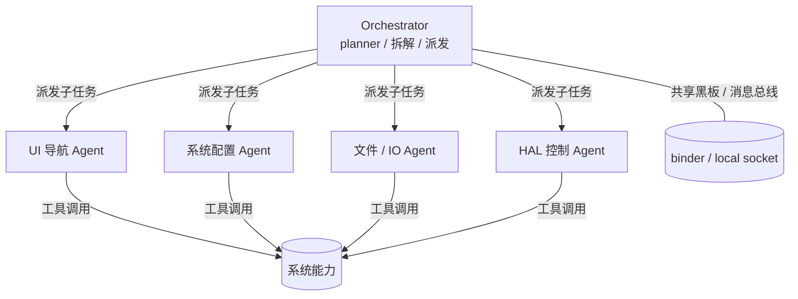
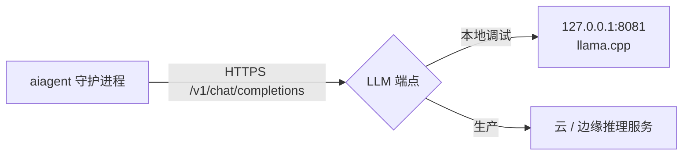

# AOSP 集成 AI 多智能体 — 设计文档

> 目标：把 AI 多智能体从「App 进程内的 AccessibilityService agent」抬到 **AOSP 系统层**，
> 让多个专职 agent 经 Binder 调度系统特权能力（AMS / WMS / InputManager / SettingsProvider / HAL）。
> 目标版本：**Android 14（API 34, UpsideDownCake）**。
> 推理部署：**云端 / 边缘端点**（daemon 走 HTTPS 调外部 LLM，先接本地 `:8081` llama.cpp 验证）。

---

## 1. 总体架构（4 层）

```mermaid
flowchart TD
    A[接入层<br/>App / Settings UI / 第三方] -->|binder: IAIAgentManager| B
    B[系统服务层<br/>AIAgentManagerService<br/>(system_server)] -->|binder / vndbinder| C
    C[智能体运行时<br/>aiagent 守护进程 (native)] -->|hwbinder / AIDL HAL| D
    D[能力 / 硬件层<br/>HAL + NPU + kernel]

    subgraph SYS[system_server 特权上下文]
      B
    end
    subgraph RT[独立进程]
      C
    end
```

核心分法（与 in-app agent 最大的区别）：

- **大脑（daemon）**：native 守护进程托管 LLM client + orchestrator + worker agents。
  它**不直接**调用特权 API，只通过 Binder 向系统服务请求执行。
- **手（system service）**：`AIAgentManagerService` 跑在 `system_server`，是唯一能调特权 API 的地方。
- 这样 daemon 权限面最小、SELinux 最好收口，且符合 Treble 的 `/system` ↔ `/vendor` 解耦思路。

---

## 2. AOSP（Android 14）真实集成点

### 2.1 接口与注册（framework 内部 AIDL，无需 `aidl_interface` 稳定性）

| 文件 | 作用 |
|---|---|
| `frameworks/base/core/java/android/os/aiagent/IAIAgentManager.aidl` | 接口定义：`submitGoal()` / `registerAgent()` / `executeTool()` / `setLlmEndpoint()` |
| `frameworks/base/core/java/android/os/aiagent/AIAgentManager.java` | 公开包装类（app 侧拿到的 manager） |
| `frameworks/base/core/java/android/content/Context.java` | 加 `public static final String AI_AGENT_SERVICE = "aiagent";` |
| `frameworks/base/core/java/android/app/SystemServiceRegistry.java` | `registerService(...)` 绑定 `AIAgentManager` |
| `frameworks/base/services/core/java/com/android/server/aiagent/AIAgentManagerService.java` | `extends IAIAgentManager.Stub` 实现 |
| `frameworks/base/services/java/com/android/server/SystemServer.java` | `startOtherServices()` 里 `startService` + `ServiceManager.addService(...)` |

`SystemServer.startOtherServices()` 关键片段：

```java
// 在 startOtherServices() 末尾附近
traceBeginAndSlog("StartAIAgentManager");
mSystemServiceManager.startService(AIAgentManagerService.class);
traceEnd();
```

`AIAgentManagerService` 构造/onStart 中：

```java
public void onStart() {
    publishBinderService(Context.AI_AGENT_SERVICE, mStub); // 内部即 ServiceManager.addService("aiagent", stub)
}
```

`SystemServiceRegistry`：

```java
registerService(Context.AI_AGENT_SERVICE, AIAgentManager.class,
    (ctx, svc) -> new AIAgentManager(ctx, IAIAgentManager.Stub.asInterface(svc)));
```

### 2.2 系统服务可调用的一特权能力（"抬到系统层"的增益）

| 能力 | API（system_server 内部可达） |
|---|---|
| 启动 / 切换 App | `ActivityManagerInternal` / `mActivityManager.startActivityAsUser(...)` |
| 注入触摸/按键（替代 `AccessibilityService.dispatchGesture`，更直接） | `InputManager.getInstance().injectInputEvent(event, InputManager.INJECT_INPUT_EVENT_MODE_ASYNC)`；或 `WindowManagerService.injectPointerEvent / injectKeyEvent` |
| 改系统设置 | `Settings.Global.putInt(mContext.getContentResolver(), ...)`（system_server 可写 secure/global） |
| 包管理 | `IPackageManager`（`mPackageManager`） |
| 感知 UI 树 | `ActivityTaskManager` 拿顶层 Activity；完整可交互树复用 `uiautomator dump` 文件解析，或保留一个 `AccessibilityService` 当"眼睛" |

> 注：system_server 不是 `Instrumentation`，拿不到 `UiAutomation`。**感知建议两条路**：
> (a) shell 调 `uiautomator dump /sdcard/ui.xml` 后解析（复用 in-app agent 的 `UiNode` 解析器）；
> (b) 保留一个带 `BIND_ACCESSIBILITY_SERVICE` 的系统级 `AccessibilityService` 作眼睛，通过 Binder 把节点树喂给 service。

### 2.3 原生守护进程（托管 agent loop / LLM client）

```
frameworks/native/services/aiagent/aiagent.cpp    // main：起 orchestrator + workers，连 IAIAgentManager
frameworks/native/services/aiagent/Android.bp     // cc_binary
frameworks/native/services/aiagent/aiagent.rc     // init 启动
```

`aiagent.rc`：

```
service aiagent /system/bin/aiagent
    class main
    user system
    group system
    disabled            # 由 system_server 按需 start，或 oneshot 常驻
    seclabel u:r:aiagent_domain:s0
```

daemon 启动后用 `ServiceManager.getService("aiagent")` 拿到 `IAIAgentManager` 代理，向系统服务请求特权执行。

### 2.4 可选：NPU 推理做成 HAL（本方案先不做，预留）

```
hardware/interfaces/aiagent/      # aidl_interface { name:"android.hardware.aiagent", ... } + @VintfStability
```

端侧推理标准路径是 **NNAPI**（Android 14 已是 mainline 模块 `packages/modules/NeuralNetworks/`，
C API 在 `frameworks/ml/nn/runtime/include/NeuralNetworks.h`），上层用 TFLite 的 `NnApiDelegate` 把图丢到 NPU/DSP。
**当前选云端端点，故跳过此层**，仅在 daemon 内预留 `LlmBackend` 接口以便后续切换。

### 2.5 SELinux / 权限（最易翻车）

| 文件 | 内容 |
|---|---|
| `frameworks/base/core/res/AndroidManifest.xml` | `<permission android:name="android.permission.MANAGE_AI_AGENTS" android:protectionLevel="signature\|privileged" />` |
| `system/sepolicy/private/service_contexts` | `aiagent u:object_r:aiagent_service:s0` |
| `system/sepolicy/public/service.te` | `aiagent_service` 映射 `service_manager_type` |
| `system/sepolicy/private/aiagent.te` | `type aiagent_service ...; typeattribute aiagent_service service_manager_type;`；daemon 域 `type aiagent_domain ...;` 最小权限 |

常见坑：
1. 不加 `service_contexts` 就注册不上 / 查不到服务。
2. daemon 域要给**最小**权限：出网（云端推理）、`vndbinder`/`hwservice_manager`（访问 HAL）、`/data/misc/aiagent/` 文件读写。
3. `neverallow` 检查会直接让编译失败，权限别开太大。
4. `MANAGE_AI_AGENTS` 必须 `signature|privileged`，只有系统 / 特权 App 能持有。

---

## 3. 多智能体拓扑与协议



**关键约束：端侧跑多个 LLM 实例太重** → 采用 **单模型多角色**：

- 一个共享 LLM session（云端端点）。
- Orchestrator 用 planner 系统提示词把 goal 拆成子任务，经「共享黑板」（in 进程 channel，或跨进程 `IAgentBus` Binder）派发给 worker。
- 每个 worker 带**角色系统提示词 + 自己的工具 schema**。
- worker 的「工具」本质就是系统服务暴露的能力：`tap(x,y)`→`InputManager.injectInputEvent`；`launch(pkg)`→AMS；`setSetting`→SettingsProvider；`readHAL`→`android.hardware.*` 的 AIDL/HIDL 调用。
- 若 worker 要强隔离，各自独立进程、各自 Binder 端点，orchestrator 经 `IAgentBus` 协调。

---

## 4. 推理部署：云端 / 边缘端点方案

### 4.1 链路



- daemon 用 **OkHttp / libcurl(bionic)** 走 HTTPS 调 `base_url + /v1/chat/completions`。
- 先接你本地 `:8081`（llama.cpp server，已就绪），验证回环后再切云端。
- 设备侧通过 `adb reverse tcp:8081 tcp:8081` 把本地 8081 映射到设备 localhost，daemon 直接连 `127.0.0.1:8081`。

### 4.2 协议（兼容 tool calling + 文本 JSON 兜底）

- 首选 **OpenAI function calling**：把每个 worker 的工具 schema 作为 `tools[]` 下发，模型回 `tool_calls`。
- **兜底**：小模型 tool calling 不稳时，要求模型在文本里输出 ```json {"tool":"tap","args":{...}}```，daemon 正则/JSON 解析后执行（复用 in-app agent 的 `OpenAiLlmClient` 降级逻辑）。
- 跨分区稳定性：daemon 与 system_server 之间的 `executeTool()` 用普通 framework AIDL（同进程族），无需 `@VintfStability`；仅当 daemon 落 `/vendor` 时才需要稳定 AIDL。

---

## 5. 与 in-app agent（`android-inapp-agent`）的映射

| in-app agent 组件 | AOSP 版去处 |
|---|---|
| `AgentLoop` / `Tool` / `ToolRegistry` / `Schema` | **原样搬**进 daemon（或 system service Java） |
| `MockLlmClient` / `OpenAiLlmClient` | **原样搬**（先接 8081 验证，含文本 JSON 兜底） |
| `DeviceTools`（执行） | 从 `AccessibilityService` 换成 system_server 特权 API（`InputManager` 注入）+ HAL |
| `Perception`（`UiNode` 解析） | 继续用 `uiautomator dump` 解析，或保留 AccessibilityService 当眼睛 |
| `MainActivity` UI | 换成 Settings 里开关 / `IAIAgentManager` 客户端 |

> 即「受限 App 的眼+手」升级为「系统特权手 + 可选 App 眼」。**约 70% 代码可复用**。

---

## 6. MVP 落地步骤（5 步）

1. 加 `IAIAgentManager.aidl` + `AIAgentManager` + 挂 `Context` / `SystemServiceRegistry`。
2. `SystemServer.startOtherServices()` 启动并 `addService("aiagent", ...)`。
3. service 实现特权工具：`launchApp` / `injectInput` / `setSetting` / `getUI`（复用 dump 解析）。
4. 加 SELinux `.te` + `service_contexts` + 权限 `MANAGE_AI_AGENTS`。
5. 接 LLM（先 8081 / Mock），跑通 `submitGoal → orchestrator → 工具调用 → 回显`。

---

## 7. 风险与坑清单

- **SELinux neverallow**：权限只给最小集，编译失败先看 `neverallow` 报错行。
- **服务注册时序**：`startOtherServices()` 里 `InputManager` / `ActivityManager` 等必须已就绪（它们在此之前启动，顺序 OK）。
- **云端推理延迟 / 断网**：orchestrator 需超时与降级（超时转 Mock 或报错回显）。
- **注入输入需要 `INJECT_EVENTS` 权限**（signature 级），system_server 天然具备，第三方调需走 `IAIAgentManager` 代理。
- **隐私 / 安全**：agent 能读屏、注入输入、改设置，必须 `signature|privileged` 权限 + 仅授权 App 可 `submitGoal`。
- **多 agent 并发**：共享 LLM session 需串行化请求或用连接池，避免 tool 调用错乱。
