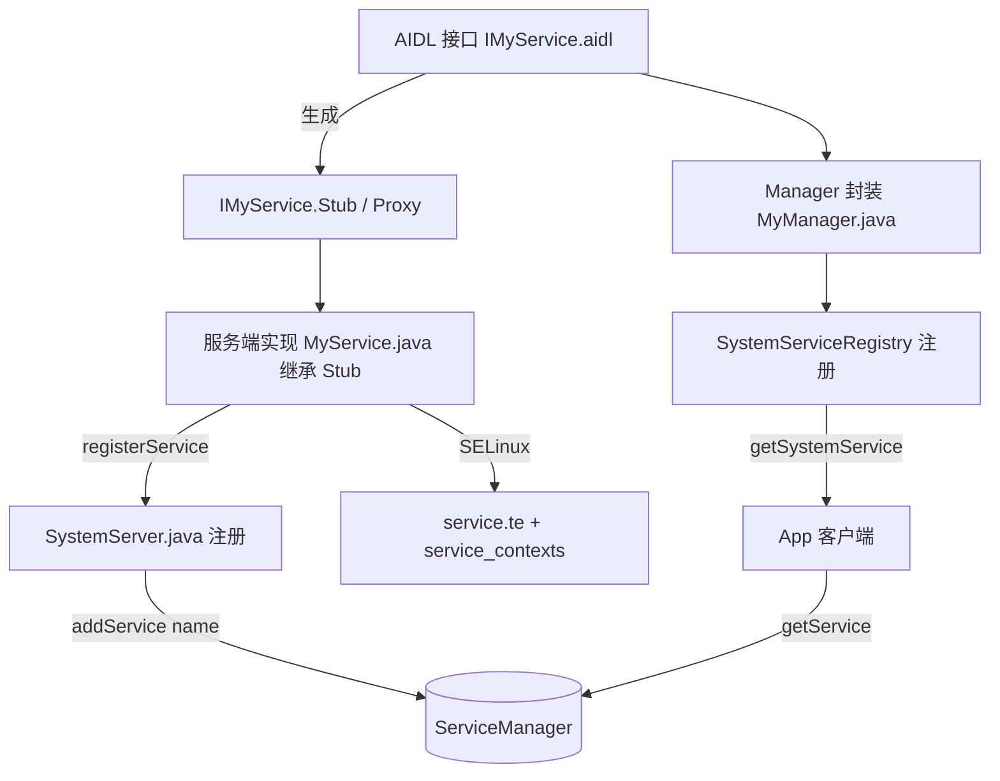

先确认仓库里 frameworks 的实际结构和现有服务注册方式，再给你一份贴合 AOSP 的"添加系统服务 + 生成相关文件"的完整示例。
仓库是完整的 AOSP Android 10（`frameworks/base` 齐全）。再确认几处真实写法：SystemServer 注册方式、一个现成 AIDL 模板、以及 SELinux service 上下文位置，保证示例贴合本仓库。
再确认 SELinux 两处写法（service_contexts 格式、service.te 声明位置）和一个真实"Stub 实现类"的继承写法，让示例完全贴合本仓库。
已经把本仓库的真实写法摸清了。先讲清楚"添加系统服务"在 AOSP 里的本质，再给你一套可直接落地的文件示例——它本质上就是你前面走查过的那个 **binder 服务端**：在 `system_server` 进程里创建一个 `IMyService.Stub` 实体，注册到 `ServiceManager`，客户端 `getService` 拿到 proxy（句柄），于是触发你之前分析的那条 `BC_TRANSACTION → binder_transaction → BR_TRANSACTION` 链路。

---

## 一、涉及的文件全景（以新增 `my_service` 为例）



需要新增/修改的文件一共 8 处：

| 类别         | 文件                                                         | 动作              |
| ------------ | ------------------------------------------------------------ | ----------------- |
| 接口         | `frameworks/base/core/java/android/os/IMyService.aidl`       | 新增              |
| 实现         | `frameworks/base/services/core/java/com/android/server/MyService.java` | 新增              |
| 注册         | `frameworks/base/services/java/com/android/server/SystemServer.java` | 修改（加 1 行）   |
| 常量         | `frameworks/base/core/java/android/content/Context.java`     | 修改（加 1 常量） |
| 管理器       | `frameworks/base/core/java/android/app/MyManager.java`       | 新增              |
| 注册器       | `frameworks/base/core/java/android/app/SystemServiceRegistry.java` | 修改（加注册）    |
| SELinux 类型 | `system/sepolicy/private/service.te`                         | 修改（加 1 行）   |
| SELinux 映射 | `system/sepolicy/private/service_contexts`                   | 修改（加 1 行）   |

---

## 二、各文件示例内容

**1. AIDL 接口**（`frameworks/base/core/java/android/os/IMyService.aidl`）

放在 `core/java/android/os/` 下会被 `frameworks/base` 的 `Android.bp` 自动纳入 `srcs` 编译，无需单独写 `aidl_library`。

```java
package android.os;

/** @hide */
interface IMyService {
    int getStatus();
    void setEnabled(boolean enabled);
    String getVersion();
}
```

**2. 服务端实现**（`frameworks/base/services/core/java/com/android/server/MyService.java`）

推荐继承 `SystemService`（而非裸 `ServiceManager.addService`），这样 `SystemServiceManager` 能管理其生命周期，且可被其他服务通过 `LocalServices` 依赖。

```java
package com.android.server;

import android.content.Context;
import android.os.IMyService;

public class MyService extends SystemService {
    private static final String TAG = "MyService";
    private final MyServiceStub mStub;

    // 内部 binder 实体：继承 AIDL 生成的 Stub
    private final class MyServiceStub extends IMyService.Stub {
        @Override
        public int getStatus() {
            // 这里就是之前 binder 走查里服务端读到的 BR_TRANSACTION 回调
            return 1;
        }
        @Override
        public void setEnabled(boolean enabled) { /* ... */ }
        @Override
        public String getVersion() { return "1.0"; }
    }

    public MyService(Context context) {
        super(context);
        mStub = new MyServiceStub();
    }

    @Override
    public void onStart() {
        // 注册到 ServiceManager，名字 "my_service" 即客户端 getService 的 key
        publishBinderService("my_service", mStub);
    }
}
```

> 注：`publishBinderService` 内部即调用 `ServiceManager.addService("my_service", mStub, ...)`，与你之前看到的 `SystemServer.java:957` 的 `ServiceManager.addService("scheduling_policy", ...)` 同一条路径。

**3. 在 SystemServer 注册**（`SystemServer.java`）

参照 `SystemServer.java:828` 的 `mSystemServiceManager.startService(BatteryService.class);` 写法，在 `startOtherServices()` 或对应阶段加入：

```java
mSystemServiceManager.startService(MyService.class);
```

**4. Context 常量**（`frameworks/base/core/java/android/content/Context.java`）

```java
public static final String MY_SERVICE = "my_service";
```

**5. 客户端 Manager**（`frameworks/base/core/java/android/app/MyManager.java`）

App 不直接拿 binder，而是通过 `Context.getSystemService()` 返回的 Manager，内部持有 `IMyService` proxy：

```java
package android.app;

import android.annotation.SystemService;
import android.content.Context;
import android.os.IMyService;
import android.os.RemoteException;

@SystemService(Context.MY_SERVICE)
public class MyManager {
    private final IMyService mService;
    private final Context mContext;

    public MyManager(Context context, IMyService service) {
        mContext = context;
        mService = service;
    }

    public int getStatus() {
        try {
            return mService.getStatus();   // 在此触发 BC_TRANSACTION
        } catch (RemoteException e) {
            throw e.rethrowFromSystemServer();
        }
    }
    // ... 其他方法
}
```

**6. 注册 Manager**（`frameworks/base/core/java/android/app/SystemServiceRegistry.java`）

在 `registerService` 区块内加入：

```java
registerService(Context.MY_SERVICE, MyManager.class,
        new CachedServiceFetcher<MyManager>() {
    @Override
    public MyManager createService(ContextImpl ctx) throws ServiceNotFoundException {
        IBinder b = ServiceManager.getServiceOrThrow(Context.MY_SERVICE);
        return new MyManager(ctx, IMyService.Stub.asInterface(b));
    }
});
```

**7. SELinux 类型声明**（`system/sepolicy/private/service.te`）

参照本仓库 `service.te:3` 的 `dynamic_system_service` 写法：

```te
type my_service_service, system_api_service, system_server_service, service_manager_type;
```

**8. SELinux 名称映射**（`system/sepolicy/private/service_contexts`）

参照 `service_contexts:164` 的 `scheduling_policy` 写法：

```te
my_service                             u:object_r:my_service_service:s0
```

> 客户端 app 要能 `getService`，其域（如 `system_app` 或 `appdomain`）需要对 `my_service_service` 有 `find` 权限。把 type 标成 `system_api_service`/`app_api_service` 属性即可复用现有授权，无需额外 allow 规则。

---

## 三、落地步骤与验证

1. 新增 AIDL + 实现类 + Manager + 注册器四个 `.java`/`.aidl` 文件。
2. 在 `SystemServer.java`、`Context.java` 各加 1 行。
3. 在 `service.te` / `service_contexts` 各加 1 行。
4. 编译：`make framework` + `make services` + `make sepolicy`。
5. 刷机/模拟器启动后执行 `adb shell service list | grep my_service`，看到 `my_service: [android.os.IMyService]` 即注册成功。
6. App 侧 `context.getSystemService(Context.MY_SERVICE)` 即可调用，内核即走你前面分析的那条 binder 链路。

---

## 四、可选扩展

如果你要的是 **native（C++）系统服务**（独立进程而非 system_server 内），则改为用 `frameworks/native` 的 `defaultServiceManager()->addService()` + `BnInterface`/`BpInterface`，AIDL 换成 `*.aidl` 经 `aidl-cpp` 生成，或用 HIDL/AIDL 稳定接口落在 `hardware/interfaces`。本仓库 `frameworks/hardware/` 下就有 `.hal`/`.aidl` 模板可参考。

---

要不要我**切换到 craft 模式**，把上面这套 `my_service` 的 6 个新文件和 4 处改动直接写进你仓库对应的目录？我可以严格按本仓库现有路径（如 `SystemServer.java` 现有的 `startService` 风格、`service.te` 现有 type 写法）来落地，避免风格不一致。如果只想先看某一部分（比如只要 AIDL + 服务端那份），也告诉我，我可以先只生成那几块。