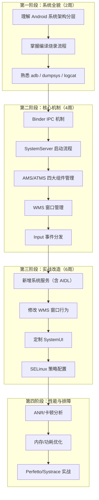
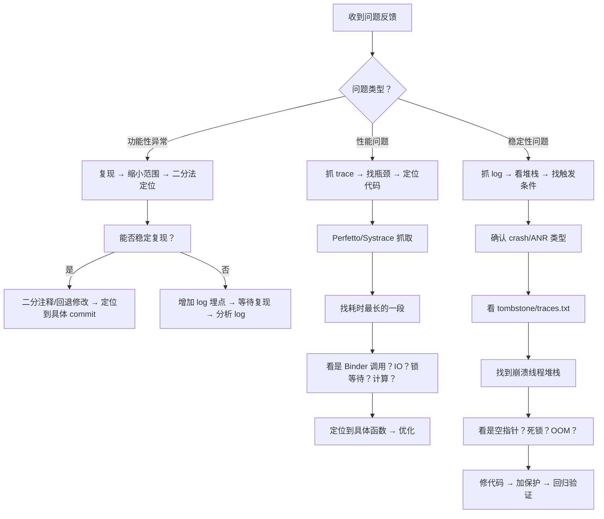

# APP 开发者转 Android Framework 开发：破局指南（优化版 v1.1）

> **适用人群：** 有 2–5 年 APP 开发经验，想转型 Framework 系统开发的工程师
> **核心观点：** Framework 不是"源码阅读课"，而是**系统定制能力**——你能改什么、怎么改、改了怎么验证
> **目标定位：** 车载 / 工控 / TV / 手机等 Android 系统定制厂商的 Framework 开发岗位
> **版本说明：** 本版以 **Android 14（API 34, UpsideDownCake）** 为准校准；同时标注 13 / 15 的差异点。AOSP 路径与类名会随版本微调，凡涉及具体方法名，以你拉取的源码为准。

---

## TL;DR（进来看这一屏）

1. **先搭环境，再谈学习**：能 `lunch + make` 编出镜像、`fastboot` 刷进去，比读 100 篇博客有用。
2. **以"改"带"读"**：第一个目标不要是"读完 AMS"，而是"改一个默认亮度 / 禁一个弹窗"。
3. **你的三件套**：`dumpsys`（看状态）、`logcat` 加 `Slog`（看运行时）、`aidegen`（代码跳转）。
4. **Binder 是地基，SELinux 是第一道坎**：90% 的"我加了服务但调不通"是 SELinux 拒绝。
5. **建立索引，不背代码**：记住"什么需求去哪个文件"，而非某一行代码。

**速查：新手第一周该做的 5 件事**

| # | 动作 | 完成标准 |
|---|------|----------|
| 1 | 装 Ubuntu 22.04，分配 32G+ RAM / 500G+ SSD | 能跑 `free -h` 看到 >=32G |
| 2 | 拉 AOSP 14 源码（清华镜像） | `ls frameworks/base` 有内容 |
| 3 | `lunch aosp_x86_64-eng && make -jN` | 编出 `out/target/product/.../*.img` |
| 4 | 用模拟器或真机刷入并 `adb shell` 进系统 | `adb shell ps -A \| grep system_server` 有输出 |
| 5 | 跑通 `aidegen frameworks/base -i s` | Android Studio 能跳转到 `ActivityManagerService` |

---

## 目录

- [痛点一：不知道 Framework 学了能干啥](#痛点一不知道-framework-学了能干啥)
- [痛点二：不知道怎么学、学什么](#痛点二不知道怎么学学什么)
- [痛点三：分析源码时被卡住](#痛点三分析源码时被卡住)
- [痛点四：学了记不住、无法用于实战](#痛点四学了记不住无法用于实战)
- [痛点五：工作中 Framework 问题不会排查](#痛点五工作中-framework-问题不会排查)
- [附：系统定制厂商的额外知识栈（Treble/VNDK/GKI/AIDL HAL）](#附系统定制厂商的额外知识栈treblevndkgkiaidl-hal)

---

## 痛点一：不知道 Framework 学了能干啥

### 核心误区

> 大多数 APP 开发者以为学 Framework = 看源码、画流程图、背调用链。
> **这是最大的误解。** Framework 开发的核心不是"看懂"，而是**"能改"**。

### Framework 开发到底做什么？

Framework 开发 = **对 AOSP 源码进行二次定制**，具体包括：

| 实际工作内容 | 对应能力 | 例子 |
|-------------|----------|------|
| **新增系统服务** | 理解 Binder IPC、SystemServer 启动流程 | 车载项目新增"车身信息管理服务"，APP 通过 AIDL 获取车速、油量 |
| **修改系统行为** | 理解 AMS/ATMS、WMS 内部逻辑 | 修改 Launcher 多任务切换动画、禁用某个系统对话框 |
| **适配硬件外设** | 理解 HAL 层、JNI、Input 子系统 | 适配 CAN 总线、串口屏、自定义按键板 |
| **裁剪/定制系统** | 理解编译系统、分区、SELinux、Treble | 移除不需要的系统应用、定制 Settings 菜单项 |
| **性能/稳定性优化** | 理解系统启动流程、ANR/卡顿机制、GKI 内核 | 优化开机速度、解决系统服务 ANR |
| **安全策略配置** | 理解 SELinux、权限模型、non-SDK 限制 | 为新增硬件节点配置 sepolicy、放开 hiddenapi 限制 |

> **关于 Treble / VNDK / GKI**：如果你的目标是车载、工控、TV 这类**系统定制厂商**，上面这张表最后两列只是冰山一角。现代 Android 把系统切成 `system` / `vendor` / `product` 分区，Framework 与厂商 HAL 通过 **HIDL / AIDL（HAL）+ VNDK** 隔离，内核走 **GKI（Generic Kernel Image）**。这部分是厂商 Framework 岗的日常工作，详见文末[附录](#附系统定制厂商的额外知识栈treblevndkgkiaidl-hal)。

### 一句话总结

> **APP 开发 = 在 Android 提供的框框里写业务逻辑**
> **Framework 开发 = 修改这个框框本身**（甚至改框框下面的 HAL 和内核）

### 学了 Framework 的职业价值

| 价值 | 说明 |
|------|------|
| **不可替代性** | APP 开发者供给过剩，Framework 开发者稀缺（尤其是车载/工控领域） |
| **薪资溢价** | 系统开发岗通常比同级别 APP 开发高 30–50% |
| **技术深度护城河** | 底层能力积累不会因上层框架迭代而过时（Flutter/Compose 怎么变，Binder 还是 Binder） |
| **向上发展空间** | Framework → HAL → Kernel 是清晰的技术深挖路线 |

---

## 痛点二：不知道怎么学、学什么

### 核心问题

> 很多人学 Framework 的方式是：打开 AOSP 源码 → 从 `main` 函数开始读 → 三天后放弃。
> **错误的学习方式 = 按代码执行顺序读源码。**
> **正确的学习方式 = 以问题驱动，按"改"的目的去"读"。**

### 误区 × 正确做法（先建立认知）

| 常见误区 | 正确做法 |
|----------|----------|
| 先把 AOSP 整个读完再动手 | 先编出能跑的系统，再围绕一个**具体需求**读相关模块 |
| 从 `main()` 线性往下读 | 从 `dumpsys` 输出 / 运行时 log **反推**调用链 |
| 想记住每一行代码 | 建立"需求 → 文件/函数"的**索引** |
| 只在网页上看源码 | 用 `aidegen` 导入 IDE，能跳转、能搜、能加断点 |
| 学完再找项目练 | 每个知识点立刻配一个**最小改造实验**（见第三阶段） |

### Framework 学习路线图



### 每个阶段学什么、怎么验证

**第一阶段：系统全貌（目标：能把源码编译出来刷进去）**

| 学习内容 | 验证方式 | 耗时 |
|----------|----------|------|
| Android 架构分层（APP/Framework/HAL/Kernel，含 Treble 分区概念） | 能画出分层图，说出每层作用 | 1 天 |
| AOSP 源码下载（repo init/sync，国内用清华镜像） | 成功下载一套源码 | 1 天（看网速） |
| `lunch` + `make` 编译 | 成功编译出系统镜像 | 1 天 |
| fastboot / 模拟器刷机 | 成功刷入并开机 | 1 天 |
| `adb shell` / `logcat` / `dumpsys` | 能查看当前焦点窗口、Activity 栈 | 3 天 |

**关键提醒：** 第一阶段最大的坑是**编译环境**。如果公司已有编译服务器直接用；个人学习建议 Ubuntu 20.04/22.04，内存 >= 32G，硬盘 >= 500G SSD。
**拉源码省空间技巧：** 完整 AOSP 约 100G+，`repo sync` 可加 `-j8`；若只研究 framework，可先浅克隆后再按需 `repo sync` 指定仓库。国内务必配清华/中科大 AOSP 镜像，并选定具体 tag（如 `android-14.0.0_rXX`），不要无脑 `master`。

**第二阶段：核心机制（目标：能看懂 dumpsys 输出，知道每个服务干什么）**

> **学习方法：每个模块按"是什么 → 怎么用 → 核心流程 → 关键代码"四步走。**

| 模块 | 是什么 | 怎么用（dumpsys 命令） | 核心流程 | 关键代码（Android 14） |
|------|--------|----------------------|----------|----------|
| **Binder** | Android IPC 核心 | `adb shell dumpsys binder` | client → 驱动 → server 通信 | `drivers/android/binder.c`、`frameworks/native/libs/binder/IPCThreadState.cpp` |
| **SystemServer** | 系统服务启动入口 | `adb shell ps -A \| grep system_server` | `main` → `startBootstrapServices` → `startOtherServices` | `frameworks/base/services/java/com/android/server/SystemServer.java` |
| **AMS/ATMS** | 四大组件管理 | `adb shell dumpsys activity activities` | `startActivity` → 进程创建 → 生命周期 | `frameworks/base/services/core/java/com/android/server/am/ActivityManagerService.java`、`.../wm/ActivityTaskManagerService.java` |
| **WMS** | 窗口管理 | `adb shell dumpsys window windows` | `addWindow` → `relayout` → Surface 分配 | `frameworks/base/services/core/java/com/android/server/wm/WindowManagerService.java` |
| **Input** | 输入事件分发 | `adb shell dumpsys input` | `EventHub` → `InputReader` → `InputDispatcher` → APP | `frameworks/native/services/inputflinger/InputDispatcher.cpp` |

> **注意：** Android 10 起四大组件管理从 AMS 拆出 **ATMS（ActivityTaskManagerService）**，启动流程相关代码在 `com.android.server.wm` 包下；文中方法名随版本微调，请以源码为准。

**第三阶段：实战改造（目标：能独立完成一个 Framework 修改需求）**

这是最关键也最容易被跳过的阶段。**不写代码永远学不会。**

推荐实战项目（按难度排序）：

| 项目 | 难度 | 涉及知识点 | 预计耗时 | 版本注意 |
|------|------|-----------|----------|----------|
| 1. 用 `service` 命令写一个 shell 脚本调试系统服务 | ★☆☆☆☆ | service 命令、系统服务生命周期 | 2h | — |
| 2. 修改 Settings 数据库默认值（如默认亮度） | ★★☆☆☆ | SettingsProvider、defaults.xml | 4h | — |
| 3. 新增一个系统 API（hide → public） | ★★☆☆☆ | SDK 编译、@hide、hiddenapi 限制 | 4h | ⚠️ 见下方说明 |
| 4. 禁止某个系统对话框弹出 | ★★★☆☆ | WMS/PMS 源码阅读 + 修改 | 1d | — |
| 5. 新增一个系统服务（含 AIDL） | ★★★★☆ | Binder、SystemServer、AIDL、SELinux | 3d | AIDL 优先于旧 HIDL |
| 6. 修改 Launcher 多任务切换动画 | ★★★★☆ | ShellTransition、SurfaceControl | 3d | Android 12+ 走 `com.android.wm.shell` |
| 7. 适配一个外设（如自定义按键板） | ★★★★★ | InputReader、kl/kcm 文件、HAL | 5d | 可能涉及 vendor HAL |

> **⚠️ 关于「hide → public」的真相（很多人踩坑）：**
> Android 9 起有 **non-SDK 接口限制**，运行时按 `light greylist / dark greylist / blacklist` 拦截三方 App 调用隐藏 API。
> - 只删 `@hide` 再重编 `framework.jar`：**系统/你自带签名的 App 能调到**，但**普通三方 App 仍会被 hiddenapi 拦掉**。
> - 真要让三方用：需改 hiddenapi 名单（`frameworks/base/config/hiddenapi-*`）或用 `@UnsupportedAppUsage`（仅系统自己用），或把能力做成**系统服务 + AIDL** 暴露出去（推荐做法，见项目 5）。

**第四阶段：性能与排障（目标：能独立定位系统级性能问题）**

| 技能 | 工具 | 练习方式 |
|------|------|----------|
| ANR 分析 | `traces.txt` + `dumpsys` | 故意制造 ANR，练习从 trace 定位根因 |
| 卡顿分析 | Perfetto / Systrace | 抓 trace，找主线程阻塞点 |
| 内存分析 | `dumpsys meminfo` + MAT | 分析 `system_server` 内存占用 |
| 启动速度 | bootanim 时间 + Perfetto boot 段 | 优化开机自启动服务、dex2oat |

---

## 痛点三：分析源码时被卡住

### 为什么会被卡住？

> 大多数人的源码分析方式是**线性阅读**：从入口函数开始，逐行往下读。
> 而 AOSP 的特点是**深度嵌套 + 跨进程 + 多线程**，线性阅读必然卡死。

### 正确的源码分析方法

**方法一：从 dumpsys 输出反推源码**

```bash
# 不要从 main 函数开始读！
# 先从 dumpsys 的输出入手

# 例：想理解 Activity 启动流程
adb shell dumpsys activity activities
# 输出中有 ActivityRecord、Task、ProcessRecord 等信息
# → 搜 ActivityRecord 的构造、Task 的创建 → 反推调用链
```

**方法二：用 log 驱动，而非用代码驱动**

```java
// 在你关心的代码路径上加 log
// frameworks/base/services/core/java/com/android/server/wm/WindowManagerService.java

// 加带明确前缀的 log
Slog.d("MY_DEBUG", "relayoutWindow: " + client + ", requestedWidth=" + requestedWidth);

// 编译 → 刷机 → 操作 → 看 log
adb logcat | grep "MY_DEBUG"
```

**加 log 比读代码效率高 10 倍**，因为你能看到**真实的运行时调用顺序**。

**方法三：用 AIDEGen 导入源码做代码跳转（替代已废弃的 idegen）**

```bash
# idegen 在 Android 10 之后已基本废弃，官方替代是 AIDEGen（asuite）
source build/envsetup.sh
lunch aosp_x86_64-eng        # 或其他 target
aidegen frameworks/base -i s # 生成并用 Android Studio 打开
# 其它选项：
#   -i j  → IntelliJ
#   -i v  → VS Code（需装 Java/C++ 插件）
#   aidegen frameworks/base -i s -a 15  → 指定 JDK 版本

# 打开后即可全局搜索（Double Shift）、跳转定义（Ctrl+左键）
```

> **备选：** 若不想用 Android Studio，可 `make` 后用 VS Code + `C/C++`/`Java` 插件，配合生成的 `compile_commands.json`（通过 `aidegen` 或 `bear`）获得跳转能力。核心目标只有一个：**能全局搜索、能跳转定义**。

**方法四：掌握关键搜索模式**

| 你想找 | 搜索关键词 |
|--------|-----------|
| 某个系统服务的实现 | `extends IXXX.Stub` |
| 某个 Binder 接口的调用方 | `XXX.Stub.Proxy` |
| SystemServer 中注册的服务 | `startBootstrapServices` / `startOtherServices` / `publishBinderService` |
| init.rc 中启动的 native 服务 | `service xxx /system/bin/` |
| SELinux 规则 | `grep -r "服务名" system/sepolicy/` |
| AIDL 定义的 HAL 接口 | `xxxaidl` 目录下的 `.aidl`（`aidl_interface` 声明） |

**方法五：绘制调用栈而非读代码**

拿到一个流程，不要逐行读源码，而是：

1. 先通过 `dumpsys` / log 确定**关键函数名**
2. 用 IDE（AIDEGen）找到每个关键函数
3. 记录：**函数名 → 所在文件 → 关键参数 → 返回值 → 下一步调用**
4. 整理成调用链，而不是记住每一行代码

```
// 示例：Activity 启动的调用链笔记（不是每行代码！Android 14 参考）
// 方法名会随版本微调，以你的源码为准

ActivityTaskManagerService.startActivity()        // 权限检查、Intent 解析、ATMS 入口
  → ActivityStarter.execute()                    // 创建 ActivityRecord、解析启动模式
    → ActivityStarter.startActivityUnchecked()    // 决定栈/Task 归属
      → RootWindowContainer.resumeFocusedTasks()  // 暂停当前 Activity
        → ActivityStack.startPausingLocked()      // 生命周期回调
          → ClientLifecycleManager.scheduleTransaction()  // Binder 通知 APP 进程
```

---

## 痛点四：学了记不住、无法用于实战

### 核心问题

> 记不住 = 没有建立**索引**。
> 无法用于实战 = 没有建立**从需求到方案的映射**。

### 建立知识索引，而非记忆细节

你不需要记住 `ActivityStarter.execute()` 的第 137 行是什么。你需要记住的是：

| 当遇到这个需求时 | 我应该去哪个文件、哪个函数 |
|-----------------|--------------------------|
| 修改开机动画 | `frameworks/base/cmds/bootanimation/` |
| 修改默认亮度 | `frameworks/base/packages/SettingsProvider/res/values/defaults.xml` |
| 禁止某个权限 | `frameworks/base/services/core/java/com/android/server/pm/permission/` |
| 修改音量调节步长 | `frameworks/base/services/core/java/com/android/server/audio/AudioService.java` |
| 修改输入法弹出动画 | `frameworks/base/services/core/java/com/android/server/wm/WindowManagerService.java` |
| 修改状态栏图标 | `frameworks/base/packages/SystemUI/` |
| 新增系统属性 | `system.prop` 或 `build/make/target/` 下的 mk 文件 |
| 修改多任务键行为 | `frameworks/base/services/core/java/com/android/server/policy/PhoneWindowManager.java`（`interceptKeyBeforeQueueing`） |
| 自定义窗口转场动画 | `frameworks/base/libs/WindowManager/Shell/`（`Transitions`、`ShellTaskOrganizer`） |

### 建立从需求到方案的映射

拿到一个需求后，按这个模板思考：

```
1. 需求是什么？（一句话）
2. 影响哪个系统服务？（AMS/ATMS/WMS/PMS/Input/...）
3. 这个服务在哪个文件？
4. 在哪个环节插入/修改逻辑？（初始化？运行时？回调？）
5. 需要什么权限？（系统签名？SELinux？root？hiddenapi 放行？）
6. 怎么验证？（dumpsys 看什么？log 打什么？adb 命令是什么？）
```

### 实操建议：建立自己的 Framework 笔记库

```markdown
# 个人 Framework 笔记模板

## 需求：修改多任务键行为为返回桌面

### 方案速查
- 改动层级：PhoneWindowManager (Framework)
- 难度：★★☆☆☆
- 涉及文件：1 个

### 改动点
- 文件：frameworks/base/services/core/java/com/android/server/policy/PhoneWindowManager.java
- 函数：interceptKeyBeforeQueueing()
- 修改：将 KEYCODE_APP_SWITCH 的事件处理改为 launchHome()

### 验证方法
- adb shell input keyevent KEYCODE_APP_SWITCH
- 观察是否回到桌面

### 踩坑记录
- 注意区分长按和短按：KeyEvent.getRepeatCount()
- 需要在车载模式下禁用（通过系统属性判断）
- SELinux：若新增广播/服务，记得补 sepolicy 域与文件上下文
```

---

## 痛点五：工作中 Framework 问题不会排查

### 排查方法论



### Framework 常用排障命令速查

```bash
# ============ 窗口/显示相关 ============
adb shell dumpsys window | grep mCurrentFocus     # 当前焦点窗口
adb shell dumpsys window windows                 # 完整窗口树
adb shell dumpsys window displays                # 屏幕信息
adb shell wm size                                # 分辨率

# ============ Activity 相关 ============
adb shell dumpsys activity activities             # Activity 栈
adb shell dumpsys activity top                   # 当前前台 Activity
adb shell dumpsys activity processes             # 进程信息

# ============ 输入相关 ============
adb shell dumpsys input                          # 输入设备列表
adb shell dumpsys input | grep -A 10 "FocusedWindow"   # 焦点窗口和输入通道

# ============ 性能相关 ============
adb shell ls /data/anr/                          # ANR trace 目录
adb pull /data/anr/anr_xxx .                    # 拉取 ANR 文件
adb shell dumpsys meminfo system_server          # 内存
adb shell top -n 1 | head -20                   # CPU

# ============ 服务相关 ============
adb shell service list                           # 列出所有运行中的系统服务
adb shell service check activity                 # 查某服务的 transaction code
# 注意：service call 的魔数事务码随 Android 版本变化，
# 先用 `service check xxx` 或 源码 IXXX 常量确认，再 call。

# ============ Binder 相关（需 userdebug + adb root + debugfs 挂载）============
adb root
adb shell cat /sys/kernel/debug/binder/stats            # Binder 统计
adb shell cat /sys/kernel/debug/binder/transaction_log  # Binder 事务日志

# ============ 日志相关 ============
adb logcat -b crash                              # 只抓 crash 堆栈
adb logcat -b main -b system -v threadtime | grep -E "system_server|WindowManager|ActivityManager"
adb shell dmesg                                  # 内核日志
adb logcat -c && adb logcat -v threadtime > all_log.txt   # 清缓冲后全量抓
```

### 典型排障场景速查

| 问题现象 | 第一反应 | 关键命令 | 常见根因 |
|----------|----------|----------|----------|
| **应用闪退** | 看 logcat crash 堆栈 | `adb logcat -b crash` | NPE、SecurityException、DeadObjectException |
| **界面卡死** | 看 ANR trace | `adb pull /data/anr/` | 主线程 Binder 超时、锁竞争、IO 阻塞 |
| **点击无响应** | 看 Input 状态 | `adb shell dumpsys input` | 焦点窗口不对、InputChannel 断连 |
| **开机卡 logo** | 看 boot log | `adb logcat -b all \| grep -E "Boot\|SystemServer"` | 系统服务启动失败、SELinux 权限拒绝 |
| **界面黑屏** | 看 WMS + SF 状态 | `dumpsys window` + `dumpsys SurfaceFlinger` | Surface 未创建、Layer 不可见 |
| **内存泄漏** | 看 meminfo 趋势 | `adb shell dumpsys meminfo <pid>` | 窗口泄漏、Binder 代理未释放、注册未反注册 |
| **开机慢** | 抓 boot trace | Perfetto 抓取 boot 阶段 | 某个服务启动耗时过长、dex2oat |
| **WIFI/蓝牙打不开** | 看对应服务状态 | `adb shell dumpsys wifi` / `bluetooth_manager` | HAL 服务未启动、固件加载失败、vendor 分区问题 |
| **新增服务调不通** | 看 SELinux + Binder | `dmesg \| grep avc`、`cat /sys/kernel/debug/binder/stats` | sepolicy 域未定义（90% 是这原因） |

### 最重要的排障思维：缩小范围

```
问题：整个系统某个行为异常

Step1：是系统问题还是 APP 问题？
  → 换一个 APP 是否正常？ → 正常 → 是 APP 问题，不正常 → 是系统问题

Step2：是代码问题还是配置问题？
  → 回退最近一次修改是否正常？ → 正常 → 是代码改动引入的

Step3：是 Java 层还是 native 层？
  → logcat 有异常堆栈 → Java 层
  → dmesg 有异常 → kernel/native 层

Step4：二分定位
  → 注释掉一半修改 → 问题消失 → 在这一半里
  → 重复二分 → 定位到具体修改
```

---

## 附：系统定制厂商的额外知识栈（Treble / VNDK / GKI / AIDL HAL）

> 这部分对纯 App 转 Framework 的"通用岗"是加分项；对**车载/工控/TV 厂商岗是必考项**。原文基本没展开，这里补齐。

### 1. Treble 与分区隔离
- Android 8 引入 Treble，把 `system`（Google/AOSP）与 `vendor`（芯片/ODM）解耦。
- 关键分区：`/system`、`/vendor`、`/product`、`/odm`、`/system_ext`。
- 含义：**你改 Framework 通常动 `/system`；动硬件相关动 `/vendor`，两者通过稳定接口（HIDL/AIDL HAL）通信**，互不直接依赖内部符号。

### 2. VNDK（Vendor Native Development Kit）
- 厂商 native 代码只能链接**受控的**系统库集合（VNDK），防止 system/vendor 库版本错配。
- 排障时常见：`libxxx.so` 找不到 / 版本不匹配 → 检查 `vndk-sp` 列表与 `PRODUCT_PACKAGES`。

### 3. GKI（Generic Kernel Image）
- Android 12+ 强制 GKI：内核拆分为**通用核心（由 Google 维护）+ 厂商可加载模块（vendor_modules）**。
- 你改内核驱动（如 binder、CAN），通常做成 **vendor kernel module** 或在 `android14-6.1` 分支上适配，不能随便改核心符号。

### 4. HAL：AIDL 优先于 HIDL
- Android 11 起**新 HAL 一律用 AIDL**（`.aidl` + `aidl_interface`），旧的 HIDL（`.hal`）逐步淘汰。
- 新增硬件服务（如车身信息、CAN）推荐路径：`hardware/interfaces/...` 或 `vendor/<oem>/...` 定义 AIDL 接口 → 实现 HAL 服务 → 在 `system/sepolicy` 和 `vendor` 分区各补 SELinux 上下文。
- 这与正文「第三阶段项目 5：新增系统服务」配合：Framework 侧用 AIDL 调 HAL 侧 AIDL，两端都走 Binder。

### 5. SELinux 是跨分区的硬门槛
- `system` 与 `vendor` 各自有 `sepolicy`；跨分区访问必须在**两侧**都放行。
- 排障口诀：**logcat/dmesg 里出现 `avc: denied` 就是 SELinux 拦了**；用 `audit2allow` 生成 te 规则，但别无脑放行，要按最小权限补域。

---

## 总结：给 APP 转 Framework 工程师的 10 条建议

1. **不要从"读完源码"开始，从"改一个东西"开始**——哪怕只是改默认亮度
2. **搭建编译环境是第一优先级**——不能编译刷机，学再多都是纸上谈兵
3. **dumpsys 是你最好的老师**——每个系统服务都有 dumpsys，先学会看输出，再去看源码
4. **加 log 比读源码效率高 10 倍**——看到真实的运行时调用顺序比什么都重要
5. **建立索引而非记忆**——记住"什么问题去哪个文件"，而不是记住每一行代码
6. **每个需求按模板记录**——需求→改动点→验证方法→踩坑记录，积累 20 个你就入门了
7. **Binder 是一切的基石**——花一周搞懂 Binder，后面的学习事半功倍
8. **SELinux 是新手第一道坎**——加了文件/服务权限不够，90% 是 SELinux 问题（含跨分区）
9. **Perfetto 是排障利器**——学会抓 trace、读 trace，性能问题不再抓瞎
10. **找一套能跑的源码比什么都重要**——个人学习推荐 AOSP 模拟器 target，编译快、验证快

---

> **文档版本：** v1.1（优化版）
> **基准 AOSP 版本：** Android 14（兼容 13 / 15 差异已标注）
> **推荐编译环境：** Ubuntu 22.04, 32G+ RAM, 500G+ SSD, E5-2697A v4 级别 CPU
> **推荐学习 target：** `aosp_x86_64-eng`（模拟器 target，编译快，验证快）
> **主要改动：** 修正 `idegen`→`aidegen`；补充 hiddenapi/non-SDK 限制；标注 `service call` 魔数版本相关；Binder debugfs 需 root；新增 Treble/VNDK/GKI/AIDL HAL 附录；增加 TL;DR 与误区对照表。
