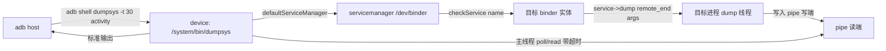

# adb dumpsys 实操分析（Android 14 / UpsideDownCake）

> 配套文档：`dumpsys-timeout-surfaceflinger-android14.md`（超时机制与 SF TIMEOUT 根因）
> 本文档把 dumpsys 从「原理」落到「命令面 + 输出解读 + 排障工作流」，全部基于 Android 14 tree。

## 核心结论（TL;DR）

1. `adb shell dumpsys` = 在设备上跑 `frameworks/native/cmds/dumpsys/dumpsys` 二进制，它对**每一个目标服务**通过 binder 调其 `dump()` 接口，把输出写到一条 `pipe` 上、主线程 `poll` 读取，默认 **10 秒**总预算超时。
2. 卡住 / 超时**不是 dumpsys 的 bug**，是目标服务在 `dump()` 里同步阻塞（典型如 SurfaceFlinger 主线程、vendor HAL）。排障第一步永远是 **`-t 0` 挂住 + 另开终端抓栈**。
3. 真正有用的不是「全量 dump」，而是**定向 dump + 关键信息 grep**。90% 的车载问题用 `activity` / `meminfo` / `SurfaceFlinger` / `power` / `gfxinfo` 五个服务就能定位。
4. 服务清单用 `dumpsys -l` 拿（来自 servicemanager `listServices`），不同 ROM / 不同用户（多屏座舱多用户）可见服务会不同。

---

## 1. 命令面：adb → dumpsys → service 的映射

### 1.1 调用链路（Mermaid）



### 1.2 关键 flags（Android 14）

| flag | 含义 | 备注 |
|---|---|---|
| `-l` | 列出所有已注册服务名 | 来自 servicemanager，排障先看这个确认服务存在 |
| `<service>` | dump 指定服务 | 可带参数，参数透传给该服务的 `dump()` |
| `-t <秒>` | 每个服务的超时（秒），**默认 10** | 超时后打印 `*** DUMP TIMEOUT ***` 并 detach 线程，但目标服务仍在跑 |
| `-T <毫秒>` | 毫秒级超时（部分新版本引入） | **以 `dumpsys --help` 为准**，不同 release 差异大 |
| `-t 0` | 无限等待 | 排障首选：挂住后另开终端抓栈判断慢/死 |
| `--proto` | 输出 protobuf（`dump()` 的 proto 分支） | bugreport 内部用它，人读不友好 |
| `--priority <P>` | 只 dump 指定优先级的 CRITICAL/HIGH/NORMAL 服务 | 配合 `-l` 的优先级列 |
| `--skip <svc>` | 跳过某些服务 | 全量 dump 时跳过已知超时的（如 SurfaceFlinger） |
| `-h` / `--help` | 打印帮助 | **先跑这个确认你这版的真实 flag 集** |

> ⚠️ 注意：`-t` / `-T` 的**单位在不同 Android 版本会变**。`adb shell dumpsys -h` 是你这版真相的唯一来源，别盲信网文。

### 1.3 与 dumpsys.cpp 的对应关系（承接超时文档）

- `adb shell dumpsys -t 30 SurfaceFlinger` 中的 `-t 30` → `dumpsys.cpp` 的 `timeout` 变量（默认 `std::chrono::milliseconds(10000)`），即「总预算」。
- 一次 `dumpsys` 可指定**多个服务**：`dumpsys activity power meminfo`，每个服务独立配额、独立线程、独立超时。
- 重定向与超时互不干扰：管道被关闭（写端 EOF）只代表「这个服务 dump 完」，超时是主线程 `poll` 判定的另一维度。
- 全量 `dumpsys`（不带服务名）会**逐个 dump 设备上所有服务**，耗时数十秒到分钟级，车载整机 dump 经常 30s+，生产环境别在 ANR 现场乱跑。

---

## 2. 服务速查表（需求 → 服务 → 关键 grep）

> 优先级：★ 车载最常撞；其余按频率。下表的 `grep` 是 `adb shell dumpsys <svc> | grep -i <key>`。

| 需求 | 服务 | 必看 / 必 grep | 难度 |
|---|---|---|---|
| ★ ANR / 应用无响应 | `activity` | `ANR in`、`mRecentFgActivities`、`CPU usage`、`History`、`adj` | 中 |
| ★ 内存上涨 / OOM | `meminfo <pid>`、`procstats` | `Pss Total`、`SwapPss`、`Native Heap`、`Free RAM` | 低 |
| ★ 渲染卡顿 / 掉帧 | `gfxinfo <pkg>`、`SurfaceFlinger` | `Janky frames`、`Frame`、`Visible layers`、`HWC layers` | 中 |
| ★ 唤醒锁 / 无法休眠 | `power` | `Wake Locks`、`mWakefulness`、`Dream`、`mStayOn` | 低 |
| 广播积压 / 泄漏 | `activity broadcasts` | `mParallelBroadcasts`、`mOrderedBroadcasts`、`ReceiverList` | 中 |
| Service 泄漏 / 拉起异常 | `activity services` | `mServices`、`ActiveSince`、`startRequested` | 中 |
| 进程被杀 / adj | `activity processes` | `oom:`、`adj`、`cached`、`curRawAdj` | 中 |
| 显示 / 多屏 | `display`、`SurfaceFlinger` | `mDisplayInfos`、`Layer`、`DisplayDevice` | 中 |
| 触摸 / 输入卡 | `input` | `Dispatch`、`Focused`、`MotionEvent` | 中 |
| 电池 / 耗电 | `batterystats`、`Battery` | `Estimated power`、`wakeups`、`job` | 中 |
| ★ CarService / 座舱 | `car_service`、`vehicle` | `VehicleProperty`、`CarPower`、`UXR` | 高 |
| Binder 阻塞（全局） | （无直接服务） | 见 §4.6 `/dev/binderfs/binder_logs/` | 高 |
| HAL 状态 | `dumpsys <hal>` | 各 HAL 自定义 | 高 |
| 权限 / appops | `appops`、`permission` | `Op`、`MODE` | 低 |
| 包信息 | `package <pkg>` | `versionName`、`requested permissions`、`enabled` | 低 |

---

## 3. 实战场景（可直接套用）

> 约定：所有命令在宿主机 `adb` 执行；`$PKG`、`$PID` 用实际值替换；`> out.txt` 把输出落盘便于细读。

### 3.1 ANR 排查（车载最常见）

```bash
# 1) 先拿 AMS 全局状态，定位 ANR 出现在哪个进程
adb shell dumpsys activity > am.txt
grep -n "ANR in" am.txt            # 哪些进程 ANR 过
grep -n "mRecentFgActivities" am.txt
grep -n "CPU usage" am.txt         # ANR 时 CPU 被谁吃满

# 2) 看广播 / 服务是否积压把系统拖死
adb shell dumpsys activity broadcasts > br.txt
grep -n "mOrderedBroadcasts" br.txt

# 3) 进程 adj / 状态
adb shell dumpsys activity processes | grep -A3 "$PKG"

# 4) 真正的 ANR traces（AMS 写盘，不是 dumpsys 输出）
adb pull /data/anr/traces.txt ./
```

关键判断：
- `CPU usage` 显示 **`xxx% TOTAL` 很高且集中在 system_server / surfaceflinger** → 系统侧卡顿引发 ANR，往 SF / binder 查。
- 某**单进程 CPU 100%** → 应用自己死循环 / 主线程阻塞，看 traces.txt 栈。
- 广播队列 `mOrderedBroadcastes` 数量巨大 → 有序广播头被慢接收者挡住，触发连锁超时（详见广播模块深挖需求）。

### 3.2 内存 / OOM

```bash
adb shell dumpsys meminfo $PID > mem.txt
# 重点看：
#   Pss Total（含共享按比例）、Private Dirty（独占脏页，真占内存）
#   SwapPss（被换出，说明已进 zram/compaction）
#   Native Heap / Dalvik Heap 的 Size-Alloc-Free

adb shell dumpsys procstats --hours 3 > ps.txt   # 3 小时内存分布
adb shell dumpsys meminfo                         # 整机 Free RAM / Used RAM / Lost RAM
```

车载要点：后台 `cached` 进程多 → `OomAdjuster` 算 adj 后 `lmkd` 杀；若 `SwapPss` 持续高且 `Lost RAM` 大，多为 **native 泄漏 / 显存未释放**（看 SurfaceFlinger 的 `Buffers` 段）。

### 3.3 渲染卡顿 / 掉帧

```bash
# 应用帧率 / 卡顿（需开启 GPU 渲染分析，开发者选项）
adb shell dumpsys gfxinfo $PKG > gfx.txt
grep -n "Janky frames\|Total frames\|95th percentile" gfx.txt

# SF 全局层与 HWC（容易 TIMEOUT，见配套文档）
adb shell dumpsys -t 30 SurfaceFlinger > sf.txt
grep -n "Visible layers\|HWC layers\|Display\|mPageFlipCount" sf.txt

# 单 layer 的 present 延迟（128 行时序，可作图）
adb shell dumpsys SurfaceFlinger --latency <layerName> > lat.txt
```

注意：`gfxinfo` 的卡顿统计只在应用进程**启用** `debug.hwui.profile` 时才有数据，否则只有基础帧数。

### 3.4 唤醒锁 / 无法休眠（车机待机异常）

```bash
adb shell dumpsys power > power.txt
grep -n "Wake Locks\|mWakefulness\|mStayOn\|Dream" power.txt
# Wake Locks: size=N  下面每一行就是持锁方（FULL_WAKE_LOCK / PARTIAL_WAKE_LOCK）

# 谁持 PARTIAL_WAKE_LOCK 最常见：
adb shell "dumpsys power | grep -i 'Wake Locks' -A 20"
```

车载座舱常因 **CarService / 导航 / 语音** 长持 `PARTIAL_WAKE_LOCK` 导致无法进深度休眠，这里一眼可见。

### 3.5 广播 / Service 泄漏

```bash
adb shell dumpsys activity broadcasts | grep -n "BroadcastRecord\|mParallelBroadcasts\|mOrderedBroadcasts"
adb shell dumpsys activity services | grep -n "ServiceRecord\|ActiveSince\|startRequested"
```

### 3.6 Binder 阻塞（全局视角，dumpsys 本身不提供）

dumpsys 看不到 binder 全局拥堵，要走内核节点：

```bash
SF_PID=$(adb shell pidof surfaceflinger)
adb shell "cat /dev/binderfs/binder_logs/proc/$SF_PID"   # ready_threads / pending transactions
adb shell "cat /dev/binderfs/binder_logs/state"           # 全局 binder 线程池水位
```

> 注意：**Android 11+ 是 `/dev/binderfs/binder_logs/`，不是旧的 `/sys/kernel/debug/binder`**。很多老教程路径已失效。

---

## 4. 输出解读范式（两个高频服务拆骨架）

### 4.1 `dumpsys meminfo <pid>`

```
** MEMINFO in pid 1234 [com.example.car] **
                   Pss  Private  Private  SwapPss     Heap     Heap     Heap
                 Total    Dirty    Clean    Dirty     Size    Alloc     Free
  Native Heap     48210    48000        0      120   98304    91000     7304
  Dalvik Heap      8200     8000        0       80   12000     9500     2500
  .art mmap        ...
  Unknown          ...
  TOTAL           ...
```

判读：
- **Private Dirty** 是「这进程独占、且被改过的物理内存」= 真实占用，OOM 排序看它。
- **SwapPss > 0** 说明已进 swap（zram），系统内存压力大。
- **Native Heap Free 很小** → native 侧持续分配不释放（车载多媒体 / 渲染常撞）。

### 4.2 `dumpsys activity`（AMS 总览骨架）

输出按段划分，段首关键字即 grep 锚点：

- `ACTIVITY MANAGER RUNNING PROCESSES`：所有进程生命周期状态。
- `ACTIVITY MANAGER PROCESSES (dumpsys)`：含 `oom:`、`curRawAdj`、`curAdj` —— 直接看 OomAdjuster 结果。
- `ACTIVITY MANAGER SERVICES`：`ServiceRecord` 列表 + 绑定关系。
- `ACTIVITY MANAGER BROADCASTS`：并行 / 有序队列（`mParallelBroadcasts` / `mOrderedBroadcasts`）。
- `ACTIVITY MANAGER BROADCAST STATE`：`BroadcastFilter` / `ReceiverList`。
- `ACTIVITY MANAGER CONTENT PROVIDERS`：`ContentProviderRecord`。
- `ACTIVITY MANAGER PENDING INTENTS`：`PendingIntentRecord`。
- `Historical ANR message`：历史 ANR 摘要（全量才有，注意耗时）。

> 全量 `dumpsys activity` 在车载整机可能很大（多用户 + 几十进程），**务必 `> am.txt` 落盘再 grep**，别指望直接滚屏。

---

## 5. 排障工作流（决策树）

```mermaid
flowchart TD
    Q[dumpsys 卡住/超时] --> Q1{只某个服务慢?<br/>如 SurfaceFlinger}
    Q1 -->|是| Q2[dumpsys -t 0 <svc> 挂住]
    Q1 -->|全量都慢| Q3[先 dump -l 看服务数<br/>是否多用户/整机膨胀]
    Q2 --> Q4{挂住后另开终端<br/>抓栈能出内容吗?}
    Q4 -->|有内容=慢| Q5[分段二分:<br/>--display-id/--vsync/--timestats<br/>定位慢模块]
    Q4 -->|0 字节=死| Q6[debuggerd -b $(pidof svc)<br/>看栈: sync_wait→显示链路<br/>IPCThreadState→HAL]
    Q5 --> Q7[调 vendor/composer 或降 layer 数]
    Q6 --> Q8[抓 HAL/binder 侧栈<br/>查 fence/DRM/serializer]
    Q3 --> Q9[跳过已知慢服务<br/>dumpsys --skip SurfaceFlinger]
```

### 速记口诀

1. **先看 `-l`**：确认服务名对、在不在当前用户。
2. **定向 dump + 落盘 + grep**：别全量滚屏。
3. **慢就 `-t 0` 挂住 + `debuggerd -b`**：区分「慢」与「死」。
4. **native 进程用 `debuggerd -b`，不是 `kill -3`**（SF / HAL 是 native）。
5. **binder 拥堵看 `/dev/binderfs/binder_logs/`**，不是 debugfs。
6. **bugreport 里的 SF 超时不等同 CLI 超时**：CRITICAL 组配额更小（见配套文档）。

---

## 6. 与车载定制的衔接点

- **多用户座舱**：`dumpsys` 默认 dump **当前 foreground 用户** 的 system 服务。副驾屏 / 后排屏若在独立用户，需在对应用户 shell 上下文或 `am` 切用户后 dump，`-l` 列出的服务也会随用户变化。
- **vendor HAL dump 卡死**：`dumpsys <aidl-hal>` 本质是跨进程调 HAL 的 `dump()`，若 HAL 在 dump 里持锁查 DRM / 读寄存器，会表现为该服务单独 TIMEOUT（§3.6 的 binder 视角可佐证）。改法参考 timeout 文档的「阻塞点 C」——给 HAL `dumpDebugInfo()` 加 `try_lock_for` + 快照。
- **EVS / 环视**：EVS 抢占 display 时 `dumpsys SurfaceFlinger` 的 `DisplayDevice` 段会显示被 EVS 接管，可作为「为什么主屏 SF dump 异常」的旁证。
- **Winscope trace 开着**：`dumpsys SurfaceFlinger --dump` 或 trace 录制中，SF 持 trace 锁，会让普通 dump 卡在阻塞点 B 的 1s 降级逻辑——排障前先关 trace。

---

## 附：一条最常用的最小排障组合

```bash
# 场景：车机某个应用 ANR + 偶发卡顿
adb shell dumpsys -t 0 activity > am.txt &
adb shell dumpsys -t 0 meminfo $PID > mem.txt &
adb shell dumpsys -t 30 SurfaceFlinger > sf.txt &
wait
# 另开终端，应用复现卡顿瞬间：
adb shell debuggerd -b $(adb shell pidof surfaceflinger)
adb pull /data/anr/traces.txt ./
```

> 三个 dump 后台并发跑，互不阻塞；`-t 0` 保证内容完整，事后在 `am.txt / mem.txt / sf.txt` 里交叉 grep 定位。
