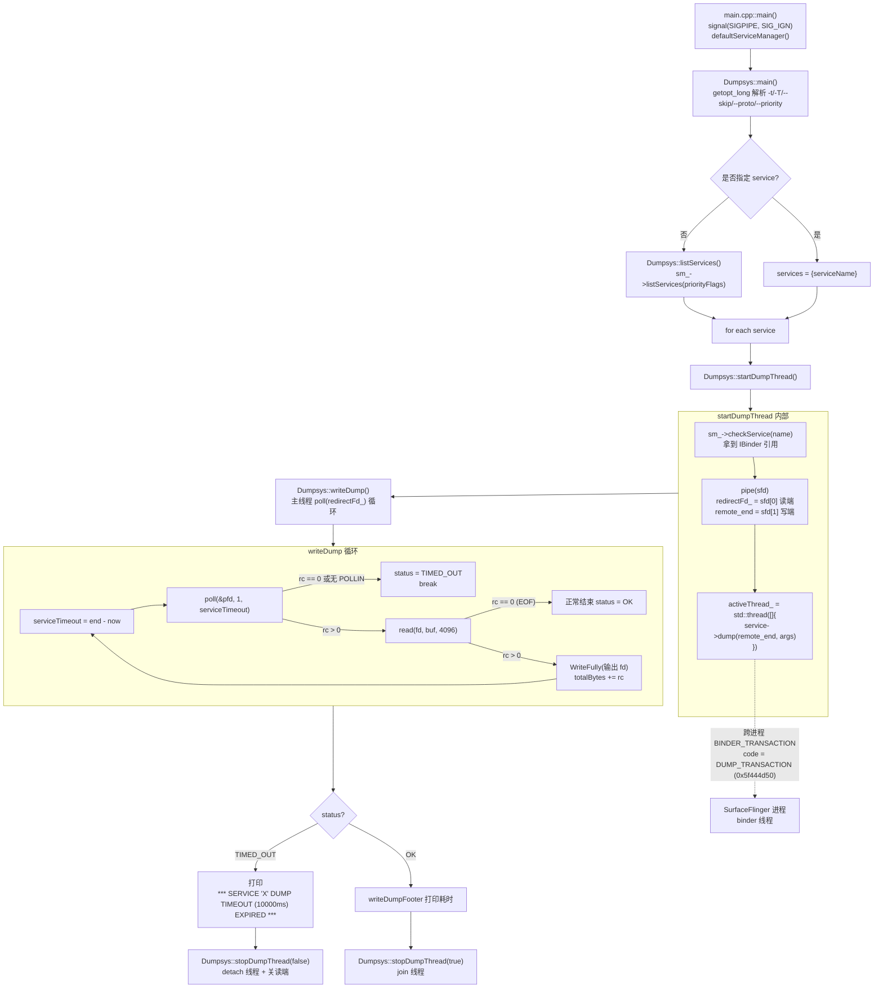
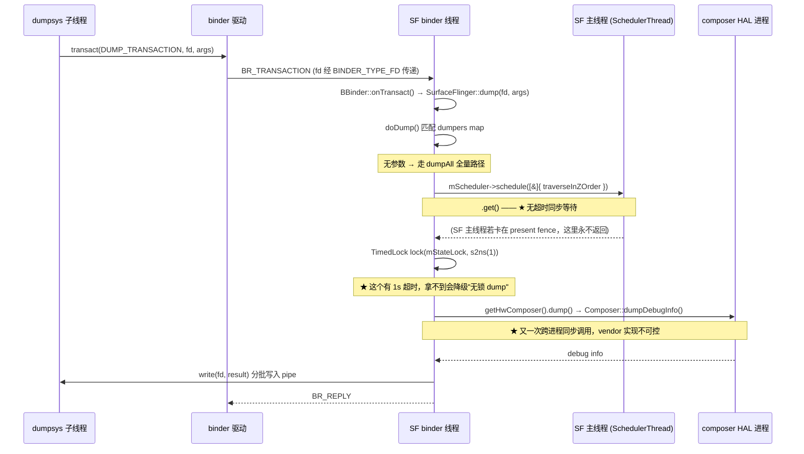

# dumpsys 超时机制全链路解析 —— 兼论车载 `dumpsys SurfaceFlinger` TIMEOUT 根因

> 基线：**Android 14 (UpsideDownCake, API 34)** / `android-14.0.0_rXX`
> 适用场景：车载 IVI 多屏方案的 SurfaceFlinger 卡死排障、bugreport 抓取失败定位

---

## 0. 核心结论前置

| 结论 | 说明 |
|---|---|
| **超时是"总预算"，不是"空闲间隔"** | `writeDump()` 用 `end = start + timeout` 算绝对截止点，每轮 `poll()` 的等待时间是 `end - now`。**即使数据一直在流出，总耗时超 10s 照样判 `TIMED_OUT`** |
| **超时不打断被 dump 的服务** | dumpsys 侧只是放弃读取 + `detach()` 线程，SurfaceFlinger 那边的 `dump()` 仍在跑，没有任何取消机制 |
| **pipe 缓冲区通常不是瓶颈** | 主线程持续 `poll()+read()`，64KB pipe 不会写满；除非输出目标 fd 本身慢（bugreport 写 `/data`） |
| **SF 超时的第一嫌疑是 `mScheduler->schedule(...).get()`** | 这是**无超时**的跨线程同步等待，SF 主线程一卡就是死等 |
| **bugreport 场景比命令行更容易超时** | SF 注册时带 `DUMP_FLAG_PRIORITY_CRITICAL`，dumpstate 对 CRITICAL 组用的 per-service 超时是**秒级甚至亚秒级**，远小于命令行默认 10s |
| **车载特有放大因素** | 多显示屏（IVI+仪表+HUD+后排）、vendor composer HAL dump 质量差、串行器链路（LVDS/GVIF）掉链导致 present fence 不返回、EVS 抢 display、binder 线程池被 CarService 打满 |

**一句话止血命令**：`dumpsys -T 60000 SurfaceFlinger`（拉长到 60s）→ 若仍超时，说明是**死锁**不是**慢**，直接抓栈。

---

## 1. 链路总览



涉及文件：

| 文件 | 职责 |
|---|---|
| `frameworks/native/cmds/dumpsys/main.cpp` | 进程入口，忽略 SIGPIPE，构造 `Dumpsys` |
| `frameworks/native/cmds/dumpsys/dumpsys.cpp` / `.h` | 全部核心逻辑，同时编成静态库 `libdumpsys` 供 dumpstate 复用 |
| `frameworks/native/cmds/dumpsys/Android.bp` | `cc_library_static { name: "libdumpsys" }` + `cc_binary { name: "dumpsys" }` |
| `frameworks/native/libs/binder/IServiceManager.cpp` | `listServices(dumpPriority)` 按优先级过滤服务清单 |
| `frameworks/native/libs/binder/Binder.cpp` | `BBinder::onTransact()` 处理 `DUMP_TRANSACTION` → 虚函数 `dump()` |

---

## 2. 阶段拆解（函数级）

### 2.1 入口：`main.cpp::main()`

```cpp
int main(int argc, char* const argv[]) {
    signal(SIGPIPE, SIG_IGN);              // 关键：读端关闭后写端不会被信号打死
    sp<IServiceManager> sm = defaultServiceManager();
    fflush(stdout);
    if (sm == nullptr) {
        ALOGE("Unable to get default service manager!");
        std::cerr << "dumpsys: Unable to get default service manager!" << std::endl;
        return 20;
    }
    Dumpsys dumpsys(sm.get());
    return dumpsys.main(argc, argv);
}
```

`SIG_IGN` 这一句决定了后面 2.5 节的行为：超时后主线程关掉读端，dump 线程再 `write()` 只会拿到 `EPIPE` 返回值，而不是被 `SIGPIPE` 干掉整个进程。

### 2.2 参数解析：`Dumpsys::main()` 的超时来源

```cpp
int Dumpsys::main(int argc, char* const argv[]) {
    Vector<String16> services;
    Vector<String16> args;
    Vector<String16> skippedServices;
    bool showListOnly = false;
    bool skipServices = false;
    bool asProto = false;
    int timeoutArgMs = 10000;                                  // ★ 默认 10s
    int dumpTypeFlags = 0;
    int dumpPriorityFlags = IServiceManager::DUMP_FLAG_PRIORITY_ALL;

    static struct option longOptions[] = {
        {"help",      no_argument,       0, 0},
        {"priority",  required_argument, 0, 0},
        {"proto",     no_argument,       0, 0},
        {"skip",      no_argument,       0, 0},
        {"stability", no_argument,       0, 0},
        {"pid",       no_argument,       0, 0},
        {"thread",    no_argument,       0, 0},
        {0, 0, 0, 0}
    };

    while ((c = getopt_long(argc, argv, "+txT:hlc", longOptions, &optionIndex)) != -1) {
        switch (c) {
            case 't': timeoutArgMs = atoi(optarg) * 1000; break;   // 秒
            case 'T': timeoutArgMs = atoi(optarg);        break;   // 毫秒
            ...
        }
    }
```

**`timeoutArgMs = 0` 表示不限时**（`writeDump` 里传给 `poll()` 的是 `-1`）。这是排障时最有用的一档：`dumpsys -T 0 SurfaceFlinger` 会一直挂着，配合另一个终端抓栈。

优先级过滤：

```cpp
// --priority CRITICAL|HIGH|NORMAL
if (!strcmp(longOptions[optionIndex].name, "priority")) {
    dumpPriorityFlags = ConvertPriorityTypeNameToBitmask(optarg);
}
```

`DUMP_FLAG_PRIORITY_CRITICAL / HIGH / NORMAL / DEFAULT` 定义在 `frameworks/native/libs/binder/include/binder/IServiceManager.h`，是服务 `addService()` 时登记的属性。

### 2.3 起线程：`Dumpsys::startDumpThread()`

```cpp
status_t Dumpsys::startDumpThread(int dumpType, const String16& serviceName,
                                  const Vector<String16>& args) {
    sp<IBinder> service = sm_->checkService(serviceName);      // 注意是 checkService，不阻塞等待
    if (service == nullptr) {
        ALOGE("Can't find service: %s\n", String8(serviceName).c_str());
        std::cerr << "Can't find service: " << serviceName << std::endl;
        return NAME_NOT_FOUND;
    }

    int sfd[2];
    if (pipe(sfd) != 0) {                                       // ★ 匿名管道，默认 64KB
        ALOGE("Failed to create pipe to dump service info for %s: %s",
              String8(serviceName).c_str(), strerror(errno));
        return -errno;
    }

    redirectFd_ = unique_fd(sfd[0]);                            // 读端留在主线程
    unique_fd remote_end(sfd[1]);                               // 写端移交子线程

    // ★ 子线程负责发起 binder 调用，主线程负责计时 —— 这是整个超时机制的基石
    activeThread_ = std::thread([=, remote_end{std::move(remote_end)}]() mutable {
        status_t err = 0;
        switch (dumpType) {
            case TYPE_DUMP:
                err = service->dump(remote_end.get(), args);    // ★ 跨进程阻塞点
                break;
            case TYPE_PID:
                err = dumpPidToFd(service, remote_end);         // 走 IBinder::getDebugPid()
                break;
            case TYPE_STABILITY:
                err = dumpStabilityToFd(service, remote_end);
                break;
            case TYPE_PROTO:
                ...
        }
        if (err != OK) {
            ALOGE("Error dumping service info status_t: (%d) %s",
                  err, String8(serviceName).c_str());
        }
        // lambda 退出 → remote_end 析构 → 写端关闭 → 主线程 read() 得到 EOF(0)
    });
    return OK;
}
```

**两个关键设计点**：

1. **写端关闭 = 结束信号**。主线程判断 dump 完成不是靠"服务返回了"，而是靠 `read()` 返回 0（EOF）。EOF 只会在写端所有副本都关闭时产生 —— 所以 `remote_end` 必须 `std::move` 进 lambda，且不能有其他副本残留。
2. **`checkService` 而非 `waitForService`**。服务没注册直接报 `Can't find service`，不会卡住。

### 2.4 计时核心：`Dumpsys::writeDump()`

```cpp
status_t Dumpsys::writeDump(int fd, const String16& serviceName,
                            std::chrono::milliseconds timeout, bool asProto,
                            std::chrono::duration<double>& elapsedDuration,
                            size_t& bytesWritten) const {
    status_t status = OK;
    size_t totalBytes = 0;
    auto start = std::chrono::steady_clock::now();
    auto end   = start + timeout;                              // ★ 绝对截止点，一次算死

    int serviceTimeout;
    struct pollfd pfd = {.fd = redirectFd_.get(), .events = POLLIN};

    while (true) {
        if (timeout.count() != 0) {
            serviceTimeout = std::chrono::duration_cast<std::chrono::milliseconds>(
                                 end - std::chrono::steady_clock::now()).count();
            if (serviceTimeout < 0) serviceTimeout = 0;        // ★ 剩余预算，不是重置的 10s
        } else {
            serviceTimeout = -1;                               // -T 0 → 无限等
        }

        int rc = TEMP_FAILURE_RETRY(poll(&pfd, 1, serviceTimeout));
        if (rc < 0) {
            status = -errno;
            break;
        } else if (rc == 0 || (pfd.revents & POLLIN) == 0) {
            status = TIMED_OUT;                                // ★ 唯一的超时判定点
            break;
        }

        char buf[4096];
        rc = TEMP_FAILURE_RETRY(read(redirectFd_.get(), buf, sizeof(buf)));
        if (rc < 0) { status = -errno; break; }
        else if (rc == 0) { break; }                           // EOF → 正常完成

        if (!WriteFully(fd, buf, rc)) { status = -errno; break; }
        totalBytes += rc;
    }

    if (status == TIMED_OUT) {
        std::string msg = StringPrintf(
            "\n*** SERVICE '%s' DUMP TIMEOUT (%llums) EXPIRED ***\n\n",
            String8(serviceName).c_str(), static_cast<unsigned long long>(timeout.count()));
        WriteFully(fd, msg.data(), msg.size());
        totalBytes += msg.size();
    }

    elapsedDuration = std::chrono::steady_clock::now() - start;
    bytesWritten = totalBytes;
    return status;
}
```

**这段代码里最容易被误解的一点**：`end` 在循环外算一次，之后每轮 `poll()` 拿到的是**递减的剩余预算**。所以

- SF 输出 3MB、每轮都有数据、但总共花了 12s → 依然 `TIMED_OUT`，日志里已写出的部分保留，后面被截断。
- 这与"卡死 10s 一个字节没出来"在输出上长得很像，都只有一行 `DUMP TIMEOUT`。**区分方法看 footer 前已输出的字节数 / 内容完整度**。

### 2.5 善后：`Dumpsys::stopDumpThread()`

语义（各分支 diff 可能微调，以自己 tree 为准）：

```cpp
void Dumpsys::stopDumpThread(bool dumpCompleted) {
    if (activeThread_.joinable()) {
        if (!dumpCompleted) {
            // 超时路径：绝不能 join —— 服务可能永远不返回，join 会把 dumpsys 自己也吊死
            activeThread_.detach();
        } else {
            activeThread_.join();
        }
    }
    redirectFd_.reset();      // 关读端 → detach 的线程下次 write() 拿 EPIPE 自行退出
}
```

**这里是"超时不等于取消"的根源**：

- dumpsys 没有任何机制去打断已经发出的 `BINDER_TRANSACTION`。binder 驱动层面也不支持取消一个 in-flight 同步事务。
- 被 detach 的线程如果卡在 `service->dump()` 的 binder 等待上，关读端唤不醒它 —— 它压根没在 `write()`。它会一直挂到 SF 那边返回为止。
- 命令行场景无所谓（进程马上退出，内核回收）。**但 dumpstate 是在自己进程内静态链接 `libdumpsys` 调这套逻辑的长生命周期进程**，一次 bugreport 里若多个服务超时，会留下多个僵住的 detached 线程 + 未回收的 binder 事务缓冲。这是抓 bugreport 时 dumpstate 自身内存涨、甚至后续服务 dump 连锁变慢的一个真实来源。

---

## 3. 服务侧：`service->dump()` 到底发生了什么



### 3.1 SF 的两处阻塞点

**阻塞点 A：`mScheduler->schedule(...).get()`（无超时，最危险）**

`frameworks/native/services/surfaceflinger/SurfaceFlinger.cpp`：

```cpp
    // Traversal of drawing state must happen on the main thread.
    // Otherwise, SortedVector may have shared ownership during concurrent
    // traversals, which can result in use-after-frees.
    std::string compositionLayers;
    mScheduler->schedule([&] {
        StringAppendF(&compositionLayers, "Composition layers\n");
        mDrawingState.traverseInZOrder([&](Layer* layer) {
            auto* compositionState = layer->getCompositionState();
            if (!compositionState || !compositionState->isVisible) return;
            android::base::StringAppendF(&compositionLayers, "* Layer %p (%s)\n", layer,
                                         layer->getDebugName() ? layer->getDebugName()
                                                               : "<unknown>");
            compositionState->dump(compositionLayers);
        });
    }).get();                                          // ★★ 没有 wait_for，死等
```

`schedule()` 定义在 `frameworks/native/services/surfaceflinger/Scheduler/Scheduler.h`，把任务 post 到 `MessageQueue`（`Scheduler/MessageQueue.cpp`）由 SF 主线程执行，返回 `ftl::Future`。**`.get()` 没有任何超时保护** —— SF 主线程只要卡住，这个 binder 线程就跟着卡住，dumpsys 必然吃满 10s 然后 TIMEOUT。

**阻塞点 B：`mStateLock`（有 1s 超时，会优雅降级）**

```cpp
    // 定义在 SurfaceFlinger.h
    struct TimedLock {
        TimedLock(Mutex& mutex, nsecs_t timeout, const char* whence)
              : mutex(mutex), status(mutex.timedLock(timeout)) {
            ALOGW_IF(!locked(), "%s timed out waiting for state lock", whence);
        }
        ~TimedLock() { if (locked()) mutex.unlock(); }
        bool locked() const { return status == NO_ERROR; }
        Mutex& mutex;
        const status_t status;
    };

    // dump 路径中
    TimedLock lock(mStateLock, s2ns(1), __func__);
    if (!lock.locked()) {
        StringAppendF(&result, "Dumping without lock after timeout: %s (%d)\n",
                      strerror(-lock.status), lock.status);
    }
```

看到输出里有 `Dumping without lock after timeout` 或 `timed out waiting for state lock` 的 logcat warning —— 说明 SF 已经不健康了，只是这一处做了兜底没让你 TIMEOUT。

**阻塞点 C：HWC / composer HAL dump**

`frameworks/native/services/surfaceflinger/DisplayHardware/HWComposer.cpp::dump()` →
`DisplayHardware/AidlComposerHal.cpp::dumpDebugInfo()`（AIDL composer3）或
`DisplayHardware/HidlComposerHal.cpp::dumpDebugInfo()`（HIDL 2.x）
→ 跨进程调 `android.hardware.graphics.composer3-service.<vendor>`。

**这是车载上最不可控的一环**：vendor composer 的 `dump()` 通常自己要拿内部锁、遍历所有 display/layer、有的实现还会同步查询 DRM/KMS 状态。多屏方案下逐屏串行查询，单屏 1~2s，四屏就吃掉 8s。

### 3.2 SF 的注册优先级 —— bugreport 更容易超时的原因

`frameworks/native/services/surfaceflinger/main_surfaceflinger.cpp`：

```cpp
    sp<IServiceManager> sm(defaultServiceManager());
    sm->addService(String16(SurfaceFlinger::getServiceName()), flinger, false,
                   IServiceManager::DUMP_FLAG_PRIORITY_CRITICAL |
                   IServiceManager::DUMP_FLAG_PROTO);
```

SF 是 **CRITICAL** 优先级。而 `frameworks/native/cmds/dumpstate/dumpstate.cpp` 里：

```cpp
void Dumpstate::RunDumpsysCritical() {
    RunDumpsysHelper("DUMPSYS CRITICAL", {"--priority", "CRITICAL"},
                     /* 整组超时 */ ..., /* 单服务超时: 秒级/亚秒级 */ ...);
}
void Dumpstate::RunDumpsysHigh() { /* --priority HIGH，单服务 ~10s */ }
void Dumpstate::RunDumpsysNormal() { /* --priority NORMAL，单服务 ~10s */ }
```

CRITICAL 组的设计意图是"必须秒回的关键状态"，per-service 超时远比命令行的 10s 短。所以经常出现：**手敲 `dumpsys SurfaceFlinger` 勉强能出来，但 bugreport 里 SF 段永远是 `DUMP TIMEOUT`**。看到这个现象不要怀疑 dumpsys，去查 SF 本身的响应延迟。

---

## 4. 车载场景放大因素（按命中率排序）

### 4.1 多显示屏 + 高 layer 数 → 纯粹的"慢"

IVI 主屏 + 仪表 + HUD + 后排娱乐屏，每个 display 都要走一遍：
- `dumpDisplays()` / `dumpCompositionDisplays()`
- HWC 逐屏 `dumpDebugInfo()`
- `mDrawingState.traverseInZOrder()` 遍历全部 Layer

车载 launcher + 状态栏 + 地图 + 多媒体 + 360 环视叠层，layer 数常年 60~120。全量 dump 输出 2~5MB 文本，字符串拼接 + pipe 分批写，纯耗时就能逼近 10s。

**特征**：输出有大量内容，在某个 section 中途被 `*** DUMP TIMEOUT ***` 截断。
**对策**：分段 dump（见 5.2），或 `-T 30000`。

### 4.2 显示链路异常导致 present fence 不返回 → "死"

车载屏通过 LVDS / GVIF / FPD-Link 串行器接出，deserializer 掉链、屏未上电、后排屏拔线时：
SF 主线程卡在 `CompositionEngine::present()` → `HWComposer::presentAndGetReleaseFences()` → `sync_wait()` 等 present fence。

此时阻塞点 A 的 `.get()` 永远不返回。
**特征**：0 字节输出，直接一行 TIMEOUT；`logcat` 里伴随 `sync_wait` / `fence timeout` / composer HAL 错误。
**对策**：查串行器链路、`dumpsys SurfaceFlinger --display-id` 看哪个 display 异常。

### 4.3 vendor composer HAL 的 dump 自身卡住

**特征**：输出停在 `h/w composer state:` 或 `Hardware Composer state` 附近。
**对策**：`debuggerd -b $(pidof android.hardware.graphics.composer3-service.xxx)` 抓 HAL 侧栈。

### 4.4 SF binder 线程池被打满 → 事务排队，压根没进 dump

SF 的 binder 线程池上限较小（`main_surfaceflinger.cpp` 里 `ProcessState::self()->setThreadPoolMaxThreadCount(4)` 量级）。车载上 CarService、CarLauncher、EVS、多个 app 高频调 `setTransactionState` / `getDisplayState` / `createConnection`，线程池满时 dumpsys 的事务在驱动队列里排队。

**特征**：0 字节输出；`/dev/binderfs/binder_logs/proc/<sf_pid>` 里 `ready_threads 0` + 大量 `pending transaction`。
**对策**：见 5.3 的 binderfs 检查。

### 4.5 EVS 抢占 display

倒车影像 / 360 环视启动时，EVS（`android.hardware.automotive.evs`）会直接接管某个 display 通道，与 SF 争 HWC 资源。切换瞬间 SF 主线程可能被 block。

### 4.6 Winscope / layer trace 开着

`adb shell su root service call SurfaceFlinger 1025 i32 1` 打开 layer trace 后，SF 每帧序列化 proto，主线程负载显著上升，dump 也跟着变慢。排障前先确认 trace 是关的。

---

## 5. 诊断流程（按顺序执行）

### 5.1 第一刀：区分"慢"还是"死"

```bash
# 拉长到 60s
adb shell dumpsys -T 60000 SurfaceFlinger > sf.txt

# 或彻底不限时（配合另一终端抓栈）
adb shell dumpsys -T 0 SurfaceFlinger > sf.txt
```

- 60s 能出来 → **慢**，走 4.1 / 4.3 路线，做分段 dump + 优化。
- 60s 仍超时 / `-T 0` 永远挂着 → **死**，直接跳 5.4 抓栈。

### 5.2 分段 dump（绕开全量路径）

`SurfaceFlinger::doDump()` 内部有一张 `dumpers` map，带参数时走短路径，**多数不触发阻塞点 A**：

```bash
adb shell dumpsys SurfaceFlinger --list          # 只列 layer 名，最轻
adb shell dumpsys SurfaceFlinger --display-id    # display 拓扑
adb shell dumpsys SurfaceFlinger --displays      # display 详情
adb shell dumpsys SurfaceFlinger --vsync         # vsync 配置与状态
adb shell dumpsys SurfaceFlinger --timestats -dump   # 帧统计
adb shell dumpsys SurfaceFlinger --latency <layer>   # 单 layer 延迟
adb shell dumpsys SurfaceFlinger --frame-events
adb shell dumpsys SurfaceFlinger --wide-color
```

哪个参数超时，就锁定了对应子模块。这是最高效的二分法。

### 5.3 检查是不是根本没进 dump

```bash
# 1) 看 SF 是否活着、有没有在 R/D 状态
adb shell ps -A -T -o PID,TID,S,WCHAN,CMD | grep -i surfaceflinger

# 2) binderfs 看事务积压（Android 11+ 用 /dev/binderfs，不再是 debugfs）
adb shell su root cat /dev/binderfs/binder_logs/proc/$(adb shell pidof surfaceflinger)
#   关注：ready_threads / pending transaction / outgoing transaction

# 3) 全局 binder 状态
adb shell su root cat /dev/binderfs/binder_logs/state | head -100
adb shell su root cat /dev/binderfs/binder_logs/transactions
```

`ready_threads 0` + `pending transaction` 一堆 → 4.4 线程池打满。

### 5.4 抓栈（SF 是 native 进程，不能 kill -3）

```bash
# 全线程栈快照，最关键的一步
adb shell su root debuggerd -b $(adb shell pidof surfaceflinger)

# HAL 侧同样抓
adb shell su root debuggerd -b $(adb shell pidof android.hardware.graphics.composer3-service.xxx)
```

栈的读法：

| 主线程栈特征 | 结论 |
|---|---|
| `sync_wait` / `SyncFence::wait` / `presentAndGetReleaseFences` | 4.2 显示链路 fence 不返回 |
| `Composer::presentDisplay` / `HidlComposerHal` / `AidlComposerHal` + `IPCThreadState::waitForResponse` | 卡在 composer HAL，去 4.3 |
| `MessageQueue` 空闲但 binder 线程卡在 `ftl::Future::get` | 主线程被别的任务占着，看主线程在干嘛 |
| 所有 binder 线程都在 `waitForResponse` | 4.4 线程池打满 |
| `Mutex::lock` on `mStateLock` | 有人长期持有 state lock，找持有者 |

### 5.5 Perfetto / atrace（看动态过程而非快照）

```bash
adb shell atrace -c -b 32768 -t 10 sf gfx hal binder_driver sched > trace.txt
# 或用 perfetto（14 上推荐）
adb shell perfetto -o /data/misc/perfetto-traces/tr.pftrace -t 10s \
    sched freq idle am wm gfx view binder_driver hal sf
```

看 `binder transaction` 轨道上 dumpsys → SF 的事务什么时候发起、SF 主线程同期在做什么。

### 5.6 临时绕过（保 bugreport 完整性）

```bash
# 跳过 SF，先把其他服务的信息拿到
adb shell dumpsys --skip SurfaceFlinger

# 只抓 CRITICAL（模拟 bugreport 行为，复现超时）
adb shell dumpsys --priority CRITICAL -T 1000

# proto 格式（体积小，但仍走主线程，不解决死锁）
adb shell dumpsys SurfaceFlinger --proto > sf.pb
```

---

## 6. 可改动点位（自研分支 patch 建议）

按侵入性从低到高：

### 6.1 【零侵入】调 dumpstate 侧超时

`frameworks/native/cmds/dumpstate/dumpstate.cpp`，把 CRITICAL 组的 per-service 超时调大。
**代价**：拖长 bugreport 总耗时，CRITICAL 组本意就是快回。**不推荐作为长期方案**，只作为量产前临时手段。

### 6.2 【低侵入·推荐】给 vendor composer HAL 的 dump 加保护

改 vendor 的 `IComposer::dumpDebugInfo()` 实现：
- 用 `try_lock_for(200ms)` 替代无限等锁，拿不到就输出 `<dump skipped: lock timeout>`；
- 不在 dump 里做任何 DRM/KMS 同步查询，改为读取周期性维护的快照缓存;
- 多屏改为并发查询或限制单屏预算。

这是**收益最高、风险最低**的一改，能一次性解决 4.3 且顺带缓解 4.1。

### 6.3 【中侵入】给 SF 的 `schedule().get()` 加超时

AOSP 上游没有，需自己打 patch。在 `SurfaceFlinger.cpp` 的 dump 路径：

```cpp
    std::string compositionLayers;
    auto future = mScheduler->schedule([&] { /* ... traverseInZOrder ... */ });
    // 自研改动：不再无限等
    if (future.wait_for(std::chrono::milliseconds(1500)) == std::future_status::ready) {
        future.get();
    } else {
        StringAppendF(&compositionLayers,
                      "*** Composition layers dump skipped: main thread unresponsive ***\n");
        // 注意：future 仍持有对局部变量的引用，必须保证生命周期
        // 实际实现应改用 shared_ptr<std::string> 捕获��避免悬垂引用
    }
```

**这里有个坑必须注意**：原代码 lambda 用 `[&]` 捕获栈上的 `compositionLayers`。一旦不 `.get()` 就往下走，函数返回后 lambda 仍可能在主线程执行 → **use-after-free**。改动必须同时把捕获改成 `std::shared_ptr<std::string>` 值捕获，让任务持有所有权。这是这个 patch 最容易写崩的地方。

### 6.4 【中侵入】给 SF 单独扩 binder 线程池

`main_surfaceflinger.cpp` 里提高 `setThreadPoolMaxThreadCount()`。
**代价**：更多线程 = 更多并发进 `mStateLock`，可能加剧锁竞争。车载多客户端场景通常值得，但要压测验证。

### 6.5 【上游友好】给 dumpsys 加"空闲超时"语义

当前 `writeDump()` 的总预算语义对大输出服务不友好。可加一个 `--idle-timeout`：只要在 N 秒内有数据流出就不算超时，用于区分"慢"和"死"。改动集中在 `writeDump()` 的 `end` 计算：每次成功 `read()` 后刷新 `end = now + idleTimeout`。

---

## 7. 关键类 / 函数速查表

| 层级 | 文件 | 类 / 函数 | 作用 |
|---|---|---|---|
| CLI | `cmds/dumpsys/main.cpp` | `main()` | `signal(SIGPIPE, SIG_IGN)`；构造 `Dumpsys` |
| CLI | `cmds/dumpsys/dumpsys.cpp` | `Dumpsys::main()` | 参数解析，`timeoutArgMs` 默认 10000 |
| CLI | 同上 | `Dumpsys::listServices()` | `sm_->listServices(priorityFlags)` |
| CLI | 同上 | `Dumpsys::startDumpThread()` | `pipe()` + `std::thread` + `service->dump()` |
| CLI | 同上 | **`Dumpsys::writeDump()`** | **`poll()` 超时循环，唯一判超时的地方** |
| CLI | 同上 | `Dumpsys::stopDumpThread()` | 完成 `join()` / 超时 `detach()` |
| CLI | 同上 | `Dumpsys::writeDumpHeader/Footer()` | `----- X -----` 分隔与耗时 |
| Binder | `libs/binder/Binder.cpp` | `BBinder::onTransact()` | 分发 `DUMP_TRANSACTION (0x5f444d50)` |
| Binder | `libs/binder/IServiceManager.h` | `DUMP_FLAG_PRIORITY_*` | 服务优先级位掩码 |
| SF | `services/surfaceflinger/main_surfaceflinger.cpp` | `addService(..., PRIORITY_CRITICAL \| PROTO)` | SF 注册为 CRITICAL |
| SF | `services/surfaceflinger/SurfaceFlinger.cpp` | `SurfaceFlinger::dump()` / `doDump()` | dumpers map 分发 |
| SF | 同上 | `dumpAllLocked()` | 全量 dump 主体 |
| SF | 同上 | **`mScheduler->schedule(...).get()`** | **阻塞点 A，无超时** |
| SF | `SurfaceFlinger.h` | `struct TimedLock` | 阻塞点 B，1s 超时后降级无锁 dump |
| SF | `Scheduler/Scheduler.h` / `MessageQueue.cpp` | `Scheduler::schedule()` | post 到 SF 主线程 |
| HWC | `DisplayHardware/HWComposer.cpp` | `HWComposer::dump()` | 阻塞点 C 入口 |
| HWC | `DisplayHardware/AidlComposerHal.cpp` | `AidlComposer::dumpDebugInfo()` | 跨进程调 vendor composer3 |
| bugreport | `cmds/dumpstate/dumpstate.cpp` | `RunDumpsysCritical/High/Normal()` | 分优先级、各自超时 |

---

## 8. 验证步骤清单

改完 6.2 / 6.3 后按此验证：

1. **基线**：`for i in $(seq 1 20); do adb shell 'time dumpsys SurfaceFlinger > /dev/null'; done`，记录 P50 / P95 耗时。
2. **多屏压力**：所有屏点亮 + 播放视频 + 打开 360 环视，重复步骤 1。
3. **异常注入**：拔掉一路后排屏 deserializer，确认 `dumpsys SurfaceFlinger` 仍能在超时内返回（哪怕是降级输出）。
4. **bugreport 端到端**：`adb bugreport`，解压后 grep `DUMP TIMEOUT`，确认 SF 段有实质内容。
5. **无回归**：`atest SurfaceFlinger_test`；确认 6.3 的 patch 没引入 UAF —— 用 HWASan 编译跑一遍（`SANITIZE_TARGET=hwaddress`）。
6. **长稳**：连续 24h 每分钟一次 dumpsys，监控 SF 内存 / 线程数无增长（验证没有 detached 线程泄漏）。

---

## 9. 踩坑清单

| 坑 | 表现 | 规避 |
|---|---|---|
| 以为 `-t` 是毫秒 | `dumpsys -t 500 X` 实际等了 500 秒 | `-t` 秒 / `-T` 毫秒 |
| 以为超时会取消 dump | SF 侧继续跑，重复敲 dumpsys 会叠加多个卡住的 binder 线程 | 超时后先抓栈，别连续重试 |
| 以为 pipe 满了 | 去调 `fcntl(F_SETPIPE_SZ)` 白费功夫 | 主线程持续读，pipe 极少是瓶颈 |
| 用 `kill -3` 抓 SF 栈 | SF 是 native 进程，`kill -3` 无 java 栈输出 | 用 `debuggerd -b <pid>` |
| 在 debugfs 找 binder 日志 | Android 11+ `/sys/kernel/debug/binder` 可能未挂载 | 用 `/dev/binderfs/binder_logs/` |
| 6.3 patch 后偶现 SF crash | `[&]` 捕获的栈变量在超时路径悬垂 | 改 `shared_ptr` 值捕获 |
| bugreport 里 SF 总超时但手敲能出 | 误以为 dumpsys 有 bug | SF 是 CRITICAL 优先级，dumpstate 给的预算短得多 |

---

*文档基线 Android 14 (UpsideDownCake)。SurfaceFlinger 内部结构在 15 (V) 上因 Layer Lifecycle 重构（`LayerLifecycleManager` / `frontend::LayerHierarchy`）有较大变动，dump 路径需重新核对。*
