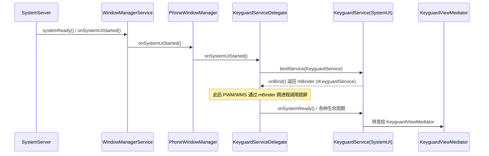

# KeyguardService 详解（AOSP 14 / android-14.0.0_r1）

> 源码位置：`frameworks/base/packages/SystemUI/src/com/android/systemui/keyguard/KeyguardService.java`
> 本文所有代码片段、行号均来自该文件在 `main` 分支的真实内容（已逐行核对）。

---

## 0. 速读结论（先看这个）

- `KeyguardService` 是 **SystemUI 进程内、由 WMS 通过 Binder 拉起的锁屏服务端**，实现 `com.android.internal.policy.IKeyguardService` 接口。
- 它**几乎不写业务逻辑**——所有 Binder 调用都 `checkPermission()` 后转发给 `KeyguardViewMediator`（真正干活的状态机）。它本质是**跨进程 RPC 适配层 + 生命周期/动画桥接**。
- 它的权限门槛是 `android.permission.CONTROL_KEYGUARD`，但 `system_server`（UID 1000）调用时**跳过权限检查**（避免死锁）。
- 启动它不是 `SystemUIService`，而是 **WMS → PhoneWindowManager → KeyguardServiceDelegate.bindService()**。
- AOSP 14 的锁屏退出/遮挡动画走 **ShellTransitions（新 WindowManager Transition 体系）**；老的 `startKeyguardExitAnimation()` 已 `@Deprecated`。

---

## 1. 角色与进程模型：谁拉起它

### 1.1 它和 SystemUIService 是两回事

系统里**有两个入口**会拉起 SystemUI 进程内的组件：

| 入口 | 由谁拉起 | 作用 |
|------|----------|------|
| `SystemUIService` | `SystemServer.startSystemUi()`（AMS 侧） | 启动所有 `CoreStartable` 组件（状态栏、QS、导航栏…） |
| `KeyguardService` | **WMS → KeyguardServiceDelegate.bindService()** | 提供锁屏 Binder 服务，被 PWM/WMS 直接调用 |

`KeyguardService` 在 Manifest 里是 `android:exported="true"`，所以 WMS 能跨进程 bind 它。

### 1.2 绑定链路（WMS 侧）



`KeyguardServiceDelegate` 源码位置：
`frameworks/base/services/core/java/com/android/server/policy/keyguard/KeyguardServiceDelegate.java`
意图构造逻辑里 `component` 指向的就是 `com.android.systemui/.keyguard.KeyguardService`。

### 1.3 为什么 onCreate 里要先 startServicesIfNeeded

源码第 304–305 行：

```java
@Override
public void onCreate() {
    ((SystemUIApplication) getApplication()).startServicesIfNeeded();
```

因为 `KeyguardService` 可能**早于或独立于 `SystemUIService`** 被 WMS 拉起（锁屏是早期核心能力，解锁前就要可用，且 `directBootAware`）。这一步保证：WMS 一旦 bind 到 Keyguard，SystemUI 的其余组件（含 `KeyguardViewMediator` 所依赖的）都已初始化，避免 Mediator 拿到 null 依赖。

---

## 2. 类结构与 Dagger 依赖注入

类声明与字段（第 88–96 行）：

```java
public class KeyguardService extends Service {
    static final String TAG = "KeyguardService";
    static final String PERMISSION = android.Manifest.permission.CONTROL_KEYGUARD;

    private final KeyguardViewMediator mKeyguardViewMediator;
    private final KeyguardLifecyclesDispatcher mKeyguardLifecyclesDispatcher;
    private final ScreenOnCoordinator mScreenOnCoordinator;
    private final ShellTransitions mShellTransitions;
    private final DisplayTracker mDisplayTracker;
```

构造函数（第 289–301 行）被 `@Inject` 标注——由 SystemUI 的 Dagger 图注入 5 个依赖：

| 依赖 | 来源包 | 作用 |
|------|--------|------|
| `KeyguardViewMediator` | `com.android.systemui.keyguard` | 锁屏核心状态机，**所有锁屏逻辑真正落点** |
| `KeyguardLifecyclesDispatcher` | `com.android.systemui.keyguard` | 把休眠/唤醒/亮屏事件分发到各 `Startable` |
| `ScreenOnCoordinator` | `com.android.keyguard.mediator`（注意在 `frameworks/base/keyguard`，非 SystemUI） | 协调"屏幕已可点亮"的回调，确保锁屏绘制完成 |
| `ShellTransitions` | `com.android.wm.shell.transition` | WMShell 过渡动画入口（决定是否走新动画体系） |
| `DisplayTracker` | `com.android.systemui.settings` | 追踪默认显示 ID，用于注册远程动画 |

**关键认知**：`KeyguardService` 自己持有状态的逻辑极少，它把调用转给 `KeyguardViewMediator`。想改锁屏行为，**改 Mediator 或它下游**，而不是改 `KeyguardService` 的 Binder 桩。

---

## 3. 权限模型：checkPermission()

第 343–353 行：

```java
void checkPermission() {
    // 避免死锁：不要回调进 system 进程
    if (Binder.getCallingUid() == Process.SYSTEM_UID) return;

    // 否则显式检查调用者权限 ...
    if (getBaseContext().checkCallingOrSelfPermission(PERMISSION) != PERMISSION_GRANTED) {
        Log.w(TAG, "Caller needs permission '" + PERMISSION + "' to call " + Debug.getCaller());
        throw new SecurityException("Access denied to process: " + Binder.getCallingPid()
                + ", must have permission " + PERMISSION);
    }
}
```

要点：
- **SYSTEM_UID（1000，`system_server`）调用直接放行**——因为 WMS/PWM 是系统核心，且这里若再回调 system 进程去查权限会**死锁**（注释明确写了 *Avoid deadlock by avoiding calling back into the system process*）。
- 其他进程必须有 `android.permission.CONTROL_KEYGUARD`（signature|privileged 级）。SystemUI 自己在 Manifest 已声明该权限。
- 每个 Binder 方法第一行都是 `checkPermission()`（除少数内部回调），这是锁屏安全边界。

---

## 4. onCreate() 详解：远程动画注册（旧路径）

第 303–336 行，`onCreate` 的后半段：

```java
if (mShellTransitions == null || !Transitions.ENABLE_SHELL_TRANSITIONS) {
    RemoteAnimationDefinition definition = new RemoteAnimationDefinition();
    final RemoteAnimationAdapter exitAnimationAdapter =
            new RemoteAnimationAdapter(mKeyguardViewMediator.getExitAnimationRunner(), 0, 0);
    definition.addRemoteAnimation(TRANSIT_OLD_KEYGUARD_GOING_AWAY, exitAnimationAdapter);
    definition.addRemoteAnimation(TRANSIT_OLD_KEYGUARD_GOING_AWAY_ON_WALLPAPER, exitAnimationAdapter);
    final RemoteAnimationAdapter occludeAnimationAdapter =
            new RemoteAnimationAdapter(mKeyguardViewMediator.getOccludeAnimationRunner(), 0, 0);
    definition.addRemoteAnimation(TRANSIT_OLD_KEYGUARD_OCCLUDE, occludeAnimationAdapter);
    // ... OCCLUDE_BY_DREAM / UNOCCLUDE 同理
    ActivityTaskManager.getInstance().registerRemoteAnimationsForDisplay(
            mDisplayTracker.getDefaultDisplayId(), definition);
}
```

逻辑：
- **仅当未启用 ShellTransitions 时**，走传统的 `RemoteAnimationAdapter` 注册路径。
- 为 4 类旧过渡类型注册动画 runner，runner 全部来自 `KeyguardViewMediator`（`getExitAnimationRunner()` / `getOccludeAnimationRunner()` / …）。
- 启用 ShellTransitions（AOSP 14 默认）时，动画由第 6 节的 `wrap()` 适配层处理，这里整段跳过。

---

## 5. Binder 接口 IKeyguardService：全方法注释

`onBind()`（第 338–341 行）返回 `mBinder`：

```java
@Override
public IBinder onBind(Intent intent) {
    return mBinder;
}
```

`mBinder` 是 `IKeyguardService.Stub`（第 355 行起），**所有方法都是 oneway**（在 AIDL 定义里），即调用方不阻塞等待返回。因此代码里用 `Trace.asyncTraceForTrackBegin/End`（第 364–367 行）记录**调用顺序**而非耗时，方便在 systrace 里可视化 WMS→SystemUI 的锁屏事件流。

### 5.1 方法速查表

| Binder 方法 | 触发方 | 转发到 | 含义 |
|-------------|--------|--------|------|
| `addStateMonitorCallback` | WMS/PWM | `KVM.addStateMonitorCallback` | 注册锁屏状态监听 |
| `verifyUnlock` | 锁屏验证成功 | `KVM.verifyUnlock` | 验证通过，准备解锁 |
| `setOccluded` | 全屏 Activity 覆盖 | `KVM.setOccluded` | 锁屏被遮挡（如相机/来电全屏） |
| `dismiss` | 各业务 | `KVM.dismiss` | 解雇锁屏 |
| `onDreamingStarted/Stopped` | DreamManager | `KVM.onDreaming*` | Doze/Dream 屏保开始/停止 |
| `onStartedGoingToSleep` | PowerManager | `KVM.onStartedGoingToSleep` + `LifecyclesDispatcher` | 开始休眠 |
| `onFinishedGoingToSleep` | PowerManager | `KVM.onFinishedGoingToSleep` + `LifecyclesDispatcher` | 休眠完成 |
| `onStartedWakingUp` | PowerManager | `KVM.onStartedWakingUp` + `LifecyclesDispatcher` | 开始唤醒 |
| `onFinishedWakingUp` | PowerManager | `LifecyclesDispatcher` | 唤醒完成 |
| `onScreenTurningOn` | WMS | `LifecyclesDispatcher` + `ScreenOnCoordinator` | **屏幕点亮中，关键 onDrawn 回调** |
| `onScreenTurnedOn/Off` | WMS | `KVM` + `LifecyclesDispatcher` + `ScreenOnCoordinator` | 屏幕已亮/灭 |
| `onScreenTurningOff` | WMS | `LifecyclesDispatcher` | 屏幕熄灭中 |
| `setKeyguardEnabled` | 设置/设备管理 | `KVM.setKeyguardEnabled` | 启用/禁用锁屏 |
| `onSystemReady` | WMS | `KVM.onSystemReady` | 系统就绪，可显示锁屏 |
| `doKeyguardTimeout` | 超时 | `KVM.doKeyguardTimeout` | 触发锁屏（如灭屏后重新锁） |
| `setSwitchingUser` / `setCurrentUser` | AMS | `KVM.setSwitchingUser/CurrentUser` | 多用户切换 |
| `onBootCompleted` | ActivityManager | `KVM.onBootCompleted` | 启动完成 |
| `startKeyguardExitAnimation` | **@Deprecated** | `KVM.startKeyguardExitAnimation` | 老解锁动画入口，已被 ShellTransitions 取代 |
| `onShortPowerPressedGoHome` | PWM | `KVM.onShortPowerPressedGoHome` | 短按电源键回桌面 |
| `dismissKeyguardToLaunch` | 各业务 | `KVM.dismissKeyguardToLaunch` | 解雇并启动指定 Intent |
| `onSystemKeyPressed` | PWM | `KVM.onSystemKeyPressed` | 系统键（如菜单键）按下 |

### 5.2 重点方法逐行注释

#### (a) onScreenTurningOn —— 屏幕点亮与"绘制完成"同步（第 462–495 行）

这是**最容易踩坑、也最能体现 SystemUI/WMS 协作**的方法：

```java
public void onScreenTurningOn(IKeyguardDrawnCallback callback) {
    trace("onScreenTurningOn");
    Trace.beginSection("KeyguardService.mBinder#onScreenTurningOn");
    checkPermission();
    // 1) 通知生命周期分发器：屏幕正在点亮
    mKeyguardLifecyclesDispatcher.dispatch(KeyguardLifecyclesDispatcher.SCREEN_TURNING_ON, callback);

    final String onDrawWaitingTraceTag = "Waiting for KeyguardDrawnCallback#onDrawn";
    final int traceCookie = System.identityHashCode(callback);
    Trace.beginAsyncSection(onDrawWaitingTraceTag, traceCookie);

    // 2) 通过 ScreenOnCoordinator 确保 onDrawn 只回调一次
    mScreenOnCoordinator.onScreenTurningOn(new Runnable() {
        boolean mInvoked;
        @Override
        public void run() {
            if (callback == null) return;
            if (!mInvoked) {
                mInvoked = true;
                try {
                    Trace.endAsyncSection(onDrawWaitingTraceTag, traceCookie);
                    callback.onDrawn();   // 3) 告诉 WMS：锁屏已绘制完成，可以亮屏
                } catch (RemoteException e) {
                    Log.w(TAG, "Exception calling onDrawn():", e);
                }
            } else {
                Log.w(TAG, "KeyguardDrawnCallback#onDrawn() invoked > 1 times");
            }
        }
    });
    Trace.endSection();
}
```

**核心机制**：WMS 在亮屏前先调 `onScreenTurningOn(callback)`，然后**阻塞等待** `callback.onDrawn()`。只有锁屏（或相关界面）真正绘制到 SurfaceFlinger 后，SystemUI 才回调 `onDrawn()`，WMS 收到后才真正点亮屏幕。这保证了"亮屏瞬间用户看到的是已绘制好的锁屏，而不是黑屏/残影"。`mInvoked` 标志保证 `onDrawn()` 只调用一次（重复调用会导致 WMS 状态错乱）。

#### (b) 睡眠 / 唤醒分发（第 418–451 行为例）

```java
public void onStartedGoingToSleep(@PowerManager.GoToSleepReason int pmSleepReason) {
    trace("onStartedGoingToSleep pmSleepReason=" + pmSleepReason);
    checkPermission();
    // 转译 power reason → keyguard off reason，交给 Mediator
    mKeyguardViewMediator.onStartedGoingToSleep(
            WindowManagerPolicyConstants.translateSleepReasonToOffReason(pmSleepReason));
    // 同时分发到生命周期系统（影响其他 Startable 的睡眠行为）
    mKeyguardLifecyclesDispatcher.dispatch(
            KeyguardLifecyclesDispatcher.STARTED_GOING_TO_SLEEP, pmSleepReason);
}
```

模式统一：**Mediator 负责锁屏自身状态**，**LifecyclesDispatcher 负责把事件广播给 SystemUI 内关心睡眠/唤醒的其他组件**。唤醒（`onStartedWakingUp`/`onFinishedWakingUp`）同理。

---

## 6. 动画适配层：ShellTransitions 新时代（第 98–287 行）

AOSP 14 默认启用 ShellTransitions，锁屏退出/遮挡动画走新的 `IRemoteTransition` 接口（来自 WMShell），但 `KeyguardViewMediator` 内部仍用老的 `IRemoteAnimationRunner`。`KeyguardService` 提供 `wrap()` 做**双向适配**：

- `newModeToLegacyMode()`（第 98–109 行）：把新 `TransitionInfo` 的 mode（`TRANSIT_OPEN/CLOSE/TO_FRONT/TO_BACK`）映射回老的 `MODE_OPENING/CLOSING/CHANGING`。
- `wrap()`（第 111–165 行）：把 `TransitionInfo` 的 changes 拆成 `apps` / `wallpapers` 两组 `RemoteAnimationTarget[]`，处理壁纸旋转补偿（`CounterRotator`）。
- `getTransitionOldType()`（第 167–184 行）：把新 transition type/flags 翻译成老的 `TRANSIT_OLD_KEYGUARD_*` 类型，供老 runner 识别。
- `wrap(KeyguardViewMediator, IRemoteAnimationRunner, ...)`（第 188–287 行）：返回一个 `IRemoteTransition.Stub`，其 `startAnimation()` 把新体系参数包装后调用 Mediator 的 `IRemoteAnimationRunner.onAnimationStart()`；`mergeAnimation()` 处理动画合并（如锁屏重新出现时 `setPendingLock(true)` + `cancelKeyguardExitAnimation()`）；`finish()` 通过 `IRemoteTransitionFinishedCallback` 通知 WMShell 动画结束。

**结论**：这部分是动画框架演进的"胶水层"，**常规锁屏定制不需要碰它**。

---

## 7. 与 KeyguardViewMediator 的关系（真正逻辑落点）

`KeyguardService` 中所有 Binder 方法最终都落到 `KeyguardViewMediator`：

```
KeyguardViewMediator.java
frameworks/base/packages/SystemUI/src/com/android/systemui/keyguard/KeyguardViewMediator.java
```

它负责：
- 锁屏显示/隐藏的决策（是否安全、`isSecure()`、`showLocked()`）
- 与 `StatusBarKeyguardViewManager` 协作管理锁屏视图
- 生物识别/密码验证结果接收
- 用户切换、设备管理策略（disable keyguard）
- 解锁动画触发

**定制铁律**：要改"锁屏行为"（隐藏、跳过验证、自动解锁、超时），改 `KeyguardViewMediator` 或其下游视图，而不是 `KeyguardService` 的 Binder 桩。

---

## 8. 车载定制启示

### 8.1 禁用锁屏 / 跳过验证 —— 改这里，不是 KeyguardService

| 需求 | 推荐改法 | 说明 |
|------|----------|------|
| 全局禁用锁屏 | `config.xml` 里 `config_disableLockscreen` 置 true，或 DevicePolicyManager `setKeyguardDisabled` | 经 `KeyguardViewMediator.setKeyguardEnabled(false)` 生效 |
| 车载自动解锁（信任环境） | `TrustManager` + 自定义 `TrustAgent` | 走 `TRUST_LISTENER` 权限，无需改锁屏代码 |
| 产品级隐藏锁屏 UI | overlay 资源 + `keyguard_disable` | 区分 system/product 分区 |
| 临时跳过（调试） | `adb shell wm dismiss-keyguard` | 仅调试 |

**不要**在 `KeyguardService` 的 Binder 方法里加"直接 dismiss"的 hack——会破坏权限边界和 WMS 协作状态机。

### 8.2 直接启动（Direct Boot）务必保留

锁屏是 `directBootAware`（见 Manifest 分析文档），解锁前就要工作。任何随锁屏启动的组件必须标 `directBootAware`，否则 early-boot 阶段 WMS 调 `onScreenTurningOn` 时组件未就绪会 NPE。

### 8.3 多用户 / 多显示屏

`KeyguardService` 持有 `DisplayTracker`，锁屏按用户/显示屏区分。`setCurrentUser()` / `setSwitchingUser()` 是 AMS 切用户时透传的关键点，车载多用户座舱（司机/乘客屏）要关注这两条链路。

---

## 9. 方法速查表（按职责归类）

- **状态/解锁**：`addStateMonitorCallback` / `verifyUnlock` / `dismiss` / `dismissKeyguardToLaunch` / `setKeyguardEnabled` / `doKeyguardTimeout`
- **显示生命周期**：`onSystemReady` / `onBootCompleted` / `onScreenTurningOn` / `onScreenTurnedOn` / `onScreenTurningOff` / `onScreenTurnedOff`
- **电源/休眠**：`onStartedGoingToSleep` / `onFinishedGoingToSleep` / `onStartedWakingUp` / `onFinishedWakingUp` / `onDreamingStarted` / `onDreamingStopped`
- **遮挡**：`setOccluded`
- **用户**：`setCurrentUser` / `setSwitchingUser`
- **输入/系统键**：`onShortPowerPressedGoHome` / `onSystemKeyPressed`
- **动画（deprecated 或 glue）**：`startKeyguardExitAnimation`(deprecated) / `wrap()`(ShellTransitions 适配)

---

## 10. 小结

`KeyguardService` 是 **WMS 与 SystemUI 锁屏之间的 Binder 边界 + 生命周期/动画桥接**，自身几乎无状态，全部转发给 `KeyguardViewMediator`。理解它的价值在于：
1. 看清**锁屏由 WMS 驱动**（不是 SystemUI 自嗨），所有生命周期事件来自 `system_server`；
2. 明白**权限边界**（`CONTROL_KEYGUARD`，但 system 进程豁免）；
3. 知道**改锁屏行为要下钻到 Mediator**，而不是动这个 RPC 适配层；
4. 了解 AOSP 14 动画已从 `RemoteAnimation` 迁移到 **ShellTransitions / IRemoteTransition**，`KeyguardService.wrap()` 是兼容胶水。
