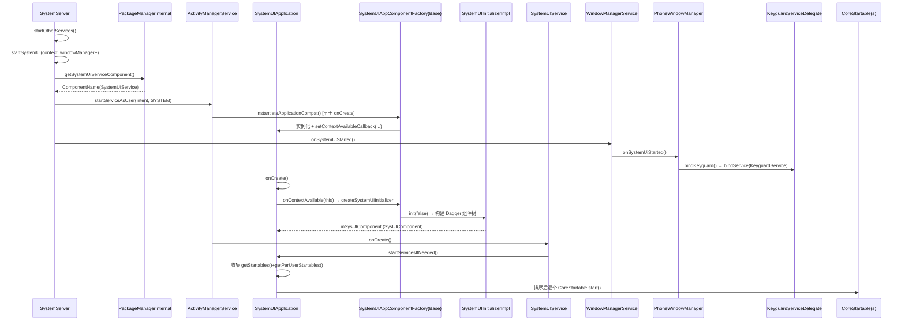

# SystemUI 启动流程详解（AOSP 14 / android-14.0.0_r1 深度代码注释）

> 本文档基于 AOSP 14 标准源码（`frameworks/base/packages/SystemUI/`、`frameworks/base/services/`）
> 与掘金《Android14 SystemUI 启动过程》核对整理。所有文件路径、类名、方法名均可在仓库中定位。
> 配套前置文档：`SystemUI_AndroidManifest_分析.md`、`SystemUI修改指南_AOSP14.md`。

---

## 一、核心结论（先看这个）

1. **启动总入口在 `SystemServer`**，不是 SystemUI 自己。SystemServer 进入 `startOtherServices()` 最后阶段，调用 `startSystemUi()`，通过 `context.startServiceAsUser(...)` 拉起 `SystemUIService`。
2. **SystemUI 的"早期注入"发生在 Application 被 new 出来之前**。AOSP 14 用 `appComponentFactory=".SystemUIAppComponentFactory"`（在 Manifest 里用 `tools:replace` 覆盖默认工厂），在 `Application` 实例化阶段就通过 Dagger 把整个依赖树（`GlobalRootComponent → WMComponent → SysUIComponent`）建好。这是 AOSP 12 重构后的关键变化——**不再靠 `SystemUIApplication.onCreate` 里反射 new 一堆 Service**。
3. **真正的组件启动在 `SystemUIService.onCreate()`**，它回调 `SystemUIApplication.startServicesIfNeeded()`，把 Dagger 注入的所有 `CoreStartable` 实现类按类名排序后逐个 `start()`。
4. **组件注册是 Dagger multibinding（`@IntoMap` + `@ClassKey`）**。新增一个 SystemUI 组件，只需写一个 `CoreStartable` 实现，并在 `SystemUICoreStartableModule` 里 `@Binds @IntoMap @ClassKey(...)` 注册，无需手改启动列表。
5. **锁屏（KeyguardService）不是由 SystemUIService 直接启动**，而是 SystemServer 在 `startSystemUi` 末尾通过 `windowManager.onSystemUiStarted()` → `PhoneWindowManager.bindKeyguard()` → `KeyguardServiceDelegate.bindService()` 以 Binder 服务形式单独绑定。

---

## 二、启动链路全景时序图



> 注意时序：**`instantiateApplicationCompat` 早于 `Application.onCreate`，而 `SystemUIService.onCreate` 又晚于 `Application.onCreate`**。早期 Dagger 树在 App 实例化阶段就建好了，所以 SVC 起来时组件树已经可用。

---

## 三、阶段一：SystemServer 点火 SystemUI

**文件：`frameworks/base/services/java/com/android/server/SystemServer.java`**

SystemServer 启动分三个阶段：`startBootstrapServices()`、`startCoreServices()`、`startOtherServices()`。SystemUI 在最后一个阶段末尾启动。

```java
// ===== frameworks/base/services/java/com/android/server/SystemServer.java =====
// 在 startOtherServices() 方法中：
t.traceBegin("StartSystemUI");
try {
    // ① 拉起 SystemUI，windowManagerF 是 WindowManagerService 实例
    startSystemUi(context, windowManagerF);
} catch (Throwable e) {
    // 启动失败只记 WTF，不致命（SystemUI 崩溃由 AMS 自动拉起，见下面 persistent 说明）
    reportWtf("starting System UI", e);
}
t.traceEnd();
```

```java
// ===== 同一个文件中的私有方法 =====
private static void startSystemUi(Context context, WindowManagerService windowManager) {
    // ② 通过 LocalServices 拿 PMS 的本地接口（进程内，不走 Binder）
    PackageManagerInternal pm = LocalServices.getService(PackageManagerInternal.class);
    Intent intent = new Intent();
    // ③ 从 config 里读出要启动的 SystemUI 服务组件名（见下方 getSystemUiServiceComponent）
    intent.setComponent(pm.getSystemUiServiceComponent());
    // FLAG_DEBUG_TRIAGED_MISSING：若组件缺失，AMS 会打印 triage 信息辅助排查，而非静默失败
    intent.addFlags(Intent.FLAG_DEBUG_TRIAGED_MISSING);
    // ④ 以 SYSTEM 用户身份启动 SystemUIService（SystemUI 只在系统用户进程常驻）
    context.startServiceAsUser(intent, UserHandle.SYSTEM);
    // ⑤ 通知 WMS：SystemUI 已启动，紧接着去绑定 KeyguardService（阶段一末尾）
    windowManager.onSystemUiStarted();
}
```

**组件名来源 `frameworks/base/services/core/java/com/android/server/pm/PackageManagerInternalBase.java`：**

```java
public final ComponentName getSystemUiServiceComponent() {
    // 从 framework-res 的 config 中读取字符串并展开成 ComponentName
    return ComponentName.unflattenFromString(getContext().getResources().getString(
            com.android.internal.R.string.config_systemUIServiceComponent));
}
```

**配置定义 `frameworks/base/core/res/res/values/config.xml`：**

```xml
<string name="config_systemUIServiceComponent" translatable="false"
        >com.android.systemui/com.android.systemui.SystemUIService</string>
```

> 也就是说，SystemServer 拉起的就是 `com.android.systemui.SystemUIService` 这个 Service。这就是 Manifest 里那个 `exported="true"` 的 `SystemUIService`（见 `SystemUI_AndroidManifest_分析.md`）。

### 3.1 顺带：KeyguardService 绑定链路（阶段一末尾）

SystemUI 拉起后立刻绑定锁屏服务，但**锁屏不是 SystemUIService 的子组件，是独立 Binder 服务**：

```java
// ===== frameworks/base/services/core/java/com/android/server/wm/WindowManagerService.java =====
public void onSystemUiStarted() {
    mPolicy.onSystemUiStarted();   // mPolicy 是 PhoneWindowManager
}

// ===== frameworks/base/services/core/java/com/android/server/policy/PhoneWindowManager.java =====
public void onSystemUiStarted() {
    bindKeyguard();
}
private void bindKeyguard() {
    synchronized (mLock) {
        if (mKeyguardBound) return;   // 幂等：只绑一次
        mKeyguardBound = true;
    }
    mKeyguardDelegate.bindService(mContext);   // mKeyguardDelegate = KeyguardServiceDelegate
}

// ===== frameworks/base/services/core/java/com/android/server/policy/keyguard/KeyguardServiceDelegate.java =====
public void bindService(Context context) {
    Intent intent = new Intent();
    final Resources resources = context.getApplicationContext().getResources();
    // 同样从 config 读取要绑定的锁屏服务组件
    final ComponentName keyguardComponent = ComponentName.unflattenFromString(
            resources.getString(com.android.internal.R.string.config_keyguardComponent));
    intent.addFlags(Intent.FLAG_DEBUG_TRIAGED_MISSING);
    intent.setComponent(keyguardComponent);
    // BIND_AUTO_CREATE：绑定即创建；UserHandle.SYSTEM 限定系统用户
    if (!context.bindServiceAsUser(intent, mKeyguardConnection,
            Context.BIND_AUTO_CREATE, mHandler, UserHandle.SYSTEM)) {
        mKeyguardState.showing = false;
        mKeyguardState.secure = false;
        synchronized (mKeyguardState) { mKeyguardState.deviceHasKeyguard = false; }
    }
    // 同时注册 DreamManager（屏保/Doze）状态监听
    final DreamManagerInternal dreamManager = LocalServices.getService(DreamManagerInternal.class);
    dreamManager.registerDreamManagerStateListener(mDreamManagerStateListener);
}
```

**配置 `frameworks/base/core/res/res/values/config.xml`：**

```xml
<string name="config_keyguardComponent" translatable="false"
        >com.android.systemui/com.android.systemui.keyguard.KeyguardService</string>
```

> 这印证了之前 Manifest 分析里的 `KeyguardService`（`android:exported="true"`）——它由 WMS/PWM 主动 bind，状态机驱动锁屏显示/隐藏。

---

## 四、阶段二：Application 实例化前的早期 Dagger 注入（appComponentFactory 钩子）

**为什么不用 `Application.onCreate`？** 因为 SystemUI 需要在 Application 对象刚被 new 出来、任何组件实例化之前，就把整套 Dagger 依赖树建好（很多组件依赖 `Context` 早期注入）。AOSP 14 用 `AppComponentFactory` 机制实现这一点。

### 4.1 Manifest 中的声明（回顾）

```xml
<application
    android:name=".SystemUIApplication"
    android:persistent="true"
    android:process="com.android.systemui"
    android:defaultToDeviceProtectedStorage="true"
    android:directBootAware="true"
    tools:replace="android:appComponentFactory"
    android:appComponentFactory=".SystemUIAppComponentFactory">
```

`tools:replace="android:appComponentFactory"` 表示用 SystemUI 自己的工厂**覆盖**系统默认的 `android.app.AppComponentFactory`。

### 4.2 `SystemUIAppComponentFactory.java`

**文件：`frameworks/base/packages/SystemUI/src/com/android/systemui/SystemUIAppComponentFactory.java`**

```java
/**
 * Starts up SystemUI using the AOSP {@link SystemUIInitializerImpl}.
 *
 * This initializer relies on reflection to start everything up and should be considered deprecated.
 * Instead, create your own {@link SystemUIAppComponentFactoryBase}, specify it in your
 * AndroidManifest.xml and construct your own {@link SystemUIInitializer} directly.
 *
 * @deprecated Define your own SystemUIAppComponentFactoryBase implementation and use that. This
 *             implementation may be changed or removed in future releases.
 */
@Deprecated
public class SystemUIAppComponentFactory extends SystemUIAppComponentFactoryBase {
    @Override
    protected SystemUIInitializer createSystemUIInitializer(Context context) {
        // 仅仅返回一个 initializer；真正的初始化在父类里用反射建 SystemUIInitializerImpl
        return SystemUIInitializerFactory.createWithContext(context);
    }
}
```

> ⚠️ 注意 `@Deprecated` 注释：官方已提示厂商应自定义 `SystemUIAppComponentFactoryBase`，不要长期依赖这个反射版。车载定制时建议直接继承 `SystemUIAppComponentFactoryBase` 自实现 initializer（这也是后续版本演进方向）。

### 4.3 `SystemUIAppComponentFactoryBase.kt`（核心钩子逻辑）

**文件：`frameworks/base/packages/SystemUI/src/com/android/systemui/SystemUIAppComponentFactoryBase.kt`**

```kotlin
// 回调接口：当 Application 的 Context 可用时，返回一个初始化好的 SystemUIInitializer
fun interface ContextAvailableCallback {
    fun onContextAvailable(context: Context): SystemUIInitializer
}

// 上下文初始化器接口——SystemUIApplication 必须实现它
interface ContextInitializer {
    fun setContextAvailableCallback(callback: ContextAvailableCallback)
}

// 子类（SystemUIAppComponentFactory）必须实现：创建 initializer
protected abstract fun createSystemUIInitializer(context: Context): SystemUIInitializer

// 真正建树的地方（带缓存，只执行一次）
private fun createSystemUIInitializerInternal(context: Context): SystemUIInitializer {
    return systemUIInitializer ?: run {
        // 调用子类实现，拿到 SystemUIInitializer（默认实现反射创建 SystemUIInitializerImpl）
        val initializer = createSystemUIInitializer(context.applicationContext)
        try {
            initializer.init(false)   // ④ 关键：构建整个 Dagger 组件树（见阶段三）
        } catch (exception: ExecutionException) {
            throw RuntimeException("Failed to initialize SysUI", exception)
        } catch (exception: InterruptedException) {
            throw RuntimeException("Failed to initialize SysUI", exception)
        }
        // 把工厂自身注入进组件树（这样其他组件能拿到 factory）
        initializer.sysUIComponent.inject(this@SystemUIAppComponentFactoryBase)
        systemUIInitializer = initializer
        return initializer
    }
}

// ⑤ 框架在 new Application 之前会调用此方法（AppComponentFactory 的约定）
override fun instantiateApplicationCompat(cl: ClassLoader, className: String): Application {
    // 用系统默认方式 new 出 Application 实例
    val app = super.instantiateApplicationCompat(cl, className)
    // 强制要求 SystemUIApplication 实现 ContextInitializer，否则直接崩
    if (app !is ContextInitializer) {
        throw RuntimeException("App must implement ContextInitializer")
    } else {
        // 给 Application 设置一个回调：等它 onCreate 时调用 onContextAvailable → 触发建树
        app.setContextAvailableCallback { context ->
            createSystemUIInitializerInternal(context)
        }
    }
    return app
}
```

**要点：**
- `instantiateApplicationCompat` 早于 `Application.onCreate` 执行（这是 `AppComponentFactory` 的机制，Android 9+ 引入）。
- 它给 `SystemUIApplication` 注入一个 `ContextAvailableCallback`，**回调时机是 Application.onCreate**。
- `createSystemUIInitializerInternal` 里有缓存（`systemUIInitializer ?: run{...}`），保证组件树只建一次。

---

## 五、阶段三：SystemUIInitializer.init() 构建 Dagger 组件树

**文件：`frameworks/base/packages/SystemUI/src/com/android/systemui/SystemUIInitializer.java`**

这是整个启动的"心脏"——把 Dagger 的 global 根组件、WM（WMShell）子组件、SysUI 子组件三级树一次性建好。

```java
public void init(boolean fromTest) throws ExecutionException, InterruptedException {
    // ① 构建最顶层的 GlobalRootComponent（AOSP 默认实现 = ReferenceGlobalRootComponent）
    mRootComponent = getGlobalRootComponentBuilder()
            .context(mContext)
            .instrumentationTest(fromTest)   // 是否为测试环境
            .build();

    // ② 初始化检查器：决定是否需要真正初始化组件（测试环境跳过大组件）
    mInitializationChecker = mRootComponent.getInitializationChecker();
    boolean initializeComponents = mInitializationChecker.initializeComponents();

    // ③ 搭建 WMComponent（WMShell 的组件树：Pip/分屏/气泡/拖动/后台动画等）
    setupWmComponent(mContext);

    // ④ 从 GlobalRootComponent 拿到 SysUIComponent.Builder
    SysUIComponent.Builder builder = mRootComponent.getSysUIComponent();
    if (initializeComponents) {
        // ⑤ 把 WMShell 的各种能力（接口）注入 SysUIComponent
        builder = prepareSysUIComponentBuilder(builder, mWMComponent)
                .setShell(mWMComponent.getShell())
                .setPip(mWMComponent.getPip())
                .setSplitScreen(mWMComponent.getSplitScreen())
                .setOneHanded(mWMComponent.getOneHanded())
                .setBubbles(mWMComponent.getBubbles())
                .setTaskViewFactory(mWMComponent.getTaskViewFactory())
                .setTransitions(mWMComponent.getTransitions())
                .setKeyguardTransitions(mWMComponent.getKeyguardTransitions())
                .setStartingSurface(mWMComponent.getStartingSurface())
                .setDisplayAreaHelper(mWMComponent.getDisplayAreaHelper())
                .setRecentTasks(mWMComponent.getRecentTasks())
                .setBackAnimation(mWMComponent.getBackAnimation())
                .setDesktopMode(mWMComponent.getDesktopMode());
        // ⑥ 真正初始化 WMComponent（此前只是 builder）
        mWMComponent.init();
    } else {
        // 测试分支：注入空实现，避免拉起真实 Shell 组件
        builder = prepareSysUIComponentBuilder(builder, mWMComponent)
                .setShell(new ShellInterface() {})
                .setPip(Optional.ofNullable(null))
                .setSplitScreen(Optional.ofNullable(null))
                // ... 其余均为空/Optional.empty()
    }

    // ⑦ 构建 SysUIComponent —— 所有 SystemUI 业务组件（CoreStartable）都从这里拿
    mSysUIComponent = builder.build();
    if (initializeComponents) {
        mSysUIComponent.init();   // 触发 SysUIComponent 内部初始化
    }

    // ⑧ 旧 Dependency 容器（兼容层）仍需尽早启动——大量遗留代码依赖它
    Dependency dependency = mSysUIComponent.createDependency();
    dependency.start();
}
```

**组件树结构（务必理解，后续定制都围绕它）：**

```
GlobalRootComponent  (SystemUIInitializer.getGlobalRootComponentBuilder)
   │   ← DaggerReferenceGlobalRootComponent（AOSP 默认）
   ├── WMComponent        (WMShell: Pip/SplitScreen/Bubbles/Transitions/...)
   │
   └── SysUIComponent     (mRootComponent.getSysUIComponent)
          ← @Subcomponent，承载所有业务 CoreStartable
          ├── getStartables()            → Map<Class, Provider<CoreStartable>> 全局组件
          └── getPerUserStartables()     → @PerUser Map<Class, Provider<CoreStartable>> 每用户组件
```

### 5.1 initializer 是通过反射创建的

**文件：`frameworks/base/packages/SystemUI/src/com/android/systemui/SystemUIInitializerFactory.kt`**

```kotlin
object SystemUIInitializerFactory {
    @JvmStatic
    @VisibleForTesting
    fun createFromConfigNoAssert(context: Context): SystemUIInitializer {
        return initializer ?: run {
            // 从 SystemUI 自己的 config 读 initializer 类名
            val className = context.getString(R.string.config_systemUIFactoryComponent)
            if (className.isEmpty()) {
                throw RuntimeException("No SystemUIFactory component configured")
            }
            try {
                val cls = context.classLoader.loadClass(className)
                val constructor = cls.getConstructor(Context::class.java)
                (constructor.newInstance(context) as SystemUIInitializer).apply {
                    initializer = this
                }
            } catch (t: Throwable) {
                Log.w(TAG, "Error creating SystemUIInitializer component: $className", t)
                throw t
            }
        }
    }
}
```

**配置 `frameworks/base/packages/SystemUI/res/values/config.xml`：**

```xml
<!-- SystemUIFactory component -->
<string name="config_systemUIFactoryComponent" translatable="false">com.android.systemui.SystemUIInitializerImpl</string>
```

**具体实现 `SystemUIInitializerImpl.kt`：**

```kotlin
class SystemUIInitializerImpl(context: Context) : SystemUIInitializer(context) {
    // 仅返回一个 Dagger 全局根组件的 builder。
    // DaggerReferenceGlobalRootComponent 是 AOSP 自动生成的 Dagger 实现类，
    // 其对应的手写组件就是 ReferenceGlobalRootComponent。
    override fun getGlobalRootComponentBuilder(): GlobalRootComponent.Builder {
        return DaggerReferenceGlobalRootComponent.builder()
    }
}
```

---

## 六、阶段四：SystemUIApplication.onCreate() —— 拿到 SysUIComponent

**文件：`frameworks/base/packages/SystemUI/src/com/android/systemui/SystemUIApplication.java`**

```java
// SystemUIApplication 必须实现 ContextInitializer —— 否则阶段二的工厂会直接抛异常
public class SystemUIApplication extends Application implements
        SystemUIAppComponentFactory.ContextInitializer {

    private ContextAvailableCallback mContextAvailableCallback;
    private SystemUIInitializer mInitializer;
    private SysUIComponent mSysUIComponent;
    // 全局所有已启动的 CoreStartable 实例（用于后续 stop/重启等）
    private final CoreStartable[] mServices = ...;

    // 由阶段二的工厂回调设置
    public void setContextAvailableCallback(SystemUIAppComponentFactory.ContextAvailableCallback callback) {
        mContextAvailableCallback = callback;
    }

    @Override
    public void onCreate() {
        super.onCreate();
        // ① 再次设置主题：Application 的 theme 不会作用于 Service 中 inflate 的 View，
        //    所以这里和 SystemUIApplication 内部都要显式 setTheme(R.style.Theme_SystemUI)
        setTheme(R.style.Theme_SystemUI);

        // ② 触发阶段二埋下的回调 → 最终走到 SystemUIInitializerFactory，
        //    反射创建 SystemUIInitializerImpl，并拿到已经 build 好的 SysUIComponent
        mInitializer = mContextAvailableCallback.onContextAvailable(this);
        mSysUIComponent = mInitializer.getSysUIComponent();

        // ③ 典型实现还会在此判断进程/用户：
        //    - 系统用户(USER_SYSTEM)：执行完整启动逻辑
        //    - 次要用户：只启动 "config_systemUIServiceComponentsPerUser" 声明的 PerUser 组件
        //    （真正启动 CoreStartable 的动作在 SystemUIService.onCreate，见阶段五）
    }
}
```

> 注意：`SystemUIApplication.onCreate()` **只负责拿组件树，不直接 start 业务组件**。真正启动在 `SystemUIService.onCreate()`。这是 AOSP 14 与老版本（旧 `PhoneStatusBar` 时代直接在 Application 里 `startServicesIfNeeded`）最大的结构差异。

---

## 七、阶段五：SystemUIService.onCreate() → CoreStartable 批量启动（核心）

### 7.1 SystemUIService 只是一个"点火器"

**文件：`frameworks/base/packages/SystemUI/src/com/android/systemui/SystemUIService.java`**

```java
public class SystemUIService extends Service {
    @Override
    public void onCreate() {
        super.onCreate();
        // 全部启动逻辑委托回 SystemUIApplication
        ((SystemUIApplication) getApplication()).startServicesIfNeeded();
    }

    // onBind 返回 null：这是一个 startService 类型的服务，不提供 Binder 接口
    @Override
    public IBinder onBind(Intent intent) {
        return null;
    }
}
```

### 7.2 startServicesIfNeeded() —— 收集并启动所有 CoreStartable

**文件：`frameworks/base/packages/SystemUI/src/com/android/systemui/SystemUIApplication.java`**

```java
public void startServicesIfNeeded() {
    // ① 拿到"厂商定制组件"类名（OEM 可在此追加自己的启动组件，overlay 机制）
    final String vendorComponent = mInitializer.getVendorComponent(getResources());

    // ② 用 TreeMap 按类名排序，保证启动顺序确定、可排查（类名排序 = 字母序启动）
    Map<Class<?>, Provider<CoreStartable>> sortedStartables = new TreeMap<>(
            Comparator.comparing(Class::getName));
    // ③ 从 SysUIComponent 注入的 multibinding Map 里取出全部全局 CoreStartable
    sortedStartables.putAll(mSysUIComponent.getStartables());
    // ④ 再合并"每用户"组件（多用户场景下每个用户各启一份）
    sortedStartables.putAll(mSysUIComponent.getPerUserStartables());

    // ⑤ 进入重载方法执行实际启动
    startServicesIfNeeded(sortedStartables, "StartServices", vendorComponent);
}
```

```java
// 实际执行启动的重载方法（省略了 metrics/日志细节，保留主干）
private void startServicesIfNeeded(
        Map<Class<?>, Provider<CoreStartable>> startables,
        String metricsPrefix,
        String vendorComponent) {

    // mServices 是 CoreStartable[]，下标 j 与遍历顺序对应
    int i = 0;
    for (Map.Entry<Class<?>, Provider<CoreStartable>> entry : startables.entrySet()) {
        String clsName = entry.getKey().getName();
        int j = i;  // 复制给 lambda 用（Java 闭包要求 final）
        // ⑥ 包裹计时 + 埋点，逐个启动
        timeInitialization(
                clsName,
                () -> mServices[j] = startStartable(clsName, entry.getValue()),
                log,
                metricsPrefix);
        i++;
    }
    // ⑦ vendorComponent 如果存在，单独反射启动（厂商扩展点，OEM 私有组件）
    if (vendorComponent != null) {
        // ... 通过反射 new 出厂商组件并 start()
    }
}
```

```java
// 计时包装：单个组件初始化超过 1 秒会打 warn（启动性能排查关键信号）
private static void timeInitialization(String clsName, Runnable init, TimingsTraceLog log,
        String metricsPrefix) {
    long ti = System.currentTimeMillis();
    log.traceBegin(metricsPrefix + " " + clsName);
    init.run();                 // 真正执行 startStartable
    log.traceEnd();
    ti = System.currentTimeMillis() - ti;
    if (ti > 1000) {
        Log.w(TAG, "Initialization of " + clsName + " took " + ti + " ms");
    }
}
```

```java
// 通过 Dagger Provider 拿到实例
private static CoreStartable startStartable(String clsName, Provider<CoreStartable> provider) {
    if (DEBUG) Log.d(TAG, "loading: " + clsName);
    if (Trace.isEnabled()) {
        Trace.traceBegin(Trace.TRACE_TAG_APP, "Provider<" + clsName + ">.get()");
    }
    CoreStartable startable = provider.get();   // Dagger 注入点：实例化组件
    Trace.endSection();
    return startStartable(startable);
}

// 真正调用业务组件的 start()
private static CoreStartable startStartable(CoreStartable startable) {
    if (DEBUG) Log.d(TAG, "running: " + startable);
    if (Trace.isEnabled()) {
        Trace.traceBegin(Trace.TRACE_TAG_APP, startable.getClass().getSimpleName() + ".start()");
    }
    startable.start();          // ★ 业务组件生命周期入口
    Trace.endSection();
    return startable;
}
```

### 7.3 CoreStartable 接口（SystemUI 14 组件的最小契约）

**文件：`frameworks/base/packages/SystemUI/src/com/android/systemui/CoreStartable.java`**

```java
package com.android.systemui;

/**
 * SystemUI 14 中所有"可被框架自动启动的组件"的统一接口。
 * 与旧版直接 new Service 不同，AOSP 14 用 Dagger multibinding 把所有实现收集进 Map，
 * 框架统一遍历调用 start()。
 */
public interface CoreStartable {
    // 组件启动入口：注册监听、创建 View、绑定服务等都在这做
    void start();
}
```

> 旧版 SystemUI 有 `SystemUI` 抽象基类 + `start()`/`onBootCompleted()`，AOSP 12 起逐步迁移到 `CoreStartable`。`onBootCompleted` 相关逻辑已拆分到 `BootCompleteCache` / `BootCompletedReceiver` 等，不再在 CoreStartable 上定义。

### 7.4 组件是怎么被收集进 Map 的？—— Dagger multibinding 注册

**文件：`frameworks/base/packages/SystemUI/src/com/android/systemui/dagger/SysUIComponent.java`**

```java
@SysUISingleton
@Subcomponent(modules = {
        DefaultComponentBinder.class,
        DependencyProvider.class,
        NotificationInsetsModule.class,
        QsFrameTranslateModule.class,
        SystemUIBinder.class,
        SystemUIModule.class,
        SystemUICoreStartableModule.class,   // ★ 所有 CoreStartable 的注册表
        ReferenceSystemUIModule.class})
public interface SysUIComponent {

    /** 返回应随 Application 启动的 CoreStartable（全局，单例） */
    Map<Class<?>, Provider<CoreStartable>> getStartables();

    /** 返回应为每个用户启动的 CoreStartable（@PerUser 作用域） */
    @PerUser Map<Class<?>, Provider<CoreStartable>> getPerUserStartables();
}
```

**注册表 `frameworks/base/packages/SystemUI/src/com/android/systemui/dagger/SystemUICoreStartableModule.kt`（模式示例）：**

```kotlin
@Module
abstract class SystemUICoreStartableModule {
    // 每个 CoreStartable 实现都用 @Binds + @IntoMap + @ClassKey 注册
    // @IntoMap 让 Dagger 把所有实现汇成一个 Map<Class, Provider<CoreStartable>>
    @Binds
    @IntoMap
    @ClassKey(StatusBarStartable::class)        // 状态栏（AOSP 14 拆成 Startable 形式）
    abstract fun bindStatusBarStartable(impl: StatusBarStartable): CoreStartable

    @Binds
    @IntoMap
    @ClassKey(NavigationBarStartable::class)     // 导航栏
    abstract fun bindNavigationBarStartable(impl: NavigationBarStartable): CoreStartable

    @Binds
    @IntoMap
    @ClassKey(NotificationsStartable::class)     // 通知
    abstract fun bindNotificationsStartable(impl: NotificationsStartable): CoreStartable

    // …… 还有几十个（QS、Keyguard、Volume、Pip、Bubbles、Doze、WMShell 等）
}
```

> **这是定制 SystemUI 最重要的扩展点**：要新增一个随系统启动的组件，只需
> ① 写一个类 `implements CoreStartable`（或继承 `CoreStartable` 实现）；
> ② 在 `SystemUICoreStartableModule` 里加一条 `@Binds @IntoMap @ClassKey(...)`；
> 框架会自动把它收集进 `getStartables()` 并在开机时 `start()`。无需手改任何启动列表。

---

## 八、关键类 / 方法 / 文件速查表

| 阶段 | 文件 | 关键类 / 方法 | 作用 |
|------|------|---------------|------|
| 1. 点火 | `services/java/com/android/server/SystemServer.java` | `startOtherServices()` / `startSystemUi()` | 拉起 SystemUIService、触发 Keyguard 绑定 |
| 1. 组件名 | `services/core/java/com/android/server/pm/PackageManagerInternalBase.java` | `getSystemUiServiceComponent()` | 从 config 读 `SystemUIService` 组件名 |
| 1. Keyguard | `services/core/java/com/android/server/policy/PhoneWindowManager.java` + `keyguard/KeyguardServiceDelegate.java` | `bindKeyguard()` / `bindService()` | 以 Binder 绑定 `KeyguardService` |
| 2. 工厂 | `packages/SystemUI/.../SystemUIAppComponentFactory.java` | `createSystemUIInitializer()` | 返回 initializer（已 @Deprecated） |
| 2. 钩子 | `SystemUIAppComponentFactoryBase.kt` | `instantiateApplicationCompat()` / `createSystemUIInitializerInternal()` | App new 之前建树、注入回调 |
| 3. 建树 | `SystemUIInitializer.java` | `init(false)` | 构建 GlobalRoot → WM → SysUI 三级 Dagger 树 |
| 3. 反射 | `SystemUIInitializerFactory.kt` | `createFromConfigNoAssert()` | 反射创建 `SystemUIInitializerImpl` |
| 3. 实现 | `SystemUIInitializerImpl.kt` | `getGlobalRootComponentBuilder()` | 返回 `DaggerReferenceGlobalRootComponent` |
| 4. 拿组件 | `SystemUIApplication.java` | `onCreate()` / `onContextAvailable()` | 拿到 `SysUIComponent` |
| 5. 点火器 | `SystemUIService.java` | `onCreate()` | 回调 `startServicesIfNeeded()` |
| 5. 启动 | `SystemUIApplication.java` | `startServicesIfNeeded()` / `startStartable()` | 遍历 CoreStartable Map 调 `start()` |
| 5. 契约 | `CoreStartable.java` | `start()` | 组件生命周期最小接口 |
| 5. 收集 | `dagger/SysUIComponent.java` + `SystemUICoreStartableModule.kt` | `getStartables()` / `@IntoMap @ClassKey` | multibinding 注册所有组件 |

---

## 九、车载定制必看的钩子与坑

1. **加自定义组件：走 CoreStartable 注册，别碰启动列表。**
   仿 `StatusBarStartable` 写 `CarXXXStartable implements CoreStartable`，在 `SystemUICoreStartableModule` 加 `@Binds @IntoMap @ClassKey(CarXXXStartable::class)`，其余交给 Dagger。这是在 SystemUI 进程里常驻、随开机启动的标准姿势。

2. **需要"解锁前就工作"的组件必须 `directBootAware`。**
   Manifest 里 `defaultToDeviceProtectedStorage="true"` + `directBootAware="true"` 已是默认。你的自定义 Activity/Service/Receiver 若要在锁屏前（Direct Boot 阶段）运行，必须加 `android:directBootAware="true"`，否则解锁前不会被启动。

3. **`appComponentFactory` 不要乱改。**
   它是整个 Dagger 树建立的前提。若想自定义 initializer（官方已 @Deprecated 提示这么做），应**继承 `SystemUIAppComponentFactoryBase`** 并自实现 `SystemUIInitializer`，再在 Manifest 用 `tools:replace` 替换，**不要删除该声明**，否则 Application 实例化阶段拿不到组件树，SystemUI 直接起不来。

4. **`vendorComponent` 扩展点。**
   `startServicesIfNeeded()` 会从 `mInitializer.getVendorComponent()` 读取一个厂商组件类名并单独反射启动。OEM 可把私有启动逻辑挂在这里，而不污染 AOSP 主代码。

5. **启动性能排查。**
   `timeInitialization()` 对单组件启动耗时 > 1s 会打 `Log.w`。开机 SystemUI 卡顿、状态栏/通知延迟，优先看这类日志定位是哪个 `CoreStartable.start()` 慢。车载设备上尤其注意 CAN/HVAC 等自定义 Startable 的同步初始化阻塞主线程。

6. **多用户 / 车载副屏。**
   `getPerUserStartables()` 标注 `@PerUser`，会在每个 Android 用户下各启一份。若你的组件只应系统用户存在（如全局温控），应注册到 `getStartables()`（全局单例），避免多用户重复实例。

7. **Keyguard 是独立 Binder 服务。**
   不要试图在 SystemUIService 里直接 new 锁屏逻辑；锁屏状态机由 `KeyguardService`（被 WMS/PWM bind）驱动。车载定制锁屏/跳过验证，应改 `KeyguardViewMediator` / `KeyguardUpdateMonitor` 或 overlay 配置，而非从启动链路入手。

---

## 十、一句话回顾启动顺序

```
SystemServer.startOtherServices()
  └─ startSystemUi()
       ├─ startServiceAsUser(SystemUIService)        ← AMS 拉起 SystemUI 进程
       └─ windowManager.onSystemUiStarted()          ← 绑定 KeyguardService
SystemUI 进程内：
  AppComponentFactory.instantiateApplicationCompat()  ← 早于 onCreate，埋入回调
  SystemUIApplication.onCreate()                      ← 回调触发 SystemUIInitializer.init()
       └─ 构建 GlobalRoot → WM → SysUI Dagger 树，拿到 SysUIComponent
  SystemUIService.onCreate()                          ← AMS 启动 Service 后触发
       └─ SystemUIApplication.startServicesIfNeeded()
            └─ 遍历 getStartables()+getPerUserStartables()（Dagger multibinding）
                 └─ 每个 CoreStartable.start()         ← 业务组件真正启动
```
