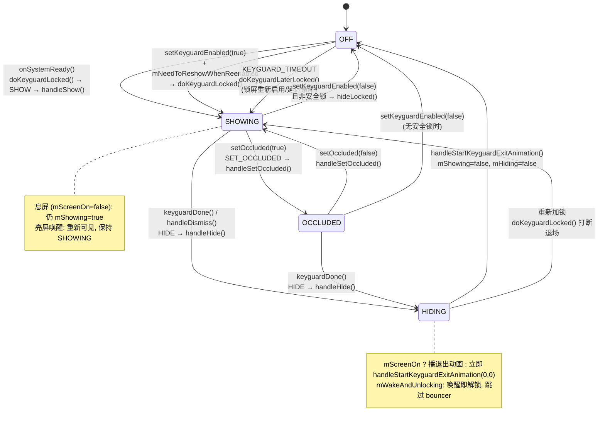

# Android 10 (Q / API 29) — KeyguardViewMediator 状态机

> 源码基于 AOSP 10（对应工程仓库 https://cnb.cool/flybigpig/aosp10.git）

## 1. 定位

`KeyguardViewMediator` 是锁屏的**策略大脑 + 状态机**，本身不画 UI。它决定"该不该锁、锁了没、什么时候解、被谁遮挡"，真正把 View 画出来的是 `StatusBarKeyguardViewManager` / `KeyguardBouncer`。

源码位置：

```
frameworks/base/packages/SystemUI/src/com/android/systemui/keyguard/KeyguardViewMediator.java
```

配套（真正画 UI 的）：

```
frameworks/base/packages/SystemUI/src/com/android/systemui/statusbar/phone/StatusBarKeyguardViewManager.java
frameworks/base/packages/SystemUI/src/com/android/systemui/keyguard/KeyguardBouncer.java
frameworks/base/packages/SystemUI/src/com/android/systemui/keyguard/KeyguardUpdateMonitor.java
```

---

## 2. 构成"状态"的核心变量

Android 10 的 `KeyguardViewMediator` 用一组 boolean 字段拼出当前状态：

| 字段 | 含义 |
|------|------|
| `mShowing` | 锁屏是否处于"已展示"态（无论是否被遮挡） |
| `mHiding` | 是否正处在"退场动画/隐藏流程"中（瞬态） |
| `mOccluded` | 是否被全屏窗口遮挡（相机、来电、Face 解锁界面等） |
| `mScreenOn` | 屏幕是否亮着 |
| `mExternallyEnabled` | 是否允许锁屏（DevicePolicy / `setKeyguardEnabled`） |
| `mNeedToReshowWhenReenabled` | 被禁用期间若曾显示，恢复后要重新显示 |
| `mWakeAndUnlocking` | 唤醒即解锁（指纹/Trust 解锁瞬间态） |
| `mKeyguardDonePending` | 等待 `KEYGUARD_DONE_DRAWING` 完成 |
| `mDeviceInteractive` | 设备是否可交互（屏亮且未深睡） |

由此推导出三个"对外可见态"：

- **OFF** = `!mShowing`
- **SHOWING** = `mShowing && !mOccluded`
- **OCCLUDED** = `mShowing && mOccluded`

`mScreenOn` / `mDeviceInteractive` 是**正交维度**：锁屏在息屏时仍然 `mShowing=true`（只是不渲染），亮屏才可见。

---

## 3. 驱动状态机的 Handler 命令表

所有跨线程的状态变更都走 `mHandler`（Binder 线程不允许直接碰 UI）：

| msg | 处理方法 | 作用 |
|-----|----------|------|
| `SHOW` | `handleShow(Bundle)` | 把 `mShowing` 置 true，调 `StatusBarKeyguardViewManager.show()` |
| `HIDE` | `handleHide()` | 进入退场流程，`mHiding=true` |
| `RESET` | `handleReset()` | 重建锁屏（密码错误、用户切换） |
| `VERIFY_UNLOCK` | `handleVerifyUnlock()` | 无安全锁时直接解锁 |
| `KEYGUARD_DONE` | `handleKeyguardDone()` | 解锁成功 → 触发 HIDE |
| `KEYGUARD_DONE_DRAWING` | `handleKeyguardDoneDrawing()` | 等绘制完成再判定 `mKeyguardDonePending` |
| `SET_OCCLUDED` | `handleSetOccluded(bool, bool)` | 切换遮挡态 |
| `KEYGUARD_TIMEOUT` | `doKeyguardLaterLocked()` | 延时重新显示（锁屏延迟策略） |
| `DISMISS` | `handleDismiss()` | 外部请求解绑 |
| `START_KEYGUARD_EXIT_ANIMATION` | `handleStartKeyguardExitAnimation(start, dur)` | 退场动画结束 → `mShowing=false` |
| `NOTIFY_SCREEN_TURNING_ON` / `NOTIFY_SCREEN_TURNED_ON` / `NOTIFY_FINISHED_GOING_TO_SLEEP` | 对应 `handleNotifyXxx` | 屏幕电源态同步 |

---

## 4. 完整状态转换图



---

## 5. 关键转移的方法级拆解

### 5.1 进入 SHOWING：`doKeyguardLocked()` — 唯一的"该不该锁"裁决点

```java
private void doKeyguardLocked(Bundle options) {
    // 1. 被 DevicePolicy 禁用 → 直接返回
    if (!mExternallyEnabled) return;

    // 2. 已在显示（且非遮挡）→ 去重
    if (mKeyguardBound && mShowing && !mOccluded) return;

    // 3. 无锁屏（无密码 + 用户未关锁屏）且无可锁 profile → 不显示
    if (mLockPatternUtils.isLockScreenDisabled(getCurrentUser())
            && !isProfileWithUnifiedLock()) return;

    // 4. 设置向导未完成 / 用户切换等边界条件
    ...

    showLocked(options);   // → mHandler(SHOW)
}
```

`showLocked()` 只做一件事：向 `mHandler` 投递 `SHOW`。`handleShow()` 里：

```java
mShowing = true;
mStatusBarKeyguardViewManager.show(options);   // 真正的 View 树挂载
updateActivityLockScreenState();               // 通知 WMS/AMS "锁屏在"
playSounds(true);
```

### 5.2 SHOWING ⟷ OCCLUDED：`handleSetOccluded()`

被 `ActivityStack` / `WindowManager` 判定有全屏 Activity 盖住锁屏（来电、相机、Face 解锁）时触发：

```java
private void handleSetOccluded(boolean occluded, boolean animate) {
    if (mOccluded == occluded) return;
    mOccluded = occluded;
    mStatusBarKeyguardViewManager.setOccluded(occluded, animate);
    updateActivityLockScreenState();
    if (occluded && mShowing) resetStateLocked(); // 遮挡解除后再回来要重置
}
```

注意：**OCCLUDED 不改变 `mShowing`**，只改变"是否对用户可见"。所以解锁判断仍以 `mShowing` 为准。

### 5.3 SHOWING/OCCLUDED → HIDING：`handleHide()`

解锁成功的入口是 `keyguardDone()` → 投递 `KEYGUARD_DONE` → `handleKeyguardDone()` → `hideLocked()`（投递 `HIDE`）。`handleHide()`：

```java
private void handleHide() {
    if (mShowing && !mOccluded) {
        mHiding = true;
        if (mScreenOn) {
            // 亮屏: 播退出动画, 动画结束回调
            //   handleStartKeyguardExitAnimation()
        } else {
            // 息屏: 直接结束, 不播动画
            handleStartKeyguardExitAnimation(0, 0);
        }
    }
}
```

`handleStartKeyguardExitAnimation()` 是终态转移：

```java
mStatusBarKeyguardViewManager.finishKeyguardExitAnimation(startTime, fadeoutDuration);
mHiding = false;
mShowing = false;          // ← OFF
updateActivityLockScreenState();
playSounds(false);
```

### 5.4 息屏不解锁

`onScreenTurnedOff()` / `onScreenTurnedOn()` 只更新 `mScreenOn`，**不碰 `mShowing`**。锁屏在息屏期间保持 `mShowing=true`，亮屏后重新可见 —— 这就是"按下电源键再亮屏，锁屏还在"的机理。

### 5.5 唤醒即解锁：`mWakeAndUnlocking`

指纹/Trust 解锁时，`StatusBarKeyguardViewManager` 在亮屏动画中设置 `mWakeAndUnlocking=true`，让 `handleHide()` 跳过 bouncer 直接走 `handleStartKeyguardExitAnimation()`，实现"亮屏即进桌面"。

---

## 6. 整机视角的状态归属

```
system_server (PowerManagerService / ActivityManagerService / WindowManagerService)
      │  Binder 回调 + 广播
      ▼
KeyguardViewMediator  ◄── 状态机大脑 (本文主角)
      │  setOccluded / show / hide / reset
      ▼
StatusBarKeyguardViewManager  ──► KeyguardBouncer (PIN/密码/图案)
      │                           └─► KeyguardHostView
      ▼
NotificationPanelView / StatusBarWindow (锁屏上的通知+快捷)
```

---

## 7. 调试

```bash
adb shell dumpsys activity service com.android.systemui/.SystemUIService
# 或过滤 logcat:
adb logcat -b all -s KeyguardViewMediator:I StatusBarKeyguardViewManager:I
```

关键日志打印点：`handleShow` / `handleHide` / `doKeyguardLocked` 里都有 `Log.d(TAG, "...")`，默认 TAG=`KeyguardViewMediator`。

---

## 8. 可继续深挖的方向

- **解锁全链路**：从指纹回调 `KeyguardUpdateMonitor` → `keyguardDone` → bouncer 消失动画时序
- **doKeyguardLocked 的边界条件**：profile 锁、多用户、设置向导、`isLockScreenDisabled` 的精确判定
- **遮挡链路**：`setOccluded` 在 WMS / ActivityStack 里是怎么被触发并通知回来的
