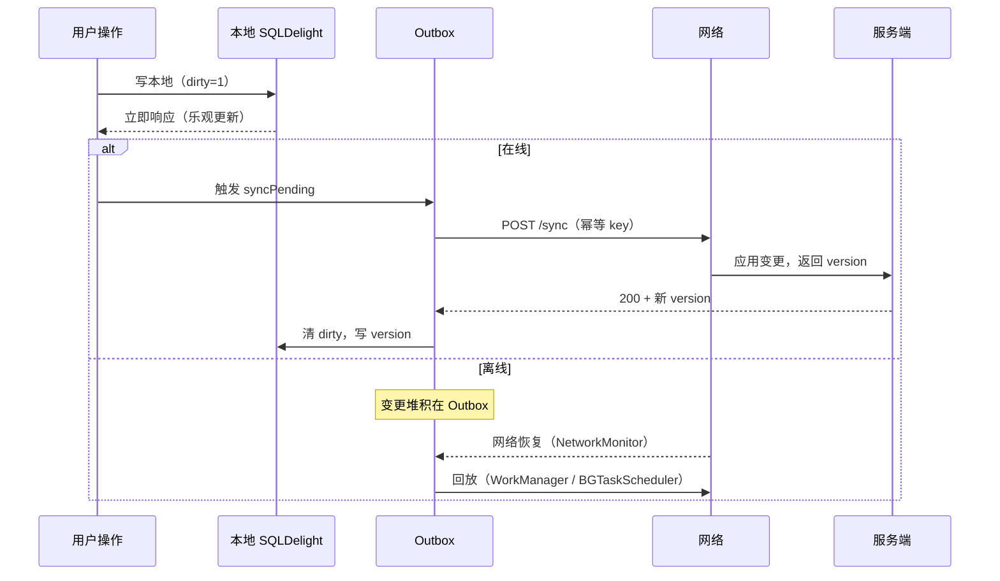
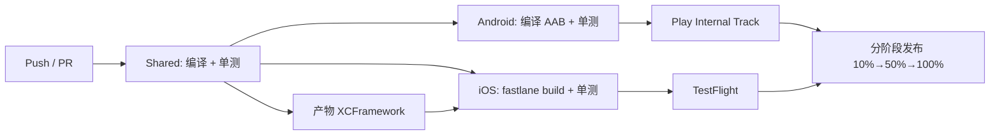

# 跨平台移动应用方案设计（原生双端 + KMM 共享逻辑）

> 平台策略：业务逻辑跨平台共享（Kotlin Multiplatform Mobile），UI 各自原生（iOS SwiftUI / Android Jetpack Compose）
> 应用类型：工具 / 效率类，离线优先（Offline-First）
> 数据后端：自建 REST（复杂查询场景可叠加 GraphQL）
> 文档版本：v1.0 ｜ 设计日期：2026-08-10

---

## 1. 概述与目标

### 1.1 为什么选「原生双端 + 共享逻辑」

| 维度 | 原生双端 + KMM | Flutter | React Native |
|------|----------------|---------|--------------|
| UI 原生感 | ⭐⭐⭐⭐⭐ 各平台完全原生 | ⭐⭐⭐⭐ 自绘引擎，接近原生 | ⭐⭐⭐ 桥接到原生组件 |
| 平台特性接入 | ⭐⭐⭐⭐⭐ 零妥协 | ⭐⭐⭐ 需插件/Channel | ⭐⭐⭐ 需原生模块 |
| 逻辑复用率 | ~60–80%（业务层） | ~90% | ~85% |
| 包体积 | 最小（无运行时） | 中（Skia 引擎） | 中（JS 运行时） |
| 团队要求 | 需 Kotlin + 双端原生 | 单一 Dart | JS/TS + 双端原生 |
| 车载/工控延展 | ⭐⭐⭐⭐⭐ 适配 AAOS 最顺 | ⭐⭐ 车载支持弱 | ⭐⭐ |

**结论**：工具/效率类应用高度依赖系统级能力（Widget、Shortcuts、Spotlight、后台同步、生物识别），且你本身具备 Android Framework 背景，KMM 能让你复用 Kotlin 技术栈把 Binder/系统服务经验延伸到客户端共享层，因此「原生双端 + KMM」是最优解。

### 1.2 关键目标

- **离线优先**：无网可完整使用核心功能，联网后静默同步。
- **冷启动 < 2s**（中端机），核心内存 < 100MB，崩溃率 < 0.5%。
- **一套业务规则**（校验、同步冲突、计费逻辑）两端完全一致，杜绝「iOS 和 Android 行为不一致」类缺陷。
- **安全合规**：数据静态加密 + 传输加密 + 最小权限。

---

## 2. 技术栈选型（含版本基线）

> 版本以「发布时最新稳定版」为准，下表为 2026 年基线参考。

| 层 | iOS | Android | Shared (KMM) |
|----|-----|---------|--------------|
| 语言 | Swift 5.9+ | Kotlin 2.x | Kotlin 2.x |
| UI | SwiftUI（NavigationStack） | Jetpack Compose 1.7+ | — |
| 异步 | Swift Concurrency / Combine | Coroutines / Flow | Coroutines / Flow |
| 网络 | 调用共享层 | 调用共享层 | **Ktor Client 3.x** |
| 持久化 | 调用共享层 | 调用共享层 | **SQLDelight 2.x** |
| 序列化 | kotlinx.serialization | kotlinx.serialization | kotlinx.serialization |
| DI | SwiftUI Environment / Factory | Hilt | **Koin 4.x**（共享） |
| 安全存储 | Keychain（封装） | EncryptedSharedPreferences | `expect/actual` 抽象 |
| 导航 | SwiftUI NavigationStack | Compose Navigation 2.x | — |
| 日志/监控 | OSLog + 后端上报 | Logcat + 后端上报 | kermit / 自建 |

**KMM 生产就绪说明**：Kotlin Multiplatform 自 Kotlin 1.9.20 进入 **Stable**，Kotlin 2.0 起默认开启，XCFramework 产物成熟，可用于生产。

---

## 3. 分层架构

```mermaid
graph TD
    subgraph iOS["iOS App (SwiftUI)"]
        IV[Views / ViewModels<br/>NavigationStack]
        II[平台适配: Keychain / UNUserNotification<br/>WidgetKit / App Intents]
    end
    subgraph AND["Android App (Jetpack Compose)"]
        AV[Composable / ViewModel<br/>Compose Navigation]
        AI[平台适配: EncryptedSP / WorkManager<br/>Glance / App Actions]
    end
    subgraph KMM["Shared Module (Kotlin Multiplatform)"]
        direction TB
        DOM[domain<br/>Entity · UseCase · Repository接口]
        DATA[data<br/>Repository实现 · Remote(Ktor) · Local(SQLDelight)]
        CORE[core<br/>Koin DI · Dispatcher · 错误处理 · expect/actual]
    end

    IV --> II
    AV --> AI
    II --> CORE
    AI --> CORE
    IV --> DOM
    AV --> DOM
    DOM --> DATA
    DATA --> CORE
```

**职责边界**：
- `domain`：纯 Kotlin，无平台依赖。实体、用例（UseCase）、仓库接口。
- `data`：仓库实现、远程数据源（Ktor）、本地数据源（SQLDelight）、DTO↔Entity 映射。
- `core`：跨平台基础设施，`expect/actual` 落地平台差异（安全存储、网络引擎、时间、日志、网络监听）。
- **Presentation 完全留在原生层**，SwiftUI / Compose 各自负责，保证原生体验。

---

## 4. 仓库目录结构

```
root/
├── shared/                      # KMM 共享模块（Kotlin）
│   ├── build.gradle.kts
│   └── src/
│       ├── commonMain/          # 跨平台代码
│       │   └── kotlin/com/app/core|domain|data/...
│       ├── androidMain/         # Android 实际实现 (expect/actual)
│       ├── iosMain/             # iOS 实际实现 (expect/actual)
│       └── iosTest/ androidUnitTest/  # 共享层单测
├── androidApp/                  # Android 应用 (Compose)
│   ├── src/main/
│   │   ├── java/com/app/ui|di|data/...
│   │   └── res/...
│   └── build.gradle.kts
├── iosApp/                      # iOS 应用 (SwiftUI)
│   ├── iOSApp.xcodeproj
│   └── iOSApp/
│       ├── Features/...         # SwiftUI Views + ViewModels
│       ├── Platform/...         # Keychain/Notification/Widget 封装
│       └── SharedBridge/        # 调用 KMM 的桥接层
├── server/                      # 自建后端 (可复用 Kotlin)
│   └── (Ktor / Spring Boot) api/v1
└── .github/workflows/           # CI/CD
```

---

## 5. 共享层（KMM）关键设计

### 5.1 网络层（Ktor，expect/actual 引擎）

```kotlin
// commonMain
expect fun httpClient(config: HttpClientConfig<*>.() -> Unit): HttpClient

// androidMain
actual fun httpClient(config: HttpClientConfig<*>.() -> Unit) =
    HttpClient(OkHttp) { config() }

// iosMain
actual fun httpClient(config: HttpClientConfig<*>.() -> Unit) =
    HttpClient(Darwin) { config() }

// 统一封装：Bearer 注入、超时、重试、错误解析
fun createApiClient(baseUrl: String, tokenProvider: TokenProvider) = httpClient {
    install(ContentNegotiation) { json(Json { ignoreUnknownKeys = true }) }
    install(Auth) { bearer { loadTokens { tokenProvider.get() } } }
    install(HttpTimeout) { requestTimeoutMillis = 15_000 }
    install(Logging) { level = LogLevel.BODY }
}
```

### 5.2 持久化（SQLDelight，离线优先的数据源）

```kotlin
// commonMain .sq 文件
CREATE TABLE Task (
    id TEXT NOT NULL PRIMARY KEY,
    title TEXT NOT NULL,
    done INTEGER NOT NULL,
    updated_at INTEGER NOT NULL,
    dirty INTEGER NOT NULL DEFAULT 1   -- 标记待同步（Outbox）
);

getPendingSync: SELECT * FROM Task WHERE dirty = 1;
upsert: INSERT OR REPLACE INTO Task VALUES ?;
```

SQLDelight 生成跨平台 DAO，Android/iOS 共用同一套查询逻辑，避免两端写两套 SQL。

### 5.3 仓库模式（Offline-First 核心）

```kotlin
class TaskRepositoryImpl(
    private val remote: TaskRemoteDataSource,
    private val local: TaskLocalDataSource,
    private val network: NetworkMonitor
) {
    fun observeTasks(): Flow<List<Task>> = local.observeAll()   // UI 永远读本地

    suspend fun refresh() {
        if (!network.isOnline()) return
        runCatching { remote.fetchAll() }
            .onSuccess { local.upsertAll(it) }
    }

    suspend fun toggle(id: String) {
        local.toggle(id)                 // 先落本地，保证响应
        local.markDirty(id)
        syncPending()                    // 联网则立即回放
    }

    private suspend fun syncPending() { /* Outbox 回放，见 §8 */ }
}
```

### 5.4 依赖注入（Koin，共享层）

```kotlin
// commonMain
val sharedModule = module {
    single { createApiClient(get(), get()) }
    single<TaskRepository> { TaskRepositoryImpl(get(), get(), get()) }
    factory { GetTasksUseCase(get()) }
}
// iOS/Android 各自 loadKoinModules(sharedModule + platformModule)
```

### 5.5 错误处理（封闭类跨平台统一）

```kotlin
sealed interface Result<out T> {
    data class Success<T>(val data: T) : Result<T>
    data class Failure(val error: AppError) : Result<Nothing>
}
sealed interface AppError { data class Network(val t: Throwable) : AppError
    data class Auth(val code: Int) : AppError
    data object Conflict : AppError }
```

---

## 6. 平台层设计

### 6.1 Android（Jetpack Compose）

```kotlin
@HiltViewModel
class TaskListViewModel @Inject constructor(
    private val getTasks: GetTasksUseCase,
    private val toggle: ToggleTaskUseCase
) : ViewModel() {
    val uiState: StateFlow<TaskUiState> = getTasks()
        .map { TaskUiState(tasks = it) }
        .stateIn(viewModelScope, SharingStarted.WhileSubscribed(5_000), TaskUiState())

    fun onToggle(id: String) = viewModelScope.launch { toggle(id) }
}
```
- `collectAsStateWithLifecycle()` 安全收集 Flow。
- Hilt 提供 Android 专属依赖（ContentResolver、Context）。
- `WorkManager` 负责周期性/约束性后台同步。

### 6.2 iOS（SwiftUI）

KMM 的 `suspend` 函数在 Swift 侧自动暴露为 `async` 函数，可直接 `await`：

```swift
@MainActor
final class TaskListViewModel: ObservableObject {
    @Published private(set) var tasks: [Task] = []
    private let getTasks: GetTasksUseCase

    func load() async {
        let result = await getTasks.invoke()   // KMM suspend -> Swift async
        if case let .success(items) = result { tasks = items }
    }
    func toggle(_ id: String) async { _ = await toggleUseCase.invoke(id: id) }
}
```
- `NavigationStack` + `navigationDestination` 管理路由。
- `Task { await vm.load() }` 在 `.task` 修饰符中触发。
- iOS 消费共享层以 **XCFramework**（fat framework）形式集成，由 Gradle `assembleXCFramework` 产出。

---

## 7. 数据层与后端契约

### 7.1 REST 资源设计（版本化 `/api/v1`）

| 资源 | 方法 | 说明 |
|------|------|------|
| `/tasks` | GET | 分页拉取（cursor） |
| `/tasks` | POST | 新建（返回服务端权威 id + version） |
| `/tasks/{id}` | PATCH | 局部更新（含 `base_version` 用于冲突检测） |
| `/tasks/{id}` | DELETE | 软删除（标记 `deleted_at`） |
| `/sync` | POST | 批量提交 Outbox（幂等 key） |
| `/auth/token` | POST | 登录换 JWT |
| `/auth/refresh` | POST | 刷新令牌 |

- **统一错误包络**：`{ "code": 0, "message": "", "trace_id": "" }`。
- **分页**：cursor-based（`?after=<id>&limit=50`），避免 offset 深翻页。

### 7.2 鉴权

- **JWT Bearer** + **Refresh Token 轮换**（刷新即作废旧 token，防重放）。
- 移动端安全存储：iOS `Keychain`（kSecAttrAccessibleAfterFirstUnlock），Android `EncryptedSharedPreferences`（AES-256-GCM，密钥存 Android Keystore）。
- 共享层用 `expect/actual TokenProvider` 抽象，业务代码无感知。

### 7.3 GraphQL 选项

若查询维度复杂（如多端筛选、聚合统计），可在共享层引入 **Apollo Kotlin**（官方支持 KMM），与 REST 共存于同一 Ktor 引擎，避免引入第二套网络栈。

---

## 8. 离线优先与同步策略



- **本地即真相（Local-first）**：UI 只从 SQLDelight 读，远端仅作备份与多端一致。
- **Outbox 模式**：所有写操作先入本地队列表，联网后幂等回放，天然支持离线。
- **冲突解决**：
  - 默认 **Last-Write-Wins**（以服务端 `updated_at`/版本号为准）。
  - 关键字段可升级为 **字段级合并** 或 **vector clock**（CRDT-lite）。
- **后台同步**：
  - Android：`WorkManager` `PeriodicWorkRequest` + `NetworkType.CONNECTED` 约束；关键变更额外发 `OneTimeWorkRequest`。
  - iOS：`BGTaskScheduler` 注册 `BGAppRefreshTask` / `BGProcessingTask`，由系统调度。
- **网络监听**：`expect/actual NetworkMonitor`，Android 用 `ConnectivityManager` + `Flow`，iOS 用 `NWPathMonitor`。

---

## 9. 原生能力接入点（工具类重点）

工具/效率类应用的价值大量来自系统级整合，用 `expect/actual` 或各自平台模块落地：

| 能力 | iOS 实现 | Android 实现 | 抽象方式 |
|------|----------|--------------|----------|
| 生物识别 | LocalAuthentication (`LAContext`) | BiometricPrompt | `expect/actual BiometricAuth` |
| 本地通知 | UNUserNotificationCenter | WorkManager + NotificationManager | 平台模块 |
| 小组件 | WidgetKit（SwiftUI TimelineProvider） | Glance（Compose UI） | 各自实现 |
| 快捷指令 | App Intents + Siri Shortcuts | App Actions + Shortcuts / Dynamic Shortcuts | 各自实现 |
| 搜索索引 | Core Spotlight | androidx.appsearch / 索引 | 平台模块 |
| 文件/分享 | UIDocumentPicker / UIActivityViewController | Storage Access Framework / Sharesheet | 平台模块 |
| 深色模式 | `@Environment(\.colorScheme)` | `isSystemInDarkTheme()` | 各自读系统 |

> 注：Widget / Shortcuts / Spotlight 等**必须原生实现**，无法跨平台共享——这正是选「原生双端」而非 Flutter/RN 的回报点。

---

## 10. 性能目标（双端对齐）

| 指标 | 目标 | 手段 |
|------|------|------|
| 冷启动 | iOS < 2s / Android < 1.5s | 延迟初始化（AppStartup）、共享层懒加载 Koin |
| 内存 | 核心 < 100MB | SQLDelight 分页、图片解码限流 |
| 帧率 | 稳定 60fps | Compose `derivedStateOf`、SwiftUI 细粒度刷新 |
| 崩溃率 | < 0.5%（崩溃free > 99.5%） | 共享层 80% 单测覆盖、错误封闭类兜底 |
| 包体积 | Android AAB < 12MB / iOS < 15MB | R8 全量混淆、XCFramework 裁剪 |

---

## 11. 安全与隐私

- **传输**：TLS 1.3；敏感接口可选证书锁定（Certificate Pinning）。
- **静态存储**：Keychain / EncryptedSharedPreferences（Android Keystore 托管密钥）。
- **混淆**：Android R8（含资源混淆）；iOS 启用 Swift 编译优化 + 符号剥离。
- **合规清单**：
  - iOS：`PrivacyInfo.xcprivacy`（苹果隐私清单）+ 沙盒最小化。
  - Android：Play Console **Data Safety** 表单 + 运行时权限最小化（`POST_NOTIFICATIONS` 等按需申请）。

---

## 12. 测试策略

| 层 | 框架 | 覆盖范围 |
|----|------|----------|
| Shared | `kotlin.test` + Turbine（Flow） | UseCase / Repository / 冲突合并逻辑，目标 80% |
| Android | JUnit5 + Compose UI Test + Hilt | VM 行为、Composable 渲染、导航 |
| iOS | XCTest + Swift Concurrency | VM 行为、async 桥接、Widget 快照 |
| E2E | Maestro（跨平台脚本） | 核心用户路径（新建→离线→同步） |

**关键**：业务逻辑主要在 Shared 层测，两端只需测「桥接是否正确」，大幅降低双端重复测试成本。

---

## 13. CI/CD 与发布



- **仓库**：Monorepo（shared + 双端 + server）。
- **iOS 集成共享层**：CI 先 `./gradlew assembleXCFramework`，产物注入 Xcode 工程（CocoaPods `pod gen` 或 SPM 二进制）。
- **Android**：直接 `implementation(project(":shared"))`，Gradle 原生多平台。
- **签名**：密钥/证书存 CI Secret（或密钥管理系统），不进仓库。
- **发布**：Android 走 Play Internal Track → 分阶段；iOS 走 TestFlight → App Store 分阶段发布。

---

## 14. 里程碑路线图

| 阶段 | 周期 | 交付 |
|------|------|------|
| P0 脚手架 | 1 周 | KMM 三源集 + 双端空壳 + CI 跑通 XCFramework |
| P1 数据底座 | 2 周 | Ktor + SQLDelight + Koin + Auth（登录/刷新） |
| P2 离线同步 | 2 周 | Outbox + 冲突合并 + 后台同步（WorkManager/BGTask） |
| P3 核心功能 | 3 周 | 工具类主流程（增删改查 + 离线 + 同步完整跑通） |
| P4 系统整合 | 2 周 | Widget / 生物识别 / 通知 / Shortcuts |
| P5 打磨上线 | 2 周 | 性能调优、监控、分阶段发布 |

---

## 15. 风险与权衡

1. **团队技能**：iOS 工程师需理解 KMM 生成的 Swift API（异步桥接、可选类型映射）；建议初期结对。
2. **跨层调试**：崩溃栈跨越 Kotlin/Native 与 Swift，需配置 `.dSYM` + Kotlin/Native 符号。
3. **原生功能双份实现**：Widget/Shortcuts 等仍要写两套，KMM 只省业务层。
4. **生态规模**：KMM 第三方库少于 Flutter/RN，冷门 SDK 可能需自写 `expect/actual` 封装。
5. **车载延展（AAOS）**：若后续上车，Android 侧可直接复用 shared + Compose for Cars（Horologist），iOS 侧无需改动——这是本方案的战略红利。

---

## 16. 一键决策清单（供评审）

- [x] 技术栈：原生双端 + KMM 共享逻辑
- [x] UI：SwiftUI / Jetpack Compose（全原生）
- [x] 网络：Ktor（expect/actual 引擎）
- [x] 存储：SQLDelight（离线优先）
- [x] 同步：Outbox + 后台回放
- [x] 鉴权：JWT + 安全存储（Keychain / EncryptedSP）
- [x] 后端：自建 REST `/api/v1`（复杂查询叠加 Apollo GraphQL）
- [x] 原生整合：Widget / 生物识别 / 通知 / Shortcuts / Spotlight
- [x] 交付物：本设计文档（下一步可按 §14 生成可运行脚手架）

---

**下一步建议**：确认本方案后，我可基于 §4 目录结构与 §14 里程碑，直接生成**可编译运行的起步脚手架**（含 shared 模块、双端空壳、CI 工作流），把设计落地为代码。需要的话回复「生成脚手架」即可。
