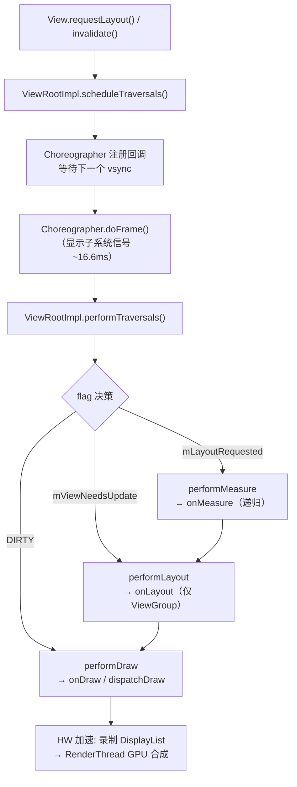
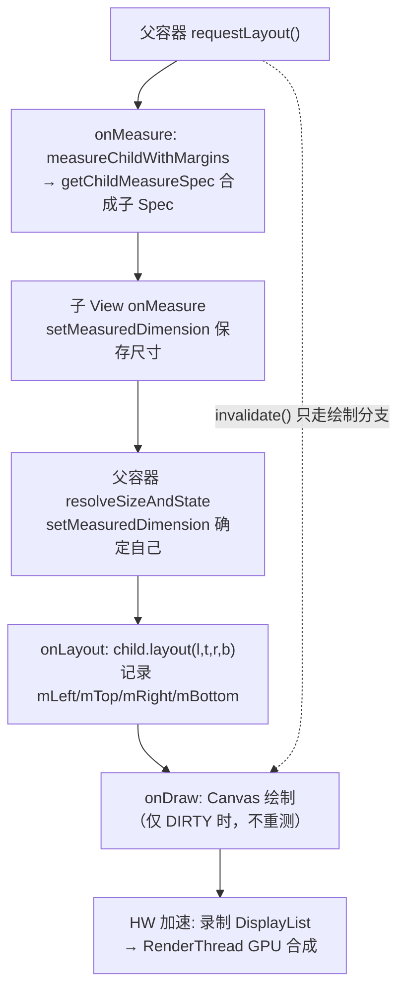

# ERP-PDA 自定义 View 体系与绘制三部曲（优化版）

> 整理时间：2026-08-10（优化）
> 适用范围：widget 模块 + app 模块自定义 View
> 面向对象：framework / 系统开发背景读者，侧重「调用链路 + 底层驱动」双视角

---

## 核心结论（先看这里）

1. **三部曲本质**：`onMeasure` 定大小 → `onLayout` 定位置 → `onDraw` 画内容。**只有 ViewGroup 需要 `onLayout`**；普通 View（如 `SwitchButton extends View`）无子 View，只做首尾两步。
2. **驱动入口不是 View 自己**：`requestLayout()/invalidate()` 最终都汇聚到 `ViewRootImpl.performTraversals()`，由 `Choreographer` 在下一个 **vsync** 信号触发，全程受 16.6ms（60Hz）帧预算约束。
3. **MeasureSpec 是 measure 的核心契约**：mode（2bit）+ size（30bit）打包成 int；子 View 的 Spec 由「父 Spec + 自身 LayoutParams」经 `getChildMeasureSpec()` 推导，不是子 View 自己说了算。
4. **最易踩的坑**：`wrap_content` 不处理（等同 match_parent）、`onMeasure` 漏调 `setMeasuredDimension`（必崩）、`onDraw` 内 new 对象（GC 抖动）、自定义 ViewGroup 想自绘却漏 `setWillNotDraw(false)`。
5. **性能红线**：`onDraw` 零对象分配；`requestLayout` 代价远大于 `invalidate`，只改外观就别触发 measure/layout。

---

## 一、项目自定义 View 架构详解

### 1.1 模块结构

```
widget/src/main/java/com/she/widget/
├── view/          ← 继承 View / EditText / ImageView 的自定义控件
│   ├── AnimImageView.java        自动播放帧动画的 ImageView
│   ├── ClearEditText.java        带清除按钮的输入框（继承 RegexEditText）
│   ├── CountdownView.java        验证码倒计时 TextView
│   ├── CustomToast.java          自定义 Toast
│   ├── FlowLayout.java           流式布局 ViewGroup
│   ├── FlowLayoutAdapter.java    FlowLayout 的适配器
│   ├── PasswordEditText.java     密码输入框
│   ├── ProgressView.java         圆形进度条 View
│   ├── RegexEditText.java        正则校验 EditText（基类）
│   ├── ScaleImageView.java       按比例缩放 ImageView
│   ├── SmartTextView.java        智能 TextView
│   ├── SmoothCheckBox.java       带动画的 CheckBox
│   ├── SwitchButton.java         iOS 风格开关按钮
│   └── ZoomImageView.java        手势缩放 ImageView
│
├── layout/        ← 继承 ViewGroup 的自定义容器
│   ├── CustomViewStub.java       增强 ViewStub
│   ├── HintLayout.java           状态提示布局（继承 SimpleLayout）
│   ├── NoScrollViewPager.java    禁止滑动的 ViewPager
│   ├── RatioFrameLayout.java     宽高比 FrameLayout
│   ├── SettingBar.java           设置条组合控件
│   └── SimpleLayout.java         自定义组合控件基类
```

自定义属性声明统一在 `widget/src/main/res/values/attrs.xml` 中，共 8 组 `declare-styleable`。

### 1.2 四种设计模式

#### 模式1：直接继承 View，重写 onDraw（纯绘制型）

**代表：SwitchButton、ProgressView、SmoothCheckBox**

特点：
- 继承 `View`，完全自绘
- 四个构造器链式调用 → 统一 `initialize()` 方法
- 通过 `TypedArray` 读取自定义属性
- 重写 `onMeasure()` 处理 wrap_content，`onDraw()` 用 Canvas + Paint 绘制
- `onTouchEvent()` 处理交互
- `Parcelable` / `SavedState` 保存状态防旋转丢失

```java
// 构造器链 → initialize（所有构造器最终统一调此方法）
public SwitchButton(Context context, AttributeSet attrs) {
    super(context, attrs);
    initialize(attrs);
}

// 读取自定义属性（注意 obtainStyledAttributes / recycle 配对）
private void initialize(AttributeSet attrs) {
    TypedArray array = getContext().obtainStyledAttributes(attrs, R.styleable.SwitchButton);
    mChecked = array.getBoolean(R.styleable.SwitchButton_android_checked, mChecked);
    array.recycle();  // 必须回收，否则 TypedArray 池泄漏
}

// 状态保存（View 默认不保存自定义状态，必须自己实现）
static class SavedState extends BaseSavedState {
    boolean checked;
    SavedState(Parcelable superState) { super(superState); }
    @Override public void writeToParcel(Parcel out, int flags) {
        super.writeToParcel(out, flags);
        out.writeInt(checked ? 1 : 0);
    }
    // CREATOR 省略…
}
```

#### 模式2：继承 AppCompat 控件，功能增强（功能增强型）

**代表：RegexEditText → ClearEditText → PasswordEditText（三层继承链）**

```
AppCompatEditText
  └── RegexEditText      （正则校验 + InputFilter）
        └── ClearEditText  （清除按钮 + 触摸监听）
              └── PasswordEditText  （密码可见切换）
```

特点：
- 继承 `AppCompatEditText`，保留原生行为
- 通过实现 `InputFilter` 接口做正则校验
- 子类 `super.initialize()` 调用父类初始化（继承链关键：先 super 再扩展）
- 预定义常用正则常量：`REGEX_MOBILE`、`REGEX_CHINESE`、`REGEX_ENGLISH` 等

```java
// RegexEditText 预定义正则
public static final String REGEX_MOBILE  = "[1]\\d{0,10}";
public static final String REGEX_CHINESE = "[\\u4e00-\\u9fa5]*";
public static final String REGEX_NONNULL  = "\\S+";

// ClearEditText 在父类基础上增强：必须先 super，再扩展
@Override
protected void initialize(Context context, AttributeSet attrs) {
    super.initialize(context, attrs);  // 先调父类，复用正则/InputFilter 能力
    mClearDrawable = DrawableCompat.wrap(...);
    setCompoundDrawables(..., visible ? mClearDrawable : null, ...);
}
```

#### 模式3：继承 ViewGroup，组合布局（组合控件型）

**代表：SettingBar、HintLayout**

特点：
- 继承 `FrameLayout` 或 `SimpleLayout`（自定义基类）
- 在构造器中 `inflate` 加载子布局
- 通过 `TypedArray` 读取大量 XML 属性
- **Builder 链式 API**：所有 setter 返回 `this`
- 暴露内部子 View 的 getter

```java
// SettingBar：链式 setter（返回 this 支持流式调用）
public SettingBar setLeftText(CharSequence text) {
    mLeftView.setText(text);
    return this;
}

// 使用方式
settingBar.setLeftText("标题")
         .setRightText("内容")
         .setLineVisible(true);
```

```java
// HintLayout：懒加载模式（首帧不 inflate，show() 才真正加载，省启动开销）
public void show() {
    if (mMainLayout == null) {
        initLayout();  // 第一次 show 时才 inflate
    }
    mMainLayout.setVisibility(VISIBLE);
}
```

#### 模式4：继承容器，重写测量/事件（行为覆盖型）

**代表：NoScrollViewPager、RatioFrameLayout**

特点：
- 不自绘，只覆盖父类行为
- `NoScrollViewPager`：拦截 `onInterceptTouchEvent` / `onTouchEvent` 返回 false，禁用滑动；自定义 `setCurrentItem` 平滑滚动逻辑
- `RatioFrameLayout`：在 `onMeasure` 中根据宽高比重算 `MeasureSpec`（见 §2.1 案例3，已修正取值逻辑）

```java
// RatioFrameLayout：按比例重算尺寸（优化版，已补齐 getMode/getSize）
@Override
protected void onMeasure(int widthMeasureSpec, int heightMeasureSpec) {
    int widthSpecMode  = MeasureSpec.getMode(widthMeasureSpec);
    int widthSpecSize  = MeasureSpec.getSize(widthMeasureSpec);
    int heightSpecMode = MeasureSpec.getMode(heightMeasureSpec);
    int heightSpecSize = MeasureSpec.getSize(heightMeasureSpec);

    if (mSizeRatio != 0) {
        if (widthSpecMode == EXACTLY && heightSpecMode != EXACTLY) {
            // 宽度确定、高度 wrap → 高度 = 宽度 / 比例（+0.5f 四舍五入避免亚像素截断）
            int height = (int) (widthSpecSize / mSizeRatio + 0.5f);
            heightMeasureSpec = MeasureSpec.makeMeasureSpec(height, EXACTLY);
        } else if (heightSpecMode == EXACTLY && widthSpecMode != EXACTLY) {
            int width = (int) (heightSpecSize * mSizeRatio + 0.5f);
            widthMeasureSpec = MeasureSpec.makeMeasureSpec(width, EXACTLY);
        }
    }
    super.onMeasure(widthMeasureSpec, heightMeasureSpec);
}
```

### 1.3 自定义属性体系

所有自定义属性在 `widget/src/main/res/values/attrs.xml` 统一声明，XML 中使用需加命名空间：

```xml
<com.she.widget.layout.SettingBar
    xmlns:app="http://schemas.android.com/apk/res-auto"
    android:layout_width="match_parent"
    android:layout_height="wrap_content"
    app:bar_leftText="设置项"
    app:bar_rightText="已开启"
    app:bar_rightIcon="@drawable/icon_arrow_right"
    app:bar_lineVisible="true" />
```

| styleable | 对应控件 | 核心属性 |
|-----------|---------|---------|
| `SwitchButton` | 开关按钮 | `android:checked`、`android:enabled` |
| `RegexEditText` | 正则输入框 | `inputRegex`、`regexType`(枚举) |
| `SettingBar` | 设置条 | `bar_leftText`、`bar_rightText`、`bar_leftIcon`... |
| `CustomViewStub` | 增强 ViewStub | `android:layout` |
| `ScaleImageView` | 缩放 ImageView | `scaleRatio` |
| `RatioFrameLayout` | 比例布局 | `sizeRatio` |
| `ProgressView` | 进度条 | `barColor`、`rimColor`、`circleRadius`... |
| `FlowLayout` | 流式布局 | `width_space`、`height_space` |
| `SmoothCheckBox` | 动画 CheckBox | `duration`、`color_tick`、`color_checked`... |

### 1.4 关键设计规范总结

| 规范点 | 做法 |
|--------|------|
| **构造器** | 四个构造器链式调用 → 统一 `initialize()` |
| **自定义属性** | `obtainStyledAttributes` → 读取 → `array.recycle()` 回收（防 TypedArray 池泄漏） |
| **状态保存** | `SavedState extends BaseSavedState` + `onSave/RestoreInstanceState` |
| **内存安全** | `onDetachedFromWindow` 中 `removeCallbacks` / 解除动画监听（见 CountdownView） |
| **链式 API** | 组合控件 setter 返回 `this` |
| **懒加载** | HintLayout 在 `show()` 时才 inflate |
| **事件拦截** | NoScrollViewPager 返回 false 禁用触摸；HintLayout 在显示时拦截 |
| **类标记** | 全部 `final` 修饰（除了 RegexEditText 因被继承不加 final） |

### 1.5 需求 → 改动层级 → 难度 速查表（新增控件前先看）

| 需求 | 改动层级 | 设计模式 | 难度 |
|------|---------|---------|------|
| 加一个带清除按钮的输入框 | 继承 `RegexEditText` | 模式2 功能增强 | ★☆☆ |
| 加一个圆形进度条 | 继承 `View` 重写 `onDraw` | 模式1 纯绘制 | ★★☆ |
| 加一个按比例容器 | 继承 `FrameLayout` 重写 `onMeasure` | 模式4 行为覆盖 | ★☆☆ |
| 加一个流式标签布局 | 继承 `ViewGroup` 重写 `onMeasure`+`onLayout` | 模式3 组合 | ★★★ |
| 加一个带动画开关 | 继承 `View`，`onDraw`+属性动画+`invalidate` 循环 | 模式1 纯绘制 | ★★★ |
| 加一个组合设置条 | `inflate` 子布局 + 链式 setter | 模式3 组合 | ★☆☆ |

> 选型原则：**能继承现成控件增强就别从零自绘**（模式2 性价比最高）；只有真正需要 Canvas 画不规则形状才走模式1；需要自定义子 View 排布才走模式3/4。

---

## 二、绘制三部曲：measure → layout → draw

```
onMeasure(测量) ──> onLayout(布局) ──> onDraw(绘制)
```

### 2.0 驱动链路全景（为什么三部曲会按这个顺序发生）

一次完整渲染**不是 View 自己触发的**，而是从 `ViewRootImpl` 经 `Choreographer` 由 vsync 信号驱动：

```
View.requestLayout() / invalidate()
   │  （经 ViewParent 一路向上传到 ViewRootImpl）
   ▼
ViewRootImpl.scheduleTraversals()
   │  向 Choreographer 注册 mTraversalRunnable
   ▼
Choreographer.doFrame()  ◀── 显示子系统下一个 vsync 信号（~16.6ms @60Hz）
   │
   ▼
ViewRootImpl.doTraversal()
   │
   ▼
ViewRootImpl.performTraversals()   ← 真实决策点
   ├─ performMeasure()  → mView.measure()  → onMeasure()   （按需，受 mLayoutRequested 等 flag 控制）
   ├─ performLayout()   → host.layout()    → onLayout()    （仅 ViewGroup）
   └─ performDraw()     → draw()           → onDraw()/dispatchDraw()
```

**关键认知**：
- `performTraversals()` 会根据内部 flag（`mViewNeedsUpdate`、`mLayoutRequested`、`mFirst` 等）**决定三步是否全跑**。例如 `invalidate()` 只置 `DIRTY` 标志 → 只走 `performDraw`，不重测不重排。
- vsync 之后必须在帧预算内完成全部 measure/layout/draw，否则掉帧（jank）。
- **硬件加速路径**：`performDraw()` 在开启 HW 加速时，绘制指令先录制进 `DisplayList` / `RenderNode`，再交 `ThreadedRenderer` 提交到独立的 **RenderThread** 上 GPU 合成，主线程只负责录制，不负责光栅化。



### 2.1 第一步：onMeasure —— 测量

#### 核心契约：MeasureSpec（测量规格）

```java
// MeasureSpec 由 mode(高2位) + size(低30位) 打包成 32 位 int
int mode = MeasureSpec.getMode(measureSpec);   // 高 2 位：模式
int size = MeasureSpec.getSize(measureSpec);   // 低 30 位：大小
// 反向构造：makeMeasureSpec(size, mode)
```

| 模式 | 含义 | 对应 XML |
|------|------|---------|
| `EXACTLY` | 确定值，父容器强约束 | `100dp`、`match_parent` |
| `AT_MOST` | 最大不能超过 size | `wrap_content` |
| `UNSPECIFIED` | 无限制，想多大就多大 | ScrollView / ListView 内部 |

#### 关键推导：子 View 的 Spec 从何而来

子 View 拿到的 `MeasureSpec` **不是自己定的**，而是 `ViewGroup.getChildMeasureSpec(parentSpec, padding, childLayoutParamSize)` 按以下规则合成（这是 measure 最易错的根因）：

| 父 Spec \ 子 LayoutParams | match_parent | wrap_content | 具体值(dp) |
|---------------------------|--------------|--------------|-----------|
| **EXACTLY**（父定死） | EXACTLY(父size) | AT_MOST(父size) | EXACTLY(子值) |
| **AT_MOST**（父有上限） | AT_MOST(父size) | AT_MOST(父size) | EXACTLY(子值) |
| **UNSPECIFIED**（父无约束） | UNSPECIFIED(0) | UNSPECIFIED(0) | EXACTLY(子值) |

> 推论：`wrap_content` 的 View 在 `EXACTLY` 父里拿到的其实是 `AT_MOST(父size)`——**父已给定上限，子必须把尺寸收敛进这个上限**，否则就溢出。这就是为什么纯绘制型 View 必须自己处理 `wrap_content`（见案例1）。

#### 项目案例 1：View 处理 wrap_content（SwitchButton）

继承 View 时必须自己处理 `wrap_content`，否则默认等同 `match_parent`：

```java
// SwitchButton.java
@Override
protected void onMeasure(int widthMeasureSpec, int heightMeasureSpec) {
    switch (MeasureSpec.getMode(widthMeasureSpec)) {
        case MeasureSpec.AT_MOST:   // wrap_content → 自己给默认尺寸
        case MeasureSpec.UNSPECIFIED:
            int defaultW = (int) TypedValue.applyDimension(
                    TypedValue.COMPLEX_UNIT_DIP, 56, getResources().getDisplayMetrics())
                    + getPaddingLeft() + getPaddingRight();
            widthMeasureSpec = MeasureSpec.makeMeasureSpec(defaultW, MeasureSpec.EXACTLY);
            break;
        case MeasureSpec.EXACTLY:   // 写死尺寸 → 直接使用，不覆盖
            break;
    }
    // 高度 = 宽度 × 宽高比 0.68
    int height = (int) (MeasureSpec.getSize(widthMeasureSpec) * mAspectRatio);
    heightMeasureSpec = MeasureSpec.makeMeasureSpec(height, MeasureSpec.EXACTLY);

    // 最终必须调用此方法保存结果，否则抛 IllegalStateException
    setMeasuredDimension(widthMeasureSpec, heightMeasureSpec);
}
```

> ⚠️ 注意 `wrap_content` 分支里把 `widthMeasureSpec` 重新 `makeMeasureSpec(..., EXACTLY)`，再用它算高度——顺序很重要：必须先把宽度定下来，才能据比例算高度。

#### 项目案例 2：ViewGroup 测量子 View（SimpleLayout）

ViewGroup 的 `onMeasure` 必须**先测子、再测己**：

```java
// SimpleLayout.java — 项目自定义组合控件基类
@Override
protected void onMeasure(int widthMeasureSpec, int heightMeasureSpec) {
    int maxWidth = 0, maxHeight = 0;
    int childState = 0;  // 累积子 View 的 MEASURED_STATE（如 TOO_SMALL）
    // ① 先测量所有子 View
    for (int i = 0; i < getChildCount(); i++) {
        View child = getChildAt(i);
        if (child.getVisibility() != GONE) {   // GONE 不参与测量（与 framework 默认行为不同，见下方注意）
            measureChildWithMargins(child, widthMeasureSpec, 0, heightMeasureSpec, 0);
            MarginLayoutParams params = (MarginLayoutParams) child.getLayoutParams();
            maxWidth  = Math.max(maxWidth,  child.getMeasuredWidth()  + params.leftMargin + params.rightMargin);
            maxHeight = Math.max(maxHeight, child.getMeasuredHeight() + params.topMargin  + params.bottomMargin);
            childState = combineMeasuredStates(childState, child.getMeasuredState());
        }
    }
    maxWidth  += getPaddingLeft() + getPaddingRight();     // ② 加上自己的 padding
    maxHeight += getPaddingTop() + getPaddingBottom();
    // ③ resolveSizeAndState：根据父 Spec 把自己的 size 收敛进约束，并回填 state
    setMeasuredDimension(resolveSizeAndState(maxWidth,  widthMeasureSpec,  childState),
                         resolveSizeAndState(maxHeight, heightMeasureSpec, childState));
}
```

> **与 framework 的差异注意**：标准 `ViewGroup.measureChildWithMargins` 会对 `GONE` 子 View 也做一次 0 尺寸测量（保证其 `getMeasuredWidth()` 为 0 可被后续逻辑读取）。本项目 `SimpleLayout` 选择 `continue` 跳过 GONE，是性能优化，但意味着 GONE 子 View 不会进入 max 计算——符合直觉，但要清楚这是**有意偏离标准行为**，避免后续维护者误以为 GONE 子也会被测量。

> `resolveSizeAndState` 内部逻辑：父 `EXACTLY` 时直接用父 size（忽略子期望）；父 `AT_MOST` 时取 `min(子期望, 父size)` 并可能在超限时置 `MEASURED_STATE_TOO_SMALL`；父 `UNSPECIFIED` 时直接采用子期望。这正是 §2.1「关键推导」的落地实现。

#### 项目案例 3：测量时重算规格（RatioFrameLayout）

见 §1.2 模式4（已修正取值逻辑，补齐 `getMode/getSize` 并加 `+0.5f` 四舍五入）。

### 2.2 第二步：onLayout —— 布局

**只对 ViewGroup 有意义**：把子 View 放到父容器坐标系中的具体位置。`onLayout` 传入的 `l, t, r, b` 是**父容器自身**在父父容器里的边界；子 View 的 `child.layout(l, t, r, b)` 参数是**相对父容器左上角**的坐标（不是屏幕绝对坐标）。

#### 项目案例 1：最简实现（SimpleLayout）

```java
// SimpleLayout.java — 把所有子 View 依次叠放在左上角（覆盖式）
@Override
protected void onLayout(boolean changed, int l, int t, int r, int b) {
    for (int i = 0; i < getChildCount(); i++) {
        View child = getChildAt(i);
        if (child.getVisibility() == GONE) continue;
        MarginLayoutParams params = (MarginLayoutParams) child.getLayoutParams();
        int left   = getPaddingLeft() + params.leftMargin;
        int top    = getPaddingTop()  + params.topMargin;
        int right  = left + child.getMeasuredWidth();   // 用 measuredWidth，不是 getWidth()
        int bottom = top  + child.getMeasuredHeight();
        child.layout(left, top, right, bottom);
        // layout 之后 child 的 mLeft/mTop/mRight/mBottom 才真正确定，getWidth() 才有效
    }
}
```

#### 项目案例 2：换行布局（FlowLayout）

```java
// FlowLayout.java — 外层按行定位，行内由 Line 负责摆放
@Override
protected void onLayout(boolean changed, int l, int t, int r, int b) {
    int x = getPaddingLeft();
    int y = getPaddingTop();
    for (int i = 0; i < mLines.size(); i++) {
        Line line = mLines.get(i);
        line.layout(y, x);            // 行内子 View 由 Line 摆放
        y += line.height;             // 行高累加
        if (i != mLines.size() - 1) y += vertical_space;
    }
}

// Line.layout() — 行内：剩余空间平分给孩子（两端对齐效果），二次测量后再定位
public void layout(int top, int left) {
    int avg = (maxWidth - usedWidth) / views.size();  // 平分剩余空间
    int x = left;
    for (View view : views) {
        // ⚠️ 二次 measure：让每个孩子等宽。代价较高，仅当确需"两端对齐/等宽"时才这么做
        view.measure(MeasureSpec.makeMeasureSpec(view.getMeasuredWidth() + avg, EXACTLY),
                     MeasureSpec.makeMeasureSpec(view.getMeasuredHeight(), EXACTLY));
        int vl = x;
        int vt = top;
        int vr = x + view.getMeasuredWidth();
        int vb = top + view.getMeasuredHeight();
        view.layout(vl, vt, vr, vb);
        x += view.getMeasuredWidth() + space;
    }
}
```

> ⚠️ `Line.layout()` 在 layout 阶段**二次调用 `view.measure()`** 属于非常规操作：正常流程 measure 与 layout 应分离。它带来「等宽对齐」效果，但每次 layout 都重测，频繁 `requestLayout` 时成本高。若 FlowLayout 子项不变，应在 `onLayout` 外缓存测量，避免重复 measure。

### 2.3 第三步：onDraw —— 绘制

**View 的最终呈现**，使用 Canvas + Paint。项目 `SwitchButton.onDraw` 是完整示例：

```java
// SwitchButton.java — onDraw 骨架
@Override
protected void onDraw(Canvas canvas) {
    if (!isCanVisibleDrawing) return;   // 尺寸无效直接跳过，避免基于 0 尺寸绘制

    mPaint.setAntiAlias(true);          // Paint：定义"怎么画"（颜色、粗细、抗锯齿）

    // ① 画背景：Path 定义形状
    mPaint.setStyle(Paint.Style.FILL);
    mPaint.setColor(isOn ? mAccentColor : mOffColor);
    canvas.drawPath(mBackgroundPath, mPaint);

    // ② Canvas 变换：缩放/平移（配合动画）
    canvas.save();                      // 保存画布状态
    canvas.scale(scale, scale, mCenterX + scaleOffset, mCenterY);
    canvas.drawPath(mBackgroundPath, mPaint);
    canvas.restore();                   // 必须 restore，否则变换会污染后续绘制

    // ③ 画滑块 + 描边
    canvas.drawPath(mBarPath, mPaint);                 // 白色滑块（填充）
    mPaint.setStyle(Paint.Style.STROKE);               // 切换为描边
    mPaint.setStrokeWidth(mStrokeWidth * 0.5f);
    canvas.drawPath(mBarPath, mPaint);                 // 滑块描边

    // 动画未结束 → 继续重绘（帧动画驱动）
    if (mAnim1 > 0 || mAnim2 > 0) invalidate();
}
```

#### 绘制注意点 & 底层机制

| 要点 | 说明 |
|------|------|
| `invalidate()` | 主线程重绘，**只走 draw，不重测不重排**（置 `DIRTY` flag）。可频繁调用 |
| `requestLayout()` | 触发 measure + layout + draw 全流程，代价大。**只改尺寸/位置才用它** |
| `postInvalidate()` | 在非 UI 线程触发重绘的安全版本 |
| `setLayerType(LAYER_TYPE_SOFTWARE, null)` | SwitchButton 开启软件层绕过 HW 加速下的阴影/混合渲染问题；代价是放弃 GPU 合成、变慢 |
| `setWillNotDraw(false)` | **ViewGroup 默认 `WILL_NOT_DRAW=true`**，故 `onDraw` 被跳过。自定义 ViewGroup 想自绘内容必须显式置 false（或改在 `dispatchDraw` 里画）。`MyColorCircleView` 即因此需 `setWillNotDraw(false)` |
| `setWillNotDraw` + 背景 | 即便设了背景，默认 ViewGroup 的 `onDraw` 仍可能不执行——背景由 `View.draw()` 单独绘制，自绘逻辑只在 `WILL_NOT_DRAW=false` 时才进入 `onDraw` |
| 动画驱动 | `onDraw` 末尾 `invalidate()` 形成连续帧动画；更优做法是用 `ValueAnimator` + `withLayer()` 让系统统一调度 |

#### 硬件加速视角（framework 深度补充）

- 开启 HW 加速时，`onDraw` 的 Canvas 操作**不直接画像素**，而是录制为 `DisplayList` 指令，存入 `RenderNode`。
- `ThreadedRenderer` 在 `RenderThread`（独立线程）上把 `DisplayList` 交给 `hwui` 做 GPU 光栅化与合成，主线程只负责录制 → 降低主线程卡顿。
- 因此 `LAYER_TYPE_HARDWARE` 会把该 View 的 `DisplayList` 单独成层、离屏渲染后合成，适合「频繁变换但不重绘内容」的动画；`LAYER_TYPE_SOFTWARE` 则强制 CPU 绘制，用于规避特定 GPU 渲染 bug（如复杂阴影、特定 `PorterDuff` 混合）。
- 调试可用开发者选项「GPU 呈现模式分析 / 显示硬件层更新」观察哪层在频繁重建。

### 2.4 三部曲总结

**记忆口诀**：`onMeasure` 定大小，`onLayout` 定位置，`onDraw` 画内容 —— ViewGroup 三件套，普通 View 只做首尾两件。



---

## 三、踩坑避坑清单（高频）

| # | 坑 | 现象 / 报错 | 正确做法 |
|---|----|------------|---------|
| 1 | `wrap_content` 不处理 | 控件占满父容器（等同 match_parent） | 在 `onMeasure` 的 `AT_MOST/UNSPECIFIED` 分支给默认尺寸 |
| 2 | 漏调 `setMeasuredDimension` | `IllegalStateException: onMeasure() did not set the measured dimension` | 任何 `onMeasure` 路径都必须走到 `setMeasuredDimension` |
| 3 | `onDraw` 内 `new Paint/Path/Rect` | 每帧分配 → GC 抖动、掉帧 | Paint/Path/Rect 声明为成员，在 `initialize()` 初始化后复用 |
| 4 | 自定义 ViewGroup 想自绘却漏 `setWillNotDraw(false)` | `onDraw` 不执行，画面空白 | ViewGroup 默认 `WILL_NOT_DRAW=true`，需显式置 false 或改 `dispatchDraw` |
| 5 | `requestLayout` 与 `invalidate` 混用 | 不必要的全量重测/重排，卡顿 | 只改外观用 `invalidate`；改尺寸/位置才 `requestLayout` |
| 6 | 没实现 `SavedState` | 旋转屏幕 / 内存回收后状态丢失 | 实现 `SavedState extends BaseSavedState` + `onSave/RestoreInstanceState` |
| 7 | `onDetachedFromWindow` 没清理 | 内存泄漏 / 回调空指针（如 CountdownView 倒计时） | `removeCallbacks`、解注册动画监听、`clearAnimation` |
| 8 | `onLayout` 用 `getWidth()` 而非 `getMeasuredWidth()` | 拿到的宽度是错误的（layout 前 width 未定） | 摆放子 View 用 `getMeasuredWidth/Height` |
| 9 | `measureChild` 漏算已用宽度（childUsed 传 0） | 子 View 拿到错误的 `AT_MOST` 上限，换行/截断异常 | 传入 `widthUsed/heightUsed` 为已占用空间，约束才准确 |
| 10 | HW 加速下用不支持的 Canvas 操作 | 阴影/圆角/混合渲染异常 | 问题 View 调 `setLayerType(LAYER_TYPE_SOFTWARE, null)` 临时规避，或换受支持的 API |

---

## 四、性能优化建议

1. **onDraw 零分配**：Paint、Path、Rect、Bitmap 等全部成员化复用，绝不进 `onDraw` 创建。
2. **精确控制重绘区域**：仅局部变化时用 `invalidate(Rect)` / `invalidate(left, top, right, bottom)` 限制脏区，减少 GPU 工作量。
3. **动画用硬件层**：纯变换动画（平移/缩放/旋转）配合 `ViewPropertyAnimator.withLayer()` 或 `LAYER_TYPE_HARDWARE`，交给 RenderThread 合成，避免每帧重绘内容。
4. **避免 layout 阶段二次 measure**：如 `FlowLayout.Line.layout()` 的二次 `measure` 仅在子项真正变化时才做，稳定布局应缓存测量值。
5. **减少 requestLayout 深度**：改外观用 `invalidate`；必须 `requestLayout` 时，尽量让变更发生在叶子 View，避免整棵子树重测。
6. **复杂静态内容考虑缓存位图**：不变的形状（如圆角背景）可预渲染到 Bitmap/DisplayList，避免每帧重画 Path。
7. **远离主线程耗时**：`onDraw`/`onMeasure`/`onLayout` 里绝不写文件、网络、重计算。

---

## 五、调试验证步骤

| 目标 | 手段 |
|------|------|
| 看布局边界 / 尺寸 | 开发者选项 → **显示布局边界**；Layout Inspector（Android Studio） |
| 看 View 树与状态 | `adb shell dumpsys activity top` 打印当前 View 层级 |
| 拿测量后真实尺寸 | `view.post(() -> { int w = view.getWidth(); })`（确保 layout 完成） |
| 验证 onMeasure 取值 | 在 `onMeasure` 里 `Log.d` 打印 `getMode/getSize` 与 `measuredWidth/Height` |
| 看绘制耗时 / 掉帧 | 开发者选项 → **GPU 呈现模式分析**（条形图）；Perfetto / Systrace 抓 `measure/layout/draw` 各阶段耗时 |
| 定位过度绘制 | 开发者选项 → **调试 GPU 过度绘制**（颜色越红越严重） |
| 验证硬件层 | 开发者选项 → **显示硬件层更新**（闪烁即该层在重建） |

---

## 六、相关资源文件

| 文件 | 说明 |
|------|------|
| `widget/src/main/java/com/she/widget/view/*.java` | view 包全部自定义控件 |
| `widget/src/main/java/com/she/widget/layout/*.java` | layout 包全部自定义容器 |
| `widget/src/main/res/values/attrs.xml` | 全部自定义属性声明 |
| `widget/src/main/java/com/she/widget/layout/SimpleLayout.java` | 组合控件基类 |
| `app/src/main/java/com/yto/customermanmagererp/weight/preference/MyColorCircleView.kt` | app 模块自定义 View 示例（注意需 `setWillNotDraw(false)`） |
| `app/src/main/java/com/yto/customermanmagererp/ext/CustomViewShow.kt` | 任务操作视图扩展函数 |
