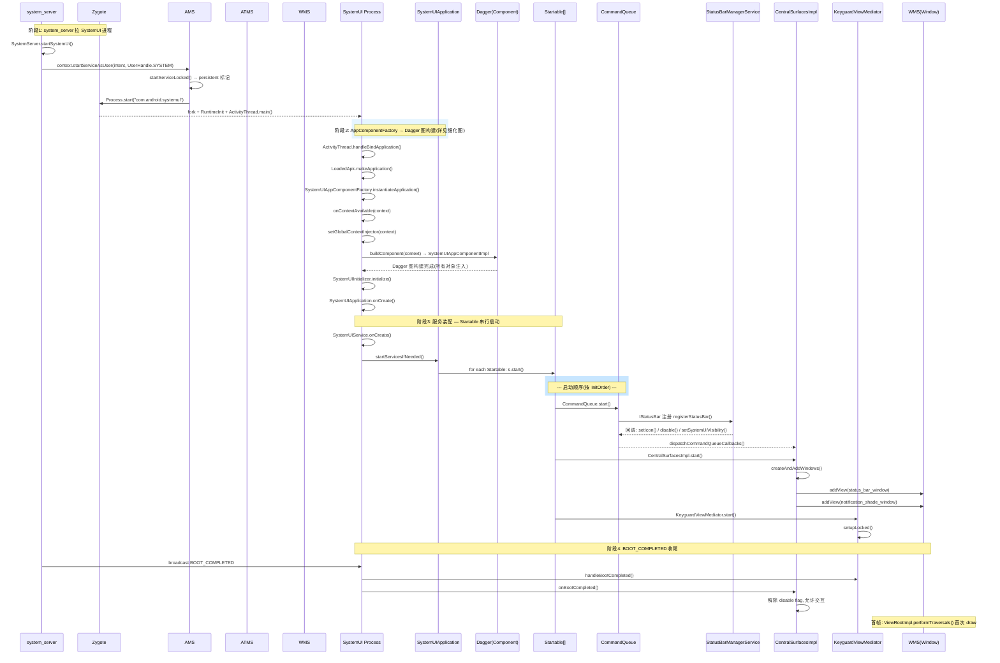

# SystemUI 启动分析(Android 14 / API 34 / UpsideDownCake)

> 目标:梳理 SystemUI 从进程创建到首帧可见的完整调用链,含真实 AOSP 文件路径与关键方法名。

---

## 总体时序图



---

## 分阶段详解

### 阶段1: system_server 拉起 SystemUI 进程

**入口**: `frameworks/base/services/java/com/android/server/SystemServer.java`

```java
static void startSystemUi(Context context, WindowManagerService windowManager) {
    Intent intent = new Intent();
    intent.setComponent(new ComponentName("com.android.systemui",
            "com.android.systemui.SystemUIService"));
    intent.addFlags(Intent.FLAG_DEBUG_TAG);
    context.startServiceAsUser(intent, UserHandle.SYSTEM);
    windowManager.onSystemUiStarted();
}
```

**保活机制**:

- `AndroidManifest.xml` 中 `android:persistent="true"`
- AMS `frameworks/base/services/core/java/com/android/server/am/ActivityManagerService.java` — `addAppLocked()`: 识别 persistent 进程
- `appDiedLocked()` → `handleAppDiedLocked()`: 自动重新拉起, 保证 SystemUI 崩溃后静默重启

### 阶段2: AppComponentFactory → Dagger 图构建

**关键路径**:

```
LoadedApk.makeApplication()
  → AppComponentFactory.instantiateApplication()
    → SystemUIAppComponentFactory.instantiateApplication()
      → onContextAvailable(context)
        → GlobalContextInjector.set(context)
        → buildComponent(context) → SystemUIAppComponentImpl
        → SystemUIInitializer.initialize()
```

**文件**:

- `packages/SystemUI/src/com/android/systemui/SystemUIAppComponentFactory.java`
- `packages/SystemUI/src/com/android/systemui/dagger/SystemUIAppComponent.java` (Dagger 顶层组件)
- `packages/SystemUI/src/com/android/systemui/SystemUIInitializer.java`

**时序要点**:Dagger 图构建在 `SystemUIApplication.onCreate()` 之前, 所以 onCreate 时依赖已经可用。

### 阶段2 细化: SystemUIAppComponentFactory 内部展开

这个时序图把阶段 2 中 `handleBindApplication()` → `onCreate()` 的**内部调用链**横展开, 展示 `SystemUIAppComponentFactory` 里 `onContextAvailable` 的逐行执行。每个箭头对应一行真实代码:

```mermaid
sequenceDiagram
    participant AT as ActivityThread
    participant LP as LoadedApk
    participant IN as Instrumentation
    participant ACF as SystemUIAppComponentFactory
    participant GCI as GlobalContextInjector
    participant DB as DaggerSystemUIAppComponent
    participant UFM as UselessModule
    participant FFM as FactoryModule
    participant INIT as SystemUIInitializer
    participant DEP as Dependency
    participant APP as SystemUIApplication

    Note over AT,APP: 阶段2: AppComponentFactory → Dagger 图构建(内部展开)

    AT->>AT: handleBindApplication()
    AT->>LP: makeApplication()
    LP->>IN: newApplication(cl, className, context)

    rect rgb(255, 248, 220)
        Note over IN,ACF: 子流程①: instantiateApplication()
    end
    IN->>ACF: instantiateApplication(cl, "SystemUIApplication")
    ACF->>ACF: super.instantiateApplication() ← AppComponentFactory 默认(反射 newInstance)
    ACF-->>IN: return SystemUIApplication 实例(未初始化)

    IN->>APP: app.attach(context)  ← 绑定 baseContext
    Note over IN,ACF: 子流程②: onContextAvailable(context) ← 核心
    IN->>ACF: onContextAvailable(appContext)

    ACF->>GCI: GlobalContextInjector.set(context)
    Note right of GCI: Android 13+ 新增的全局 Context 注入点

    ACF->>DB: buildComponent(context)
    DB->>UFM: new SystemUIUselessModule(context)
    DB->>FFM: new SystemUIFactoryModule(context)
    DB->>DB: DaggerSystemUIAppComponent.builder()\n    .systemUIFactoryModule(ffm)\n    .systemUIUselessModule(ufm)\n    .build()
    DB-->>ACF: SystemUIAppComponentImpl ← Dagger 生成的实现

    ACF->>DB: component.getSystemUIInitializer()
    DB-->>ACF: SystemUIInitializerImpl

    ACF->>INIT: initialize()
    INIT->>DEP: Dependency.initDependencies(component)
    Note right of DEP: static 注入器建立, 所有 @Singleton 单例可用
    INIT->>DEP: Dependency.get(KeyguardViewMediator.class) 等预加载
    DEP-->>INIT: ok
    INIT-->>ACF: 完成

    ACF-->>IN: 返回

    Note over AT,APP: 回到 Application 生命周期
    IN->>APP: callApplicationOnCreate(app)
    APP->>APP: onCreate()
    Note right of APP: 此时 Dagger 图已可用, 可安全使用 @Inject 字段 — Startable 串行启动

**入口**: `SystemUIService.onCreate()` → `SystemUIApplication.startServicesIfNeeded()`

```java
// packages/SystemUI/src/com/android/systemui/SystemUIService.java
public void onCreate() {
    super.onCreate();
    ((SystemUIApplication) getApplication()).startServicesIfNeeded();
}
```

**Startable 注册**: `packages/SystemUI/src/com/android/systemui/dagger/StartableModule.java` — `@Provides @IntoSet Startable`

| Startable | 类路径 | 职责 |
|---|---|---|
| `CommandQueue` | `.../statusbar/CommandQueue.java` | 与 system_server 的 Binder 桥, 最先启动 |
| `CentralSurfacesImpl` | `.../statusbar/phone/CentralSurfacesImpl.java` | 状态栏主体(Android 12 由 StatusBar 重构) |
| `KeyguardViewMediator` | `.../keyguard/KeyguardViewMediator.java` | 锁屏状态机 |
| `NotificationEntryManager` | `.../statusbar/notification/NotificationEntryManager.java` | 通知数据聚合 |
| `SystemBars` | `.../statusbar/phone/SystemBars.java` | 拆分状态栏/导航栏/任务栏窗口 |
| `RecentsImplementation` | `.../statusbar/phone/RecentsImplementation.java` | 最近任务 |

### 阶段4: Binder 双向握手(CommandQueue ↔ StatusBarManagerService)

**流式**:

1. `CommandQueue` extends `IStatusBar.Stub`
2. 调用 `StatusBarManagerService.registerStatusBar()` (`frameworks/base/services/core/java/com/android/server/statusbar/StatusBarManagerService.java`)
3. 注册成功后, SBMS 回调所有状态: `setIcon()`, `disable()`, `setSystemUiVisibility()`, `showShutdownUi()`
4. `CommandQueue` 将命令分发给 `CommandQueueCallbacks`(实现者 = `CentralSurfacesImpl`)
5. 反向事件(`setExpanded`, `togglePanel`) 通过 `IStatusBar` 调回 SBMS

### 阶段5: 窗口与首帧

**CentralSurfacesImpl.start()** 中创建:

- `NotificationShadeWindowControllerImpl` → `res/layout/notification_shade_window.xml`
- `StatusBarWindowController` → `res/layout/status_bar.xml`

通过 WMS `addView` 挂载, 窗口 type:

| 窗口 | type 值 |
|---|---|
| `TYPE_STATUS_BAR` | 2000 (FIRST_SYSTEM_WINDOW) |
| `TYPE_NAVIGATION_BAR` | 2019 |
| `TYPE_NOTIFICATION_SHADE` | 2024 |

**首帧标志**: `ViewRootImpl.performTraversals()` 首次 draw 完成。

### 阶段6: BOOT_COMPLETED 收尾

| 接收者 | 行为 |
|---|---|
| `BootAnimationFinishedReceiver` | 发 `BootAnimationFinishedEvent` |
| `KeyguardViewMediator.handleBootCompleted()` | 决定是否允许解锁进入桌面 |
| `CentralSurfacesImpl.onBootCompleted()` | 解除 disable flag, 允许手势交互 |

---

## 排查实用命令

```bash
# 日志过滤
adb logcat -s SystemUIApplication SystemUIService CommandQueue Dependency

# 状态栏内部状态 dump
adb shell dumpsys statusbar

# SystemUIService 状态
adb shell dumpsys activity service com.android.systemui/.SystemUIService

# 验证 persistent 自动重启
adb shell killall com.android.systemui
```

## 典型耗时(经验值)

| 阶段 | 耗时 |
|---|---|
| 进程 fork → attach | ~几百 ms |
| Dagger 图构建 | 100~300ms |
| Startable 串行启动 | 50~150ms |
| 首帧可见 | boot animation 结束后 ~1s 内 |

> 启动慢时优先排查 `Dependency/StartableModule` 中哪个 Startable 的 `start()` 卡了 IO(如 `KeyguardViewMediator` 早期的内部服务调用)。