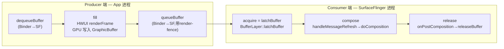
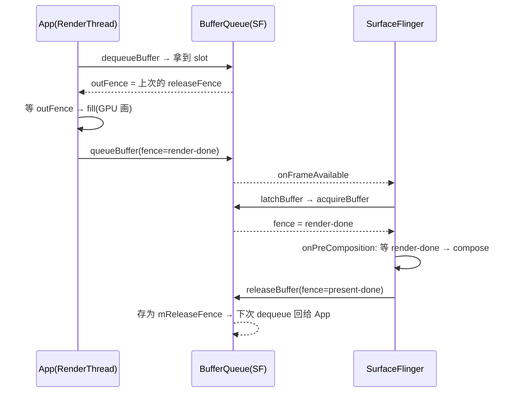

# BufferQueue 单帧全生命周期：dequeue→fill→queue / acquire→latch→compose→release（AOSP 14 详细注释）

> 前一份 `bufferqueue_state_machine.md` 讲清了**状态机 / Fence 原理 / 跨进程零拷贝**。这份把**消费端在 SurfaceFlinger 里的真实代码路径**补齐，让你顺着一帧看完整条链：
> `dequeue`(App) → `fill`(HWUI/GPU) → `queue`(App) → `acquire=latchBuffer`(SF) → `compose`(SF 合成) → `release`(SF)。

---

## 一、总览：6 步归属哪端、哪个进程、哪个线程



| 步骤 | 调用方 | 进程 / 线程 | 真实入口 |
|------|--------|-------------|----------|
| dequeue | App | App 进程（Binder 调到 SF） | `BufferQueueProducer::dequeueBuffer` |
| fill | HWUI RenderThread | App 进程 / RenderThread | `SkiaPipeline::renderFrame`（见 view_draw 文档） |
| queue | App | App 进程（Binder 调到 SF） | `Surface::queueBuffer` → `BufferQueueProducer::queueBuffer` |
| acquire=latch | SF | SF 进程 / 主线程 | `BufferLayer::latchBuffer` → `mConsumer->acquireBuffer` |
| compose | SF | SF 进程 / 主线程 | `SurfaceFlinger::handleMessageRefresh` → `doComposition` |
| release | SF | SF 进程 / 主线程 | `BufferLayer::onPostComposition` → `mConsumer->releaseBuffer` |

> **关键对应关系**：你列的 `acquire → latch` 在 SF 里其实是**同一个动作**——`latchBuffer()` 内部第一行就是 `mConsumer->acquireBuffer(...)`。`latch` = 把取到的 Buffer 缓存进 Layer 的 `mActiveBuffer` 并记录 meta（crop/transform/fence）。

---

## 二、Producer 端（App 进程）：dequeue → fill → queue

### 2.1 dequeue —— 申请一块空 GraphicBuffer
（实现在 SF 进程，App 经 Binder 调，见 state_machine 文档第三节）

```cpp
// frameworks/native/libs/gui/BufferQueueProducer.cpp
status_t BufferQueueProducer::dequeueBuffer(..., int* outSlot,
                                            sp<Fence>* outFence, ...) {
    // ① 找一个 FREE slot（全忙则阻塞等 release）
    // ② 若无 GraphicBuffer 则 gralloc 分配
    // ③ slot 状态 FREE → DEQUEUED
    // ④ outFence = 上次 release 回传的 fence（保证不会覆盖 SF 还在用的像素）
    *outSlot  = found;
    *outFence = mCore->mSlots[found].mReleaseFence;
}
```
App 拿到 `outSlot` + 对应 `GraphicBuffer` 后，**通过 EGL window surface 把这块 Buffer 作为 GPU 渲染目标**（view_draw 文档第四节）。

### 2.2 fill —— GPU 把像素光栅化进 GraphicBuffer
这一步**不在 BufferQueue 里**，是 HWUI 在 RenderThread 干的：
```cpp
// frameworks/base/libs/hwui/pipeline/skia/SkiaPipeline.cpp
void SkiaPipeline::renderFrame(...) {
    SkSurface* surface = getSurface();   // 后端 = dequeue 来的 GraphicBuffer
    for (auto& node : nodes) node->render(surface->getCanvas(), ...); // Skia 光栅化
    surface->flush();
}
// 然后 eglSwapBuffers → Surface::queueBuffer（见下）
```
fill 完成后，GPU 会产出一个 **render-fence**（表示光栅化结束、像素可读）。

### 2.3 queue —— 归还并通知 SF
```cpp
// frameworks/native/libs/gui/BufferQueueProducer.cpp
status_t BufferQueueProducer::queueBuffer(int slot, const QueueBufferInput& input, ...) {
    sp<Fence> fence = input.fence;           // ★render-fence（GPU 画完）
    mCore->mSlots[slot].mBufferState = QUEUED;
    mCore->mQueue.push(slot);
    mCore->mConsumerListener->onFrameAvailable(...);  // 通知 SF 有新帧
    return NO_ERROR;
}
```
`onFrameAvailable` 会唤醒 SF：若当前在 VSYNC 周期外，SF 记下"有脏帧"，等下一个 VSYNC 触发 `MSG_INVALIDATE`。

---

## 三、Consumer 端（SurfaceFlinger 进程）：acquire/latch → compose → release

### 3.1 acquire = latchBuffer —— 取帧 + 缓存 meta

`SurfaceFlinger::handleMessageInvalidate()` → `handlePageFlip()` 对每个 Layer 调 `latchBuffer`：

```cpp
// frameworks/native/services/surfaceflinger/BufferLayer.cpp
bool BufferLayer::latchBuffer(const std::shared_ptr<FrameTimelineInfo>&, ...) {
    // ★第一步就是 acquireBuffer（你列的 acquire 步骤）★
    status_t result = mConsumer->acquireBuffer(&mBufferInfo.mBufferItem,
                                               mFenceTimeline, ...);
    if (result == NO_ERROR) {
        // 把取到的 Buffer 记为该 Layer 当前活跃 Buffer
        mBufferInfo.mGraphicBuffer = mBufferInfo.mBufferItem.mGraphicBuffer;
        mBufferInfo.mFence        = mBufferInfo.mBufferItem.mFence;  // ★render-fence
        mActiveBuffer = mBufferInfo.mGraphicBuffer;  // 合成时读这块
        // 记录 crop / transform / 时间戳等，供后面 compose 用
    }
    return true;
}
```
- slot 状态 `QUEUED → ACQUIRED`。
- `mBufferInfo.mFence` 就是 Producer `queueBuffer` 时带来的 render-fence，SF 在 compose 前必须等它。

### 3.2 compose —— 真正合成一帧

`SurfaceFlinger::handleMessageRefresh()` 骨架（SF 主循环心脏）：
```cpp
// frameworks/native/services/surfaceflinger/SurfaceFlinger.cpp
void SurfaceFlinger::handleMessageRefresh() {
    preComposition();        // ① 等 fence（见 3.3）
    rebuildLayerStacks();    // ② 按 Z-order 整理各 display 的图层
    setUpHWComposer();       // ③ 逐层问 HWC 能否 overlay
    doComposition();         // ④ 真正画：GPU 合成 or HWC present
    postComposition();       // ⑤ release（见 3.4）
}
```

`preComposition()` 内部对每个 Layer 调 `onPreComposition()`，**在这里等 render-fence**：
```cpp
// frameworks/native/services/surfaceflinger/BufferLayer.cpp
bool BufferLayer::onPreComposition(...) {
    // 等 Producer queue 时带的 render-fence signaled，确保像素已光栅化完
    if (mBufferInfo.mFence->isValid())
        mBufferInfo.mFence->wait(Fence::SIGNAL_TIMEOUT_NS);
    return true;
}
```

`doComposition()` → `doDisplayComposition()` → `composeSurfaces()`：需要 GPU 合成的层用 `RenderEngine` 画进 framebuffer 目标；能 overlay 的层交给 HWC。最后 `mHwc->present(display)` 把整帧送显。合成结束 HWC 返回一个 **present-fence**（表示这帧已送显、Buffer 可被回收）。

### 3.3 release —— 归还 Buffer 给队列

`postComposition()` → 每个 Layer `onPostComposition()`：
```cpp
// frameworks/native/services/surfaceflinger/BufferLayer.cpp
void BufferLayer::onPostComposition(...) {
    // present-fence：HWC 送显完成，SF 不再需要这块像素
    sp<Fence> releaseFence = mHwc->getPresentFence(mDisplayToken);
    // ★把 Buffer 归还队列，状态 ACQUIRED → FREE★
    mConsumer->releaseBuffer(mBufferInfo.mSlot, releaseFence, ...);
    mBufferInfo.mGraphicBuffer = nullptr;
}
```
回到 `BufferQueueConsumer::releaseBuffer`（state_machine 文档第四节）：把 `releaseFence` 存为 slot 的 `mReleaseFence`，下一次 `dequeueBuffer` 时作为 `outFence` 回给 Producer —— 闭环完成。

---

## 四、Fence 的三次交接（精确时序）



| Fence | 谁产生 | 谁消费 | 含义 |
|-------|--------|--------|------|
| **releaseFence**（dequeue 的 outFence） | SF `releaseBuffer` | App `dequeueBuffer` 后、fill 前 | SF 合成完，像素可覆盖 |
| **render-done fence**（queue 的 fence） | App `queueBuffer` | SF `onPreComposition` 等 | GPU 把帧画完，可读 |
| **present-done fence**（release 的 fence） | HWC `present` | 下次 dequeue 的 App | 该帧已上屏，Buffer 可回收 |

> 三步 fence 让 Producer（App）和 Consumer（SF）**无需为像素加互斥锁**，各自只在轻量的 slot 状态机上加锁。这就是 BufferQueue 无锁双/三缓冲的本质。

---

## 五、怎么在 dumpsys 里印证这 6 步

`adb shell dumpsys SurfaceFlinger` 里每个 Layer 有这些计数，正好对应：
- `mQueuedFrames` —— 累计 `queueBuffer` 次数（Producer 侧）
- `mAcquiredFrames` / 当前 `mActiveBuffer` —— `acquireBuffer/latchBuffer` 后的活跃 Buffer（Consumer 侧）
- `mReleasedFrames`（部分版本） —— `releaseBuffer` 次数
- 层的 `Composition type` —— `setUpHWComposer` 决策结果（Device=overlay / Client=GPU）

**判读掉帧**：若 `mQueuedFrames` 很久不增 → App 端 `dequeue` 阻塞（所有 slot 被 SF 占着，三缓冲不够）→ 典型是 SF 合成太慢或 GPU 过载。若 `mAcquiredFrames` 增但上屏帧率没跟上 → latch 后 compose 阶段卡（HWC/GPU 瓶颈）。

---

## 六、核心结论前置总结

1. **`acquire` 和 `latch` 在 SF 里是同一动作**：`BufferLayer::latchBuffer()` 内部首行 `mConsumer->acquireBuffer()`，再缓存进 `mActiveBuffer`。
2. **`fill` 不在 BufferQueue 里**，是 HWUI 在 App 的 RenderThread 把像素光栅化进 dequeue 来的 GraphicBuffer（EGL window surface 后端）。
3. **`compose` 发生在 `handleMessageRefresh` 的 `doComposition`**，且 `preComposition → onPreComposition` 里会 `fence->wait()` 等 render-done，再合成。
4. **`release` 在 `postComposition → onPostComposition`**，把 HWC 的 present-fence 经 `releaseBuffer` 存回 slot，下个 `dequeue` 回传给 App —— Fence 闭环。
5. 三道 fence（release / render-done / present-done）实现跨进程无锁接力，是双/三缓冲不掉帧的根本。

**三份文档已闭环**：`surfaceflinger_learning_guide.md`（总览）→ `view_draw_to_graphicbuffer.md`（App 侧 fill）→ `bufferqueue_state_machine.md`（状态机/Fence 原理）→ 本篇（单帧 6 步端到端代码）。拼接即 `View.draw → GraphicBuffer → BufferQueue → SF 合成上屏` 完整链路。
