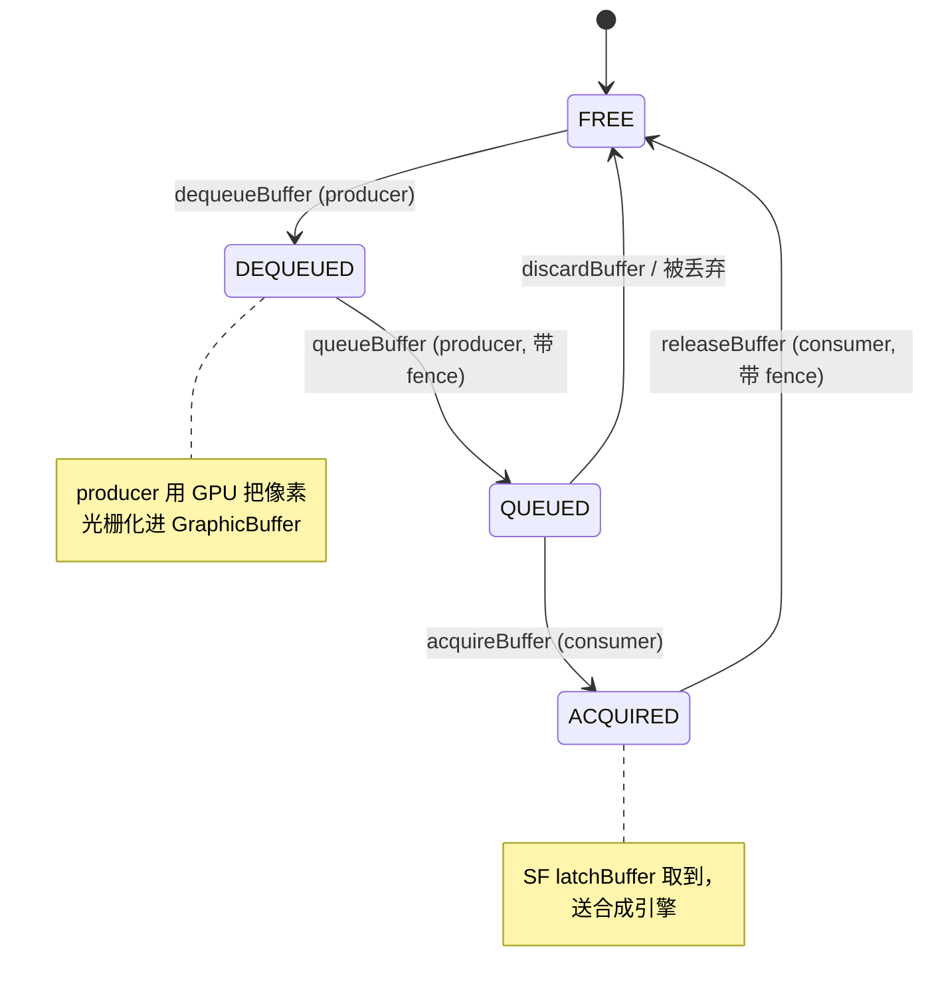
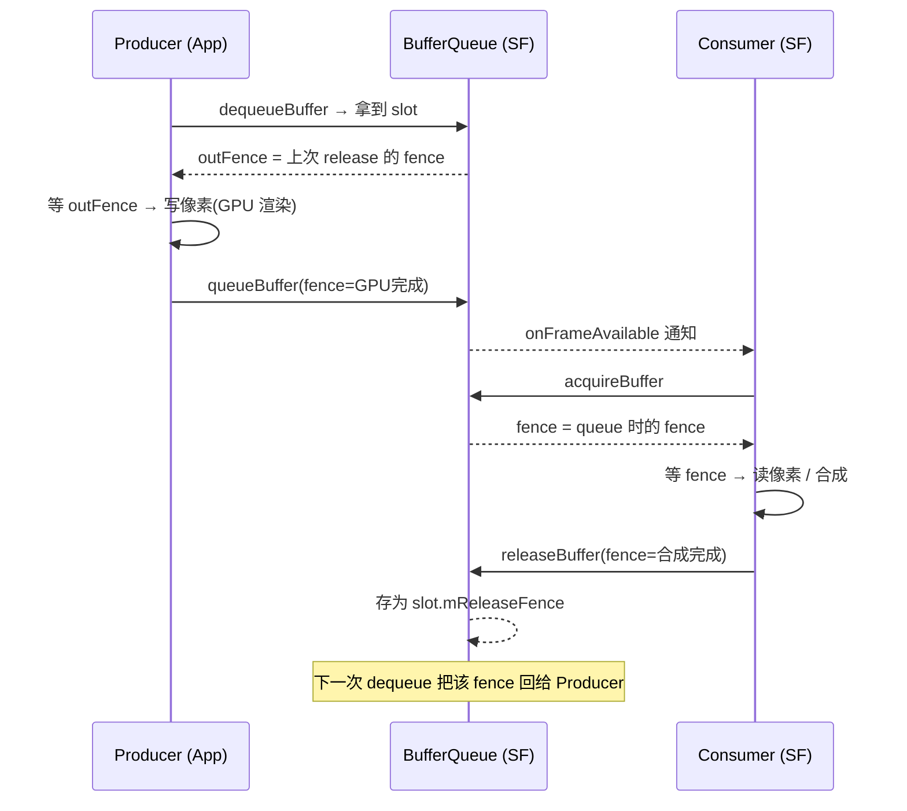

# BufferQueue 状态机与跨进程共享（AOSP 14）

> 这一份专门补全你贴的这条线：
> `Producer(App): dequeue → fill → queue` ／ `Consumer(SF): acquire → latch → compose → release`
> 核心要讲清三件事：**① 状态机长什么样；② 队列和 Buffer 是怎么跨进程共享的（零拷贝）；③ Fence 如何让生产/消费两个进程无锁地接力同一块像素内存。**

---

## 一、先纠正一个常见误解：队列到底在哪个进程？

经典 App → SurfaceFlinger 场景里，**BufferQueue 整体（Core + Producer + Consumer）都在 SurfaceFlinger 进程**。

```
┌─────────────────── App 进程 ───────────────────┐         ┌── SurfaceFlinger 进程 ──┐
│                                                  │  Binder  │                         │
│   Surface (android.view.Surface)                 │ ◄─────► │  BufferQueueCore         │
│     └─ mGraphicBufferProducer                    │ IGraphic│    ├─ mSlots[64]          │
│          = BpGraphicBufferProducer  (远端代理)   │  Buffer │    ├─ mQueue (QUEUED 队列)│
│                                                  │ Producer│  BufferQueueProducer     │
│   你调用的 dequeueBuffer/queueBuffer             │         │  BufferQueueConsumer     │
│   其实是通过 Binder 调到 SF 进程的 Producer 实现 │         │    └─ 被 BufferLayer 使用  │
└──────────────────────────────────────────────────┘         └─────────────────────────┘
```

- App 进程只有 `BpGraphicBufferProducer`（Binder 代理），**没有 BufferQueueCore**。
- 真正的 `BufferQueueProducer::dequeueBuffer` / `queueBuffer` 运行在 **SF 进程**，被 App 跨 Binder 调用。
- 但 Buffer 的**像素内存不跨进程拷贝**——只传一个 `GraphicBuffer` 的 **handle**（见第五节），两边映射同一块物理内存。

> 为什么这么设计？因为 Consumer（SF）才是 BufferQueue 的 owner，Producer 是远程客户端。状态机集中在一处，避免多进程各自维护 slot 状态导致不一致。

---

## 二、状态机：每个 slot 的 5 个状态

BufferQueue 用固定数量的 slot（默认 `NUM_BUFFER_SLOTS = 64`，实际一般只用 2~3 个）管理 Buffer。每个 slot 一个 `BufferState`：

`frameworks/native/include/ui/BufferQueueDefs.h`
```cpp
// 每个 slot 在任意时刻处于以下状态之一
enum BufferState {
    FREE,       // 空闲，可被 dequeue
    DEQUEUED,   // 被 producer 拿走，正在 fill（GPU 渲染）
    QUEUED,     // producer 填完，queue 回来，等 consumer
    ACQUIRED,   // consumer 取走，正在 latch / compose
    SHARED      // 被多个生产者共享（罕见，如多窗口）
};
```

### 状态流转图



> 多个 slot 可以**同时**处于不同阶段（比如 slot A=QUEUED、slot B=ACQUIRED、slot C=DEQUEUED），这就是**双缓冲 / 三缓冲**的本质——生产者和消费者永远拿到不同的 slot，互不阻塞。

---

## 三、Producer 端：dequeue / queue

`frameworks/native/libs/gui/BufferQueueProducer.cpp`

### 3.1 dequeueBuffer（Producer 申请一块空 Buffer）

```cpp
status_t BufferQueueProducer::dequeueBuffer(..., int* outSlot,
                                            sp<Fence>* outFence, ...) {
    Mutex::Autolock lock(mCore->mMutex);          // 锁住 Core 状态
    // 1) 找一个 FREE slot；若全忙（都被 DEQUEUED/QUEUED/ACQUIRED 占用）
    //    非 async 模式会阻塞在 mCore->mDequeueCondition 上等待 release
    int found = -1;
    waitForFreeSlotThenRelock(... &found);        // 内部可能 mDequeueCondition.wait()

    // 2) 若该 slot 还没分配 GraphicBuffer，向 gralloc 分配一块
    if (mCore->mSlots[found].mGraphicBuffer == nullptr) {
        mCore->mAllocator.allocate(...);          // gralloc 分配显存/内存
    }

    // 3) 状态置为 DEQUEUED
    mCore->mSlots[found].mBufferState = DEQUEUED;

    // 4) 返回"释放栅栏"：上次 consumer release 时回传的 fence
    //    表示"上一任使用者是否用完这块内存"，producer 写之前需等它 signaled
    *outFence = mCore->mSlots[found].mReleaseFence;
    *outSlot  = found;
    return NO_ERROR;
}
```
**重点**：`outFence` 是**跨生产/消费的同步点 ①**——保证 producer 不会覆盖 consumer 还在读的像素。

### 3.2 queueBuffer（Producer 填完，归还并通知）

```cpp
status_t BufferQueueProducer::queueBuffer(int slot,
                                          const QueueBufferInput& input, ...) {
    Mutex::Autolock lock(mCore->mMutex);
    // 1) 取出 producer 传入的 fence：表示"GPU 已把这一帧光栅化完"
    sp<Fence> fence = input.fence;                // 同步点 ② 的来源

    // 2) 状态 FREE/DEQUEUED → QUEUED，并压入就绪队列
    mCore->mSlots[slot].mBufferState = QUEUED;
    mCore->mQueue.push(slot);

    // 3) 通知 consumer：SurfaceFlinger 的 onFrameAvailable 被回调
    //    → SF 据此（结合 VSYNC）安排一次合成
    mCore->mConsumerListener->onFrameAvailable(mCore->mSlots[slot]);
    return NO_ERROR;
}
```

---

## 四、Consumer 端（SurfaceFlinger）：acquire / release

`frameworks/native/libs/gui/BufferQueueConsumer.cpp`

### 4.1 acquireBuffer（SF 取走一帧）

```cpp
status_t BufferQueueConsumer::acquireBuffer(BufferItem* out, ...) {
    // 1) 从 mQueue 取队首 QUEUED 的 slot
    int slot = mCore->mQueue.front();
    // 2) 状态 QUEUED → ACQUIRED
    mCore->mSlots[slot].mBufferState = ACQUIRED;
    // 3) 返回 producer 在 queueBuffer 时给的 fence
    //    SF 在 latchBuffer/compose 之前必须等它 signaled，才能安全读像素
    out->mFence = mCore->mSlots[slot].mFence;     // 同步点 ② 的消费端
    return NO_ERROR;
}
```
> 实际 SF 里 `BufferLayer::latchBuffer()` 会调 `acquireBuffer`，并把 fence 存到 `mFence`，在 `onPreComposition` 时 `mFence->wait()` 等 GPU 完成。

### 4.2 releaseBuffer（SF 合成完，归还）

```cpp
status_t BufferQueueConsumer::releaseBuffer(int slot,
                                            const sp<Fence>& releaseFence) {
    // releaseFence：表示"SF 的 GPU 合成已结束，这块像素 consumer 不再需要"
    // 1) 状态 ACQUIRED → FREE
    mCore->mSlots[slot].mBufferState = FREE;
    // 2) 把这个 fence 存为 mReleaseFence，下一次 dequeueBuffer 时回给 producer
    mCore->mSlots[slot].mReleaseFence = releaseFence;  // → 回到同步点 ①
    mCore->mDequeueCondition.broadcast();   // 唤醒可能在等空 slot 的 producer
    return NO_ERROR;
}
```

---

## 五、跨进程共享 GraphicBuffer（零拷贝的关键）

`frameworks/native/libs/ui/GraphicBuffer.cpp`

Buffer 本身**不会**被 Binder 复制。流程：

1. SF 进程通过 gralloc（`mCore->mAllocator.allocate`）分配一块缓冲区，得到 `native_handle_t`（含 gralloc 模块 fd + width/height/stride/format，以及实际的 dma-buf / ion fd）。
2. 跨 Binder 传 buffer 时，`GraphicBuffer::flatten()` 把 handle 写进 `Parcel`；另一端的 `unflatten()` 重建 `GraphicBuffer`，并调用 gralloc 的 `registerBuffer` **把同一块物理内存映射到新进程地址空间**。
3. 因为底层是 **dma-buf / ION**（Linux 共享内存），两个进程看到的是同一块物理页——**像素零拷贝**，只传了一个轻量 handle（fd 会被 Binder 自动 dup）。

```cpp
// GraphicBuffer 跨进程传递 = 传 handle，不传像素
status_t GraphicBuffer::flatten(void* buffer, size_t size, int fds[],
                                size_t count) const {
    // 写入: width, height, stride, format, usage, + native_handle (含 fd)
    // 接收方 unflatten → gralloc->registerBuffer → 映射同一物理内存
}
```

> 这也是为什么 App 能"画完直接交出去"却几乎不花拷贝时间——BufferQueue 的价值不只是状态机，更是**基于 gralloc/dma-buf 的零拷贝共享通道**。

---

## 六、Fence：两个进程无锁接力同一块内存的秘密

把上面三处同步点串起来，就是 BufferQueue 实现无锁双/三缓冲的核心：



- **同步点①（dequeue 的 outFence）**：保证 producer 写之前，consumer 已彻底用完旧内容。
- **同步点②（queue 的 fence）**：保证 consumer 读之前，producer 的 GPU 渲染已落盘。
- 全程**不需要进程间互斥锁去保护像素**——靠 GPU/dma-buf 的 fence 信号量，双方只在 slot 状态机上加锁（那是元数据，很轻）。

---

## 七、核心结论前置总结

| 问题 | 答案 |
|------|------|
| BufferQueue 在哪个进程？ | **SF 进程**（Core+Producer+Consumer 都在那），App 只有 Binder 代理 `BpGraphicBufferProducer` |
| 几个 slot？ | 默认 `NUM_BUFFER_SLOTS = 64`，实际用 2~3 个做双/三缓冲 |
| slot 的 5 个状态？ | `FREE → DEQUEUED → QUEUED → ACQUIRED → FREE` |
| 谁调 dequeue/queue？ | App（通过 Binder 调到 SF 进程的 Producer） |
| 谁调 acquire/release？ | SurfaceFlinger（BufferLayer 的 latchBuffer / 合成后） |
| 像素怎么跨进程？ | `GraphicBuffer` 的 handle 经 Binder 传递，gralloc `registerBuffer` 映射**同一物理内存**，零拷贝 |
| 两个进程怎么无锁接力？ | 靠 **Fence**（dequeue 的 release-fence、queue 的 done-fence）做 GPU 完成同步 |

**衔接**：App 侧 `queueBuffer`（第五节 / 上一份文档的 `swapBuffers`）→ SF 侧 `acquireBuffer → latchBuffer` 取走这一帧 → 进入 `onMessageRefresh` 的合成（第一份 SurfaceFlinger 文档）。三份拼起来就是 `View.draw → GraphicBuffer → BufferQueue → SurfaceFlinger 合成上屏` 的端到端全链路。
