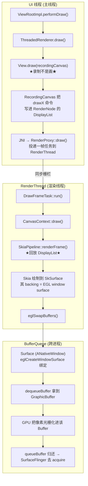

# View.draw → GraphicBuffer：像素落盘全过程代码解析（AOSP 14）

> 一句话反直觉点：**硬件加速开启时，`View.draw(Canvas)` 不是把像素画到屏幕上，而是把"绘制命令"录制进一个 DisplayList（RenderNode）。真正的"回放/画像素"发生在另一条线程（RenderThread），最终通过 EGL window surface 落到 BufferQueue 的 GraphicBuffer 上。**
>
> 版本基准：Android 14 / UpsideDownCake，HWUI 已全面 Skia 化（GL / Vulkan 都是 Skia 后端）。

---

## 一、全链路时序（先建立骨架）



**两条并行概念线**：
- **记录阶段**（UI 线程）：`View.draw` → `RecordingCanvas` 录制 → `RenderNode`(DisplayList)。
- **回放阶段**（RenderThread）：`renderFrame` → Skia 画到绑定 GraphicBuffer 的 `SkSurface` → `queueBuffer`。

---

## 二、阶段一：记录阶段（UI 线程）——"画"其实是录

### 2.1 入口：ViewRootImpl 触发 draw

`frameworks/base/core/java/android/view/ViewRootImpl.java`
```java
private void performDraw() {
    // ... 前面 performMeasure / performLayout 已完成
    final boolean fullRedrawNeeded = mFullRedrawNeeded;
    mFullRedrawNeeded = false;
    // mAttachInfo.mThreadedRenderer 在硬件加速下非空
    if (mAttachInfo.mThreadedRenderer != null && mAttachInfo.mThreadedRenderer.isEnabled()) {
        // ★硬件加速分支：录制 + 异步回放
        mAttachInfo.mThreadedRenderer.draw(mView, mAttachInfo, this);
    } else {
        // 软件绘制分支（见第五节）
        drawSoftware();
    }
}
```

### 2.2 ThreadedRenderer 把 View 树交给录制

`frameworks/base/core/java/android/view/ThreadedRenderer.java`
```java
void draw(View view, AttachInfo attachInfo, DrawCallbacks callbacks) {
    // 1) 先把每个脏 View 的绘制命令录制进各自的 RenderNode
    updateRootDisplayList(view, callbacks);   // → view.updateDisplayListIfDirty()
    // 2) 通过 JNI 把整棵树 + 脏区交给 RenderThread
    nSyncAndDrawFrame(mNativeProxy, frameInfo, ...);
}

// view.updateDisplayListIfDirty() 内部：
//   RecordingCanvas canvas = renderNode.beginRecording(width, height);
//   draw(canvas);          // ★递归调用 View.draw(canvas)，但 canvas 是录制型
//   renderNode.endRecording();  // 把录制结果固化成 DisplayList
```

### 2.3 View.draw —— 录制命令的地方

`frameworks/base/core/java/android/view/View.java`
```java
public void draw(Canvas canvas) {
    // 注意：硬件加速下入参 canvas 是 RecordingCanvas（DisplayListCanvas 子类）
    final int privateFlags = mPrivateFlags;
    mPrivateFlags = (privateFlags & ~PFLAG_DIRTY_MASK) | PFLAG_DRAWN;

    // 1) 背景
    drawBackground(canvas);
    // 2) 自身内容 —— onDraw 里你写的 canvas.drawXxx() 全部被"录制"
    onDraw(canvas);
    // 3) 子 View —— ViewGroup 会递归让子 View.draw(childCanvas)
    dispatchDraw(canvas);
    // 4) 前景/滚动条/装饰
    onDrawForeground(canvas);
}
```

**关键认知**：`canvas.drawRect(...)` / `canvas.drawBitmap(...)` 在硬件加速下，走的是 `RecordingCanvas` 的 JNI 录制，**不接触任何像素**。命令被序列化成 Skia 的 `DisplayListData`（见 `frameworks/base/libs/hwui/RecordingCanvas.cpp`）。

`frameworks/base/libs/hwui/RecordingCanvas.cpp`（C++ 录制端，每条 draw 命令追加进 DisplayList）
```cpp
// 以 drawRect 为例：把"画矩形"这一指令写进 mDisplayList，而不是立即光栅化
void RecordingCanvas::drawRect(const SkRect& rect, const SkPaint& paint) {
    // 注意 return 前面的 this->... 实际是 push 一个 DrawRect 类型的 display-list op
    mDisplayList->push<SkiaDisplayList::DrawRect>(rect, paint);
}
```

> 这就是为什么"在 `onDraw` 里 new Paint 对象"会拖慢 UI 线程：每次录制都会把 Paint 的副本塞进 DisplayList，录制阶段开销直接变成卡顿。

---

## 三、阶段二：回放阶段（RenderThread）—— 真正画像素

### 3.1 任务从 UI 线程投递到 RenderThread

`frameworks/base/libs/hwui/jni/android_view_ThreadedRenderer.cpp`
```cpp
static void android_view_ThreadedRenderer_syncAndDrawFrame(...) {
    RenderProxy* proxy = reinterpret_cast<RenderProxy*>(nativeProxy);
    // 把 UI 线程录制好的内容同步进 RenderThread，并安排一帧绘制
    proxy->syncAndDrawFrame(frameInfo, frameInfoSize);
}
```

`frameworks/base/libs/hwui/renderthread/RenderProxy.cpp`
```cpp
int RenderProxy::syncAndDrawFrame(...) {
    // DrawFrameTask 被 post 到 RenderThread 的消息队列，UI 线程立即返回
    return mDrawFrameTask.postAndWait(frameInfo);
}
```

### 3.2 CanvasContext 主持一帧

`frameworks/base/libs/hwui/renderthread/CanvasContext.cpp`
```cpp
void CanvasContext::draw() {
    // 1) 准备帧（处理同步栅栏、动画、脏区）
    prepareTree();
    // 2) 真正渲染：把所有 RenderNode 的 DisplayList 回放到目标 surface
    mCurrentFrameInfo->markRenderStart();
    auto& pipeline = mRenderPipeline;          // SkiaOpenGLPipeline 或 SkiaVulkanPipeline
    pipeline->renderFrame(...);                // ★回放 DisplayList → 画像素★
    // 3) 提交到屏幕（swap）
    pipeline->swapBuffers(frame, windowDirty, ...);  // 内部 eglSwapBuffers
}
```

### 3.3 renderFrame：DisplayList 回放成 Skia 绘制

`frameworks/base/libs/hwui/pipeline/skia/SkiaPipeline.cpp`
```cpp
void SkiaPipeline::renderFrame(const LayerUpdateQueue& layers,
                               const SkRect& clip,
                               const std::vector<sp<RenderNode>>& nodes,
                               ... ) {
    // 拿到目标 SkSurface —— 它的像素后端就是 GraphicBuffer（见第四节）
    SkSurface* surface = getSurface();
    SkCanvas* canvas = surface->getCanvas();

    // ★核心回放循环：把每个 RenderNode 录制的 DisplayList 用 Skia 光栅化★
    for (const sp<RenderNode>& node : nodes) {
        if (node->nothingToDraw()) continue;
        // 把录制阶段存下的 drawRect/drawBitmap 等命令，逐一交给 Skia 真正执行
        node->render(canvas, ...);   // → SkiaDisplayList::draw(canvas) 实际光栅化
    }
    canvas->flush();   // 确保 GPU 命令入队
}
```

> 此时 Skia 通过 `GrBackendRenderTarget`（GL）或 Vulkan 的 `VkImage` 把像素**光栅化到绑定在 EGL/Vk Surface 背后的 GraphicBuffer 显存/内存里**。这部分是 GPU 驱动完成的，不在 App 进程做 CPU 逐像素写。

---

## 四、GraphicBuffer 从哪来（最容易问的点）

**GraphicBuffer 不是 HWUI 直接 dequeue 的，而是借道 EGL/Vk 的 window surface。**

`frameworks/base/libs/hwui/pipeline/skia/SkiaOpenGLPipeline.cpp`
```cpp
SkSurface* SkiaOpenGLPipeline::getSurface() {
    if (!mSkSurface) {
        // ★关键：把 Surface(ANativeWindow) 交给 EGL 创建 window surface★
        // window 即 ViewRootImpl.mSurface 对应的 native Surface
        EGLSurface eglSurface = mEglManager.createWindowSurface(mNativeWindow);
        // Skia 用 EGLSurface 背后的 GraphicBuffer 作为 GrRenderTarget
        mSkSurface = SkSurface::MakeFromBackendRenderTarget(
                mGrContext, backendRT, ...);   // backendRT 指向该 GraphicBuffer
    }
    return mSkSurface;
}
```

`frameworks/native/libs/gui/Surface.cpp`（native Surface = ANativeWindow 实现）
```cpp
// EGL 创建 window surface 时，底层正是反复调用这里从 BufferQueue 取 GraphicBuffer
int Surface::dequeueBuffer(android_native_buffer_t** buffer, int* fenceFd) {
    // 向 BufferQueue(生产者端) 申请一个空 GraphicBuffer
    status_t result = mGraphicBufferProducer->dequeueBuffer(
            &buf, &fence, w, h, format, usage, ...);
    // 返回的 GraphicBuffer 后续成为 EGL/Vk 渲染目标 = 像素落点
    *buffer = buf->getNativeBuffer();
}
```

**闭环**：
1. `Surface`(ANativeWindow) 被 `eglCreateWindowSurface` 绑定；
2. EGL 每次 frame 内部 `dequeueBuffer` 拿 GraphicBuffer 作为绘制后端；
3. Skia(GPU) 把 DisplayList 回放、光栅化进该 GraphicBuffer；
4. `eglSwapBuffers` → `Surface::queueBuffer` 把 GraphicBuffer 归还 BufferQueue；
5. SurfaceFlinger 在下一帧 `acquireBuffer` 取走，合成上屏（衔接上一文档的 BufferQueue 流程）。

> 所以"像素画到 GraphicBuffer"的主语是 **GPU + EGL/Vk window surface**，HWUI 只负责"指挥画什么"。

---

## 五、对照：软件绘制的样子（无硬件加速）

软件绘制路径完全不同——直接在 UI 线程把像素写进被锁住的 Buffer：

`frameworks/base/core/java/android/view/ViewRootImpl.java`
```java
private boolean drawSoftware(Surface surface, ...) {
    // 1) 锁住 Surface，拿到一块可写的像素缓冲（内部 dequeueBuffer + 映射 bits）
    canvas = surface.lockCanvas(dirty);   // ← native lockCanvas → Surface::lock
    // 2) View.draw(canvas) 这里 canvas 是 *软件 SkiaCanvas*，drawXxx 直接写像素
    mView.draw(canvas);
    // 3) 解锁并 post：unlockCanvasAndPost → queueBuffer 归还
    surface.unlockCanvasAndPost(canvas);
}
```
- `Surface::lock()`（native）→ `dequeueBuffer` + `lockBuffer` → 返回 `bits` 指针给 `SkBitmap` → 软件 Skia 逐像素绘制。
- 软件路径**没有 RenderThread**，全部在主线程，掉帧风险高，所以 Android 默认走硬件加速。

---

## 六、核心结论前置总结

| 问题 | 答案 |
|------|------|
| `View.draw` 直接画像素吗？ | **不**。硬件加速下是录制 DisplayList，回放在 RenderThread |
| 谁真正把像素写进 GraphicBuffer？ | **GPU**，通过 EGL/Vk window surface 绑定 BufferQueue 的 GraphicBuffer |
| GraphicBuffer 怎么拿到？ | `eglCreateWindowSurface(Surface)` → EGL 内部 `Surface::dequeueBuffer` |
| 录制与回放分属哪两个线程？ | UI 线程（录制）/ RenderThread（回放） |
| 画完怎么交给 SurfaceFlinger？ | `eglSwapBuffers` → `Surface::queueBuffer` → BufferQueue（接上一文档） |
| 软件绘制区别？ | 主线程 `lockCanvas` 直接写像素，无 RenderThread，易掉帧 |

**进阶练习**：用 Perfetto 抓一条 `View.draw → queueBuffer` 的帧，看 `DrawFrameTask` 在 RenderThread 上的 `renderFrame` 耗时，对照本解析定位你的 jank 是在"录制"（UI 线程 onDraw 太重）还是"回放"（过度绘制 / GPU 负载）阶段。
