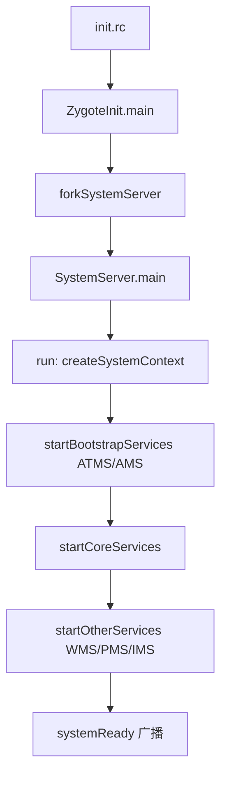

# aosp-systemserver — Zygote / SystemServer / 核心服务

调用链：**init → Zygote 孵进程 → SystemServer.main → run() → 启动 bootstrap/other/core 服务 → AMS/ATMS/WMS/PMS 就绪**。源码默认 Android 14。

## 何时使用

- 解析开机/进程启动、Activity 生命周期调度、窗口层级、包安装解析。
- 调试 ANR / 卡顿 / 服务启动超时（`wb`/`wm`/`am`/`pm` 命令）。
- 新增系统服务或 hook 已有服务。

## 一、启动链路

1. `system/core/rootdir/init.rc` → `init` 启动 `zygote`(64 位 `zygote64`)。
2. `frameworks/base/core/java/com/android/internal/os/ZygoteInit.java`：`main()` → `forkSystemServer()` 经 `Zygote.forkSystemServer`(native `com_android_internal_os_Zygote.cpp` 调 `fork()`)。
3. 子进程执行 `SystemServer.main()` → `new SystemServer().run()`。
4. `run()`：`createSystemContext()` 建 `ActivityThread`；`startBootstrapServices()`（ATMS、AMS、PMS 依赖的 DisplayManager、PowerManager 等）→ `startCoreServices()` → `startOtherServices()`（WMS、PMS、IMS 等全部起来，发 `systemReady`）。



## 二、核心服务坐标（Android 14）

| 服务 | 类路径 | 关键入口 |
|---|---|---|
| ATMS | `services/core/java/com/android/server/wm/ActivityTaskManagerService.java` | `startActivityAsUser` / `onSystemReady` |
| AMS | `services/core/java/com/android/server/am/ActivityManagerService.java` | `attachApplication` / `systemReady` / `broadcastIntent` |
| WMS | `services/core/java/com/android/server/wm/WindowManagerService.java` | `addWindow` / `relayoutWindow` / `prepareSurfaces` |
| PMS | `services/core/java/com/android/server/pm/PackageManagerService.java` | `scanPackageTracedLI` / `installStage` / `checkPermission` |
| IMS | `services/core/java/com/android/server/input/InputManagerService.java` | `start` / `injectInputEvent` |

- AMS 自 Android 10 起把 Activity 调度移交给 **ATMS**；AMS 仍管进程/广播/权限。
- WMS 与 ATMS 同进程、共享 `WindowManagerGlobalLock`，窗口树在 `RootWindowContainer`/`DisplayContent`/`WindowState`。

## 三、Activity 启动(简化为 ATMS 路径)

`ATMS.startActivityAsUser` → `ActivityStarter.execute` → `resumeFocusedTasksTopActivities` → `ActivityStack.resumeTopActivityInnerLocked` → `realStartActivityLocked` → `app.thread.scheduleTransaction`(Binder 到 App 进程 `ApplicationThread`) → `ActivityThread.handleLaunchActivity` → `onCreate`。

## 四、调试命令

```bash
adb shell am stack list            # 查看 task/activity 栈
adb shell wm stack / dumpsys window # 窗口层级
adb shell dumpsys activity          # AMS 全量状态
adb shell dumpsys package <pkg>     # PMS 包信息
adb shell service list              # 已注册系统服务
logcat -b system -b main | grep -i am_/wm_
```

## 五、踩坑清单

- **system_server 启动慢**：bootchart / `logcat -b system | grep "SystemServer"` 看各服务 `start*` 耗时；PMS `scanPackage` 在首次开机最重。
- **ANR**：`/data/anr/traces.txt`；看 `ams` 日志 `ANR in`。主线程 Binder 调用阻塞是主因。
- **WMS 死锁**：`WindowManagerGlobalLock` 与 `mService` 锁顺序要固定，避免与 AMS 锁交叉。
- **新增系统服务**：继承 `SystemService`，在 `SystemServer.startOtherServices` 注册，AIDL 接口见 `aosp-hal-treble` / Binder 见 `aosp-binder`。

## 关联

- Binder 注册机制 → `aosp-binder`
- 编译/刷机验证 → `aosp-build-flash`
- 版本路径坐标 → `aosp-navigator`
