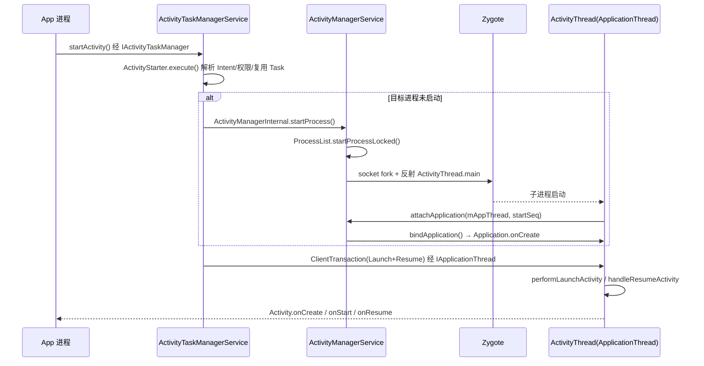
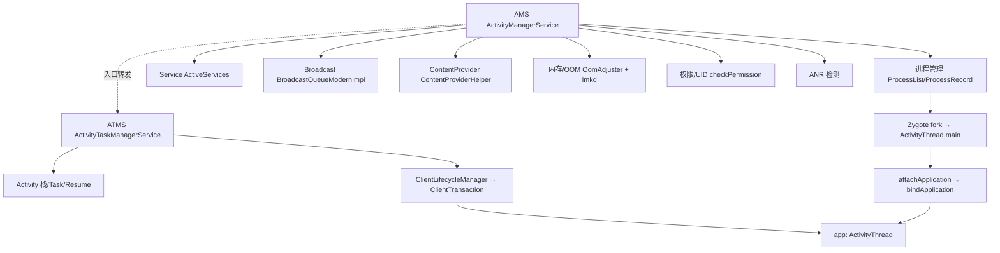

# AMS 深度讲解（Android 14 AOSP）

> 基于 AOSP **Android 14 (UpsideDownCake, API 34)**。全程贴真实文件路径 + 方法名。
> 配套实战见 `ams_modify_practice.md`（修改 AMS/ATMS 的 patch 与编译链路）。

---

## 0. 一句话定位

`ActivityManagerService`（AMS）是 `system_server` 进程里**最核心的系统服务**，负责：
**进程生命周期、应用进程孵化、四大组件中的 Service / Broadcast / ContentProvider、内存/OOM 管控、权限与 UID 校验、ANR 检测**。

> ⚠️ 关键前置认知（必须记住）：**从 Android 10 起，Activity 的启动/任务栈/生命周期状态机已经从 AMS 拆到了 `ActivityTaskManagerService`（ATMS，`frameworks/base/services/core/java/com/android/server/wm/`）**。
> 所以严格说，AMS **不再管 Activity 的栈和 Resume 流转**。AMS 现在管的是"进程 + 非 Activity 的三大组件 + 内存"。但 AMS 仍然是四大组件的"总调度"，因为它持有进程、持有 Binder 通道、持有权限上下文。

---

## 1. AMS 在系统里的位置

### 1.1 启动时机
`system_server` 在 `frameworks/base/services/java/com/android/server/SystemServer.java` 中分阶段拉起服务：
- `startBootstrapServices()`：拉起 `ActivityManagerService.Lifecycle`，AMS 是最早的核心服务之一（因为它要给后续服务创建运行进程）。
  ```java
  // SystemServer.java
  mActivityManagerService = mSystemServiceManager.startService(
          ActivityManagerService.Lifecycle.class).getService();
  ```
- `mActivityManagerService.setSystemProcess()`：把 `system`、phone、包管理相关服务注册进 AMS 自己的 Binder 表里。
- `mActivityManagerService.installSystemProviders()`：安装系统 ContentProvider。
- `mActivityManagerService.systemReady(...)`：系统就绪后回调各服务，触发 Home 启动。

### 1.2 Binder 拓扑
AMS 处在"所有 app 进程 ↔ system_server"的枢纽位置，定义了三套 Binder 接口：

```
app 进程 ──IActivityManager──▶ AMS         (startActivity/bindService/broadcastIntent/getMemoryInfo...)
AMS      ──IApplicationThread─▶ app 进程    (scheduleTransaction/bindApplication/scheduleReceiver...)
app 进程 ──IActivityTaskManager▶ ATMS        (Activity 启动入口，Android 10+)
```

- `frameworks/base/core/java/android/app/IActivityManager.aidl` —— app 调 AMS 的远程接口。
- `frameworks/base/core/java/android/app/IApplicationThread.aidl` —— AMS 调 app 的远程接口（注意方向反过来）。
- `frameworks/base/core/java/android/app/IActivityTaskManager.aidl` —— app 调 ATMS。
- 客户端壳：`ActivityManager.java` / `ActivityTaskManager.java`（`core/java/android/app/`），内部 `getService()` 取 `ServiceManager.getService("activity")`。

### 1.3 AMS 与 ATMS 的同进程协作
AMS 和 ATMS **都运行在 `system_server` 同一个进程里**。它们互相调用有两条路径：
1. **远程 Binder**（`IActivityManager` / `IActivityTaskManager`）：跨进程语义，但同进程时 Binder 驱动会优化为直接调用（oneway 异步语义保留）。
2. **Internal 接口（直接方法调用，无 Binder）**：AMS 持有 `ActivityTaskManagerInternal`（ATMS 的内部类实现），ATMS 持有 `ActivityManagerInternal`（AMS 的内部类实现）。这是高频调用优先走的方式，避免 Binder 开销。

```java
// AMS 内部
final ActivityTaskManagerInternal mAtmInternal;   // = ATMS 的实现
// ATMS 内部
final ActivityManagerInternal mAmInternal;          // = AMS 的实现
```

---

## 2. AMS vs ATMS vs WMS 职责边界（最重要）

| 维度 | AMS (`server/am/`) | ATMS (`server/wm/`) | WMS（`server/wm/WindowManagerService`） |
|---|---|---|---|
| Activity 栈 / Task / Resume | ❌（仅入口转发） | ✅ `ActivityStarter`/`Task`/`ActivityStack` | 窗口层级、Surface 归属 |
| 进程孵化 / 管理 | ✅ `ProcessList` | 经 `ActivityManagerInternal` 请求 AMS | 不涉及 |
| Service | ✅ `ActiveServices` | ❌ | ❌ |
| Broadcast | ✅ `BroadcastQueue*` | ❌ | ❌ |
| ContentProvider | ✅ `ContentProviderHelper` | ❌ | ❌ |
| 内存 / OOM | ✅ `OomAdjuster` | 提供可见性/前台状态给 AMS | 窗口可见性影响 oom_adj |
| 权限 / UID | ✅ `checkPermission`/`enforcePermission` | 复用 AMS | 复用 AMS |

> 实战铁律：**改「启动行为 / 栈调度 / 生命周期」→ 动 ATMS；改「进程 / 广播 / Service / OOM」→ 动 AMS**。改错文件是新手第一大坑（详见 `ams_modify_practice.md` §6）。

---

## 3. 核心数据结构

### 3.1 `ProcessRecord`（`server/am/ProcessRecord.java`）
一个进程的全部状态机。AMS 用 `mProcessNames`（按 processName+uid 索引）和 `mPidsSelfLocked`（按 pid 索引）两张表管理。
关键子记录：
- `ProcessProfileRecord`：CPU、内存、procstate。
- `ProcessServices`：该进程运行的 Service。
- `ProcessPackageInfo`：加载的包。
- `ProcessCachedOptimizerRecord`：缓存进程优化状态。

### 3.2 其他组件记录
- `ServiceRecord`（`server/am/ServiceRecord.java`）—— 一个 Service 实例。
- `BroadcastRecord`（`server/am/BroadcastRecord.java`）—— 一次广播分发。
- `ContentProviderRecord`（`server/am/ContentProviderHelper` 管理）—— 一个 Provider。
- `ActivityRecord` / `Task` / `ActivityStack`（`server/wm/`）—— Activity 侧，归 ATMS。

### 3.3 UID / 进程映射
AMS 以 `(processName, uid)` 作为进程唯一键。同一个 uid 可跑多个进程（多进程组件），所以不是"一 uid 一进程"。

---

## 4. 进程管理：从 fork 到 Application

### 4.1 发起启动
当 ATMS 决定要启动一个目标进程还没起来的 Activity 时，通过 `ActivityManagerInternal.startProcess()` → AMS → `ProcessList.startProcessLocked(...)`。

### 4.2 `ProcessList.startProcessLocked`
路径：`server/am/ProcessList.java`
```java
// 关键入参：processName, ApplicationInfo info, ...
final ProcessRecord startProcessLocked(String processName, ApplicationInfo info,
        boolean knownToBeDead, String hostingType, ...) {
    // 1. 查重：该 (processName, uid) 是否已存在 ProcessRecord
    // 2. newProcessRecordLocked() 创建 ProcessRecord
    // 3. 调 startProcessLocked(ProcessRecord app, ...)
    //    → 最终调 Process.start()（core/java/android/os/Process.java）
}
```
`Process.start()` 内部走 `ZygoteProcess`：
```
Process.start()
  → ZygoteProcess.start()
    → openZygoteSocketIfNeeded(abi)
    → zygoteSendArgsAndGetResult(openZygoteSocketIfNeeded, args)
```
通过 **Unix Domain Socket**（`/dev/socket/zygote`）把参数（uid、gid、niceName、targetSdk、fdsToClose 等）发给 Zygote。Zygote 收到后 `fork()`，子进程反射调用 `ActivityThread.main()`。

> 这套 socket 协议就是「Zygote 预加载 + fork 复用」的核心：应用进程不是从零 `execve`，而是从 Zygote `fork` 出来，直接继承已加载的 framework 类与资源，启动快几十倍。详细见 `binder_aidl.md` / `android_framework_paper.md`。

### 4.3 app 进程回连：attachApplication
子进程 `ActivityThread.main()` 做三件事：
```java
// core/java/android/app/ActivityThread.java
public static void main(String[] args) {
    Looper.prepareMainLooper();
    ActivityThread thread = new ActivityThread();
    thread.attach(false, startSeq);   // false = 非系统进程
    Looper.loop();
}
```
`attach()` 里通过 Binder 回连 AMS：
```java
final IActivityManager mgr = ActivityManager.getService();
mgr.attachApplication(mAppThread, startSeq);   // mAppThread 是 ApplicationThread (IApplicationThread 实现)
```

### 4.4 `AMS.attachApplicationLocked`
路径：`server/am/ActivityManagerService.java`
```java
boolean attachApplicationLocked(@NonNull IApplicationThread thread, long startSeq) {
    // 1. 校验 startSeq，防伪造
    // 2. 通过 IApplicationThread.bindApplication(...) 通知 app 创建 Application
    //    thread.bindApplication(processName, appInfo, providers, instr2, ...);
    // 3. 调 mAtmInternal.attachApplication(app.getWindowProcessController()) → ATMS 启动栈顶 Activity
    // 4. 绑定该进程已注册的 ContentProvider
    // 5. 调度 pending 的 Service / Broadcast
}
```
app 侧收到 `bindApplication` 后走 `ActivityThread.handleBindApplication()`：
- 创建 `ContextImpl` / `LoadedApk`
- `makeApplication()` → `Instrumentation.callApplicationOnCreate(app)` → `Application.onCreate()`

至此进程就绪，Activity 的 `onCreate` 才被 ATMS 通过 ClientTransaction 调度（见 §6）。

---

## 5. Activity 启动全流程（跨 AMS / ATMS / App）

以 `startActivity` 为例，串起三个世界：



要点：
1. **入口在 ATMS，不在 AMS**。App 端 `Instrumentation.execStartActivity()` 调的是 `ActivityTaskManager.getService().startActivity(...)`（Android 10+）。AMS 的 `startActivity` 仍保留，但常规路径不直接进。
2. `ActivityStarter.execute()` → `startActivityUnchecked()`：处理 `Intent` 解析、`FLAG_ACTIVITY_*`、Task 复用、权限（`AppOpsManager` + `ActivityTaskManagerInternal` 的权限钩子）。
3. 若目标进程不存在，`ActivityStarter` 通过 `mService.startProcessAsync()`（ATMS 侧）→ `ActivityManagerInternal.startProcess()` → `ProcessList`。
4. 进程起来后，`attachApplicationLocked` 里 ATMS 接管，把栈顶 Activity 通过 `ClientLifecycleManager` 发事务。

---

## 6. 生命周期调度新机制：ClientTransaction（Android 9+）

Android 9 起废弃了老的 `schedulePauseActivity` / `scheduleResumeActivity` 等一堆零散 Binder 方法，统一为 **ClientTransaction** 事务模型：

- `frameworks/base/core/java/android/app/servertransaction/ClientTransaction.java`：一个事务，含多个 `ClientTransactionItem` + 一个 `lifecycleStateRequest`（目标状态）。
- 具体 Item：`LaunchActivityItem`、`ResumeActivityItem`、`PauseActivityItem`、`StopActivityItem`、`DestroyActivityItem`。
- 发送方：`ClientLifecycleManager`（`server/am/ClientLifecycleManager.java`，AMS 持有，ATMS 通过它发）。
- 接收方：`ActivityThread` 实现 `ClientTransactionHandler`，在 `TransactionExecutor.execute()` 里派发。

```java
// 调度一次「启动 + 进入 RESUMED」的典型组合
ClientTransaction.obtain(appThread, appToken)
    .addCallback(LaunchActivityItem.obtain(...))
    .setLifecycleStateRequest(ResumeActivityItem.obtain(...));
mService.getLifecycleManager().scheduleTransaction(transaction);
```
AMS → app 方向通过 `IApplicationThread.scheduleTransaction()` 把事务传过去，app 端 `H` Handler 切到主线程执行。

> 这套机制的好处：生命周期状态机由「ATMS 持有 ActivityRecord 的目标状态」+「ClientTransaction 表达如何到达该状态」驱动，避免了老架构里跨进程调用顺序错乱导致的状态不一致。

---

## 7. Service / Broadcast / Provider 管理

### 7.1 Service —— `ActiveServices`（`server/am/ActiveServices.java`）
- `startServiceLocked()` / `bindServiceLocked()`：校验、查 `ServiceRecord`、必要时拉进程。
- `bringUpServiceLocked()`：若进程没起，同样走 `ProcessList`。
- `scheduleCreateService()` / `scheduleBindService()`：经 `IApplicationThread` 通知 app 的 `ActivityThread.handleCreateService()`。
- 前台 Service（`startForegroundService`）有 `onTimeout` ANR 约束（`mAm.mConstants` 里的 `SERVICE_START_FOREGROUND_TIMEOUT`）。

### 7.2 Broadcast —— `BroadcastQueue*`（`server/am/`）
Android 12+ 默认走 `BroadcastQueueModernImpl`（基于 `BroadcastQueue` 抽象类）：
- 入队：`enqueueBroadcastLocked()` / `enqueueParallelBroadcastLocked()`。
- 分发：`processNextBroadcastLocked()`：处理有序/无序、接收者 uid 过滤、`FLAG_RECEIVER_EXCLUDE_STOPPED_PACKAGES`、超时（有序广播 `BROADCAST_TIMEOUT` → ANR）。
- 后台限制：隐式后台广播受限（`backgroundActivityStart` 相关），保护耗电与隐私。

### 7.3 ContentProvider —— `ContentProviderHelper`（`server/am/ContentProviderHelper.java`）
- `getContentProviderImpl()`：按 authority 找 `ContentProviderRecord`，进程没起则拉起。
- Provider 进程启动后，`attachApplicationLocked` 会把进程持有的 providers 通过 `publishContentProviders()` 注册回 AMS，其他进程后续 `acquireProvider` 直接拿已发布的句柄。
- Provider 的 `stable` / `unstable` 引用影响 AMS 对宿主进程的 oom_adj（持有 stable 引用的 Provider 进程不易被杀）。

---

## 8. 内存与 OOM 管控

### 8.1 `OomAdjuster`（`server/am/OomAdjuster.java`）
AMS 周期性（或由 `updateOomAdj` 触发）调用：
```java
computeOomAdjLSP(ProcessRecord app, int cachedAdj, ...)  // LSP = Locked, Single Process
```
根据进程是否前台/可见/有前台 Service/正在响应用户输入等，算出一个 `oom_score_adj`（写进 `/proc/<pid>/oom_score_adj`）。

关键 adj 档位（`ProcessList.java` 常量）：
| 常量 | 值 | 含义 |
|---|---|---|
| `NATIVE_ADJ` | -1000 | native 进程 |
| `SYSTEM_ADJ` | -900 | system_server |
| `PERSISTENT_PROC_ADJ` | -800 | 常驻系统进程 |
| `FOREGROUND_APP_ADJ` | 0 | 前台 App |
| `VISIBLE_APP_ADJ` | 100 | 可见但未前台 |
| `PERCEPTIBLE_APP_ADJ` | 200 | 可感知（如后台播放） |
| `SERVICE_ADJ` | 500 | 含运行中的 Service |
| `HOME_APP_ADJ` | 600 | Launcher |
| `CACHED_APP_MIN_ADJ` | 900 | 缓存进程（最易被杀） |

### 8.2 lmkd 与回收
- 用户态 `lmkd`（native，源码 `system/core/lmkd/`）读取各进程 `oom_score_adj`，在内存紧张时按 adj 由高到低杀进程。
- AMS 通过 `ProcessList` / `OomAdjuster` 维护并刷新 adj；WMS 提供窗口可见性、ATMS 提供前后台 Activity 信息作为输入。
- `dumpsys activity oom` 可直接看当前 adj 计算结果。

---

## 9. 关键 Binder 接口清单（速查）

| 接口 | 方向 | 典型方法 |
|---|---|---|
| `IActivityManager` | app → AMS | `startActivity`, `startService`, `bindService`, `broadcastIntent`, `getMemoryInfo`, `attachApplication`, `checkPermission`, `killBackgroundProcesses` |
| `IApplicationThread` | AMS → app | `bindApplication`, `scheduleTransaction`, `scheduleReceiver`, `scheduleServiceArgs`, `scheduleBindService` |
| `IActivityTaskManager` | app → ATMS | `startActivity`, `moveTaskToFront`, `removeTask`, `getTasks` |
| `IActivityManager / ActivityManagerNative` 内部 | ATMS ↔ AMS | 经 `ActivityManagerInternal` / `ActivityTaskManagerInternal` 同进程直调 |

---

## 10. 调试手段

```bash
# 进程与 oom
adb shell dumpsys activity oom
adb shell dumpsys activity processes
# 四大组件
adb shell dumpsys activity services
adb shell dumpsys activity broadcasts
adb shell dumpsys activity providers
# Activity 栈（在 ATMS 侧，但命令仍走 am）
adb shell dumpsys activity activities
# 内存
adb shell dumpsys meminfo <pkg>
# ANR / 卡顿
adb shell dumpsys activity am            # 看 ANR 历史
```

---

## 11. 与已有文档的衔接

- **改 AMS/ATMS 的实战（含 patch 与编译链路）** → `ams_modify_practice.md`
- **Binder 一次拷贝 / 异步空间 / 内核 binder 驱动** → `binder_aidl.md`、`android_framework_paper.md`
- **AOSP 14 编译 / 加系统 App** → `android14_build.md`
- **Settings 子系统 / HAL 体系** → `framework_settings_analysis.md`、`hal_android14.md`

---

## 12. 小结（一张脑图）



> 记住这张图就能回答 90% 的「AMS 到底管什么」类问题：**进程 + Service + Broadcast + Provider + 内存，外加 Activity 的入口转发与生命周期事务下发；Activity 的栈逻辑在 ATMS。**
