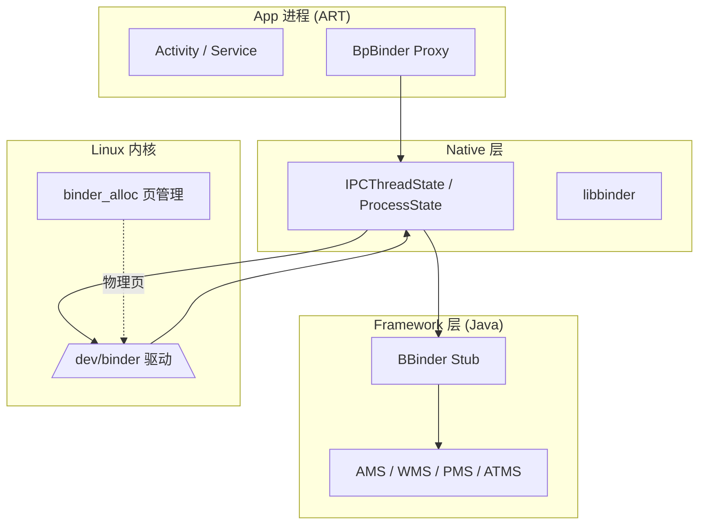
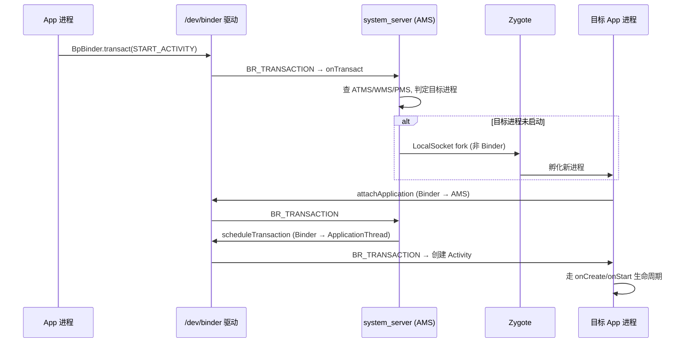

# Android Framework 架构与 Binder IPC 机理深度剖析

## 摘要

Android Framework 以 **Binder IPC** 为通信中枢,将应用进程、系统服务进程(`system_server` 中的 AMS/WMS/PMS/ATMS 等)与内核驱动有机串联。本文从系统启动与进程模型切入,逐层剖析 Binder 在内核态的**一次拷贝**、**异步空间约束**、**延迟回收(deferred gc)**机制,结合 AIDL 自动生成代码与 `ActivityManagerService` 启动 Activity 的真实跨进程调用链,揭示 Framework 各组件如何通过 Binder 协同工作,并讨论其性能与安全性设计取舍。全文引用路径均基于 AOSP 主线(`drivers/android/`、`frameworks/native/libs/binder/`、`frameworks/base/`)。

---

## 1 绪论

### 1.1 Android 软件栈分层

Android 自下而上分为 Linux 内核、HAL、Native(C/C++) 层、Framework(Java)层与 App 层。Framework 层并非一个单体进程,而是由**大量互相独立的系统服务进程**与**每个 App 独占的 ART 虚拟机进程**构成,跨进程通信是常态而非例外。

### 1.2 为什么 Framework 必须依赖 Binder

传统 IPC(管道、socket、共享内存)各有短板:Binder 提供了 Framework 多服务架构的刚需能力:

- **面向对象的 Client-Server 模型**:`handle` 即远程对象引用,驱动在传输中完成 `flat_binder_object` 的跨进程 handle 翻译。
- **一次拷贝(one-copy)**:发送端用户态数据经一次 `copy_from_user` 直接落入接收端物理页,省去传统「用户→内核→用户」的二次拷贝。
- **基于能力的权限**:驱动自动携带调用方 `PID/UID`(`binder_transaction_data.sender_pid / sender_euid`),服务端不可伪造对端身份。
- **同步调用 + 线程池 + 死亡通知**:天然适配 RPC 语义,`linkToDeath` 让引用方感知对端进程死亡。



---

## 2 进程模型与启动流程

### 2.1 init 与关键守护进程

内核启动后运行 `init`(`system/core/init/`),解析 `*.rc`(如 `system/core/rootdir/init.rc`),拉起 `ueventd`、`servicemanager`、`zygote`、`system_server` 等。其中 **`servicemanager` 是第一个 Binder 服务,固定占用 handle 0(context manager)**,即 `IServiceManager` 的全局注册表(`frameworks/native/cmds/servicemanager/`)。

### 2.2 Zygote:进程孵化的源头

`app_process`(`frameworks/base/cmds/app_process/app_main.cpp`)经 `AndroidRuntime` 启动 `ZygoteInit`(`frameworks/base/core/java/com/android/internal/os/ZygoteInit.java`)。Zygote 预加载 framework 类、资源与共享库,之后以 **fork** 方式孵化所有应用进程,从而获得 COW 共享内存与极快的启动速度(`frameworks/base/core/java/com/android/internal/os/Zygote.java` + JNI `com_android_internal_os_Zygote.cpp`)。

> 注意:**Zygote 孵化新进程走的是 `LocalSocket`(`ZygoteConnection`),不是 Binder**。因为 fork 期间持有锁时绝不能进入 Binder 驱动,否则极易死锁。

### 2.3 system_server 与系统服务注册

`system_server` 由 Zygote 通过 `forkSystemServer` 创建,在 `SystemServer.java`(`frameworks/base/services/java/com/android/server/SystemServer.java`)中启动 AMS/WMS/PMS/ATMS 等,并通过 `ServiceManager.addService(name, binder)` 把 stub 注册进 `servicemanager`。所有服务进程通过 `ProcessState::self()` 打开 `/dev/binder` 并 `mmap` 出内核分配区。

### 2.4 进程级 Binder 初始化

```cpp
// frameworks/native/libs/binder/ProcessState.cpp
ProcessState::ProcessState(const char* driver)
    : mDriverName(driver), mDriverFD(-1), mVMStart(MAP_FAILED) {
    mDriverFD = open(driver, O_RDWR | O_CLOEXEC);          // 打开 /dev/binder
    mVMStart = mmap(nullptr, BINDER_VM_SIZE, PROT_READ,
                    MAP_PRIVATE | MAP_NORESERVE, mDriverFD, 0); // mmap 映射区
    ioctl(mDriverFD, BINDER_VERSION, &version);
}
```

`ProcessState` 是**进程级单例**,负责设备打开、mmap 与线程池;`IPCThreadState` 是**线程级**,负责与驱动收发 `BC_*` / `BR_*` 命令。

---

## 3 Binder 通信模型与内核实现

### 3.1 用户态架构

| 角色 | 类 / 文件 | 职责 |
|------|-----------|------|
| 进程上下文 | `ProcessState` | 打开驱动、mmap、管理线程池 |
| 线程上下文 | `IPCThreadState` | `talkWithDriver()` 收发 `BC_*`/`BR_*` |
| Proxy | `BpBinder` | `transact()` 把请求发往驱动 |
| Stub 基类 | `BBinder` | `onTransact()` 处理请求 |

`binder_ioctl(BINDER_WRITE_READ)` 的真正处理函数是 `binder_ioctl_write_read`,它在用户态 `binder_write_read` 与内核间搬运数据;有写数据则进 `binder_thread_write` 解析 `BC_*`,有读缓冲则进 `binder_thread_read` 取待投递的 `BR_*`(无可读事务且非 `O_NONBLOCK` 时 `wait_event_interruptible` 挂起)。

### 3.2 一次拷贝与页表映射

核心矛盾:**接收端 buffer 在用户态是连续虚拟地址,但背后物理页是一页页 `alloc_page` 来的,内核态没有连续映射**。因此 `copy_from_user` 必须**按物理页切段、逐页临时映射、逐段拷贝**。

```c
// drivers/android/binder_alloc.c
unsigned long binder_alloc_copy_user_to_buffer(struct binder_alloc *alloc,
        struct binder_buffer *buffer, binder_size_t buffer_offset,
        const void __user *from, size_t bytes) {
    if (!check_buffer(alloc, buffer, buffer_offset, bytes))   // 边界校验,防越界
        return bytes;
    while (bytes) {
        struct page *page; pgoff_t pgoff; void *kptr;
        page = binder_alloc_get_page(alloc, buffer, buffer_offset, &pgoff); // 偏移→页
        size_t size = min_t(size_t, bytes, PAGE_SIZE - pgoff); // 按页切段
        kptr = kmap_local_page(page) + pgoff;                 // 临时内核映射
        unsigned long ret = copy_from_user(kptr, from, size); // 唯一一次拷贝
        kunmap_local(kptr);                                   // 立刻解除映射
        if (ret) return bytes - size + ret;
        bytes -= size; from += size; buffer_offset += size;
    }
    return 0;
}
```

这些物理页早在 buffer 分配阶段就被 `vm_insert_page` 映入接收端 VMA,所以拷完接收端用户态**直接可读**——这就是 Binder「一次拷贝」落到页表层面的完整实现。新内核(Todd Kjos 加固 patch,约 Linux 5.x)**删除了常驻内核映射与 `user_buffer_offset`**,改为逐页 `kmap_local_page` 临时映射,内核态几乎不留可写用户数据的映射窗口,显著降低攻击面。

### 3.3 异步空间与 BR_FAILED_REPLY

`mmap` 时 `alloc->free_async_space = alloc->buffer_size / 2`,即 **oneway 事务最多只占映射区一半**。分配时 `binder_alloc_new_buf_locked` 检查:

```c
if (is_async && alloc->free_async_space < size + sizeof(struct binder_buffer))
    return ERR_PTR(-ENOSPC);          // 异步空间耗尽
```

`-ENOSPC` 在 `binder_transaction` 中被翻成 `BR_FAILED_REPLY`。**关键:内核不自动重试**——oneway 是 fire-and-forget,错误码写入 `binder_thread_read` 返回流;空间只在接收端 `BC_FREE_BUFFER` 后由 `binder_alloc_free_buf` 归还 `free_async_space`。重试逻辑属于应用层(如 AIDL 生成代码对 `FAILED_TRANSACTION` 的捕获或应用退避重发),且必须等对端消费。

### 3.4 延迟释放:deferred work 与 LRU shrinker

需区分两类「延迟」:

- **(A) `binder_deferred_work`(进程级)**:`binder_release`(fd `.release`)并不立即释放,而是 `binder_defer_work(proc, BINDER_DEFERRED_RELEASE)`,把整个进程的 binder 资源回收挪到 workqueue(`binder_deferred_func`),避免在持 `mmap_lock`/文件锁的敏感上下文做重活。
- **(B) LRU + shrinker(页级 deferred gc)**:单个 buffer `BC_FREE_BUFFER` 释放时**物理页不立刻归还伙伴系统**,而是挂入全局 `binder_alloc_lru`;内存压力下由注册的 shrinker 回调 `binder_alloc_free_page` → `zap_page_range_single` 把页从接收进程 VMA unmap → `__free_page` 真正释放。这样避免了事务高频 alloc/free 页的抖动。

---

## 4 AIDL 自动生成代码机制

`.aidl` 经 `aidl` 工具生成 `IMyService.java`,包含:

- `DESCRIPTOR`:接口唯一标识(通常是全类名)。
- `TRANSACTION_xxx`:每个方法一个整型事务码。
- `Stub`(继承 `Binder`):服务端,`onTransact(code, data, reply, flags)` 用 `switch(code)` 分发,从 `data`(Parcel)解包入参、调用真正实现、把返回值写入 `reply`。
- `Proxy`(实现 `IMyService`):客户端,方法里 `data.writeInterfaceToken(DESCRIPTOR)` 后 `mRemote.transact(TRANSACTION_xxx, data, reply, flags)`。

`oneway` 关键字 → 生成代码设置 `FLAG_ONEWAY` → 内核走 `is_async = (tr->flags & TF_ONE_WAY)` 的异步半区(见 3.3)。同进程 `asInterface` 直接返回 stub 实现(省去 Binder 调用),跨进程则包一层 Proxy。

---

## 5 系统服务协作实例:Activity 启动的端到端 Binder 流转

以 `startActivity` 为例,全程多次跨进程 Binder 调用:



步骤拆解:

1. **App 侧**:`Activity.startActivity` → `Instrumentation` → `ActivityManager.getService().startActivity(...)`,经 `BpBinder` 的 `transact()` 跨进程调 AMS。
2. **AMS 侧**:在 binder 线程收到 `BR_TRANSACTION`,执行 `ActivityManagerService.startActivity`,内部跨 Binder 调 WMS(窗口)、PMS(权限)、ATMS(任务栈/生命周期状态机)。
3. **进程未启动**:AMS 通过 **Zygote 的 `LocalSocket`**(注意不是 Binder)请求 fork 目标进程。
4. **目标进程**:`ActivityThread.main()` → `attach()` 经 Binder 调 `AMS.attachApplication`,把自己注册进系统。
5. **回调度**:AMS 通过目标进程的 `ApplicationThread`(一个 Binder stub)`scheduleTransaction`,让 App 进程实例化 Activity 并走 `onCreate/onStart/onResume` 生命周期。

可见 Framework 的「启动一个界面」本质上是**一连串 Binder 事务的编排**,Binder 是贯穿其间的神经系统。

---

## 6 性能与安全性分析

### 6.1 性能

- **一次拷贝**对小消息极高效;但大块数据(如 `Bitmap`、`Ashmem`、`GraphicBuffer`)走**共享内存**,避免单次拷贝开销过大。Binder 事务数据上限约 **1MB**(`TransactionTooLargeException` 即 `data_size` 超缓冲),因此大负载必须走 `MemoryFile`/`ParcelFileDescriptor`。
- **异步半区**防止单个 oneway 发送方耗尽接收端全部映射,是一种轻量 DoS 防护。

### 6.2 安全性

- 驱动在 `binder_transaction` 中自动填充 `sender_pid`/`sender_euid`,服务端可据此做 `checkPermission` 等校验,**用户态无法伪造调用方身份**。
- `flat_binder_object` 的 handle 翻译在驱动内完成,跨进程引用无法被篡改指向其他服务。
- `linkToDeath` 提供死亡通知:`BR_DEAD_BINDER` 让引用方及时清理,避免悬空引用。

---

## 7 结论

Binder 不只是 IPC 机制,它是 Android Framework 的**通信骨架**。理解 Framework 必须同时理解三层咬合:**(1) 进程与启动模型**(init → Zygote fork → system_server 注册)、**(2) Binder 内核实现**(一次拷贝、异步空间、延迟回收)、**(3) AIDL 代码生成**(Stub/Proxy 的 `transact`/`onTransact` 语义)。三者缺一,便无法解释一次 `startActivity` 为何能在多个进程间精准协同。

---

## 参考文献(AOSP 路径)

- 内核:Binder 驱动与页管理 — `drivers/android/binder.c`、`binder_alloc.c`、`binder_alloc.h`
- Native 层:`frameworks/native/libs/binder/{IPCThreadState,BpBinder,ProcessState,IServiceManager}.cpp`
- JNI 桥接:`frameworks/base/core/jni/android_util_Binder.cpp`
- Framework(Java):`frameworks/base/core/java/android/app/{Activity,ActivityThread}.java`、`frameworks/base/core/java/com/android/internal/os/{ZygoteInit,Zygote}.java`
- 系统服务:`frameworks/base/services/java/com/android/server/SystemServer.java`、`frameworks/base/services/core/java/com/android/server/am/ActivityManagerService.java`、`.../wm/WindowManagerService.java`、`.../pm/PackageManagerService.java`
- 启动脚本:`system/core/rootdir/init.rc`、`frameworks/base/cmds/app_process/app_main.cpp`
