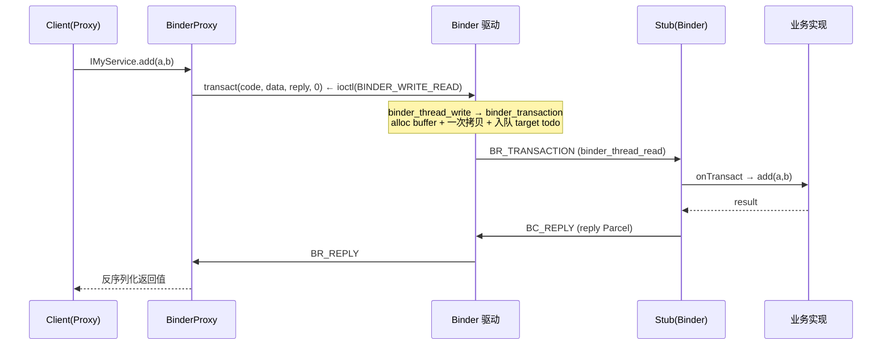

# Android Binder 与 AIDL 完全解析

> 面向 AOSP 代码层面的Binder核心流程 + AIDL 生成机制对照。
> 内核路径：`drivers/android/binder.c` / `drivers/android/binder_alloc.c`
> 用户态框架：`frameworks/native/libs/binder/*`、`frameworks/base/core/java/android/os/*`

---

## 1. 整体架构

Binder 是 Android 的 IPC 机制，采用 **C/S 模型 + 一次拷贝** 设计。AIDL（Android Interface Definition Language）是给 Binder IPC 生成「接口桩/代理」代码的工具，让开发者不用手写 `transact`/`onTransact` 的样板。

```mermaid
flowchart TD
    C[Client App] -->|调用 AIDL 接口方法| P[Proxy / BinderProxy]
    P -->|IBinder.transact(code, data, reply, flags)| K[(Binder 内核驱动)]
    K -->|BR_TRANSACTION| S[Stub / Binder]
    S -->|onTransact → 业务实现| IMPL[Service 真正实现]
    IMPL -->|return| S
    S -->|BC_REPLY| K
    K -->|BR_REPLY| P
    P -->|反序列化返回值| C
```

- **Proxy（代理 / 客户端）**：实现 AIDL 接口，把方法调用打包成 `Parcel`，通过 `IBinder.transact()` 发往驱动。
- **Stub（桩 / 服务端）**：继承 `Binder`，实现 `onTransact()` 的 `switch(code)` 分发，调用真正的业务方法。
- **Binder 驱动**：负责身份翻译、buffer 分配、一次拷贝、跨进程投递。

---

## 2. AIDL 的角色与编译产物

定义一个 `IMyService.aidl`：

```aidl
package com.example;

interface IMyService {
    int add(int a, int b);
    oneway void ping();           // oneway：异步、不返回
    void getInfo(in int id, out Info info);  // in/out 方向
}
```

构建系统（`aidl` 工具）会生成 `IMyService.java`，结构固定为：

| 生成物 | 说明 |
|--------|------|
| `interface IMyService extends IInterface` | 业务方法声明 + `Stub` / `Proxy` 内部类 |
| `IMyService.Stub extends Binder implements IMyService` | 服务端基类，含 `onTransact()` 分发 |
| `IMyService.Stub.Proxy implements IMyService` | 客户端代理，持有 `IBinder mRemote` |
| `DESCRIPTOR` 常量 | 接口唯一描述符字符串 |
| `TRANSACTION_* ` 常量 | 每个方法一个整数 `code` |

---

## 3. 生成代码解剖（节选 + 注释）

### 3.1 接口与 Stub（服务端）

```java
public interface IMyService extends android.os.IInterface {
    // 每个方法对应一个 transact code
    static final int TRANSACTION_add  = (android.os.IBinder.FIRST_CALL_TRANSACTION + 0);
    static final int TRANSACTION_ping = (android.os.IBinder.FIRST_CALL_TRANSACTION + 1);
    static final int TRANSACTION_getInfo = (android.os.IBinder.FIRST_CALL_TRANSACTION + 2);

    int add(int a, int b) throws android.os.RemoteException;
    void ping() throws android.os.RemoteException;
    void getInfo(int id, android.os.Info info) throws android.os.RemoteException;

    /** 服务端基类：继承 Binder，收到 BR_TRANSACTION 后由 onTransact 分发 */
    public static abstract class Stub extends android.os.Binder implements IMyService {
        private static final java.lang.String DESCRIPTOR = "com.example.IMyService";

        public Stub() { this.attachInterface(this, DESCRIPTOR); }

        /** 客户端拿到 IBinder 后，用 asInterface 决定返回 Proxy 还是 Stub 本身 */
        public static IMyService asInterface(android.os.IBinder obj) {
            if (obj == null) return null;
            // 同进程：直接返回本地 Stub（不走驱动）；跨进程：包一层 Proxy
            android.os.IInterface iin = obj.queryLocalInterface(DESCRIPTOR);
            if (iin != null && iin instanceof IMyService) return (IMyService) iin;
            return new IMyService.Stub.Proxy(obj);
        }

        @Override
        public android.os.IBinder asBinder() { return this; }

        /** 驱动投递 BR_TRANSACTION 后，框架回调这里；code 决定调哪个方法 */
        @Override
        public boolean onTransact(int code, android.os.Parcel data,
                                  android.os.Parcel reply, int flags)
                throws android.os.RemoteException {
            switch (code) {
                case INTERFACE_TRANSACTION:
                    reply.writeString(DESCRIPTOR); return true;
                case TRANSACTION_add: {
                    data.enforceInterface(DESCRIPTOR);
                    int a = data.readInt();
                    int b = data.readInt();
                    int result = this.add(a, b);   // 调真实业务
                    reply.writeNoException();
                    reply.writeInt(result);        // 结果写回 reply Parcel
                    return true;
                }
                case TRANSACTION_ping: {
                    data.enforceInterface(DESCRIPTOR);
                    this.ping();                    // oneway：不写 reply
                    return true;
                }
                // ... getInfo 处理 in/out 方向 ...
            }
            return super.onTransact(code, data, reply, flags);
        }
    }
}
```

### 3.2 Proxy（客户端）

```java
private static class Proxy implements IMyService {
    private android.os.IBinder mRemote;   // BinderProxy 实例
    Proxy(android.os.IBinder remote) { mRemote = remote; }

    @Override public android.os.IBinder asBinder() { return mRemote; }

    @Override
    public int add(int a, int b) throws android.os.RemoteException {
        android.os.Parcel data  = android.os.Parcel.obtain();
        android.os.Parcel reply = android.os.Parcel.obtain();
        int result;
        try {
            data.writeInterfaceToken(DESCRIPTOR);
            data.writeInt(a);
            data.writeInt(b);
            // 关键：封包后经 Binder 驱动跨进程调用
            mRemote.transact(Stub.TRANSACTION_add, data, reply, 0);
            reply.readException();
            result = reply.readInt();
        } finally {
            data.recycle(); reply.recycle();
        }
        return result;
    }

    @Override
    public void ping() throws android.os.RemoteException {
        android.os.Parcel data = android.os.Parcel.obtain();
        data.writeInterfaceToken(DESCRIPTOR);
        // FLAG_ONEWAY → 驱动走异步半区，无 BR_REPLY 返回
        mRemote.transact(Stub.TRANSACTION_ping, data, null,
                         android.os.IBinder.FLAG_ONEWAY);
        data.recycle();
    }
}
```

---

## 4. 传输协议要点

### 4.1 transact code
- 方法 → 整数 `code`（`FIRST_CALL_TRANSACTION` 起递增），`onTransact` 用 `switch(code)` 路由。
- `INTERFACE_TRANSACTION` 用于 `queryLocalInterface` / `asBinder` 探活。

### 4.2 Parcel（数据载体）
- `Parcel` 是 Binder 专用的序列化缓冲区，对应内核里 `binder_transaction_data` 的 `data.ptr.buffer`。
- 一次 IPC：**所有 in 参数进 `data`，out 返回值进 `reply`**。
- `writeToParcel` / `readFromParcel` 在自定义 `Parcelable` 上实现。

### 4.3 方向符 `in / out / inout`
| 方向 | 语义 | 传输行为 |
|------|------|----------|
| `in`  | 仅入参 | 调用方 → 服务端，单向拷贝 |
| `out` | 仅出参 | 服务端写回，客户端初始为空 |
| `inout` | 双向 | 进、出各拷贝一次 |

### 4.4 `oneway`
- AIDL 方法加 `oneway` → 调用端 `transact(..., FLAG_ONEWAY)`，驱动走 **异步事务**：
  - 占用 `free_async_space`（= 映射区一半，见 `binder_alloc_new_buf`）。
  - 不返回 `BR_REPLY`，无阻塞等待。
  - 空间不足 → `ENOSPC` → `BR_FAILED_REPLY` → 用户态 `FAILED_TRANSACTION`（**内核不重试**）。

---

## 5. 完整调用链路（与内核流程衔接）



内核侧对照（详见《Binder 核心代码注释 流程》）：
1. `IPCThreadState::transact` → `writeTransactionData` → `talkWithDriver`
2. `ioctl(BINDER_WRITE_READ)` → `binder_ioctl_write_read`
3. `binder_thread_write`（解析 `BC_TRANSACTION`）→ `binder_transaction`
4. `binder_alloc_new_buf` 分配 buffer；`binder_alloc_copy_user_to_buffer` **一次拷贝**
5. 事务入队 `target_proc->todo`，`binder_wakeup_thread` 唤醒服务端
6. 服务端 `binder_thread_read` 取 `BR_TRANSACTION` → 用户态 `executeCommand` → `Stub.onTransact`
7. `BC_REPLY` 沿同一路径回客户端 → `BR_REPLY` → `transact()` 返回

---

## 6. 关键方法对照表

| 用户态 | 内核对应 | 作用 |
|--------|----------|------|
| `IBinder.transact()` | `binder_ioctl(BINDER_WRITE_READ)` | 发起 IPC |
| `Binder.onTransact()` | `binder_thread_read` 的 `BR_TRANSACTION` 分支 | 服务端分发 |
| `Parcel` | `binder_transaction_data.data` | 序列化缓冲区 |
| `asInterface` / `queryLocalInterface` | — | 进程内直连 / 跨进程包 Proxy |
| `linkToDeath` | `binder_thread_write(BC_REQUEST_DEATH_NOTIFICATION)` | 监听对端死亡 |
| `FLAG_ONEWAY` | `TF_ONE_WAY` → `is_async` | 异步事务、半区限制 |

---

## 7. 常见陷阱

- **`TransactionTooLargeException`**：单次 IPC 的 `Parcel` 超过约 1 MB（binder 缓冲区限制），与 `free_async_space` 无关，需拆分或改用共享内存 / 文件。
- **oneway 异步耗尽**：高频 oneway 打满 `free_async_space` 会 `BR_FAILED_REPLY`，需等待对端 `BC_FREE_BUFFER` 归还空间。
- **跨进程对象传递**：`flat_binder_object` 在 `binder_transaction` 里被翻译成对端 `handle`（即另一个 Binder 引用），这是 Binder「能把 Binder 当参数传」的原理。
- **线程池**：服务端 `IPCThreadState` 会起 `binder` 线程池（`spawnPooledThread`）并行处理多个事务，避免单线程阻塞。

---

## 8. 速查路径

| 关注点 | 文件 |
|--------|------|
| 驱动主逻辑 | `drivers/android/binder.c` |
| buffer / 物理页 / LRU | `drivers/android/binder_alloc.c` |
| 用户态 IPC 循环 | `frameworks/native/libs/binder/IPCThreadState.cpp` |
| BpBinder / BinderProxy | `frameworks/native/libs/binder/BpBinder.cpp` |
| Java 层 Binder | `frameworks/base/core/java/android/os/Binder.java` |
| Java 层 Parcel | `frameworks/base/core/java/android/os/Parcel.java` |
| AIDL 工具 | `frameworks/base/tools/aidl/` |
