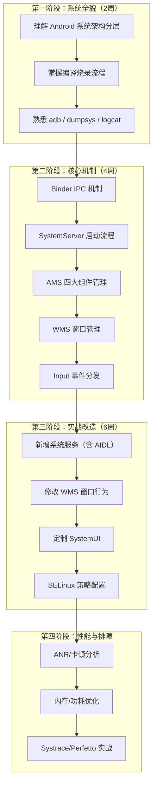
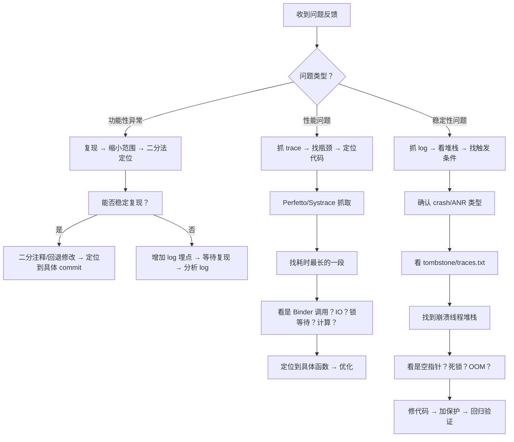
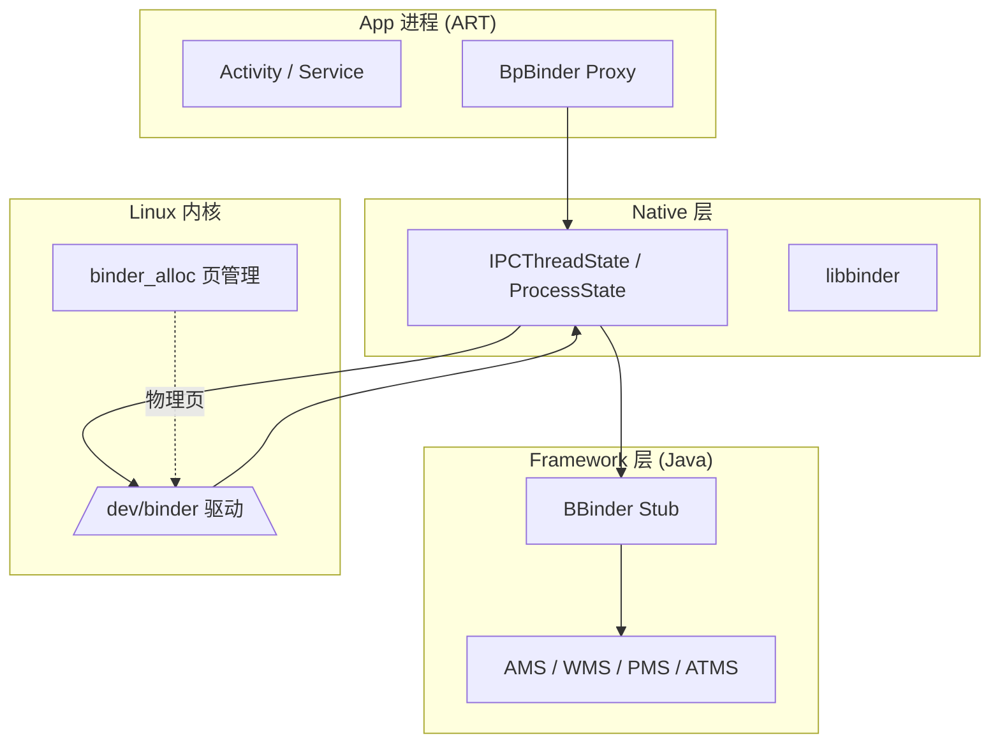
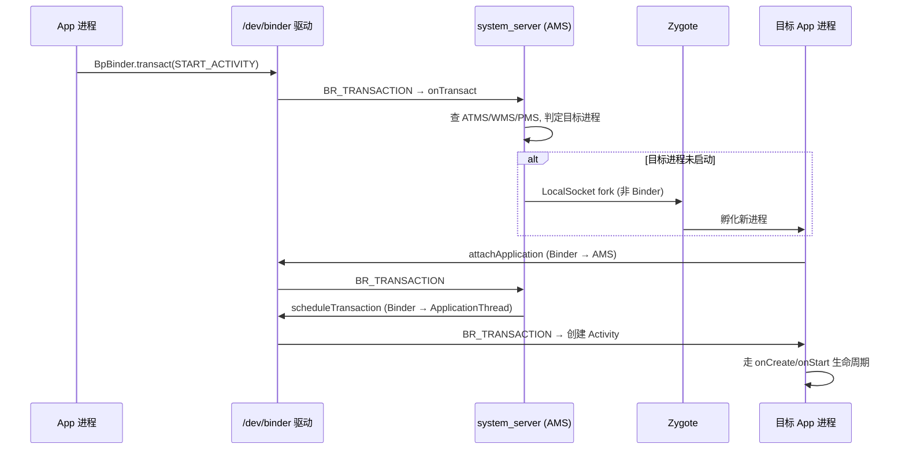
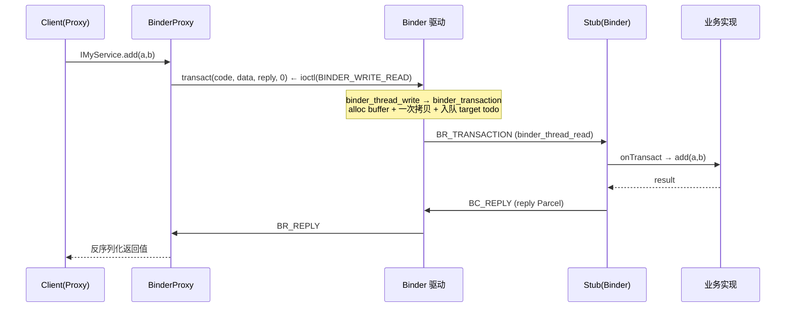
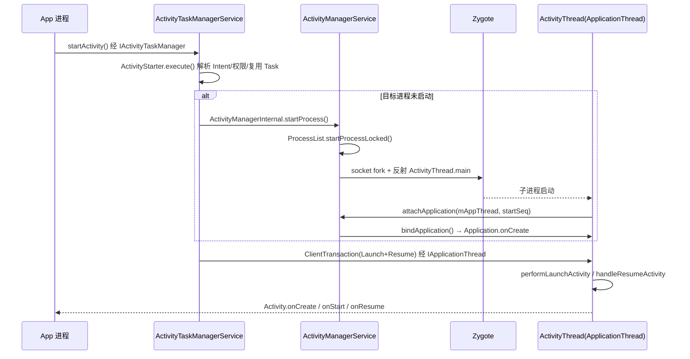
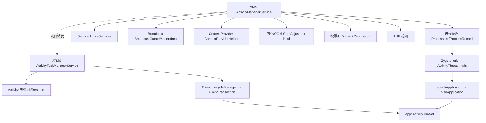
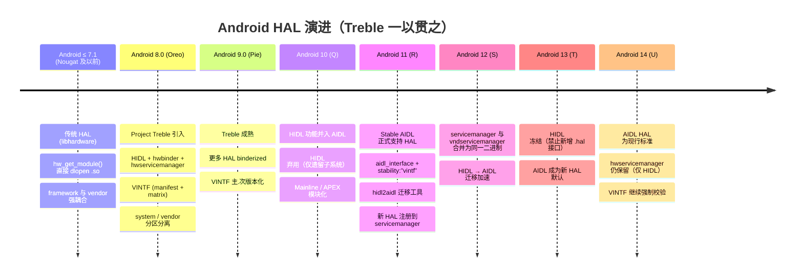
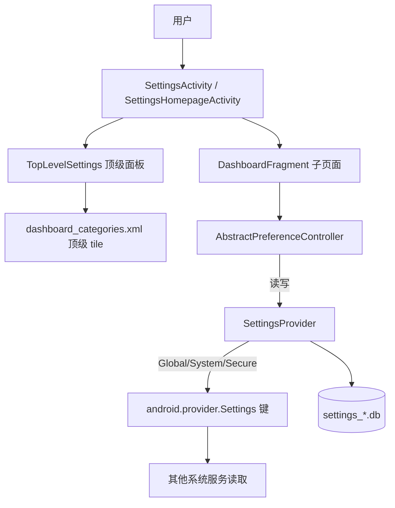

# AOSP 14 Framework 学习笔记 · 导出合集

> 自动合并生成于脚本 `_export_build.py`。本合集汇总工作区全部 Framework 学习 Markdown 笔记，按学习路线图分章。
> 适用版本：Android 14 (API 34, UpsideDownCake)。

## 目录

### 一、总览与路线图
- [app_to_framework_guide.md](app_to_framework_guide.md)
- [framework_index_aosp14.md](framework_index_aosp14.md)
- [android_framework_paper.md](android_framework_paper.md)
### 二、编译烧录
- [android14_build.md](android14_build.md)
- [aosp-build-guide.md](aosp-build-guide.md)
### 三、Binder / AIDL
- [binder_aidl.md](binder_aidl.md)
### 四、AMS / 四大组件
- [ams_deep_dive.md](ams_deep_dive.md)
- [ams_modify_practice.md](ams_modify_practice.md)
### 五、HAL / 外设适配
- [hal_android14.md](hal_android14.md)
- [hal_version_history.md](hal_version_history.md)
- [hal_example_android14.md](hal_example_android14.md)
- [hal_learning_roadmap.md](hal_learning_roadmap.md)
### 六、Settings / 系统裁剪
- [framework_settings_analysis.md](framework_settings_analysis.md)
- [settings_modify_practice.md](settings_modify_practice.md)
### 七、WMS 窗口管理
- [wms_deep_dive.md](wms_deep_dive.md)
### 八、Input 事件分发
- [input_deep_dive.md](input_deep_dive.md)
### 九、SystemUI 定制
- [systemui_customization.md](systemui_customization.md)
### 十、SELinux 策略
- [selinux_policy.md](selinux_policy.md)
### 十一、性能 / 排障 (Perfetto/ANR)
- [perfetto_anr_troubleshooting.md](perfetto_anr_troubleshooting.md)
### 十二、新增纯系统服务 (含 AIDL)
- [system_service_aidl.md](system_service_aidl.md)


---

# 一、总览与路线图


## app_to_framework_guide.md


# APP 开发者转 Android Framework 开发：破局指南

> **校订说明（2026-07-23）：** 本文件由原始分享文档留存至工作区，并按 **AOSP 14（UpsideDownCake, API 34）** 做了 3 处校订（见文内 `【AOSP 14 校订】` 标注），文末新增「附录 A：与现有笔记的对照与缺口」整合章节，将本指南路线图与本工作区已沉淀的深读笔记逐一对应。原文核心观点与路线图保持原样。
>
> **适用人群：** 有 2-5 年 APP 开发经验，想转型 Framework 系统开发的工程师  
> **核心观点：** Framework 不是"源码阅读课"，而是**系统定制能力**——你能改什么、怎么改、改了怎么验证  
> **目标定位：** 车载 / 工控 / TV / 手机等 Android 系统定制厂商的 Framework 开发岗位

---

## 目录

- [痛点一：不知道 Framework 学了能干啥](#痛点一不知道-framework-学了能干啥)
- [痛点二：不知道怎么学、学什么](#痛点二不知道怎么学学什么)
- [痛点三：分析源码时被卡住](#痛点三分析源码时被卡住)
- [痛点四：学了记不住、无法用于实战](#痛点四学了记不住无法用于实战)
- [痛点五：工作中 Framework 问题不会排查](#痛点五工作中-framework-问题不会排查)
- [附录 A：与现有笔记的对照与缺口（AOSP 14 实战清单）](#附录-a与现有笔记的对照与缺口aosp-14-实战清单)

---

## 痛点一：不知道 Framework 学了能干啥

### 核心误区

> 大多数 APP 开发者以为学 Framework = 看源码、画流程图、背调用链。  
> **这是最大的误解。** Framework 开发的核心不是"看懂"，而是**"能改"**。

### Framework 开发到底做什么？

Framework 开发 = **对 AOSP 源码进行二次定制**，具体包括：

| 实际工作内容 | 对应能力 | 例子 |
|-------------|----------|------|
| **新增系统服务** | 理解 Binder IPC、SystemServer 启动流程 | 车载项目新增"车身信息管理服务"，APP 通过 AIDL 获取车速、油量 |
| **修改系统行为** | 理解 AMS/WMS/PMS 内部逻辑 | 修改 Launcher 多任务切换动画、禁用某个系统对话框 |
| **适配硬件外设** | 理解 HAL 层、JNI | 适配 CAN 总线、串口屏、自定义按键板 |
| **裁剪/定制系统** | 理解编译系统、分区、SELinux | 移除不需要的系统应用、定制 Settings 菜单项 |
| **性能/稳定性优化** | 理解系统启动流程、ANR/卡顿机制 | 优化开机速度、解决系统服务 ANR |
| **安全策略配置** | 理解 SELinux、权限模型 | 为新增硬件节点配置 sepolicy |

### 一句话总结

> **APP 开发 = 在 Android 提供的框框里写业务逻辑**  
> **Framework 开发 = 修改这个框框本身**

### 学了 Framework 的职业价值

| 价值 | 说明 |
|------|------|
| **不可替代性** | APP 开发者供给过剩，Framework 开发者稀缺（尤其是车载/工控领域） |
| **薪资溢价** | 系统开发岗通常比同级别 APP 开发高 30-50% |
| **技术深度护城河** | 底层能力积累不会因上层框架迭代而过时（Flutter/Compose 怎么变，Binder 还是 Binder） |
| **向上发展空间** | Framework → HAL → Kernel 是清晰的技术深挖路线 |

---

## 痛点二：不知道怎么学、学什么

### 核心问题

> 很多人学 Framework 的方式是：打开 AOSP 源码 → 从 `main` 函数开始读 → 三天后放弃。  
> **错误的学习方式 = 按代码执行顺序读源码。**  
> **正确的学习方式 = 以问题驱动，按"改"的目的去"读"。**

### Framework 学习路线图



### 每个阶段学什么、怎么验证

**第一阶段：系统全貌（目标：能把源码编译出来刷进去）**

| 学习内容 | 验证方式 | 耗时 |
|----------|----------|------|
| Android 架构分层（APP/Framework/HAL/Kernel） | 能画出分层图，说出每层作用 | 1 天 |
| AOSP 源码下载（repo init/sync） | 成功下载一套源码 | 1 天（看网速） |
| lunch + make 编译 | 成功编译出系统镜像 | 1 天 |
| fastboot 刷机 | 成功刷入并开机 | 1 天 |
| adb shell / logcat / dumpsys | 能查看当前焦点窗口、Activity 栈 | 3 天 |

**关键提醒：** 第一阶段最大的坑是**编译环境**。如果公司已有编译服务器直接用，个人学习建议 Ubuntu 20.04/22.04，内存 >= 32G，硬盘 >= 500G SSD。

**第二阶段：核心机制（目标：能看懂 dumpsys 输出，知道每个服务干什么）**

> **学习方法：每个模块按"是什么 → 怎么用 → 核心流程 → 关键代码"四步走。**

| 模块 | 是什么 | 怎么用（dumpsys 命令） | 核心流程 | 关键代码 |
|------|--------|----------------------|----------|----------|
| **Binder** | Android IPC 核心 | `dumpsys binder` | client→驱动→server 通信 | `IPCThreadState.cpp`, `binder.c` |
| **SystemServer** | 系统服务启动入口 | `ps -A \| grep system_server` | main→startBootstrapServices→startOtherServices | `SystemServer.java` |
| **AMS** | 四大组件管理 | `dumpsys activity activities` | startActivity→进程创建→生命周期 | `ActivityManagerService.java` |
| **WMS** | 窗口管理 | `dumpsys window windows` | addWindow→relayout→Surface 分配 | `WindowManagerService.java` |
| **Input** | 输入事件分发 | `dumpsys input` | EventHub→InputReader→InputDispatcher→APP | `InputDispatcher.cpp`（native 层 `frameworks/native/services/inputflinger/`） |

**第三阶段：实战改造（目标：能独立完成一个 Framework 修改需求）**

这是最关键也最容易被跳过的阶段。**不写代码永远学不会。**

推荐实战项目（按难度排序）：

| 项目 | 难度 | 涉及知识点 | 预计耗时 |
|------|------|-----------|----------|
| 1. 用 `service` 命令写一个 shell 脚本调试系统服务 | ★☆☆☆☆ | service 命令、系统服务生命周期 | 2h |
| 2. 修改 Settings 数据库默认值（如默认亮度） | ★★☆☆☆ | SettingsProvider、defaults.xml | 4h |
| 3. 新增一个系统 API（hide → public） | ★★☆☆☆ | SDK 编译、@hide 注解 | 4h |
| 4. 禁止某个系统对话框弹出 | ★★★☆☆ | WMS/PMS 源码阅读 + 修改 | 1d |
| 5. 新增一个系统服务（含 AIDL） | ★★★★☆ | Binder、SystemServer、AIDL、SELinux | 3d |
| 6. 修改 Launcher 多任务切换动画 | ★★★★☆ | ShellTransition、SurfaceControl | 3d |
| 7. 适配一个外设（如自定义按键板） | ★★★★★ | InputReader、kl/kcm 文件、HAL | 5d |

**第四阶段：性能与排障（目标：能独立定位系统级性能问题）**

| 技能 | 工具 | 练习方式 |
|------|------|----------|
| ANR 分析 | traces.txt + dumpsys | 故意制造 ANR，练习从 trace 定位根因 |
| 卡顿分析 | Perfetto / Systrace | 抓 trace，找主线程阻塞点 |
| 内存分析 | dumpsys meminfo + MAT | 分析 system_server 内存占用 |
| 启动速度 | bootanimation 时间分析 | 优化开机自启动服务 |

---

## 痛点三：分析源码时被卡住

### 为什么会被卡住？

> 大多数人的源码分析方式是**线性阅读**：从入口函数开始，逐行往下读。  
> 而 AOSP 的特点是**深度嵌套 + 跨进程 + 多线程**，线性阅读必然卡死。

### 正确的源码分析方法

**方法一：从 dumpsys 输出反推源码**

```bash
# 不要从 main 函数开始读！
# 先从 dumpsys 的输出入手

# 例：想理解 Activity 启动流程
adb shell dumpsys activity activities
# 输出中有 ActivityRecord、Task、ProcessRecord 等信息
# → 搜 ActivityRecord 的构造、Task 的创建 → 反推调用链
```

**方法二：用 log 驱动，而非用代码驱动**

```java
// 在你关心的代码路径上加 log
// frameworks/base/services/core/java/com/android/server/wm/WindowManagerService.java

// 加带明确前缀的 log
Slog.d("MY_DEBUG", "relayoutWindow: " + client + ", requestedWidth=" + requestedWidth);

// 编译 → 刷机 → 操作 → 看 log
adb logcat | grep "MY_DEBUG"
```

**加 log 比读代码效率高 10 倍**，因为你能看到**真实的运行时调用顺序**。

**方法三：用 IDE 导入源码做代码跳转（Android 14 推荐 AIDEgen）**

> 【AOSP 14 校订】官方主推 **AIDEgen**（基于 IntelliJ/AS 索引），`idegen` 虽仍可跑但官方已转向 AIDEgen，对 `frameworks/base` 全量大仓的全局搜索/跳转更稳、索引更快。

```bash
# 方式 A（推荐，Android 14）：AIDEgen 生成 Android Studio / IntelliJ 工程
source build/envsetup.sh
lunch aosp_x86_64-eng
m aidegen            # 先编译 aidegen 模块
aidegen frameworks/base -i s   # -i s = 生成 Android Studio 工程；-i j = IntelliJ
# 生成的工程可直接打开，支持全局搜索 / 跳转定义

# 方式 B（遗留，仍可用）：idegen
m idegen
development/tools/idegen/idegen.sh
# 用 Android Studio 打开生成的 android.ipr
```

**方法四：掌握关键搜索模式**

| 你想找 | 搜索关键词 |
|--------|-----------|
| 某个系统服务的实现 | `extends IXXX.Stub` |
| 某个 Binder 接口的调用方 | `XXX.Stub.Proxy` |
| SystemServer 中注册的服务 | `startBootstrapServices` / `startOtherServices` |
| init.rc 中启动的 native 服务 | `service xxx /system/bin/` |
| SELinux 规则 | `grep -r "服务名" system/sepolicy/` |

**方法五：绘制调用栈而非读代码**

拿到一个流程，不要逐行读源码，而是：

1. 先通过 dumpsys/log 确定**关键函数名**
2. 用 Android Studio / AIDEgen 找到每个关键函数
3. 记录：**函数名 → 所在文件 → 关键参数 → 返回值 → 下一步调用**
4. 整理成调用链，而不是记住每一行代码

```
// 示例：Activity 启动的调用链笔记（不是每行代码！）

startActivity()
  → ActivityTaskManagerService.startActivity()     // 权限检查、Intent 解析
    → ActivityStarter.execute()                     // 创建 ActivityRecord
      → ActivityStarter.startActivityUnchecked()    // 决定启动模式
        → RootWindowContainer.resumeFocusedTasks()  // 暂停当前 Activity
          → ActivityTaskSupervisor.startPausingLocked()  // 【AOSP 14 校订】原文档写 ActivityStack.startPausingLocked()
            → Task.startPausingLocked()                  // Android 11 起 ActivityStack 已重命名为 Task（同包 com/android/server/wm/）
              → ClientLifecycleManager.scheduleTransaction() // Binder 通知 APP（生命周期新机制，见附录 A 链接）
```

> 【AOSP 14 校订】`ActivityStack` 与 `ActivityStackSupervisor` 在 **Android 11（R）** 重构为 `Task` 与 `ActivityTaskSupervisor`，暂停逻辑入口为 `ActivityTaskSupervisor.startPausingLocked(...)` → `Task.startPausingLocked(...)`。照原文在 14 源码里搜 `ActivityStack.startPausingLocked` 会扑空。

---

## 痛点四：学了记不住、无法用于实战

### 核心问题

> 记不住 = 没有建立**索引**。  
> 无法用于实战 = 没有建立**从需求到方案的映射**。

### 建立知识索引，而非记忆细节

你不需要记住 `ActivityStarter.execute()` 的第 137 行是什么。你需要记住的是：

| 当遇到这个需求时 | 我应该去哪个文件、哪个函数 |
|-----------------|--------------------------|
| 修改开机动画 | `frameworks/base/cmds/bootanimation/` |
| 修改默认亮度 | `frameworks/base/packages/SettingsProvider/res/values/defaults.xml` |
| 禁止某个权限 | `frameworks/base/services/core/java/com/android/server/pm/permission/` |
| 修改音量调节步长 | `frameworks/base/services/core/java/com/android/server/audio/AudioService.java` |
| 修改输入法弹出动画 | `frameworks/base/services/core/java/com/android/server/wm/WindowManagerService.java` |
| 修改状态栏图标 | `frameworks/base/packages/SystemUI/`（12+ 状态栏核心类由 `StatusBar` 重命名为 `CentralSurfaces`） |
| 新增系统属性 | `system.prop` 或 `build/make/target/` 下的 mk 文件 |

### 建立从需求到方案的映射

拿到一个需求后，按这个模板思考：

```
1. 需求是什么？（一句话）
2. 影响哪个系统服务？（AMS/WMS/PMS/Input/...）
3. 这个服务在哪个文件？
4. 在哪个环节插入/修改逻辑？（初始化？运行时？回调？）
5. 需要什么权限？（系统签名？SELinux？root？）
6. 怎么验证？（dumpsys 看什么？log 打什么？adb 命令是什么？）
```

### 实操建议：建立自己的 Framework 笔记库

```markdown
# 个人 Framework 笔记模板

## 需求：修改多任务键行为为返回桌面

### 方案速查
- 改动层级：PhoneWindowManager (Framework)
- 难度：★★☆☆☆
- 涉及文件：1 个

### 改动点
- 文件：frameworks/base/services/core/java/com/android/server/policy/PhoneWindowManager.java
- 函数：interceptKeyBeforeQueueing()
- 修改：将 KEYCODE_APP_SWITCH 的事件处理改为 launchHome()

### 验证方法
- adb shell input keyevent KEYCODE_APP_SWITCH
- 观察是否回到桌面

### 踩坑记录
- 注意区分长按和短按：KeyEvent.getRepeatCount()
- 需要在车载模式下禁用（通过系统属性判断）
```

---

## 痛点五：工作中 Framework 问题不会排查

### 排查方法论



### Framework 常用排障命令速查

```bash
# ============ 窗口/显示相关 ============
# 当前焦点窗口
adb shell dumpsys window | grep mCurrentFocus
# 完整窗口树
adb shell dumpsys window windows
# 屏幕信息
adb shell dumpsys window displays

# ============ Activity 相关 ============
# Activity 栈
adb shell dumpsys activity activities
# 当前前台 Activity
adb shell dumpsys activity top
# 进程信息
adb shell dumpsys activity processes

# ============ 输入相关 ============
# 输入设备列表
adb shell dumpsys input
# 当前焦点窗口和输入通道
adb shell dumpsys input | grep -A 10 "FocusedWindow"

# ============ 性能相关 ============
# ANR trace
adb shell ls /data/anr/
adb pull /data/anr/anr_xxx .
# 内存
adb shell dumpsys meminfo system_server
# CPU
adb shell top -n 1 | head -20

# ============ 服务相关 ============
# 列出所有运行中的系统服务
adb shell service list
# 调用某个服务（需要知道 transaction code）
# ⚠️【AOSP 14 校订】1599295570 这类 magic number 由 AIDL 自动生成、随 API level 变化，
# 硬编码在 Android 14/15 上可能失效。实战优先用 dumpsys / 正式 API / 反射，
# 或先 `adb shell service list` 确认服务名、再查对应 AIDL 的真实 transaction code。
adb shell service call activity 1599295570  # 例子（仅特定版本有效，勿硬编码）

# ============ Binder 相关 ============
# Binder 统计
adb shell cat /sys/kernel/debug/binder/stats
# Binder 事务日志
adb shell cat /sys/kernel/debug/binder/transaction_log

# ============ 日志相关 ============
# 抓 system_server 的 log
adb logcat -b main -b system -v threadtime | grep -E "system_server|WindowManager|ActivityManager"
# 抓 kernel log
adb shell dmesg
# 清除 log 缓冲区后抓
adb logcat -c && adb logcat -v threadtime > all_log.txt
```

### 典型排障场景速查

| 问题现象 | 第一反应 | 关键命令 | 常见根因 |
|----------|----------|----------|----------|
| **应用闪退** | 看 logcat crash 堆栈 | `adb logcat -b crash` | NPE、SecurityException、DeadObjectException |
| **界面卡死** | 看 ANR trace | `adb pull /data/anr/` | 主线程 Binder 超时、锁竞争、IO 阻塞 |
| **点击无响应** | 看 Input 状态 | `adb shell dumpsys input` | 焦点窗口不对、InputChannel 断连 |
| **开机卡 logo** | 看 boot log | `adb logcat -b all \| grep -E "Boot|SystemServer"` | 系统服务启动失败、SELinux 权限拒绝 |
| **界面黑屏** | 看 WMS + SF 状态 | `dumpsys window` + `dumpsys SurfaceFlinger` | Surface 未创建、Layer 不可见 |
| **内存泄漏** | 看 meminfo 趋势 | `adb shell dumpsys meminfo <pid>` | 窗口泄漏、Binder 代理未释放、注册未反注册 |
| **开机慢** | 抓 boot trace | Perfetto 抓取 boot 阶段 | 某个服务启动耗时过长、dex2oat |
| **WIFI/蓝牙打不开** | 看对应服务状态 | `adb shell dumpsys wifi` / `bluetooth_manager` | HAL 服务未启动、固件加载失败 |

### 最重要的排障思维：缩小范围

```
问题：整个系统某个行为异常

Step 1：是系统问题还是 APP 问题？
  → 换一个 APP 是否正常？ → 正常 → 是 APP 问题，不正常 → 是系统问题

Step 2：是代码问题还是配置问题？
  → 回退最近一次修改是否正常？ → 正常 → 是代码改动引入的

Step 3：是 Java 层还是 native 层？
  → logcat 有异常堆栈 → Java 层
  → dmesg 有异常 → kernel/native 层

Step 4：二分定位
  → 注释掉一半修改 → 问题消失 → 在这一半里
  → 重复二分 → 定位到具体修改
```

---

## 总结：给 APP 转 Framework 工程师的 10 条建议

1. **不要从"读完源码"开始，从"改一个东西"开始**——哪怕只是改默认亮度
2. **搭建编译环境是第一优先级**——不能编译刷机，学再多都是纸上谈兵
3. **dumpsys 是你最好的老师**——每个系统服务都有 dumpsys，先学会看输出，再去看源码
4. **加 log 比读源码效率高 10 倍**——看到真实的运行时调用顺序比什么都重要
5. **建立索引而非记忆**——记住"什么问题去哪个文件"，而不是记住每一行代码
6. **每个需求按模板记录**——需求→改动点→验证方法→踩坑记录，积累 20 个你就入门了
7. **Binder 是一切的基石**——花一周搞懂 Binder，后面的学习事半功倍
8. **SELinux 是新手第一道坎**——加了文件、加了服务权限不够，90% 是 SELinux 问题
9. **Perfetto 是排障利器**——学会抓 trace、读 trace，性能问题不再抓瞎
10. **找一套能跑的源码比什么都重要**——个人学习推荐 AOSP 模拟器 target，编译快、验证快

---

## 附录 A：与现有笔记的对照与缺口（AOSP 14 实战清单）

> 本附录把上文路线图与本工作区（Claw）已沉淀的 AOSP 14 深读笔记逐一对应。打 ✅ 的模块已有系统笔记可直接查阅，未打 ✅ 的按本指南路线图补即可。

### A.1 路线图 ↔ 工作区笔记 全景对照

| 指南路线图 | 工作区已有笔记 | 状态 | 关键 AOSP 14 落点 |
|---|---|---|---|
| 编译烧录（阶段一） | `android14_build.md` / `aosp-build-guide.md` | ✅ | `build/envsetup.sh` / `lunch` / `make` / `fastboot` |
| Binder IPC（阶段二） | `binder_aidl.md` | ✅ | `IPCThreadState.cpp` / `servicemanager` / AIDL |
| AMS / 四大组件 | `ams_deep_dive.md` / `ams_modify_practice.md` + `ams_patches/` | ✅ 深覆盖 | `ActivityManagerService.java` / `ClientLifecycleManager` / `TransactionExecutor` |
| HAL / 外设适配 | `hal_android14.md` / `hal_example_android14.md` / `hal_led_example/` | ✅ | AIDL HAL / `hwservicemanager` 退场 |
| Settings / 系统裁剪 | `framework_settings_analysis.md` / `settings_modify_practice.md` | ✅ | `SettingsProvider` / `defaults.xml` |
| WMS 窗口管理 | `wms_deep_dive.md` | ✅（本轮补齐） | `WindowManagerService.addWindow()` / `Task`（原 `ActivityStack`） |
| Input 事件分发 | `input_deep_dive.md` | ✅（本轮补齐） | `inputflinger`: `EventHub`→`InputReader`→`InputDispatcher` / `PhoneWindowManager.interceptKeyBeforeQueueing()` |
| SystemUI 定制 | `systemui_customization.md` | ✅（本轮补齐） | `CentralSurfaces`（原 `StatusBar`）/ `NavigationBar` / `QSPanel` |
| SELinux 策略 | `selinux_policy.md` | ✅（本轮补齐） | `system/sepolicy/` `public|private|vendor` / `audit2allow` |
| 性能/排障（Perfetto/ANR） | `perfetto_anr_troubleshooting.md` | ✅（本轮补齐） | `perfetto` / `/data/anr/` / `kill -3` |
| 新增纯系统服务（含 AIDL） | `system_service_aidl.md` | ✅（本轮补齐） | `IMyService.Stub` → `SystemServer.addService()` → SELinux |
| 速查索引（总表） | `framework_index_aosp14.md` | ✅ | 「需求→改动点」总索引 + 排障命令 |

### A.2 本指南里"需求→文件"索引表（第 241-249 行）的 AOSP 14 校订补充

原表路径在 14 上基本准确，仅补充两处易错点：

| 需求 | AOSP 14 落点 | 校订备注 |
|------|-------------|----------|
| 修改状态栏图标 | `frameworks/base/packages/SystemUI/` | 12+ 状态栏核心类 `StatusBar` 已重命名为 `CentralSurfaces` |
| 修改 Launcher 多任务切换动画 | `frameworks/base/` 的 ShellTransition / `SurfaceControl` | 12+ 动画走 `ShellTransitions`（`WindowContainerTransaction` + `RemoteAnimationRunner`），非旧 `AppTransition` |
| 禁止系统对话框 | `WMS` + `PhoneWindowManager` | 详见 `wms_deep_dive.md` 的"禁止对话框"实战 |

### A.3 按缺口优先级排的学习清单（基于本工作区现状）

1. **WMS**（已有 `wms_deep_dive.md`）：`dumpsys window windows` 读窗口树 → 跟 `addWindow` → 试"禁止某对话框"实战
2. **Input**（已有 `input_deep_dive.md`）：`getevent -l` 抓原始事件 → 改 `interceptKeyBeforeQueueing` → 配一个 `.kl` 映射
3. **SystemUI**（已有 `systemui_customization.md`）：`kill <pid>` 热重载验证 → 加一个 QuickSettings Tile
4. **SELinux**（已有 `selinux_policy.md`）：新增服务后 `audit2allow` 补策略 → 验证 `avc: denied`
5. **Perfetto/ANR**（已有 `perfetto_anr_troubleshooting.md`）：故意制造 ANR → 读 `/data/anr/` → `perfetto` 抓开机 trace
6. **纯系统服务**（已有 `system_service_aidl.md`）：按 AIDL→Stub→`SystemServer.addService`→SELinux→客户端 全链路写一个最小服务

> 本指南的核心主张（Framework = 能改系统本身，而非读源码）与本工作区"实战优先、给真实路径与 patch"的学习路线完全一致；上述 6 篇缺口笔记已把指南路线图后半段（WMS/Input/SystemUI/SELinux/Perfetto/纯系统服务）全部落到 AOSP 14 可下手的真实代码落点。

---

> **文档版本：** v1.0（原版）｜ v1.1（2026-07-23 留存 + AOSP 14 校订 + 整合附录 A）  
> **适用 AOSP 版本：** 13 / 14 / 15（校订以 14 为准）  
> **推荐编译环境：** Ubuntu 22.04, 32G+ RAM, 500G+ SSD, E5-2697A v4 级别 CPU  
> **推荐学习 target：** `aosp_x86_64-eng`（模拟器 target，编译快，验证快）


## framework_index_aosp14.md


# AOSP 14 Framework「需求 → 改动点」速查表（补全版）

> 基于《APP 开发者转 Framework 开发：破局指南》（已留存校订版 `app_to_framework_guide.md` v1.1），按 **Android 14 (API 34, UpsideDownCake)** 校订，并补全指南中缺失/薄弱的模块：WMS / Input / SystemUI / SELinux / Perfetto 排障 / 纯系统服务。
> 路径以 `android-14.0.0_rXX` 为准；个别类名随版本微调，以本地 AOSP checkout 为准。
> 用法：拿到需求先查「二、通用索引」，再按「一、缺口深挖」或「五、深读笔记」找真实文件 + 函数 + 验证命令。

---

## 〇、全景对照（路线图 vs 覆盖状态）

| 指南路线图 | 本工作区已有笔记 | 状态 | AOSP 14 入口（补缺用） | 深读笔记 |
|---|---|---|---|---|
| 编译烧录（阶段一） | `android14_build.md` / `aosp-build-guide.md` | ✅ | — | — |
| Binder IPC（阶段二） | `binder_aidl.md` | ✅ | — | — |
| AMS / 四大组件（阶段二/三） | `ams_deep_dive.md` / `ams_modify_practice.md` + `ams_patches/` | ✅ 深覆盖 | — | — |
| HAL / 外设适配 | `hal_android14.md` / `hal_example_android14.md` / `hal_led_example/` | ✅ | — | — |
| Settings / 系统裁剪 | `framework_settings_analysis.md` / `settings_modify_practice.md` | ✅ | — | — |
| WMS 窗口管理 | — | ✅ 已补 | `frameworks/base/services/core/java/com/android/server/wm/` | `wms_deep_dive.md` |
| Input 事件分发 | — | ✅ 已补 | `frameworks/base/services/core/java/com/android/server/input/` + native `inputflinger` | `input_deep_dive.md` |
| SystemUI 定制 | — | ✅ 已补 | `frameworks/base/packages/SystemUI/` | `systemui_customization.md` |
| SELinux 策略 | 仅 HAL 示例零星涉及 | ✅ 已补 | `system/sepolicy/` | `selinux_policy.md` |
| 性能/排障（Perfetto/ANR） | — | ✅ 已补 | `perfetto` / `/data/anr/` | `perfetto_anr_troubleshooting.md` |
| 新增纯系统服务（含 AIDL） | 仅 HAL-AIDL 示例 | ✅ 已补 | `services/core/java/com/android/server/` + `SystemServer` | `system_service_aidl.md` |

---

## 一、缺口模块深挖（真实路径 + 函数 + 验证）

### 1. WMS 窗口管理
- **核心类**
  - `frameworks/base/services/core/java/com/android/server/wm/WindowManagerService.java`：`addWindow()` / `relayoutWindow()` / `removeWindow()` / `performLayoutAndPlaceSurfacesLocked()`
  - `frameworks/base/services/core/java/com/android/server/wm/WindowState.java`：单个窗口状态
  - `frameworks/base/services/core/java/com/android/server/wm/Task.java`：**原 `ActivityStack`**（Android 11 重命名），生命周期/暂停逻辑在此协调
  - `frameworks/base/services/core/java/com/android/server/wm/RootWindowContainer.java`：`resumeHomeActivity()` / `getTopDisplayFocusedRootTask()`
  - `frameworks/base/core/java/android/view/SurfaceControl.java`：native surface 句柄
  - native：`frameworks/native/services/surfaceflinger/`（SurfaceFlinger）
- **常见需求**
  - 禁止某类系统对话框：在 `WMS.addWindow()` 按 `WindowManager.LayoutParams.type`（`TYPE_SYSTEM_ALERT` / `TYPE_SYSTEM_DIALOG` / `TYPE_APPLICATION_OVERLAY`）拦截，或改 `PhoneWindowManager`
  - 修改窗口/转场动画：`WMS` 动画 + `RemoteAnimationRunner` / `ShellTransition`
  - 改默认分辨率/密度：`WMS` + `DisplayManager` + `ro.sf.lcd_density`（build.prop）
- **验证**：`adb shell dumpsys window windows` / `dumpsys window displays` / `dumpsys SurfaceFlinger`

### 2. Input 事件分发
- **核心类**
  - `frameworks/base/services/core/java/com/android/server/input/InputManagerService.java`
  - native：`frameworks/native/services/inputflinger/` → `InputDispatcher.cpp`（分发策略/焦点）、`InputReader.cpp`（读设备/映射）、`EventHub.cpp`（设备枚举/事件读取）
  - `frameworks/base/core/java/android/view/InputChannel.java` / `InputEventReceiver.java`
- **按键拦截**：`PhoneWindowManager.interceptKeyBeforeQueueing(KeyEvent, int)`（入队前）/ `interceptKeyBeforeDispatching()`（分发前）
- **外设（自定义按键板）**：`frameworks/base/data/keyboards/*.kl`（scancode→keycode 映射）、`*.kcm`（key char map）；必要时加 `InputReader` 子 reader
- **验证**：`adb shell dumpsys input` / `adb shell getevent -l`（看原始事件）/ `adb shell input keyevent KEYCODE_XXX`

### 3. SystemUI 定制
- **目录**：`frameworks/base/packages/SystemUI/`
- 状态栏：`src/com/android/systemui/statusbar/phone/CentralSurfaces.java`（**Android 12+ 由 `StatusBar` 重命名**，实现类 `CentralSurfacesImpl`）
- 导航栏：`src/com/android/systemui/navigationbar/NavigationBarController.java` / `NavigationBar.java`
- 通知：`src/com/android/systemui/statusbar/notification/`
- 快速设置：`src/com/android/systemui/qs/QSPanel.java` / `QuickQSPanel.java` / `QSTileHost.java`
- 锁屏：`src/com/android/systemui/keyguard/`
- **验证**：改写后 `make SystemUI` + `adb install -r`，或整编；`adb shell kill <systemui_pid>` 让其重启；`dumpsys activity services SystemUI` 看状态

### 4. SELinux 策略
- **目录**：`system/sepolicy/` → `public/`（跨版本稳定类型/属性）、`private/`（平台私有）、`vendor/`（厂商）、`prebuilts/api/<ver>/`（版本快照）
- **关键文件**：`file_contexts`（文件→type）、`service_contexts`（binder 服务名→domain）、`hwservice_contexts`（hwbinder）、`property_contexts`（系统属性）、`seapp_contexts`（app 进程 domain）
- **新增 native 服务/节点的典型步骤**：
  1. `file_contexts` 打 label：`/system/bin/myservice u:object_r:myservice_exec:s0`
  2. 新建 `myservice.te`：`type myservice, domain; type myservice_exec, exec_type, file_type;` + `init_daemon_domain(myservice)`
  3. binder 服务：`service_contexts` 加 `myservice u:object_r:myservice_service:s0`，`.te` 里 `binder_service(myservice)` + allow 规则
  4. `make sepolicy` 或整编；`adb shell dmesg | grep avc` / `logcat | grep avc` 查拒绝，用 `audit2allow` 仅作调试参考
- **注意**：`neverallow` 很严；userdebug/eng 可 `setenforce 0` 临时验证是否 SELinux 拦截

### 5. Perfetto / ANR 排障
- **Perfetto**：`adb shell perfetto -o /data/misc/perfetto-traces/trace.pftrace -t 10s sched freq idle am wm gfx view binder`（按需选 datasource）→ `adb pull` → 用 `https://ui.perfetto.dev` 打开
- **systrace**：`frameworks/native/cmds/atrace/`；`python systrace.py` 已 deprecated，优先 perfetto
- **ANR**：`adb shell ls /data/anr/` → `anr_<pid>_<时间戳>`；或 `adb bugreport` 收集；`adb shell kill -3 <pid>` 触发 Java 线程栈 dump 到 logcat
- **主线程阻塞**：perfetto 里看 `am`/`wm` 与 Binder 事务耗时；`adb shell am hang` 可制造等待
- **内存**：`adb shell dumpsys meminfo system_server`（或 `<pkg>`）；泄漏看趋势 + `binder` 代理数

### 6. 新增纯系统服务（含 AIDL）
1. **定义 AIDL**：`frameworks/base/core/java/android/os/IMyService.aidl`，接口方法如 `void doSomething();`；公开 SDK 则去掉 `@hide` 走 API 审核，否则 `@hide`
2. **实现**：`frameworks/base/services/core/java/com/android/server/MyService.java` `extends IMyService.Stub`（可同时 `extends SystemService` 接入生命周期）
3. **注册**：`SystemServer.startOtherServices()`（或 `startBootstrapServices`，看重要性）里 `ServiceManager.addService(Context.MY_SERVICE, mMyService);`；`Context` 加常量；若走 `SystemService` 用 `publishBinderService()`
4. **SELinux**：`service_contexts` + `system_server.te` allow（见上）
5. **客户端**：`ServiceManager.getService("myservice")` → `IMyService.Stub.asInterface()`；或封装进 `Context.getSystemService()`
6. **验证**：`adb shell service list | grep myservice`；实现 `dump()` 后 `dumpsys myservice`

---

## 二、通用「需求 → 文件」速查索引（AOSP 14 精确版）

| 需求 | 改哪层 | 关键文件（AOSP 14） | 关键函数/类 | 验证 |
|---|---|---|---|---|
| 修改开机动画 | framework/cmds | `frameworks/base/cmds/bootanimation/` | `BootAnimation.cpp` | 重启看动画 |
| 修改默认亮度 | SettingsProvider | `frameworks/base/packages/SettingsProvider/res/values/defaults.xml` | `def_screen_brightness` | `settings get system screen_brightness` |
| 禁止某系统对话框 | WMS/PWM | `services/core/java/com/android/server/wm/WindowManagerService.java`（addWindow） | `addWindow()` | `dumpsys window` + 复现 |
| 修改音量步长 | AudioService | `services/core/java/com/android/server/audio/AudioService.java` | `adjustStreamVolume()` | `input keyevent KEYCODE_VOLUME_UP` |
| 修改输入法/窗口动画 | WMS | `services/core/java/com/android/server/wm/WindowManagerService.java` | `relayoutWindow()` | `dumpsys window` |
| 改状态栏图标 | SystemUI | `packages/SystemUI/src/com/android/systemui/statusbar/phone/CentralSurfaces.java` | — | `kill <systemui_pid>` 看 |
| 改导航栏 | SystemUI | `packages/SystemUI/src/com/android/systemui/navigationbar/NavigationBar.java` | — | 同上 |
| 多任务键改回桌面 | PWM | `services/core/java/com/android/server/policy/PhoneWindowManager.java` | `interceptKeyBeforeQueueing()` | `input keyevent KEYCODE_APP_SWITCH` |
| 新增系统属性 | build | `build/make/target/product/*.mk` 或 `system.prop` | `PRODUCT_PROPERTY_OVERRIDES` | `getprop xxx` |
| 适配自定义按键板 | Input | `frameworks/base/data/keyboards/*.kl` + `InputReader` | `KeyLayoutMap` | `getevent -l` |
| 新增系统服务 | SystemServer | `services/core/java/com/android/server/MyService.java` + `SystemServer` | `addService()` | `service list` |
| SELinux 放行新服务 | sepolicy | `system/sepolicy/{private,vendor}/*.te` + `service_contexts` | `allow ...` | `dmesg \| grep avc` |

---

## 三、排障命令速查（AOSP 14 修正）

```bash
# ===== 窗口/显示 =====
adb shell dumpsys window | grep mCurrentFocus
adb shell dumpsys window windows
adb shell dumpsys window displays

# ===== Activity =====
adb shell dumpsys activity activities
adb shell dumpsys activity top
adb shell dumpsys activity processes

# ===== 输入 =====
adb shell dumpsys input
adb shell getevent -l            # 原始输入事件
adb shell input keyevent KEYCODE_APP_SWITCH

# ===== 性能 / 排障 =====
adb shell ls /data/anr/          # ANR trace
adb shell kill -3 <pid>          # Java 线程栈 dump 到 logcat
adb shell perfetto -o /data/misc/perfetto-traces/t.pftrace -t 10s sched freq idle am wm gfx binder
adb shell dumpsys meminfo system_server
adb shell top -n 1 | head -20

# ===== 服务 =====
adb shell service list
adb shell service call activity 1599295570   # ⚠️ magic number 随 API level 变,勿硬编码

# ===== Binder =====
adb shell cat /sys/kernel/debug/binder/stats
adb shell cat /sys/kernel/debug/binder/transaction_log

# ===== 日志 =====
adb logcat -b main -b system -v threadtime | grep -E "system_server|WindowManager|ActivityManager"
adb shell dmesg | grep avc     # SELinux 拒绝
adb logcat -c && adb logcat -v threadtime > all_log.txt
```

---

## 四、给本工作区的学习清单（按缺口优先级）

1. **WMS**（最高优先）：覆盖最空白却最常被改——先 `dumpsys window` 看懂 WindowState/Task，再试「禁止某系统对话框」
2. **Input**：外设适配基础，`getevent -l` + `.kl/.kcm` 改一遍自定义按键
3. **SystemUI**：状态栏/导航栏/QS 三块各改一处，练 `kill systemui` 验证
4. **SELinux**：给现有 `hal_led_example` 补一份完整 `service_contexts` + `.te`，做到不看 `avc` 也能过
5. **Perfetto/ANR**：抓一次开机/卡顿 trace，定位一个主线程阻塞点
6. **纯系统服务**：把 HAL-AIDL 经验升级为「Java 系统服务 + AIDL + SystemServer 注册」

---

## 五、缺口模块深读笔记（本次补齐）

以下 6 篇为本次补齐的缺口深读（AOSP 14，真实路径 + 方法名 + 验证 + 实战项目），与上方速查表配合使用：

| 模块 | 深读笔记 | 一句话 |
|---|---|---|
| **来源指南（已校订留存）** | `app_to_framework_guide.md` | 路线图 + 学习方法 + 排障思维；含 AOSP 14 校订与「附录 A：与现有笔记对照」 |
| WMS 窗口管理 | `wms_deep_dive.md` | addWindow/relayoutWindow、Task(原 ActivityStack)、焦点/动画 hook |
| Input 事件分发 | `input_deep_dive.md` | EventHub→InputReader→InputDispatcher、`PhoneWindowManager` 拦截、`.kl/.kcm` |
| SystemUI 定制 | `systemui_customization.md` | `CentralSurfaces`/`NavigationBar`/QS、`kill pid` 验证 |
| SELinux 策略 | `selinux_policy.md` | public/private/vendor、`file_contexts`/`service_contexts`、`audit2allow` |
| Perfetto/ANR 排障 | `perfetto_anr_troubleshooting.md` | perfetto 抓 trace、`/data/anr/`、`kill -3`、`meminfo` |
| 新增纯系统服务 | `system_service_aidl.md` | AIDL→Stub→`SystemServer.addService`→SELinux→客户端 |


## android_framework_paper.md


# Android Framework 架构与 Binder IPC 机理深度剖析

## 摘要

Android Framework 以 **Binder IPC** 为通信中枢,将应用进程、系统服务进程(`system_server` 中的 AMS/WMS/PMS/ATMS 等)与内核驱动有机串联。本文从系统启动与进程模型切入,逐层剖析 Binder 在内核态的**一次拷贝**、**异步空间约束**、**延迟回收(deferred gc)**机制,结合 AIDL 自动生成代码与 `ActivityManagerService` 启动 Activity 的真实跨进程调用链,揭示 Framework 各组件如何通过 Binder 协同工作,并讨论其性能与安全性设计取舍。全文引用路径均基于 AOSP 主线(`drivers/android/`、`frameworks/native/libs/binder/`、`frameworks/base/`)。

---

## 1 绪论

### 1.1 Android 软件栈分层

Android 自下而上分为 Linux 内核、HAL、Native(C/C++) 层、Framework(Java)层与 App 层。Framework 层并非一个单体进程,而是由**大量互相独立的系统服务进程**与**每个 App 独占的 ART 虚拟机进程**构成,跨进程通信是常态而非例外。

### 1.2 为什么 Framework 必须依赖 Binder

传统 IPC(管道、socket、共享内存)各有短板:Binder 提供了 Framework 多服务架构的刚需能力:

- **面向对象的 Client-Server 模型**:`handle` 即远程对象引用,驱动在传输中完成 `flat_binder_object` 的跨进程 handle 翻译。
- **一次拷贝(one-copy)**:发送端用户态数据经一次 `copy_from_user` 直接落入接收端物理页,省去传统「用户→内核→用户」的二次拷贝。
- **基于能力的权限**:驱动自动携带调用方 `PID/UID`(`binder_transaction_data.sender_pid / sender_euid`),服务端不可伪造对端身份。
- **同步调用 + 线程池 + 死亡通知**:天然适配 RPC 语义,`linkToDeath` 让引用方感知对端进程死亡。



---

## 2 进程模型与启动流程

### 2.1 init 与关键守护进程

内核启动后运行 `init`(`system/core/init/`),解析 `*.rc`(如 `system/core/rootdir/init.rc`),拉起 `ueventd`、`servicemanager`、`zygote`、`system_server` 等。其中 **`servicemanager` 是第一个 Binder 服务,固定占用 handle 0(context manager)**,即 `IServiceManager` 的全局注册表(`frameworks/native/cmds/servicemanager/`)。

### 2.2 Zygote:进程孵化的源头

`app_process`(`frameworks/base/cmds/app_process/app_main.cpp`)经 `AndroidRuntime` 启动 `ZygoteInit`(`frameworks/base/core/java/com/android/internal/os/ZygoteInit.java`)。Zygote 预加载 framework 类、资源与共享库,之后以 **fork** 方式孵化所有应用进程,从而获得 COW 共享内存与极快的启动速度(`frameworks/base/core/java/com/android/internal/os/Zygote.java` + JNI `com_android_internal_os_Zygote.cpp`)。

> 注意:**Zygote 孵化新进程走的是 `LocalSocket`(`ZygoteConnection`),不是 Binder**。因为 fork 期间持有锁时绝不能进入 Binder 驱动,否则极易死锁。

### 2.3 system_server 与系统服务注册

`system_server` 由 Zygote 通过 `forkSystemServer` 创建,在 `SystemServer.java`(`frameworks/base/services/java/com/android/server/SystemServer.java`)中启动 AMS/WMS/PMS/ATMS 等,并通过 `ServiceManager.addService(name, binder)` 把 stub 注册进 `servicemanager`。所有服务进程通过 `ProcessState::self()` 打开 `/dev/binder` 并 `mmap` 出内核分配区。

### 2.4 进程级 Binder 初始化

```cpp
// frameworks/native/libs/binder/ProcessState.cpp
ProcessState::ProcessState(const char* driver)
    : mDriverName(driver), mDriverFD(-1), mVMStart(MAP_FAILED) {
    mDriverFD = open(driver, O_RDWR | O_CLOEXEC);          // 打开 /dev/binder
    mVMStart = mmap(nullptr, BINDER_VM_SIZE, PROT_READ,
                    MAP_PRIVATE | MAP_NORESERVE, mDriverFD, 0); // mmap 映射区
    ioctl(mDriverFD, BINDER_VERSION, &version);
}
```

`ProcessState` 是**进程级单例**,负责设备打开、mmap 与线程池;`IPCThreadState` 是**线程级**,负责与驱动收发 `BC_*` / `BR_*` 命令。

---

## 3 Binder 通信模型与内核实现

### 3.1 用户态架构

| 角色 | 类 / 文件 | 职责 |
|------|-----------|------|
| 进程上下文 | `ProcessState` | 打开驱动、mmap、管理线程池 |
| 线程上下文 | `IPCThreadState` | `talkWithDriver()` 收发 `BC_*`/`BR_*` |
| Proxy | `BpBinder` | `transact()` 把请求发往驱动 |
| Stub 基类 | `BBinder` | `onTransact()` 处理请求 |

`binder_ioctl(BINDER_WRITE_READ)` 的真正处理函数是 `binder_ioctl_write_read`,它在用户态 `binder_write_read` 与内核间搬运数据;有写数据则进 `binder_thread_write` 解析 `BC_*`,有读缓冲则进 `binder_thread_read` 取待投递的 `BR_*`(无可读事务且非 `O_NONBLOCK` 时 `wait_event_interruptible` 挂起)。

### 3.2 一次拷贝与页表映射

核心矛盾:**接收端 buffer 在用户态是连续虚拟地址,但背后物理页是一页页 `alloc_page` 来的,内核态没有连续映射**。因此 `copy_from_user` 必须**按物理页切段、逐页临时映射、逐段拷贝**。

```c
// drivers/android/binder_alloc.c
unsigned long binder_alloc_copy_user_to_buffer(struct binder_alloc *alloc,
        struct binder_buffer *buffer, binder_size_t buffer_offset,
        const void __user *from, size_t bytes) {
    if (!check_buffer(alloc, buffer, buffer_offset, bytes))   // 边界校验,防越界
        return bytes;
    while (bytes) {
        struct page *page; pgoff_t pgoff; void *kptr;
        page = binder_alloc_get_page(alloc, buffer, buffer_offset, &pgoff); // 偏移→页
        size_t size = min_t(size_t, bytes, PAGE_SIZE - pgoff); // 按页切段
        kptr = kmap_local_page(page) + pgoff;                 // 临时内核映射
        unsigned long ret = copy_from_user(kptr, from, size); // 唯一一次拷贝
        kunmap_local(kptr);                                   // 立刻解除映射
        if (ret) return bytes - size + ret;
        bytes -= size; from += size; buffer_offset += size;
    }
    return 0;
}
```

这些物理页早在 buffer 分配阶段就被 `vm_insert_page` 映入接收端 VMA,所以拷完接收端用户态**直接可读**——这就是 Binder「一次拷贝」落到页表层面的完整实现。新内核(Todd Kjos 加固 patch,约 Linux 5.x)**删除了常驻内核映射与 `user_buffer_offset`**,改为逐页 `kmap_local_page` 临时映射,内核态几乎不留可写用户数据的映射窗口,显著降低攻击面。

### 3.3 异步空间与 BR_FAILED_REPLY

`mmap` 时 `alloc->free_async_space = alloc->buffer_size / 2`,即 **oneway 事务最多只占映射区一半**。分配时 `binder_alloc_new_buf_locked` 检查:

```c
if (is_async && alloc->free_async_space < size + sizeof(struct binder_buffer))
    return ERR_PTR(-ENOSPC);          // 异步空间耗尽
```

`-ENOSPC` 在 `binder_transaction` 中被翻成 `BR_FAILED_REPLY`。**关键:内核不自动重试**——oneway 是 fire-and-forget,错误码写入 `binder_thread_read` 返回流;空间只在接收端 `BC_FREE_BUFFER` 后由 `binder_alloc_free_buf` 归还 `free_async_space`。重试逻辑属于应用层(如 AIDL 生成代码对 `FAILED_TRANSACTION` 的捕获或应用退避重发),且必须等对端消费。

### 3.4 延迟释放:deferred work 与 LRU shrinker

需区分两类「延迟」:

- **(A) `binder_deferred_work`(进程级)**:`binder_release`(fd `.release`)并不立即释放,而是 `binder_defer_work(proc, BINDER_DEFERRED_RELEASE)`,把整个进程的 binder 资源回收挪到 workqueue(`binder_deferred_func`),避免在持 `mmap_lock`/文件锁的敏感上下文做重活。
- **(B) LRU + shrinker(页级 deferred gc)**:单个 buffer `BC_FREE_BUFFER` 释放时**物理页不立刻归还伙伴系统**,而是挂入全局 `binder_alloc_lru`;内存压力下由注册的 shrinker 回调 `binder_alloc_free_page` → `zap_page_range_single` 把页从接收进程 VMA unmap → `__free_page` 真正释放。这样避免了事务高频 alloc/free 页的抖动。

---

## 4 AIDL 自动生成代码机制

`.aidl` 经 `aidl` 工具生成 `IMyService.java`,包含:

- `DESCRIPTOR`:接口唯一标识(通常是全类名)。
- `TRANSACTION_xxx`:每个方法一个整型事务码。
- `Stub`(继承 `Binder`):服务端,`onTransact(code, data, reply, flags)` 用 `switch(code)` 分发,从 `data`(Parcel)解包入参、调用真正实现、把返回值写入 `reply`。
- `Proxy`(实现 `IMyService`):客户端,方法里 `data.writeInterfaceToken(DESCRIPTOR)` 后 `mRemote.transact(TRANSACTION_xxx, data, reply, flags)`。

`oneway` 关键字 → 生成代码设置 `FLAG_ONEWAY` → 内核走 `is_async = (tr->flags & TF_ONE_WAY)` 的异步半区(见 3.3)。同进程 `asInterface` 直接返回 stub 实现(省去 Binder 调用),跨进程则包一层 Proxy。

---

## 5 系统服务协作实例:Activity 启动的端到端 Binder 流转

以 `startActivity` 为例,全程多次跨进程 Binder 调用:



步骤拆解:

1. **App 侧**:`Activity.startActivity` → `Instrumentation` → `ActivityManager.getService().startActivity(...)`,经 `BpBinder` 的 `transact()` 跨进程调 AMS。
2. **AMS 侧**:在 binder 线程收到 `BR_TRANSACTION`,执行 `ActivityManagerService.startActivity`,内部跨 Binder 调 WMS(窗口)、PMS(权限)、ATMS(任务栈/生命周期状态机)。
3. **进程未启动**:AMS 通过 **Zygote 的 `LocalSocket`**(注意不是 Binder)请求 fork 目标进程。
4. **目标进程**:`ActivityThread.main()` → `attach()` 经 Binder 调 `AMS.attachApplication`,把自己注册进系统。
5. **回调度**:AMS 通过目标进程的 `ApplicationThread`(一个 Binder stub)`scheduleTransaction`,让 App 进程实例化 Activity 并走 `onCreate/onStart/onResume` 生命周期。

可见 Framework 的「启动一个界面」本质上是**一连串 Binder 事务的编排**,Binder 是贯穿其间的神经系统。

---

## 6 性能与安全性分析

### 6.1 性能

- **一次拷贝**对小消息极高效;但大块数据(如 `Bitmap`、`Ashmem`、`GraphicBuffer`)走**共享内存**,避免单次拷贝开销过大。Binder 事务数据上限约 **1MB**(`TransactionTooLargeException` 即 `data_size` 超缓冲),因此大负载必须走 `MemoryFile`/`ParcelFileDescriptor`。
- **异步半区**防止单个 oneway 发送方耗尽接收端全部映射,是一种轻量 DoS 防护。

### 6.2 安全性

- 驱动在 `binder_transaction` 中自动填充 `sender_pid`/`sender_euid`,服务端可据此做 `checkPermission` 等校验,**用户态无法伪造调用方身份**。
- `flat_binder_object` 的 handle 翻译在驱动内完成,跨进程引用无法被篡改指向其他服务。
- `linkToDeath` 提供死亡通知:`BR_DEAD_BINDER` 让引用方及时清理,避免悬空引用。

---

## 7 结论

Binder 不只是 IPC 机制,它是 Android Framework 的**通信骨架**。理解 Framework 必须同时理解三层咬合:**(1) 进程与启动模型**(init → Zygote fork → system_server 注册)、**(2) Binder 内核实现**(一次拷贝、异步空间、延迟回收)、**(3) AIDL 代码生成**(Stub/Proxy 的 `transact`/`onTransact` 语义)。三者缺一,便无法解释一次 `startActivity` 为何能在多个进程间精准协同。

---

## 参考文献(AOSP 路径)

- 内核:Binder 驱动与页管理 — `drivers/android/binder.c`、`binder_alloc.c`、`binder_alloc.h`
- Native 层:`frameworks/native/libs/binder/{IPCThreadState,BpBinder,ProcessState,IServiceManager}.cpp`
- JNI 桥接:`frameworks/base/core/jni/android_util_Binder.cpp`
- Framework(Java):`frameworks/base/core/java/android/app/{Activity,ActivityThread}.java`、`frameworks/base/core/java/com/android/internal/os/{ZygoteInit,Zygote}.java`
- 系统服务:`frameworks/base/services/java/com/android/server/SystemServer.java`、`frameworks/base/services/core/java/com/android/server/am/ActivityManagerService.java`、`.../wm/WindowManagerService.java`、`.../pm/PackageManagerService.java`
- 启动脚本:`system/core/rootdir/init.rc`、`frameworks/base/cmds/app_process/app_main.cpp`


---

# 二、编译烧录


## android14_build.md


# Android 14 (AOSP) 编译指南

> 代号 **UpsideDownCake**,API 34。内核 GKI 分支 `android14-6.1`。

## 1 环境要求

| 项 | 推荐配置 |
|----|----------|
| 系统 | **Ubuntu 22.04 LTS**(64-bit)。20.04 也行,18.04 已不推荐。macOS 仅支持到 Android 13 之前,Android 14 必须在 Linux 上编。 |
| 内存 | 最低 16GB;Google 官方建议 64GB 以加速。编译进程数受内存约束,经验值 `并发数 ≈ 内存(GB)/2`。 |
| 磁盘 | 源码 checkout ~100GB + 编译产物 ~150GB,**至少留 250GB 空闲**。 |
| JDK | **OpenJDK 17**(Android 14 用 prebuilts 里的 JDK17,系统装一份 `openjdk-17-jdk` 兜底即可,无需配 `JAVA_HOME`)。 |
| Python | 3.8+(Ubuntu 22.04 自带 3.10,`repo` 依赖它)。 |

## 2 安装依赖(Ubuntu 22.04)

```bash
sudo apt-get update
sudo apt-get install -y git-core gnupg flex bison build-essential zip curl \
  zlib1g-dev gcc-multilib g++-multilib libc6-dev-i386 lib32ncurses-dev \
  x11proto-core-dev libx11-dev lib32z-dev libgl1-mesa-dev libxml2-utils \
  xsltproc unzip libncurses-dev libssl-dev
```

> 22.04 上旧文档里的 `lib32ncurses5-dev` 已改名,用 `lib32ncurses-dev`;若某包找不到,把 `5` 后缀去掉再试。

配置 git(Repo 强制要求):

```bash
git config --global user.name "Your Name"
git config --global user.email "you@example.com"
```

## 3 获取源码(国内走镜像!)

### 3.1 安装 repo

```bash
mkdir -p ~/bin
export PATH=~/bin:$PATH
# 国内用清华镜像下载 repo 本身:
curl https://mirrors.tuna.tsinghua.edu.cn/git/git-repo > ~/bin/repo
chmod a+x ~/bin/repo
```

### 3.2 初始化 manifest

**方式 A:国内镜像(推荐)**
```bash
export REPO_URL='https://mirrors.tuna.tsinghua.edu.cn/git/git-repo'
mkdir ~/aosp && cd ~/aosp
repo init -u https://mirrors.tuna.tsinghua.edu.cn/git/AOSP/platform/manifest \
  -b android-14.0.0_rXX
```
> `rXX` 选具体 tag,如 `android-14.0.0_r74`(越新补丁越全)。可先
> `git ls-remote https://mirrors.tuna.tsinghua.edu.cn/git/AOSP/platform/manifest | grep android-14`
> 看可用 tag。

**方式 B:官方源(需梯子)**
```bash
repo init -u https://android.googlesource.com/platform/manifest -b android-14.0.0_rXX
```

### 3.3 同步

```bash
repo sync -j$(nproc) -c --no-clone-bundle
```
`-c` 只同步当前分支,省时间;全量同步视网速 1~数小时。建议挂在 `nohup`/`tmux` 里跑,断线可重入。

## 4 编译

```bash
cd ~/aosp
source build/envsetup.sh          # 加载 lunch/m 等命令
lunch aosp_cf_x86_64_phone-userdebug   # Cuttlefish 虚拟设备(纯编译验证首选)
# 真机示例: lunch aosp_redfin-userdebug  (Pixel 5, codename redfin)
m -j$(nproc)                      # 等价于 make,使用 Soong/Ninja
```

**编译变体(variant)**：
- `user` —— 量产版,无 root、权限收紧。
- `userdebug` —— 同 user + root + 调试工具(日常开发选这个)。
- `eng` —— 工程师版,大量调试符号、关闭部分优化。

**产物位置**:`out/target/product/<product>/`
- `system.img`、`vendor.img`、`boot.img`、`userdata.img`
- `out/host/linux-x86/bin/` 里有 `fastboot`、`adb`。

**刷机(真机,需解锁 bootloader):**
```bash
fastboot flashall -w     # 在产物目录下执行,会清 data
```
**Cuttlefish 启动(无需硬件):**
```bash
source build/envsetup.sh && lunch aosp_cf_x86_64_phone-userdebug
acloud create --local-image -w
```

## 5 单独编译内核(GKI,android14-6.1)

Android 14 默认用 prebuilt 内核,但修改 `binder.c` 等需要自己编内核。Android 14 内核已切 **Bazel(kleaf)** 构建:

```bash
cd kernel/common
# 切到 Android 14 对应的 GKI 分支
repo init -u ... -b common-android14-6.1   # 若未在主 manifest
tools/bazel build //common:kernel_aarch64_dist    # 64 位 ARM
# 产物: bazel-bin/common/kernel_aarch64/dist/{Image,vmlinux,*.ko}
```
编出的内核替换到 `out/.../kernel` 后重 `m` 即可打包进 `boot.img`。x86_64 用 `//common:kernel_x86_64_dist`。

## 6 加速与常用技巧

```bash
export USE_CCACHE=1                 # 开启 ccache(Android 14 默认启用 prebuilt ccache)
export CCACHE_DIR=$HOME/.ccache
ccache -M 50G                       # 分配缓存上限
m <模块名>                          # 增量编单个模块,如 m services
m snode                             # 只生成 ninja 依赖图(不编)
```

- 增量编译直接再跑 `m` 即可,Ninja 只重编变更。
- 清产物:`m clean` 或 `rm -rf out/`(彻底重来)。
- 内存不足编译崩溃:把并发数降到 `m -j4` 或加 swap。

## 7 常见坑

1. **GFW 下载失败** —— 必须配 `REPO_URL` 镜像 + `repo sync` 用清华/USTC 的 AOSP manifest 源,否则 `android.googlesource.com` 极慢/超时。
2. **`lib32ncurses5-dev` 找不到** —— 22.04 改名(见 §2)。
3. **Jack 已被移除** —— Android 14 不用 Jack,网上旧教程的 `export JACK_*` 全部作废。
4. **磁盘爆满** —— `out/` 极大,确保挂载点有足够空间,别编在 `/` 根分区小盘上。
5. **Python 版本错** —— 系统默认 Python 必须是 3,确认 `python3 --version` ≥ 3.8;不要用 Python 2。
6. **内核与系统版本不匹配** —— 刷机时内核分支要对应 Android 14(`android14-6.1`),否则 `vendor`/`system` 接口校验不过。

## 8 改完 `binder.c` 的最短反馈链路(只重编内核 + 刷 boot)

你一直在看 `drivers/android/binder.c`,最实用的闭环是:**改内核 → Bazel 重编 → 用 GKI 内核重新打包 `boot.img` → 只刷 `boot`**。不用重编整个 AOSP。

### 8.1 重编 GKI 内核

```bash
cd ~/aosp/kernel/common
# 确认在 Android 14 分支
git rev-parse --abbrev-ref HEAD        # 应为 common-android14-6.1
# 改完 drivers/android/binder.c 后:
tools/bazel build //common:kernel_aarch64_dist     # ARM64(真机)
# 或 x86_64(Cuttlefish 模拟器):
# tools/bazel build //common:kernel_x86_64_dist
# 产物: bazel-bin/common/kernel_aarch64/dist/{Image,vmlinux,System.map,*.ko}
```

### 8.2 把新内核塞进 boot.img(不重编 framework)

Android 14 的 `boot.img` 由 GKI `Image` + ramdisk(vendor_boot 拆出)组成。有两种做法:

**做法 A:直接用 `m` 让 build 系统吃你的 dist 产物(推荐)**
```bash
cd ~/aosp
# 把 bazel 产物软链/拷贝到 prebuilt 约定的内核目录
export TARGET_PREBUILT_KERNEL=$PWD/kernel/common/bazel-bin/common/kernel_aarch64/dist/Image
export TARGET_PREBUILT_KERNEL_MODULES=$PWD/kernel/common/bazel-bin/common/kernel_aarch64/dist
source build/envsetup.sh
lunch aosp_redfin-userdebug          # 目标机型必须和内核 ABI 匹配
m bootimage -j$(nproc)               # 只重打 boot.img,几分钟
```
产物:`out/target/product/redfin/boot.img`。

**做法 B:用 `build.sh` + `mkbootimg` 手工拼(无 AOSP 全编时也行)**
```bash
# 取 ramdisk(从旧 boot 解,或用 build 产物 out/.../ramdisk.img)
unpack_bootimg --boot_img out/target/product/redfin/boot.img \
  --out /tmp/old_boot --format=mkbootimg
mkbootimg --kernel bazel-bin/common/kernel_aarch64/dist/Image \
  --ramdisk /tmp/old_boot/ramdisk \
  --cmdline "$(cat /tmp/old_boot/cmdline)" \
  --base "$(cat /tmp/old_boot/base)" --pagesize 4096 \
  --kernel_offset "$(cat /tmp/old_boot/kernel_offset)" \
  --ramdisk_offset "$(cat /tmp/old_boot/ramdisk_offset)" \
  --tags_offset "$(cat /tmp/old_boot/tags_offset)" \
  --os_version 14 --os_patch_level 2024-xx \
  -o /tmp/new_boot.img
```

### 8.3 只刷 boot(保留 system/userdata,反馈最快)

```bash
# 设备已进入 fastboot(bootloader 解锁)
fastboot flash boot /tmp/new_boot.img     # 或 out/.../boot.img
fastboot reboot
```

> 若改的是 KO(可加载模块)而非内置进 Image 的符号,可只 `fastboot flash vendor_kernel_modules` 或 adb push 后 `insmod`,更快。但 `binder.c` 是核心驱动,编进 Image,必须走 boot.img。
> **AB 分区注意**:直接 `flash boot` 会写当前 slot;想可回退先 `fastboot set_active` 切到未用 slot 再刷。

### 8.4 验证

```bash
adb shell uname -a            # 看内核构建时间/版本,确认新内核已生效
adb shell dmesg | grep binder # 看你加的 binder 日志
```

---

## 9 指定 Pixel 机型的完整流程(以 Pixel 5 / redfin 为例)

### 9.1 选 tag + lunch

```bash
# tag 要与机型匹配,redfin 用 android-14.0.0_rXX(看官方 build 号表)
repo init -u https://mirrors.tuna.tsinghua.edu.cn/git/AOSP/platform/manifest -b android-14.0.0_r74
repo sync -j$(nproc) -c --no-clone-bundle
source build/envsetup.sh
lunch aosp_redfin-userdebug
```

### 9.2 拉厂商/驱动二进制(必须,否则无法点亮硬件)

从 https://developers.google.com/android/drivers 下载对应机型的 **`vendor/google` + `vendor/partner`** 两个 `extract-*.sh`(需接受协议,注意年份/月份与 tag 对齐):

```bash
# 把两个脚本放到 AOSP 根目录执行,会把闭源驱动解到 vendor/
chmod +x extract-google_devices-redfin.sh extract-qcom-redfin.sh
./extract-google_devices-redfin.sh
./extract-qcom-redfin.sh
```

> 驱动二进制与 AOSP tag 必须严格对应,否则编译或刷机后无法开机。

### 9.3 编译 + 刷机

```bash
m -j$(nproc)
cd out/target/product/redfin
fastboot flashall -w     # -w 清 data;首次刷建议带,后续增量可只 flash 变更分区
```

---

## 10 快速决策表

| 你想干嘛 | 命令/动作 |
|----------|-----------|
| 纯验证 AOSP 编译能过(无硬件) | `lunch aosp_cf_x86_64_phone-userdebug && m` + `acloud create` |
| 改 framework Java/C++ | `m <模块>`(如 `m services`、`m framework-minus-adata`)后 `adb sync` 或重刷 `system` |
| 改 `binder.c` 等内核 | §8:Bazel 重编 → 重打 `boot.img` → `fastboot flash boot` |
| 真机首次点亮 | §9:tag + extract 驱动 + `m` + `fastboot flashall -w` |
| 只想增量验证某一模块 | `m <模块名>`,Ninja 只编变更 |
| **在模拟器里跑(x86_64 主机)** | §11:`lunch sdk_phone_x86_64-userdebug && m` + `emulator`(需 KVM) |

---

## 11 编译 `sdk_phone_x86_64`(官方模拟器 / goldfish 目标)

`sdk_phone_*` 系列是给 **Android Emulator(goldfish)** 用的,与 Cuttlefish(`aosp_cf_x86_64_phone`)是两套:**emulator 吃 `-qemu` 后缀镜像 + `kernel-ranchu`(goldfish 内核),用 `emulator` 命令启动;cuttlefish 用 `cvd`/`acloud` 启动**。在 x86_64 Linux 主机上配 KVM,emulator 速度接近原生,是纯软件验证(含改 binder 内核)最省事的选择。

### 11.1 编译

```bash
cd ~/aosp
source build/envsetup.sh
lunch sdk_phone_x86_64-userdebug
m -j$(nproc)
```

- 该 target 会**一并编出 host 端 `emulator` 工具**(落在 `out/host/linux-x86/bin/emulator`)。
- **内核默认用 prebuilt `kernel-ranchu-64`(goldfish 内核)**,不要求单独编内核,首次 `m` 即可直接跑。

### 11.2 产物位置

> 注意:lunch 名是 `sdk_phone_x86_64`,但**产物目录名是 `emulator_x86_64`**(由 `PRODUCT_DEVICE` 决定),别找错目录。

`out/target/product/emulator_x86_64/`:
- `system-qemu.img`、`vendor-qemu.img`、`ramdisk-qemu.img`、`userdata-qemu.img` —— emulator 专用镜像(带 `-qemu` 后缀)
- `kernel-ranchu-64` —— goldfish 预编译内核
- `advancedFeatures.ini`、`encryptionkey.img`、`system-qemu-config.txt` 等辅助文件

### 11.3 启动模拟器

在已 `lunch` 的同一 shell 里直接:

```bash
emulator                 # 自动探测 out/ 下刚编好的镜像
emulator -no-window      # 无头(CI / 远程机)
emulator -wipe-data      # 清 data 分区重来
emulator -selinux permissive   # 关 SELinux,调内核时少踩权限
```

**KVM 加速(关键)**:emulator 默认探测 `/dev/kvm`,有则硬件加速、速度飞起;无则巨慢。
```bash
ls -l /dev/kvm           # 必须存在且当前用户可读写
sudo usermod -aG kvm $USER   # 没权限就加组,重登生效
```
- **WSL2 用户注意**:WSL2 默认没有 `/dev/kvm`,需 Windows 主机开启 Hyper-V/WHPX 并装 Intel HAXM 或在 WSL 里启用 KVM 透传,比较折腾;**强烈建议用原生 Linux 或一台远程 Linux 编译/运行机**。
- macOS/Windows 主机上跑 emulator 也行,但**编 AOSP 本身必须在 Linux**(见 §1),所以编译和运行的宿主要分开。

### 11.4 在 emulator 上验证 `binder.c` 改动

emulator 默认吃 **goldfish 内核**,不是 GKI common 内核。要让你的 binder 改动生效:

```bash
cd ~/aosp/kernel/common
git checkout common-android14-6.1          # 同一 GKI 基线
# 用 goldfish/ranchu 配置编:
tools/bazel build //common:kernel_x86_64_dist   # 或手动 make goldfish_defconfig + make
# 产物 Image 改名为 kernel-ranchu-64 放回去:
cp bazel-bin/common/kernel_x86_64/dist/Image \
   ~/aosp/out/target/product/emulator_x86_64/kernel-ranchu-64
emulator -kernel ~/aosp/out/target/product/emulator_x86_64/kernel-ranchu-64
# 或编译后直接: emulator -kernel <你的 Image 路径> 显式指定
```
> GKI 通用内核 vs goldfish 内核是两回事:emulator 默认只认 goldfish prebuilt。直接把 §8 编出的 GKI `Image` 丢给 emulator 大概率因设备树/配置不匹配起不来,务必用 goldfish/ranchu 配置编出的内核。

验证同 §8.4:`adb shell uname -a` + `adb shell dmesg | grep binder`。

---

## 12 添加系统 App(编进 system.img)

把自研/预编译的 app 打成**系统应用**,随 `system.img` 一起烧录,装在 `/system/app`(普通系统 app)或 `/system/priv-app`(特权 app)。两种方式:**源码编译**(`android_app`)或**塞入已有 APK**(`android_app_import`)。

### 12.1 目录约定

新建模块放进 AOSP 任意能被 build 系统扫到的路径,常见两处:
- `packages/apps/<YourApp>/`(源码 app 推荐位置)
- 或你的 device/product 目录下(随产品走)

```
packages/apps/MySystemApp/
├── Android.bp
├── AndroidManifest.xml
├── src/com/example/mysystemapp/MainActivity.java
└── res/...
```

### 12.2 方式 A:源码 App(`Android.bp`)

```bp
android_app {
    name: "MySystemApp",
    srcs: ["src/**/*.java"],
    resource_dirs: ["res"],
    manifest: "AndroidManifest.xml",

    platform_apis: true,        // 用 framework 内部/隐藏 API(而非 SDK 公开 API)
    certificate: "platform",    // 用 platform 密钥重签 → 拥有系统签名
    privileged: true,           // true → 装到 /system/priv-app;省略 → /system/app
    // system_ext_specific / product_specific: true 可改投对应分区

    optimize: { enabled: false },   // 调试期关混淆,方便看栈
    dex_preopt: { enabled: false }, // 调试期关 dex2oat 预编译,编得快

    static_libs: ["androidx.appcompat.appcompat"],
    libs: ["framework-impl"],   // 仅当用了 @hide 的 framework 内部类
}
```

### 12.3 方式 B:预编译 APK(`Android.bp`)

```bp
android_app_import {
    name: "MyPrebuiltApp",
    apk: "prebuilt/MyPrebuiltApp.apk",
    privileged: true,
    certificate: "platform",    // 用 platform 重签(需与系统同签)
    // presigned: true,         // 若想保留 APK 原签名(此时 certificate 不生效)
    dex_preopt: { enabled: false },
}
```
> 想保留原厂签名就 `presigned: true` 并删掉 `certificate`;想用系统签名让其获得系统权限就 `certificate: "platform"`。

### 12.4 注册进产品(最关键一步!)

无论哪种,**必须加进 `PRODUCT_PACKAGES`,否则不会被编进 image**:

```mk
# 在对应 device/product 的 .mk 里(如 device/google/emulator/emulator_x86_64.mk
# 或 device/generic/goldfish/.../system.mk)
PRODUCT_PACKAGES += MySystemApp
# 仅 eng/userdebug 包含(调试 app):
# PRODUCT_PACKAGES_DEBUG += MyDebugApp
# 仅 user 包含:
# PRODUCT_PACKAGES_ENGINEERING += ...   (视版本)
```

### 12.5 priv-app 必须声明特权权限

`privileged: true`(落在 `/system/priv-app`)的 app,**必须在 `system/etc/permissions/` 放一份权限白名单**,否则启动时会被框架拒绝授予特权权限(甚至起不来):

```xml
<!-- 放到 frameworks/base/data/etc/ 或 device/.../permissions/ 下,
     文件名 privapp-permissions-myapp.xml,随系统拷贝到 /system/etc/permissions/ -->
<permissions>
    <privapp-permissions package="com.example.mysystemapp">
        <permission name="android.permission.READ_PRIVILEGED_PHONE_STATE"/>
        <permission name="android.permission.WRITE_SECURE_SETTINGS"/>
    </privapp-permissions>
</permissions>
```
并在产品 mk 里让该 xml 进 `PRODUCT_COPY_FILES` 或放入 `PRODUCT_PACKAGES`(若包成 module)。漏写这条是 priv-app 最常见的"装上了但用不了特权权限/反复崩溃"根因。

### 12.6 AndroidManifest 要点

- 与系统同 UID(不推荐新 app 用):
  ```xml
  android:sharedUserId="android.uid.system"   <!-- 需 platform 签名;Android 10+ 限制变严 -->
  ```
- 想申请 `signature|privileged` 级权限:必须 `privileged: true` + §12.5 白名单。
- 普通系统 app(非 privileged)用 `android:protectionLevel="signature"` 的权限即可,无需 priv 白名单。

### 12.7 装到哪个分区

| 分区 | bp 写法 | 路径 |
|------|---------|------|
| system(普通) | 默认 | `/system/app/<name>` |
| system(特权) | `privileged: true` | `/system/priv-app/<name>` |
| system_ext | `system_ext_specific: true` | `/system_ext/app/<name>` |
| product | `product_specific: true` | `/product/app/<name>` |
| vendor | `vendor: true`(极少) | `/vendor/app/<name>` |

### 12.8 编译与验证

```bash
source build/envsetup.sh
lunch sdk_phone_x86_64-userdebug    # 或你的 target
m MySystemApp -j$(nproc)            # 单模块编,几分钟
# 或整编: m -j$(nproc)
```
烧录/启动后:
```bash
adb shell pm list packages | grep mysystemapp
adb shell pm path com.example.mysystemapp      # 看落在 /system/priv-app 还是 /system/app
adb shell dumpsys package com.example.mysystemapp | grep -i "privileged\|primaryCpuAbi"
adb logcat | grep mysystemapp                  # 抓启动/运行日志
```
> 若改了 bp 或 mk,记得 `m` 后整个 `system.img` 才会包含新 app;`m <模块>` 只编 app 本身,但刷机前要确认 `system.img` 也重生成(直接 `m` 会连带重打 image)。

---

## 13 相关主题索引

- Binder 内核机理 / 一次拷贝 / 异步空间 / deferred gc → 见 `binder_aidl.md`、`android_framework_paper.md`
- 全量/增量/内核/模拟器/真机编译 → 见本文 §1–§11
- 添加系统 App → §12
- 改 `binder.c` 后刷机/模拟器验证最短链路 → §8、§11.4
- 修改 AMS / ATMS 实战 → §14

---

## 14 修改 AMS 实战(Android 14)

### 14.1 先认清 AMS 在 Android 14 的位置(易踩坑)

Android 10 起 activity 栈逻辑被拆到独立的 **`ActivityTaskManagerService`(ATMS)**,AMS 只保留进程/任务/广播/内存等总管职能。改之前先确认代码在哪:

| 想改的行为 | 真正落点的文件 |
|------------|----------------|
| `startActivity` 入口、权限/调用方校验、跨进程派发 | `frameworks/base/services/core/java/com/android/server/am/ActivityManagerService.java` |
| Activity 栈、Task、Window、Resume/Pause 流转 | `frameworks/base/services/core/java/com/android/server/wm/ActivityTaskManagerService.java` + `ActivityStarter.java`、`ActivityStack.java`、`Task.java`(同在 `.../server/wm/`) |
| 应用进程孵化(fork Zygote) | `.../am/ProcessList.java`(`startProcessLocked`) |
| Service 启停 | `.../am/ActiveServices.java` |
| 广播 | `.../am/BroadcastQueue.java` / `BroadcastHistory.java` |
| OOM / adj 评分 | `.../am/OomAdjuster.java` |

AMS/ATMS 的客户端接口与 Binder 定义:
- AIDL:`frameworks/base/core/java/android/app/IActivityManager.aidl`(AMS)、`frameworks/base/core/java/android/app/IActivityTaskManager.aidl`(ATMS)
- AMS 类签名:`public class ActivityManagerService extends IActivityManager.Stub implements ...`(同时持有 `mAtmInternal` 指向 ATMS)

> 关键认知:AMS 与 ATMS 是**两个独立 Binder 服务**,`system_server` 里 AMS 通过 `LocalServices.getService(ActivityTaskManagerInternal.class)` 直接调 ATMS(同进程,不走 Binder)。所以"加一个启动拦截"若在客户端入口改 `IActivityManager`,改 AMS;若改栈行为,改 ATMS。

### 14.2 实战示例 A:在 `startActivity` 加日志(最常用起手)

编辑 `ActivityManagerService.java`,在 `startActivityAsUser`(真正的统一入口)里插日志:

```java
// frameworks/base/services/core/java/com/android/server/am/ActivityManagerService.java
@Override
public final int startActivityAsUser(IApplicationThread caller, String callingPackage,
        String callingFeatureId, Intent intent, String resolvedType,
        IBinder resultTo, String resultWho, int requestCode, int startFlags,
        ProfilerInfo profilerInfo, Bundle bOptions, int userId) {
    // —— 实战插入:打印调用方与要启动的 target ——
    Slog.d("MyAMS", "startActivityAsUser: caller=" + callingPackage
            + " uid=" + Binder.getCallingUid()
            + " target=" + intent.getComponent()
            + " action=" + intent.getAction());
    // —— 结束插入 ——
    return startActivityAsUser(caller, callingPackage, callingFeatureId, intent, resolvedType,
            resultTo, resultWho, requestCode, startFlags, profilerInfo, bOptions,
            userId, true /*validateIncomingUser*/);
}
```
`Slog` 已在 `ActivityManagerService` 中 import(`import android.util.Slog;`),`TAG` 常量复用或自起一个。日志走 `logcat -b all`。

### 14.3 实战示例 B:新增一个隐藏系统 API(改 AIDL)

若想从别的系统模块(或你的系统 app)调用 AMS 新逻辑,需扩展 `IActivityManager.aidl`:

1. **改 AIDL 加方法**:
```aidl
// frameworks/base/core/java/android/app/IActivityManager.aidl
interface IActivityManager {
    // ... 已有方法 ...
    boolean myCustomCheck(String pkg, int uid);   // ← 新增
}
```
2. **在 `ActivityManagerService` 实现该方法**(`.aidl` 改了,服务端必须实现,否则 `system_server` 启动报 `AbstractMethodError`):
```java
@Override
public boolean myCustomCheck(String pkg, int uid) {
    Slog.d("MyAMS", "myCustomCheck pkg=" + pkg + " uid=" + uid);
    return true;
}
```
3. **客户端暴露**(可选,供 app/framework 调用):在 `frameworks/base/core/java/android/app/ActivityManager.java` 包一层:
```java
public static boolean myCustomCheck(String pkg, int uid) {
    try {
        return getService().myCustomCheck(pkg, uid);
    } catch (RemoteException e) {
        throw e.rethrowFromSystemServer();
    }
}
```
4. **若方法要给系统 app 当 @SystemApi 用**,还需在 `frameworks/base/config/hiddenapi-unsupported.txt` / `hiddenapi-force-blacklist.txt` 等里处理 hiddenapi 标志(否则调用方会被黑名单拦)。普通 `@hide` 仅需同签名模块能调。

> **接口版本一致性**:AIDL 改了方法签名/增删方法,**所有实现类(含测试桩 `ActivityManagerService` 的 mock)** 都要同步改,否则编译或运行期报错。ATMS 同理改 `IActivityTaskManager.aidl`。

### 14.4 只编译 AMS 相关模块(最短反馈)

AMS/ATMS 源码编进 **`services`** 这个 java_library(具体 jar 是 `services.jar`,内含 `services.core` 等)。改完只编它:

```bash
source build/envsetup.sh
lunch sdk_phone_x86_64-userdebug     # 或你的 target
m services -j$(nproc)               # 重编 services.jar(含 AMS/ATMS/所有 am/wm 服务)
# 产物: out/target/product/.../system/framework/services.jar
```
> 只编 `services` 通常 1–3 分钟(取决于改动量),远快于全编。若同时改了 `frameworks/base/core`(如 §14.3 的 `ActivityManager.java` 客户端壳),要一起 `m framework` 或干脆 `m`。

### 14.5 推送 / 烧录验证

**(A) emulator / userdebug 真机:直接 push jar(免重刷整 image)**
```bash
adb root
adb remount                 # userdebug 且 avb 关闭才能 remount /system
adb push out/target/product/emulator_x86_64/system/framework/services.jar /system/framework/
adb reboot
```
> Android 10+ `/system` 默认只读;`adb remount` 需 userdebug + `adb disable-verity`(真机首次)或 emulator 默认可 remount。push 后必须 `reboot`,因为 `services.jar` 在启动期被加载,运行中替换不生效。

**(B) 整编重打 system.img(最稳妥)**
```bash
m -j$(nproc)               # 连带重打 system.img
# emulator: 直接 emulator 启动即读新 image;真机: fastboot flash system
```

### 14.6 验证

```bash
adb logcat -b all | grep MyAMS            # 看 §14.2/14.3 日志
adb shell dumpsys activity activities | head -40   # 看 ATMS 栈/Task 状态
adb shell dumpsys activity processes | grep -i <pkg>  # 看进程/adj
adb shell am start -n com.xxx/.MainActivity            # 触发一次启动,观察日志
```
- 若 `system_server` 起不来(改崩了):`adb logcat -b all | grep -i "AndroidRuntime\|system_server"` 看崩溃栈;`emulator` 下可加 `-wipe-data` 或看 `logcat -b crash`。

### 14.7 常见坑

1. **改错文件**:想改启动栈却去改 AMS——记住栈在 ATMS(`.../server/wm/`)。
2. **AIDL 不一致**:`.aidl` 加了方法但 `ActivityManagerService` 没实现 → `system_server` 启动直接 `AbstractMethodError` 崩。
3. **hiddenapi 黑名单**:新增方法若被 hiddenapi 标记,非特权调用方会被 `NoSuchMethodError`/抛异常拦。系统内部同进程调用(`LocalServices`)不受影响。
4. **只 push jar 不 reboot**:`services.jar` 启动期加载,push 后必须重启才生效。
5. **改了 framework 客户端壳却只编 services**:`ActivityManager.java` 在 `framework` 模块,需 `m framework` 或全 `m`。
6. **签名**:`services.jar` 由 platform 签名,不要手抖用别的 key 重签,否则 `system_server` 校验失败起不来。

### 14.8 调试进阶

- **live 改逻辑**:`adb shell cmd activity` 是 ATMS/AMS 暴露的 shell 命令入口(`ActivityManagerShellCommand`),可加自定义子命令做运行时验证。
- **单步调试**:`adb shell ps -e | grep system_server` 拿 pid,Android Studio Attach Debugger to Process 选 `system_server`,断点打在 AMS/ATMS(需 `eng` 或 `userdebug` + `debuggable`)。
- **开关控制**:实战中常用 `Settings.Global` / `SystemProperties` 做功能开关,避免每次改逻辑都重编(如 `if (SystemProperties.getBoolean("persist.myams.enable", false)) {...}`)。


## aosp-build-guide.md


# 从零编译 AOSP（Android 14）完整指南

> 适用环境：本机 Windows + WSL2 Debian 13（trixie），8 核 CPU、23GB 内存、WSL 根分区 952GB 可用。
> 目标：拉取并编译 **Android 14（API 34，分支 `android-14.0.0_rXX`）**，生成可在模拟器中运行的 `eng` 镜像，便于研究 Framework（AMS/WMS/IMS 等）。

---

## 0. 你的机器现状（已实测）

| 项 | 值 | 结论 |
|---|---|---|
| WSL 发行版 | Debian 13 (trixie)，WSL 版本 2 | 可用，但 AOSP 官方文档面向 Ubuntu，见第 7 节 Debian 差异 |
| CPU | 8 核 | 编译 `-j8` 足够 |
| 内存 | 23GB（WSL 分配） | 满足编译需求（建议 ≥16GB） |
| WSL 根分区 `/` | 952GB 可用 | 充足，AOSP 代码+编译产物约需 350–400GB |
| git / python3 | 已安装 | OK |
| Java | 未安装 | 需装 **OpenJDK 17** |
| repo | 未安装 | 需安装 |

**最重要的原则**：源码必须放在 **WSL 的 Linux 文件系统内**（如 `~/aosp`，即 `/home/<user>/aosp`），**不要**放在 `/mnt/c/...`（Windows NTFS）。NTFS 不支持符号链接与部分文件权限，且编译速度会慢一个数量级。

---

## 1. 第一步：安装编译依赖（Debian 13 适配）

打开 Debian 终端（Windows 终端里选 Debian，或 `wsl -d Debian`），执行：

```bash
# 1) 更新包索引
sudo apt-get update

# 2) 安装 AOSP 构建依赖（已按 Debian 13 包名修正）
sudo apt-get install -y \
  git gnupg flex bison build-essential zip curl \
  zlib1g-dev gcc-multilib g++-multilib libc6-dev-i386 \
  lib32ncurses-dev libncurses-dev \
  x11proto-core-dev libx11-dev lib32z1-dev libgl1-mesa-dev \
  libxml2-utils xsltproc unzip fontconfig \
  python3 python-is-python3 \
  openjdk-17-jdk rsync libssl-dev
```

要点说明：
- `python-is-python3`：Android 14 的部分脚本仍直接调用 `python`，Debian 13 默认只有 `python3`，该包建立 `/usr/bin/python -> python3` 软链。
- `lib32ncurses-dev`：Debian 13 已用 ncurses6，原 Ubuntu 文档里的 `lib32ncurses5-dev` 在此发行版更名为 `lib32ncurses-dev`。
- 不需要 `jack`：Jack 编译器在 Android 9 之后已废弃，Android 14 走 `jack` 无关的新工具链（prebuilts 自带），不要再装 `jack-server`。

### 设置 JDK 17 为默认

```bash
sudo update-alternatives --config java   # 选择 openjdk-17 那一项
java -version                            # 必须显示 17.x
```

### 安装 repo 工具

```bash
mkdir -p ~/.bin
curl https://storage.googleapis.com/git-repo-downloads/repo > ~/.bin/repo
chmod a+x ~/.bin/repo

# 把 repo 加入 PATH（写入 ~/.bashrc 持久化）
echo 'export PATH=~/.bin:$PATH' >> ~/.bashrc
source ~/.bashrc
repo --version      # 确认能运行
```

> 国内若 `storage.googleapis.com` 不通，可用清华镜像的 repo：
> `curl https://mirrors.tuna.tsinghua.edu.cn/git/git-repo > ~/.bin/repo`

---

## 2. 第二步：获取 AOSP 源码

你目前**没有 `aosp-latest.tar` 压缩包**，下面给出两条路线。

### 路线 A：用 `aosp-latest.tar` 官方整包（适合无完整 git 历史、想快速开始）

`aosp-latest.tar` 是 Google 官方打包好的最新 master 源码（含 `.repo`，约 100GB+ 下载），地址：

```
https://dl.google.com/dl/android/aosp/aosp-latest.tar
```

下载后解压并切换到 Android 14 分支：

```bash
cd ~
# 下载（需代理/直连 Google；或挂下载工具断点续传）
curl -O https://dl.google.com/dl/android/aosp/aosp-latest.tar

tar xf aosp-latest.tar        # 生成 ~/aosp 目录，内含 .repo
cd aosp

# 把 .repo 指向的 manifest 切换为 Android 14 分支（见下方选分支）
repo init -b android-14.0.0_rXX \
  -u https://mirrors.tuna.tsinghua.edu.cn/git/AOSP/platform/manifest.git
repo sync -j8 -c
```

### 路线 B（推荐，国内最稳）：直接 `repo` 从国内镜像初始化 Android 14

不必先下 `aosp-latest.tar`，直接从清华镜像按 Android 14 分支拉取，省流量、速度快：

```bash
mkdir -p ~/aosp && cd ~/aosp

repo init -u https://mirrors.tuna.tsinghua.edu.cn/git/AOSP/platform/manifest.git \
  -b android-14.0.0_rXX

repo sync -j8 -c
```

参数说明：
- `-u`：manifest 仓库地址。国内用清华镜像 `https://mirrors.tuna.tsinghua.edu.cn/git/AOSP/platform/manifest.git`；直连 Google 用 `https://android.googlesource.com/platform/manifest`。
- `-b android-14.0.0_rXX`：指定 Android 14 分支。**务必把 `XX` 换成具体小版本号**（见下）。
- `-j8`：8 线程并发同步。
- `-c`（`--current-branch`）：只拉取当前分支的代码，显著减少下载量。

### 选定 Android 14 的具体小版本（android-14.0.0_rXX）

`android-14.0.0_r` 后跟两位数字（如 `_r1`、`_r30`、`_r74`…），代表 14.0.0 的月度安全更新。Framework 研究选任意一个 `_rXX` 代码结构都一致。查最新可用标签：

```bash
git ls-remote https://mirrors.tuna.tsinghua.edu.cn/git/AOSP/platform/manifest.git \
  | grep android-14
```

把输出里最大的 `android-14.0.0_rXX` 填进上面的 `-b` 参数即可。例（以你执行时实际存在为准）：

```bash
repo init -u ... -b android-14.0.0_r74
```

### 网络与代理（国内常见）

- 已用清华镜像，大部分流量走国内。但 `repo` 内仍可能回源 `googlesource`，可设：
  ```bash
  export REPO_URL='https://mirrors.tuna.tsinghua.edu.cn/git/git-repo'
  ```
- 若需代理：
  ```bash
  export HTTP_PROXY=http://<host>:<port>
  export HTTPS_PROXY=http://<host>:<port>
  ```
- 同步中断可重复执行 `repo sync -j8 -c` 续传。

---

## 3. 第三步：开始编译

```bash
cd ~/aosp

# 1) 初始化构建环境（定义 lunch / m / mm / mmm / croot 等 shell 函数）
source build/envsetup.sh

# 2) 选择构建目标（product-variant）
lunch aosp_x86_64-eng
```

`lunch` 目标格式为 `<产品名>-<编译类型>`。常见组合：

| 目标 | 说明 | 适用场景 |
|---|---|---|
| `aosp_x86_64-eng` | x86_64 模拟器 + 工程版 | **Framework 研究首选**：模拟器跑得快、带 root、带调试符号 |
| `aosp_arm64-eng` | ARM64 + 工程版 | 真机/部分模拟器，交叉编译更慢 |
| `sdk_phone64_x86_64-userdebug` | SDK 模拟器 + userdebug | 需要 userdebug 特性时 |

随后开编：

```bash
# 推荐开启 ccache 加速二次编译
export USE_CCACHE=1
export CCACHE_DIR=$HOME/.ccache
prebuilts/misc/linux-x86/ccache/ccache -M 50G   # 分配 50GB 缓存

# 开始编译（-j 后跟并行数，等于 CPU 核数即可）
m -j$(nproc)
```

- `m` 是 `envsetup.sh` 提供的封装，等价于 `make` 但会自动处理输出目录与并行数。
- 首次全编在 8 核机器上约 **2–4 小时**（取决于 CPU 单核性能与磁盘 IO）。
- 编译产物统一输出到 `out/`。

### 关键产物路径（Framework 研究重点）

```
out/target/product/emulator64_x86_64/      # x86_64-eng 镜像目录
├── system.img        # system 分区（含 framework.jar / services.jar）
├── vendor.img
├── userdata.img
├── ramdisk.img
└── boot.img          # 含 kernel + ramdisk（init 进程入口）

out/target/common/obj/JAVA_LIBRARIES/
├── framework_intermediates/    # android.* 框架层（核心 API）编译中间产物，含 .class/.jar
└── services.core_intermediates/ # services.jar 来源（AMS/WMS/IMS/PMS 在此编译）

out/host/linux-x86/bin/         # host 端工具：emulator / adb / fastboot / mksdcard
```

**Framework 源码位置（修改后 `m` 即可重编对应模块）**：
- 系统服务：`frameworks/base/services/core/java/com/android/server/`（`ActivityManagerService`、`WindowManagerService`、`InputManagerService`、`PackageManagerService`…）
- 公开 API：`frameworks/base/core/java/android/`
- 应用框架：`frameworks/base/core/java/com/android/`
- init / 早期用户态：`system/core/`（`init` 进程、`logcat`）

增量编译技巧（只编改动模块，秒级~分钟级）：
```bash
mmm frameworks/base/services        # 只编 services
mm                                  # 在当前模块目录编当前模块
```

---

## 4. 第四步：运行（模拟器）

编译完成后，在同一 shell（已 `lunch aosp_x86_64-eng`）直接：

```bash
emulator
```

首次启动会创建 `out/target/product/emulator64_x86_64/*.img` 对应的虚拟设备，几分钟进入桌面。若想加快启动加 `-writable-system` 或 `-no-snapshot` 按需。

验证 Framework 已带符号/可调试：
```bash
adb shell getprop ro.build.type     # 输出 eng
adb root                            # eng 版可直接 root
adb shell ps -A | grep system_server
```

---

## 5. 针对 Framework 研究的建议

1. **永远用 `eng` 构建类型**：自带 `adb root`、关闭部分 SELinux 限制、保留调试符号，便于 `gdb`/`art` 调试与 `logcat` 全量输出。
2. **用 x86_64 模拟器**：比 ARM 模拟快数倍，单步调试 `system_server` 不卡顿。
3. **attach system_server**：
   ```bash
   adb shell ps -A | grep system_server   # 拿到 pid
   gdbclient.py -p <pid>                  # AOSP 自带 gdb 封装（需 lunch 环境）
   ```
4. **改完即重编**：改 `frameworks/base/services` 后 `mmm frameworks/base/services && m snod`（重新生成 `system.img`），无需全编。
5. **源码对照**：配合 Android Code Search（cs.android.com）按方法名检索，再在本机 `frameworks/` 下精确改。

---

## 6. 编译命令速查表

```bash
# 环境
source build/envsetup.sh
lunch aosp_x86_64-eng

# 全编 / 增量
m -j$(nproc)            # 全编
mm                      # 当前目录模块
mmm <path>             # 指定模块
m snod                  # 只重新打包 system.img（不重编）

# 运行
emulator
adb shell
```

---

## 7. 常见问题与排错（Debian 13 / WSL2）

**Q1：`python: command not found`**
A：装 `python-is-python3`（第 1 节已含），或手动 `sudo ln -s /usr/bin/python3 /usr/bin/python`。

**Q2：`repo: command not found`**
A：`~/.bin` 未进 PATH。确认 `~/.bashrc` 里有 `export PATH=~/.bin:$PATH` 且已 `source`。

**Q3：Java 版本不对（提示需要 17）**
A：`sudo update-alternatives --config java` 切到 openjdk-17；`java -version` 复核。

**Q4：磁盘空间不足 / WSL 虚拟磁盘报错 `No space left on device`**
A：AOSP 需约 350–400GB。WSL2 虚拟磁盘默认自动随 C 盘空间增长，但若 C 盘本身紧张，可把 WSL 迁移到其他盘：
```powershell
# 在 Windows PowerShell 中
wsl --export Debian D:\wsl\debian.tar
wsl --unregister Debian
wsl --import Debian D:\wsl\debian D:\wsl\debian.tar
```
迁移后 `~/aosp` 仍在 Linux 文件系统内，不受影响。

**Q5：内存不足导致 `java.lang.OutOfMemoryError` 或 `ld` 被杀**
A：在 Windows 用户目录建 `%USERPROFILE%\.wslconfig`：
```
[wsl2]
memory=16GB
processors=8
swap=8GB
```
保存后 `wsl --shutdown` 重启 Debian 生效。你机器 WSL 已分 23GB，一般无需改。

**Q6：`repo sync` 卡在 `Receiving objects` / 网络超时**
A：确认用了清华镜像 + 设置 `REPO_URL`；必要时挂代理；中断后重复 `repo sync` 会自动续传。

**Q7：编译报 `flex`/`bison` 版本相关错误**
A：Debian 13 的 flex/bison 较新，AOSP 14 一般兼容；若报具体符号错，优先 `repo sync` 到最新 `_rXX`，或 `make clean` 后重编。

**Q8：模拟器启动黑屏 / `KVM` 不可用**
A：WSL2 默认无 KVM，x86_64 模拟器走纯软件渲染仍可跑（较慢）。如需加速，可在 `.wslconfig` 加 `nestedVirtualization=true`（需 Windows 11 + 主机 BIOS 开启 VT-x）。若仍慢，考虑宿主机装 Android Studio 模拟器或用真机 `fastboot flash`。

---

## 8. 总流程一览

```
安装依赖(Debian13) → 装 JDK17 + repo → 获取源码(repo+清华镜像, -b android-14.0.0_rXX)
     → source build/envsetup.sh → lunch aosp_x86_64-eng
     → m -j8 → 产物 out/target/product/emulator64_x86_64/*.img
     → emulator 启动 → adb root 调试 Framework
```

> 下一步：若你希望我直接在你的 WSL 里**执行**上述步骤（安装依赖 → 拉源码 → 编译），告诉我即可；该过程耗时较长（首次全编数小时），建议放在后台运行并挂载镜像加速。


---

# 三、Binder / AIDL


## binder_aidl.md


# Android Binder 与 AIDL 完全解析

> 面向 AOSP 代码层面的Binder核心流程 + AIDL 生成机制对照。
> 内核路径：`drivers/android/binder.c` / `drivers/android/binder_alloc.c`
> 用户态框架：`frameworks/native/libs/binder/*`、`frameworks/base/core/java/android/os/*`

---

## 1. 整体架构

Binder 是 Android 的 IPC 机制，采用 **C/S 模型 + 一次拷贝** 设计。AIDL（Android Interface Definition Language）是给 Binder IPC 生成「接口桩/代理」代码的工具，让开发者不用手写 `transact`/`onTransact` 的样板。

```mermaid
flowchart TD
    C[Client App] -->|调用 AIDL 接口方法| P[Proxy / BinderProxy]
    P -->|IBinder.transact(code, data, reply, flags)| K[(Binder 内核驱动)]
    K -->|BR_TRANSACTION| S[Stub / Binder]
    S -->|onTransact → 业务实现| IMPL[Service 真正实现]
    IMPL -->|return| S
    S -->|BC_REPLY| K
    K -->|BR_REPLY| P
    P -->|反序列化返回值| C
```

- **Proxy（代理 / 客户端）**：实现 AIDL 接口，把方法调用打包成 `Parcel`，通过 `IBinder.transact()` 发往驱动。
- **Stub（桩 / 服务端）**：继承 `Binder`，实现 `onTransact()` 的 `switch(code)` 分发，调用真正的业务方法。
- **Binder 驱动**：负责身份翻译、buffer 分配、一次拷贝、跨进程投递。

---

## 2. AIDL 的角色与编译产物

定义一个 `IMyService.aidl`：

```aidl
package com.example;

interface IMyService {
    int add(int a, int b);
    oneway void ping();           // oneway：异步、不返回
    void getInfo(in int id, out Info info);  // in/out 方向
}
```

构建系统（`aidl` 工具）会生成 `IMyService.java`，结构固定为：

| 生成物 | 说明 |
|--------|------|
| `interface IMyService extends IInterface` | 业务方法声明 + `Stub` / `Proxy` 内部类 |
| `IMyService.Stub extends Binder implements IMyService` | 服务端基类，含 `onTransact()` 分发 |
| `IMyService.Stub.Proxy implements IMyService` | 客户端代理，持有 `IBinder mRemote` |
| `DESCRIPTOR` 常量 | 接口唯一描述符字符串 |
| `TRANSACTION_* ` 常量 | 每个方法一个整数 `code` |

---

## 3. 生成代码解剖（节选 + 注释）

### 3.1 接口与 Stub（服务端）

```java
public interface IMyService extends android.os.IInterface {
    // 每个方法对应一个 transact code
    static final int TRANSACTION_add  = (android.os.IBinder.FIRST_CALL_TRANSACTION + 0);
    static final int TRANSACTION_ping = (android.os.IBinder.FIRST_CALL_TRANSACTION + 1);
    static final int TRANSACTION_getInfo = (android.os.IBinder.FIRST_CALL_TRANSACTION + 2);

    int add(int a, int b) throws android.os.RemoteException;
    void ping() throws android.os.RemoteException;
    void getInfo(int id, android.os.Info info) throws android.os.RemoteException;

    /** 服务端基类：继承 Binder，收到 BR_TRANSACTION 后由 onTransact 分发 */
    public static abstract class Stub extends android.os.Binder implements IMyService {
        private static final java.lang.String DESCRIPTOR = "com.example.IMyService";

        public Stub() { this.attachInterface(this, DESCRIPTOR); }

        /** 客户端拿到 IBinder 后，用 asInterface 决定返回 Proxy 还是 Stub 本身 */
        public static IMyService asInterface(android.os.IBinder obj) {
            if (obj == null) return null;
            // 同进程：直接返回本地 Stub（不走驱动）；跨进程：包一层 Proxy
            android.os.IInterface iin = obj.queryLocalInterface(DESCRIPTOR);
            if (iin != null && iin instanceof IMyService) return (IMyService) iin;
            return new IMyService.Stub.Proxy(obj);
        }

        @Override
        public android.os.IBinder asBinder() { return this; }

        /** 驱动投递 BR_TRANSACTION 后，框架回调这里；code 决定调哪个方法 */
        @Override
        public boolean onTransact(int code, android.os.Parcel data,
                                  android.os.Parcel reply, int flags)
                throws android.os.RemoteException {
            switch (code) {
                case INTERFACE_TRANSACTION:
                    reply.writeString(DESCRIPTOR); return true;
                case TRANSACTION_add: {
                    data.enforceInterface(DESCRIPTOR);
                    int a = data.readInt();
                    int b = data.readInt();
                    int result = this.add(a, b);   // 调真实业务
                    reply.writeNoException();
                    reply.writeInt(result);        // 结果写回 reply Parcel
                    return true;
                }
                case TRANSACTION_ping: {
                    data.enforceInterface(DESCRIPTOR);
                    this.ping();                    // oneway：不写 reply
                    return true;
                }
                // ... getInfo 处理 in/out 方向 ...
            }
            return super.onTransact(code, data, reply, flags);
        }
    }
}
```

### 3.2 Proxy（客户端）

```java
private static class Proxy implements IMyService {
    private android.os.IBinder mRemote;   // BinderProxy 实例
    Proxy(android.os.IBinder remote) { mRemote = remote; }

    @Override public android.os.IBinder asBinder() { return mRemote; }

    @Override
    public int add(int a, int b) throws android.os.RemoteException {
        android.os.Parcel data  = android.os.Parcel.obtain();
        android.os.Parcel reply = android.os.Parcel.obtain();
        int result;
        try {
            data.writeInterfaceToken(DESCRIPTOR);
            data.writeInt(a);
            data.writeInt(b);
            // 关键：封包后经 Binder 驱动跨进程调用
            mRemote.transact(Stub.TRANSACTION_add, data, reply, 0);
            reply.readException();
            result = reply.readInt();
        } finally {
            data.recycle(); reply.recycle();
        }
        return result;
    }

    @Override
    public void ping() throws android.os.RemoteException {
        android.os.Parcel data = android.os.Parcel.obtain();
        data.writeInterfaceToken(DESCRIPTOR);
        // FLAG_ONEWAY → 驱动走异步半区，无 BR_REPLY 返回
        mRemote.transact(Stub.TRANSACTION_ping, data, null,
                         android.os.IBinder.FLAG_ONEWAY);
        data.recycle();
    }
}
```

---

## 4. 传输协议要点

### 4.1 transact code
- 方法 → 整数 `code`（`FIRST_CALL_TRANSACTION` 起递增），`onTransact` 用 `switch(code)` 路由。
- `INTERFACE_TRANSACTION` 用于 `queryLocalInterface` / `asBinder` 探活。

### 4.2 Parcel（数据载体）
- `Parcel` 是 Binder 专用的序列化缓冲区，对应内核里 `binder_transaction_data` 的 `data.ptr.buffer`。
- 一次 IPC：**所有 in 参数进 `data`，out 返回值进 `reply`**。
- `writeToParcel` / `readFromParcel` 在自定义 `Parcelable` 上实现。

### 4.3 方向符 `in / out / inout`
| 方向 | 语义 | 传输行为 |
|------|------|----------|
| `in`  | 仅入参 | 调用方 → 服务端，单向拷贝 |
| `out` | 仅出参 | 服务端写回，客户端初始为空 |
| `inout` | 双向 | 进、出各拷贝一次 |

### 4.4 `oneway`
- AIDL 方法加 `oneway` → 调用端 `transact(..., FLAG_ONEWAY)`，驱动走 **异步事务**：
  - 占用 `free_async_space`（= 映射区一半，见 `binder_alloc_new_buf`）。
  - 不返回 `BR_REPLY`，无阻塞等待。
  - 空间不足 → `ENOSPC` → `BR_FAILED_REPLY` → 用户态 `FAILED_TRANSACTION`（**内核不重试**）。

---

## 5. 完整调用链路（与内核流程衔接）



内核侧对照（详见《Binder 核心代码注释 流程》）：
1. `IPCThreadState::transact` → `writeTransactionData` → `talkWithDriver`
2. `ioctl(BINDER_WRITE_READ)` → `binder_ioctl_write_read`
3. `binder_thread_write`（解析 `BC_TRANSACTION`）→ `binder_transaction`
4. `binder_alloc_new_buf` 分配 buffer；`binder_alloc_copy_user_to_buffer` **一次拷贝**
5. 事务入队 `target_proc->todo`，`binder_wakeup_thread` 唤醒服务端
6. 服务端 `binder_thread_read` 取 `BR_TRANSACTION` → 用户态 `executeCommand` → `Stub.onTransact`
7. `BC_REPLY` 沿同一路径回客户端 → `BR_REPLY` → `transact()` 返回

---

## 6. 关键方法对照表

| 用户态 | 内核对应 | 作用 |
|--------|----------|------|
| `IBinder.transact()` | `binder_ioctl(BINDER_WRITE_READ)` | 发起 IPC |
| `Binder.onTransact()` | `binder_thread_read` 的 `BR_TRANSACTION` 分支 | 服务端分发 |
| `Parcel` | `binder_transaction_data.data` | 序列化缓冲区 |
| `asInterface` / `queryLocalInterface` | — | 进程内直连 / 跨进程包 Proxy |
| `linkToDeath` | `binder_thread_write(BC_REQUEST_DEATH_NOTIFICATION)` | 监听对端死亡 |
| `FLAG_ONEWAY` | `TF_ONE_WAY` → `is_async` | 异步事务、半区限制 |

---

## 7. 常见陷阱

- **`TransactionTooLargeException`**：单次 IPC 的 `Parcel` 超过约 1 MB（binder 缓冲区限制），与 `free_async_space` 无关，需拆分或改用共享内存 / 文件。
- **oneway 异步耗尽**：高频 oneway 打满 `free_async_space` 会 `BR_FAILED_REPLY`，需等待对端 `BC_FREE_BUFFER` 归还空间。
- **跨进程对象传递**：`flat_binder_object` 在 `binder_transaction` 里被翻译成对端 `handle`（即另一个 Binder 引用），这是 Binder「能把 Binder 当参数传」的原理。
- **线程池**：服务端 `IPCThreadState` 会起 `binder` 线程池（`spawnPooledThread`）并行处理多个事务，避免单线程阻塞。

---

## 8. 速查路径

| 关注点 | 文件 |
|--------|------|
| 驱动主逻辑 | `drivers/android/binder.c` |
| buffer / 物理页 / LRU | `drivers/android/binder_alloc.c` |
| 用户态 IPC 循环 | `frameworks/native/libs/binder/IPCThreadState.cpp` |
| BpBinder / BinderProxy | `frameworks/native/libs/binder/BpBinder.cpp` |
| Java 层 Binder | `frameworks/base/core/java/android/os/Binder.java` |
| Java 层 Parcel | `frameworks/base/core/java/android/os/Parcel.java` |
| AIDL 工具 | `frameworks/base/tools/aidl/` |


---

# 四、AMS / 四大组件


## ams_deep_dive.md


# AMS 深度讲解（Android 14 AOSP）

> 基于 AOSP **Android 14 (UpsideDownCake, API 34)**。全程贴真实文件路径 + 方法名。
> 配套实战见 `ams_modify_practice.md`（修改 AMS/ATMS 的 patch 与编译链路）。

---

## 0. 一句话定位

`ActivityManagerService`（AMS）是 `system_server` 进程里**最核心的系统服务**，负责：
**进程生命周期、应用进程孵化、四大组件中的 Service / Broadcast / ContentProvider、内存/OOM 管控、权限与 UID 校验、ANR 检测**。

> ⚠️ 关键前置认知（必须记住）：**从 Android 10 起，Activity 的启动/任务栈/生命周期状态机已经从 AMS 拆到了 `ActivityTaskManagerService`（ATMS，`frameworks/base/services/core/java/com/android/server/wm/`）**。
> 所以严格说，AMS **不再管 Activity 的栈和 Resume 流转**。AMS 现在管的是"进程 + 非 Activity 的三大组件 + 内存"。但 AMS 仍然是四大组件的"总调度"，因为它持有进程、持有 Binder 通道、持有权限上下文。

---

## 1. AMS 在系统里的位置

### 1.1 启动时机
`system_server` 在 `frameworks/base/services/java/com/android/server/SystemServer.java` 中分阶段拉起服务：
- `startBootstrapServices()`：拉起 `ActivityManagerService.Lifecycle`，AMS 是最早的核心服务之一（因为它要给后续服务创建运行进程）。
  ```java
  // SystemServer.java
  mActivityManagerService = mSystemServiceManager.startService(
          ActivityManagerService.Lifecycle.class).getService();
  ```
- `mActivityManagerService.setSystemProcess()`：把 `system`、phone、包管理相关服务注册进 AMS 自己的 Binder 表里。
- `mActivityManagerService.installSystemProviders()`：安装系统 ContentProvider。
- `mActivityManagerService.systemReady(...)`：系统就绪后回调各服务，触发 Home 启动。

### 1.2 Binder 拓扑
AMS 处在"所有 app 进程 ↔ system_server"的枢纽位置，定义了三套 Binder 接口：

```
app 进程 ──IActivityManager──▶ AMS         (startActivity/bindService/broadcastIntent/getMemoryInfo...)
AMS      ──IApplicationThread─▶ app 进程    (scheduleTransaction/bindApplication/scheduleReceiver...)
app 进程 ──IActivityTaskManager▶ ATMS        (Activity 启动入口，Android 10+)
```

- `frameworks/base/core/java/android/app/IActivityManager.aidl` —— app 调 AMS 的远程接口。
- `frameworks/base/core/java/android/app/IApplicationThread.aidl` —— AMS 调 app 的远程接口（注意方向反过来）。
- `frameworks/base/core/java/android/app/IActivityTaskManager.aidl` —— app 调 ATMS。
- 客户端壳：`ActivityManager.java` / `ActivityTaskManager.java`（`core/java/android/app/`），内部 `getService()` 取 `ServiceManager.getService("activity")`。

### 1.3 AMS 与 ATMS 的同进程协作
AMS 和 ATMS **都运行在 `system_server` 同一个进程里**。它们互相调用有两条路径：
1. **远程 Binder**（`IActivityManager` / `IActivityTaskManager`）：跨进程语义，但同进程时 Binder 驱动会优化为直接调用（oneway 异步语义保留）。
2. **Internal 接口（直接方法调用，无 Binder）**：AMS 持有 `ActivityTaskManagerInternal`（ATMS 的内部类实现），ATMS 持有 `ActivityManagerInternal`（AMS 的内部类实现）。这是高频调用优先走的方式，避免 Binder 开销。

```java
// AMS 内部
final ActivityTaskManagerInternal mAtmInternal;   // = ATMS 的实现
// ATMS 内部
final ActivityManagerInternal mAmInternal;          // = AMS 的实现
```

---

## 2. AMS vs ATMS vs WMS 职责边界（最重要）

| 维度 | AMS (`server/am/`) | ATMS (`server/wm/`) | WMS（`server/wm/WindowManagerService`） |
|---|---|---|---|
| Activity 栈 / Task / Resume | ❌（仅入口转发） | ✅ `ActivityStarter`/`Task`/`ActivityStack` | 窗口层级、Surface 归属 |
| 进程孵化 / 管理 | ✅ `ProcessList` | 经 `ActivityManagerInternal` 请求 AMS | 不涉及 |
| Service | ✅ `ActiveServices` | ❌ | ❌ |
| Broadcast | ✅ `BroadcastQueue*` | ❌ | ❌ |
| ContentProvider | ✅ `ContentProviderHelper` | ❌ | ❌ |
| 内存 / OOM | ✅ `OomAdjuster` | 提供可见性/前台状态给 AMS | 窗口可见性影响 oom_adj |
| 权限 / UID | ✅ `checkPermission`/`enforcePermission` | 复用 AMS | 复用 AMS |

> 实战铁律：**改「启动行为 / 栈调度 / 生命周期」→ 动 ATMS；改「进程 / 广播 / Service / OOM」→ 动 AMS**。改错文件是新手第一大坑（详见 `ams_modify_practice.md` §6）。

---

## 3. 核心数据结构

### 3.1 `ProcessRecord`（`server/am/ProcessRecord.java`）
一个进程的全部状态机。AMS 用 `mProcessNames`（按 processName+uid 索引）和 `mPidsSelfLocked`（按 pid 索引）两张表管理。
关键子记录：
- `ProcessProfileRecord`：CPU、内存、procstate。
- `ProcessServices`：该进程运行的 Service。
- `ProcessPackageInfo`：加载的包。
- `ProcessCachedOptimizerRecord`：缓存进程优化状态。

### 3.2 其他组件记录
- `ServiceRecord`（`server/am/ServiceRecord.java`）—— 一个 Service 实例。
- `BroadcastRecord`（`server/am/BroadcastRecord.java`）—— 一次广播分发。
- `ContentProviderRecord`（`server/am/ContentProviderHelper` 管理）—— 一个 Provider。
- `ActivityRecord` / `Task` / `ActivityStack`（`server/wm/`）—— Activity 侧，归 ATMS。

### 3.3 UID / 进程映射
AMS 以 `(processName, uid)` 作为进程唯一键。同一个 uid 可跑多个进程（多进程组件），所以不是"一 uid 一进程"。

---

## 4. 进程管理：从 fork 到 Application

### 4.1 发起启动
当 ATMS 决定要启动一个目标进程还没起来的 Activity 时，通过 `ActivityManagerInternal.startProcess()` → AMS → `ProcessList.startProcessLocked(...)`。

### 4.2 `ProcessList.startProcessLocked`
路径：`server/am/ProcessList.java`
```java
// 关键入参：processName, ApplicationInfo info, ...
final ProcessRecord startProcessLocked(String processName, ApplicationInfo info,
        boolean knownToBeDead, String hostingType, ...) {
    // 1. 查重：该 (processName, uid) 是否已存在 ProcessRecord
    // 2. newProcessRecordLocked() 创建 ProcessRecord
    // 3. 调 startProcessLocked(ProcessRecord app, ...)
    //    → 最终调 Process.start()（core/java/android/os/Process.java）
}
```
`Process.start()` 内部走 `ZygoteProcess`：
```
Process.start()
  → ZygoteProcess.start()
    → openZygoteSocketIfNeeded(abi)
    → zygoteSendArgsAndGetResult(openZygoteSocketIfNeeded, args)
```
通过 **Unix Domain Socket**（`/dev/socket/zygote`）把参数（uid、gid、niceName、targetSdk、fdsToClose 等）发给 Zygote。Zygote 收到后 `fork()`，子进程反射调用 `ActivityThread.main()`。

> 这套 socket 协议就是「Zygote 预加载 + fork 复用」的核心：应用进程不是从零 `execve`，而是从 Zygote `fork` 出来，直接继承已加载的 framework 类与资源，启动快几十倍。详细见 `binder_aidl.md` / `android_framework_paper.md`。

### 4.3 app 进程回连：attachApplication
子进程 `ActivityThread.main()` 做三件事：
```java
// core/java/android/app/ActivityThread.java
public static void main(String[] args) {
    Looper.prepareMainLooper();
    ActivityThread thread = new ActivityThread();
    thread.attach(false, startSeq);   // false = 非系统进程
    Looper.loop();
}
```
`attach()` 里通过 Binder 回连 AMS：
```java
final IActivityManager mgr = ActivityManager.getService();
mgr.attachApplication(mAppThread, startSeq);   // mAppThread 是 ApplicationThread (IApplicationThread 实现)
```

### 4.4 `AMS.attachApplicationLocked`
路径：`server/am/ActivityManagerService.java`
```java
boolean attachApplicationLocked(@NonNull IApplicationThread thread, long startSeq) {
    // 1. 校验 startSeq，防伪造
    // 2. 通过 IApplicationThread.bindApplication(...) 通知 app 创建 Application
    //    thread.bindApplication(processName, appInfo, providers, instr2, ...);
    // 3. 调 mAtmInternal.attachApplication(app.getWindowProcessController()) → ATMS 启动栈顶 Activity
    // 4. 绑定该进程已注册的 ContentProvider
    // 5. 调度 pending 的 Service / Broadcast
}
```
app 侧收到 `bindApplication` 后走 `ActivityThread.handleBindApplication()`：
- 创建 `ContextImpl` / `LoadedApk`
- `makeApplication()` → `Instrumentation.callApplicationOnCreate(app)` → `Application.onCreate()`

至此进程就绪，Activity 的 `onCreate` 才被 ATMS 通过 ClientTransaction 调度（见 §6）。

---

## 5. Activity 启动全流程（跨 AMS / ATMS / App）

以 `startActivity` 为例，串起三个世界：



要点：
1. **入口在 ATMS，不在 AMS**。App 端 `Instrumentation.execStartActivity()` 调的是 `ActivityTaskManager.getService().startActivity(...)`（Android 10+）。AMS 的 `startActivity` 仍保留，但常规路径不直接进。
2. `ActivityStarter.execute()` → `startActivityUnchecked()`：处理 `Intent` 解析、`FLAG_ACTIVITY_*`、Task 复用、权限（`AppOpsManager` + `ActivityTaskManagerInternal` 的权限钩子）。
3. 若目标进程不存在，`ActivityStarter` 通过 `mService.startProcessAsync()`（ATMS 侧）→ `ActivityManagerInternal.startProcess()` → `ProcessList`。
4. 进程起来后，`attachApplicationLocked` 里 ATMS 接管，把栈顶 Activity 通过 `ClientLifecycleManager` 发事务。

---

## 6. 生命周期调度新机制：ClientTransaction（Android 9+）

Android 9 起废弃了老的 `schedulePauseActivity` / `scheduleResumeActivity` 等一堆零散 Binder 方法，统一为 **ClientTransaction** 事务模型：

- `frameworks/base/core/java/android/app/servertransaction/ClientTransaction.java`：一个事务，含多个 `ClientTransactionItem` + 一个 `lifecycleStateRequest`（目标状态）。
- 具体 Item：`LaunchActivityItem`、`ResumeActivityItem`、`PauseActivityItem`、`StopActivityItem`、`DestroyActivityItem`。
- 发送方：`ClientLifecycleManager`（`server/am/ClientLifecycleManager.java`，AMS 持有，ATMS 通过它发）。
- 接收方：`ActivityThread` 实现 `ClientTransactionHandler`，在 `TransactionExecutor.execute()` 里派发。

```java
// 调度一次「启动 + 进入 RESUMED」的典型组合
ClientTransaction.obtain(appThread, appToken)
    .addCallback(LaunchActivityItem.obtain(...))
    .setLifecycleStateRequest(ResumeActivityItem.obtain(...));
mService.getLifecycleManager().scheduleTransaction(transaction);
```
AMS → app 方向通过 `IApplicationThread.scheduleTransaction()` 把事务传过去，app 端 `H` Handler 切到主线程执行。

> 这套机制的好处：生命周期状态机由「ATMS 持有 ActivityRecord 的目标状态」+「ClientTransaction 表达如何到达该状态」驱动，避免了老架构里跨进程调用顺序错乱导致的状态不一致。

---

## 7. Service / Broadcast / Provider 管理

### 7.1 Service —— `ActiveServices`（`server/am/ActiveServices.java`）
- `startServiceLocked()` / `bindServiceLocked()`：校验、查 `ServiceRecord`、必要时拉进程。
- `bringUpServiceLocked()`：若进程没起，同样走 `ProcessList`。
- `scheduleCreateService()` / `scheduleBindService()`：经 `IApplicationThread` 通知 app 的 `ActivityThread.handleCreateService()`。
- 前台 Service（`startForegroundService`）有 `onTimeout` ANR 约束（`mAm.mConstants` 里的 `SERVICE_START_FOREGROUND_TIMEOUT`）。

### 7.2 Broadcast —— `BroadcastQueue*`（`server/am/`）
Android 12+ 默认走 `BroadcastQueueModernImpl`（基于 `BroadcastQueue` 抽象类）：
- 入队：`enqueueBroadcastLocked()` / `enqueueParallelBroadcastLocked()`。
- 分发：`processNextBroadcastLocked()`：处理有序/无序、接收者 uid 过滤、`FLAG_RECEIVER_EXCLUDE_STOPPED_PACKAGES`、超时（有序广播 `BROADCAST_TIMEOUT` → ANR）。
- 后台限制：隐式后台广播受限（`backgroundActivityStart` 相关），保护耗电与隐私。

### 7.3 ContentProvider —— `ContentProviderHelper`（`server/am/ContentProviderHelper.java`）
- `getContentProviderImpl()`：按 authority 找 `ContentProviderRecord`，进程没起则拉起。
- Provider 进程启动后，`attachApplicationLocked` 会把进程持有的 providers 通过 `publishContentProviders()` 注册回 AMS，其他进程后续 `acquireProvider` 直接拿已发布的句柄。
- Provider 的 `stable` / `unstable` 引用影响 AMS 对宿主进程的 oom_adj（持有 stable 引用的 Provider 进程不易被杀）。

---

## 8. 内存与 OOM 管控

### 8.1 `OomAdjuster`（`server/am/OomAdjuster.java`）
AMS 周期性（或由 `updateOomAdj` 触发）调用：
```java
computeOomAdjLSP(ProcessRecord app, int cachedAdj, ...)  // LSP = Locked, Single Process
```
根据进程是否前台/可见/有前台 Service/正在响应用户输入等，算出一个 `oom_score_adj`（写进 `/proc/<pid>/oom_score_adj`）。

关键 adj 档位（`ProcessList.java` 常量）：
| 常量 | 值 | 含义 |
|---|---|---|
| `NATIVE_ADJ` | -1000 | native 进程 |
| `SYSTEM_ADJ` | -900 | system_server |
| `PERSISTENT_PROC_ADJ` | -800 | 常驻系统进程 |
| `FOREGROUND_APP_ADJ` | 0 | 前台 App |
| `VISIBLE_APP_ADJ` | 100 | 可见但未前台 |
| `PERCEPTIBLE_APP_ADJ` | 200 | 可感知（如后台播放） |
| `SERVICE_ADJ` | 500 | 含运行中的 Service |
| `HOME_APP_ADJ` | 600 | Launcher |
| `CACHED_APP_MIN_ADJ` | 900 | 缓存进程（最易被杀） |

### 8.2 lmkd 与回收
- 用户态 `lmkd`（native，源码 `system/core/lmkd/`）读取各进程 `oom_score_adj`，在内存紧张时按 adj 由高到低杀进程。
- AMS 通过 `ProcessList` / `OomAdjuster` 维护并刷新 adj；WMS 提供窗口可见性、ATMS 提供前后台 Activity 信息作为输入。
- `dumpsys activity oom` 可直接看当前 adj 计算结果。

---

## 9. 关键 Binder 接口清单（速查）

| 接口 | 方向 | 典型方法 |
|---|---|---|
| `IActivityManager` | app → AMS | `startActivity`, `startService`, `bindService`, `broadcastIntent`, `getMemoryInfo`, `attachApplication`, `checkPermission`, `killBackgroundProcesses` |
| `IApplicationThread` | AMS → app | `bindApplication`, `scheduleTransaction`, `scheduleReceiver`, `scheduleServiceArgs`, `scheduleBindService` |
| `IActivityTaskManager` | app → ATMS | `startActivity`, `moveTaskToFront`, `removeTask`, `getTasks` |
| `IActivityManager / ActivityManagerNative` 内部 | ATMS ↔ AMS | 经 `ActivityManagerInternal` / `ActivityTaskManagerInternal` 同进程直调 |

---

## 10. 调试手段

```bash
# 进程与 oom
adb shell dumpsys activity oom
adb shell dumpsys activity processes
# 四大组件
adb shell dumpsys activity services
adb shell dumpsys activity broadcasts
adb shell dumpsys activity providers
# Activity 栈（在 ATMS 侧，但命令仍走 am）
adb shell dumpsys activity activities
# 内存
adb shell dumpsys meminfo <pkg>
# ANR / 卡顿
adb shell dumpsys activity am            # 看 ANR 历史
```

---

## 11. 与已有文档的衔接

- **改 AMS/ATMS 的实战（含 patch 与编译链路）** → `ams_modify_practice.md`
- **Binder 一次拷贝 / 异步空间 / 内核 binder 驱动** → `binder_aidl.md`、`android_framework_paper.md`
- **AOSP 14 编译 / 加系统 App** → `android14_build.md`
- **Settings 子系统 / HAL 体系** → `framework_settings_analysis.md`、`hal_android14.md`

---

## 12. 小结（一张脑图）



> 记住这张图就能回答 90% 的「AMS 到底管什么」类问题：**进程 + Service + Broadcast + Provider + 内存，外加 Activity 的入口转发与生命周期事务下发；Activity 的栈逻辑在 ATMS。**


## ams_modify_practice.md


# 修改 AMS 实战技术文档

> 基于 AOSP **Android 14 (UpsideDownCake, API 34)**。全程贴真实文件路径 + 方法名 + 可套用 patch + 最短编译验证链路。

---

## 0 一个必须先点明的关键认知

**从 Android 10 起,Activity 的启动/任务栈逻辑已经从 AMS 拆到了 `ActivityTaskManagerService`(ATMS)**,位于 `frameworks/base/services/core/java/com/android/server/wm/`。

- **AMS**(`.../server/am/ActivityManagerService.java`)现在只管:进程管理、广播、Service、ContentProvider、内存/OOM。
- **ATMS**(`.../server/wm/ActivityTaskManagerService.java` + `ActivityStarter` / `ActivityStack` / `Task` / `RootWindowContainer`)负责:Activity 栈、Task、生命周期状态机、Resume 流转。

> ⚠️ 结论:你要改的如果是「**启动行为 / 栈调度 / 生命周期**」,八成动的是 **ATMS**,不是 AMS。只有「进程、广播、Service、OOM」才在 AMS。别改错文件。

---

## 1 代码定位速查表

| 你想改的行为 | 目标文件(`frameworks/base/services/core/java/com/android/server/`) | 关键方法 |
|---|---|---|
| Activity 启动入口 / 权限校验 | `am/ActivityManagerService.java` | `startActivity` / `startActivityAsUser` |
| Activity 栈 / Task / Resume 流转 | `wm/ActivityTaskManagerService.java`、`wm/ActivityStarter.java`、`wm/ActivityStack.java`、`wm/Task.java` | `startActivityAsUser` → `ActivityStarter.execute()` → `startActivityInner()` |
| 进程孵化 / 管理 | `am/ProcessList.java`、`am/ProcessRecord.java` | `startProcessLocked` |
| Service 生命周期 | `am/ActiveServices.java` | `startServiceLocked` / `bindServiceLocked` |
| 广播分发 | `am/BroadcastQueue.java`、`am/BroadcastQueueModernImpl.java` | `enqueueBroadcastLocked` / `processNextBroadcast` |
| OOM adj 计算 | `am/OomAdjuster.java` | `computeOomAdjLSP` |
| shell 命令 `am ...` | `am/ActivityManagerShellCommand.java` | `onCommand` |

**对外 Binder 接口(AIDL)**:
- `frameworks/base/core/java/android/app/IActivityManager.aidl` —— AMS 的远程接口。
- `frameworks/base/core/java/android/app/IActivityTaskManager.aidl` —— ATMS 的远程接口。
- 客户端壳:`ActivityManager.java` / `ActivityTaskManager.java`(`core/java/android/app/`)。

---

## 2 实战示例 A:在启动路径插日志(最简单的切入)

在 `ActivityManagerService.startActivityAsUser` 开头插一行日志,观察谁在拉起 Activity:

```java
// frameworks/base/services/core/java/com/android/server/am/ActivityManagerService.java
public int startActivityAsUser(IApplicationThread caller, String callingPackage,
        Intent intent, String resolvedType, IBinder resultTo, String resultWho,
        int requestCode, int startFlags, ProfilerInfo profilerInfo,
        Bundle bOptions, int userId) {
    // ↓↓↓ 插入 ↓↓↓
    android.util.Slog.d("MyAMS", "startActivity caller=" + callingPackage
            + " uid=" + Binder.getCallingUid()
            + " intent=" + (intent != null ? intent.getComponent() : null));
    // ↑↑↑ 插入 ↑↑↑
    return mActivityTaskManager.startActivityAsUser(caller, callingPackage,
            /* ... 原参数 ... */);
}
```

验证:`adb logcat -b all | grep MyAMS`,随便点个 app 就能看到调用方。

> 注意上面这行 `mActivityTaskManager.startActivityAsUser(...)` —— 正说明启动实际转交给了 ATMS。真要拦截「能不能启动」,在下面示例 B 的位置动手更彻底。

---

## 3 实战示例 B:新增一个隐藏 API(改 AIDL + AMS 实现 + 客户端壳)

给 AMS 加一个自定义方法 `myCustomCheck`,是「扩展 framework 能力」的标准三步。**顺序不能错,否则 `system_server` 起不来。**

**Step 1 — 改 AIDL(远程接口声明)**
```aidl
// frameworks/base/core/java/android/app/IActivityManager.aidl
+ boolean myCustomCheck(String pkg);
```

**Step 2 — 在 AMS 实现(不实现就 `AbstractMethodError` → system_server 崩溃循环)**
```java
// .../server/am/ActivityManagerService.java
@Override
public boolean myCustomCheck(String pkg) {
    enforceCallingPermission(android.Manifest.permission.DUMP, "myCustomCheck");
    Slog.d("MyAMS", "myCustomCheck pkg=" + pkg);
    return "com.example.allowed".equals(pkg);
}
```

**Step 3 — 客户端壳(app 侧可调)**
```java
// frameworks/base/core/java/android/app/ActivityManager.java
public boolean myCustomCheck(String pkg) {
    try {
        return getService().myCustomCheck(pkg);
    } catch (RemoteException e) {
        throw e.rethrowFromSystemServer();
    }
}
```

> 若要作为 `@SystemApi` / `@hide` 给外部用,还得处理 `hiddenapi` 黑白名单(否则运行时被拦)。改了 AIDL 属于「framework 接口变更」,**必须整编 `m`**,只 `m services` 不够。

---

## 4 三份可直接套的 patch(`ams_patches/`)

| patch | 作用 | 落点 | 编译范围 |
|---|---|---|---|
| `01_intercept_pkg_launch.patch` | 在 `startActivityAsUser` 开头读 `persist.myams.enable_block` + `persist.myams.block_pkg`,命中则 `return ActivityManager.START_CANCELED` 拦截启动 | `am/ActivityManagerService.java` | `m services` |
| `02_cmd_activity_switch.patch` | 在 `ActivityManagerShellCommand.onCommand` 加 `am myams block <pkg>` / `unblock` / `status`,运行时写上面两个属性,与 01 **联动、无需重编即可开关** | `am/ActivityManagerShellCommand.java` | `m services` |
| `03_hidden_api_myCustomCheck.patch` | 示例 B 落地:AIDL + AMS 实现 + `ActivityManager.java` 客户端壳 | `IActivityManager.aidl` + 2 处 | 改 AIDL 必须 `m` |

> 每个 patch 头部都写了**「定位插入点」**;行号是 Android 14 典型 hunk 的参考值,你手上具体 tag 可能偏移,**推荐按插入点手动贴**(比 `git apply` 稳)。

**运行时开关设计(01 + 02 联动的价值)**:实战中常用 `SystemProperties` / `Settings.Global` 做功能开关,避免每次改逻辑都重编刷机。例:
```java
if (SystemProperties.getBoolean("persist.myams.enable_block", false)) { /* 拦截逻辑 */ }
```
改完刷一次机后,后续只需 `am myams block com.xxx` 即可动态开关。

---

## 5 最短编译 + 验证链路

**只改了 AMS/ATMS 的 `.java`(未动 AIDL)** —— 只重编 `services.jar`,1~3 分钟:
```bash
source build/envsetup.sh
lunch aosp_cf_x86_64_phone-userdebug   # 或你的 target
m services -j$(nproc)                   # 产物: out/.../system/framework/services.jar
```

**推送验证(必须 reboot,services.jar 不重启不生效)**:
```bash
adb root && adb remount
adb push out/target/product/<device>/system/framework/services.jar /system/framework/
adb reboot
# 起来后:
adb shell dumpsys activity activities   # 看栈
adb shell am start -n com.xxx/.MainActivity   # 触发
adb logcat -b all | grep MyAMS
# 若用了示例 A 的 patch:
adb shell am myams block com.xxx.yyy    # 运行时开关
```

**改了 AIDL / framework 客户端壳** —— 必须整编:
```bash
m framework services -j$(nproc)   # 或直接 m
```

---

## 6 六个最容易翻车的坑

1. **改错文件** —— 启动/栈逻辑在 **ATMS**(`wm/`),不在 AMS(`am/`)。改半天没效果多半是这个。
2. **AIDL 加了方法却没在 AMS 实现** —— `system_server` 启动即 `AbstractMethodError`,进 bootloop。改 AIDL 必成对实现。
3. **hiddenapi 黑名单** —— 新加的 `@hide` API 被运行时限制拦截,需处理 `hiddenapi-*` 标志。
4. **`services.jar` 不 reboot 不生效** —— push 后必须 `adb reboot`,热替换无效。
5. **只 `m services` 但改了客户端壳** —— 客户端壳在 `framework.jar` 里,需要 `m framework`。
6. **签名问题** —— `services.jar` 必须用 platform 签名;自编 userdebug 默认已对齐,别用外部签名覆盖。

---

## 7 相关文档索引

- Binder 内核机理 / 一次拷贝 / 异步空间 / deferred gc → `binder_aidl.md`、`android_framework_paper.md`
- Android 14 全量/增量/内核/模拟器编译、添加系统 App → `android14_build.md`(§1–§12)
- 本文的三份 patch → `ams_patches/01_intercept_pkg_launch.patch` / `02_cmd_activity_switch.patch` / `03_hidden_api_myCustomCheck.patch`


---

# 五、HAL / 外设适配


## hal_android14.md


# Android 14 HAL 架构深度解析

**Hardware Abstraction Layer · AIDL HAL · Treble 边界 · VINTF 契约**

> 目标版本：AOSP `android-14.0.0_r*`（API 34 / UpsideDownCake），内核 GKI `android14-6.1`。

---

## 1. 整体架构与 Treble 边界

四层结构：**Framework（system 分区）↔ Treble 接口边界（AIDL HAL + VINTF）↔ HAL 实现（vendor 分区）↔ Linux 内核（GKI）**。

Framework 与 HAL 分属不同分区、不同 SELinux 域、不同进程，经 `servicemanager` + binder 桥接。

```mermaid
flowchart TB
  subgraph SYS[system 分区 — Framework 侧]
    SS[System services\nAudioFlinger / SurfaceFlinger]
    CLI[AIDL 客户端桩\ngetService<IFoo>()]
    SM[servicemanager\nlibvintf 校验 + 路由]
  end
  SS --> CLI --> SM
  SM == Binder IPC == BORDER

  BORDER[Treble 接口边界\nAIDL HAL 接口定义 + VINTF manifest]

  subgraph VND[vendor 分区 — HAL 实现侧]
    SVC[HAL server 进程\nandroid.hardware.*.service]
    IMPL[AIDL 服务端实现\nIFoo impl + addService()]
    INIT[init + vintf manifest\nvendor/*.rc + vintf.xml]
    LIB[libhidlbase (legacy HIDL 兼容) / libbinder (AIDL)]
  end
  BORDER == ioctl / sysfs == KERNEL

  subgraph KERNEL[Linux 内核 — GKI android14-6.1]
    D1[字符设备驱动]
    D2[binder / ashmem]
    D3[vendor 内核模块]
  end
  SVC --> IMPL --> INIT --> LIB
```

---

## 2. Android 14 HAL 的核心变化

### 变化 1：HIDL 基本退场，AIDL HAL 成为唯一新增标准

老的 `hardware/interfaces/*` 下的 `.hal` 文件仍存在但冻结，新接口全部走 `aidl_interface`（Soong）。

| 维度 | HIDL（冻结） | AIDL HAL（现行） |
|------|-------------|------------------|
| 接口定义 | `hardware/interfaces/foo/1.0/IFoo.hal` | `hardware/interfaces/foo/aidl/android/hardware/foo/IFoo.aidl` |
| 生成桩 | `IFoo.hal → hwbinder` | 走 `libbinder` 的稳定桩 |
| binder 域 | `hwservicemanager`（`/dev/hwbinder`，仍保留） | `servicemanager`（`/dev/binder`） |
| Soong 声明 | `hidl_interface` | `aidl_interface` + `vendor_available: true` + `vndk.enabled`（或 `stability: "vintf"`） |

> Android 14 绝大多数新 HAL（audio、camera、vibrator、gnss、sensors、rebootescrow 等）都是 **AIDL**。

### 变化 2：`hwservicemanager` 仍在，但新 HAL 不再走它

`hwservicemanager` 进程在 Android 14 **依然存在**（`init.rc` 中 `start servicemanager` / `start hwservicemanager` / `start vndservicemanager` 三者都在），负责管理 **HIDL** HAL 服务（binder 域 `/dev/hwbinder`，独立二进制 `/vendor/bin/hwservicemanager`）。

但从 Android 11（`R`）起，**新 HAL 一律用 Stable AIDL，注册到标准 `servicemanager`（域 `/dev/binder`）**——所谓"不再有 hwservicemanager"指的是**新 AIDL HAL 不经过它**，而非该进程被删除。`servicemanager` 与 `vndservicemanager` 在 Android 12 起合并为同一二进制（`system/bin/servicemanager`，参数区分），`hwservicemanager` 仍是独立二进制，仅服务于遗留 HIDL。VINTF 校验由 `libvintf` 在 `servicemanager::addService` 路径上完成。

### 变化 3：VINTF（Vendor Interface）是 Treble 的契约

定义在 `system/libvintf/`，分两类清单：

- **vendor manifest**：`vendor/etc/vintf/manifest.xml`（或 `manifest/manifest.xml` 拆分）—— vendor 声明“我提供哪些 HAL”。
- **framework compatibility matrix**：`system/libvintf/` 编译产物 + `system/etc/vintf/compatibility_matrix.xml` —— framework 声明“我需要哪些 HAL”。

> **⚠️ 启动时 `libvintf` 做匹配检查**，不匹配的 HAL 会被 `servicemanager` 拒绝注册 → HAL server 进程 crash/退出。这就是“OTA 换了 framework 但 vendor 没动”不会崩的根因。

---

## 3. 关键源码路径（android-14.0.0_r*）

| 角色 | 路径 |
|------|------|
| AIDL HAL 接口定义总目录 | `hardware/interfaces/` |
| 参考默认实现 | `hardware/interfaces/<mod>/aidl/default/`（如 `hardware/interfaces/vibrator/aidl/default/Vibrator.cpp`） |
| HIDL（冻结）工具链 | `system/tools/hidl/` |
| AIDL 编译器 | `system/tools/aidl/` |
| servicemanager | `system/core/servicemanager/`（`service-manager.c`、`binder.c`） |
| VINTF 库 | `system/libvintf/`（`VintfObject.cpp`、`parse_string.cpp`） |
| libhidlbase | `system/libhidl/transport/` |
| libbinder（vendor 用） | `frameworks/native/libs/binder/` |
| init + rc 解析 | `system/core/init/`（`service.cpp`、`parser.cpp`） |
| SELinux 策略 | `system/sepolicy/` + `device/<oem>/<device>/sepolicy/` |
| 音频 HAL（server） | `frameworks/av/services/audioflinger/`（client）+ vendor 侧 `android.hardware.audio` |
| 相机 HAL | `hardware/interfaces/camera/` + `frameworks/av/services/camera/` |
| 图形 / SurfaceFlinger | `frameworks/native/services/surfaceflinger/` + `hardware/interfaces/graphics/` |

---

## 4. HAL server 启动链（init.rc → servicemanager → 注册）

```
1. init 读取 vendor 分区的 *.rc
   例:device/google/pixel/aoc.rc 或 vendor/etc/init/android.hardware.vibrator-service.example.rc
   声明:
     service vendor.vibrator-aidl /vendor/bin/hw/android.hardware.vibrator-service.example
         class hal
         user system
         group system
         capabilities WAKE_ALARM

2. init 拉起该进程 → main() 调用 ABinderProcess_setThreadPoolMaxThreadCount(1)
   → 实例化 Vibrator impl(android::hardware::vibrator::Vibrator)
   → AIBinder* b = AIBinder_from_Vibrator(this)   // 或 C++ aidl 类
   → AIBinder_registerService(b, "android.hardware.vibrator.IVibrator/default")

3. servicemanager::addService 路径:
   → svcmgr_handler → do_add_service()
   → 调 libvintf: 检查该 service name 是否在 manifest.xml 声明
   → 检查 SELinux: caller 进程的 type 是否有 "add" 权限到对应 service_contexts
   → 通过则写入 svclist,map[name] = binder handle

4. framework 侧(如 VibratorService.java in frameworks/base):
   → IVibrator.Stub.asInterface(
         ServiceManager.getService("android.hardware.vibrator.IVibrator/default"))
   → 拿到代理,后续调用走 binder transaction 到 vendor 进程
```

---

## 5. 具体调用链（vibrator 为例：framework → kernel）

```
VibratorService.vibrate(...)                  // frameworks/base/.../VibratorService.java
  → mVibrator.vibrate(...)                          // IVibrator AIDL proxy
    → Binder.transact(TRANSACTION_vibrate)          // libbinder
      → servicemanager 路由 → vendor 进程           // binder driver ioctl
        → Vibrator::vibrate()                       // .../vibrator/aidl/default/Vibrator.cpp
          → writeEffectNode() / ioctl(/sys/...)     // 操作字符设备
            → 内核驱动                              // drivers/*/vibrator 或 leds-class
```

---

## 6. 与你已学内容的衔接

- **Settings / DeviceConfig（之前分析）是 framework 侧配置；HAL 是 vendor 侧硬件接口。** 二者通过 `servicemanager` + binder 桥接，但属于不同分区、不同 SELinux 域、不同进程。framework 改 Settings 不会直接动 HAL，但某些 Settings 键（如音频路由、屏幕亮度）的监听会间接调用 HAL。
- **binder 驱动本身是 HAL 的“地下层”。** `drivers/android/binder.c`（GKI android14-6.1）同时服务 framework binder 和 vndbinder/hwbinder。Android 14 起 vndbinder 与 binder 共用同一驱动实例，但不同 `/dev` 节点（`binder`、`hwbinder`、`vndbinder`）。

---

## 7. 可继续深挖的方向

- **VINTF manifest 逐字段拆解** + `libvintf` 校验流程源码
- **从零写一个 AIDL HAL**（接口定义 → Soong → 默认实现 → init.rc → sepolicy → 编译进 vendor 镜像），给可 apply 的 patch
- **binder 在 HAL 场景的三个域**（`binder` / `hwbinder` / `vndbinder`）在 Android 14 的实际现状
- **`servicemanager` 源码逐行拆解**（`do_add_service` → VINTF + SELinux 双重检查）

---

*基于 AOSP android-14.0.0_r* · 配合 Binder / Settings 分析食用*


## hal_version_history.md


# Android HAL 版本演进史（Android 7.1 → 14）

> 一条主线：**Project Treble（Android 8.0）** 把 framework 与 vendor 解耦，HAL 从"直接 dlopen 的 .so"演进为"跨进程、版本化、经 binder 的接口定义语言（HIDL → AIDL）"。

---

## 0. 总览时间线



---

## 1. 前 Treble 时代（≤ Android 7.1 / Nougat）

| 维度 | 说明 |
|------|------|
| 接口定义 | `hardware/libhardware/include/hardware/hardware.h`：`hw_module_t` / `hw_device_t` |
| 加载方式 | `hw_get_module()` 按 `ro.hardware`、`ro.product.board` 等属性查找 `.so`，**直接 `dlopen` 进调用进程** |
| 模块路径 | `/system/lib/hw/` + `/vendor/lib/hw/`，形如 `<module>.default.so`、`<module>.<variant>.so` |
| 进程模型 | HAL `.so` 被加载进 framework 进程（`surfaceflinger`、`audioserver`、`system_server` 等）——**同进程、无隔离** |
| 版本契约 | 无。framework 与 vendor 代码强耦合，**OTA 升级必崩 vendor 实现** |

这是 Treble 要解决的痛点：每次 Android 大版本升级，芯片厂都要重新适配 HAL，导致碎片化。

---

## 2. Android 8.0（Oreo）— Project Treble，分水岭

- **HIDL（HAL Interface Definition Language，读作 "hide-l"）** 引入，定义在 `hardware/interfaces/*`，文件后缀 `.hal`。
- HAL 变为**独立进程**，framework 与 HAL 通过 **`hwbinder`** IPC 通信。
- **`hwservicemanager`**（`/vendor/bin/hwservicemanager`，域 `/dev/hwbinder`）负责 HIDL 服务注册。
- **VINTF** 引入：`vendor manifest` + `framework compatibility matrix`，启动时做匹配校验。
- **分区分离**：`/system`（framework）与 `/vendor`（HAL）解耦，framework 可独立 OTA。
- HAL 两种模式：
  - **Binderized**：HAL 独立进程，跨进程（launch 设备必须）。
  - **Passthrough**：HIDL 包裹传统 HAL，同进程（仅 upgrade 设备、少数 HAL 如 `graphics.mapper`/`renderscript`）。

---

## 3. Android 9.0（Pie）— Treble 成熟

- 更多 HAL 强制 binderized。
- VINTF 引入 **major.minor 版本语义**：major = 不兼容变更，minor = 兼容新增。
- `lshal` 工具、VTS（Vendor Test Suite）强化。
- 动态分区（`dynamic partitions`） groundwork，为后续 `super` 分区铺垫。

---

## 4. Android 10（Q）— HIDL 功能并入 AIDL，HIDL 弃用

- 官方 Treble 文档明确：**"In Android 10, HIDL functionality was merged into AIDL. From then on, HIDL was deprecated, used only by subsystems not yet converted to AIDL."**
- **Mainline / APEX** 模块化启动（部分系统组件可独立更新）。
- GSI（Generic System Image）成为 launch 设备强制要求。

---

## 5. Android 11（R）— Stable AIDL 正式支持 HAL（关键转折）

- **Stable AIDL 支持定义 HAL**：`aidl_interface` Soong 模块 + `stability: "vintf"`。
- AIDL HAL 全部 **binderized**，复用标准 **`libbinder`**，注册到 **`servicemanager`**（域 `/dev/binder`）——**不走 `hwservicemanager`**。
- 引入 **`hidl2aidl`** 工具，自动把 `.hal` 生成 AIDL stub，辅助迁移。
- AIDL 相比 HIDL 的优势（官方对比）：语法接近 Java、统一 IPC 后端、编译更快、ABI 稳定、Java/C++ 对等更好。

---

## 6. Android 12（S）— servicemanager / vndservicemanager 二进制合并

- `servicemanager` 与 `vndservicemanager` 合并为**同一二进制** `system/bin/servicemanager`，靠启动参数/context 区分（分别挂 `/dev/binder` 与 `/dev/vndbinder`）。
- HIDL → AIDL 迁移加速（audio、vibrator 等核心 HAL 完成）。
- 三个 binder 域至此稳定：**`/dev/binder`（system 服务 + AIDL HAL）、`/dev/hwbinder`（HIDL HAL）、`/dev/vndbinder`（vendor↔vendor）**。

---

## 7. Android 13（T）— HIDL 冻结

- **HIDL 冻结**：禁止新增任何 `.hal` 接口；所有新 HAL 必须 AIDL。
- 更多核心子系统完成迁移（NNAPI、sensors 等）。
- AIDL HAL 版本化（包名体现大版本，如 `bluetooth2`），向后兼容变更原地完成。

---

## 8. Android 14（U，当前）— AIDL HAL 为现行标准

- **AIDL HAL 是标准**；HIDL 仅遗留兼容，仍由 `hwservicemanager`（域 `/dev/hwbinder`）服务。
- `init.rc` 中 `servicemanager` / `hwservicemanager` / `vndservicemanager` **三者都在**。
- VINTF 校验持续强制：不匹配的 HAL 被 `servicemanager` 拒绝注册 → HAL server 崩溃。
- 内核侧：`drivers/android/binder.c`（GKI `android14-6.1`）同时服务三个 binder 域。

---

## 9. 三个 binder 域对照（Android 14）

| 服务管理器 | 二进制 | binder 节点 | 域 | 管理对象 |
|-----------|--------|------------|-----|---------|
| `servicemanager` | `system/bin/servicemanager` | `/dev/binder` | framework ↔ framework / **AIDL HAL** | 系统服务 + 新 AIDL HAL |
| `hwservicemanager` | `vendor/bin/hwservicemanager` | `/dev/hwbinder` | framework ↔ **HIDL HAL** | 遗留 HIDL HAL |
| `vndservicemanager` | `system/bin/servicemanager`（同二进制） | `/dev/vndbinder` | vendor ↔ vendor | vendor 进程间服务 |

> **约束（Treble 红线）**：system 代码只能用 `/dev/binder`，vendor 代码只能用 `/dev/vndbinder`，跨边界调用一律走已声明的 HAL 接口；vendor 代码禁止直接调用 framework 私有 API。

---

## 10. 纠错记录（相对本工作区前版 HAL 文档）

- **前版误述**："`hwservicemanager` 已不存在为独立进程 / Android 14 没有 hwservicemanager"。
- **正解**：`hwservicemanager` 在 Android 14 **仍存在**，仅服务于遗留 HIDL；新 AIDL HAL 注册到 `servicemanager`，所以"新 HAL 不走 hwservicemanager"。`hal_android14.md` 与 `hal_android14.html` 的"变化 2"已修正。

---

*配套文档：`hal_android14.md`（架构深度）/ `hal_android14.html`（可视化）。版本节点依据 AOSP 官方文档与 Android 14 源码。*


## hal_example_android14.md


# Android 14 AIDL HAL 完整示例：`android.hardware.led`

> 目标：从零实现一个**自定义 AIDL HAL**，覆盖接口定义 → Soong → 服务端实现 → init.rc → VINTF → SELinux → 客户端调用 → 编译部署调试。
> 基于 Android 14（API 34）。本示例注册的 HAL 走**标准 `servicemanager`（域 `/dev/binder`）**——这是 Android 11+ 新 AIDL HAL 的规范路径（区别于遗留 HIDL 走 `hwservicemanager`）。

---

## 1. 目录结构（落在 AOSP 树内）

```
hardware/interfaces/led/aidl/
├── Android.bp                          # 接口 Soong 模块（aidl_interface）
├── android/hardware/led/
│   ├── ILed.aidl                       # 主接口
│   └── ILedCallback.aidl               # 回调接口
└── default/
    ├── Android.bp                      # 服务端二进制 Soong 模块
    ├── Led.h                           # 实现头
    ├── Led.cpp                         # 实现体
    ├── service.cpp                     # main()，注册到 servicemanager
    ├── android.hardware.led-service.example.rc   # init 启动脚本
    └── manifest.xml                    # VINTF 声明（也可放 device 下）
```

---

## 2. 接口定义（AIDL）

### `android/hardware/led/ILed.aidl`

```aidl
package android.hardware.led;

import android.hardware.led.ILedCallback;

@VintfStability
interface ILed {
    /** 设置亮度 0..255 */
    void setBrightness(int brightness) = 1;

    /** 读取当前亮度 */
    int getBrightness() = 2;

    /** 注册亮度变化回调 */
    void registerCallback(ILedCallback callback) = 3;
}
```

### `android/hardware/led/ILedCallback.aidl`

```aidl
package android.hardware.led;

@VintfStability
interface ILedCallback {
    void onBrightnessChanged(int brightness) = 1;
}
```

> **`@VintfStability` 是 HAL AIDL 的硬性要求**：它让接口成为跨进程/跨版本的"稳定契约"，并允许注册为 VINTF HAL。没有它只是普通 binder 接口，无法进 VINTF manifest。

---

## 3. 接口 Soong 模块

### `Android.bp`（接口层）

```bp
aidl_interface {
    name: "android.hardware.led",
    vendor_available: true,
    srcs: ["android/hardware/led/*.aidl"],
    stability: "vintf",

    backend: {
        cpp: { enabled: true },
        java: { enabled: true },
        ndk: { enabled: true },
    },

    # 冻结 API 后（m android.hardware.led-update-api）再补：
    # versions_with_info: [{ version: "1", imports: [] }],
}
```

生成产物：
- C++ 头：`aidl/android/hardware/led/BnLed.h`、`ILed.h`（库 `android.hardware.led-cpp`）
- Java 包：`android.hardware.led`（库 `android.hardware.led-java`）
- NDK 库：`android.hardware.led-ndk`
- 命名空间：`aidl::android::hardware::led`

---

## 4. 服务端实现

### `default/Led.h`

```cpp
#pragma once
#include <aidl/android/hardware/led/BnLed.h>
#include <android/binder_interface_utils.h>

namespace aidl::android::hardware::led {

class Led : public BnLed {
  public:
    ndk::ScopedAStatus setBrightness(int brightness) override;
    ndk::ScopedAStatus getBrightness(int* _aidl_return) override;
    ndk::ScopedAStatus registerCallback(
        const std::shared_ptr<ILedCallback>& callback) override;

  private:
    int mBrightness = 0;
    std::shared_ptr<ILedCallback> mCallback;
};

}  // namespace aidl::android::hardware::led
```

### `default/Led.cpp`

```cpp
#include "Led.h"
#include <android/log.h>

#define LOG_TAG "LedHal"
#define ALOGI(...) __android_log_print(ANDROID_LOG_INFO, LOG_TAG, __VA_ARGS__)

namespace aidl::android::hardware::led {

ndk::ScopedAStatus Led::setBrightness(int brightness) {
    if (brightness < 0 || brightness > 255)
        return ndk::ScopedAStatus::fromExceptionCode(EX_ILLEGAL_ARGUMENT);

    mBrightness = brightness;
    ALOGI("setBrightness -> %d", mBrightness);

    // 真实设备：这里 ioctl(/dev/led, ...) 或写 sysfs
    if (mCallback) mCallback->onBrightnessChanged(mBrightness);
    return ndk::ScopedAStatus::ok();
}

ndk::ScopedAStatus Led::getBrightness(int* _aidl_return) {
    *_aidl_return = mBrightness;
    return ndk::ScopedAStatus::ok();
}

ndk::ScopedAStatus Led::registerCallback(
        const std::shared_ptr<ILedCallback>& callback) {
    mCallback = callback;
    return ndk::ScopedAStatus::ok();
}

}  // namespace aidl::android::hardware::led
```

### `default/service.cpp`（main，注册到 servicemanager）

```cpp
#include "Led.h"
#include <android/binder_process.h>
#include <android/binder_manager.h>

using aidl::android::hardware::led::Led;
using aidl::android::hardware::led::ILed;

int main() {
    ABinderProcess_setThreadPoolMaxThreadCount(1);

    auto led = ndk::SharedRefBase::make<Led>();
    std::string name = std::string(ILed::descriptor) + "/default";
    // AIDL HAL 注册到标准 servicemanager（域 /dev/binder），非 hwservicemanager
    AIBinder* binder = led->asBinder().get();
    AServiceManager_addService(binder, name.c_str());

    ABinderProcess_joinThreadPool();
    return EXIT_FAILURE;  // 不会走到这
}
```

> 服务实例名规范：**`<package>.<Iface>/<instance>`**，即 `android.hardware.led.ILed/default`。`ILed::descriptor` 就是 `android.hardware.led.ILed`。

---

## 5. 服务端 Soong 模块 + init.rc

### `default/Android.bp`

```bp
cc_binary {
    name: "android.hardware.led-service.example",
    vendor: true,
    relative_install_path: "hw",
    init_rc: ["android.hardware.led-service.example.rc"],

    srcs: ["Led.cpp", "service.cpp"],

    shared_libs: [
        "libbinder_ndk",
        "liblog",
        "android.hardware.led-cpp",   # 接口生成的 C++ 后端
    ],
}
```

### `default/android.hardware.led-service.example.rc`

```
service vendor.led-aidl /vendor/bin/hw/android.hardware.led-service.example
    class hal
    user system
    group system
    capabilities WAKE_ALARM
```

---

## 6. VINTF 声明（manifest）

### `default/manifest.xml`（或在 `device/<oem>/<device>/manifest.xml` 追加）

```xml
<manifest version="2.0" type="device">
    <hal format="aidl">
        <name>android.hardware.led</name>
        <version>1</version>
        <interface>
            <name>ILed</name>
            <instance>default</instance>
        </interface>
    </hal>
</manifest>
```

> 启动时会与 framework 的 `compatibility_matrix.xml` 匹配；实例名 `default` 必须与 `service.cpp` 里注册的名字一致，否则 `servicemanager` 拒绝注册 → 进程退出。

---

## 7. SELinux 策略（device sepolicy）

### `led.te`

```te
type hal_led_default, domain;
type hal_led_default_exec, exec_type, vendor_file_type, file_type;

hal_server_domain(hal_led_default, hal_led)
init_daemon_domain(hal_led_default)

# 允许访问字符设备（真实设备按需放开）
allow hal_led_default led_device:chr_file rw_file_perms;
```

### `file_contexts`

```
/vendor/bin/hw/android\.hardware\.led-service\.example  u:object_r:hal_led_default_exec:s0
```

> 还需在 `system/sepolicy/public/attributes` 声明 `hal_attribute(led)`（或在 device sepolicy 用 `hal_attribute(led)` 宏），并给 framework 客户端类型 `hal_led_client` 权限。具体宏/类型名随设备策略略异，这是最容易卡住的一步。

---

## 8. 客户端调用

### Java（framework 侧 / 有 BIND 权限的进程）

```java
import android.hardware.led.ILed;
import android.os.IBinder;
import android.os.ServiceManager;

IBinder binder = ServiceManager.waitForDeclaredService(
        "android.hardware.led.ILed/default");           // 新 API，替代 getService()
ILed led = ILed.Stub.asInterface(binder);
led.setBrightness(128);
int b = led.getBrightness();
```

### C++（NDK，vendor 进程内）

```cpp
#include <android/binder_manager.h>
#include <aidl/android/hardware/led/ILed.h>
using aidl::android::hardware::led::ILed;

ndk::SpAIBinder binder =
    AServiceManager_waitForDeclaredService("android.hardware.led.ILed/default");
std::shared_ptr<ILed> led = ILed::fromBinder(binder);
led->setBrightness(128);
```

> **注意**：客户端用 `waitForDeclaredService` / `AServiceManager_waitForDeclaredService`（声明式查找），这是 Android 11+ 的新规范，替代老的 `getService`。

---

## 9. 编译与部署

```bash
# 1. 编译接口 + 服务端
m android.hardware.led
m android.hardware.led-service.example

# 2. 冻结 API（仅当要发版/锁版本时）
m android.hardware.led-update-api

# 3. 刷 vendor / 或整编
m vendorimage
adb push out/target/product/xxx/vendor/bin/hw/android.hardware.led-service.example /vendor/bin/hw/
adb push out/.../vendor/etc/vintf/manifest.xml /vendor/etc/vintf/
adb reboot
```

---

## 10. 调试命令

```bash
# 看 HAL 是否注册（AIDL HAL 用 lshal --aidl 或 service list）
adb shell lshal | grep led
adb shell service list | grep led

# 看 servicemanager 里的名字
adb shell service check android.hardware.led.ILed/default

# 看 SELinux 拒绝
adb shell logcat | grep avc

# 看进程是否起来
adb shell ps -A | grep led-service
```

---

## 11. 关键注意点（踩坑清单）

1. **`@VintfStability` 必须有**，否则接口进不了 VINTF。
2. **服务名 = `android.hardware.led.ILed/default`**，manifest 的 `<instance>` 必须一致。
3. **AIDL HAL 走 `servicemanager`（`/dev/binder`），不是 `hwservicemanager`**——这是 Android 11+ 新 HAL 的规范（遗留 HIDL 才走 hwbinder）。
4. **客户端用 `waitForDeclaredService`**，不是老 `getService`。
5. **SELinux 是最大拦路虎**：`hal_attribute(led)`、`file_contexts`、客户端 `hal_led_client` 权限缺一不可，失败看 `avc` 日志。
6. **`No passthrough`**：AIDL HAL 全部 binderized，没有 HIDL 那种 passthrough 直通模式。
7. **版本化**：包名体现大版本（如 `led2`），向后兼容变更原地做，冻结用 `m <iface>-update-api`。

---

*配套文档：`hal_android14.md`（架构）、`hal_version_history.md`（演进史）。本示例为最小可运行骨架，真实硬件需替换 `setBrightness` 内的 ioctl/sysfs 逻辑，并补全设备 SELinux 策略。*


## hal_learning_roadmap.md


# HAL 学习路线图（Android 14 / AOSP）

> 目标：用最少的时间建立「HAL 全栈」心智模型，并能动手写、编、调、读真实 HAL。
> 适用版本：AOSP `android-14.0.0_r*`（API 34），内核 GKI `android14-6.1`。
> 配合工作区已有材料：`hal_version_history.md`、`hal_android14.md`、`binder_aidl.md`、`hal_example_android14.md`。

---

## 0. 先记住这一句话（心智模型）

**Project Treble 把 framework（/system）和厂商实现（/vendor）解耦。** HAL 因此变成独立进程，经 binder IPC 通信，接口用 IDL 描述成"版本化契约"，由 VINTF 校验。所有 HAL 代码都要挂回这条主线理解。

**三个 binder 域（Android 14 铁律）：**
| 域 | 节点 | 服务管理器 | 管什么 |
|----|------|-----------|--------|
| framework↔framework / 新 AIDL HAL | `/dev/binder` | `servicemanager`(`system/bin/servicemanager`) | 系统服务 + AIDL HAL |
| framework↔遗留 HIDL HAL | `/dev/hwbinder` | `hwservicemanager`(`vendor/bin/hwservicemanager`) | 遗留 HIDL HAL |
| vendor↔vendor | `/dev/vndbinder` | `vndservicemanager`(同二进制) | vendor 进程间服务 |

⚠️ 纠偏：`hwservicemanager` 在 Android 14 **仍存在**，只服务遗留 HIDL；新 AIDL HAL 走 `servicemanager`。

---

## 1. 阶段划分与对应材料

### 阶段 1 · 演进史（读 `hal_version_history.md`）
- 看第 8、9 节 +「三个 binder 域对照表」。
- 重点理解：HIDL 为何被 AIDL 取代（Android 10 功能并入、11 Stable AIDL、13 冻结、14 标准）。
- 真实参考：`hardware/interfaces/*`（老 `.hal` 与 新 `aidl/` 并存）。

### 阶段 2 · 架构解剖（读 `hal_android14.md`）
- 四层：Framework ↔ Treble 边界(AIDL+VINTF) ↔ HAL 实现 ↔ 内核(GKI)。
- 读完后能在白纸画出：Framework 进程 → servicemanager → HAL 进程 → 内核驱动 调用链。

### 阶段 3 · IPC 机制（读 `binder_aidl.md`）
- 搞懂 AIDL 如何编译成 `BnXxx`(服务端桩)/`BpXxx`(客户端桩)、`Parcel` 序列化、`transact`/`onTransact` 与方法对应。
- 真实路径：
  - `frameworks/native/libs/binder/`（libbinder，`BnInterface`/`BpInterface`/`Parcel`）
  - `frameworks/native/libs/binder/ndk/`（NDK 后端，`AIBinder`、`AServiceManager`）
  - `system/libhwbinder/`（遗留 HIDL 的 hwbinder 后端）

### 阶段 4 · 动手写一个 HAL（照 `hal_example_android14.md` 做）
- 实现 `android.hardware.led`：`.aidl`(`@VintfStability`) → `aidl_interface`(`stability:"vintf"`) → `BnLed` 实现 + `AServiceManager_addService` → `init.rc` → `manifest.xml`(VINTF) → SELinux(`hal_attribute(led)`) → 客户端 `waitForDeclaredService`。
- 真实落地路径（AOSP 树内）：`hardware/interfaces/led/aidl/`。

### 阶段 5 · VINTF 深潜（当前材料缺口，重点补）
- 读 `system/libvintf/`：`HalManifest`、`CompatibilityMatrix`、`VintfObject::CheckCompatibility`。
- 理解 `vendor/etc/vintf/manifest.xml` vs `system/etc/vintf/compatibility_matrix.xml` 匹配逻辑、major/minor 版本语义。
- 真实校验点：`frameworks/native/cmds/servicemanager/ServiceManager.cpp` 的 `do_add_service()`——内部用 `libvintf` 做 VINTF 校验 + SELinux 检查，失败直接拒绝注册 → HAL server 进程退出。
- 命令：`adb shell lshal --matrix` 看不匹配项。

### 阶段 6 · framework 怎么调真实 HAL（当前材料缺口，样板：vibrator）
- AIDL 接口：`hardware/interfaces/vibrator/aidl/android/hardware/vibrator/IVibrator.aidl`
- framework 客户端（Java）：`frameworks/base/services/core/java/com/android/server/VibratorService.java`
- 上层入口：`frameworks/base/core/java/android/os/VibratorManager.java` / `Vibrator.java`
- 跟一遍：`VibratorService` 从 `ServiceManager.waitForDeclaredService("android.hardware.vibrator.IVibrator/default")` 拿 `IVibrator` → 调 `vibrate()` 全链路。
- 套路通一个，audio/camera/sensors 同理。

### 阶段 7 · 调试工具箱
- `adb shell lshal | grep <name>`（AIDL 用 `lshal --aidl` 或 `service list`）
- `adb shell service check android.hardware.x.IXxx/default`
- `adb shell logcat | grep avc`（SELinux 拒绝，最常见的起不来原因）
- `adb shell ps -A | grep <hal>`（看进程是否起来）

### 阶段 8 · 进阶（按需）
- Stable AIDL 特性：`@VintfStability`、`@Backing`、`@JavaPassthrough`、`union`/`enum`/`Parcelable`、`m <iface>-update-api` 冻结。
- 遗留 HIDL passthrough 模式 + `hidl2aidl` 迁移工具。
- 内核侧：`drivers/android/binder.c`（GKI `android14-6.1`）同一驱动实例服务三个 binder 域。

---

## 2. 动手练习（按优先级）

**E1（必做）— 跑通自己的 HAL**
- 按 `hal_example_android14.md` 编出 `android.hardware.led-service.example`，刷机/推文件后：
  - `adb shell service check android.hardware.led.ILed/default` 返回 `service is running`。
- 验收：服务端进程 `ps -A | grep led-service` 可见，无 `avc` 拒绝。

**E2（理解 VINTF）— 故意改错**
- 把 `manifest.xml` 的 `<instance>default</instance>` 改成 `wrong`，重新部署重启。
- 观察：服务进程起不来 + `logcat` 出现 VINTF/servicemanager 拒绝日志。
- 验收：能复述"为什么 manifest 写错服务就崩"。

**E3（看真实设备）— 列出现有 AIDL HAL**
- `adb shell lshal --aidl` 列出设备已注册 AIDL HAL，挑一个（如 vibrator）读其 `.aidl` 源码。
- 验收：能说出该 HAL 的接口方法。

**E4（接回 framework）— 跟 vibrator 调用链**
- 从 `VibratorService.java` 一路跟到 `IVibrator` HAL 调用，画调用栈。
- 验收：能指出 framework 拿 HAL 用的是 `waitForDeclaredService` 而非老 `getService`。

---

## 3. 当前材料缺口（后续补）

1. VINTF 源码级解析（`libvintf` + `servicemanager` 校验点）。
2. framework 调用真实 HAL 的代码走读（vibrator 样板）。
3. Stable AIDL 高级类型（`Parcelable`/`union`/版本管理）。
4. 遗留 HIDL passthrough + `hidl2aidl` 迁移实战。
5. `servicemanager` 注册/校验全流程源码跟踪。

---

*本路线图复用了工作区既有 4 份 HAL 材料，并补齐了"VINTF 校验点"与"framework 调真实 HAL"两块最大缺口的 AOSP 路径。按阶段 1→8 推进，配合 E1~E4 练习即可建立完整 HAL 认知。*


---

# 六、Settings / 系统裁剪


## framework_settings_analysis.md


# Android Framework Settings 子系统分析（Android 14 / AOSP）

> 版本基准：**Android 14 (UpsideDownCake, API 34)**，源码路径以 `android-14.0.0_rXX` 为准。
> 本文是 `settings_modify_practice.md` 的**互补篇**：实战篇讲「怎么改」，本篇讲「为什么这么工作」。

---

## 0 一句话定位

Settings 是 Android 的**系统级键值配置中心**：对外通过 `android.provider.Settings` 暴露 API，对内由独立系统进程 `SettingsProvider` 托管，底层落地为**每用户 × 每命名空间**的 XML 文件。它不依赖 SQLite 运行时存储，写入是同步进内存 + 异步落盘 XML。

---

## 1 四层架构

| 层 | 模块 / 进程 | 关键产物 | 职责 |
|----|-------------|----------|------|
| 应用层 | `packages/apps/Settings` + 各系统 App | `Settings.apk` | 提供 UI、读写配置 |
| 公共 API 层 | `frameworks/base/core/java/android/provider/Settings.java` | `framework.jar` | 暴露 `Global/SSystem/Secure` 常量与 `get/put`，维护本地缓存 |
| Provider 层 | `frameworks/base/packages/SettingsProvider` | `SettingsProvider.apk` | 真正的读写执行者，权限校验、落盘、通知 |
| 存储层 | `SettingsState` + `AtomicFile` | XML 文件 | 内存态 + 原子落盘 |
| 观察者层 | `ContentService` + `ContentObserver` | system_server | 变更广播 |

---

## 2 三个命名空间对比

| 维度 | `Global` | `Secure` | `System` |
|------|----------|----------|----------|
| 作用域 | 设备级（所有用户共享） | 用户级（受限，系统/特权可写） | 用户级（legacy，部分已迁移到 Secure） |
| 可读 | 一般 App 可读（部分键受限） | 仅 `PUBLISHED_SECURE_SETTINGS` 公开可读 | 一般可读 |
| 可写 | 需 `WRITE_SECURE_SETTINGS` | 需 `WRITE_SECURE_SETTINGS`（signature\|privileged） | 需 `WRITE_SETTINGS`；部分键受 `PROTECTED_SETTINGS` 保护 |
| 存储文件 | `settings_global.xml` | `settings_secure.xml` | `settings_system.xml` |
| 典型键 | `DEMO_SWITCH`、`AIRPLANE_MODE_ON` | `ANDROID_ID`、`ENABLED_INPUT_METHODS` | `SCREEN_BRIGHTNESS`（已废弃迁移） |

---

## 3 关键源码文件清单（AOSP android-14.0.0_rXX）

| 路径 | 关键类 / 方法 | 职责 |
|------|---------------|------|
| `frameworks/base/core/java/android/provider/Settings.java` | `Global`/`Secure`/`System`、`NameValueCache`、`CALL_METHOD_*` | 公共 API、缓存、`call` 方法名常量 |
| `frameworks/base/core/java/android/content/ContentResolver.java` | `acquireProvider`、`call`、`registerContentObserver` | 跨进程调用与 observer 注册入口 |
| `frameworks/base/packages/SettingsProvider/src/com/android/providers/settings/SettingsProvider.java` | `call()`、`setGlobalSetting`、`getGlobalSetting`、`loadGlobalSettings`、`notifyForSettingsChange` | Provider 实现、默认值加载、变更通知 |
| `frameworks/base/packages/SettingsProvider/src/com/android/providers/settings/SettingsState.java` | `insertSettingLocked`、`getSetting`、`persistSettingsLocked`、`writeStateLocked`、`Setting` 内部类 | 内存态、原子落盘、source 机制 |
| `frameworks/base/packages/SettingsProvider/src/com/android/providers/settings/SettingsRegistry.java` | `getSettingsStateLocked(userId, type)` | 按 (user, namespace) 管理 `SettingsState` 实例 |
| `frameworks/base/packages/SettingsProvider/res/values/defaults.xml` | `<integer name="def_*">` | 默认值资源 |
| `frameworks/base/services/core/java/com/android/server/content/ContentService.java` | `registerContentObserver`、`notifyChange` | observer 注册表与广播 |
| `frameworks/base/cmds/settings/src/com/android/commands/settings/Settings.java` | `get`/`put`/`list` | `adb shell settings` 命令实现 |

---

## 4 读写全链路（以 `Settings.Global.putInt` 为例）

```
1. Settings.Global.putInt(cr, name, value)
2.   └─ Settings.Global.putStringForUser(cr, name, String.valueOf(value), cr.getUserId())
3.     └─ NameValueCache.putStringForUser(...)            // 本地缓存层
4.       └─ mProviderHolder.getProvider(cr)
5.         └─ cr.acquireProvider(Settings.AUTHORITY)      // AUTHORITY = "settings"
6.           └─ IContentProvider.call(pkg, CALL_METHOD_PUT_GLOBAL, name, args)   // Binder 调用
7.             └─ [跨进程] SettingsProvider.call(method, name, args)
8.               └─ SettingsProvider.setGlobalSetting(name, value, ...)
9.                 └─ mSettingsRegistry.getSettingsStateLocked(userId, SETTINGS_TYPE_GLOBAL)
10.                  └─ SettingsState.insertSettingLocked(name, value, pkg, tag, makeDefault, source)
11.                    └─ SettingsState.persistSettingsLocked()
12.                      └─ writeStateLocked(...) → AtomicFile → /data/system/users/0/settings_global.xml
13.  SettingsProvider.notifyForSettingsChange(...) → ContentResolver.notifyChange(uri)
14.    └─ [跨进程] ContentService.notifyChange → 注册的 ContentObserver 回调
```

> `getInt` 走 `NameValueCache.getStringForUser`：命中缓存（带 generation 版本号）则直接返回，未命中才走 `IContentProvider.call(CALL_METHOD_GET_GLOBAL)`，并把结果按 generation 写入本地缓存。`SettingsProvider` 改值后通过 `ContentService` 通知，触发缓存失效。

---

## 5 存储机制详解

- **内存态**：`SettingsState` 持有 `ArrayMap<String, Setting>`，`Setting` 字段 = `name / value / packageName / tag / defaultValue / source`。
- **落盘**：`AtomicFile`（先写临时文件再 `rename`，保证崩溃不损文件）。写入经 `Handler` **异步**执行，避免阻塞调用方。
- **路径**：`Environment.getUserSystemDirectory(userId)` = `/data/system/users/<id>/`，文件名 `settings_global.xml` / `settings_secure.xml` / `settings_system.xml` / `settings_ssaid.xml`。
- **缓存一致性**：`SettingsState` 维护 `mCurrentGeneration` 单调递增的 generation 计数器，`SettingsProvider` 通过 `ContentService` 把 namespace URI 的变化通知出去，`NameValueCache` 据此 invalidate。

> ⚠️ **修正实战篇的一处简化**：`settings_modify_practice.md` §0 写「底层是 data/system/users/.../settings_global.xml 对应的 SQLite」。Android 14 的**运行时存储就是 XML**（经 `SettingsState`+`AtomicFile`），SQLite 仅用于旧版 `settings.db` 的迁移与默认值引导，日常读写不碰 SQLite。

---

## 6 默认值来源与加载

- 资源默认：`frameworks/base/packages/SettingsProvider/res/values/defaults.xml`，如 `<integer name="def_demo_switch">0</integer>`。
- 加载入口：`SettingsProvider` 的 `loadGlobalSettings(...) / loadSystemSettings(...) / loadSecureSettings(...)`，内部 `loadSetting(state, name, value)` 把默认值 `insertSettingLocked(name, value, ..., makeDefault=true, source=SETTINGS_SOURCE_DEFAULT)` 写入 `SettingsState`。
- `makeDefault=true` 的默认值可被用户/系统写入覆盖；`source=DEFAULT` 在 source 优先级中最低。

---

## 7 变更通知机制

- 写入方：`SettingsProvider` 改完调用 `notifyForSettingsChange(userId, type, name)`，对 `content://settings/global/<name>`（或 namespace 级 URI）发 `notifyChange`。
- 注册方：App/服务 `ContentResolver.registerContentObserver(Settings.Global.getUriFor(name), false, observer)` → `ContentService.registerContentObserver`。
- 回调：`ContentObserver.onChange(selfChange)` 在主线程/指定 Handler 触发。
- URI 构造：`Settings.Global.getUriFor(name)` → `content://settings/global/<name>`。

---

## 8 权限模型

| 操作 | 所需权限 | 保护级别 |
|------|----------|----------|
| 写 `Global` | `WRITE_SECURE_SETTINGS` | signature\|privileged |
| 写 `Secure` | `WRITE_SECURE_SETTINGS` | signature\|privileged |
| 写 `System` | `WRITE_SETTINGS`（部分键需 `WRITE_SECURE_SETTINGS`） | signature\|privileged\|appop |
| 读受限 `Secure` 键 | `READ_PRIVILEGED_*` 或 privileged | signature\|privileged |

- 白名单：`Settings.Global.PUBLIC_SETTINGS` / `PRIVATE_SETTINGS`、`Settings.Secure.PUBLISHED_SECURE_SETTINGS` 控制 App 可见性。
- 校验位置：`SettingsProvider.enforceWritePermission(...)` / `enforceReadPermission(...)`。
- 普通第三方 App 既无权限也无签名，写 `Global/Secure` 会被 `SecurityException` 拒绝——这正是系统/特权 App（如你的 `Settings.apk`）才能改的原因。

---

## 9 Source / Override 机制

`Setting` 的 `source` 字段决定「谁写的值优先级更高」：

```
SETTINGS_SOURCE_DEVICE_OVERRIDE(3)  >  SETTINGS_SOURCE_CONFIG(4)  >  SETTINGS_SOURCE_DEVICE(2)
        >  SETTINGS_SOURCE_SYSTEM(1)  >  SETTINGS_SOURCE_DEFAULT(5)  >  UNCOPECIFIED(0)
```

- 用途：OTA 预置、DeviceConfig、设备策略（DO/PO）覆盖用户值。
- `Settings.Global.putInt` 默认 `source = SYSTEM`，可被 `DEVICE_OVERRIDE`/`CONFIG` 覆盖；这正是「用户改了又被系统/策略覆盖回去」的技术根因。

---

## 10 与 DeviceConfig / ConfigStore 的区别

| 维度 | Settings | DeviceConfig |
|------|----------|--------------|
| 用途 | 用户可见的持久化配置 | 平台/feature flag（多为隐藏开关） |
| 命名空间 | Global/Secure/System | 任意 namespace（如 `activity_manager`） |
| 访问 | `Settings.Global.getX` | `DeviceConfig.getProperty` |
| 存储 | `SettingsState` + XML | `DeviceConfig` 服务 + 文件 |
| 用户可读写 | 部分 | 否 |

---

## 11 启动与进程模型

- `SettingsProvider` 是独立 APK `com.android.providers.settings`，`android.uid.system`，开机随包扫描/publish 启动（非 `system_server` 内）。
- `ContentService` 在 `SystemServer` 中启动，承载全局 observer 注册表。
- **多用户**：每个 `userId` 一份 `SettingsState` + 一份 XML；`SettingsRegistry` 以 `(userId, type)` 为 key 索引。

---

## 12 调试命令

```bash
# 读写（global/secure/system 三选一）
adb shell settings get global demo_switch
adb shell settings put global demo_switch 1
adb shell settings list global

# 直接看落盘（root）
adb shell su -c "cat /data/system/users/0/settings_global.xml" | grep demo_switch

# 监听变更
adb shell content observe --uri content://settings/global/demo_switch
```

---

## 13 与实战篇的关系（交叉索引）

| 实战篇动作 | 对应本篇机制 |
|------------|--------------|
| 场景 C：新增 `Global.DEMO_SWITCH` 常量 | §3 `Settings.java` + §4 链路 + §6 默认值 |
| 场景 C：`loadGlobalSettings` 加默认值 | §6 默认值加载（注意是写进 `SettingsState`，非直接写 SQLite） |
| 编译 `m framework` + `m SettingsProvider` | §3 两产物分属 API 层与 Provider 层，缺一则键常量/默认值不生效 |
| 场景 A/B 只动 UI | 不涉及 Provider 层，符合 §1 分层 |

---

## 14 参考文档索引

- 修改实战（UI / 存储键 / 编译坑）→ `settings_modify_practice.md`
- Binder / AIDL 机理 → `binder_aidl.md`、`android_framework_paper.md`
- AMS / ATMS 修改实战 → `ams_modify_practice.md`（含 3 份 patch）
- AOSP 编译 / 加系统 app / 改内核 → `android14_build.md`


## settings_modify_practice.md


# Setting 修改实战（Android 14 / AOSP）

> 目标版本：**Android 14 (UpsideDownCake, API 34)**。路径以 `android-14.0.0_rXX` 为准，具体 tag 行号可能微偏。

## 0 关键认知：Setting 是「两层」的

修改 Settings 最大的坑是**分不清改的是哪一层**：

| 层 | 仓库/模块 | 改了什么 | 编译产物 |
|----|-----------|----------|----------|
| **UI 层** | `packages/apps/Settings` | 页面、开关、条目、文案、图标 | `Settings.apk`（`/system/priv-app/Settings`） |
| **存储层** | `frameworks/base/core/java/android/provider/Settings.java` + `frameworks/base/packages/SettingsProvider` | 一个新的设置键（如 `demo_switch`）、默认值 | `framework.jar` + `SettingsProvider.apk` |

- 只在 UI 上加个开关、挪个条目 → **只动 `Settings.apk`**，最轻。
- 要新增一个**持久化的系统设置项**（让别的系统服务也能读）→ **必须动存储层**，编译范围重得多。

上层 UI 通过 `Settings.Global` / `Settings.System` / `Settings.Secure` 的 `get/put` 读写，真正的落盘在 `SettingsProvider`，底层是 `data/system/users/<id>/settings_global.xml`（或 `_secure` / `_system`）对应的 SQLite。

---

## 1 Settings App 架构速查

| 你想改的行为 | 落点文件 | 关键类 / 方法 |
|--------------|----------|---------------|
| 设置 App 入口 / 各子页的 Activity 别名 | `packages/apps/Settings/AndroidManifest.xml` | `<activity>` / `<activity-alias>` 的 `com.android.settings.FRAGMENT_CLASS` meta-data |
| 首页顶级面板 | `src/com/android/settings/homepage/TopLevelSettings.java` | `DashboardFragment` 子类，读取 tiles |
| 首页顶级 tile 定义 | `res/xml/dashboard_categories.xml` | `<dashboard-tile>`（含 `id`/`title`/`icon`/`fragment`） |
| 某个子设置页 | `src/com/android/settings/.../*Settings.java` | 继承 `DashboardFragment`，`getPreferenceScreenResId()` 返回 xml |
| 页内某个具体开关/条目 | `src/com/android/settings/.../*Controller.java` | 继承 `AbstractPreferenceController` / `BasePreferenceController` |
| 主页宿主 Activity | `src/com/android/settings/SettingsActivity.java` | `EXTRA_SHOW_FRAGMENT` 解析 → 实例化对应 Fragment |
| tile 解析引擎 | `src/com/android/settings/dashboard/DashboardFeatureProviderImpl.java` | 解析 `dashboard_categories.xml` 构造 `Preference` |

**核心模型**：`DashboardFragment` 持有多个 `AbstractPreferenceController`，每个 controller 管一个 `Preference`（key 必须和 xml 里的 `android:key` 对上）。controller 负责「是否显示（`getAvailabilityStatus`）」「显示什么（`updateState`）」「点击做什么（`handlePreferenceTreeClick`）」。



---

## 2 场景 A：在已有设置页加一个开关（最轻，只动 UI）

以「在「关于手机」页加一个自定义开关」为例。

**(1) 写 Controller**
```java
// src/com/android/settings/deviceinfo/MyDemoSwitchController.java
package com.android.settings.deviceinfo;

import com.android.settings.core.BasePreferenceController;
import android.provider.Settings;

public class MyDemoSwitchController extends BasePreferenceController {
    private static final String KEY = "my_demo_switch";

    public MyDemoSwitchController(android.content.Context c, String k) {
        super(c, k);
    }

    @Override
    public int getAvailabilityStatus() {
        return AVAILABLE;   // 或 CONDITIONALLY_UNAVAILABLE / DISABLED_DEPENDENT_SETTING
    }

    @Override
    public void updateState(androidx.preference.Preference preference) {
        androidx.preference.SwitchPreference p = (androidx.preference.SwitchPreference) preference;
        int v = Settings.Global.getInt(mContext.getContentResolver(), "my_demo_switch", 0);
        p.setChecked(v == 1);
    }

    @Override
    public boolean setChecked(boolean checked) {
        Settings.Global.putInt(mContext.getContentResolver(), "my_demo_switch", checked ? 1 : 0);
        return true;
    }

    @Override
    public boolean isChecked() {
        return Settings.Global.getInt(mContext.getContentResolver(), "my_demo_switch", 0) == 1;
    }
}
```

**(2) 在该页 xml 加 Preference**（如 `res/xml/about_settings.xml`）
```xml
<SwitchPreference
    android:key="my_demo_switch"
    android:title="我的演示开关"
    android:summary="读写 Settings.Global.my_demo_switch" />
```

**(3) 在该页 Fragment 注册 controller**
```java
// 在对应 *Settings.java 的 createPreferenceControllers() 里
@Override
protected List<AbstractPreferenceController> createPreferenceControllers(Context context) {
    List<AbstractPreferenceController> list = new ArrayList<>();
    list.add(new MyDemoSwitchController(context, "my_demo_switch"));
    return list;
}
```

**(4) 编译 / 验证**
```bash
m Settings -j$(nproc)
adb root && adb remount
adb push out/target/product/<device>/system/priv-app/Settings/Settings.apk /system/priv-app/Settings/
adb reboot
adb shell settings get global my_demo_switch   # 拨动开关后应为 1 / 0
```

---

## 3 场景 B：新增一个顶级设置页面（top-level）

**(1) 新建 Fragment**
```java
// src/com/android/settings/display/MyDemoSettings.java
package com.android.settings.display;

import com.android.settings.dashboard.DashboardFragment;
import com.android.settings.R;

public class MyDemoSettings extends DashboardFragment {
    private static final String TAG = "MyDemoSettings";

    @Override
    protected int getPreferenceScreenResId() { return R.xml.my_demo_settings; }
    @Override
    protected String getLogTag() { return TAG; }

    @Override
    protected List<AbstractPreferenceController> createPreferenceControllers(Context context) {
        return new ArrayList<>();   // 有子项再在此注册 controller
    }
}
```

**(2) 新建 `res/xml/my_demo_settings.xml`**
```xml
<PreferenceScreen xmlns:android="http://schemas.android.com/apk/res/android">
    <Preference
        android:key="my_demo_item"
        android:title="演示条目"
        android:summary="这是新增顶级页里的条目" />
</PreferenceScreen>
```

**(3) 在 `res/xml/dashboard_categories.xml` 加 tile**
```xml
<dashboard-category id="com.android.settings.category.device">
    <dashboard-tile
        id="my_demo_settings"
        title="@string/my_demo_title"
        icon="@drawable/ic_settings_my_demo"
        fragment="com.android.settings.display.MyDemoSettings" />
</dashboard-category>
```

**(4) 加字符串与图标**
- `res/values/strings.xml`：`<string name="my_demo_title">我的演示</string>`
- `res/drawable/ic_settings_my_demo.xml`：随便一个 vector 图标。

**(5)（可选）加深链 Activity 别名** —— 若要让 `am start` 或别的 App 直接打开此页，在 `AndroidManifest.xml` 加：
```xml
<activity-alias
    android:name=".Settings$MyDemoActivity"
    android:exported="true"
    android:targetActivity=".Settings">
    <meta-data android:name="com.android.settings.FRAGMENT_CLASS"
        android:value="com.android.settings.display.MyDemoSettings" />
    <intent-filter>
        <action android:name="android.intent.action.MAIN" />
        <category android:name="android.intent.category.DEFAULT" />
    </intent-filter>
</activity-alias>
```

**(6) 编译 / 验证**：同 §2.4（`m Settings` → push → reboot），首页应能见到新条目，点进去是新页。

---

## 4 场景 C：新增一个系统设置存储键（Global/System/Secure）

这是**最重**的一类——UI 想持久化一个被多个服务共享的开关时就需要。以新增 `Global.DEMO_SWITCH` 为例。

**(1) 在 `android.provider.Settings` 定义键**
```java
// frameworks/base/core/java/android/provider/Settings.java
public static final class Global extends NameValueTable {
    // ... 已有键 ...
    public static final String DEMO_SWITCH = "demo_switch";   // ← 新增
    // 若想让 App 能读，把它加进 PUBLIC_SETTINGS / 想让 App 写则加进可写列表
    // （Global 一般无白名单限制，secure/system 才需注意 PUBLIC/PRIVATE 列表）
}
```

**(2) 在 `SettingsProvider` 给默认值**
```java
// frameworks/base/packages/SettingsProvider/src/com/android/providers/settings/SettingsProvider.java
private void loadGlobalSettings(SQLiteDatabase db) {
    // ... 已有 ...
    loadSetting(db, Settings.Global.DEMO_SWITCH, 0);   // 默认 0
    // 也可从资源读：loadSetting(db, Settings.Global.DEMO_SWITCH,
    //     getContext().getResources().getInteger(R.integer.def_demo_switch));
}
```
> 若走资源默认值，还需在 `frameworks/base/packages/SettingsProvider/res/values/defaults.xml` 加 `<integer name="def_demo_switch">0</integer>`。

**(3) 编译范围（关键）**
```bash
m framework            # 重编 framework.jar，Settings.java 的常量才生效
m SettingsProvider     # 重编 provider（引用了上面的常量字符串）
adb root && adb remount
adb push out/.../system/framework/framework.jar /system/framework/
adb push out/.../system/priv-app/SettingsProvider/SettingsProvider.apk /system/priv-app/SettingsProvider/
adb reboot
```

**(4) 验证**
```bash
adb shell settings put global demo_switch 1
adb shell settings get global demo_switch    # → 1
# 重启后仍为 1，说明已落盘到 settings_global.xml
adb shell cat /data/system/users/0/settings_global.xml | grep demo_switch
```

---

## 5 编译与验证总表

| 你改了什么 | 编译命令 | 推送产物 | 是否需 reboot |
|------------|----------|----------|---------------|
| 仅 UI（场景 A/B） | `m Settings` | `Settings.apk` → `/system/priv-app/Settings/` | 是（priv-app 需重挂） |
| 新增存储键（场景 C） | `m framework` + `m SettingsProvider` | `framework.jar` + `SettingsProvider.apk` | 是 |
| 同时改 UI 读新键 | `m Settings` + 上面两者 | 三者都推 | 是 |

> 注：`Settings` 是 **priv-app**，必须保持 platform 签名。`m Settings` 产出的 APK 已用正确签名；**不要**用 `adb install -r` 覆盖系统 priv-app（常因签名/分区失败），务必 `adb push` 到 `/system/priv-app/Settings/` 后 reboot。

---

## 6 六个常见坑

1. **改错层**：只加 UI 开关却没在 `android.provider.Settings` 定义键 → `Settings.Global.getInt(...)` 拿到的是未知字符串，读不到（但不会因为字符串常量未定义而编译失败，因为是运行时字符串）。需要持久化/跨服务共享才走场景 C。
2. **controller 的 key 和 xml 对不上**：`android:key` 与 controller 构造传入的 key 必须完全一致，否则开关不显示或点击无反应。
3. **`getAvailabilityStatus` 返回了不可用**：返回 `DISABLED_DEPENDENT_SETTING` / `CONDITIONALLY_UNAVAILABLE` 时该 Preference 直接被隐藏。调试时先返回 `AVAILABLE` 确认能显示。
4. **top-level tile 不出现**：`dashboard_categories.xml` 的 `fragment` 全类名写错、或该 Fragment 没继承 `DashboardFragment`；改完必须重编 `Settings` 并 reboot（不是简单 push 资源）。
5. **新增存储键没重编 framework**：只 `m SettingsProvider` 不够，`Settings.java` 属于 `framework` 模块，键常量要编进 `framework.jar`，否则运行时键字符串虽然硬编码能工作，但别的读取方若引用常量会不一致。稳妥做法 `m framework` + `m SettingsProvider`。
6. **搜索不到新页**：顶级页若希望被设置内搜索命中，Fragment 需加 `@SearchIndexable` 注解并实现 `SearchIndexProvider`（现代 Settings 用 `BaseSearchIndexProvider`），否则只能在首页手动看到。

---

## 7 关联文档索引

- Binder / AIDL 机理 → `binder_aidl.md`、`android_framework_paper.md`
- AMS / ATMS 修改实战 → `ams_modify_practice.md`（含 3 份 patch）
- AOSP 编译 / 加系统 app / 改内核 → `android14_build.md`
- patch 模板 → `ams_patches/`（改 framework 服务的可直接套思路）


---

# 七、WMS 窗口管理


## wms_deep_dive.md


# WMS 窗口管理 深读笔记（AOSP 14）

## 1. 在系统里的位置
WindowManagerService（WMS）管理**所有窗口**（Activity、Dialog、StatusBar、Toast、输入法、壁纸），运行在 `system_server`。与 AMS、InputManagerService 强耦合：AMS 管 Activity 生命周期，WMS 管这些 Activity 的"窗口表面"、层级、焦点、动画；InputManager 把输入事件派发给 WMS 指定的"当前焦点窗口"。

启动：`SystemServer.startOtherServices()`
```java
wm = WindowManagerService.main(context, inputManager, !firstBoot, ...);
ServiceManager.addService(Context.WINDOW_SERVICE, wm, ...);
ServiceManager.addService("window", wm);
```
`WMS.main()` 在独立 looper（"android.display" 线程）上 new 实例；构造里建 `RootWindowContainer`、`mWindowMap`、`Session` 表、`mPolicy = new PhoneWindowManager()`（经 PolicyThread 初始化）、初始化 SurfaceControl native。

## 2. 核心数据结构（从顶到底）
- `RootWindowContainer` — 所有 Display 的根
- `DisplayContent` — 一块物理/虚拟屏
- `Task`（Android 11 前叫 `ActivityStack`）— 一组相关窗口，含 `ActivityRecord`
- `ActivityRecord` — 一个 Activity 实例（AMS 同对象）
- `WindowToken` — 同一 token 下的窗口集合
- `WindowState` — 单个窗口的服务器侧状态
- `Session` — 每个客户端进程一个（`IWindowSession`）
- `SurfaceControl` — 指向 native Surface 的句柄（像素在 SurfaceFlinger）

## 3. 关键流程
### addWindow（APP 加窗口）
`ViewRootImpl` → `IWindowSession.add()` → `Session.add()` → `WMS.addWindow(Session, IWindow, LayoutParams, ...)`：
1. 按 `LayoutParams.type` 校验权限（`TYPE_APPLICATION_OVERLAY` 需 `SYSTEM_ALERT_WINDOW`；`TYPE_SYSTEM_ERROR`/`TYPE_SYSTEM_DIALOG` 需系统权限，由 `PhoneWindowManager.checkAddPermission()` 判定）
2. 找/建 `WindowToken`，new `WindowState`，加入 `mWindowMap`
3. `mPolicy.adjustWindowParamsLw()` 等微调
4. 返回 `addResult`（如 `ADD_FLAG_FIRST_WINDOW`），并 `openInputChannel()` 给客户端建 `InputChannel`

### relayoutWindow（布局/出图）
`WMS.relayoutWindow()` 计算窗口帧、可见性，经 `SurfaceControl` 创建/更新 surface，把 frame 回给客户端去 draw。

## 4. 常见定制点（hook 位置）
| 想改什么 | 改哪 | 关键方法 |
|---|---|---|
| 禁止某类系统对话框 | `WMS.addWindow()` 或 `PhoneWindowManager.checkAddPermission()` | 按 `attrs.type` 拦截/返回错误 |
| 窗口转场动画 | `AppTransition` / `RemoteAnimationAdapter` / `WindowStateAnimator` | `overridePendingAppTransition()` |
| 焦点/置顶逻辑 | `RootWindowContainer` / `DisplayContent` | `getTopFocusedDisplayContent().mCurrentFocus` |
| 默认分辨率/密度 | `WMS` + `DisplayManager` | `ro.sf.lcd_density` |
| 状态栏/导航栏高度 | `PhoneWindowManager` + `WMS` | `getSystemDecorLayer()` |

## 5. 验证
```bash
adb shell dumpsys window windows        # WindowState 列表、焦点、层级
adb shell dumpsys window displays        # 各屏信息
adb shell dumpsys SurfaceFlinger         # Layer/合成
adb shell wm size / wm density           # 分辨率/密度
```
加 log：`Slog.d("WM_DBG", ...)` 放 `WMS.addWindow/relayoutWindow`，`logcat -s WindowManager:* WM_DBG:*`。

## 6. 实战小项目
1. 在 `WMS.addWindow()` 里对 `TYPE_SYSTEM_ALERT` 且特定包名直接返回错误/抛 `WindowManager.BadTokenException`，`make services` 推 `services.jar` 验证。
2. 给某个 Activity 加自定义进场动画（`overridePendingAppTransition`）。


---

# 八、Input 事件分发


## input_deep_dive.md


# Input 事件分发 深读笔记（AOSP 14）

## 1. 位置
InputManagerService（IMS，Java）在 `system_server`；真正的读取与分发在 native `inputflinger`。IMS 与 WMS 互相持有引用：`WMS` 构造后 `inputManager.setWindowManagerCallbacks(wm.getInputManagerCallback())`，`inputManager.start()` 启动 native 线程。

## 2. 分层与关键类
- Java：`frameworks/base/services/core/java/com/android/server/input/InputManagerService.java`
- native：`frameworks/native/services/inputflinger/`
  - `InputManager.cpp` — JNI 桥 + 起 `InputReader`/`InputDispatcher` 线程
  - `EventHub.cpp` — 枚举 `/dev/input/event*`，`epoll` 读原始事件
  - `InputReader.cpp` — 读事件、经 Mapper（Keyboard/Touch/...）翻译，输出给 Dispatcher
  - `InputDispatcher.cpp` — 策略（经 JNI 回调 `PhoneWindowManager`）、定焦点、派发到目标 `InputChannel`
- 客户端：`InputChannel` + `InputEventReceiver`（APP 侧）→ `ViewRootImpl` → DecorView 派发

## 3. 完整链路
```
/dev/input/eventN → EventHub → InputReader(KeyboardInputMapper...)
  → InputDispatcher(应用 policy: PhoneWindowManager.interceptKeyBeforeQueueing /
                     interceptKeyBeforeDispatching)
  → 焦点窗口 InputChannel → app InputEventReceiver → ViewRootImpl → View 树
```

## 4. 关键拦截点（Java）
- `PhoneWindowManager.interceptKeyBeforeQueueing(KeyEvent event, int policyFlags)`：事件入队前，可消费/改写（音量、电源、多任务键）
- `interceptKeyBeforeDispatching()`：分发到 app 前
- `dispatchUnhandledKey()`：app 没消费时的兜底

## 5. 外设适配（自定义按键板）
- `frameworks/base/data/keyboards/`：`Generic.kl`（scancode→keycode）、`Generic.kcm`（keycode→字符）
- 设备专属：放 `/system/usr/keylayout/Vendor_XXXX_Product_XXXX.kl`，按 `getevent` 看到的 vendor/product 命名
- 改完 `adb push` 到 `/system/usr/keylayout/`，`adb reboot` 或重载

## 6. 验证
```bash
adb shell dumpsys input                 # 设备列表/配置/焦点
adb shell getevent -l                   # 原始事件(scancode/keycode)
adb shell input keyevent KEYCODE_VOLUME_UP
adb shell input tap 500 500 / input text hello
```

## 7. 实战小项目
1. 用 `interceptKeyBeforeQueueing` 把 `KEYCODE_APP_SWITCH` 短按改成 `launchHome()`（参考指南多任务键需求）。
2. 给一块自定义按键板写 `.kl`，把某 scancode 映射成 `KEYCODE_BOOKMARK`，`getevent` 验证。


---

# 九、SystemUI 定制


## systemui_customization.md


# SystemUI 定制 深读笔记（AOSP 14）

## 1. 位置与形态
`frameworks/base/packages/SystemUI/` 编译成 `SystemUI.apk`，运行在独立进程 `com.android.systemui`（**不是 system_server**），是带系统权限的普通 app，通过 binder 调系统服务。可崩溃重启——改完 `kill` 掉 pid 即重载。

## 2. 启动
`SystemServer` 经 `ActivityManagerInternal.startSystemUi()` 拉起 `com.android.systemui.SystemUIService`（入口 Service）→ `SystemUIApplication` 启动各 `SystemUI` 组件。

## 3. 关键类（注意重命名）
- 状态栏：`CentralSurfaces`（接口）/ `CentralSurfacesImpl`（实现）——**Android 12 由 `StatusBar` 重命名**，路径 `src/com/android/systemui/statusbar/phone/CentralSurfacesImpl.java`
- 导航栏：`NavigationBarController` / `NavigationBar`（或 `NavigationBarView`），`src/com/android/systemui/navigationbar/`
- 通知：`src/com/android/systemui/statusbar/notification/`
- 快速设置：`QSPanel` / `QuickQSPanel` / `QSTileHost`，`src/com/android/systemui/qs/`
- 锁屏：`KeyguardViewMediator` / `KeyguardStatusBarViewController`
- 图标：`StatusBarIconController`
- 注入：AOSP 14 SystemUI 用 **Dagger**（依赖 `SystemUIFactory`）

## 4. 常见定制点
| 想改 | 文件 |
|---|---|
| 状态栏图标/布局 | `CentralSurfacesImpl` + `res/layout/status_bar.xml` / `StatusBarIconController` |
| 导航栏按键/布局 | `NavigationBar` + `res/layout/navigation_bar.xml` |
| 新增快捷开关(QS Tile) | 实现 `QSTileImpl` 子类，注册到 `QSTileHost`/`TileMapper` |
| 锁屏样式 | `Keyguard*`，`res/layout/keyguard_*` |

## 5. 验证
```bash
adb shell pm path com.android.systemui
m SystemUI && adb install -r out/target/product/<dev>/system/priv-app/SystemUI/SystemUI.apk
adb shell ps -A | grep systemui     # 拿 pid
adb shell kill <pid>                # SystemUI 自动重启,看改动
dumpsys activity services SystemUI  # 看组件状态
```
注意：priv-app 需平台签名；debug 用 `adb install -r` 可覆盖。

## 6. 实战小项目
1. 在 `status_bar.xml` 加一个自定义图标，并在 `CentralSurfacesImpl` 里控制显隐（如插线时显示）。
2. 写一个 `QSTile` 一键开关某个系统属性。


---

# 十、SELinux 策略


## selinux_policy.md


# SELinux 策略 深读笔记（AOSP 14）

## 1. 位置与结构
策略源在 `system/sepolicy/`：
- `public/` — 跨版本稳定的 type/attribute/class（vendor 也能引用）
- `private/` — 平台私有规则
- `vendor/` — 厂商策略（对应 `/vendor/etc/selinux`）
- `prebuilts/api/<ver>/` — 各版本冻结快照（兼容性用）
- `REQUIRED` — 必须包含的模块清单

产物：`/system/etc/selinux/`(plat) 与 `/vendor/etc/selinux/`(vendor)，开机由 `init` 加载。

## 2. 关键文件类型
| 文件 | 作用 |
|---|---|
| `*.te` | type enforcement 规则（allow/neverallow/type 定义） |
| `file_contexts` | 路径 → type |
| `service_contexts` | binder 服务名 → type |
| `hwservice_contexts` | hwbinder 服务 → type |
| `property_contexts` | 系统属性 → type |
| `seapp_contexts` | app 进程 → domain |
| `genfs_contexts` | 伪文件系统(如 proc)标签 |
| `mac_permissions.xml` | 签名 → seinfo |

## 3. 给新 native 服务加策略（典型）
```te
# private/myservice.te
type myservice, domain;
type myservice_exec, exec_type, file_type;
init_daemon_domain(myservice)        # 从 init 启动的域
binder_service(myservice)            # 允许注册 binder 服务
allow myservice system_server:binder { call transfer };
```
```contexts
# file_contexts
/system/bin/myservice u:object_r:myservice_exec:s0
# service_contexts
myservice u:object_r:myservice_service:s0
```
```te
# 在 private/ 对应 type 声明
type myservice_service, service_manager_type;
```
编译：`make sepolicy`（或整编）；产物在 `out/.../obj/ETC/`.

## 4. 调试
```bash
adb shell dmesg | grep avc            # 内核态拒绝
adb logcat | grep avc                 # 用户态
# 临时确认是否 SELinux 引起:
adb shell setenforce 0                # permissive(仅 userdebug/eng)
# 用拒绝日志生成候选规则(仅调试!):
adb shell dmesg | grep avc > avc.log
audit2allow -i avc.log
```
⚠️ `audit2allow` 给的是"能过"的规则，不是"正确"的规则——最终要手工精炼，且不能破坏 `neverallow`。

## 5. 注意（AOSP 14 / Treble）
- 平台策略：vendor 不可引用 `private/` 里的 type，只能用 `public/`——新增跨域交互的 type 要放 `public/` 或走 `versioned` 接口。
- `neverallow` 很严，`make sepolicy` 会在违反时直接失败。
- 改完务必 `setenforce 1` 后实跑验证，别停留在 permissive。

## 6. 实战小项目
给你已有的 `hal_led_example` 补一份完整策略：`.te` + `file_contexts` + `service_contexts`，做到 `setenforce 1` 下不报 avc。


---

# 十一、性能 / 排障 (Perfetto/ANR)


## perfetto_anr_troubleshooting.md


# 性能 / 排障（Perfetto / ANR）深读笔记（AOSP 14）

## 1. Perfetto（首选 trace 工具）
设备上自带 `perfetto` 二进制，比老 systrace 强。
```bash
# 录 10 秒,挑选 datasource
adb shell perfetto -o /data/misc/perfetto-traces/trace.pftrace -t 10s \
  sched freq idle am wm gfx view binder
adb pull /data/misc/perfetto-traces/trace.pftrace
# 用 https://ui.perfetto.dev 打开
```
常用 datasource：`sched`(CPU 调度)、`freq`/`idle`(功耗)、`am`(ActivityManager)、`wm`(窗口)、`gfx`(图形)、`view`(View 系统)、`binder`(Binder 事务)、`memory`。
也可用 config 文件：`perfetto -c config.pbtx -o out.pftrace`。
旧 `systrace`(`frameworks/native/cmds/atrace/`)已 deprecated，底层就是 perfetto。

## 2. ANR 触发与产物
超时阈值：输入派发 5s、Broadcast 前台 10s/后台 60s、Service 20s、ContentProvider 10s。
检测到后在 `ActivityManagerService`/`ANRHelper` 写 `/data/anr/anr_<pid>_<时间戳>`，同时入 DropBox（`/data/system/dropbox`），`am` 会报告。
```bash
adb shell ls /data/anr/
adb pull /data/anr/anr_xxxx
adb bugreport                      # 打包 anr + logcat + dumpsys
adb shell kill -3 <pid>            # 触发 Java 线程栈 dump 到 logcat(SIGQUIT)
```

## 3. 分析套路
1. 打开 trace/anr 文件，找**主线程**（如 `main` of `system_server` 或 app）
2. 看是否 `waiting to lock <0x..> held by thread X`（锁等待）→ 追 thread X
3. thread X 卡在 Binder 调用？IO？计算？→ 定位具体函数
4. 系统服务 ANR 重点看 `system_server` 主线程是否被某 binder 同步调用阻塞

## 4. 内存
```bash
adb shell dumpsys meminfo <proc>          # app
adb shell dumpsys meminfo system_server   # 系统服务
# 泄漏看: Views / Activities 计数、Binder proxy 数
```

## 5. 实战小项目
1. 故意在主线程 `Thread.sleep(8000)` 触发 ANR，用 `kill -3` + perfetto 练定位。
2. 抓一次开机 trace：`perfetto -t 20s sched freq am wm boot`，找启动慢的服务。


---

# 十二、新增纯系统服务 (含 AIDL)


## system_service_aidl.md


# 新增纯系统服务（含 AIDL）深读笔记（AOSP 14）

## 1. 总体链路
AIDL 定义接口 → 服务端 `extends IMyService.Stub`（常同时 `extends SystemService`）→ `SystemServer` 里 `ServiceManager.addService()` 注册 → 客户端 `asInterface(ServiceManager.getService())`。

## 2. 定义 AIDL
`frameworks/base/core/java/android/os/IMyService.aidl`：
```aidl
package android.os;
/** @hide */
interface IMyService {
    void doSomething(String arg) throws RemoteException;
}
```
内部接口加 `/** @hide */`；若要进公开 SDK 则去掉 `@hide` 并走 `api` 审核（`make update-api`）。

## 3. 实现
`frameworks/base/services/core/java/com/android/server/MyService.java`：
```java
public class MyService extends SystemService {
    private final IMyService.Stub mBinder = new IMyService.Stub() {
        @Override
        public void doSomething(String arg) {
            enforcePermission();          // 校验调用方权限
            // ... 业务逻辑 ...
        }
    };
    public MyService(Context c) { super(c); }
    @Override public void onStart() {
        publishBinderService(Context.MY_SERVICE, mBinder); // 内部调 ServiceManager.addService
    }
}
```

## 4. 注册
在 `SystemServer`（重要性高放 `startBootstrapServices`，普通放 `startOtherServices`）：
```java
mMyService = new MyService(context);
ServiceManager.addService(Context.MY_SERVICE, mMyService);
// 或走生命周期: mSystemServiceManager.startService(MyService.class);
```
并在 `Context.java` 加 `public static final String MY_SERVICE = "myservice";`，`ContextImpl.getSystemService()` 里 case 返回封装 manager。

## 5. 权限校验
每个方法里 `mContext.enforceCallingPermission(android.Manifest.permission.MY_PERM, msg)`；权限在 `frameworks/base/core/res/AndroidManifest.xml` 定义 `<permission>`。

## 6. SELinux
见 `selinux_policy.md`：`service_contexts` 加 `myservice u:object_r:myservice_service:s0` + `.te` allow。

## 7. 客户端调用
```java
IBinder b = ServiceManager.getService(Context.MY_SERVICE);
IMyService svc = IMyService.Stub.asInterface(b);
svc.doSomething("hi");
```

## 8. 验证
```bash
adb shell service list | grep myservice
# 实现 dump() 后:
adb shell dumpsys myservice
```

## 9. 实战小项目
把 HAL-AIDL(`hal_led_example`) 的思路升级：做一个 Java 系统服务 `IMyService`，暴露一个方法给 app 查询"当前是否充电"，`addService` 注册并补 SELinux。


