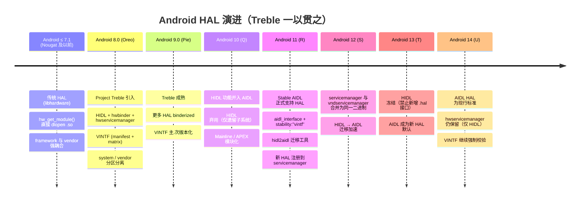

# Android HAL 版本演进史（Android 7.1 → 14）

> 一条主线：**Project Treble（Android 8.0）** 把 framework 与 vendor 解耦，HAL 从"直接 dlopen 的 .so"演进为"跨进程、版本化、经 binder 的接口定义语言（HIDL → AIDL）"。

---

## 0. 总览时间线

---

## 1. 前 Treble 时代（≤ Android 7.1 / Nougat）

| 维度 | 说明 |
|------|------|
| 接口定义 | `hardware/libhardware/include/hardware/hardware.h`：`hw_module_t` / `hw_device_t` |
| 加载方式 | `hw_get_module()` 按 `ro.hardware`、`ro.product.board` 等属性查找 `.so`，**直接 `dlopen` 进调用进程** |
| 模块路径 | `/system/lib/hw/` + `/vendor/lib/hw/`，形如 `<module>.default.so`、`<module>.<variant>.so` |
| 进程模型 | HAL `.so` 被加载进 framework 进程（`surfaceflinger`、`audioserver`、`system_server` 等）——**同进程、无隔离** |
| 版本契约 | 无。framework 与 vendor 代码强耦合，**OTA 升级必崩 vendor 实现** |

这是 Treble 要解决的痛点：每次 Android 大版本升级，芯片厂都要重新适配 HAL，导致碎片化。

---

## 2. Android 8.0（Oreo）— Project Treble，分水岭

- **HIDL（HAL Interface Definition Language，读作 "hide-l"）** 引入，定义在 `hardware/interfaces/*`，文件后缀 `.hal`。
- HAL 变为**独立进程**，framework 与 HAL 通过 **`hwbinder`** IPC 通信。
- **`hwservicemanager`**（`/vendor/bin/hwservicemanager`，域 `/dev/hwbinder`）负责 HIDL 服务注册。
- **VINTF** 引入：`vendor manifest` + `framework compatibility matrix`，启动时做匹配校验。
- **分区分离**：`/system`（framework）与 `/vendor`（HAL）解耦，framework 可独立 OTA。
- HAL 两种模式：
  - **Binderized**：HAL 独立进程，跨进程（launch 设备必须）。
  - **Passthrough**：HIDL 包裹传统 HAL，同进程（仅 upgrade 设备、少数 HAL 如 `graphics.mapper`/`renderscript`）。

---

## 3. Android 9.0（Pie）— Treble 成熟

- 更多 HAL 强制 binderized。
- VINTF 引入 **major.minor 版本语义**：major = 不兼容变更，minor = 兼容新增。
- `lshal` 工具、VTS（Vendor Test Suite）强化。
- 动态分区（`dynamic partitions`） groundwork，为后续 `super` 分区铺垫。

---

## 4. Android 10（Q）— HIDL 功能并入 AIDL，HIDL 弃用

- 官方 Treble 文档明确：**"In Android 10, HIDL functionality was merged into AIDL. From then on, HIDL was deprecated, used only by subsystems not yet converted to AIDL."**
- **Mainline / APEX** 模块化启动（部分系统组件可独立更新）。
- GSI（Generic System Image）成为 launch 设备强制要求。

---

## 5. Android 11（R）— Stable AIDL 正式支持 HAL（关键转折）

- **Stable AIDL 支持定义 HAL**：`aidl_interface` Soong 模块 + `stability: "vintf"`。
- AIDL HAL 全部 **binderized**，复用标准 **`libbinder`**，注册到 **`servicemanager`**（域 `/dev/binder`）——**不走 `hwservicemanager`**。
- 引入 **`hidl2aidl`** 工具，自动把 `.hal` 生成 AIDL stub，辅助迁移。
- AIDL 相比 HIDL 的优势（官方对比）：语法接近 Java、统一 IPC 后端、编译更快、ABI 稳定、Java/C++ 对等更好。

---

## 6. Android 12（S）— servicemanager / vndservicemanager 二进制合并

- `servicemanager` 与 `vndservicemanager` 合并为**同一二进制** `system/bin/servicemanager`，靠启动参数/context 区分（分别挂 `/dev/binder` 与 `/dev/vndbinder`）。
- HIDL → AIDL 迁移加速（audio、vibrator 等核心 HAL 完成）。
- 三个 binder 域至此稳定：**`/dev/binder`（system 服务 + AIDL HAL）、`/dev/hwbinder`（HIDL HAL）、`/dev/vndbinder`（vendor↔vendor）**。

---

## 7. Android 13（T）— HIDL 冻结

- **HIDL 冻结**：禁止新增任何 `.hal` 接口；所有新 HAL 必须 AIDL。
- 更多核心子系统完成迁移（NNAPI、sensors 等）。
- AIDL HAL 版本化（包名体现大版本，如 `bluetooth2`），向后兼容变更原地完成。

---

## 8. Android 14（U，当前）— AIDL HAL 为现行标准

- **AIDL HAL 是标准**；HIDL 仅遗留兼容，仍由 `hwservicemanager`（域 `/dev/hwbinder`）服务。
- `init.rc` 中 `servicemanager` / `hwservicemanager` / `vndservicemanager` **三者都在**。
- VINTF 校验持续强制：不匹配的 HAL 被 `servicemanager` 拒绝注册 → HAL server 崩溃。
- 内核侧：`drivers/android/binder.c`（GKI `android14-6.1`）同时服务三个 binder 域。

---

## 9. 三个 binder 域对照（Android 14）

| 服务管理器 | 二进制 | binder 节点 | 域 | 管理对象 |
|-----------|--------|------------|-----|---------|
| `servicemanager` | `system/bin/servicemanager` | `/dev/binder` | framework ↔ framework / **AIDL HAL** | 系统服务 + 新 AIDL HAL |
| `hwservicemanager` | `vendor/bin/hwservicemanager` | `/dev/hwbinder` | framework ↔ **HIDL HAL** | 遗留 HIDL HAL |
| `vndservicemanager` | `system/bin/servicemanager`（同二进制） | `/dev/vndbinder` | vendor ↔ vendor | vendor 进程间服务 |

> **约束（Treble 红线）**：system 代码只能用 `/dev/binder`，vendor 代码只能用 `/dev/vndbinder`，跨边界调用一律走已声明的 HAL 接口；vendor 代码禁止直接调用 framework 私有 API。

---

## 10. 纠错记录（相对本工作区前版 HAL 文档）

- **前版误述**："`hwservicemanager` 已不存在为独立进程 / Android 14 没有 hwservicemanager"。
- **正解**：`hwservicemanager` 在 Android 14 **仍存在**，仅服务于遗留 HIDL；新 AIDL HAL 注册到 `servicemanager`，所以"新 HAL 不走 hwservicemanager"。`hal_android14.md` 与 `hal_android14.html` 的"变化 2"已修正。

---

*配套文档：`hal_android14.md`（架构深度）/ `hal_android14.html`（可视化）。版本节点依据 AOSP 官方文档与 Android 14 源码。*
