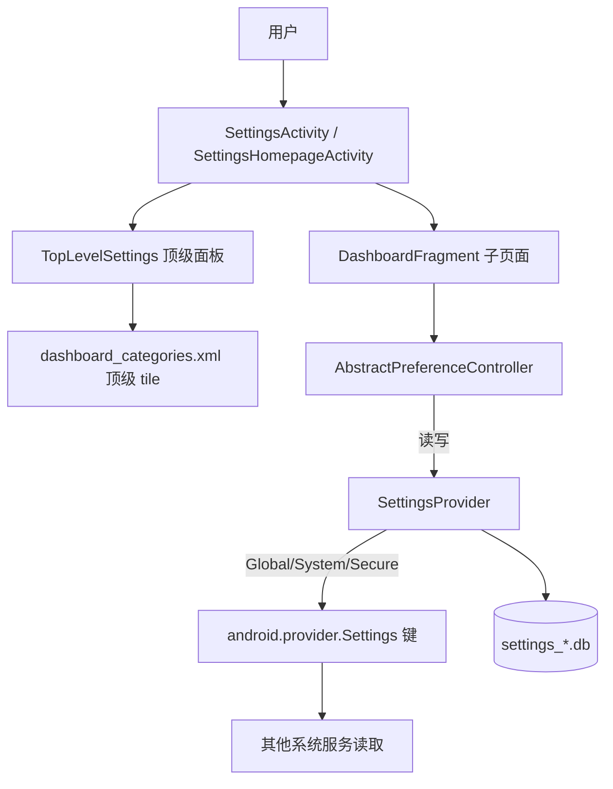

# Setting 修改实战（Android 14 / AOSP）

> 目标版本：**Android 14 (UpsideDownCake, API 34)**。路径以 `android-14.0.0_rXX` 为准，具体 tag 行号可能微偏。

## 0 关键认知：Setting 是「两层」的

修改 Settings 最大的坑是**分不清改的是哪一层**：

| 层 | 仓库/模块 | 改了什么 | 编译产物 |
|----|-----------|----------|----------|
| **UI 层** | `packages/apps/Settings` | 页面、开关、条目、文案、图标 | `Settings.apk`（`/system/priv-app/Settings`） |
| **存储层** | `frameworks/base/core/java/android/provider/Settings.java` + `frameworks/base/packages/SettingsProvider` | 一个新的设置键（如 `demo_switch`）、默认值 | `framework.jar` + `SettingsProvider.apk` |

- 只在 UI 上加个开关、挪个条目 → **只动 `Settings.apk`**，最轻。
- 要新增一个**持久化的系统设置项**（让别的系统服务也能读）→ **必须动存储层**，编译范围重得多。

上层 UI 通过 `Settings.Global` / `Settings.System` / `Settings.Secure` 的 `get/put` 读写，真正的落盘在 `SettingsProvider`，底层是 `data/system/users/<id>/settings_global.xml`（或 `_secure` / `_system`）对应的 SQLite。

---

## 1 Settings App 架构速查

| 你想改的行为 | 落点文件 | 关键类 / 方法 |
|--------------|----------|---------------|
| 设置 App 入口 / 各子页的 Activity 别名 | `packages/apps/Settings/AndroidManifest.xml` | `<activity>` / `<activity-alias>` 的 `com.android.settings.FRAGMENT_CLASS` meta-data |
| 首页顶级面板 | `src/com/android/settings/homepage/TopLevelSettings.java` | `DashboardFragment` 子类，读取 tiles |
| 首页顶级 tile 定义 | `res/xml/dashboard_categories.xml` | `<dashboard-tile>`（含 `id`/`title`/`icon`/`fragment`） |
| 某个子设置页 | `src/com/android/settings/.../*Settings.java` | 继承 `DashboardFragment`，`getPreferenceScreenResId()` 返回 xml |
| 页内某个具体开关/条目 | `src/com/android/settings/.../*Controller.java` | 继承 `AbstractPreferenceController` / `BasePreferenceController` |
| 主页宿主 Activity | `src/com/android/settings/SettingsActivity.java` | `EXTRA_SHOW_FRAGMENT` 解析 → 实例化对应 Fragment |
| tile 解析引擎 | `src/com/android/settings/dashboard/DashboardFeatureProviderImpl.java` | 解析 `dashboard_categories.xml` 构造 `Preference` |

**核心模型**：`DashboardFragment` 持有多个 `AbstractPreferenceController`，每个 controller 管一个 `Preference`（key 必须和 xml 里的 `android:key` 对上）。controller 负责「是否显示（`getAvailabilityStatus`）」「显示什么（`updateState`）」「点击做什么（`handlePreferenceTreeClick`）」。



---

## 2 场景 A：在已有设置页加一个开关（最轻，只动 UI）

以「在「关于手机」页加一个自定义开关」为例。

**(1) 写 Controller**
```java
// src/com/android/settings/deviceinfo/MyDemoSwitchController.java
package com.android.settings.deviceinfo;

import com.android.settings.core.BasePreferenceController;
import android.provider.Settings;

public class MyDemoSwitchController extends BasePreferenceController {
    private static final String KEY = "my_demo_switch";

    public MyDemoSwitchController(android.content.Context c, String k) {
        super(c, k);
    }

    @Override
    public int getAvailabilityStatus() {
        return AVAILABLE;   // 或 CONDITIONALLY_UNAVAILABLE / DISABLED_DEPENDENT_SETTING
    }

    @Override
    public void updateState(androidx.preference.Preference preference) {
        androidx.preference.SwitchPreference p = (androidx.preference.SwitchPreference) preference;
        int v = Settings.Global.getInt(mContext.getContentResolver(), "my_demo_switch", 0);
        p.setChecked(v == 1);
    }

    @Override
    public boolean setChecked(boolean checked) {
        Settings.Global.putInt(mContext.getContentResolver(), "my_demo_switch", checked ? 1 : 0);
        return true;
    }

    @Override
    public boolean isChecked() {
        return Settings.Global.getInt(mContext.getContentResolver(), "my_demo_switch", 0) == 1;
    }
}
```

**(2) 在该页 xml 加 Preference**（如 `res/xml/about_settings.xml`）
```xml
<SwitchPreference
    android:key="my_demo_switch"
    android:title="我的演示开关"
    android:summary="读写 Settings.Global.my_demo_switch" />
```

**(3) 在该页 Fragment 注册 controller**
```java
// 在对应 *Settings.java 的 createPreferenceControllers() 里
@Override
protected List<AbstractPreferenceController> createPreferenceControllers(Context context) {
    List<AbstractPreferenceController> list = new ArrayList<>();
    list.add(new MyDemoSwitchController(context, "my_demo_switch"));
    return list;
}
```

**(4) 编译 / 验证**
```bash
m Settings -j$(nproc)
adb root && adb remount
adb push out/target/product/<device>/system/priv-app/Settings/Settings.apk /system/priv-app/Settings/
adb reboot
adb shell settings get global my_demo_switch   # 拨动开关后应为 1 / 0
```

---

## 3 场景 B：新增一个顶级设置页面（top-level）

**(1) 新建 Fragment**
```java
// src/com/android/settings/display/MyDemoSettings.java
package com.android.settings.display;

import com.android.settings.dashboard.DashboardFragment;
import com.android.settings.R;

public class MyDemoSettings extends DashboardFragment {
    private static final String TAG = "MyDemoSettings";

    @Override
    protected int getPreferenceScreenResId() { return R.xml.my_demo_settings; }
    @Override
    protected String getLogTag() { return TAG; }

    @Override
    protected List<AbstractPreferenceController> createPreferenceControllers(Context context) {
        return new ArrayList<>();   // 有子项再在此注册 controller
    }
}
```

**(2) 新建 `res/xml/my_demo_settings.xml`**
```xml
<PreferenceScreen xmlns:android="http://schemas.android.com/apk/res/android">
    <Preference
        android:key="my_demo_item"
        android:title="演示条目"
        android:summary="这是新增顶级页里的条目" />
</PreferenceScreen>
```

**(3) 在 `res/xml/dashboard_categories.xml` 加 tile**
```xml
<dashboard-category id="com.android.settings.category.device">
    <dashboard-tile
        id="my_demo_settings"
        title="@string/my_demo_title"
        icon="@drawable/ic_settings_my_demo"
        fragment="com.android.settings.display.MyDemoSettings" />
</dashboard-category>
```

**(4) 加字符串与图标**
- `res/values/strings.xml`：`<string name="my_demo_title">我的演示</string>`
- `res/drawable/ic_settings_my_demo.xml`：随便一个 vector 图标。

**(5)（可选）加深链 Activity 别名** —— 若要让 `am start` 或别的 App 直接打开此页，在 `AndroidManifest.xml` 加：
```xml
<activity-alias
    android:name=".Settings$MyDemoActivity"
    android:exported="true"
    android:targetActivity=".Settings">
    <meta-data android:name="com.android.settings.FRAGMENT_CLASS"
        android:value="com.android.settings.display.MyDemoSettings" />
    <intent-filter>
        <action android:name="android.intent.action.MAIN" />
        <category android:name="android.intent.category.DEFAULT" />
    </intent-filter>
</activity-alias>
```

**(6) 编译 / 验证**：同 §2.4（`m Settings` → push → reboot），首页应能见到新条目，点进去是新页。

---

## 4 场景 C：新增一个系统设置存储键（Global/System/Secure）

这是**最重**的一类——UI 想持久化一个被多个服务共享的开关时就需要。以新增 `Global.DEMO_SWITCH` 为例。

**(1) 在 `android.provider.Settings` 定义键**
```java
// frameworks/base/core/java/android/provider/Settings.java
public static final class Global extends NameValueTable {
    // ... 已有键 ...
    public static final String DEMO_SWITCH = "demo_switch";   // ← 新增
    // 若想让 App 能读，把它加进 PUBLIC_SETTINGS / 想让 App 写则加进可写列表
    // （Global 一般无白名单限制，secure/system 才需注意 PUBLIC/PRIVATE 列表）
}
```

**(2) 在 `SettingsProvider` 给默认值**
```java
// frameworks/base/packages/SettingsProvider/src/com/android/providers/settings/SettingsProvider.java
private void loadGlobalSettings(SQLiteDatabase db) {
    // ... 已有 ...
    loadSetting(db, Settings.Global.DEMO_SWITCH, 0);   // 默认 0
    // 也可从资源读：loadSetting(db, Settings.Global.DEMO_SWITCH,
    //     getContext().getResources().getInteger(R.integer.def_demo_switch));
}
```
> 若走资源默认值，还需在 `frameworks/base/packages/SettingsProvider/res/values/defaults.xml` 加 `<integer name="def_demo_switch">0</integer>`。

**(3) 编译范围（关键）**
```bash
m framework            # 重编 framework.jar，Settings.java 的常量才生效
m SettingsProvider     # 重编 provider（引用了上面的常量字符串）
adb root && adb remount
adb push out/.../system/framework/framework.jar /system/framework/
adb push out/.../system/priv-app/SettingsProvider/SettingsProvider.apk /system/priv-app/SettingsProvider/
adb reboot
```

**(4) 验证**
```bash
adb shell settings put global demo_switch 1
adb shell settings get global demo_switch    # → 1
# 重启后仍为 1，说明已落盘到 settings_global.xml
adb shell cat /data/system/users/0/settings_global.xml | grep demo_switch
```

---

## 5 编译与验证总表

| 你改了什么 | 编译命令 | 推送产物 | 是否需 reboot |
|------------|----------|----------|---------------|
| 仅 UI（场景 A/B） | `m Settings` | `Settings.apk` → `/system/priv-app/Settings/` | 是（priv-app 需重挂） |
| 新增存储键（场景 C） | `m framework` + `m SettingsProvider` | `framework.jar` + `SettingsProvider.apk` | 是 |
| 同时改 UI 读新键 | `m Settings` + 上面两者 | 三者都推 | 是 |

> 注：`Settings` 是 **priv-app**，必须保持 platform 签名。`m Settings` 产出的 APK 已用正确签名；**不要**用 `adb install -r` 覆盖系统 priv-app（常因签名/分区失败），务必 `adb push` 到 `/system/priv-app/Settings/` 后 reboot。

---

## 6 六个常见坑

1. **改错层**：只加 UI 开关却没在 `android.provider.Settings` 定义键 → `Settings.Global.getInt(...)` 拿到的是未知字符串，读不到（但不会因为字符串常量未定义而编译失败，因为是运行时字符串）。需要持久化/跨服务共享才走场景 C。
2. **controller 的 key 和 xml 对不上**：`android:key` 与 controller 构造传入的 key 必须完全一致，否则开关不显示或点击无反应。
3. **`getAvailabilityStatus` 返回了不可用**：返回 `DISABLED_DEPENDENT_SETTING` / `CONDITIONALLY_UNAVAILABLE` 时该 Preference 直接被隐藏。调试时先返回 `AVAILABLE` 确认能显示。
4. **top-level tile 不出现**：`dashboard_categories.xml` 的 `fragment` 全类名写错、或该 Fragment 没继承 `DashboardFragment`；改完必须重编 `Settings` 并 reboot（不是简单 push 资源）。
5. **新增存储键没重编 framework**：只 `m SettingsProvider` 不够，`Settings.java` 属于 `framework` 模块，键常量要编进 `framework.jar`，否则运行时键字符串虽然硬编码能工作，但别的读取方若引用常量会不一致。稳妥做法 `m framework` + `m SettingsProvider`。
6. **搜索不到新页**：顶级页若希望被设置内搜索命中，Fragment 需加 `@SearchIndexable` 注解并实现 `SearchIndexProvider`（现代 Settings 用 `BaseSearchIndexProvider`），否则只能在首页手动看到。

---

## 7 关联文档索引

- Binder / AIDL 机理 → `binder_aidl.md`、`android_framework_paper.md`
- AMS / ATMS 修改实战 → `ams_modify_practice.md`（含 3 份 patch）
- AOSP 编译 / 加系统 app / 改内核 → `android14_build.md`
- patch 模板 → `ams_patches/`（改 framework 服务的可直接套思路）
