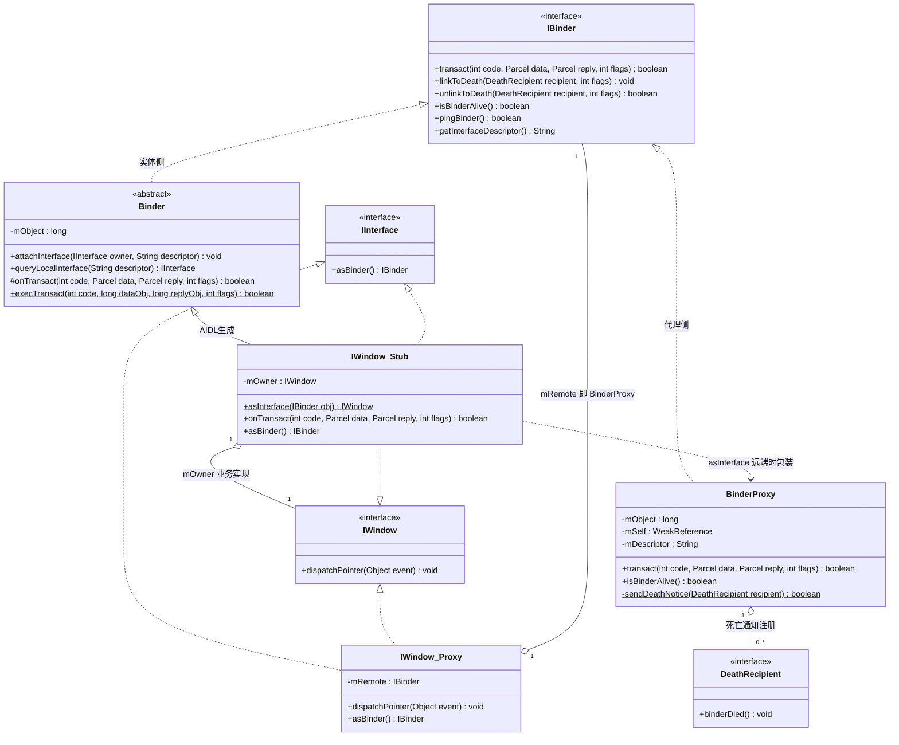
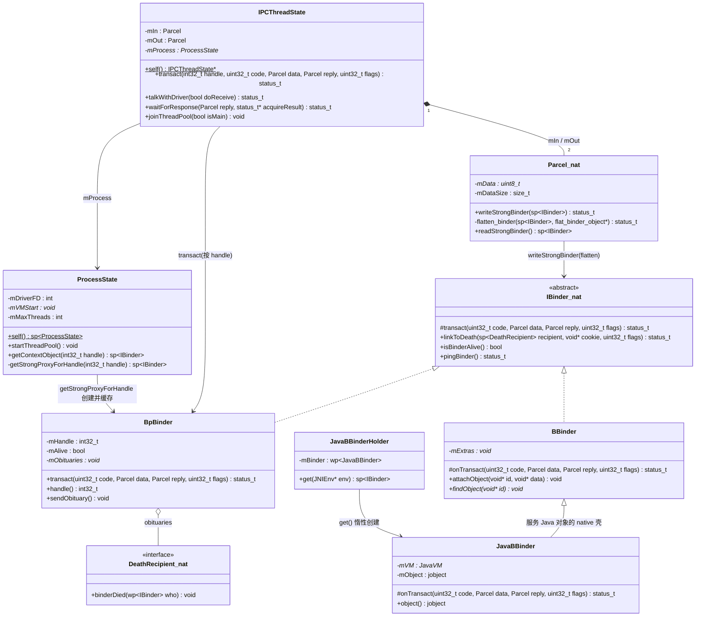
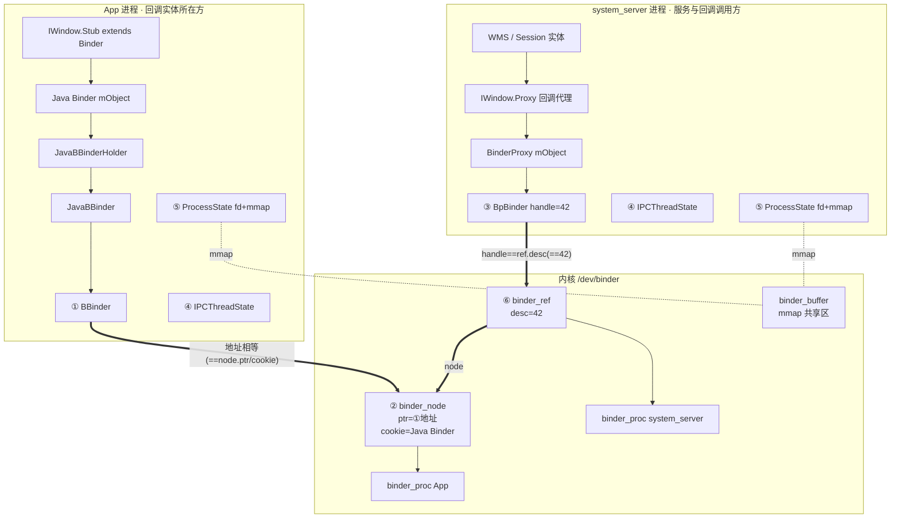

# Binder 双向通信（client → server → client）数据结构全解

Binder 的"回调"本质是：**同一个对象在不同进程里同时扮演 client 和 server**。核心在于内核如何把一个 `BBinder` 实体的"引用"传递到对端进程，让对端能反向调用回来。

---

## 一、总体角色模型

```
┌─────────── App 进程 (client) ───────────┐      ┌──────── system_server (server) ────────┐
│                                          │      │                                         │
│  IWindowManager.Proxy ────正向调用───────┼─────▶│  WindowManagerService (BBinder 实体)    │
│  (持有 BpBinder, handle=1)               │      │                                         │
│                                          │      │  WMS 内部持有:                          │
│  IWindow.Stub  ◀───────反向回调──────────┼──────│  IWindow.Proxy (回调代理)               │
│  (自己实现的 BBinder 实体)               │      │  (从 openSession(client) 参数中拿到)    │
│                                          │      │                                         │
│  IWindowSession.Proxy ───持续调用────────┼─────▶│  Session (BBinder 实体, openSession 返回)│
└──────────────────────────────────────────┘      └─────────────────────────────────────────┘
```

关键认知：**进程的角色由"调用方向"决定，不是固定的**。App 对 WMS 是 client，但 WMS 派发触摸事件时 App 又是 server。

---

## 二、四层数据结构栈

```
┌─────────────────────────────────────────────────────────────┐
│ Java 层                                                      │
│  IBinder          (接口)                                     │
│  ├─ Binder        (服务端实体, Java 类)                       │
│  │    └─ mObject → native BBinder*                          │
│  └─ BinderProxy   (客户端代理, JNI 创建)                     │
│       └─ mObject → native BpBinder* (handle)                │
│  IInterface/Stub/Proxy  (AIDL 生成: Stub=实体壳, Proxy=代理) │
├─────────────────────────────────────────────────────────────┤
│ Native 层 (libbinder)                                        │
│  BBinder          实体, onTransact() 处理请求                │
│  BpBinder         代理, 只存 handle, transact() 发请求       │
│  ProcessState     每进程 1 个: open("/dev/binder") + mmap    │
│  IPCThreadState   每线程 1 个: talkWithDriver() 收发         │
│  Parcel           序列化容器, 内含 flat_binder_object        │
├─────────────────────────────────────────────────────────────┤
│ Kernel 层 (/drivers/android/binder.c)                        │
│  binder_proc      进程上下文 (红黑树管理 nodes/refs)         │
│  binder_node      服务实体节点 (全局唯一)                    │
│  binder_ref       进程对 node 的引用 (desc=句柄号)           │
│  binder_buffer    mmap 缓冲区 (一次事务的数据, 零拷贝)       │
│  binder_transaction / binder_work / binder_thread           │
└─────────────────────────────────────────────────────────────┘
```

---

## 三、内核核心结构体

```c
// 每个打开了 /dev/binder 的进程一个
struct binder_proc {
    struct rb_root nodes;        // 本进程创建的所有 binder_node (服务实体)
    struct rb_root refs_by_desc; // 引用别人服务的 ref, 按句柄号排序 (transact 查这个)
    struct rb_root refs_by_node; // 同上, 按 node 排序 (清理用)
    struct list_head todo;       // 本进程待处理事务队列
    int max_threads;             // 线程池上限 (framework 默认 16)
    void *vm_start...;           // mmap 区域 (用户态与内核共享)
};

// 服务实体, 每个 Binder 对象一个, 全局唯一
struct binder_node {
    struct binder_proc *proc;    // 属于哪个进程 (实体所在进程)
    void __user *ptr;            // 用户态 BBinder 地址
    void __user *cookie;         // 透传的用户数据 (Java 层 Binder 对象)
    struct hlist_head refs;      // 所有引用本 node 的进程 ref 链表
    int internal_strong_refs;    // 强引用计数 (有 ref 存在则进程不能释放它)
};

// 引用: 每个进程 × 每个 node 一条
struct binder_ref {
    struct binder_proc *proc;    // 引用者进程
    uint32_t desc;               // ★ handle 句柄号, 进程内递增分配
    struct binder_node *node;    // 指向全局唯一实体
};

// Parcel 中传输的 binder 对象 (序列化后落在 binder_buffer 里)
struct flat_binder_object {
    uint32_t type;               // ★ BINDER_TYPE_BINDER / BINDER_TYPE_HANDLE / FD
    uint32_t flags;              // 优先级 / one-way 等标志
    union {
        void __user *binder;     // type=BINDER: 实体指针
        uint32_t handle;         // type=HANDLE: 句柄号
    };
    void __user *cookie;         // 仅 BINDER 类型: 回传给实体的上下文
};
```

**handle 与 node 的关系是理解回调的关键：**

- `binder_node` 全局唯一（真正的服务对象在内核的锚点）
- `binder_ref.desc`（即 handle）是**进程局部编号**——同一个 node 在 A 进程里 handle=3，在 B 进程里可能是 handle=7
- 驱动做的事就是 `handle ↔ node` 的双向翻译

---

## 四、正向调用：client → server 数据流

以 App 调 `WMS.addToDisplay()` 为例：

```
App 进程                                kernel                              system_server
─────────                               ──────                              ─────────────
Parcel 打包参数
   │
IPCThreadState::transact(handle=1, code)
writeTransactionData
   │ BC_TRANSACTION
   ▼
ioctl(BINDER_WRITE_READ) ─────▶ binder_ioctl
                                  │
                                  ▼
                             binder_transaction()
                             ① 取 target_proc = ref->node->proc
                             ② 在目标进程 mmap 区分配 binder_buffer
                             ③ 拷贝用户数据 (零拷贝: 直接写映射区)
                             ④ 改写 flat_binder_object (见第五节)
                             ⑤ 组装 binder_transaction, 挂到 target todo
                             ⑥ 唤醒目标进程等待线程
                                     │
                                     ▼                          BR_TRANSACTION
                                                             binder_thread_read
                                                             ▼
                                                        IPCThreadState::executeAndCall
                                                        ▼
                                                        BBinder::onTransact (0xBBinder*)
                                                             ▼
                                                        JavaBinder::exec_transact (JNI)
                                                             ▼
                                                        Binder.execTransact → Stub.onTransact
                                                             ▼
                                                        WMS 业务逻辑
                                                             ▼
                                                        BC_REPLY ──▶ 回写结果 ──▶ BR_REPLY
   ◀──────────────── 唤醒, 拿到 reply, transact 返回 ────────────────────────
```

调用线程**同步阻塞**直到 server 返回（除非 oneway）。

---

## 五、核心机制：回调对象的传递（flat_binder_object 类型改写）

这是 `client → server → client` 成立的根基。

**场景**：App 创建了 `IWindow.Stub` 实体（回调），作为参数传给 `openSession()`：

### 第 1 步：App 进程（实体所在）

```
┌────────────────────────────────────────────┐
│ new IWindow.Stub() {...}                   │
│ Parcel.writeStrongBinder(stub)             │
│   → flat_binder_object {                   │
│       type  = BINDER_TYPE_BINDER           │
│       binder= BBinder 用户态地址           │
│       cookie= Java Binder 对象             │
│     }                                      │
└────────────────────────────────────────────┘
```

### 第 2 步：kernel binder_transaction() 遇到 BINDER_TYPE_BINDER

```
┌────────────────────────────────────────────┐
│ ① 在发起进程(App)查/创建 binder_node       │
│    (node.ptr = BBinder 地址)               │
│ ② 在目标进程(system_server)创建 binder_ref │
│    ref.desc = 该进程下一个空闲句号 (如 42) │
│ ③ ★ 原地改写 flat_binder_object:          │
│    type   = BINDER_TYPE_HANDLE             │
│    handle = 42                             │
│ ④ node.refs 加入这条 ref (保活实体)        │
└────────────────────────────────────────────┘
```

### 第 3 步：system_server 进程（引用者）

```
┌────────────────────────────────────────────┐
│ Parcel.readStrongBinder()                  │
│   → 读到 BINDER_TYPE_HANDLE(42)            │
│   → 创建 BpBinder(42)                      │
│   → JavaBinderProxy(42)                    │
│   → IWindow.Stub.asInterface() → IWindow.Proxy │
│  WMS 存下这个 proxy ← ★ 回调句柄到手       │
└────────────────────────────────────────────┘
```

### 同一实体，三个进程三种视角

| 位置 | 数据结构 | 形态 |
|------|---------|------|
| App 进程 | `IWindow.Stub` → BBinder | **实体** (type=BINDER) |
| 内核 | `binder_node` (+ 各进程 `binder_ref`) | **锚点** |
| system_server | `BinderProxy` → BpBinder(handle=42) | **代理** (type=HANDLE) |

**传递方向决定类型**：实体所在进程向外传 → 内核改写成 HANDLE 给对方；句柄原路传回实体所在进程 → 内核识别出"这是你自己的 node" → 还原成 BINDER（对方拿到的是实体本体，调用变成本地直调，无 Binder 开销）。

---

## 六、反向调用：server → client 回调数据流

WMS 派发触摸事件回调 `IWindow.Proxy.dispatchPointer()`：

```
system_server                                    kernel                                 App 进程
─────────────                                    ──────                                 ─────────
IWindow.Proxy.dispatchPointer()
   │ Parcel 写入事件参数
BpBinder(42)::transact()
   │ BC_TRANSACTION (target handle=42)
ioctl ──────────────────────────▶ binder_transaction()
                                   ① ref = find_ref(proc, desc=42)
                                   ② node = ref->node
                                   ③ target_proc = node->proc ★ 直达 App
                                   ④ 数据拷入 App 的 mmap buffer
                                   ⑤ 唤醒 App 的 binder 线程池
                                                                        BR_TRANSACTION
                                                                        IWindow.Stub.onTransact
                                                                        dispatchPointer(事件)
                                                                        BC_REPLY
   ◀────────── result ──────────────────────────────────────────────────
```

对内核来说，回调和正向调用**走完全相同的路径**——只是此刻的 `node->proc` 指向了原来的 client。Binder 没有"方向"概念，只有 `handle → node → proc`。

---

## 七、线程模型（双向通信的死锁根源）

```
App 主线程 ─── call addToDisplay (阻塞) ───▶ WMS binder-thread-3 ─── dispatchPointer (阻塞) ───▶ App binder-thread-7
                等待 reply                                    等待 reply                        执行回调, 返回
                                                                                                  │
App 主线程 ◀──────────────────────── reply 逐层返回 ─────────────────────────────────────────────┘
```

**硬性要求：**

- 参与双向 Binder 的进程**必须开线程池**（`ProcessState::self()->startThreadPool()`），否则：主线程阻塞等 server 回复时，server 的回调无人处理 → 死锁
- framework 进程默认线程池上限 16（`binder_proc.max_threads`），驱动按 `BC_REGISTER_THREAD / BC_SPAWN_LOOPER` 动态拉起
- 经典死锁：单线程进程 A 同步调 B，B 的回调同步打回 A → A 唯一线程在等 B，A 的回调永远无法执行

**规避手段：**

| 手段 | 效果 |
|------|------|
| `transact(code, data, reply, FLAG_ONE_WAY)` | 异步发送立即返回，不占线程等待 |
| oneway + 接收方 Handler.post | 回调线程只做转投，业务在主线程处理 |
| 拆分接口 | 读接口与回调接口分离，避免同环 |

oneway 的内核语义：标记 `TF_ONE_WAY` 的事务不建立 `binder_transaction` 等待关系；同一 node 的 oneway 事务由 per-node 异步队列**保证有序**，且 buffer 不足时可能整包重试。

---

## 八、死亡通知：linkToDeath

双向依赖的另一面是**对端存活感知**：

```
App: proxy.linkToDeath(recipient)
  → BC_REQUEST_DEATH_NOTIFICATION(handle, cookie)
      kernel: binder_ref 上挂 death_work

WMS 进程退出
  → 驱动遍历其所有 binder_node → 各 ref 触发 death_work
  → 投递 BR_DEAD_BINDER 给引用方

App binder 线程收到
  → BinderProxy.sendDeathNotice()
  → DeathRecipient.binderDied()  ★ 在 binder 线程回调, 注意线程安全
```

Keyguard 中的实例：system_server 的 `KeyguardStateMonitor implements IBinder.DeathRecipient`——SystemUI 进程若崩溃，system_server 侧 `binderDied()` 触发，把 `mIsShowing` 等状态回退为默认（视为未锁屏），避免安全状态永久卡死。

---

## 九、框架经典实例映射

### 例 1：WindowManager（最标准的 client→server→client）

```
App                                system_server (WMS)
 │
 │ IWindowManager.openSession(IWindow client)   ← IWindow.Stub 作参数传出
 ├───────────────────────────────────────────▶ 创建 Session (IWindowSession.Stub)
 │◀─────────────────── return IWindowSession ──  (又一个 BBinder, 反向传回)
 │
 │ session.addToDisplay(...)                     正向: App=client
 ├───────────────────────────────────────────▶
 │◀─── IWindow.Proxy.dispatchPointer(event) ───  反向: WMS=client, 回调最初的 IWindow.Stub
```

### 例 2：Keyguard 体系（system_server ↔ SystemUI 互为 client/server）

```
system_server                                    SystemUI 进程
─────────────                                    ─────────────
KeyguardServiceDelegate
  └─ KeyguardServiceWrapper
       └─ IKeyguardService.Proxy (handle=N) ──正向──▶ KeyguardService
            onSystemReady()                          (IKeyguardService.Stub 实体)
            onStartedWakingUp()                          │
            setOccluded() / doKeyguardTimeout()          │ KVM 状态变化时
                                                         ▼
KeyguardStateMonitor                          反向: SystemUI=client
(extends IKeyguardStateController.Stub) ◀────────── 更新 mIsShowing / mOccluded
(Binder 实体在 system_server)                       (SystemUI 持有其 Proxy)
```

- 正向：system_server 是 client，调用 `IKeyguardService.Proxy`
- 反向：锁屏状态（showing/occluded）由 SystemUI 自主变化，通过回调实体（`IKeyguardStateController.Stub` 即 `KeyguardStateMonitor`，寄宿在 system_server）的代理通知回去——两个方向的 node/ref 各自独立成对

---

## 十、全景数据结构串联图

以 `openSession(IWindow client)` 双向调用为例，把从 Java 到内核的全部数据结构画在一张图里：

```
═══════ Binder 全景：两进程 + 内核，所有结构体一次看全 ═══════

      App 进程 (回调实体所在方)                     system_server 进程 (服务提供方)
┌───────────────────────────────────┐      ┌───────────────────────────────────────┐
│ 【Java 层】                        │      │ 【Java 层】                            │
│                                    │      │                                        │
│  new IWindow.Stub(){...}           │      │  IWindow.Proxy          Session         │
│     │ extends Binder               │      │    │ mRemote          (IWindowSession.Stub)│
│     ▼                              │      │    ▼                    │ mObject     │
│  Binder               WMS 服务对象  │      │  BinderProxy            ▼             │
│    │ mObject (long)   (JavaBBinder)│      │    │ mObject      Binder 实体         │
│    ▼ JNI                           │      │    ▼ JNI                               │
├────────────────────────────────────┤      ├────────────────────────────────────────┤
│ 【Native 层】                      │      │ 【Native 层】                          │
│                                    │      │                                        │
│  JavaBBinder ──▶ ① BBinder         │      │  ③ BpBinder                            │
│  (JNI 桥)          onTransact()    │      │     handle = 42                        │
│                         ▲          │      │  ④ IPCThreadState (binder 线程)        │
│  ④ IPCThreadState (主线程)          │      │     mIn/mOut Parcel                    │
│  ⑤ ProcessState                    │      │  ⑤ ProcessState                        │
│     fd = open(/dev/binder)          │      │     fd = open(/dev/binder)             │
│     mmap 1MB ◀──────────┐           │      │     mmap 1MB ◀──────┐                  │
│                         │           │      │                     │                  │
└─────────────────────────┼───────────┘      └─────────────────────┼──────────────────┘
                          │ ioctl                                  │ ioctl
                          ▼                                        ▼
┌══════════════════ KERNEL (/dev/android/binder.c) ══════════════════════════════┐
║ 【Kernel 层】                                                                    ║
║                                                                                  ║
║   binder_proc (App)                             binder_proc (system_server)      ║
║  ┌──────────────────────────┐                  ┌──────────────────────────┐      ║
║  │ nodes 红黑树              │                  │ refs_by_desc 红黑树       │      ║
║  │  └─ ② binder_node ★      │◀·node 指针·······│  └─ ⑥ binder_ref         │      ║
║  │     ptr  = ① BBinder 地址 │                  │     desc = 42 == ③.handle│      ║
║  │     cookie= Java Binder   │                  │     node ────┐            │      ║
║  │     refs ───┐             │                  │     proc ────┼──▶ 本进程  │      ║
║  │             │ ref 链表    │                  └──────────────┼────────────┘      ║
║  │ max_threads=16            │                                 │                  ║
║  │ todo [binder_work]        │        正向调用: session 等    │                  ║
║  └─────────────────────────┘                  ┌──────────────────────────┐      ║
║                                               │ nodes 红黑树              │      ║
║   binder_buffer (App mmap 区)                 │  └─ binder_node (Session)│      ║
║  ┌──────────────────────────┐                  │ refs_by_desc             │      ║
║  │ ...│flat_binder_object│  │                   │  └─ binder_ref(App引用)  │      ║
║  └──────────────────────────┘                  └─────────────────────────┘      ║
║                                                                                  ║
║   回调寻址链: ③ BpBinder(42) ──▶ ⑥ ref(desc=42) ──▶ ② node ──▶ node.proc=App    ║
╚══════════════════════════════════════════════════════════════════════════════════╝
```

### 6 条关键指针链（图中的全部连线）

```
链 1  Java 实体 → Native:   IWindow.Stub --mObject--> JavaBBinder ──▶ ① BBinder
链 2  Java 代理 → Native:   IWindow.Proxy --mRemote--> BinderProxy --mObject--> ③ BpBinder(handle=42)
链 3  实体 → 内核:          ① BBinder 的用户态地址 == ② binder_node.ptr / .cookie
链 4  代理 → 内核:          ③ BpBinder.handle(42)  == ⑥ binder_ref.desc
链 5  引用 → 实体:          ⑥ binder_ref.node ────▶ ② binder_node   (多对一)
链 6  实体归属:             ② binder_node.proc ───▶ binder_proc(App)  (决定事务投递目的地)
```

### 一次回调的完整旅程（跨全部 6 个结构）

```
步骤   位置             动作                                涉及结构
 T0   system_server   UI 线程决定派发触摸事件              -
 T1   Native          IWindow.Proxy.dispatchPointer()      AIDL Proxy
 T2   Native          BpBinder::transact(42, code)         ③ BpBinder
 T3   Native          写 mOut Parcel, ioctl()              ④ IPCThreadState + ⑤ ProcessState
 T4   Kernel          find_ref(proc, desc=42)              ⑥ binder_ref (refs_by_desc 树)
 T5   Kernel          ref->node                            ② binder_node
 T6   Kernel          node->proc == App                    binder_proc (目的地确定)
 T7   Kernel          在 App 的 mmap 区分配 buffer          binder_buffer (零拷贝)
 T8   Kernel          拷贝 + 改写 flat_binder_object        HANDLE→BINDER (还原)
 T9   Kernel          挂 todo, 唤醒 App binder 线程         binder_work / binder_thread
 T10  App Native      BR_TRANSACTION 读出                   ④ IPCThreadState
 T11  App Native      BBinder::onTransact(cookie)           ① BBinder
 T12  App JNI         JavaBBinder → Binder.execTransact     Java Binder
 T13  App Java        IWindow.Stub.dispatchPointer()        用户回调代码
 T14  原路 BC_REPLY   结果逆序返回 WMS                       (T13 → T1 逆向)
```

> 读图要点：①②（实体与 node）在被调方进程；③④⑤⑥（代理、线程、进程上下文、引用）在调用方进程。⑥ binder_ref 是唯一“跨边”的结构——它属于调用方进程，却指向被调方实体，正是“代理句柄”在内核的实体化身。

---

## 十一、Binder 数据结构 UML 类图

### 11.1 Java 层（frameworks/base/core/java/android/os/ + AIDL 生成类）



### 11.2 Native 层（frameworks/native/libs/binder/）



### 11.3 Kernel 层（drivers/android/binder.c，结构体完整图）

字段取自内核源码，关系按四组组织：**归属资源 → 引用反查 → 事务一生 → 队列调度**。

```mermaid
classDiagram
    direction LR

    class binder_proc {
        <<struct>>
        +proc_node : struct hlist_node
        +threads : struct rb_root
        +nodes : struct rb_root
        +refs_by_desc : struct rb_root
        +refs_by_node : struct rb_root
        +pid : int
        +tsk : struct task_struct*
        +is_dead : bool
        +todo : struct list_head
        +delivered_death : struct list_head
        +stats : struct binder_stats
        +max_threads : int
        +requested_threads : int
        +requested_threads_started : int
        +ready_threads : int
        +default_priority : long
        +alloc : struct binder_alloc
    }

    class binder_node {
        <<struct>>
        +debug_id : int
        +work : struct binder_work
        +rb_node : struct rb_node
        +dead_node : struct hlist_node
        +proc : struct binder_proc*
        +refs : struct hlist_head
        +ptr : void __user*
        +cookie : void __user*
        +internal_strong_refs : int
        +local_weak_refs : int
        +local_strong_refs : int
        +tmp_refs : int
        +has_strong_ref : bool
        +has_weak_ref : bool
        +pending_strong_ref : bool
        +pending_weak_ref : bool
        +has_async_transaction : bool
        +accept_fds : bool
        +min_priority : int
        +async_todo : struct list_head
    }

    class binder_ref {
        <<struct>>
        +data : struct binder_ref_data
        +rb_node_desc : struct rb_node
        +rb_node_node : struct rb_node
        +node_entry : struct hlist_node
        +proc : struct binder_proc*
        +node : struct binder_node*
        +death : struct binder_ref_death*
    }

    class binder_ref_data {
        <<struct>>
        +debug_id : int
        +desc : uint32_t
        +strong : int
        +weak : int
    }

    class binder_ref_death {
        <<struct>>
        +work : struct binder_work
        +cookie : void __user*
    }

    class binder_thread {
        <<struct>>
        +proc : struct binder_proc*
        +rb_node : struct rb_node
        +waiting_thread_node : struct list_head
        +pid : int
        +looper : int
        +looper_need_return : bool
        +transaction_stack : struct binder_transaction*
        +todo : struct list_head
        +process_todo : bool
        +return_error : int
    }

    class binder_transaction {
        <<struct>>
        +debug_id : int
        +work : struct binder_work
        +from : struct binder_thread*
        +from_parent : struct binder_transaction*
        +to_proc : struct binder_proc*
        +to_thread : struct binder_thread*
        +to_parent : struct binder_transaction*
        +need_reply : unsigned
        +buffer : struct binder_buffer*
        +code : unsigned int
        +flags : unsigned int
        +priority : long
        +saved_priority : long
        +sender_euid : kuid_t
    }

    class binder_buffer {
        <<struct>>
        +entry : struct list_head
        +rb_node : struct rb_node
        +free : unsigned
        +allow_user_free : unsigned
        +async_transaction : unsigned
        +transaction : struct binder_transaction*
        +target_node : struct binder_node*
        +data_size : size_t
        +offsets_size : size_t
        +extra_buffers_size : size_t
        +user_data : void __user*
        +pid : int
    }

    class binder_alloc {
        <<struct>>
        +mutex : struct mutex
        +vma : struct vm_area_struct*
        +vma_vm_mm : struct mm_struct*
        +buffer : void __user*
        +buffers : struct list_head
        +free_buffers : struct rb_root
        +allocated_buffers : struct rb_root
        +free_async_space : size_t
        +pages : struct binder_lru_page*
        +buffer_size : size_t
        +buffer_free : uint32_t
        +pid : int
    }

    class binder_work {
        <<struct>>
        +entry : struct list_head
        +type : enum binder_work_type
    }

    class binder_work_type {
        <<enumeration>>
        BINDER_WORK_TRANSACTION
        BINDER_WORK_TRANSACTION_COMPLETE
        BINDER_WORK_RETURN_ERROR
        BINDER_WORK_NODE
        BINDER_WORK_DEAD_BINDER
        BINDER_WORK_DEAD_BINDER_AND_CLEAR
        BINDER_WORK_CLEAR_DEATH_NOTIFICATION
    }

    class flat_binder_object {
        <<struct>>
        +hdr : binder_object_header
        +type : __u32
        +flags : __u32
        +binder : binder_uintptr_t (union, type=BINDER)
        +handle : __u32 (union, type=HANDLE)
        +cookie : binder_uintptr_t
    }

    %% ── 组1 归属: 进程拥有的三类资源 + 内存池 ───────
    binder_proc "1" o-- "0..*" binder_node : nodes 红黑树
    binder_proc "1" o-- "0..*" binder_ref : refs_by_desc + refs_by_node 双树
    binder_proc "1" o-- "0..*" binder_thread : threads 红黑树
    binder_proc "1" *-- "1" binder_alloc : 值成员 alloc
    binder_alloc "1" *-- "0..*" binder_buffer : buffers 链表 + 空闲/已用双树

    %% ── 组2 反查: ref→node→proc 事务路由唯一路径 ────
    binder_ref "0..*" --> "1" binder_node : node
    binder_ref "0..*" --> "1" binder_proc : proc
    binder_node "0..*" --> "1" binder_proc : proc
    binder_node "1" o-- "0..*" binder_ref : refs 链表·保活实体
    binder_ref "0..1" o-- "0..1" binder_ref_death : death

    %% ── 组3 事务: 一次 IPC 的一生 ────────────────
    binder_transaction "0..*" --> "0..1" binder_node : target_node
    binder_transaction "0..*" --> "1" binder_proc : to_proc
    binder_transaction "0..*" --> "0..1" binder_thread : from 发起
    binder_transaction "0..*" --> "0..1" binder_thread : to_thread 接收
    binder_transaction --> binder_transaction : from_parent·to_parent 链
    binder_transaction "0..*" --> "0..1" binder_buffer : buffer·互指
    binder_buffer "0..*" --> "0..1" binder_node : target_node·oneway
    binder_buffer --> flat_binder_object : 内含于 user_data·驱动原地改写 type

    %% ── 组4 队列: binder_work 在 todo 间流转 ─────────
    binder_proc "1" o-- "0..*" binder_work : todo
    binder_thread "1" o-- "0..*" binder_work : todo
    binder_work --> binder_work_type : type
    binder_thread --> binder_transaction : transaction_stack
```



**结构体职责速查表：**

| 结构体 | 实例粒度 | 一句话职责 |
|--------|---------|-----------|
| `binder_proc` | 每 open(/dev/binder) 进程 1 个 | 进程上下文，持有 nodes / refs / threads 三棵红黑树 |
| `binder_node` | 每个服务实体 1 个（全局唯一） | 实体锚点，ptr/cookie 指回用户态 BBinder |
| `binder_ref` | 每进程 × 每 node 1 条 | 句柄实体化，data.desc=handle，反查 node |
| `binder_thread` | 每参与线程 1 个 | 线程上下文，有自己的 todo 与事务栈 transaction_stack |
| `binder_transaction` | 每次同步 IPC 1 个（存活期） | 事务本体，from/to 四指针 + 双亲链实现嵌套调用 |
| `binder_buffer` | 每事务数据 1 块 | mmap 共享区里的实际数据块，与 transaction 互指 |
| `binder_alloc` | 每进程 1 个（内嵌 proc） | mmap 区管理：空闲/已分配双树 + LRU 页表 |
| `binder_work` | 每个待处理事件 1 个 | 调度单元，在 proc/thread 的 todo 间流转 |
| `binder_ref_death` | 每次 linkToDeath 1 个 | 死亡通知注册记录，其 work 触发 BR_DEAD_BINDER |
| `flat_binder_object` | Parcel 中每传 1 个 Binder 对象 1 个 | 跨进程传递 Binder 的序列化载体，type 可被驱动原地改写 |

### 11.4 跨层指针关联（三层串成一张图）



**三条硬关联（UML 之外的字节级对应）：**

| # | Java/Native 侧 | Kernel 侧 | 含义 |
|---|---------------|-----------|------|
| 1 | `① BBinder` 的用户态地址 | `② binder_node.ptr / .cookie` | 内核锚定实体的凭据 |
| 2 | `③ BpBinder.handle = 42` | `⑥ binder_ref.desc = 42` | 句柄即 ref 编号 |
| 3 | `⑤ ProcessState.mVMStart`（mmap 基址） | `binder_buffer`（分配在映射区内） | 零拷贝的数据通道 |

---

## 十二、一句话总结

> Binder 的双向通信 = **两次单向下调用 + 内核的 `flat_binder_object` 类型改写**。client 把自己的 `BBinder` 实体随事务传出时，内核在实体所在进程创建 `binder_node`、在对端进程创建 `binder_ref(desc=handle)` 并改写为 `BINDER_TYPE_HANDLE`；对端拿着这个 handle 反向 `transact` 时，内核经 `ref→node→proc` 又把事务送回原进程。**进程角色随调用方向切换，内核的 node/ref 对偶结构就是双向性的全部数据结构基础。**