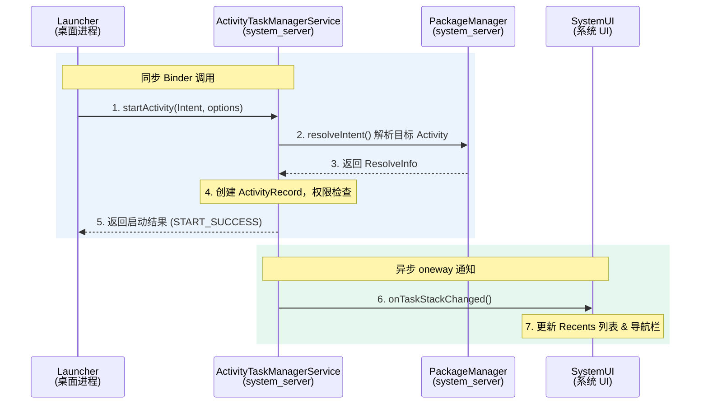

# Android Launcher3 深度解析

> Launcher3 是 AOSP 的默认桌面启动器，包名 `com.android.launcher3`。它负责管理主屏幕布局、应用启动、Widget 托管、拖拽交互等核心桌面体验。以下从**架构**、**功能模块**、**IPC 接口**和**定制开发**四个维度进行深度解析。

---

## 一、源码架构分析

### 1.1 核心类关系

| 类名 | 角色 | 职责说明 |
|------|------|----------|
| `Launcher` | Activity 入口 | 桌面主 Activity，管理生命周期与窗口，持有 Workspace/AllApps 等视图 |
| `LauncherModel` | 数据模型层 | 后台线程加载应用列表、Widget、文件夹，通过 Callbacks 接口回调 UI |
| `LauncherProvider` | ContentProvider | 基于 SQLite 的 favorites 表，持久化桌面布局（图标位置、文件夹、Widget） |
| `Workspace` | 主屏幕容器 | CellLayout 网格容器，管理多页滑动、快捷方式/Widget 的放置 |
| `AllAppsContainerView` | 应用抽屉 | RecyclerView 列表展示所有已安装应用，支持搜索过滤 |
| `DragController` | 拖拽引擎 | 处理长按拖拽、DropTarget 判定、动画反馈 |
| `WidgetHost` | AppWidget 宿主 | 实现 AppWidgetHost，管理远程视图的 inflate 与更新 |
| `InvariantDeviceProfile` | 设备配置 | 根据屏幕尺寸计算行列数、图标大小、文件夹布局参数 |

### 1.2 数据加载流程

> **架构要点**：Launcher3 采用"后台加载 + 主线程绑定"的异步架构。LauncherModel 在 Worker 线程中读取 LauncherProvider（SQLite）和 PackageManager，构建 ItemInfo 列表后通过 Callbacks 接口回调到 UI 线程进行视图绑定。

| 步骤 | 阶段 | 描述 |
|:----:|:----:|------|
| 1 | **启动** | `Launcher.onCreate()` → 创建 `LauncherModel` |
| 2 | **加载** | `LauncherModel.startLoader()` → 后台线程读取 DB + PackageManager |
| 3 | **绑定** | Loader 完成后通过 `Callbacks.bindWorkspace()` 回调 UI 线程 |
| 4 | **渲染** | `Workspace.addInScreenFromBinder()` 将 `ItemInfo` 渲染为 `BubbleTextView`/Widget |
| 5 | **交互** | 用户点击/拖拽 → `DragController` → 更新 DB → 刷新 UI |

---

## 二、核心功能模块

### 2.1 Workspace（主屏幕）

- **CellLayout 网格系统**：自动对齐图标到单元格
- **多页滑动**：`PagedView` 实现水平翻页
- **文件夹**：`FolderIcon` 聚合多个应用，展开为 Folder 弹窗
- **快捷方式**：`ShortcutInfo` 封装 Intent + 图标 + 标题

### 2.2 AllApps（应用抽屉）

- **AlphabeticalAppsList**：按字母排序 + 预测排序
- **搜索过滤**：实时匹配应用名/包名
- **Section Break**：按首字母分组显示
- **工作资料 Tab**：多用户/Profile 切换

### 2.3 Widget（小部件）

- **LauncherAppWidgetHost**：管理 widgetId 分配
- **PendingAddWidgetInfo**：Widget 添加预配置
- **WidgetResizeFrame**：支持用户调整 Widget 尺寸
- **Pin Widget API**：第三方应用申请固定 Widget

### 2.4 拖拽系统

- **DragSource 接口**：定义拖拽源（Workspace/AllApps/Folder）
- **DropTarget 接口**：定义放置目标（Workspace/DeleteZone/Info）
- **DragLayer**：全局拖拽覆盖层，处理坐标转换
- **SpringLoadedDragController**：边缘触发翻页

### 2.5 搜索

- **SearchDropTarget**：拖拽到顶部触发搜索/删除
- **AllApps 搜索栏**：实时过滤应用列表
- **QSB（Quick Search Box）**：桌面顶部搜索栏 Widget
- **Assist API**：长按 Home 触发语音助手

### 2.6 通知徽章

- **NotificationListener**：监听系统通知
- **NotificationInfo**：聚合每个应用的未读数
- **BadgeRenderer**：在图标右上角绘制红点/数字
- **dot-persisted**：重启后恢复徽章状态

---

## 三、关键接口 / IPC 通信

### 3.1 Binder / AIDL 接口清单

| 接口 | 方向 | 说明 |
|------|------|------|
| `IActivityTaskManager` | Launcher → system_server | `startActivity()`、`moveTaskToBack()`、`getRecentTasks()` |
| `IStatusBar` | system_server → SystemUI | `expandNotificationsPanel()`、`disable2()`、`setSystemUiVisibility()` |
| `ILauncherPreview` | Launcher ↔ system_server | 预览模式下的窗口状态同步（Android 12+） |
| `LauncherAppsService` | Launcher → system_server | `getActivityList()`、`registerCallback()`、`startSession()` |
| `AppWidgetService` | Launcher → system_server | `allocateAppWidgetId()`、`bindAppWidgetIdIfPossible()` |
| `LauncherProvider (CP)` | 跨进程查询 | 其他应用/系统通过 ContentResolver 查询桌面收藏数据 |
| `BroadcastReceiver` | 系统 → Launcher | `PACKAGE_ADDED/REMOVED`、`LOCALE_CHANGED`、`THEME_CHANGED` |

### 3.2 应用启动 Binder 时序图

> 展示从用户点击桌面图标到目标 Activity 启动完成的完整 Binder 事务流程：

**关键事务说明**：
- 步骤 1-5 为**同步 Binder 调用**（Launcher → ATMS → PackageManager → ATMS → Launcher）
- 步骤 6-7 为 ATMS 向 SystemUI 的**异步通知**（oneway Binder），SystemUI 据此更新最近任务列表和导航栏状态

---

## 四、定制与二次开发

### 4.1 设备配置 (InvariantDeviceProfile)

- `grid_num_rows` / `grid_num_columns`：桌面行列数
- `icon_size`：图标像素大小（dp）
- `folder_columns` / `folder_rows`：文件夹网格
- `device_type` 判定：phone / tablet / two-panel

### 4.2 主题与外观

- `IconProvider`：根据系统主题切换图标包
- `ThemedIconCache`：支持单色/自适应图标（Android 13+）
- `all_apps_rv_corner_radius`：应用抽屉圆角
- `workspace_shadow_*`：图标阴影参数

### 4.3 布局定制

- `device_profiles.xml`：定义多套屏幕配置
- `invariant_device_profile.xml`：默认网格参数
- `default_workspace_*.xml`：预置桌面布局
- `partner_overlay.apk`：厂商免修改覆盖资源

### 4.4 功能扩展

- **Quickstep**：与 SystemUI 共享最近任务（Android 10+）
- **Plugin API**：SystemUI 插件机制扩展 Launcher 行为
- **ShortcutManager**：动态快捷方式注册
- **LauncherOverlay**：负一屏/Google Discover 集成

### 4.5 厂商定制典型路径

<strong>修改桌面网格布局</strong>

1. 编辑 `res/xml/invariant_device_profile.xml` 调整 rows/columns/iconSize
2. 在 `device_profiles.xml` 中为不同屏幕密度定义配置
3. 通过 partner overlay APK 覆盖资源，无需修改源码

<strong>集成自定义 Widget</strong>

1. 实现 `AppWidgetProvider` 子类并声明 metadata XML
2. 在 `default_workspace.xml` 中预置 Widget 位置和尺寸
3. 使用 PinWidget API 允许第三方应用动态添加

<strong>Quickstep 最近任务集成</strong>

1. Android 10+ 中 Launcher3 与 SystemUI 共享 `RecentsView`
2. Quickstep 模块在 SystemUI 进程中运行，提供手势导航动画
3. 通过 `RecentsAnimationController` 协调窗口转场
4. 厂商可替换 `RecentsView` 实现自定义最近任务样式

<strong>主题与图标包适配</strong>

1. Android 13+ 支持 Themed Icons（自适应图标单色模式）
2. `IconProvider` 根据系统主题动态切换图标资源
3. 第三方图标包通过 Intent Filter 注册，Launcher3 扫描并应用
4. 壁纸感知着色：`WallpaperColorInfo` 提取主色调应用到文件夹背景

---

> 基于 AOSP Launcher3 (Android 14 / UP1A.231005.007)。不同厂商 ROM 的 Launcher3 分支可能存在较大差异。
