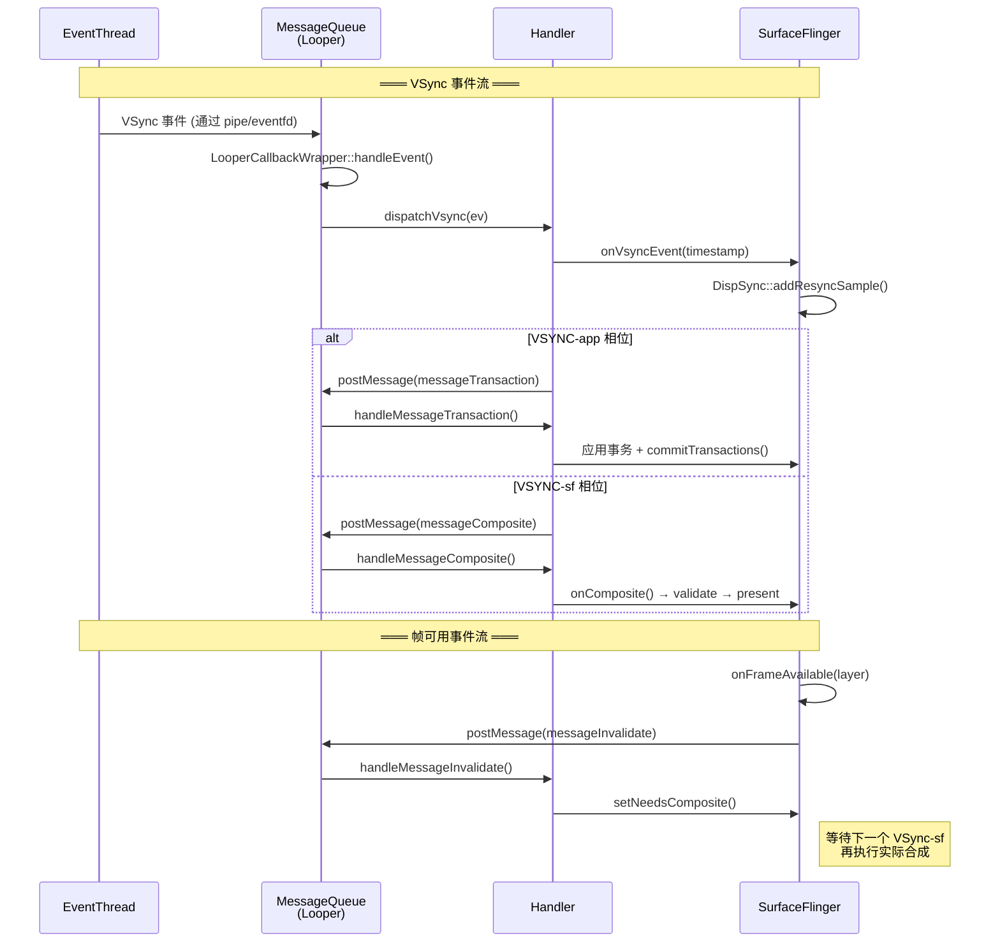
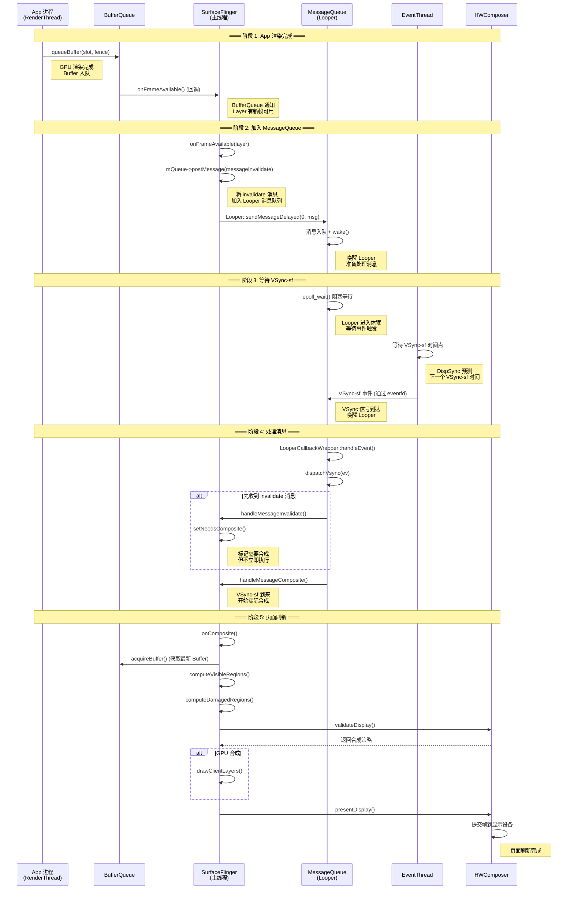

# SurfaceFlinger MessageQueue 深度分析

## 1. 概述与定位

MessageQueue 是 SurfaceFlinger 内部事件循环的核心基础设施，负责将来自不同来源的异步事件（VSync、事务提交、热插拔、帧回调等）统一调度到 SF 主线程执行。

```
┌──────────────────────────────────────────────────────────────┐
│                    SurfaceFlinger 进程                        │
│                                                              │
│  ┌──────────────┐    ┌──────────────────────────────────┐    │
│  │ 外部事件源    │    │         MessageQueue              │    │
│  │              │    │                                  │    │
│  │ VSync信号 ───┼───▶│  Looper (epoll)                  │    │
│  │ Binder事务 ──┼───▶│  ├─ Handler (SF主线程消息处理)    │    │
│  │ 热插拔事件 ──┼───▶│  ├─ IDisplayEventConnection     │    │
│  │ 帧完成回调 ──┼───▶│  └─ EventThread (VSync分发)      │    │
│  │              │    │                                  │    │
│  └──────────────┘    │  消息队列 (Message/MessageHandler)│    │
│                      └──────────┬───────────────────────┘    │
│                                 │                            │
│                                 ▼                            │
│                      ┌──────────────────┐                    │
│                      │ SurfaceFlinger   │                    │
│                      │ 主处理逻辑       │                    │
│                      │ handleMessage*() │                    │
│                      └──────────────────┘                    │
└──────────────────────────────────────────────────────────────┘
```

---

## 2. 核心类关系

```
MessageBase (抽象基类)
    │
    ├── MessageBase : public LightRefBase<MessageBase>
    │   ├── virtual void handler() = 0    // 消息处理逻辑
    │   └── virtual bool isConnected()    // 检查是否仍有效
    │
    ├── MessageComposite        // 合成消息
    ├── MessageTransaction      // 事务提交消息
    ├── MessageInvalidate       // 无效化消息
    ├── MessageCheckTransactionComplete  // 事务完成检查
    └── ...

MessageQueue
    │
    ├── Looper mLooper                    // Android Looper (基于 epoll)
    ├── MessageHandler mHandler           // 消息处理器 (绑定到 SF)
    ├── sp<IDisplayEventConnection> mEvents  // VSync 事件连接
    └── Handler (内部类)                  // 继承 MessageHandler
        ├── handleMessageTransaction()
        ├── handleMessageInvalidate()
        ├── handleMessageComposite()
        └── ...

EventThread (独立线程)
    │
    ├── Looper mLooper                    // 独立事件循环
    ├── sp<IDisplayEventConnection> mEvents
    └── 职责: 监听 VSync 信号，分发到 SF 主线程
```

---

## 3. MessageQueue 核心源码分析

### 3.1 MessageQueue 类定义

```cpp
// frameworks/native/services/surfaceflinger/SurfaceFlinger.h

class MessageBase : public LightRefBase<MessageBase> {
public:
    MessageBase() = default;

    // 消息处理入口，子类必须实现
    virtual void handler() = 0;

    // 检查消息是否仍然有效
    // 如果 SF 已销毁或相关对象失效，返回 false
    // Looper 会跳过无效消息
    virtual bool isConnected() const { return true; }

protected:
    virtual ~MessageBase() = default;
};

// ─── MessageQueue 核心 ───

class SurfaceFlinger::MessageQueue : public MessageBase {
public:
    // 消息类型常量
    enum {
        messageTransaction       = 0,  // 事务提交
        messageInvalidate        = 1,  // 触发合成
        messageRefresh           = 2,  // 强制刷新
        messageCheckTransactionComplete = 3,  // 事务完成检查
        messageComposite         = 4,  // 执行合成
        // ...
    };

    MessageQueue(SurfaceFlinger* flinger, const sp<SurfaceFlinger::Handler>& handler);

    // 初始化 Looper 和事件连接
    void init();

    // 消息投递接口
    void postMessage(const sp<MessageBase>& message, nsecs_t reltime = 0);

    // 等待消息 (阻塞)
    void waitMessage();

    // 事件监听
    sp<IDisplayEventConnection> getEventConnection() const;

private:
    SurfaceFlinger* mFlinger;
    sp<Handler> mHandler;               // 消息处理器
    sp<Looper> mLooper;                 // 事件循环
    sp<IDisplayEventConnection> mEvents; // VSync 事件连接
};
```

### 3.2 MessageQueue 初始化

```cpp
// frameworks/native/services/surfaceflinger/SurfaceFlinger.cpp

SurfaceFlinger::MessageQueue::MessageQueue(
        SurfaceFlinger* flinger,
        const sp<SurfaceFlinger::Handler>& handler)
    : mFlinger(flinger), mHandler(handler) {

    // 1. 创建 Looper (不使用回调，纯消息驱动)
    //    Looper 底层基于 Linux epoll
    mLooper = new Looper(false);

    // 2. 将 Handler 绑定到 Looper
    //    Handler 继承自 MessageHandler
    //    Looper 收到消息时回调 Handler::handleMessage()
    mHandler->setLooper(mLooper);

    // 3. 创建 DisplayEventConnection
    //    这是 SF 与 EventThread 之间的通信通道
    //    通过 Binder 获取 ISurfaceComposer 的 DisplayEventConnection
    mEvents = mFlinger->createDisplayEventConnection(
            ISurfaceComposer::eVsyncSourceApp);
    // eVsyncSourceApp: 监听 App 相位的 VSync
    // eVsyncSourceSurfaceFlinger: 监听 SF 相位的 VSync

    // 4. 注册事件监听到 Looper
    //    当 EventThread 有 VSync 事件时
    //    通过 pipe/eventfd 唤醒 Looper
    mLooper->addFd(
        mEvents->getFd(),             // 文件描述符
        0,                            // 标识符
        ALOOPER_EVENT_INPUT,          // 监听可读事件
        new LooperCallbackWrapper(this), // 回调
        nullptr);
}
```

**注解要点**：
- `Looper(false)` 参数表示不使用回调模式，纯消息队列模式
- `IDisplayEventConnection` 是 SF 与 EventThread 的桥梁，通过 Binder 跨进程通信
- Looper 通过 epoll 监听多个文件描述符，统一处理 VSync、Binder 事务等事件

### 3.3 消息投递机制

```cpp
// frameworks/native/services/surfaceflinger/SurfaceFlinger.cpp

void SurfaceFlinger::MessageQueue::postMessage(
        const sp<MessageBase>& message, nsecs_t reltime) {

    // 1. 将消息封装为 Looper Message
    //    reltime: 延迟时间 (纳秒)
    //    reltime = 0 表示立即投递
    //    reltime > 0 表示延迟投递 (用于定时合成等场景)

    // 2. 通过 Looper 投递消息
    //    Looper 内部使用 MessageList (按时间排序的链表)
    //    新消息插入到正确位置
    mLooper->sendMessageDelayed(reltime, mHandler, message);

    // 3. 唤醒 Looper
    //    如果 Looper 正在 epoll_wait 阻塞
    //    通过 eventfd/pipe 写入唤醒
    mLooper->wake();
}

// ─── 便捷方法 ───

void SurfaceFlinger::postCompositeMessage() {
    sp<MessageBase> msg = new MessageComposite(this);
    mQueue->postMessage(msg);
}

void SurfaceFlinger::postTransactionMessage() {
    sp<MessageBase> msg = new MessageTransaction(this);
    mQueue->postMessage(msg);
}

void SurfaceFlinger::postInvalidateMessage() {
    sp<MessageBase> msg = new MessageInvalidate(this);
    mQueue->postMessage(msg);
}
```

**注解要点**：
- 消息投递支持**延迟投递**：`reltime` 参数用于定时合成、去抖动等场景
- `wake()` 确保 Looper 立即处理新消息，不等待当前 epoll 超时
- 三种核心消息类型对应 SF 的三种主要工作：事务提交、合成、无效化

### 3.4 Handler 消息处理

```cpp
// frameworks/native/services/surfaceflinger/SurfaceFlinger.cpp

void SurfaceFlinger::Handler::handleMessage(const sp<MessageBase>& message) {
    // 根据消息类型分发到不同的处理方法

    switch (message->what) {
        case MessageQueue::messageTransaction:
            handleMessageTransaction();
            break;

        case MessageQueue::messageInvalidate:
            handleMessageInvalidate();
            break;

        case MessageQueue::messageRefresh:
            handleMessageRefresh();
            break;

        case MessageQueue::messageComposite:
            handleMessageComposite();
            break;

        case MessageQueue::messageCheckTransactionComplete:
            handleMessageCheckTransactionComplete();
            break;

        default:
            ALOGW("Unknown message type: %d", message->what);
            break;
    }
}

// ─── 事务处理 ───

void SurfaceFlinger::handleMessageTransaction() {
    // 1. 取出所有待处理事务
    //    mPendingStates: Layer 属性变更队列
    //    mPendingDisplays: Display 属性变更队列
    Vector<ComposerState> states;
    Vector<DisplayState> displays;
    {
        Mutex::Autolock _hl(mStateLock);
        states = std::move(mPendingStates);
        displays = std::move(mPendingDisplays);
    }

    // 2. 应用 Layer 属性变更
    for (auto& state : states) {
        sp<Layer> layer = state.layer.promote();
        if (layer != nullptr) {
            layer->setTransactionState(state);
            // 更新: position / size / alpha / z-order / crop / ...
        }
    }

    // 3. 应用 Display 属性变更
    for (auto& display : displays) {
        // 更新: 分辨率 / 旋转 / 电源状态
    }

    // 4. 双缓冲状态切换
    //    mCurrentState → mDrawingState
    commitTransactions();

    // 5. 触发合成
    setNeedsComposite();
}

// ─── 无效化处理 ───

void SurfaceFlinger::handleMessageInvalidate() {
    // 1. 标记需要重新合成
    //    通常在 Layer 有新帧到达时触发
    mRepaintEverything = true;

    // 2. 触发合成流程
    setNeedsComposite();
}

// ─── 合成处理 ───

void SurfaceFlinger::handleMessageComposite() {
    // 1. 检查是否真的需要合成
    if (!mNeedsComposite) {
        return;
    }
    mNeedsComposite = false;

    // 2. 执行合成流程
    onComposite();
    // 内部调用:
    //   computeVisibleRegions()
    //   computeDamagedRegions()
    //   HWComposer::validateDisplay()
    //   drawClientLayers() (如果需要 GPU 合成)
    //   HWComposer::presentDisplay()
}
```

**注解要点**：
- Handler 是消息的**分发中心**，根据消息类型调用对应的处理方法
- `handleMessageTransaction()` 是事务提交的入口，负责应用所有属性变更
- `handleMessageInvalidate()` 通常由 `onFrameAvailable()` 触发，标记需要重新合成
- `handleMessageComposite()` 是实际执行合成的入口

### 3.5 VSync 事件处理

```cpp
// frameworks/native/services/surfaceflinger/SurfaceFlinger.cpp

// Looper 回调：当 EventThread 有 VSync 事件时触发
int SurfaceFlinger::MessageQueue::LooperCallbackWrapper::handleEvent(
        int fd, int events, void* data) {

    MessageQueue* queue = static_cast<MessageQueue*>(data);

    // 1. 从 EventThread 读取 VSync 事件
    ssize_t n = queue->mEvents->getEvents(queue->mEventBuffer,
            sizeof(queue->mEventBuffer));

    // 2. 处理每个事件
    for (int i = 0; i < n; i++) {
        const DisplayEventReceiver::Event& ev = queue->mEventBuffer[i];

        switch (ev.header.type) {
            case DisplayEventReceiver::DISPLAY_EVENT_VSYNC:
                // VSync 事件
                queue->mHandler->dispatchVsync(ev);
                break;

            case DisplayEventReceiver::DISPLAY_EVENT_HOTPLUG:
                // 热插拔事件 (显示器连接/断开)
                queue->mHandler->dispatchHotplug(ev);
                break;
        }
    }

    return 1; // 继续监听
}

// ─── VSync 分发 ───

void SurfaceFlinger::Handler::dispatchVsync(
        const DisplayEventReceiver::Event& ev) {

    // 1. 更新 VSync 时间戳
    //    ev.header.timestamp 是硬件 VSync 的实际时间
    mFlinger->onVsyncEvent(ev.header.timestamp);

    // 2. 根据 VSync 相位决定触发什么操作
    //    VSYNC-app: 通知 App 开始渲染
    //    VSYNC-sf: 通知 SF 开始合成
    if (ev.vsync.count % 2 == 0) {
        // 偶数帧：触发事务处理
        mFlinger->postTransactionMessage();
    } else {
        // 奇数帧：触发合成
        mFlinger->postCompositeMessage();
    }
}

// ─── 热插拔处理 ───

void SurfaceFlinger::Handler::dispatchHotplug(
        const DisplayEventReceiver::Event& ev) {

    // 1. 通知 SurfaceFlinger 处理热插拔
    mFlinger->onHotplugReceived(ev.header.timestamp,
            ev.hotplug.connected);

    // 2. 内部逻辑:
    //    - 如果连接: 创建 DisplayDevice，初始化 HWC
    //    - 如果断开: 销毁 DisplayDevice，释放资源
    //    - 触发屏幕旋转/分辨率切换等
}
```

**注解要点**：
- VSync 事件通过 `IDisplayEventConnection` 从 EventThread 传递到 SF 主线程
- Looper 通过 epoll 监听文件描述符，实现**事件驱动**而非轮询
- 热插拔事件触发 DisplayDevice 的创建/销毁，涉及 HWC 重新配置

---

## 4. EventThread 独立线程分析

```cpp
// frameworks/native/services/surfaceflinger/Scheduler/EventThread.cpp

class EventThread : public Thread {
public:
    EventThread(const sp<VSyncSource>& src);

    // 线程主循环
    virtual bool threadLoop() override {
        // 1. 等待 VSync 信号
        nsecs_t timestamp = mVSyncSource->nextVSyncTimestamp();

        // 2. 等待到 VSync 时间点
        //    使用 nanosleep 或 hrtimer 精确等待
        sleepUntil(timestamp);

        // 3. 构造 VSync 事件
        DisplayEventReceiver::Event ev;
        ev.header.type = DisplayEventReceiver::DISPLAY_EVENT_VSYNC;
        ev.header.timestamp = timestamp;
        ev.vsync.count = mVSyncCount++;

        // 4. 分发给所有注册的连接
        //    每个连接对应一个 MessageQueue
        for (const auto& connection : mConnections) {
            connection->postEvent(ev);
            // 内部通过 Binder 发送到 SF 进程
            // SF 的 Looper 收到后触发回调
        }

        return true; // 继续循环
    }

private:
    sp<VSyncSource> mVSyncSource;  // VSync 信号源 (DispSync)
    Vector<sp<Connection>> mConnections;  // 注册的连接列表
    uint32_t mVSyncCount = 0;
};
```

**注解要点**：
- EventThread 是**独立线程**，与 SF 主线程分离
- 通过 `VSyncSource` (DispSync) 获取 VSync 时间戳
- 使用精确睡眠等待 VSync，避免轮询浪费 CPU
- 支持多个连接：App 和 SF 可以分别监听不同相位的 VSync

---

## 5. 消息流转时序图



---

## 6. 关键设计模式

### 6.1 双缓冲消息模型

```
主线程 (写入端)                    合成线程 (读取端)
    │                                   │
    │  postMessage(transaction)         │
    ├──────────────────────────────────▶│
    │                                   │  handleMessageTransaction()
    │  写入 mPendingStates              │  读取 mPendingStates (swap)
    │  修改 mCurrentState               │  读取 mDrawingState (快照)
    │                                   │
    │                                   │  onComposite()
    │                                   │  使用 mDrawingState 合成
    │                                   │
```

**要点**：
- 主线程写入 `mCurrentState`，合成线程读取 `mDrawingState`
- 事务提交时原子交换：`mCurrentState → mDrawingState`
- 保证合成过程中状态一致性，避免读写冲突

### 6.2 延迟合成策略

```cpp
void SurfaceFlinger::setNeedsComposite() {
    // 1. 标记需要合成
    mNeedsComposite = true;

    // 2. 但不立即合成，等待下一个 VSync-sf
    //    这样可以合并同一帧内的多次变更
    //    减少不必要的合成开销

    // 3. 如果长时间没有 VSync，设置定时器强制合成
    if (mPendingCompositeTime > 0) {
        mQueue->postMessage(
            new MessageComposite(this),
            mPendingCompositeTime - systemTime());
    }
}
```

**要点**：
- 延迟到 VSync-sf 再合成，与显示刷新同步
- 合并同一帧内的多次事务/帧可用事件
- 定时器兜底，避免长时间不合成导致画面停滞

### 6.3 事件驱动架构

```
┌─────────────────────────────────────────────────────────┐
│                    Looper (epoll)                        │
│                                                         │
│  ┌─────────────┐  ┌─────────────┐  ┌─────────────┐     │
│  │ FD: VSync   │  │ FD: Binder  │  │ FD: Timer   │     │
│  │ (EventThread)│  │ (事务提交)  │  │ (延迟消息)  │     │
│  └──────┬──────┘  └──────┬──────┘  └──────┬──────┘     │
│         │                │                │             │
│         └────────────────┼────────────────┘             │
│                          │                              │
│                    epoll_wait()                         │
│                          │                              │
│                          ▼                              │
│                  触发回调/消息处理                       │
└─────────────────────────────────────────────────────────┘
```

**要点**：
- 统一使用 epoll 监听多种事件源
- 事件驱动而非轮询，CPU 空闲时休眠
- 支持定时消息，实现延迟合成等策略

---

## 7. 性能优化要点

| 优化点 | 机制 | 效果 |
|--------|------|------|
| **消息合并** | 同一帧内多次 `setNeedsComposite()` 只触发一次合成 | 减少合成次数 |
| **延迟投递** | `postMessage(msg, reltime)` 支持定时投递 | 精确控制合成时机 |
| **批量处理** | `handleMessageTransaction()` 一次性处理所有 pending 事务 | 减少锁竞争 |
| **零拷贝同步** | Fence 机制避免 CPU 等待 | 降低延迟 |
| **事件驱动** | epoll 监听，无轮询开销 | 降低 CPU 占用 |

---

## 8. 常见问题排查

### 8.1 消息堆积

**现象**：帧率下降、画面卡顿

**原因**：
- 主线程阻塞（锁竞争、耗时操作）
- 消息处理慢于消息产生

**排查**：
```cpp
// 在 Handler::handleMessage() 添加日志
ALOGD("handleMessage: type=%d, queue_size=%zu",
      message->what, mLooper->getMessageCount());
```

### 8.2 VSync 丢失

**现象**：掉帧、画面撕裂

**原因**：
- EventThread 未及时分发 VSync
- DispSync 模型校准失败

**排查**：
```cpp
// 在 dispatchVsync() 添加日志
ALOGD("dispatchVsync: timestamp=%lld, count=%u",
      ev.header.timestamp, ev.vsync.count);
```

### 8.3 事务延迟

**现象**：UI 响应慢、动画延迟

**原因**：
- 事务消息投递延迟
- `handleMessageTransaction()` 处理慢

**排查**：
```cpp
// 在 postTransactionMessage() 记录时间
nsecs_t postTime = systemTime();
ALOGD("postTransactionMessage: %lld", postTime);

// 在 handleMessageTransaction() 记录时间
nsecs_t handleTime = systemTime();
ALOGD("handleMessageTransaction: latency=%lld ns",
      handleTime - postTime);
```

---

## 9. 总结

MessageQueue 是 SurfaceFlinger 的**事件调度中枢**，核心职责：

1. **统一事件源**：通过 Looper (epoll) 统一处理 VSync、Binder 事务、定时器等
2. **消息驱动**：将异步事件转化为消息，按序处理
3. **双缓冲状态**：分离写入端和读取端，保证合成一致性
4. **延迟合成**：合并同帧变更，与 VSync 同步
5. **事件驱动**：无轮询开销，CPU 空闲时休眠

设计模式：
- **生产者-消费者**：EventThread 生产 VSync，MessageQueue 消费
- **双缓冲**：mCurrentState / mDrawingState 分离
- **事件驱动**：epoll + 回调，高效低耗

---

## 10. App 渲染 → 等待 VSync-sf → SF 页面刷新 完整流程

### 10.1 流程概述

App 渲染完成后，**不会立即触发合成**，而是通过以下机制等待 VSync-sf 信号：

```
┌─────────────────────────────────────────────────────────────────────┐
│  App 渲染完成                                                        │
│      │                                                              │
│      ▼                                                              │
│  BufferQueue.queueBuffer()                                          │
│      │                                                              │
│      ▼                                                              │
│  onFrameAvailable() ──▶ 标记 Layer 有新帧                           │
│      │                                                              │
│      ▼                                                              │
│  postMessage(messageInvalidate) ──▶ 加入 MessageQueue               │
│      │                                                              │
│      ▼                                                              │
│  Looper 等待 VSync-sf 信号...                                       │
│      │                                                              │
│      ▼                                                              │
│  EventThread 分发 VSync-sf                                          │
│      │                                                              │
│      ▼                                                              │
│  handleMessageInvalidate() ──▶ setNeedsComposite()                  │
│      │                                                              │
│      ▼                                                              │
│  handleMessageComposite() ──▶ onComposite() ──▶ 页面刷新            │
└─────────────────────────────────────────────────────────────────────┘
```

### 10.2 详细时序图



### 10.3 关键机制详解

#### 10.3.1 为什么需要等待 VSync-sf？

```cpp
// 关键设计：延迟合成

void SurfaceFlinger::onFrameAvailable(const Layer* layer) {
    // 1. 仅标记有新帧，不立即合成
    layer->mRefreshPending = true;

    // 2. 发送 invalidate 消息
    mQueue->postMessage(new MessageInvalidate(this));

    // 3. 为什么不立即合成？
    //    - 如果立即合成，可能与显示扫描不同步
    //    - 导致画面撕裂 (tearing)
    //    - 无法合并同一帧内的多次变更
}

void SurfaceFlinger::handleMessageInvalidate() {
    // 1. 标记需要合成
    mNeedsComposite = true;

    // 2. 但不立即执行合成
    //    等待下一个 VSync-sf 信号
    setNeedsComposite();
}

void SurfaceFlinger::setNeedsComposite() {
    // 1. 标记需要合成
    mNeedsComposite = true;

    // 2. 等待 VSync-sf 触发实际合成
    //    VSync-sf 到来时，handleMessageComposite() 被调用
}

void SurfaceFlinger::handleMessageComposite() {
    // 1. 检查是否真的需要合成
    if (!mNeedsComposite) return;
    mNeedsComposite = false;

    // 2. 执行实际合成
    onComposite();
}
```

**要点**：
- **避免撕裂**：VSync-sf 与显示刷新同步，确保合成在安全时间点执行
- **合并变更**：同一帧内多次 `onFrameAvailable()` 只触发一次合成
- **流水线并行**：App 在 VSync-app 渲染下一帧，SF 在 VSync-sf 合成当前帧

#### 10.3.2 MessageQueue 的消息处理顺序

```cpp
// Looper 消息队列按时间排序

// 场景：App 渲染完成后，VSync-sf 还未到来

// 时间线：
// t0: App queueBuffer() → onFrameAvailable()
// t1: postMessage(messageInvalidate) → 消息入队
// t2: Looper 处理 invalidate 消息 → setNeedsComposite()
// t3: VSync-sf 到来 → postMessage(messageComposite)
// t4: Looper 处理 composite 消息 → onComposite()

// 关键点：
// - invalidate 消息立即处理（reltime = 0）
// - composite 消息在 VSync-sf 到来时才投递
// - 两者之间有短暂延迟，确保合成与显示同步
```

#### 10.3.3 VSync-sf 的触发时机

```cpp
// EventThread 分发 VSync 信号

void EventThread::threadLoop() {
    while (true) {
        // 1. 获取下一个 VSync 时间戳
        nsecs_t timestamp = mVSyncSource->nextVSyncTimestamp();

        // 2. 精确等待到该时间点
        sleepUntil(timestamp);

        // 3. 构造 VSync 事件
        DisplayEventReceiver::Event ev;
        ev.header.type = DISPLAY_EVENT_VSYNC;
        ev.header.timestamp = timestamp;
        ev.vsync.count = mVSyncCount++;

        // 4. 分发给所有连接
        for (auto& conn : mConnections) {
            conn->postEvent(ev);
            // 通过 eventfd 唤醒 SF 的 Looper
        }
    }
}

// DispSync 计算 VSync-sf 时间
// VSync-sf = VSync-hw + sfOffset
// sfOffset 通常是负值，让 SF 提前准备
```

### 10.4 完整代码流程追踪

```cpp
// ═══ 1. App 渲染完成 ═══

// frameworks/native/libs/gui/BufferQueueProducer.cpp
status_t BufferQueueProducer::queueBuffer(int slot, ...) {
    // ... Buffer 入队逻辑 ...

    // 通知消费者 (SurfaceFlinger)
    mCore->mConsumerListener->onFrameAvailable(item);
    return NO_ERROR;
}

// ═══ 2. SF 收到帧通知 ═══

// frameworks/native/services/surfaceflinger/SurfaceFlinger.cpp
void SurfaceFlinger::onFrameAvailable(const Layer* layer) {
    // 标记 Layer 有新帧
    layer->mRefreshPending = true;

    // 发送 invalidate 消息到 MessageQueue
    mQueue->postMessage(new MessageInvalidate(this));
}

// ═══ 3. 消息加入队列 ═══

// frameworks/native/services/surfaceflinger/SurfaceFlinger.cpp
void MessageQueue::postMessage(const sp<MessageBase>& message, nsecs_t reltime) {
    // 消息入队
    mLooper->sendMessageDelayed(reltime, mHandler, message);

    // 唤醒 Looper
    mLooper->wake();
}

// ═══ 4. Looper 等待 VSync-sf ═══

// frameworks/native/libs/utils/Looper.cpp
void Looper::pollInner(int timeoutMillis) {
    // epoll_wait 等待事件
    int eventCount = epoll_wait(mEpollFd, mEventItems, EPOLL_MAX_EVENTS, timeoutMillis);

    // 处理事件
    for (int i = 0; i < eventCount; i++) {
        int fd = mEventItems[i].data.fd;
        // 触发回调 (LooperCallbackWrapper::handleEvent)
    }

    // 处理消息队列
    mLooper->sendMessage();
}

// ═══ 5. VSync-sf 到来 ═══

// EventThread 通过 eventfd 发送 VSync 事件
// Looper 的 epoll_wait 被唤醒
// 触发 LooperCallbackWrapper::handleEvent()

int LooperCallbackWrapper::handleEvent(int fd, int events, void* data) {
    MessageQueue* queue = static_cast<MessageQueue*>(data);

    // 读取 VSync 事件
    queue->mEvents->getEvents(queue->mEventBuffer, ...);

    // 分发 VSync
    queue->mHandler->dispatchVsync(ev);

    return 1;
}

// ═══ 6. 处理 invalidate 消息 ═══

void Handler::dispatchVsync(const DisplayEventReceiver::Event& ev) {
    // 更新 VSync 时间戳
    mFlinger->onVsyncEvent(ev.header.timestamp);

    // 发送 composite 消息
    mFlinger->postCompositeMessage();
}

void SurfaceFlinger::handleMessageInvalidate() {
    // 标记需要合成
    mNeedsComposite = true;
    setNeedsComposite();
}

// ═══ 7. 执行合成 ═══

void SurfaceFlinger::handleMessageComposite() {
    if (!mNeedsComposite) return;
    mNeedsComposite = false;

    // 执行合成
    onComposite();
}

void SurfaceFlinger::onComposite() {
    // 1. 获取最新 Buffer
    for (auto& layer : mLayers) {
        if (layer->mRefreshPending) {
            layer->updateTexImage();
            // 内部调用 acquireBuffer()
        }
    }

    // 2. 计算可见区域
    computeVisibleRegions();

    // 3. 计算脏区域
    computeDamagedRegions();

    // 4. HWC 合成策略协商
    mHwc->validateDisplay(displayId);

    // 5. GPU 合成 (如果需要)
    drawClientLayers(displayId);

    // 6. 提交到显示设备
    mHwc->presentDisplay(displayId);
}
```

### 10.5 关键设计总结

| 设计点 | 机制 | 目的 |
|--------|------|------|
| **延迟合成** | `onFrameAvailable()` 仅标记，不立即合成 | 避免撕裂，与显示同步 |
| **消息驱动** | 通过 MessageQueue 传递 invalidate/composite 消息 | 统一事件处理 |
| **VSync 同步** | 等待 VSync-sf 信号再执行合成 | 确保合成在安全时间点 |
| **流水线并行** | App 在 VSync-app 渲染，SF 在 VSync-sf 合成 | 最大化吞吐量 |
| **变更合并** | 同一帧内多次 `onFrameAvailable()` 只触发一次合成 | 减少合成开销 |

### 10.6 常见问题

**Q: 为什么 App 渲染完成后不立即触发合成？**

A: 立即合成会导致以下问题：
1. **画面撕裂**：合成可能在显示扫描过程中执行，导致新旧帧混合
2. **无法合并变更**：同一帧内可能有多个 Layer 更新，立即合成会重复处理
3. **流水线效率低**：无法实现 App 渲染与 SF 合成的并行

**Q: VSync-sf 和 VSync-app 有什么区别？**

A:
- **VSync-app**：通知 App 开始渲染下一帧，相位靠前
- **VSync-sf**：通知 SF 开始合成当前帧，相位靠后（通常延迟几毫秒）
- 两者通过相位偏移错开，实现流水线并行

**Q: 如果 VSync-sf 到来时，App 还没渲染完怎么办？**

A:
- SF 会合成上一帧的 Buffer（如果有的话）
- 如果没有任何 Buffer，SF 会跳过合成，等待下一帧
- 这就是掉帧 (jank) 的原因之一
