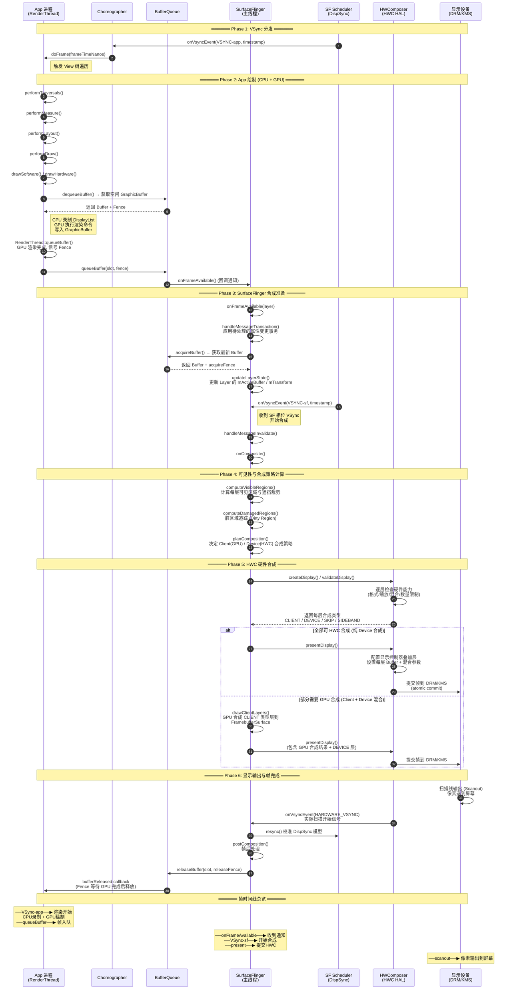

# App 绘制 → SurfaceFlinger → HWC 合成 → 显示 完整时序图

## 方法级时序图 (Mermaid)



---

## 关键方法调用链详解

### Phase 2 — App 绘制

| 方法 | 所属 | 说明 |
|------|------|------|
| `Choreographer.doFrame()` | App | VSync 回调入口，触发整帧处理 |
| `ViewRootImpl.performTraversals()` | App | 驱动 measure → layout → draw 流程 |
| `ThreadedRenderer.draw()` | App | 将 DisplayList 交给 RenderThread |
| `RenderThread::queueBuffer()` | App | GPU 渲染完成，将 Buffer 排入队列 |
| `BufferQueueProducer.queueBuffer()` | App→BQ | 将渲染好的 Buffer 入队，触发回调 |

### Phase 3 — SurfaceFlinger 接收

| 方法 | 所属 | 说明 |
|------|------|------|
| `onFrameAvailable()` | SF | BufferQueue 回调，标记 Layer 有新帧 |
| `handleMessageTransaction()` | SF | 应用 pending 事务（属性变更） |
| `Layer::updateTexImage()` | SF | 从 BufferQueue acquire 最新 Buffer |
| `BufferQueueConsumer.acquireBuffer()` | SF→BQ | 获取 Buffer 及 acquireFence |

### Phase 4 — 合成决策

| 方法 | 所属 | 说明 |
|------|------|------|
| `computeVisibleRegions()` | SF | 计算每层可见区域，处理遮挡裁剪 |
| `computeDamagedRegions()` | SF | 脏区域计算，减少重绘范围 |
| `HWComposer::validateDisplay()` | SF→HWC | 询问 HWC 每层的合成策略 |
| `HWC2::Device::validate()` | HWC | 硬件能力检查，返回 CLIENT/DEVICE/SKIP |

### Phase 5 — HWC 合成与提交

| 方法 | 所属 | 说明 |
|------|------|------|
| `drawClientLayers()` | SF | GPU 合成 CLIENT 类型层到 FBO |
| `HWComposer::presentDisplay()` | SF→HWC | 请求 HWC 提交最终帧 |
| `HWC2::Device::present()` | HWC | 配置显示控制器，提交到 DRM |
| `drmModeAtomicCommit()` | HWC→Kernel | DRM 原子提交，切换 Buffer |

### Phase 6 — 帧完成与回收

| 方法 | 所属 | 说明 |
|------|------|------|
| `onVsyncEvent(HARDWARE_VSYNC)` | HWC→SF | 硬件扫描开始信号 |
| `DispSync::addResyncSample()` | SF | 校准 VSync 相位模型 |
| `postComposition()` | SF | 帧后处理（写日志、统计等） |
| `BufferQueueConsumer.releaseBuffer()` | SF→BQ | 释放 Buffer 回队列 |

---

## 帧流水线并行示意

```
时间轴 ──────────────────────────────────────────────────────▶

App:     │← VSync-app →│  CPU/GPU 渲染 Frame N  │  queueBuffer
         │              │  (dequeue→draw→queue)  │
         │              │                        │
SF:      │              │  onFrameAvailable      │← VSync-sf →│ compute + HWC validate + present
         │              │  (缓存等待)            │             │ (acquire + composite + submit)
         │              │                        │             │
HWC:     │              │                        │             │← 配置叠加层 →│ atomic commit
         │              │                        │             │              │
Display: │              │                        │             │              │← scanout Frame N →│
         │              │                        │             │              │                    │

         │←─────────── 一帧总延迟 (Latency) ──────────────────│
```

> **关键点**：App 渲染与 SF 合成通过 **双缓冲 VSync 偏移** 实现流水线并行——App 在 `VSYNC-app` 相位渲染 Frame N+1 的同时，SF 在 `VSYNC-sf` 相位合成 Frame N，两者不互相阻塞。

---

## 核心方法源码级分析与注解

### 1. Choreographer.doFrame() — 帧驱动入口

```java
// frameworks/base/core/java/android/view/Choreographer.java

/**
 * @param frameTimeNanos  本次 VSync 的时间戳 (纳秒)
 *                        由 DispSync 预测生成，不是硬件原始值
 *                        用于整帧动画计算的统一时间基准
 */
void doFrame(long frameTimeNanos, int frame) {
    // 1. 计算掉帧数：当前时间 - 预期帧时间 > 帧间隔 → 判定掉帧
    long jitterNanos = frameTimeNanos - mLastFrameTimeNanos;
    if (jitterNanos > mFrameIntervalNanos) {
        long skippedFrames = jitterNanos / mFrameIntervalNanos;
        // 掉帧超过阈值则跳帧，直接对齐到最新 VSync
        if (skippedFrames >= MAX_SKIPPED_FRAMES) {
            frameTimeNanos = mLastFrameTimeNanos + skippedFrames * mFrameIntervalNanos;
        }
    }

    mLastFrameTimeNanos = frameTimeNanos;

    // 2. 按优先级依次执行四类回调
    beginFrame(frame);  // 标记帧开始，检查是否应该跳帧
    try {
        doCallbacks(ANIMATION, frameTimeNanos);   // ① 动画回调 (最高优先)
        doCallbacks(INSETS_ANIMATION, frameTimeNanos); // ② Insets 动画
        doCallbacks(TRVERSAL, frameTimeNanos);    // ③ View 遍历 (measure/layout/draw)
        doCallbacks(COMMIT, frameTimeNanos);      // ④ 提交回调
    } finally {
        endFrame(frame);  // 标记帧结束
    }
}
```

**注解要点**：
- `frameTimeNanos` 是 SF 侧 DispSync 预测值，保证所有 App 使用同一时间基准
- 掉帧检测逻辑：若主线程阻塞导致错过 VSync，会跳帧以避免动画卡顿累积
- `TRAVERSAL` 回调最终触发 `ViewRootImpl.performTraversals()`，驱动整个 View 树绘制

---

### 2. ViewRootImpl.performTraversals() — View 树遍历

```java
// frameworks/base/core/java/android/view/ViewRootImpl.java

private void performTraversals() {
    // ── 1. 准备阶段 ──
    // 检查 Surface 是否有效，若无效则重新创建
    if (mSurface == null || !mSurface.isValid()) {
        // 通过 WindowManagerService 重新获取 Surface
        // Surface 底层对应一个 BufferQueue 的 Producer 端
    }

    // ── 2. Measure 阶段 ──
    // 根据父容器约束 + 自身 LayoutParams 计算 View 尺寸
    performMeasure(childWidthSpec, childHeightSpec);
    // 内部调用 view.measure() → onMeasure()
    // 结果存入 mMeasuredWidth / mMeasuredHeight

    // ── 3. Layout 阶段 ──
    // 根据 Measure 结果确定每个 View 在屏幕上的位置
    performLayout(l, t, r, b);
    // 内部调用 view.layout() → onLayout()
    // 确定每个 View 的 mLeft, mTop, mRight, mBottom

    // ── 4. Draw 阶段 ──
    performDraw();
    // 最终调用 drawSoftware() 或 ThreadedRenderer.draw()
    // 将 View 树渲染到 GraphicBuffer 中
}
```

**注解要点**：
- 三个阶段的输出是下一阶段的输入：Measure → Layout → Draw 严格串行
- `performDraw()` 在硬件加速模式下，CPU 只负责录制 DisplayList（操作指令列表），实际 GPU 绘制在 RenderThread 中异步执行
- Surface 有效性检查涉及与 WMS 的 Binder 通信（`relayoutWindow()`）

---

### 3. BufferQueueProducer.queueBuffer() — Buffer 入队

```cpp
// frameworks/native/libs/gui/BufferQueueProducer.cpp

status_t BufferQueueProducer::queueBuffer(int slot,
        const QueueBufferInput &input, QueueBufferOutput *output) {

    // 1. 参数校验：slot 是否合法、Buffer 是否处于 QUEUED 状态
    //    防止重复入队或操作无效 slot

    // 2. 构造 Fence 对象
    //    input.fence 是 GPU 渲染完成的同步信号
    //    SF 必须等待此 Fence 后才能读取 Buffer 内容
    sp<Fence> fence = new Fence(input.fence);

    // 3. 更新 BufferSlot 状态
    {
        Mutex::Autolock lock(mCore->mMutex);
        BufferSlot& slotEntry = mCore->mSlots[slot];
        slotEntry.mBufferState.queue(input.frameNumber);
        // 状态转换: DEQUEUED → QUEUED

        // 4. 将 slot 加入 mQueue (FIFO 队列)
        mCore->mQueue.push_back(slot);

        // 5. 模式处理
        if (mCore->mQueueBufferType == NON_ASYNC) {
            // 同步模式：如果队列过长，丢弃最旧的帧
            // 保证 SF 拿到的永远是最新内容
            while (mCore->mQueue.size() > mCore->mMaxBufferCount) {
                mCore->mQueue.erase(mCore->mQueue.begin());
            }
        }
    }

    // 6. 通知消费者 (SurfaceFlinger)
    //    通过 ConsumerListener 回调
    mCore->mConsumerListener->onFrameAvailable(item);
    // 最终触发 SF 的 Layer::onFrameAvailable()

    return NO_ERROR;
}
```

**注解要点**：
- **Fence 机制**是核心：GPU 渲染和 SF 合成通过 Fence 实现零拷贝同步，无需 CPU 等待
- 同步模式下有丢帧策略，异步模式（如视频播放）使用 `ASYNC` 标记不丢帧
- `onFrameAvailable()` 回调是 SF 感知新帧的唯一途径，通过 Binder 跨进程传递

---

### 4. SurfaceFlinger.onFrameAvailable() — 帧通知处理

```cpp
// frameworks/native/services/surfaceflinger/SurfaceFlinger.cpp

void SurfaceFlinger::onFrameAvailable(const Layer* layer) {
    // 1. 标记该 Layer 有新帧可用
    //    设置 mRefreshPending = true
    //    触发下一轮合成

    // 2. 唤醒主线程消息循环
    mScheduler->scheduleComposite();
    // 内部通过 MessageQueue 发送 INVALIDATE 消息
    // 触发 handleMessageInvalidate() → onComposite()

    // 3. 注意：此时并未 acquireBuffer
    //    实际的 Buffer acquire 延迟到合成阶段
    //    这样可以获取到最新的一帧（减少延迟）
}
```

**注解要点**：
- 此方法仅做**标记 + 唤醒**，不做实际的 Buffer 操作
- 延迟 acquire 策略：在 VSync-sf 到来后才 acquire 最新 Buffer，确保拿到最近入队的帧
- `scheduleComposite()` 不会立即合成，而是等 VSync-sf 信号后才执行

---

### 5. SurfaceFlinger.handleMessageTransaction() — 事务提交

```cpp
// frameworks/native/services/surfaceflinger/SurfaceFlinger.cpp

void SurfaceFlinger::handleMessageTransaction() {
    // 1. 取出所有待处理事务
    Vector<ComposerState> states;
    Vector<DisplayState> displays;
    uint32_t flags = 0;
    {
        Mutex::Autolock _hl(mStateLock);
        // swap 操作保证 O(1) 取出
        states = std::move(mPendingStates);
        displays = std::move(mPendingDisplays);
        flags = mPendingTransactionFlags;
    }

    // 2. 应用 Layer 属性变更
    for (auto& state : states) {
        sp<Layer> layer = state.layer.promote();
        if (layer != nullptr) {
            // 将 pending 状态写入 Layer 的 mCurrentState
            layer->setTransactionState(state);
            // 更新属性：position / size / alpha / z-order / crop / ...
        }
    }

    // 3. 应用 Display 属性变更
    for (auto& display : displays) {
        // 更新显示配置：分辨率 / 旋转 / 电源状态
    }

    // 4. 双缓冲状态切换
    //    mCurrentState → mDrawingState (原子快照)
    //    合成线程读取 mDrawingState，主线程写入 mCurrentState
    //    保证合成过程中状态一致性
    commitTransactions();

    // 5. 触发重绘
    setNeedsComposite();
}
```

**注解要点**：
- **双缓冲状态模型**：`mCurrentState`（写入端）和 `mDrawingState`（读取端）分离
- 事务是原子的：所有 Layer 的属性变更在同一帧内同时生效
- `commitTransactions()` 会更新 Layer 树（z-order 排序、父子关系重建等）

---

### 6. HWComposer::validateDisplay() — 合成策略协商

```cpp
// frameworks/native/services/surfaceflinger/DisplayHardware/HWComposer.cpp

Error HWComposer::validateDisplay(int32_t displayId) {
    // 1. 向 HWC HAL 发送 validate 请求
    //    将所有 Layer 的信息传递给硬件
    Error error = mHwcDevice->validate(displayId,
            mDisplayData[displayId].hwcLayers);

    // 2. HWC HAL 内部逻辑 (硬件厂商实现)
    //    逐层检查：
    //    ├─ 像素格式是否支持 (RGBA/YUV/NV12/...)
    //    ├─ 缩放比例是否在硬件能力范围内
    //    ├─ 混合模式是否支持 (premultiplied/coverage)
    //    ├─ 总层数是否超过硬件叠加器数量 (通常 4-8 层)
    //    └─ 是否有冲突的裁剪/变换

    // 3. HWC 返回每层的合成类型
    //    通过 getChangedCompositionTypes() 获取
    for (auto& [layer, type] : mDisplayData[displayId].changedTypes) {
        switch (type) {
            case Composition::CLIENT:   // GPU 合成
                // HWC 无法处理，需要 SF 用 GPU 渲染到 FBO
                break;
            case Composition::DEVICE:   // 硬件合成
                // HWC 直接叠加，零 GPU 开销
                break;
            case Composition::SKIP:     // 跳过
                // 该层被完全遮挡，无需合成
                break;
            case Composition::SIDEBAND: // 旁路
                // 视频流等独立通道
                break;
        }
    }

    // 4. 如果有任何层从 DEVICE 变为 CLIENT
    //    需要重新 validate（因为 GPU 合成后结果
    //    作为新层再次提交给 HWC）
    if (hasClientComposition) {
        // 可能需要多轮 validate → present
        // 直到所有层类型稳定
    }

    return error;
}
```

**注解要点**：
- validate/present 是**两阶段协议**：先协商策略，再执行合成
- HWC 可能要求多轮 validate：当 GPU 合成产生新层后，需重新检查硬件能力
- `Composition::CLIENT` 越多，GPU 负载越大；`DEVICE` 越多，功耗越低
- 层数限制是常见问题：超过硬件叠加器数量时，部分层被迫走 GPU

---

### 7. HWComposer::presentDisplay() — 帧提交

```cpp
// frameworks/native/services/surfaceflinger/DisplayHardware/HWComposer.cpp

Error HWComposer::presentDisplay(int32_t displayId, sp<Fence>* outPresentFence) {
    // 1. 调用 HWC HAL 的 present 接口
    Error error = mHwcDevice->present(displayId, outPresentFence);

    // 2. HWC HAL 内部操作：
    //    a. 配置显示控制器 (Display Controller)
    //       为每个 DEVICE 层设置：
    //       ├─ Buffer 物理地址 / DMA fd
    //       ├─ 源裁剪 (sourceCrop)
    //       ├─ 显示区域 (displayFrame)
    //       ├─ 混合参数 (alpha / blending)
    //       └─ 变换 (旋转/翻转)
    //
    //    b. 调用 DRM 原子提交
    //       drmModeAtomicCommit(fd, req, flags, userdata)
    //       ├─ 将所有层配置打包为一个原子请求
    //       ├─ 内核驱动验证配置可行性
    //       └─ 在下一个 VSync 周期切换 Buffer

    // 3. outPresentFence 是提交完成的同步信号
    //    SF 用它来判断帧何时真正显示
    //    用于计算帧延迟和 jank 统计

    // 4. 对于 CLIENT 合成的层
    //    提交的是 GPU 渲染到 FramebufferSurface 的结果
    //    HWC 将其作为一个整体层叠加到最终输出

    return error;
}
```

**注解要点**：
- `presentFence` 是帧生命周期的关键节点：从提交到扫描完成的时间窗口
- DRM 原子提交保证所有层的配置变更同时生效，避免撕裂
- 对于混合合成模式，GPU 合成结果 + DEVICE 层一起提交给 HWC

---

### 8. DispSync::addResyncSample() — VSync 模型校准

```cpp
// frameworks/native/services/surfaceflinger/Scheduler/DispSync.cpp

bool DispSync::addResyncSample(nsecs_t timestamp) {
    // 1. 收集硬件 VSync 时间戳样本
    //    timestamp 来自 HWC 的 HARDWARE_VSYNC 事件
    //    是显示控制器实际开始扫描的时间

    // 2. 维护滑动窗口 (最近 MAX_RESYNC_SAMPLES 个样本)
    mResyncSamples[mResyncSampleIdx] = timestamp;
    mResyncSampleIdx = (mResyncSampleIdx + 1) % MAX_RESYNC_SAMPLES;

    // 3. 使用线性回归拟合 VSync 模型
    //    模型: VSync(t) = phase + period * k
    //    ├─ period: 帧周期 (16.6ms@60Hz / 8.3ms@120Hz)
    //    └─ phase:  相位偏移 (硬件 VSync 与理想时间的偏差)
    //
    //    通过最小二乘法拟合，消除硬件抖动影响
    updateModelLocked();

    // 4. 模型更新后，重新计算各相位的 VSync 偏移
    //    VSYNC-app  = model.phase + appOffset
    //    VSYNC-sf   = model.phase + sfOffset
    //    保证 App 和 SF 的 VSync 信号在时间上错开

    // 5. 返回是否需要重新分发 VSync
    //    如果模型变化较大，需要通知所有监听者
    return modelUpdated;
}
```

**注解要点**：
- DispSync 是 SF 的**时间基准引擎**，将不规则的硬件 VSync 建模为周期性信号
- 通过相位偏移分发不同用途的 VSync：App 渲染和 SF 合成在不同时间点触发
- 滑动窗口 + 线性回归消除硬件抖动，提供稳定的帧时间预测
- 模型校准质量直接决定掉帧率和 jank 程度

---

### 9. BufferQueueConsumer.releaseBuffer() — Buffer 回收

```cpp
// frameworks/native/libs/gui/BufferQueueConsumer.cpp

status_t BufferQueueConsumer::releaseBuffer(
        int slot, uint64_t frameNumber,
        const sp<Fence>& releaseFence) {

    // 1. 校验 slot 有效性
    {
        Mutex::Autolock lock(mCore->mMutex);
        BufferSlot& slotEntry = mCore->mSlots[slot];

        // 2. 状态转换: ACQUIRED → FREE
        slotEntry.mBufferState.release();

        // 3. 保存 releaseFence
        //    App 下次 dequeueBuffer 时
        //    必须等待此 Fence 信号后才能写入
        //    防止 SF 还在读取时 App 就开始覆写
        slotEntry.mFence = releaseFence;
        slotEntry.mFrameNumber = frameNumber;
    }

    // 4. 通知 Producer (App)
    //    通过 BufferStateListener 回调
    //    App 收到通知后可以 dequeue 此 slot
    mCore->mBufferFreeCondition.broadcast();

    // 5. 如果启用了 Buffer 释放回调
    if (mCore->mBufferReleasedListener != nullptr) {
        mCore->mBufferReleasedListener->onBufferReleased();
    }

    return NO_ERROR;
}
```

**注解要点**：
- `releaseFence` 是**写保护机制**：确保 SF 完成读取后 App 才能覆写 Buffer
- 整个 BufferQueue 的生命周期围绕 Fence 链运转：
  - `acquireFence`：GPU 渲染完成 → SF 可以读取
  - `releaseFence`：SF 读取完成 → App 可以写入
- Buffer 回收触发 App 端的 `dequeueBuffer()` 解除阻塞，开始下一帧渲染

---

## 方法调用关系总图

```
┌─────────────────────────────────────────────────────────────────────┐
│                         一帧完整生命周期                             │
├─────────────────────────────────────────────────────────────────────┤
│                                                                     │
│  DispSync ──VSYNC-app──▶ Choreographer.doFrame()                   │
│                              │                                      │
│                              ▼                                      │
│                     ViewRootImpl.performTraversals()                 │
│                     ├─ performMeasure()                              │
│                     ├─ performLayout()                               │
│                     └─ performDraw()                                 │
│                              │                                      │
│                              ▼                                      │
│                     RenderThread (GPU 渲染)                          │
│                              │                                      │
│                              ▼                                      │
│  BufferQueue ◀──dequeue── [App] ──queue──▶ BufferQueue              │
│       │                                    │                        │
│       │                              onFrameAvailable()             │
│       │                                    │                        │
│       │                                    ▼                        │
│       │                     SF.handleMessageTransaction()            │
│       │                     (应用属性变更事务)                       │
│       │                                    │                        │
│  DispSync ──VSYNC-sf──▶ SF.onComposite()                           │
│                              │                                      │
│                              ▼                                      │
│                     computeVisibleRegions()                          │
│                     computeDamagedRegions()                          │
│                              │                                      │
│                              ▼                                      │
│  SF ──validate──▶ HWC ◀──返回合成策略── HWC                         │
│       │                                    │                        │
│       │                    [GPU 合成 CLIENT 层]                     │
│       │                                    │                        │
│  SF ──present──▶ HWC ──atomicCommit──▶ DRM/KMS                     │
│                                            │                        │
│                                            ▼                        │
│                                      Display Scanout                │
│                                            │                        │
│                                      HARDWARE_VSYNC                 │
│                                            │                        │
│                                            ▼                        │
│                              DispSync.addResyncSample()             │
│                              (校准下一帧 VSync 模型)                │
│                                            │                        │
│                                            ▼                        │
│                              SF.postComposition()                   │
│                              BufferQueue.releaseBuffer()            │
│                              (Buffer 回收 → App 可 dequeue)         │
│                                                                     │
└─────────────────────────────────────────────────────────────────────┘
```
